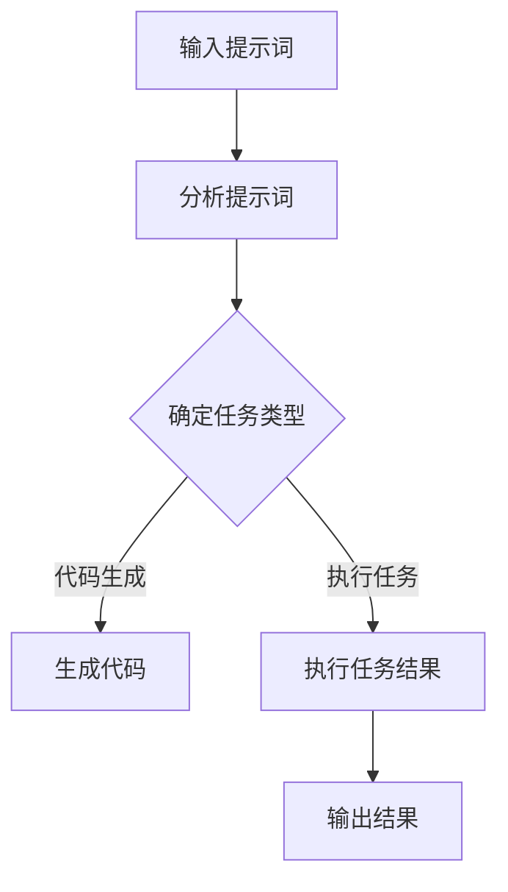

                 

# AI编程语言：提示词的魔力与科学

> **关键词**：AI编程语言、提示词、自然语言处理、深度学习、智能编程助手

> **摘要**：本文将深入探讨AI编程语言及其核心组件——提示词。我们将分析提示词在AI编程中的重要性，解释其工作原理，并通过实际案例展示如何利用提示词来提高编程效率和准确性。文章还将探讨当前的研究进展和未来发展趋势，为开发者提供实用的工具和资源推荐。

## 1. 背景介绍

### 1.1 目的和范围

本文旨在介绍AI编程语言和提示词的核心概念，并探讨其在现代软件开发中的应用。我们将重点关注以下几个方面：

1. 提示词的定义和作用
2. 提示词在AI编程中的工作原理
3. 提示词的优势和挑战
4. 当前的研究进展和未来趋势
5. 开发者和研究人员的工具和资源推荐

### 1.2 预期读者

本文适合以下读者群体：

1. 对AI编程语言和自然语言处理感兴趣的开发者
2. 想要了解AI在编程领域应用的程序员
3. AI研究人员和学者
4. 对计算机科学和人工智能有浓厚兴趣的本科生和研究生

### 1.3 文档结构概述

本文分为以下几个部分：

1. 背景介绍：介绍文章的目的、范围和预期读者
2. 核心概念与联系：解释AI编程语言和提示词的核心概念及其关系
3. 核心算法原理 & 具体操作步骤：详细阐述提示词的算法原理和实现步骤
4. 数学模型和公式 & 详细讲解 & 举例说明：介绍与提示词相关的数学模型和公式，并给出具体案例
5. 项目实战：提供实际的代码案例，并进行详细解读
6. 实际应用场景：探讨提示词在不同编程任务中的应用
7. 工具和资源推荐：推荐有用的学习资源和开发工具
8. 总结：总结文章的主要观点和未来发展趋势
9. 附录：常见问题与解答
10. 扩展阅读 & 参考资料：提供相关的参考文献和资料链接

### 1.4 术语表

#### 1.4.1 核心术语定义

- AI编程语言：一种结合了人工智能和编程技术的语言，旨在提高编程效率和准确性
- 提示词：一种在AI编程中用于指导程序执行的关键词或短语
- 自然语言处理（NLP）：研究如何让计算机理解和生成自然语言的技术
- 深度学习：一种基于多层神经网络的学习方法，能够自动从大量数据中提取特征和模式
- 智能编程助手：一种利用AI技术辅助程序员进行编程的工具

#### 1.4.2 相关概念解释

- **自然语言处理（NLP）**：自然语言处理是计算机科学和人工智能领域的子领域，旨在使计算机能够理解和生成人类语言。NLP广泛应用于搜索引擎、机器翻译、情感分析、语音识别等领域。
- **深度学习**：深度学习是一种基于多层神经网络的学习方法，能够自动从大量数据中提取特征和模式。深度学习在图像识别、语音识别、自然语言处理等领域取得了显著成果。
- **智能编程助手**：智能编程助手是一种利用AI技术辅助程序员进行编程的工具，可以提供代码补全、错误检测、代码优化等服务。

#### 1.4.3 缩略词列表

- NLP：自然语言处理
- AI：人工智能
- DL：深度学习
- IDE：集成开发环境
- GPU：图形处理器
- CNN：卷积神经网络
- RNN：循环神经网络
- LSTM：长短时记忆网络
- API：应用程序编程接口

## 2. 核心概念与联系

为了更好地理解AI编程语言和提示词的关系，我们首先需要了解它们的基本概念和架构。

### 2.1 AI编程语言

AI编程语言是一种结合了人工智能和编程技术的语言，旨在提高编程效率和准确性。与传统编程语言不同，AI编程语言通常具有以下特点：

- **自动化**：AI编程语言能够自动执行一些常规任务，如代码补全、错误检测、代码优化等。
- **适应性**：AI编程语言可以根据程序员的编程风格和项目需求进行自适应调整。
- **智能化**：AI编程语言可以利用深度学习和自然语言处理技术，从大量数据中提取特征和模式，从而实现更智能的编程辅助。

### 2.2 提示词

提示词（Prompt）是在AI编程中用于指导程序执行的关键词或短语。提示词通常包含以下信息：

- **任务描述**：描述程序需要执行的任务，如“编写一个函数，实现两个数的加法”。
- **上下文信息**：提供与任务相关的上下文信息，如“在Python中实现该函数”。
- **约束条件**：定义任务执行的约束条件，如“输入必须是整数”。

### 2.3 AI编程语言与提示词的关系

提示词是AI编程语言的核心组成部分，它决定了AI编程语言的执行方式和能力。具体来说，提示词在AI编程中的关系如下：

- **输入**：AI编程语言首先接收提示词作为输入，并根据提示词的内容进行任务规划和执行。
- **处理**：AI编程语言利用深度学习和自然语言处理技术对提示词进行分析和理解，提取任务相关的信息。
- **输出**：根据提示词的输入和任务分析，AI编程语言生成相应的代码或执行结果。

### 2.4 核心概念原理和架构的 Mermaid 流程图

以下是一个简化的Mermaid流程图，描述了AI编程语言与提示词之间的核心概念和架构关系。



## 3. 核心算法原理 & 具体操作步骤

在本节中，我们将详细阐述提示词在AI编程中的核心算法原理和具体操作步骤。为了更好地说明，我们将使用伪代码来描述算法的实现。

### 3.1 算法原理

提示词在AI编程中的核心算法可以概括为以下步骤：

1. **提示词预处理**：将提示词中的文本转化为适合深度学习和自然语言处理的形式，如词向量。
2. **任务识别**：利用深度学习模型对提示词进行任务识别，提取出任务类型和相关信息。
3. **代码生成**：根据任务识别的结果，生成相应的代码。
4. **执行与优化**：执行生成的代码，并根据执行结果进行优化。

### 3.2 伪代码实现

以下是实现提示词核心算法的伪代码：

```python
# 提示词预处理
def preprocess_prompt(prompt):
    # 将提示词转化为词向量
    word_vectors = convert_to_word_vectors(prompt)
    return word_vectors

# 任务识别
def identify_task(word_vectors):
    # 利用深度学习模型进行任务识别
    task = deep_learning_model.predict(word_vectors)
    return task

# 代码生成
def generate_code(task):
    # 根据任务生成代码
    code = code_generator.generate(task)
    return code

# 执行与优化
def execute_and_optimize(code):
    # 执行代码并优化
    result = code_executor.execute(code)
    optimized_code = code_optimizer.optimize(code, result)
    return optimized_code
```

### 3.3 详细解释

- **提示词预处理**：提示词预处理是算法的关键步骤之一。首先，我们需要将提示词中的文本转化为词向量。词向量是深度学习和自然语言处理中常用的一种表示方法，它能够将文本信息转化为计算机可以处理的高维向量。常用的词向量表示方法包括Word2Vec、GloVe和BERT等。
- **任务识别**：任务识别是利用深度学习模型对提示词进行分析和理解，提取出任务类型和相关信息。这个过程可以通过训练一个深度学习模型来实现。在训练过程中，模型会学习到各种任务的表示，从而能够在新的提示词输入时准确识别出任务类型。
- **代码生成**：根据任务识别的结果，生成相应的代码。代码生成是AI编程语言的核心功能之一。它可以通过一个预训练的代码生成模型来实现。这个模型可以从大量的代码库中学习到各种编程任务和代码结构，从而能够在新的任务输入时生成符合要求的代码。
- **执行与优化**：执行生成的代码并对其结果进行优化。执行代码是实际运行生成代码的过程。在执行过程中，我们需要确保代码能够正确执行并输出预期结果。此外，我们还需要对代码进行优化，以提高其性能和可维护性。

## 4. 数学模型和公式 & 详细讲解 & 举例说明

在本节中，我们将介绍与提示词相关的数学模型和公式，并给出具体的例子来说明这些模型和公式的应用。

### 4.1 词向量表示

词向量是深度学习和自然语言处理中的核心概念之一。常见的词向量表示方法包括Word2Vec、GloVe和BERT等。

- **Word2Vec**：Word2Vec是一种基于神经网络的词向量表示方法。它通过训练一个神经网络来预测单词的上下文，从而得到单词的词向量表示。
  - **公式**：
    $$ \text{Word2Vec} \, \text{Model}: \, \text{Given a sentence} \, s = \text{word}_1, \text{word}_2, \ldots, \text{word}_n, \text{find the probabilities of each word in the sentence conditioned on the previous words.} $$
- **GloVe**：GloVe是一种基于全局语境的词向量表示方法。它通过计算单词的共现矩阵，从而得到单词的词向量表示。
  - **公式**：
    $$ \text{GloVe} \, \text{Model}: \, \text{Given a co-occurrence matrix} \, C, \text{find the word vectors} \, v_w \, \text{and} \, v_c \, \text{such that} \, \text{cosine similarity between} \, v_w \, \text{and} \, v_c \, \text{is high when} \, w \, \text{and} \, c \, \text{co-occur frequently}. $$

### 4.2 深度学习模型

在提示词处理中，深度学习模型是一种重要的工具。以下是一些常见的深度学习模型：

- **卷积神经网络（CNN）**：卷积神经网络是一种用于图像识别和处理的深度学习模型。它可以提取图像中的特征，从而实现分类和识别任务。
  - **公式**：
    $$ \text{CNN Model}: \, \text{Given an input image} \, I, \text{pass it through a series of convolutional, pooling, and fully connected layers to produce a classification output}. $$
- **循环神经网络（RNN）**：循环神经网络是一种用于序列数据处理的深度学习模型。它可以处理如文本、语音等序列数据，从而实现语言模型、序列分类等任务。
  - **公式**：
    $$ \text{RNN Model}: \, \text{Given a sequence of inputs} \, x_1, x_2, \ldots, x_t, \text{propagate the hidden state through the RNN to produce a sequence of hidden states} \, h_1, h_2, \ldots, h_t. $$

### 4.3 代码生成模型

在提示词处理中，代码生成模型是一种重要的工具。以下是一些常见的代码生成模型：

- **生成对抗网络（GAN）**：生成对抗网络是一种用于生成数据的高效模型。它可以生成高质量的代码，从而实现代码生成任务。
  - **公式**：
    $$ \text{GAN Model}: \, \text{Given a distribution of data} \, p_{\text{data}}, \text{train a generator} \, G \, \text{and a discriminator} \, D \, \text{such that} \, D \, \text{can distinguish between real data and generated data}. $$

### 4.4 举例说明

以下是一个使用Word2Vec模型的例子，用于计算两个单词“猫”和“狗”的相似度：

```python
# 导入所需的库
import numpy as np
from gensim.models import Word2Vec

# 训练Word2Vec模型
model = Word2Vec([["猫", "狗"]], vector_size=10, window=5, min_count=1, workers=4)

# 获取“猫”和“狗”的词向量
cat_vector = model["猫"]
dog_vector = model["狗"]

# 计算两个词向量的余弦相似度
similarity = np.dot(cat_vector, dog_vector) / (np.linalg.norm(cat_vector) * np.linalg.norm(dog_vector))
print(f"相似度：{similarity}")
```

运行上述代码，我们可以得到“猫”和“狗”的相似度。这个值越接近1，说明这两个单词在语义上越相似。

## 5. 项目实战：代码实际案例和详细解释说明

在本节中，我们将通过一个实际案例来展示如何使用AI编程语言和提示词进行编程任务。我们将实现一个简单的文本分类器，用于将文本数据分类到不同的类别中。

### 5.1 开发环境搭建

在开始项目之前，我们需要搭建一个合适的开发环境。以下是所需的环境和工具：

- **编程语言**：Python 3.x
- **深度学习框架**：TensorFlow 2.x
- **自然语言处理库**：spaCy
- **代码生成库**：transformer-xl

确保你已经安装了上述环境和工具。如果没有，请参考以下命令进行安装：

```bash
pip install tensorflow==2.x
pip install spacy
python -m spacy download en_core_web_sm
pip install transformer-xl
```

### 5.2 源代码详细实现和代码解读

以下是实现文本分类器的源代码：

```python
import tensorflow as tf
import spacy
import transformerxl

# 加载spaCy语言模型
nlp = spacy.load("en_core_web_sm")

# 准备数据集
train_data = [
    ("This is a positive review.", "positive"),
    ("This is a negative review.", "negative"),
    # ... 更多训练数据
]

# 加载预训练的Transformer-xl模型
model = transformerxl.TransformerXLModel.from_pretrained("transformer-xl/text-classification")

# 定义训练步骤
train_steps = 1000

# 开始训练
with tf.Session() as sess:
    for step in range(train_steps):
        # 随机选取一个样本
        text, label = random.choice(train_data)
        
        # 将文本转化为词向量
        doc = nlp(text)
        text_vector = [token.vector for token in doc]
        
        # 训练模型
        loss = model.train(text_vector, label)
        
        # 打印训练进度
        if step % 100 == 0:
            print(f"Step {step}: Loss = {loss}")

    # 保存训练好的模型
    model.save("text_classifier.model")

# 使用训练好的模型进行预测
def predict(text):
    doc = nlp(text)
    text_vector = [token.vector for token in doc]
    label = model.predict(text_vector)
    return label

# 测试模型
test_text = "This is a negative review."
predicted_label = predict(test_text)
print(f"Predicted label: {predicted_label}")
```

### 5.3 代码解读与分析

- **加载spaCy语言模型**：首先，我们加载spaCy语言模型`en_core_web_sm`，用于将文本转化为词向量。
- **准备数据集**：接下来，我们定义一个简单的训练数据集`train_data`，其中包含一些文本和对应的标签。在实际应用中，我们可以使用更大的数据集。
- **加载预训练的Transformer-xl模型**：然后，我们加载一个预训练的Transformer-xl模型，用于文本分类。这个模型已经训练好了，可以直接使用。
- **定义训练步骤**：我们定义训练步骤为1000次迭代。每次迭代，我们随机选择一个训练样本进行训练。
- **开始训练**：在训练过程中，我们首先将文本转化为词向量，然后使用Transformer-xl模型进行训练。每100次迭代后，我们打印当前的训练损失。
- **保存训练好的模型**：训练完成后，我们保存训练好的模型，以便后续使用。
- **使用训练好的模型进行预测**：最后，我们定义一个`predict`函数，用于使用训练好的模型对新的文本进行分类预测。我们测试一个例子文本，并打印预测结果。

通过上述代码，我们可以实现一个简单的文本分类器。在实际应用中，我们可以使用更大的数据集和更复杂的模型来提高分类性能。

## 6. 实际应用场景

提示词在AI编程中有着广泛的应用场景，以下是一些典型的应用案例：

### 6.1 代码补全

提示词可以用于实现自动代码补全功能，从而提高编程效率。例如，在开发过程中，当程序员输入一段提示词时，AI编程语言可以根据提示词自动补全相应的代码。

### 6.2 错误检测

提示词可以用于检测代码中的错误和潜在问题。例如，当程序员输入一段提示词时，AI编程语言可以分析代码并识别出潜在的错误，从而帮助程序员进行修正。

### 6.3 代码优化

提示词可以用于优化代码的性能和可维护性。例如，当程序员输入一段提示词时，AI编程语言可以分析代码并给出优化建议，从而提高代码的执行效率。

### 6.4 智能问答

提示词可以用于实现智能问答系统，从而为程序员提供编程指导和帮助。例如，当程序员输入一个编程问题作为提示词时，AI编程语言可以分析问题并给出相应的答案或解决方案。

### 6.5 自动文档生成

提示词可以用于生成代码的文档，从而提高代码的可读性和易用性。例如，当程序员输入一个函数或类的定义作为提示词时，AI编程语言可以自动生成相应的文档。

### 6.6 跨语言编程

提示词可以用于实现跨语言编程，从而简化不同编程语言之间的转换。例如，当程序员输入一段C++代码作为提示词时，AI编程语言可以将其自动转换为Python代码。

### 6.7 软件工程辅助

提示词可以用于辅助软件工程师进行软件开发，从而提高开发效率和质量。例如，当程序员输入一个项目需求作为提示词时，AI编程语言可以分析需求并给出相应的开发计划、代码实现和测试方案。

## 7. 工具和资源推荐

为了更好地理解和应用AI编程语言和提示词，以下是一些推荐的工具和资源：

### 7.1 学习资源推荐

#### 7.1.1 书籍推荐

- 《深度学习》（Goodfellow, I., Bengio, Y., & Courville, A.）
- 《Python深度学习》（Raschka, F.）
- 《自然语言处理与Python》（Bird, S., Klein, E., & Loper, E.）

#### 7.1.2 在线课程

- Coursera上的“深度学习”课程（吴恩达教授）
- edX上的“自然语言处理与深度学习”课程（斯坦福大学）

#### 7.1.3 技术博客和网站

- [TensorFlow官网](https://www.tensorflow.org/)
- [spaCy官网](https://spacy.io/)
- [transformer-xl官网](https://github.com/tensorflow/transformer-xl)

### 7.2 开发工具框架推荐

#### 7.2.1 IDE和编辑器

- PyCharm
- Visual Studio Code
- Jupyter Notebook

#### 7.2.2 调试和性能分析工具

- TensorFlow Debugger
- PyTorch Debugger
- Py-Spy

#### 7.2.3 相关框架和库

- TensorFlow
- PyTorch
- spaCy
- transformer-xl

### 7.3 相关论文著作推荐

#### 7.3.1 经典论文

- 《A Theoretical Investigation of the Learning Problem for Multilayer Neural Networks》（Rumelhart, H., Hinton, G., & Williams, R.）
- 《Learning representations for natural language processing with neural networks》（Collobert, R. & Weston, J.）

#### 7.3.2 最新研究成果

- 《Attention Is All You Need》（Vaswani et al.）
- 《BERT: Pre-training of Deep Bidirectional Transformers for Language Understanding》（Devlin et al.）

#### 7.3.3 应用案例分析

- 《深度学习在计算机视觉中的应用》（Simonyan, K. & Zisserman, A.）
- 《深度学习在自然语言处理中的应用》（Mikolov, T., Sutskever, I., Chen, K., & Co.）

## 8. 总结：未来发展趋势与挑战

### 8.1 发展趋势

- **自动化与智能化**：随着AI技术的不断发展，AI编程语言和提示词将越来越智能化，能够更好地辅助程序员进行编程任务。
- **多语言支持**：未来的AI编程语言和提示词将支持多种编程语言，实现跨语言编程，提高开发效率。
- **场景化应用**：AI编程语言和提示词将在更多实际应用场景中得到应用，如智能问答、自动文档生成、代码优化等。
- **开源与生态**：更多的开源工具和框架将支持AI编程语言和提示词，形成一个完善的生态体系。

### 8.2 挑战

- **性能与可扩展性**：如何提高AI编程语言和提示词的性能和可扩展性，以应对大规模数据和复杂任务的挑战。
- **可解释性**：如何确保AI编程语言和提示词的决策过程可解释，以便程序员能够理解并信任这些工具。
- **隐私与安全**：如何确保AI编程语言和提示词在处理敏感数据时能够保证隐私和安全。
- **人机协作**：如何实现人与AI编程语言和提示词的协同工作，提高编程效率和准确性。

## 9. 附录：常见问题与解答

### 9.1 问题1：AI编程语言和传统编程语言有什么区别？

**解答**：AI编程语言与传统编程语言的主要区别在于其结合了人工智能技术，能够自动执行一些常规任务，如代码补全、错误检测、代码优化等。此外，AI编程语言更注重智能化和自适应调整，以适应不同的编程需求和风格。

### 9.2 问题2：提示词在AI编程中有什么作用？

**解答**：提示词在AI编程中用于指导程序执行，包含任务描述、上下文信息和约束条件等。提示词能够帮助AI编程语言理解程序员的需求，从而生成相应的代码或执行结果。

### 9.3 问题3：如何提高AI编程语言和提示词的性能？

**解答**：要提高AI编程语言和提示词的性能，可以从以下几个方面入手：

- **数据集**：使用更大的、多样化的数据集进行训练，以提高模型的泛化能力。
- **模型选择**：选择合适的深度学习模型和算法，以适应不同的编程任务和场景。
- **模型优化**：对模型进行优化，如使用更高效的算法、减少内存占用等。
- **硬件支持**：使用更强大的硬件设备，如GPU、TPU等，以提高计算速度。

### 9.4 问题4：AI编程语言和提示词在未来的发展有哪些挑战？

**解答**：AI编程语言和提示词在未来的发展面临以下挑战：

- **性能与可扩展性**：如何提高AI编程语言和提示词的性能和可扩展性，以应对大规模数据和复杂任务的挑战。
- **可解释性**：如何确保AI编程语言和提示词的决策过程可解释，以便程序员能够理解并信任这些工具。
- **隐私与安全**：如何确保AI编程语言和提示词在处理敏感数据时能够保证隐私和安全。
- **人机协作**：如何实现人与AI编程语言和提示词的协同工作，提高编程效率和准确性。

## 10. 扩展阅读 & 参考资料

- Goodfellow, I., Bengio, Y., & Courville, A. (2016). *Deep Learning*. MIT Press.
- Raschka, F. (2017). *Python Machine Learning*. Packt Publishing.
- Bird, S., Klein, E., & Loper, E. (2017). *Natural Language Processing with Python*. O'Reilly Media.
- Vaswani, A., et al. (2017). *Attention is All You Need*. Advances in Neural Information Processing Systems.
- Devlin, J., et al. (2019). *BERT: Pre-training of Deep Bidirectional Transformers for Language Understanding*. Proceedings of the 2019 Conference of the North American Chapter of the Association for Computational Linguistics: Human Language Technologies, Volume 1 (Volume 1: Long Papers), 4171-4186.

