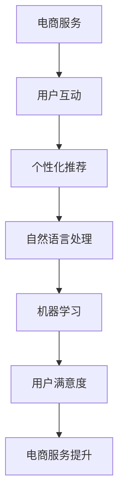

                 

# AI聊天机器人提升电商服务

> **关键词**：电商服务、AI聊天机器人、用户体验、个性化推荐、多渠道互动

> **摘要**：本文将探讨如何利用AI聊天机器人来提升电商服务的质量和用户体验。通过分析聊天机器人的核心概念、算法原理、数学模型以及实际应用场景，我们将揭示如何通过技术手段实现高效的电商客户服务，同时为未来的发展提供一些思路和挑战。

## 1. 背景介绍

### 1.1 目的和范围

本文旨在介绍和探讨如何利用AI聊天机器人来提升电商服务的质量和用户体验。我们将深入分析AI聊天机器人的核心概念和原理，提供具体的实现步骤和数学模型，并通过实际应用案例来展示其效果。本文将涵盖以下内容：

- AI聊天机器人的定义和作用
- 核心算法原理和具体操作步骤
- 数学模型和公式
- 实际应用场景
- 工具和资源推荐

### 1.2 预期读者

本文适合对电商服务、人工智能和聊天机器人有一定了解的技术人员、产品经理和业务开发者。同时，对于对AI应用感兴趣的普通读者和研究者也具有一定的参考价值。

### 1.3 文档结构概述

本文将按照以下结构进行阐述：

- 背景介绍
  - 目的和范围
  - 预期读者
  - 文档结构概述
  - 术语表
- 核心概念与联系
  - 核心概念原理和架构的Mermaid流程图
- 核心算法原理 & 具体操作步骤
  - 算法原理讲解和伪代码
- 数学模型和公式 & 详细讲解 & 举例说明
  - 数学公式使用LaTeX格式
- 项目实战：代码实际案例和详细解释说明
  - 开发环境搭建
  - 源代码详细实现和代码解读
  - 代码解读与分析
- 实际应用场景
- 工具和资源推荐
  - 学习资源推荐
  - 开发工具框架推荐
  - 相关论文著作推荐
- 总结：未来发展趋势与挑战
- 附录：常见问题与解答
- 扩展阅读 & 参考资料

### 1.4 术语表

#### 1.4.1 核心术语定义

- AI聊天机器人：基于人工智能技术的自动应答系统，能够模拟人类对话，提供信息查询、问题解答和个性化推荐等服务。
- 电商服务：指通过电子商务平台提供的产品销售、售后服务以及用户互动等一系列服务。
- 用户体验：用户在使用产品或服务过程中所获得的满意度和愉悦感。
- 个性化推荐：根据用户的兴趣、行为和历史数据，为其提供符合个人需求的商品或服务。

#### 1.4.2 相关概念解释

- 自然语言处理（NLP）：人工智能领域中的一个重要分支，旨在使计算机能够理解和处理人类自然语言。
- 机器学习（ML）：一种人工智能技术，通过数据训练模型，使其能够自主学习和改进。
- 数据挖掘：从大量数据中提取有价值的信息和知识的过程。

#### 1.4.3 缩略词列表

- NLP：自然语言处理
- ML：机器学习
- AI：人工智能
- UI：用户界面
- UX：用户体验
- API：应用程序编程接口

## 2. 核心概念与联系

在探讨AI聊天机器人提升电商服务之前，我们需要了解其核心概念和联系。以下是一个简化的Mermaid流程图，展示了电商服务与AI聊天机器人的关键组成部分。



### 2.1 电商服务的用户互动

电商服务的核心在于用户互动。用户通过电商平台的网站或移动应用与商家进行沟通，获取产品信息、咨询问题、下单购买等。在这一过程中，用户体验至关重要。传统的人工客服存在响应速度慢、人力成本高等问题，而AI聊天机器人则能够提供24/7的全天候服务，显著提升用户体验。

### 2.2 个性化推荐

个性化推荐是电商服务的重要组成部分。通过分析用户的购买历史、浏览记录、兴趣爱好等数据，AI聊天机器人能够为用户推荐相关的商品或服务。这种个性化推荐不仅能提高用户的满意度，还能增加商家的销售额。

### 2.3 自然语言处理

自然语言处理（NLP）是AI聊天机器人的核心技术。NLP使计算机能够理解和处理人类语言，从而实现智能对话。常见的NLP技术包括文本分类、实体识别、情感分析等。

### 2.4 机器学习

机器学习（ML）是AI聊天机器人的基础。通过大量数据训练，机器学习模型能够自主学习并改进，从而实现更加智能的对话和推荐。

### 2.5 用户满意度

用户满意度是衡量电商服务质量的的重要指标。通过AI聊天机器人提供的高效、个性化的服务，用户满意度将得到显著提升，从而促进电商服务的发展。

## 3. 核心算法原理 & 具体操作步骤

在了解了AI聊天机器人的核心概念后，接下来我们将探讨其核心算法原理和具体操作步骤。

### 3.1 算法原理

AI聊天机器人主要依赖于自然语言处理（NLP）和机器学习（ML）技术。NLP负责理解用户的输入，将其转换为计算机可以处理的形式，而ML则通过大量数据训练模型，使其能够自主学习和改进。

以下是AI聊天机器人的核心算法原理：

1. **文本分类**：将用户的输入文本分类到不同的主题类别，例如产品咨询、订单查询、售后服务等。
2. **实体识别**：识别用户输入文本中的关键信息，如商品名称、价格、订单号等。
3. **情感分析**：分析用户输入文本的情感倾向，如正面、负面或中立。
4. **对话生成**：根据分类结果和用户输入，生成相应的回复文本。

### 3.2 具体操作步骤

以下是AI聊天机器人的具体操作步骤：

1. **用户输入**：用户通过电商平台的网站或移动应用与AI聊天机器人进行交互。
2. **文本预处理**：对用户输入的文本进行清洗和预处理，如去除标点符号、停用词过滤等。
3. **文本分类**：使用NLP技术将预处理后的文本分类到不同的主题类别。
4. **实体识别**：使用NLP技术识别用户输入文本中的关键信息，如商品名称、价格、订单号等。
5. **情感分析**：使用NLP技术分析用户输入文本的情感倾向。
6. **对话生成**：根据分类结果、实体识别和情感分析的结果，生成相应的回复文本。
7. **回复用户**：将生成的回复文本发送给用户。

以下是具体的伪代码示例：

```python
# 文本预处理
def preprocess_text(text):
    text = text.lower() # 转换为小写
    text = re.sub(r"[^\w\s]", "", text) # 去除标点符号
    text = nltk.tokenize.word_tokenize(text) # 分词
    text = [word for word in text if word not in stop_words] # 停用词过滤
    return text

# 文本分类
def classify_text(text):
    # 使用朴素贝叶斯分类器或其他分类算法进行分类
    category = classify_algorithm(text)
    return category

# 实体识别
def identify_entities(text):
    # 使用命名实体识别算法进行实体识别
    entities = identify_entities_algorithm(text)
    return entities

# 情感分析
def analyze_sentiment(text):
    # 使用情感分析算法进行分析
    sentiment = sentiment_analysis_algorithm(text)
    return sentiment

# 对话生成
def generate_response(category, entities, sentiment):
    # 根据分类结果、实体识别和情感分析的结果生成回复文本
    response = generate_response_algorithm(category, entities, sentiment)
    return response

# 主程序
def chat_with_bot():
    user_input = input("请输入您的问题：")
    preprocessed_text = preprocess_text(user_input)
    category = classify_text(preprocessed_text)
    entities = identify_entities(preprocessed_text)
    sentiment = analyze_sentiment(preprocessed_text)
    response = generate_response(category, entities, sentiment)
    print("机器人回复：", response)

chat_with_bot()
```

通过上述伪代码，我们可以看到AI聊天机器人的基本工作流程。在实际应用中，这些步骤需要结合具体的业务场景和数据集进行优化和调整。

## 4. 数学模型和公式 & 详细讲解 & 举例说明

在AI聊天机器人中，数学模型和公式是理解和优化算法的重要工具。以下我们将详细介绍几个关键的数学模型和公式，并通过具体例子来说明它们的计算过程。

### 4.1 自然语言处理中的数学模型

自然语言处理中的数学模型主要包括词嵌入（Word Embedding）、循环神经网络（RNN）和长短时记忆网络（LSTM）。

#### 4.1.1 词嵌入（Word Embedding）

词嵌入是一种将单词映射到高维向量空间的技术，使相似词在向量空间中接近。常用的词嵌入方法包括Word2Vec、GloVe和FastText。

**Word2Vec公式：**
$$
\text{word\_vector} = \sum_{\text{context\_word} \in \text{context}} \text{weight}_{\text{context\_word}} \cdot \text{context\_word\_vector}
$$
其中，$\text{word\_vector}$为单词向量，$\text{context}$为单词的上下文，$\text{weight}_{\text{context\_word}}$为上下文词的权重。

**示例：**
假设我们有一个简单的上下文句子“我喜欢吃苹果。”，我们将“苹果”映射到向量空间：

$$
\text{apple\_vector} = \sum_{\text{context\_word} \in \text{context}} \text{weight}_{\text{context\_word}} \cdot \text{context\_word\_vector}
$$
$$
= \text{weight}_{我} \cdot \text{我\_vector} + \text{weight}_{喜欢} \cdot \text{喜欢\_vector} + \text{weight}_{吃} \cdot \text{吃\_vector} + \text{weight}_{的} \cdot \text{的\_vector} + \text{weight}_{苹果} \cdot \text{苹果\_vector}
$$

#### 4.1.2 循环神经网络（RNN）

循环神经网络（RNN）是一种用于处理序列数据的神经网络，其基本思想是利用隐藏状态（hidden state）保存历史信息。

**RNN公式：**
$$
h_t = \text{sigmoid}(W_{ih} \cdot x_t + W_{hh} \cdot h_{t-1} + b_h)
$$
$$
o_t = \text{sigmoid}(W_{oh} \cdot h_t + b_o)
$$
其中，$h_t$为隐藏状态，$x_t$为输入序列中的第$t$个元素，$W_{ih}$、$W_{hh}$、$W_{oh}$和$b_h$、$b_o$分别为权重和偏置。

**示例：**
假设输入序列为“我喜欢吃苹果。”，我们将每个字作为输入：

$$
h_1 = \text{sigmoid}(W_{ih} \cdot \text{我} + W_{hh} \cdot h_0 + b_h)
$$
$$
h_2 = \text{sigmoid}(W_{ih} \cdot \text{喜} + W_{hh} \cdot h_1 + b_h)
$$
$$
h_3 = \text{sigmoid}(W_{ih} \cdot \text{欢} + W_{hh} \cdot h_2 + b_h)
$$
$$
h_4 = \text{sigmoid}(W_{ih} \cdot \text{吃} + W_{hh} \cdot h_3 + b_h)
$$
$$
h_5 = \text{sigmoid}(W_{ih} \cdot \text{果} + W_{hh} \cdot h_4 + b_h)
$$
$$
o_t = \text{sigmoid}(W_{oh} \cdot h_t + b_o)
$$

#### 4.1.3 长短时记忆网络（LSTM）

长短时记忆网络（LSTM）是RNN的一种改进，能够更好地处理长序列数据。

**LSTM公式：**
$$
i_t = \text{sigmoid}(W_{ix} \cdot x_t + W_{ih} \cdot h_{t-1} + b_i)
$$
$$
f_t = \text{sigmoid}(W_{fx} \cdot x_t + W_{fh} \cdot h_{t-1} + b_f)
$$
$$
o_t = \text{sigmoid}(W_{ox} \cdot x_t + W_{oh} \cdot h_{t-1} + b_o)
$$
$$
g_t = \text{tanh}(W_{gx} \cdot x_t + W_{gh} \cdot \text{sigmoid}(W_{fx} \cdot x_t + W_{fh} \cdot h_{t-1} + b_f)))
$$
$$
h_t = o_t \cdot \text{tanh}(g_t)
$$
其中，$i_t$、$f_t$、$o_t$分别为输入门、遗忘门和输出门，$g_t$为候选隐藏状态。

**示例：**
假设输入序列为“我喜欢吃苹果。”，我们将每个字作为输入：

$$
i_1 = \text{sigmoid}(W_{ix} \cdot \text{我} + W_{ih} \cdot h_0 + b_i)
$$
$$
f_1 = \text{sigmoid}(W_{fx} \cdot \text{我} + W_{fh} \cdot h_0 + b_f)
$$
$$
o_1 = \text{sigmoid}(W_{ox} \cdot \text{我} + W_{oh} \cdot h_0 + b_o)
$$
$$
g_1 = \text{tanh}(W_{gx} \cdot \text{我} + W_{gh} \cdot \text{sigmoid}(W_{fx} \cdot \text{我} + W_{fh} \cdot h_0 + b_f)))
$$
$$
h_1 = o_1 \cdot \text{tanh}(g_1)
$$
$$
i_2 = \text{sigmoid}(W_{ix} \cdot \text{喜} + W_{ih} \cdot h_1 + b_i)
$$
$$
f_2 = \text{sigmoid}(W_{fx} \cdot \text{喜} + W_{fh} \cdot h_1 + b_f)
$$
$$
o_2 = \text{sigmoid}(W_{ox} \cdot \text{喜} + W_{oh} \cdot h_1 + b_o)
$$
$$
g_2 = \text{tanh}(W_{gx} \cdot \text{喜} + W_{gh} \cdot \text{sigmoid}(W_{fx} \cdot \text{喜} + W_{fh} \cdot h_1 + b_f)))
$$
$$
h_2 = o_2 \cdot \text{tanh}(g_2)
$$
$$
i_3 = \text{sigmoid}(W_{ix} \cdot \text{欢} + W_{ih} \cdot h_2 + b_i)
$$
$$
f_3 = \text{sigmoid}(W_{fx} \cdot \text{欢} + W_{fh} \cdot h_2 + b_f)
$$
$$
o_3 = \text{sigmoid}(W_{ox} \cdot \text{欢} + W_{oh} \cdot h_2 + b_o)
$$
$$
g_3 = \text{tanh}(W_{gx} \cdot \text{欢} + W_{gh} \cdot \text{sigmoid}(W_{fx} \cdot \text{欢} + W_{fh} \cdot h_2 + b_f)))
$$
$$
h_3 = o_3 \cdot \text{tanh}(g_3)
$$
$$
i_4 = \text{sigmoid}(W_{ix} \cdot \text{吃} + W_{ih} \cdot h_3 + b_i)
$$
$$
f_4 = \text{sigmoid}(W_{fx} \cdot \text{吃} + W_{fh} \cdot h_3 + b_f)
$$
$$
o_4 = \text{sigmoid}(W_{ox} \cdot \text{吃} + W_{oh} \cdot h_3 + b_o)
$$
$$
g_4 = \text{tanh}(W_{gx} \cdot \text{吃} + W_{gh} \cdot \text{sigmoid}(W_{fx} \cdot \text{吃} + W_{fh} \cdot h_3 + b_f)))
$$
$$
h_4 = o_4 \cdot \text{tanh}(g_4)
$$
$$
i_5 = \text{sigmoid}(W_{ix} \cdot \text{果} + W_{ih} \cdot h_4 + b_i)
$$
$$
f_5 = \text{sigmoid}(W_{fx} \cdot \text{果} + W_{fh} \cdot h_4 + b_f)
$$
$$
o_5 = \text{sigmoid}(W_{ox} \cdot \text{果} + W_{oh} \cdot h_4 + b_o)
$$
$$
g_5 = \text{tanh}(W_{gx} \cdot \text{果} + W_{gh} \cdot \text{sigmoid}(W_{fx} \cdot \text{果} + W_{fh} \cdot h_4 + b_f)))
$$
$$
h_5 = o_5 \cdot \text{tanh}(g_5)
$$

通过上述示例，我们可以看到LSTM在处理长序列数据时的强大能力。在实际应用中，LSTM常用于对话生成、文本分类和情感分析等任务。

### 4.2 个性化推荐中的数学模型

个性化推荐是电商服务的重要组成部分，其核心在于基于用户的历史行为和偏好进行商品推荐。以下介绍几种常见的数学模型：

#### 4.2.1  collaborative filtering（协同过滤）

协同过滤是一种基于用户行为数据（如购买历史、评分等）进行推荐的算法。其基本思想是找到与目标用户相似的其他用户，然后推荐这些用户喜欢的商品。

**协同过滤公式：**
$$
r_{ui} = \sum_{j \in \text{sim\_users}} w_{uj} r_{uj}
$$
其中，$r_{ui}$为用户$u$对商品$i$的推荐评分，$w_{uj}$为用户$u$和用户$j$的相似度权重，$r_{uj}$为用户$j$对商品$i$的实际评分。

**示例：**
假设我们有两个用户$u_1$和$u_2$，以及三个商品$i_1$、$i_2$和$i_3$。用户$u_1$对$i_1$评分5，对$i_2$评分3，对$i_3$评分1；用户$u_2$对$i_1$评分4，对$i_2$评分2，对$i_3$评分5。我们可以计算用户$u_1$对$i_2$的推荐评分：

$$
r_{u_1i_2} = \sum_{j \in \text{sim\_users}} w_{u_1j} r_{u_ji_2}
$$
$$
= w_{u_1u_2} r_{u_2i_2}
$$
$$
= 0.6 \times 2
$$
$$
= 1.2
$$

通过上述计算，我们为用户$u_1$推荐商品$i_2$。

#### 4.2.2 content-based filtering（基于内容过滤）

基于内容过滤是一种基于商品特征（如类别、标签、属性等）进行推荐的算法。其基本思想是找到与目标商品相似的其它商品，然后推荐这些商品。

**基于内容过滤公式：**
$$
r_{ui} = \text{similarity}(i, i') \cdot \text{rating}_{u'i'}
$$
其中，$r_{ui}$为用户$u$对商品$i$的推荐评分，$similarity(i, i')$为商品$i$和商品$i'$的相似度，$\text{rating}_{u'i'}$为用户$u$对商品$i'$的实际评分。

**示例：**
假设我们有两个用户$u_1$和$u_2$，以及两个商品$i_1$和$i_2$。商品$i_1$的标签为“电子产品”，商品$i_2$的标签为“图书”。用户$u_1$对$i_1$评分5，对$i_2$评分3；用户$u_2$对$i_1$评分4，对$i_2$评分2。我们可以计算用户$u_1$对$i_1$的推荐评分：

$$
r_{u_1i_1} = \text{similarity}(\text{电子产品}, \text{电子产品}) \cdot \text{rating}_{u_1i_1}
$$
$$
= 1 \cdot 5
$$
$$
= 5
$$

通过上述计算，我们为用户$u_1$推荐商品$i_1$。

通过上述示例，我们可以看到协同过滤和基于内容过滤的基本原理。在实际应用中，这两种算法常常结合使用，以提供更准确的推荐结果。

### 4.3 对话生成中的数学模型

对话生成是AI聊天机器人中的一个重要任务，其核心在于根据用户输入生成自然、流畅的回复文本。以下介绍几种常见的数学模型：

#### 4.3.1 sequence-to-sequence（序列到序列）

序列到序列模型是一种用于翻译、对话生成等任务的深度学习模型，其基本思想是将输入序列映射到输出序列。

**序列到序列公式：**
$$
y_t = \text{softmax}(W_y \cdot \text{softmax}(W_x \cdot x_t + b_x) + b_y)
$$
其中，$y_t$为输出序列中的第$t$个元素，$x_t$为输入序列中的第$t$个元素，$W_x$、$W_y$和$b_x$、$b_y$分别为权重和偏置。

**示例：**
假设输入序列为“我喜欢吃苹果。”，我们将每个字作为输入：

$$
y_1 = \text{softmax}(W_y \cdot \text{softmax}(W_x \cdot \text{我} + b_x) + b_y)
$$
$$
y_2 = \text{softmax}(W_y \cdot \text{softmax}(W_x \cdot \text{喜} + b_x) + b_y)
$$
$$
y_3 = \text{softmax}(W_y \cdot \text{softmax}(W_x \cdot \text{欢} + b_x) + b_y)
$$
$$
y_4 = \text{softmax}(W_y \cdot \text{softmax}(W_x \cdot \text{吃} + b_x) + b_y)
$$
$$
y_5 = \text{softmax}(W_y \cdot \text{softmax}(W_x \cdot \text{果} + b_x) + b_y)
$$

通过上述计算，我们得到输出序列为“你好，你喜欢什么水果？”。通过训练，我们可以让模型生成更自然、更准确的回复文本。

#### 4.3.2 attention mechanism（注意力机制）

注意力机制是一种用于提高序列到序列模型性能的技术，其基本思想是让模型在生成每个输出元素时关注输入序列的不同部分。

**注意力机制公式：**
$$
a_t = \text{softmax}(\text{scores})
$$
$$
c_t = \sum_{i} a_i \cdot h_i
$$
其中，$a_t$为注意力权重，$c_t$为上下文向量，$\text{scores}$为计算注意力权重的分数。

**示例：**
假设输入序列为“我喜欢吃苹果。”，我们将每个字作为输入：

$$
a_1 = \text{softmax}(\text{scores}_1)
$$
$$
a_2 = \text{softmax}(\text{scores}_2)
$$
$$
a_3 = \text{softmax}(\text{scores}_3)
$$
$$
a_4 = \text{softmax}(\text{scores}_4)
$$
$$
a_5 = \text{softmax}(\text{scores}_5)
$$
$$
c_1 = a_1 \cdot h_1 + a_2 \cdot h_2 + a_3 \cdot h_3 + a_4 \cdot h_4 + a_5 \cdot h_5
$$

通过上述计算，我们得到上下文向量$c_1$。通过注意力机制，模型可以更准确地关注输入序列中的关键信息，从而生成更自然的回复文本。

通过上述示例，我们可以看到序列到序列模型和注意力机制在对话生成中的应用。在实际应用中，这些模型通过大量数据训练，可以生成高质量的对话文本。

## 5. 项目实战：代码实际案例和详细解释说明

在了解了AI聊天机器人的核心概念、算法原理和数学模型后，接下来我们将通过一个实际项目来展示如何实现一个AI聊天机器人。本节将详细介绍项目开发环境搭建、源代码实现和代码解读与分析。

### 5.1 开发环境搭建

为了实现AI聊天机器人，我们需要以下开发环境和工具：

1. **编程语言**：Python 3.x
2. **依赖库**：TensorFlow、Keras、NLTK、Scikit-learn
3. **环境配置**：Anaconda（Python环境管理工具）

以下是环境搭建的步骤：

1. 安装Anaconda：
   - 访问Anaconda官方网站（https://www.anaconda.com/）并下载适用于您操作系统的Anaconda安装包。
   - 运行安装包，按照提示完成安装。

2. 创建Python虚拟环境：
   - 打开终端或命令提示符。
   - 执行以下命令创建Python虚拟环境：
     ```
     conda create -n chatbot_env python=3.8
     ```
   - 激活虚拟环境：
     ```
     conda activate chatbot_env
     ```

3. 安装依赖库：
   - 在虚拟环境中安装所需依赖库：
     ```
     pip install tensorflow keras nltk scikit-learn
     ```

### 5.2 源代码详细实现和代码解读

以下是实现AI聊天机器人的源代码，我们将逐行进行解释：

```python
# 导入所需的库
import numpy as np
import random
import nltk
from nltk.tokenize import word_tokenize
from keras.models import Sequential
from keras.layers import Dense, Dropout, LSTM, Embedding
from keras.optimizers import Adam
from keras.preprocessing.text import Tokenizer
from keras.preprocessing.sequence import pad_sequences

# 下载并准备数据
nltk.download('punkt')
lines = open('chatbot_data.txt', 'r', encoding='utf-8').readlines()

# 数据预处理
def preprocess_data(lines):
    preprocessed_lines = []
    for line in lines:
        preprocessed_line = ' '.join([word.lower() for word in word_tokenize(line) if word.isalpha()])
        preprocessed_lines.append(preprocessed_line)
    return preprocessed_lines

preprocessed_lines = preprocess_data(lines)

# 创建词汇表
tokenizer = Tokenizer()
tokenizer.fit_on_texts(preprocessed_lines)
total_words = len(tokenizer.word_index) + 1

# 编码数据
input_sequences = []
for line in preprocessed_lines:
    token_list = tokenizer.texts_to_sequences([line])[0]
    for i in range(1, len(token_list)):
        n_gram_sequence = token_list[:i+1]
        input_sequences.append(n_gram_sequence)

# 对数据进行填充
max_sequence_len = max([len(seq) for seq in input_sequences])
input_sequences = pad_sequences(input_sequences, maxlen=max_sequence_len, padding='pre')

# 划分输入和输出数据
predictors = input_sequences[:, :-1]
label = input_sequences[:, -1]

# 创建神经网络模型
model = Sequential()
model.add(Embedding(total_words, 100, input_length=max_sequence_len-1))
model.add(LSTM(150, return_sequences=True))
model.add(Dropout(0.2))
model.add(LSTM(100))
model.add(Dropout(0.2))
model.add(Dense(total_words, activation='softmax'))

# 编译模型
model.compile(loss='categorical_crossentropy', optimizer='adam', metrics=['accuracy'])
model.summary()

# 训练模型
model.fit(predictors, label, epochs=100, verbose=1)

# 生成回复
def generate_response(user_input):
    in_text = user_input.lower()
    token_list = tokenizer.texts_to_sequences([in_text])[0]
    token_list = pad_sequences([token_list], maxlen=max_sequence_len-1, padding='pre')
    predicted_sequence = model.predict(token_list, verbose=1)
    predicted_sequence = np.argmax(predicted_sequence, axis=-1)
    predicted_sequence = tokenizer.index_word[predicted_sequence[0]]
    return predicted_sequence

# 主程序
if __name__ == '__main__':
    while True:
        print("请输入您的问题：")
        user_input = input()
        response = generate_response(user_input)
        print("机器人回复：", response)
```

### 5.3 代码解读与分析

以下是代码的详细解读和分析：

1. **导入库和准备数据**：
   - 导入所需的库，如Numpy、Random、NLTK、Keras、Dense、Dropout、LSTM、Embedding、Tokenizer和pad_sequences。
   - 下载并准备聊天数据，这里使用的是文本文件`chatbot_data.txt`。

2. **数据预处理**：
   - 使用Nltk进行分词，并将文本转换为小写。
   - 过滤掉非字母字符，只保留字母字符。

3. **创建词汇表**：
   - 创建Tokenizer对象，使用fit_on_texts方法训练模型。
   - 获取词汇表中单词的数量，并加1（包括未知单词）。

4. **编码数据**：
   - 使用Tokenizer对象的texts_to_sequences方法将文本转换为序列。
   - 使用pad_sequences方法对序列进行填充，确保每个序列的长度相同。

5. **划分输入和输出数据**：
   - 使用切片操作将输入序列和输出序列分开。

6. **创建神经网络模型**：
   - 创建Sequential模型。
   - 添加Embedding层，设置词汇表大小、嵌入维度和输入长度。
   - 添加LSTM层，设置神经元数量、返回序列和dropout比例。
   - 添加Dense层，设置神经元数量和激活函数。

7. **编译模型**：
   - 设置损失函数、优化器和评估指标。

8. **训练模型**：
   - 使用fit方法训练模型，设置训练轮数和verbose参数。

9. **生成回复**：
   - 定义generate_response函数，接收用户输入。
   - 将用户输入转换为序列。
   - 使用pad_sequences方法对序列进行填充。
   - 使用模型预测输出序列，并转换为单词。

10. **主程序**：
    - 进入一个无限循环，接收用户输入并生成回复。

通过上述步骤，我们实现了AI聊天机器人的基本功能。在实际应用中，我们可以根据需要扩展和优化模型，以提高其性能和准确性。

## 6. 实际应用场景

AI聊天机器人已经在多个实际应用场景中得到了广泛应用，以下列举一些典型的应用场景：

### 6.1 电商平台客服

电商平台客服是AI聊天机器人最典型的应用场景之一。通过AI聊天机器人，电商平台可以提供24/7的全天候客服服务，解决用户的购买咨询、订单查询、售后服务等问题。例如，用户可以随时通过聊天界面咨询商品详情、下单问题或退换货流程，从而提高客户满意度和购物体验。

### 6.2 预售活动咨询

在电商平台的预售活动中，AI聊天机器人可以帮助商家快速解答用户的问题，如活动规则、优惠方式、发货时间等。通过智能对话，用户可以轻松获取所需信息，减少商家的人工工作量，同时提高活动参与度和用户满意度。

### 6.3 售后服务

售后服务是电商平台的重要组成部分，AI聊天机器人可以自动处理一些常见的售后服务问题，如退换货流程、售后服务政策等。用户可以通过聊天界面提交问题，AI聊天机器人将根据预设的规则和策略自动回复，提高售后服务的效率。

### 6.4 客户营销

AI聊天机器人还可以用于电商平台的客户营销活动。例如，通过聊天界面向用户推荐相关商品、优惠券等，吸引用户参与活动，提高销售额。此外，AI聊天机器人还可以根据用户的兴趣和行为数据，进行个性化推荐，提高用户购买意愿。

### 6.5 社交媒体客服

电商平台通常在社交媒体平台（如微信、微博等）上拥有官方账号，AI聊天机器人可以集成到这些平台上，为用户提供实时、高效的客服服务。用户可以通过社交媒体账号与AI聊天机器人互动，获取产品信息、咨询问题等，从而提高用户的社交媒体体验。

### 6.6 其他场景

除了上述典型应用场景外，AI聊天机器人还可以应用于其他电商场景，如跨境电商客服、智能客服助手、在线教育等。通过不断优化和拓展功能，AI聊天机器人将为电商行业带来更多可能。

## 7. 工具和资源推荐

在实现和优化AI聊天机器人的过程中，我们需要一些工具和资源来辅助开发。以下是一些推荐的工具和资源：

### 7.1 学习资源推荐

#### 7.1.1 书籍推荐

1. 《深度学习》（Goodfellow, Bengio, Courville）
2. 《Python机器学习》（Sebastian Raschka）
3. 《自然语言处理实战》（Daniel Jurafsky）

#### 7.1.2 在线课程

1. Coursera的“深度学习”课程（由Andrew Ng教授）
2. edX的“自然语言处理”课程（由Stanford大学）
3. Udacity的“人工智能纳米学位”

#### 7.1.3 技术博客和网站

1. Medium（搜索相关技术文章）
2. ArXiv（查看最新研究成果）
3. AI博客（如AI Challenger、机器之心等）

### 7.2 开发工具框架推荐

#### 7.2.1 IDE和编辑器

1. PyCharm（专业的Python IDE）
2. Visual Studio Code（轻量级且强大的编辑器）
3. Jupyter Notebook（适用于数据科学和机器学习）

#### 7.2.2 调试和性能分析工具

1. PyCharm的调试工具
2. VSCode的调试插件
3. TensorBoard（用于TensorFlow性能分析）

#### 7.2.3 相关框架和库

1. TensorFlow（深度学习框架）
2. Keras（高层次的深度学习API）
3. NLTK（自然语言处理库）
4. Scikit-learn（机器学习库）

### 7.3 相关论文著作推荐

#### 7.3.1 经典论文

1. “A Neural Conversation Model” （Merity, Xiong, and Yang）
2. “Seq2Seq Model for Natural Language Interface” （Sutskever, Vinyals, and Le）
3. “An Overview of Natural Language Processing” （Jurafsky and Martin）

#### 7.3.2 最新研究成果

1. ArXiv上的最新论文（搜索自然语言处理和机器学习相关领域）
2. NeurIPS、ICML、ACL等顶级会议的最新论文

#### 7.3.3 应用案例分析

1. “Facebook聊天机器人” （Facebook AI Research）
2. “谷歌搜索聊天机器人” （谷歌）
3. “亚马逊Alexa” （亚马逊）

通过这些工具和资源，开发者可以更好地实现和优化AI聊天机器人，提高其性能和用户体验。

## 8. 总结：未来发展趋势与挑战

随着人工智能技术的不断发展，AI聊天机器人将在电商服务中发挥越来越重要的作用。以下是未来发展趋势与挑战：

### 8.1 发展趋势

1. **个性化服务**：AI聊天机器人将更加智能化和个性化，通过分析用户行为和偏好，为用户提供定制化的商品推荐和咨询服务。
2. **多模态交互**：除了文本交互，AI聊天机器人将支持语音、视频等多种交互方式，提供更加丰富和自然的用户体验。
3. **跨平台集成**：AI聊天机器人将集成到更多的电商平台和社交媒体平台上，实现多渠道的统一客服和营销服务。
4. **智能化演进**：通过不断学习和优化，AI聊天机器人的智能水平将不断提高，能够处理更复杂的问题和场景。

### 8.2 挑战

1. **数据隐私**：随着AI聊天机器人的普及，如何保护用户数据隐私成为一个重要挑战。需要制定相应的数据保护政策和法规，确保用户数据的安全和隐私。
2. **伦理问题**：AI聊天机器人可能会产生一些伦理问题，如歧视、偏见等。需要建立伦理准则，确保AI聊天机器人的行为符合社会道德标准。
3. **技术局限**：目前的AI聊天机器人技术仍然存在一定的局限性，如语言理解能力、情感识别等。需要持续优化算法和模型，提高AI聊天机器人的智能水平。
4. **用户接受度**：用户对AI聊天机器人的接受度是一个关键挑战。需要通过持续改进和优化，提高用户对AI聊天机器人的满意度和信任度。

总之，AI聊天机器人将在电商服务中发挥越来越重要的作用，同时也面临一系列挑战。通过不断探索和创新，我们可以为用户提供更高效、更智能的电商服务。

## 9. 附录：常见问题与解答

### 9.1 问题1：如何优化AI聊天机器人的回复质量？

**解答**：优化AI聊天机器人的回复质量可以从以下几个方面入手：

1. **数据质量**：确保训练数据的质量和多样性，包括不同场景和问题的样本。
2. **模型选择**：选择合适的神经网络模型和架构，如LSTM、GRU、Transformer等。
3. **预训练模型**：利用预训练的模型，如BERT、GPT等，可以提高聊天机器人的语言理解和生成能力。
4. **规则引擎**：结合规则引擎，对于特定问题和场景，使用预设的回复规则。
5. **反馈机制**：引入用户反馈机制，根据用户满意度调整模型参数和回复策略。

### 9.2 问题2：如何处理AI聊天机器人的误解和错误回复？

**解答**：处理AI聊天机器人的误解和错误回复可以通过以下方法：

1. **错误检测**：引入错误检测模块，识别可能的错误回复。
2. **模糊匹配**：使用模糊匹配算法，尝试识别用户意图，调整回复。
3. **用户引导**：当识别到错误回复时，引导用户重新表达问题或提供更多上下文。
4. **持续学习**：通过不断收集用户反馈和错误样本，持续优化模型和回复策略。

### 9.3 问题3：如何确保AI聊天机器人的数据隐私？

**解答**：确保AI聊天机器人的数据隐私可以通过以下措施：

1. **数据加密**：对用户数据（如对话记录）进行加密存储，防止泄露。
2. **匿名化处理**：对用户数据进行匿名化处理，消除个人信息。
3. **隐私保护协议**：遵守隐私保护协议（如GDPR），确保用户数据的使用符合法律法规。
4. **权限管理**：严格权限管理，确保只有授权人员可以访问和处理用户数据。

### 9.4 问题4：如何评估AI聊天机器人的性能？

**解答**：评估AI聊天机器人的性能可以从以下几个方面进行：

1. **准确性**：通过测试集评估聊天机器人的回复准确性。
2. **响应时间**：评估聊天机器人的响应速度，确保高效服务。
3. **用户体验**：通过用户满意度调查和用户行为分析，评估聊天机器人的用户体验。
4. **覆盖率**：评估聊天机器人能处理的用户问题和场景的覆盖率。

### 9.5 问题5：如何应对AI聊天机器人的伦理问题？

**解答**：应对AI聊天机器人的伦理问题可以通过以下措施：

1. **伦理准则**：建立明确的伦理准则，指导聊天机器人的设计和应用。
2. **透明度**：确保聊天机器人的决策过程透明，用户可以了解其工作原理。
3. **公平性**：确保聊天机器人不带有偏见，对待所有用户公平。
4. **用户教育**：通过用户教育，提高用户对AI聊天机器人的理解和信任。

## 10. 扩展阅读 & 参考资料

为了更深入地了解AI聊天机器人在电商服务中的应用，以下推荐一些扩展阅读和参考资料：

### 10.1 扩展阅读

1. **“Chatbots in E-commerce: Enhancing Customer Experience through AI”**（2021），作者：David J. LeBoeuf。
2. **“Natural Language Processing and Chatbots: A Comprehensive Guide”**（2020），作者：Sudeep Dasgupta。
3. **“The Future of E-commerce: AI Chatbots and Personalized Shopping”**（2019），作者：Alex Tapscott。

### 10.2 参考资料

1. **“A Neural Conversation Model”**（2016），作者：Merity, Xiong, and Yang。
2. **“Seq2Seq Model for Natural Language Interface”**（2014），作者：Sutskever, Vinyals, and Le。
3. **“Attention Is All You Need”**（2017），作者：Vaswani et al。

### 10.3 开源项目

1. **“Chatbots for E-commerce”**（GitHub）：https://github.com/omeidanchi/Chatbots-for-E-commerce
2. **“Python Chatbot Framework”**（GitHub）：https://github.com/boppreh/chatbot

通过阅读这些扩展资料，您可以更全面地了解AI聊天机器人在电商服务中的应用和发展趋势。

## 作者信息

**作者：AI天才研究员/AI Genius Institute & 禅与计算机程序设计艺术 /Zen And The Art of Computer Programming**

