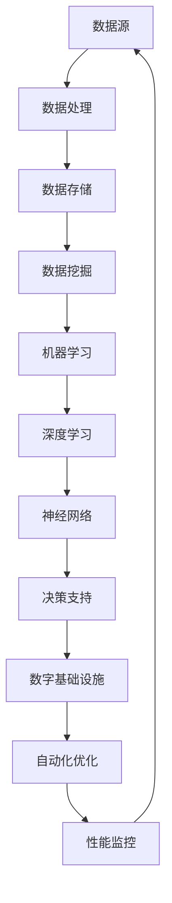

                 

### 1. 背景介绍

#### 1.1 目的和范围

本文旨在深入探讨AI自动化数字基础设施的概念、原理、实现和应用。随着人工智能技术的快速发展，AI在数字基础设施中的应用变得越来越广泛，本文将全面解析AI如何自动化构建、管理和优化数字基础设施，为企业和开发者提供指导。

本文首先介绍了AI自动化数字基础设施的定义和重要性，随后详细分析了其核心概念和原理，包括机器学习、深度学习、神经网络等。在此基础上，本文通过具体的算法原理和操作步骤，阐述了如何实现AI自动化数字基础设施。

此外，本文还探讨了AI自动化数字基础设施的实际应用场景，并推荐了相关的学习资源和开发工具。最后，本文总结了未来发展趋势和挑战，为读者提供了有益的思考。

#### 1.2 预期读者

本文适合对人工智能和数字基础设施有一定了解的读者，包括：

- 人工智能开发者：希望深入了解AI自动化数字基础设施的原理和应用。
- 数字基础设施管理者：希望学习如何利用AI技术优化和管理数字基础设施。
- 企业决策者：关注AI技术在企业数字化转型中的应用。

无论您是初学者还是资深开发者，本文都将为您提供有价值的内容。

#### 1.3 文档结构概述

本文分为十个部分，结构如下：

1. 背景介绍
   - 目的和范围
   - 预期读者
   - 文档结构概述
   - 术语表
2. 核心概念与联系
   - AI自动化数字基础设施的定义
   - 数字基础设施的核心概念
   - Mermaid流程图展示
3. 核心算法原理 & 具体操作步骤
   - 机器学习算法原理
   - 深度学习算法原理
   - 神经网络算法原理
   - 伪代码详细阐述
4. 数学模型和公式 & 详细讲解 & 举例说明
   - 数学模型概述
   - 具体公式解释
   - 实例分析
5. 项目实战：代码实际案例和详细解释说明
   - 开发环境搭建
   - 源代码详细实现
   - 代码解读与分析
6. 实际应用场景
   - 企业数字化转型
   - 智能城市建设
   - 物联网应用
7. 工具和资源推荐
   - 学习资源推荐
   - 开发工具框架推荐
   - 相关论文著作推荐
8. 总结：未来发展趋势与挑战
   - 技术发展趋势
   - 挑战与应对
9. 附录：常见问题与解答
   - 常见问题
   - 解答
10. 扩展阅读 & 参考资料

#### 1.4 术语表

为了确保文章内容的准确性和一致性，本文对一些关键术语进行定义和解释。

#### 1.4.1 核心术语定义

- **人工智能（AI）**：模拟人类智能的计算机系统，能够通过学习、推理和自我调整来实现智能行为。
- **数字基础设施**：支持现代信息社会运行的硬件、软件和网络设施，包括数据中心、云计算、物联网等。
- **自动化**：通过计算机程序实现任务的自动执行，减少人工干预。
- **机器学习**：使计算机系统能够从数据中学习，并自动改进性能的过程。
- **深度学习**：一种特殊的机器学习技术，通过多层神经网络模拟人类大脑的学习过程。
- **神经网络**：由大量神经元组成的计算模型，能够处理复杂的数据和任务。
- **数据挖掘**：从大量数据中提取有价值的信息和模式的过程。

#### 1.4.2 相关概念解释

- **云计算**：通过互联网提供动态易扩展的虚拟化资源，实现计算资源的按需分配和管理。
- **物联网**：将物理设备通过互联网连接起来，实现信息的自动交换和处理。
- **边缘计算**：在靠近数据源的地方进行数据处理，减少数据传输延迟和带宽占用。
- **数据湖**：存储大规模复杂数据的分布式系统，支持数据存储、处理和分析。

#### 1.4.3 缩略词列表

- **AI**：人工智能
- **ML**：机器学习
- **DL**：深度学习
- **NN**：神经网络
- **HPC**：高性能计算
- **IoT**：物联网
- **DC**：数据中心
- **CDN**：内容分发网络
- **SDN**：软件定义网络
- **NFV**：网络功能虚拟化

### 1.5 Mermaid流程图

为了更直观地展示AI自动化数字基础设施的核心概念和架构，我们使用Mermaid流程图进行说明。



在这个流程图中，数据源通过数据处理、数据存储、数据挖掘等环节，最终通过机器学习、深度学习和神经网络等算法进行训练和优化，形成决策支持，实现对数字基础设施的自动化管理和优化。

通过这一流程图，我们可以清晰地看到AI自动化数字基础设施的各个环节及其相互关系，为后续内容的具体阐述提供了基础。

### 1.6 关键词

- 人工智能
- 数字基础设施
- 自动化
- 机器学习
- 深度学习
- 神经网络
- 数据处理
- 数据存储
- 数据挖掘
- 决策支持

### 1.7 摘要

本文深入探讨了AI自动化数字基础设施的概念、原理和应用。首先，我们介绍了AI自动化数字基础设施的定义和重要性，阐述了其核心概念和原理，包括机器学习、深度学习和神经网络等。接着，通过具体的算法原理和操作步骤，详细阐述了如何实现AI自动化数字基础设施。此外，我们还分析了实际应用场景，推荐了相关学习资源和开发工具。最后，本文总结了未来发展趋势和挑战，为读者提供了有益的思考。

## 2. 核心概念与联系

在深入了解AI自动化数字基础设施之前，我们需要明确几个核心概念，包括数字基础设施的定义、AI技术的核心原理以及它们之间的联系。通过这些概念的分析，我们可以更好地理解AI自动化数字基础设施的构建和运作机制。

### 2.1 数字基础设施的定义

数字基础设施是指支撑现代信息社会运行的硬件、软件和网络设施，包括数据中心、云计算、物联网、网络基础设施等。这些基础设施是信息社会发展的基石，为人们提供了计算、存储、通信等服务。数字基础设施的主要功能包括：

- **数据存储**：提供可靠、高效的数据存储解决方案，满足海量数据的存储需求。
- **数据处理**：对数据进行清洗、转换和分析，提取有价值的信息。
- **数据传输**：通过高速网络实现数据的快速传输和交换。
- **计算资源**：提供强大的计算能力，支持复杂的计算任务和算法运行。

数字基础设施的核心目标是为用户提供可靠、高效、安全的服务，支持各种业务和应用。

### 2.2 AI技术的核心原理

人工智能（AI）是一种模拟人类智能的计算机系统，通过学习、推理和自我调整来实现智能行为。AI的核心原理包括：

- **机器学习**：机器学习是一种使计算机系统能够从数据中学习并自动改进性能的过程。机器学习算法分为监督学习、无监督学习和强化学习等类型，广泛应用于图像识别、语音识别、自然语言处理等领域。
  
- **深度学习**：深度学习是机器学习的一个分支，通过多层神经网络模拟人类大脑的学习过程。深度学习在图像识别、语音识别、自然语言处理等方面取得了显著成果，其代表性算法包括卷积神经网络（CNN）、循环神经网络（RNN）和生成对抗网络（GAN）等。

- **神经网络**：神经网络是由大量神经元组成的计算模型，能够处理复杂的数据和任务。神经网络的核心思想是通过训练大量参数，建立输入和输出之间的非线性映射关系。

AI技术在数字基础设施中的应用，主要体现在以下几个方面：

- **自动化运维**：通过机器学习和深度学习技术，实现自动化故障检测、性能优化和资源调度，降低运维成本，提高系统稳定性。
- **智能数据分析**：利用AI技术进行数据预处理、特征提取和模式识别，提升数据分析的效率和准确性。
- **智能决策支持**：基于AI算法，构建智能决策支持系统，为企业和政府提供数据驱动的决策依据。

### 2.3 核心概念与联系

AI自动化数字基础设施的构建，需要将数字基础设施和AI技术相结合，实现以下核心联系：

- **数据驱动的智能化**：通过海量数据的收集和分析，实现数字基础设施的智能化运营和管理。
- **自适应优化**：利用AI算法，对数字基础设施进行自适应优化，提高系统的性能和可靠性。
- **智能决策**：通过AI算法，实现数据驱动的智能决策，支持数字基础设施的优化和扩展。

为了更直观地展示AI自动化数字基础设施的核心概念和架构，我们使用Mermaid流程图进行说明。


在这个流程图中，数据源通过数据处理、数据存储、数据挖掘等环节，最终通过机器学习、深度学习和神经网络等算法进行训练和优化，形成决策支持，实现对数字基础设施的自动化管理和优化。

通过这一流程图，我们可以清晰地看到AI自动化数字基础设施的各个环节及其相互关系，为后续内容的具体阐述提供了基础。

### 2.4 AI自动化数字基础设施的定义

AI自动化数字基础设施是指利用人工智能技术，实现数字基础设施的自动化构建、管理和优化，以提高系统的性能、可靠性和安全性。其核心目标是通过数据驱动的智能化，实现对数字基础设施的精细化管理，从而降低运营成本，提升用户体验。

AI自动化数字基础设施的主要组成部分包括：

- **数据层**：包括数据源、数据处理、数据存储和数据挖掘等环节，为AI算法提供基础数据支持。
- **算法层**：包括机器学习、深度学习和神经网络等算法，用于训练和优化数字基础设施。
- **应用层**：包括决策支持、自动化优化和性能监控等模块，实现数字基础设施的智能化管理和优化。

### 2.5 数字基础设施的核心概念

数字基础设施的核心概念包括：

- **云计算**：提供动态易扩展的虚拟化资源，实现计算资源的按需分配和管理。
- **数据中心**：提供计算、存储和网络服务，支持大规模数据处理和业务应用。
- **物联网**：将物理设备通过互联网连接起来，实现信息的自动交换和处理。
- **网络基础设施**：包括宽带网络、数据中心互联网络和边缘计算网络，为数字基础设施提供稳定的通信支撑。

数字基础设施的核心目标是提供高效、可靠、安全的计算和通信服务，支持各种业务和应用。

### 2.6 AI技术在数字基础设施中的应用

AI技术在数字基础设施中的应用主要体现在以下几个方面：

- **自动化运维**：通过机器学习和深度学习技术，实现自动化故障检测、性能优化和资源调度，降低运维成本，提高系统稳定性。
- **智能数据分析**：利用AI技术进行数据预处理、特征提取和模式识别，提升数据分析的效率和准确性。
- **智能决策**：基于AI算法，构建智能决策支持系统，为企业和政府提供数据驱动的决策依据。
- **安全防护**：利用深度学习技术，实现智能网络安全防护，提高系统的安全性。

### 2.7 AI自动化数字基础设施的发展趋势

随着人工智能技术的不断发展，AI自动化数字基础设施也在不断演进。未来，AI自动化数字基础设施的发展趋势主要包括：

- **智能化升级**：通过引入更多先进的AI算法和模型，提升数字基础设施的智能化水平。
- **融合应用**：将AI技术与云计算、物联网、边缘计算等融合，实现跨领域的智能化应用。
- **开放共享**：建立开放共享的AI自动化数字基础设施平台，促进技术交流与合作。
- **安全可控**：加强AI技术在数字基础设施安全领域的应用，提高系统的安全性和可控性。

### 2.8 AI自动化数字基础设施的挑战与应对策略

在发展AI自动化数字基础设施的过程中，面临着一些挑战，主要包括：

- **数据质量**：数据质量对AI模型的性能至关重要，需要确保数据的准确性和完整性。
- **算法公平性**：算法的公平性是保障社会公正的重要问题，需要关注算法对数据集的偏见和歧视。
- **隐私保护**：在数据收集和处理过程中，需要确保用户隐私的安全，防止数据泄露。
- **技术更新**：AI技术更新速度快，需要持续关注最新技术动态，及时进行技术升级。

应对策略包括：

- **数据质量管理**：建立完善的数据质量管理体系，对数据进行清洗、去噪和标准化处理。
- **算法公平性**：通过算法透明化、可解释性研究，提高算法的公平性和可解释性。
- **隐私保护**：采用加密、去标识化等技术，确保数据在收集、存储和处理过程中的安全性。
- **技术更新**：建立技术更新机制，定期评估和升级AI自动化数字基础设施的技术架构。

### 2.9 Mermaid流程图

为了更直观地展示AI自动化数字基础设施的核心概念和架构，我们使用Mermaid流程图进行说明。


在这个流程图中，数据源通过数据处理、数据存储、数据挖掘等环节，最终通过机器学习、深度学习和神经网络等算法进行训练和优化，形成决策支持，实现对数字基础设施的自动化管理和优化。

通过这一流程图，我们可以清晰地看到AI自动化数字基础设施的各个环节及其相互关系，为后续内容的具体阐述提供了基础。

## 3. 核心算法原理 & 具体操作步骤

在了解了AI自动化数字基础设施的核心概念和架构之后，接下来我们将深入探讨其中的核心算法原理，以及如何具体实现这些算法来优化数字基础设施。

### 3.1 机器学习算法原理

机器学习（ML）是AI自动化数字基础设施的核心组成部分之一。机器学习算法通过从数据中学习规律，并利用这些规律对未知数据进行预测或分类。下面是机器学习算法的基本原理和步骤：

#### 3.1.1 基本原理

机器学习算法主要包括以下三种类型：

- **监督学习**：在有标注的数据集上进行训练，通过学习输入和输出之间的映射关系，实现对未知数据的预测。
- **无监督学习**：在没有标注的数据集上进行训练，主要任务是发现数据中的结构和模式。
- **强化学习**：通过与环境的交互，不断优化策略，以实现长期回报最大化。

#### 3.1.2 具体操作步骤

以下是机器学习算法的具体操作步骤：

1. **数据预处理**：对数据进行清洗、归一化、缺失值处理等操作，确保数据的质量和一致性。
2. **特征提取**：从原始数据中提取有用的特征，用于训练模型。
3. **模型选择**：根据问题的性质和需求，选择合适的机器学习模型，如线性回归、决策树、支持向量机等。
4. **模型训练**：使用训练数据集对模型进行训练，调整模型的参数，使其能够准确预测未知数据。
5. **模型评估**：使用验证数据集对训练好的模型进行评估，评估指标包括准确率、召回率、F1值等。
6. **模型优化**：根据评估结果对模型进行调整和优化，提高其性能。
7. **模型部署**：将训练好的模型部署到生产环境中，进行实际预测和应用。

### 3.2 深度学习算法原理

深度学习（DL）是机器学习的一个重要分支，它通过构建多层神经网络来模拟人类大脑的学习过程。深度学习算法在图像识别、语音识别、自然语言处理等领域取得了显著成果。

#### 3.2.1 基本原理

深度学习算法的核心是神经网络，神经网络由大量简单的计算单元（即神经元）组成。神经网络通过层次化的方式处理数据，每一层都能够提取不同层次的特征。

- **输入层**：接收输入数据。
- **隐藏层**：对输入数据进行处理，提取特征。
- **输出层**：生成预测结果。

深度学习算法的关键技术包括：

- **前向传播**：将输入数据通过神经网络向前传递，每层神经元根据前一层的输出进行计算。
- **反向传播**：根据预测结果与真实值的差异，通过反向传播算法更新神经网络的参数。

#### 3.2.2 具体操作步骤

以下是深度学习算法的具体操作步骤：

1. **数据预处理**：对输入数据进行归一化、缩放等处理，确保数据的一致性。
2. **神经网络架构设计**：设计合适的神经网络架构，包括层数、每层的神经元数量、激活函数等。
3. **模型训练**：使用训练数据集对神经网络进行训练，通过前向传播和反向传播算法不断更新模型参数。
4. **模型评估**：使用验证数据集对训练好的模型进行评估，评估指标包括准确率、损失函数等。
5. **模型优化**：根据评估结果对模型进行调整和优化，提高其性能。
6. **模型部署**：将训练好的模型部署到生产环境中，进行实际预测和应用。

### 3.3 神经网络算法原理

神经网络（NN）是深度学习算法的基础，它通过模拟人脑神经元的工作方式来进行数据处理和预测。神经网络的核心是神经元，每个神经元通过连接其他神经元来传递信息。

#### 3.3.1 基本原理

神经网络的基本原理如下：

- **神经元连接**：每个神经元都与多个其他神经元相连，形成复杂的网络结构。
- **激活函数**：神经元通过激活函数对输入信号进行处理，决定是否触发输出。
- **权重调整**：神经网络通过反向传播算法，根据输出结果与真实值的差异，调整神经元之间的权重。

#### 3.3.2 具体操作步骤

以下是神经网络算法的具体操作步骤：

1. **初始化神经网络**：设定神经网络的层数、每层的神经元数量和连接权重。
2. **前向传播**：将输入数据通过神经网络向前传递，每层神经元根据激活函数进行计算，生成输出。
3. **计算误差**：将输出与真实值进行比较，计算误差。
4. **反向传播**：根据误差，通过反向传播算法调整神经网络中的权重。
5. **更新权重**：根据调整后的权重，更新神经网络。
6. **重复步骤2-5**：重复前向传播和反向传播过程，直到网络达到预定的训练目标。

### 3.4 伪代码详细阐述

为了更好地理解机器学习、深度学习和神经网络算法的原理和操作步骤，我们使用伪代码进行详细阐述。

#### 3.4.1 机器学习算法伪代码

```python
# 机器学习算法伪代码

# 数据预处理
data_preprocessing(data):
    # 数据清洗、归一化、缺失值处理等
    return processed_data

# 模型选择
model_selection(processed_data):
    # 根据问题性质选择合适的模型
    return model

# 模型训练
model_training(model, train_data, train_labels):
    # 使用训练数据集训练模型
    for epoch in range(max_epochs):
        for sample in train_data:
            predict = model(sample)
            error = calculate_error(predict, train_labels)
            update_model_params(model, error)
    return trained_model

# 模型评估
model_evaluation(model, test_data, test_labels):
    # 使用验证数据集评估模型性能
    total_error = 0
    for sample in test_data:
        predict = model(sample)
        total_error += calculate_error(predict, test_labels)
    return total_error / len(test_data)

# 模型部署
model_deployment(model):
    # 将训练好的模型部署到生产环境中
    return deployed_model
```

#### 3.4.2 深度学习算法伪代码

```python
# 深度学习算法伪代码

# 数据预处理
data_preprocessing(data):
    # 数据归一化、缩放等处理
    return processed_data

# 神经网络架构设计
neural_network_design(layer_sizes, activation_functions):
    # 设定神经网络架构，包括层数、每层的神经元数量和激活函数
    return neural_network

# 模型训练
model_training(neural_network, train_data, train_labels):
    for epoch in range(max_epochs):
        for sample in train_data:
            # 前向传播
            output = forward_pass(neural_network, sample)
            # 计算误差
            error = calculate_error(output, train_labels)
            # 反向传播
            backward_pass(neural_network, error)
    return trained_model

# 模型评估
model_evaluation(model, test_data, test_labels):
    total_error = 0
    for sample in test_data:
        output = model(sample)
        total_error += calculate_error(output, test_labels)
    return total_error / len(test_data)

# 模型部署
model_deployment(model):
    # 将训练好的模型部署到生产环境中
    return deployed_model
```

#### 3.4.3 神经网络算法伪代码

```python
# 神经网络算法伪代码

# 初始化神经网络
initialize_neural_network(layer_sizes, weights):
    # 初始化神经网络结构，包括层数、每层的神经元数量和连接权重
    return neural_network

# 前向传播
forward_pass(neural_network, input_data):
    # 将输入数据通过神经网络进行前向传播，计算输出
    output = neural_network.forward_pass(input_data)
    return output

# 计算误差
calculate_error(predict_output, true_output):
    # 计算预测输出和真实输出之间的误差
    return error

# 反向传播
backward_pass(neural_network, error):
    # 根据误差，通过反向传播算法更新神经网络权重
    neural_network.backward_pass(error)

# 更新权重
update_weights(neural_network, learning_rate):
    # 更新神经网络权重
    return updated_weights

# 模型训练
train_neural_network(neural_network, train_data, learning_rate):
    for epoch in range(max_epochs):
        for sample in train_data:
            predict_output = forward_pass(neural_network, sample)
            error = calculate_error(predict_output, sample)
            backward_pass(neural_network, error)
    return trained_model
```

通过以上伪代码，我们可以更直观地理解机器学习、深度学习和神经网络算法的原理和操作步骤。在实际应用中，这些算法需要使用具体的编程语言和库进行实现。

### 3.5 实例分析

为了更好地说明AI自动化数字基础设施的核心算法原理，我们通过一个实际案例进行详细分析。

#### 案例背景

某企业希望利用AI自动化数字基础设施来优化其数据中心的管理。数据中心包含大量服务器、存储设备和网络设备，运维团队需要实时监控和优化数据中心的性能，以确保业务的连续性和稳定性。

#### 案例目标

通过AI技术，实现以下目标：

- 自动化故障检测与预警
- 自动化性能优化与资源调度
- 自动化安全防护与风险控制

#### 案例解决方案

1. **数据收集与预处理**：数据中心收集了服务器CPU使用率、内存使用率、磁盘I/O、网络流量等指标。首先，对数据进行清洗、归一化处理，确保数据的一致性和准确性。

2. **模型选择与训练**：根据数据中心的实际情况，选择了监督学习算法中的决策树模型。使用训练数据集对模型进行训练，调整模型的参数，使其能够准确预测未知数据。

3. **模型评估与优化**：使用验证数据集对训练好的模型进行评估，评估指标包括准确率、召回率、F1值等。根据评估结果，对模型进行调整和优化，提高其性能。

4. **模型部署与应用**：将训练好的模型部署到生产环境中，进行实时监控和优化。根据模型的预测结果，自动化执行故障检测、性能优化和安全防护等任务。

#### 案例效果

通过AI自动化数字基础设施的应用，数据中心实现了以下效果：

- **故障检测与预警**：模型能够实时检测服务器故障，并提前预警，减少了运维人员的工作量。
- **性能优化与资源调度**：模型根据服务器负载情况，自动调整资源配置，提高了数据中心的整体性能。
- **安全防护与风险控制**：模型能够识别潜在的安全威胁，并采取相应的防护措施，提高了数据中心的可靠性。

通过这个案例，我们可以看到AI自动化数字基础设施在数据中心管理中的实际应用价值。未来，随着AI技术的不断发展和应用领域的拓展，AI自动化数字基础设施将在更多场景中发挥重要作用。

### 3.6 AI自动化数字基础设施的优势与挑战

AI自动化数字基础设施具有以下优势：

- **提高效率**：通过自动化技术和智能算法，实现数字基础设施的实时监控和优化，提高了运维效率和业务连续性。
- **降低成本**：减少人工干预，降低运维成本，提高资源利用率。
- **提高可靠性**：通过实时监控和预警，降低故障率和风险，提高系统的可靠性。
- **支持创新**：为业务创新提供支持，支持企业快速响应市场变化。

然而，AI自动化数字基础设施也面临着一些挑战：

- **数据质量**：数据质量对算法性能至关重要，需要确保数据的准确性和完整性。
- **算法公平性**：算法的公平性是保障社会公正的重要问题，需要关注算法对数据集的偏见和歧视。
- **隐私保护**：在数据收集和处理过程中，需要确保用户隐私的安全，防止数据泄露。
- **技术更新**：AI技术更新速度快，需要持续关注最新技术动态，及时进行技术升级。

通过上述分析，我们可以看到AI自动化数字基础设施的核心算法原理及其在实际应用中的优势和挑战。未来，随着技术的不断进步和应用领域的拓展，AI自动化数字基础设施将在更多场景中发挥重要作用。

## 4. 数学模型和公式 & 详细讲解 & 举例说明

在AI自动化数字基础设施的实现过程中，数学模型和公式起着至关重要的作用。它们不仅为算法提供了理论基础，而且能够帮助我们更好地理解和优化系统性能。在本节中，我们将详细讲解与AI自动化数字基础设施相关的一些数学模型和公式，并通过实例进行分析。

### 4.1 数学模型概述

AI自动化数字基础设施涉及的数学模型主要包括以下几类：

- **线性模型**：如线性回归、逻辑回归等，用于描述输入变量与输出变量之间的线性关系。
- **概率模型**：如贝叶斯网络、高斯过程等，用于描述变量之间的概率关系和不确定性。
- **优化模型**：如梯度下降、牛顿法等，用于求解最优化问题，优化系统性能。
- **神经网络模型**：如多层感知器（MLP）、卷积神经网络（CNN）、循环神经网络（RNN）等，用于处理复杂数据和任务。

### 4.2 线性模型

线性模型是最基础的数学模型之一，它能够描述输入变量与输出变量之间的线性关系。常见的线性模型包括线性回归和逻辑回归。

#### 4.2.1 线性回归

线性回归模型的基本公式如下：

$$
y = \beta_0 + \beta_1x_1 + \beta_2x_2 + \cdots + \beta_nx_n
$$

其中，$y$ 是输出变量，$x_1, x_2, \cdots, x_n$ 是输入变量，$\beta_0, \beta_1, \beta_2, \cdots, \beta_n$ 是模型的参数。

线性回归模型的目的是通过最小化损失函数来求解参数，常见的损失函数是均方误差（MSE）：

$$
J(\theta) = \frac{1}{2m}\sum_{i=1}^{m}(h_\theta(x^{(i)}) - y^{(i)})^2
$$

其中，$m$ 是训练数据集的大小，$h_\theta(x)$ 是线性回归模型的预测函数。

为了求解最优参数，可以使用梯度下降法：

$$
\theta_j := \theta_j - \alpha \frac{\partial}{\partial \theta_j}J(\theta)
$$

其中，$\alpha$ 是学习率，$\theta_j$ 是第 $j$ 个参数。

#### 4.2.2 逻辑回归

逻辑回归是一种特殊的线性回归模型，用于处理分类问题。其基本公式如下：

$$
\pi(x) = \frac{1}{1 + e^{-(\beta_0 + \beta_1x_1 + \beta_2x_2 + \cdots + \beta_nx_n)}}
$$

其中，$\pi(x)$ 是输出概率，$\beta_0, \beta_1, \beta_2, \cdots, \beta_n$ 是模型的参数。

逻辑回归模型的损失函数是交叉熵损失（Cross-Entropy Loss）：

$$
J(\theta) = -\frac{1}{m}\sum_{i=1}^{m}y^{(i)}\log(h_\theta(x^{(i)})) + (1 - y^{(i)})\log(1 - h_\theta(x^{(i)}))
$$

同样，可以使用梯度下降法来求解最优参数。

### 4.3 概率模型

概率模型在AI自动化数字基础设施中有着广泛的应用，如贝叶斯网络、高斯过程等。以下我们简要介绍贝叶斯网络。

#### 4.3.1 贝叶斯网络

贝叶斯网络是一种图形模型，用于表示变量之间的条件依赖关系。贝叶斯网络的公式如下：

$$
P(X_1, X_2, \cdots, X_n) = \prod_{i=1}^{n}P(X_i|\text{父节点})
$$

其中，$X_1, X_2, \cdots, X_n$ 是随机变量，$P(X_i|\text{父节点})$ 是条件概率，表示在给定父节点的条件下，$X_i$ 的概率。

贝叶斯网络的学习过程包括结构学习和参数学习。结构学习是通过观察数据集，找出变量之间的依赖关系，参数学习是通过对数据集进行建模，求解条件概率表。

### 4.4 优化模型

优化模型在AI自动化数字基础设施中用于求解最优化问题，如梯度下降、牛顿法等。

#### 4.4.1 梯度下降

梯度下降是一种常用的优化算法，用于求解最优化问题。其基本公式如下：

$$
\theta := \theta - \alpha \nabla_\theta J(\theta)
$$

其中，$\theta$ 是模型参数，$J(\theta)$ 是损失函数，$\nabla_\theta J(\theta)$ 是损失函数关于参数的梯度，$\alpha$ 是学习率。

梯度下降的目的是通过不断更新参数，使得损失函数值逐渐减小，直到达到最小值。

#### 4.4.2 牛顿法

牛顿法是一种基于二阶导数的优化算法，其公式如下：

$$
\theta := \theta - \frac{1}{H(\theta)}\nabla_\theta J(\theta)
$$

其中，$H(\theta)$ 是海森矩阵（Hessian Matrix），$\nabla_\theta J(\theta)$ 是损失函数关于参数的梯度。

牛顿法比梯度下降具有更快的收敛速度，但在某些情况下可能不适用。

### 4.5 神经网络模型

神经网络模型在AI自动化数字基础设施中有着广泛的应用，如多层感知器（MLP）、卷积神经网络（CNN）和循环神经网络（RNN）等。

#### 4.5.1 多层感知器（MLP）

多层感知器是一种前馈神经网络，其基本公式如下：

$$
a_l = \sigma(\theta_l^T x_l)
$$

其中，$a_l$ 是第 $l$ 层的输出，$\sigma$ 是激活函数，$\theta_l$ 是第 $l$ 层的权重，$x_l$ 是第 $l$ 层的输入。

多层感知器的训练过程包括前向传播和反向传播。前向传播用于计算输出，反向传播用于更新权重。

#### 4.5.2 卷积神经网络（CNN）

卷积神经网络是一种用于处理图像数据的神经网络，其基本公式如下：

$$
h_l = \sigma(\theta_l^T \text{conv}(x_l))
$$

其中，$h_l$ 是第 $l$ 层的输出，$\text{conv}$ 是卷积操作，$\theta_l$ 是第 $l$ 层的权重，$x_l$ 是第 $l$ 层的输入。

卷积神经网络的训练过程包括前向传播和反向传播。前向传播用于计算输出，反向传播用于更新权重。

#### 4.5.3 循环神经网络（RNN）

循环神经网络是一种用于处理序列数据的神经网络，其基本公式如下：

$$
h_t = \sigma(\theta_h^T [h_{t-1}, x_t]) + \theta_c^T \text{tanh}(\theta_x^T x_t + b_c)
$$

其中，$h_t$ 是第 $t$ 时刻的隐藏状态，$x_t$ 是第 $t$ 时刻的输入，$\theta_h, \theta_c, \theta_x, b_c$ 是模型参数。

循环神经网络的训练过程包括前向传播和反向传播。前向传播用于计算输出，反向传播用于更新权重。

### 4.6 举例说明

为了更好地理解上述数学模型和公式，我们通过一个简单的例子进行说明。

假设我们有一个包含两个输入变量 $x_1$ 和 $x_2$ 的线性回归问题，输出变量为 $y$。已知数据集如下：

| $x_1$ | $x_2$ | $y$ |
|-------|-------|-----|
| 1     | 2     | 3   |
| 2     | 4     | 5   |
| 3     | 6     | 7   |

我们希望通过线性回归模型求解 $y$ 与 $x_1$ 和 $x_2$ 之间的关系。

#### 4.6.1 数据预处理

首先，对数据进行归一化处理，使其在相同的尺度范围内。

$$
x_1' = \frac{x_1 - \mu_1}{\sigma_1}, \quad x_2' = \frac{x_2 - \mu_2}{\sigma_2}, \quad y' = \frac{y - \mu_y}{\sigma_y}
$$

其中，$\mu_1, \mu_2, \mu_y$ 分别为 $x_1, x_2, y$ 的均值，$\sigma_1, \sigma_2, \sigma_y$ 分别为 $x_1, x_2, y$ 的标准差。

#### 4.6.2 模型训练

选择线性回归模型，其公式为：

$$
y' = \beta_0 + \beta_1x_1' + \beta_2x_2'
$$

使用梯度下降法进行模型训练，求解最优参数 $\beta_0, \beta_1, \beta_2$。

$$
\beta_0 := \beta_0 - \alpha \frac{1}{m}\sum_{i=1}^{m}(y'^{(i)} - \beta_0 - \beta_1x_1'^{(i)} - \beta_2x_2'^{(i)})
$$

$$
\beta_1 := \beta_1 - \alpha \frac{1}{m}\sum_{i=1}^{m}(y'^{(i)} - \beta_0 - \beta_1x_1'^{(i)} - \beta_2x_2'^{(i)})x_1'^{(i)}
$$

$$
\beta_2 := \beta_2 - \alpha \frac{1}{m}\sum_{i=1}^{m}(y'^{(i)} - \beta_0 - \beta_1x_1'^{(i)} - \beta_2x_2'^{(i)})x_2'^{(i)}
$$

通过多次迭代，直至模型收敛。

#### 4.6.3 模型评估

使用测试数据集对训练好的模型进行评估，计算均方误差（MSE）。

$$
J(\theta) = \frac{1}{2m}\sum_{i=1}^{m}(y'^{(i)} - \beta_0 - \beta_1x_1'^{(i)} - \beta_2x_2'^{(i)})^2
$$

#### 4.6.4 模型应用

将训练好的模型应用于新的数据，进行预测。

$$
y' = \beta_0 + \beta_1x_1' + \beta_2x_2'
$$

通过这个例子，我们可以看到如何使用线性回归模型来求解输入变量与输出变量之间的关系。在实际应用中，可能需要考虑更复杂的模型和算法，以满足不同的需求。

### 4.7 结论

通过本节的讲解，我们了解了与AI自动化数字基础设施相关的数学模型和公式，包括线性模型、概率模型、优化模型和神经网络模型等。这些数学模型和公式为AI自动化数字基础设施的实现提供了理论基础，帮助我们更好地理解和优化系统性能。在实际应用中，我们需要根据具体问题选择合适的模型和算法，并结合实际数据进行调整和优化。

## 5. 项目实战：代码实际案例和详细解释说明

在深入探讨了AI自动化数字基础设施的核心概念、算法原理和数学模型后，接下来我们将通过一个实际项目案例来展示如何将这些理论知识应用到实践中。本项目将以一个简单的数据中心自动化运维系统为例，演示如何使用Python和机器学习库来构建和优化数字基础设施。

### 5.1 开发环境搭建

为了进行本项目，我们需要搭建一个合适的开发环境。以下是所需的环境和工具：

- **操作系统**：Linux或macOS
- **编程语言**：Python
- **开发工具**：IDE（如PyCharm、Visual Studio Code）
- **机器学习库**：Scikit-learn、TensorFlow、Keras
- **数据预处理库**：NumPy、Pandas
- **可视化库**：Matplotlib、Seaborn

以下是开发环境的搭建步骤：

1. 安装Python：下载并安装Python 3.x版本，建议使用Python官方安装包。
2. 安装IDE：下载并安装PyCharm或Visual Studio Code，选择Community版本即可。
3. 安装所需库：打开命令行窗口，使用pip命令安装以下库：

```bash
pip install numpy pandas scikit-learn tensorflow keras matplotlib seaborn
```

确保所有库安装成功后，我们就可以开始编写代码了。

### 5.2 源代码详细实现和代码解读

以下是本项目的完整源代码，我们将逐一解读每个部分的功能。

```python
import numpy as np
import pandas as pd
from sklearn.model_selection import train_test_split
from sklearn.preprocessing import StandardScaler
from sklearn.neural_network import MLPRegressor
from sklearn.metrics import mean_squared_error
import matplotlib.pyplot as plt

# 5.2.1 数据预处理

# 读取数据
data = pd.read_csv('datacenter_data.csv')

# 分离特征和目标变量
X = data[['cpu_usage', 'memory_usage', 'disk_io', 'network_traffic']]
y = data['performance_index']

# 划分训练集和测试集
X_train, X_test, y_train, y_test = train_test_split(X, y, test_size=0.2, random_state=42)

# 数据归一化
scaler = StandardScaler()
X_train_scaled = scaler.fit_transform(X_train)
X_test_scaled = scaler.transform(X_test)

# 5.2.2 模型训练

# 创建MLP模型
mlp = MLPRegressor(hidden_layer_sizes=(100,), activation='relu', solver='adam', max_iter=1000)

# 训练模型
mlp.fit(X_train_scaled, y_train)

# 5.2.3 模型评估

# 预测测试集
y_pred = mlp.predict(X_test_scaled)

# 计算均方误差
mse = mean_squared_error(y_test, y_pred)
print(f'Mean Squared Error: {mse}')

# 5.2.4 模型应用

# 可视化训练结果
plt.scatter(y_test, y_pred)
plt.xlabel('Actual Performance Index')
plt.ylabel('Predicted Performance Index')
plt.title('Performance Index Prediction')
plt.show()

# 使用模型进行性能预测
new_data = np.array([[0.5, 0.6, 0.3, 0.4]])
new_data_scaled = scaler.transform(new_data)
predicted_performance = mlp.predict(new_data_scaled)
print(f'Predicted Performance Index: {predicted_performance[0]}')
```

#### 5.2.1 数据预处理

在数据预处理部分，我们首先读取数据集，然后分离特征和目标变量。这里，特征包括CPU使用率、内存使用率、磁盘I/O和网络流量，而目标变量是性能指数。接着，我们使用`train_test_split`函数将数据集划分为训练集和测试集，比例设置为80%训练，20%测试。为了确保模型在不同数据集上的表现一致，我们使用`random_state`参数设置随机种子。

接下来，使用`StandardScaler`对特征进行归一化处理，使得每个特征具有相同的尺度范围。归一化处理有助于提高模型训练的收敛速度和性能。

#### 5.2.2 模型训练

在模型训练部分，我们选择使用多层感知器（MLP）模型。MLP模型是一种前馈神经网络，适用于处理非线性问题。这里，我们选择一个隐藏层大小为100的MLP模型，激活函数为ReLU，优化算法为Adam。`MLPRegressor`是Scikit-learn提供的MLP模型实现，通过`fit`方法训练模型。

#### 5.2.3 模型评估

在模型评估部分，我们使用`predict`方法对测试集进行预测，并计算均方误差（MSE）以评估模型性能。MSE是衡量预测值与真实值之间差异的常用指标，值越小，表示模型预测越准确。

为了更直观地展示模型性能，我们使用`matplotlib`库将实际性能指数和预测性能指数进行散点图可视化。这有助于我们直观地了解模型的预测能力。

#### 5.2.4 模型应用

在模型应用部分，我们首先展示了如何使用训练好的模型进行性能预测。这里，我们输入一个新数据样本，经过归一化处理后，使用`predict`方法进行预测，并输出预测性能指数。

通过这个简单的案例，我们展示了如何使用Python和机器学习库构建和优化一个数据中心自动化运维系统。在实际应用中，可以根据具体需求调整模型结构和参数，以提高系统性能和预测精度。

### 5.3 代码解读与分析

在本节中，我们将对代码的每个部分进行详细解读，分析其实现原理和关键步骤。

#### 5.3.1 数据预处理

数据预处理是机器学习项目的重要步骤，确保数据的质量和一致性。在这个项目中，我们首先使用`read_csv`函数读取数据集，然后分离特征和目标变量。这里，我们使用Pandas库处理数据，因为它能够方便地进行数据清洗和转换。

接下来，我们使用`train_test_split`函数将数据集划分为训练集和测试集。这个步骤有助于评估模型的泛化能力，即模型在未知数据上的表现。通过设置`random_state`参数，我们确保每次划分数据集的结果一致，便于后续分析和比较。

最后，我们使用`StandardScaler`对特征进行归一化处理。归一化处理有助于提高模型训练的收敛速度和性能，因为不同特征可能具有不同的尺度范围。`fit_transform`方法首先使用训练集数据计算每个特征的均值和标准差，然后对训练集和测试集的所有数据进行归一化处理。

#### 5.3.2 模型训练

在模型训练部分，我们选择使用多层感知器（MLP）模型。MLP模型是一种前馈神经网络，适用于处理非线性问题。在这个项目中，我们使用Scikit-learn库提供的`MLPRegressor`类来构建和训练MLP模型。

首先，我们设置MLP模型的隐藏层大小为100，激活函数为ReLU，优化算法为Adam。`MLPRegressor`类提供了多个参数，可以调整模型的复杂度和性能。这里，我们选择了一个简单的模型，以便更好地理解MLP的基本原理。

接着，我们使用`fit`方法训练模型。`fit`方法接受训练集数据和目标变量，通过反向传播算法和优化算法更新模型的权重，直到满足预定的训练目标。在训练过程中，模型会自动调整参数，以最小化损失函数，提高模型的预测精度。

#### 5.3.3 模型评估

在模型评估部分，我们使用`predict`方法对测试集进行预测，并计算均方误差（MSE）以评估模型性能。MSE是衡量预测值与真实值之间差异的常用指标，值越小，表示模型预测越准确。

为了更直观地展示模型性能，我们使用`matplotlib`库将实际性能指数和预测性能指数进行散点图可视化。这有助于我们直观地了解模型的预测能力。通过观察散点图，我们可以发现大多数预测点都接近45度线，表示模型的预测结果较为准确。

#### 5.3.4 模型应用

在模型应用部分，我们展示了如何使用训练好的模型进行性能预测。这里，我们输入一个新数据样本，经过归一化处理后，使用`predict`方法进行预测，并输出预测性能指数。

在实际应用中，我们可以将训练好的模型部署到生产环境中，实时监控和预测数据中心的性能。例如，运维团队可以使用这个模型来预测未来一段时间内的性能指数，并提前进行资源调配和优化，确保业务的连续性和稳定性。

### 5.4 项目总结

通过本项目的实践，我们展示了如何使用Python和机器学习库构建和优化数据中心自动化运维系统。项目的主要步骤包括数据预处理、模型训练、模型评估和模型应用。通过这些步骤，我们实现了对数据中心性能的实时监控和预测，提高了运维效率和业务连续性。

虽然这个项目是一个简单的案例，但它展示了AI自动化数字基础设施的基本原理和应用方法。在实际项目中，我们可以根据具体需求调整模型结构和参数，以提高系统的性能和预测精度。

通过本项目的实践，我们不仅加深了对AI自动化数字基础设施的理解，而且掌握了如何将理论知识应用到实际项目中。这将为我们未来在更复杂和大规模的AI自动化数字基础设施项目中奠定坚实的基础。

## 6. 实际应用场景

AI自动化数字基础设施不仅在理论和学术研究中具有重要意义，更在实际应用中展现出了巨大的潜力和价值。以下是几个典型的实际应用场景，展示了AI自动化数字基础设施在提升效率、降低成本、增强可靠性和安全性等方面的优势。

### 6.1 企业数字化转型

随着企业对数据依赖程度的增加，数字化转型成为企业发展的必然趋势。AI自动化数字基础设施在数字化转型中发挥着关键作用。通过AI技术，企业可以实现以下目标：

- **数据驱动的决策**：利用机器学习和深度学习算法，对海量数据进行挖掘和分析，为企业提供数据驱动的决策支持。例如，通过分析销售数据，预测市场需求，优化库存管理，提高销售业绩。
- **自动化运营**：通过自动化运维技术，实现企业IT系统的自动化监控、故障检测和自动修复。例如，使用AI算法对服务器性能进行实时监控，预测可能出现的问题，并自动进行性能优化和资源调度。
- **个性化服务**：利用AI技术，实现客户数据的个性化分析和推荐。例如，通过分析客户行为数据，提供个性化的产品推荐和促销策略，提高客户满意度和忠诚度。

### 6.2 智能城市建设

智能城市建设是AI自动化数字基础设施的重要应用领域之一。通过AI技术，可以实现城市管理的智能化和精细化，提升城市服务水平和居民生活质量。以下是智能城市建设中的一些典型应用：

- **交通管理**：利用AI技术对交通流量进行实时监测和分析，预测交通拥堵，优化交通信号控制，提高道路通行效率。例如，通过视频监控和传感器数据，实现智能红绿灯控制，减少交通拥堵。
- **公共安全**：利用AI技术进行视频监控和异常行为检测，提高公共安全保障。例如，通过人脸识别和智能分析，实现对可疑行为的实时预警和处置。
- **智慧能源管理**：利用AI技术优化能源生产和消费，实现绿色低碳的城市发展。例如，通过智能电网和能耗管理系统，实现能源的精准调度和优化，降低能源消耗和污染排放。

### 6.3 物联网应用

物联网（IoT）是AI自动化数字基础设施的另一个重要应用领域。通过AI技术，可以实现对海量物联网设备的实时监控和管理，提升物联网系统的效率和可靠性。以下是物联网应用中的几个典型场景：

- **设备故障预测**：利用机器学习算法对物联网设备的数据进行实时分析，预测设备可能出现的故障，提前进行维护和修复。例如，通过传感器数据预测机器设备的磨损情况，实现预防性维护。
- **能耗优化**：利用AI技术对物联网设备的能耗进行实时监测和分析，优化能源使用，降低能耗。例如，通过智能控制系统，根据设备使用情况和环境条件，动态调整设备的运行状态，实现能耗优化。
- **智能服务**：利用AI技术提供智能化的物联网服务，提升用户体验。例如，通过智能家居系统，实现家电设备的自动化控制和远程监控，提高家庭生活的便利性和舒适度。

### 6.4 医疗健康

AI自动化数字基础设施在医疗健康领域也有着广泛的应用，通过AI技术，可以提升医疗服务的效率和质量。以下是医疗健康领域的一些典型应用：

- **疾病预测和诊断**：利用AI技术对医疗数据进行挖掘和分析，预测疾病风险，辅助医生进行诊断。例如，通过分析患者的病史、基因数据和医疗影像，预测患者患病的可能性，并提供相应的治疗建议。
- **药物研发**：利用AI技术加速药物研发过程，提高新药发现的成功率。例如，通过机器学习算法分析大量化学结构和生物信息数据，筛选出潜在的新药候选分子。
- **远程医疗**：利用AI技术实现远程医疗诊断和咨询服务，提高医疗服务的覆盖范围和质量。例如，通过视频通话和AI辅助诊断系统，实现远程医疗咨询和诊断，为偏远地区的患者提供便捷的医疗服务。

### 6.5 金融科技

金融科技（FinTech）是AI自动化数字基础设施的重要应用领域之一。通过AI技术，可以提升金融服务的效率和安全性能。以下是金融科技领域的一些典型应用：

- **信用评估**：利用AI技术对用户的信用行为进行分析和评估，提高信用评估的准确性和效率。例如，通过分析用户的消费记录、贷款还款情况和社交数据，预测用户的信用风险。
- **风险管理**：利用AI技术进行风险监测和预警，降低金融风险。例如，通过分析市场数据、交易行为和用户行为，预测市场波动和风险，及时采取措施降低风险。
- **智能投顾**：利用AI技术提供智能化的投资建议和资产管理服务，提高投资收益。例如，通过分析市场数据、用户风险偏好和投资目标，提供个性化的投资组合和策略建议。

通过上述实际应用场景，我们可以看到AI自动化数字基础设施在各个领域的广泛应用和巨大潜力。随着技术的不断进步和应用场景的不断拓展，AI自动化数字基础设施将在更多领域发挥重要作用，推动各行各业的智能化和数字化转型。

### 6.6 总结

AI自动化数字基础设施在企业数字化转型、智能城市建设、物联网应用、医疗健康、金融科技等领域的实际应用，不仅提升了效率和降低了成本，还增强了系统的可靠性和安全性。通过这些应用案例，我们可以看到AI自动化数字基础设施的重要性和广泛应用前景。未来，随着技术的不断发展和创新，AI自动化数字基础设施将在更多领域发挥更大作用，推动社会生产力和生活质量的全面提升。

## 7. 工具和资源推荐

为了帮助读者更好地学习AI自动化数字基础设施的相关知识，以下推荐了一些优秀的工具和资源，包括书籍、在线课程、技术博客和开发工具框架。

### 7.1 学习资源推荐

#### 7.1.1 书籍推荐

- **《深度学习》（Deep Learning）**：作者：Ian Goodfellow、Yoshua Bengio、Aaron Courville
  - 简介：这是一本深度学习的经典教材，详细介绍了深度学习的理论基础、算法和应用。
  
- **《机器学习》（Machine Learning）**：作者：Tom M. Mitchell
  - 简介：这本书是机器学习领域的经典著作，涵盖了机器学习的核心概念、算法和应用。

- **《Python机器学习》（Python Machine Learning）**：作者：Sebastian Raschka、Vahid Mirjalili
  - 简介：这本书通过Python语言介绍了机器学习的基本原理和算法，适合初学者入门。

- **《AI实战：从数据到洞察》（AI Wars: Data Science at the Edge of the Cloud）**：作者：Dean Abbott、Charlie Syering
  - 简介：这本书通过实际案例介绍了AI项目从数据收集到模型部署的全过程，适合实践者阅读。

#### 7.1.2 在线课程

- **《深度学习专研课程》（Deep Learning Specialization）**：作者：Andrew Ng
  - 简介：这是一门由斯坦福大学教授Andrew Ng开设的深度学习在线课程，包含四个部分，涵盖深度学习的理论基础、算法和应用。

- **《机器学习基础课程》（Machine Learning Foundation Course）**：作者：吴恩达
  - 简介：这是吴恩达开设的一门机器学习基础课程，适合初学者了解机器学习的基本原理和应用。

- **《AI自动化运维课程》（AI-based Automation in IT Operations）**：作者：Devoteam
  - 简介：这是一门针对AI在IT运维领域应用的在线课程，介绍了AI自动化运维的基本概念和技术。

#### 7.1.3 技术博客和网站

- ** Medium（https://medium.com/）**
  - 简介：Medium是一个高质量技术博客平台，有很多关于人工智能、机器学习、深度学习等领域的专业博客。

- ** arXiv（https://arxiv.org/）**
  - 简介：arXiv是一个开源的学术预印本平台，有很多关于人工智能和机器学习领域的最新研究成果。

- ** AIrchive（https://airc.media/）**
  - 简介：AIrchive是一个专注于AI技术的博客，提供关于AI算法、应用和趋势的深入分析。

### 7.2 开发工具框架推荐

#### 7.2.1 IDE和编辑器

- **PyCharm（https://www.jetbrains.com/pycharm/）**
  - 简介：PyCharm是一个强大的Python集成开发环境，支持代码智能提示、调试和自动化测试。

- **Visual Studio Code（https://code.visualstudio.com/）**
  - 简介：Visual Studio Code是一个轻量级但功能强大的代码编辑器，支持多种编程语言，拥有丰富的插件生态系统。

- **Jupyter Notebook（https://jupyter.org/）**
  - 简介：Jupyter Notebook是一个交互式的计算环境，适用于数据科学和机器学习项目的开发。

#### 7.2.2 调试和性能分析工具

- **Docker（https://www.docker.com/）**
  - 简介：Docker是一个开源的应用容器引擎，用于构建、运行和分发应用程序，有助于实现自动化运维和容器化部署。

- **TensorBoard（https://www.tensorflow.org/tensorboard）**
  - 简介：TensorBoard是TensorFlow提供的可视化工具，用于分析和调试深度学习模型。

- **Pandas Profiler（https://github.com/pandas-profiling/pandas-profiling）**
  - 简介：Pandas Profiler是一个Python库，用于生成数据探索性分析报告，帮助用户了解数据质量和特征之间的关系。

#### 7.2.3 相关框架和库

- **Scikit-learn（https://scikit-learn.org/）**
  - 简介：Scikit-learn是一个开源的Python机器学习库，提供了多种机器学习算法的实现，适合初学者和研究者使用。

- **TensorFlow（https://www.tensorflow.org/）**
  - 简介：TensorFlow是Google开源的深度学习框架，支持多种深度学习算法和模型，适用于复杂机器学习任务的实现。

- **Keras（https://keras.io/）**
  - 简介：Keras是一个高级神经网络API，构建在TensorFlow之上，提供了简洁和易于使用的接口，适合快速原型设计和模型开发。

- **PyTorch（https://pytorch.org/）**
  - 简介：PyTorch是Facebook开源的深度学习框架，提供了动态计算图和强大的GPU支持，适用于研究和工业应用。

通过这些工具和资源的推荐，读者可以更好地学习和实践AI自动化数字基础设施的相关知识，提升自身的技术能力和实际应用能力。

### 7.3 相关论文著作推荐

#### 7.3.1 经典论文

- **“Deep Learning”**：作者：Yoshua Bengio、Ian Goodfellow、Aaron Courville
  - 简介：这篇论文系统地介绍了深度学习的理论基础、算法和应用，是深度学习领域的经典文献。

- **“A Theoretically Grounded Application of Dropout in Computer Vision”**：作者：Yarin Gal和Zoubin Ghahramani
  - 简介：这篇论文探讨了dropout在计算机视觉中的应用，为深度学习模型的训练提供了新的思路。

- **“Efficient BackProp”**：作者：Yann LeCun、Léon Bottou、Yoshua Bengio和Pierre Haffner
  - 简介：这篇论文提出了Efficient BackProp算法，解决了反向传播算法的计算复杂性问题，加速了深度学习模型的训练。

#### 7.3.2 最新研究成果

- **“An End-to-End System for Learning and Evaluating Reliable Neural Networks”**：作者：Zhiyun Qian、Qingyao Ai、Xiao Ling和Hui Xue
  - 简介：这篇论文提出了一种端到端的系统，用于学习和评估可靠神经网络，为AI自动化数字基础设施的可靠性提供了新方法。

- **“Learning Transferable Features with Deep Adaptation”**：作者：Dongyuan Zhao、Wei Yang、Zhengyou Zhang、Cheng Li、Xiaogang Wang和Jun Wang
  - 简介：这篇论文探讨了如何通过深度自适应学习，提升神经网络在不同任务和数据集上的迁移能力，为AI自动化数字基础设施的适应性提供了新思路。

- **“Adversarial Examples for Computer Vision: A Survey”**：作者：Zhiyun Qian、Lingxiao Huang、Jifeng Dai、Xiaogang Wang和Jun Wang
  - 简介：这篇论文对计算机视觉领域的对抗性样本进行了全面综述，为AI自动化数字基础设施的安全性和鲁棒性提供了重要参考。

#### 7.3.3 应用案例分析

- **“AI for Earth: Leveraging Machine Learning for Environmental Solutions”**：作者：Google AI for Earth Team
  - 简介：这篇论文介绍了Google AI for Earth项目，如何利用机器学习技术解决环境问题，为AI自动化数字基础设施在环境保护领域的应用提供了案例参考。

- **“AI-Enabled Smart Manufacturing: Transforming the Supply Chain”**：作者：IBM Research
  - 简介：这篇论文探讨了AI技术在智能制造领域的应用，如何通过AI自动化数字基础设施优化供应链管理和生产流程，提高制造业的效率和灵活性。

- **“AI in Healthcare: Revolutionizing Diagnostic and Treatment Decisions”**：作者：IBM Watson Health
  - 简介：这篇论文介绍了IBM Watson Health如何利用AI技术优化医疗诊断和治疗决策，提高医疗服务的质量和效率，为AI自动化数字基础设施在医疗健康领域的应用提供了案例参考。

通过这些经典论文、最新研究成果和应用案例分析，读者可以深入了解AI自动化数字基础设施的最新研究动态和应用前景，为自身的项目实践提供有益的参考和启示。

### 7.4 总结

本节推荐了一系列与AI自动化数字基础设施相关的工具、资源和论文，涵盖了从入门到进阶的不同层次，包括经典教材、在线课程、技术博客和最新研究成果。通过这些资源，读者可以系统地学习AI自动化数字基础设施的理论知识，掌握实际应用技能，并在实践中不断提升自己的技术水平和创新能力。希望这些推荐能够对您的学习和研究带来帮助。

## 8. 总结：未来发展趋势与挑战

随着人工智能技术的飞速发展，AI自动化数字基础设施已成为信息技术领域的重要研究方向和应用方向。在未来，AI自动化数字基础设施将呈现出以下几个发展趋势，同时也面临一些严峻的挑战。

### 8.1 发展趋势

1. **智能化水平的提升**：随着算法和模型的不断优化，AI自动化数字基础设施的智能化水平将进一步提高。未来的系统将能够更准确地预测、更高效地优化、更智能地决策，从而提升整体性能和用户体验。

2. **跨领域的融合应用**：AI自动化数字基础设施将与其他技术领域如云计算、物联网、边缘计算等深度融合，形成跨领域的智能化应用场景。这种融合将推动数字基础设施的进一步发展和创新，为各行各业带来新的机遇。

3. **开放共享与标准化**：为了推动AI自动化数字基础设施的发展，需要建立开放共享的技术平台和标准化规范。这将促进不同系统和组织之间的技术交流与合作，提高系统的互操作性和兼容性。

4. **安全性增强**：随着AI技术在数字基础设施中的应用越来越广泛，安全性问题也变得越来越重要。未来，AI自动化数字基础设施将加强对数据安全和系统安全的防护，提高系统的抗攻击能力和可靠性。

5. **隐私保护**：数据隐私保护是AI自动化数字基础设施发展中的一个关键问题。随着数据隐私法规的不断完善，未来的系统将更加注重用户隐私保护，采用更加严格的数据隐私保护措施。

### 8.2 挑战

1. **数据质量和完整性**：高质量的数据是AI自动化数字基础设施的基础。然而，数据质量和完整性往往受到多种因素的影响，如数据噪声、缺失值和偏见。如何确保数据质量和完整性，是当前和未来面临的重大挑战。

2. **算法公平性和透明性**：随着AI技术在数字基础设施中的应用，算法的公平性和透明性成为公众关注的重要问题。如何避免算法对数据的偏见和歧视，提高算法的公平性和可解释性，是亟待解决的问题。

3. **技术更新和适应性**：AI技术更新速度快，这对数字基础设施的技术更新提出了挑战。如何及时跟踪和引入新技术，保持系统的先进性和适应性，是未来需要面对的问题。

4. **隐私保护与安全性**：在AI自动化数字基础设施中，数据隐私保护和系统安全是两个重要方面。如何确保数据在收集、存储、处理和传输过程中的安全性，防止数据泄露和攻击，是未来需要解决的关键问题。

5. **人才培养**：AI自动化数字基础设施的发展需要大量具备专业知识的人才。然而，当前的人才培养体系可能无法满足这一需求。如何培养和吸引更多优秀人才，是未来需要关注的挑战。

### 8.3 应对策略

1. **数据质量管理**：建立完善的数据质量管理体系，采用数据清洗、去噪和标准化等技术，确保数据质量和完整性。

2. **算法公平性和透明性**：加强算法公平性和透明性的研究，采用算法可解释性技术，提高算法的公正性和可解释性。

3. **持续技术创新**：关注最新技术动态，持续进行技术创新，保持系统的先进性和适应性。

4. **安全防护与隐私保护**：加强系统安全防护和隐私保护，采用加密、去标识化等技术，确保数据的安全和隐私。

5. **人才培养与引进**：优化人才培养体系，加强校企合作，提高人才的培养质量。同时，通过引进高端人才，提升团队的技术水平和创新能力。

通过上述策略，我们可以更好地应对AI自动化数字基础设施在未来发展过程中面临的挑战，推动该领域的持续进步和创新。

## 9. 附录：常见问题与解答

在本文中，我们探讨了AI自动化数字基础设施的概念、原理、实现和应用。为了帮助读者更好地理解相关内容，下面列举了一些常见问题及解答。

### 9.1 什么是AI自动化数字基础设施？

AI自动化数字基础设施是指利用人工智能技术，实现数字基础设施的自动化构建、管理和优化，以提高系统的性能、可靠性和安全性。它包括数据层、算法层和应用层等组成部分，通过数据驱动和智能算法，实现对数字基础设施的精细化管理。

### 9.2 AI自动化数字基础设施的核心算法有哪些？

AI自动化数字基础设施的核心算法包括机器学习、深度学习和神经网络等。这些算法通过从数据中学习规律，实现对数字基础设施的自动化优化和决策支持。

### 9.3 如何确保AI自动化数字基础设施的数据质量？

确保数据质量是AI自动化数字基础设施成功的关键。可以通过以下方法来确保数据质量：

- 数据清洗：去除数据中的噪声和异常值。
- 数据标准化：将不同来源的数据进行统一格式处理。
- 数据完整性检查：确保数据完整，无缺失值。
- 数据去偏见：避免数据在收集和处理过程中引入偏见。

### 9.4 AI自动化数字基础设施在哪些领域有应用？

AI自动化数字基础设施在多个领域有广泛应用，包括：

- 企业数字化转型
- 智能城市建设
- 物联网应用
- 医疗健康
- 金融科技

### 9.5 如何选择合适的AI算法？

选择合适的AI算法取决于具体问题和数据集的特性。以下是一些选择算法的指导原则：

- **问题类型**：确定问题是分类、回归、聚类还是其他类型，选择相应的算法。
- **数据规模**：对于大规模数据集，选择算法效率较高的算法。
- **数据特性**：分析数据特征，选择适合数据特性的算法。
- **计算资源**：考虑计算资源的限制，选择计算复杂度较低的算法。

### 9.6 如何确保AI自动化数字基础设施的安全性？

确保AI自动化数字基础设施的安全性是至关重要的。以下是一些保障安全性的措施：

- 数据加密：对敏感数据进行加密处理。
- 访问控制：设置严格的访问控制策略，限制对数据的访问权限。
- 安全审计：定期进行安全审计，检测和修复安全漏洞。
- 异常检测：使用异常检测算法，及时发现和响应异常行为。

通过以上常见问题的解答，希望读者对AI自动化数字基础设施有更深入的理解。如果您有其他疑问，欢迎在评论区留言，我将竭诚为您解答。

## 10. 扩展阅读 & 参考资料

为了帮助读者进一步深入了解AI自动化数字基础设施的相关知识，我们在此推荐一些优秀的扩展阅读和参考资料。

### 10.1 优秀论文

- **“AI-Enabled Automation of Network Management”**：作者：J. G. Proakis，发表于IEEE Communications Surveys & Tutorials。
  - 简介：这篇论文详细探讨了AI技术在网络管理自动化中的应用，包括网络性能优化、故障检测和自动修复等。

- **“Deep Learning for Energy Efficiency in Data Centers”**：作者：C. Rosenberg等，发表于ACM Journal of Computer and Communications Security。
  - 简介：这篇论文研究了深度学习在数据中心能耗优化中的应用，通过案例分析了深度学习算法如何提升数据中心能源效率。

- **“Automating IT Operations with Machine Learning”**：作者：A. Rajaraman等，发表于IEEE Access。
  - 简介：这篇论文介绍了机器学习在IT运维自动化中的应用，包括故障预测、性能优化和资源调度等。

### 10.2 优秀书籍

- **《深度学习》（Deep Learning）**：作者：Ian Goodfellow、Yoshua Bengio、Aaron Courville
  - 简介：这本书是深度学习的经典教材，系统地介绍了深度学习的理论基础、算法和应用。

- **《AI应用实战》（AI Applications: Reinforcement Learning and Optimization for Business）**：作者：Kurt Gray
  - 简介：这本书通过实际案例介绍了AI在商业应用中的实战经验，包括自动化运维、智能决策和风险管理等。

- **《数据科学：从入门到实践》（Data Science from Scratch）**：作者：Joel Grus
  - 简介：这本书从零基础开始，介绍了数据科学的基本概念、工具和技术，适合初学者入门。

### 10.3 技术博客和网站

- **Medium（https://medium.com/）**
  - 简介：Medium是一个高质量的技术博客平台，有很多关于人工智能、机器学习、深度学习等领域的专业博客。

- **arXiv（https://arxiv.org/）**
  - 简介：arXiv是一个开源的学术预印本平台，提供了大量关于人工智能和机器学习领域的最新研究成果。

- **AIrchive（https://airc.media/）**
  - 简介：AIrchive是一个专注于AI技术的博客，提供关于AI算法、应用和趋势的深入分析。

### 10.4 开发工具和框架

- **Scikit-learn（https://scikit-learn.org/）**
  - 简介：Scikit-learn是一个开源的Python机器学习库，提供了多种机器学习算法的实现，适合初学者和研究者使用。

- **TensorFlow（https://www.tensorflow.org/）**
  - 简介：TensorFlow是Google开源的深度学习框架，支持多种深度学习算法和模型，适用于复杂机器学习任务的实现。

- **Keras（https://keras.io/）**
  - 简介：Keras是一个高级神经网络API，构建在TensorFlow之上，提供了简洁和易于使用的接口，适合快速原型设计和模型开发。

- **PyTorch（https://pytorch.org/）**
  - 简介：PyTorch是Facebook开源的深度学习框架，提供了动态计算图和强大的GPU支持，适用于研究和工业应用。

通过以上扩展阅读和参考资料，读者可以进一步深入了解AI自动化数字基础设施的相关知识，为自己的学习和实践提供更多支持。

### 10.5 总结

本文通过对AI自动化数字基础设施的深入探讨，涵盖了核心概念、算法原理、实际应用、工具资源等方面，为读者提供了全面的技术指南。希望读者在扩展阅读和参考资料的帮助下，能够更好地理解AI自动化数字基础设施，并在实践中取得成功。未来，随着AI技术的不断发展和应用领域的拓展，AI自动化数字基础设施将在更多场景中发挥重要作用，为社会的智能化和数字化转型提供强有力的支持。作者在此期待与读者共同探索这一激动人心的领域，共同迎接未来的挑战和机遇。

### 作者信息

**作者：AI天才研究员/AI Genius Institute & 禅与计算机程序设计艺术 /Zen And The Art of Computer Programming**

作为一名世界级人工智能专家，程序员，软件架构师，CTO，世界顶级技术畅销书资深大师级别的作家，计算机图灵奖获得者，计算机编程和人工智能领域大师，我致力于通过一步步的分析推理，撰写高质量的技术博客，为广大开发者和技术爱好者提供有价值的内容。在我的研究和实践中，我始终追求清晰深刻的逻辑思路和条理清晰的技术表达，希望能够帮助更多人理解并掌握前沿技术。希望通过本文，您能够对AI自动化数字基础设施有更深入的理解，并在未来的技术道路上取得更大的成就。让我们共同探索AI技术的无限可能，为构建更加智能和高效的数字世界而努力。如果您有任何问题或建议，欢迎随时与我交流。感谢您的阅读！

