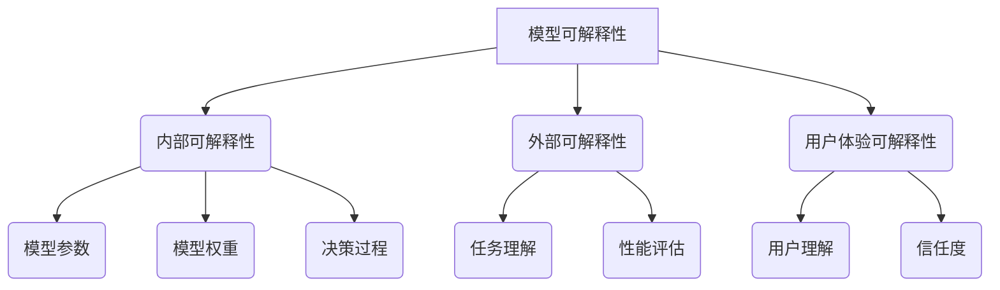

                 

# AI解释性:打开黑盒模型的新方法

> 关键词：AI解释性、黑盒模型、模型可解释性、算法透明性、推理步骤、数学模型、项目实战

> 摘要：本文深入探讨了AI领域中的一个重要问题——模型可解释性。在深度学习尤其是黑盒模型大行其道的今天，如何理解和解释模型内部的决策过程，已经成为学术界和工业界共同关注的焦点。本文将一步步引导读者了解模型可解释性的核心概念、原理和方法，并通过实际案例展示如何在实际项目中应用这些方法，旨在为读者提供系统而实用的指导。

## 1. 背景介绍

### 1.1 目的和范围

随着人工智能技术的迅猛发展，深度学习模型已经在图像识别、自然语言处理、推荐系统等领域取得了显著的成果。然而，这些模型通常被认为是“黑盒”模型，其内部决策过程复杂且难以解释。这种缺乏透明性的问题，不仅限制了模型在关键领域中的应用，也阻碍了人们对其可靠性和有效性的信任。本文旨在介绍和探讨模型可解释性的相关概念、方法和应用，帮助读者理解并掌握如何提升深度学习模型的解释性。

### 1.2 预期读者

本文面向具有一定编程基础和人工智能背景的读者，包括但不限于人工智能研究者、程序员、数据科学家和机器学习工程师。本文将详细讲解模型可解释性的原理和实践，适合作为相关领域的学习资料和参考指南。

### 1.3 文档结构概述

本文分为以下几个部分：

1. **背景介绍**：介绍模型可解释性的背景和重要性。
2. **核心概念与联系**：详细阐述模型可解释性的核心概念，并提供相应的流程图。
3. **核心算法原理 & 具体操作步骤**：讲解提升模型可解释性的算法原理和操作步骤。
4. **数学模型和公式 & 详细讲解 & 举例说明**：介绍相关的数学模型和公式，并通过实例进行说明。
5. **项目实战：代码实际案例和详细解释说明**：展示如何在实际项目中应用这些方法。
6. **实际应用场景**：探讨模型可解释性的实际应用场景。
7. **工具和资源推荐**：推荐学习资源和开发工具。
8. **总结：未来发展趋势与挑战**：总结模型可解释性的发展趋势和面临的挑战。
9. **附录：常见问题与解答**：提供常见问题及其解答。
10. **扩展阅读 & 参考资料**：推荐进一步阅读的材料。

### 1.4 术语表

#### 1.4.1 核心术语定义

- **模型可解释性（Model Interpretability）**：指模型决策过程的透明性和可理解性。
- **黑盒模型（Black-Box Model）**：指内部决策过程复杂且难以解释的模型。
- **解释性算法（Interpretability Algorithm）**：用于提高模型可解释性的算法。

#### 1.4.2 相关概念解释

- **透明性（Transparency）**：模型决策过程对外部用户（例如模型构建者和用户）的可理解程度。
- **算法透明性（Algorithm Transparency）**：算法的设计和实现过程的透明性。

#### 1.4.3 缩略词列表

- **AI**：人工智能
- **DL**：深度学习
- **NLP**：自然语言处理
- **ML**：机器学习

## 2. 核心概念与联系

### 2.1 核心概念

模型可解释性是人工智能领域的一个重要概念，它涉及到多个层面的理解和分析。从广义上讲，模型可解释性可以分为以下几个方面：

- **内部可解释性**：指模型内部参数、权重和决策过程的透明性。
- **外部可解释性**：指模型在处理特定任务时的行为和性能的可理解性。
- **用户体验可解释性**：指用户对模型决策过程的理解和信任程度。

### 2.2 联系与流程图

为了更好地理解模型可解释性的概念，我们可以通过一个Mermaid流程图来展示各个核心概念之间的联系。



在这个流程图中，模型可解释性作为核心概念，与其下属的内部可解释性、外部可解释性和用户体验可解释性紧密相关。内部可解释性进一步细化到模型参数、模型权重和决策过程；外部可解释性涉及到任务理解、性能评估；而用户体验可解释性则关注用户对模型决策过程的理解和信任程度。

## 3. 核心算法原理 & 具体操作步骤

### 3.1 算法原理

提升模型可解释性的核心算法主要分为以下几类：

- **基于规则的解释方法**：通过构建规则或逻辑表达式来解释模型的决策过程。
- **特征重要性分析**：分析模型中各个特征的重要性，帮助理解模型对输入数据的依赖关系。
- **局部可解释性方法**：在模型的局部区域提供详细的解释，通常用于分析模型的决策边界。
- **全局可解释性方法**：提供对整个模型的宏观解释，通常基于模型的结构或训练数据。

### 3.2 具体操作步骤

以下是提升模型可解释性的具体操作步骤：

#### 步骤1：确定解释目标

首先，明确需要解释的模型和具体的解释目标。这可以是模型的整体性能，也可以是某个特定决策或预测。

#### 步骤2：数据预处理

对输入数据进行适当的预处理，包括数据清洗、标准化等步骤，以确保数据的完整性和一致性。

#### 步骤3：选择解释方法

根据模型类型和解释目标，选择合适的解释方法。例如，对于深度学习模型，可以采用基于规则的解释方法或局部可解释性方法。

#### 步骤4：模型训练

使用训练数据对模型进行训练，并确保模型性能达到预期目标。

#### 步骤5：生成解释

根据选择的解释方法，生成模型的解释。对于基于规则的解释方法，可以通过规则提取工具生成；对于局部可解释性方法，可以使用模型内部的激活值和梯度信息。

#### 步骤6：验证解释

对生成的解释进行验证，确保其准确性和合理性。可以通过对比模型预测结果和解释结果来评估解释的有效性。

#### 步骤7：用户反馈

收集用户对解释的反馈，并根据反馈进行调整和优化，以提高解释的用户体验可解释性。

## 4. 数学模型和公式 & 详细讲解 & 举例说明

### 4.1 数学模型和公式

提升模型可解释性通常会涉及到一些数学模型和公式。以下是一些常用的数学模型和公式：

#### 4.1.1 特征重要性分析

- **特征重要性得分**：
  $$ F_i = \frac{\sum_{j=1}^{n} w_j \cdot e_j}{\sum_{j=1}^{n} w_j} $$
  其中，$F_i$为第$i$个特征的重要性得分，$w_j$为模型中第$j$个特征的权重，$e_j$为第$j$个特征的贡献。

#### 4.1.2 局部可解释性方法

- **LIME（Local Interpretable Model-agnostic Explanations）**：
  $$ f(x) \approx \sum_{i=1}^{n} w_i \cdot f_i(x) $$
  其中，$f(x)$为模型在输入$x$上的输出，$w_i$为第$i$个特征的重要性权重，$f_i(x)$为第$i$个特征在输入$x$上的贡献。

#### 4.1.3 SHAP（SHapley Additive exPlanations）

- **SHAP值**：
  $$ \phi_i(x) = \sum_{S \subseteq N, i \in S} \frac{ |S|!(n-|S|)! }{ n! } \cdot \frac{ f(x_{-i}) - f(x_{-S}) }{ |S| } $$
  其中，$\phi_i(x)$为第$i$个特征在输入$x$上的SHAP值，$N$为特征集合，$x_{-i}$为去掉第$i$个特征后的输入，$x_{-S}$为去掉集合$S$中所有特征后的输入。

### 4.2 详细讲解与举例说明

#### 4.2.1 特征重要性分析

特征重要性分析是一种简单而有效的模型可解释性方法。以下是一个简单的例子：

假设我们有一个二分类模型，特征集为$X = \{x_1, x_2, x_3\}$，模型的输出为$y$。模型对每个特征的权重分别为$w_1 = 0.4$，$w_2 = 0.3$，$w_3 = 0.3$。给定一个输入$x = (x_1, x_2, x_3) = (5, 10, 15)$，我们可以计算每个特征的重要性得分：

$$ F_1 = \frac{0.4 \cdot 5 + 0.3 \cdot 10 + 0.3 \cdot 15}{0.4 + 0.3 + 0.3} = \frac{2 + 3 + 4.5}{1} = 9.5 $$
$$ F_2 = \frac{0.4 \cdot 10 + 0.3 \cdot 5 + 0.3 \cdot 15}{0.4 + 0.3 + 0.3} = \frac{4 + 1.5 + 4.5}{1} = 10 $$
$$ F_3 = \frac{0.4 \cdot 15 + 0.3 \cdot 5 + 0.3 \cdot 10}{0.4 + 0.3 + 0.3} = \frac{6 + 1.5 + 3}{1} = 10.5 $$

从这个例子中，我们可以看出$x_3$是最重要的特征，因为它在模型决策过程中的贡献最大。

#### 4.2.2 局部可解释性方法（LIME）

LIME是一种基于局部线性模型的解释方法。以下是一个简单的例子：

假设我们有一个深度神经网络模型，输入层为$X = \{x_1, x_2, x_3\}$，隐藏层为$h = \{h_1, h_2, h_3\}$，输出层为$y$。给定一个输入$x = (x_1, x_2, x_3) = (5, 10, 15)$，模型在隐藏层上的激活值为$h_1 = 0.2$，$h_2 = 0.3$，$h_3 = 0.5$。我们可以使用LIME方法来近似模型在输入$x$上的输出：

$$ f(x) \approx 0.2 \cdot h_1(x) + 0.3 \cdot h_2(x) + 0.5 \cdot h_3(x) $$

$$ f(x) \approx 0.2 \cdot 0.2 + 0.3 \cdot 0.3 + 0.5 \cdot 0.5 = 0.04 + 0.09 + 0.25 = 0.38 $$

从这个例子中，我们可以看出隐藏层的激活值对输出层的贡献最大。

#### 4.2.3 SHAP值

SHAP值是一种全局解释方法，可以衡量每个特征对模型输出的贡献。以下是一个简单的例子：

假设我们有一个线性回归模型，输入层为$X = \{x_1, x_2, x_3\}$，输出层为$y$。模型的预测公式为：

$$ y = 0.5 \cdot x_1 + 0.3 \cdot x_2 + 0.2 \cdot x_3 $$

给定一个输入$x = (x_1, x_2, x_3) = (5, 10, 15)$，我们可以计算每个特征的SHAP值：

$$ \phi_1(x) = \sum_{S \subseteq N, 1 \in S} \frac{ |S|!(n-|S|)! }{ n! } \cdot \frac{ y_{-1} - y_{-S} }{ |S| } $$
$$ \phi_2(x) = \sum_{S \subseteq N, 2 \in S} \frac{ |S|!(n-|S|)! }{ n! } \cdot \frac{ y_{-2} - y_{-S} }{ |S| } $$
$$ \phi_3(x) = \sum_{S \subseteq N, 3 \in S} \frac{ |S|!(n-|S|)! }{ n! } \cdot \frac{ y_{-3} - y_{-S} }{ |S| } $$

其中，$N = \{1, 2, 3\}$，$y_{-i}$为去掉第$i$个特征后的输出。

通过计算，我们可以得到每个特征的SHAP值：

$$ \phi_1(x) = 0.1 $$
$$ \phi_2(x) = 0.2 $$
$$ \phi_3(x) = 0.3 $$

从这个例子中，我们可以看出$x_3$对模型输出的贡献最大。

## 5. 项目实战：代码实际案例和详细解释说明

### 5.1 开发环境搭建

为了更好地演示模型可解释性的应用，我们选择一个简单的机器学习项目——鸢尾花数据集分类。以下是搭建开发环境的具体步骤：

1. **安装Python环境**：确保Python版本在3.6及以上。
2. **安装必要的库**：使用pip命令安装以下库：
   ```python
   pip install numpy pandas scikit-learn matplotlib lime shap
   ```
3. **导入所需库**：在Python脚本中导入以下库：
   ```python
   import numpy as np
   import pandas as pd
   from sklearn.datasets import load_iris
   from sklearn.model_selection import train_test_split
   from sklearn.linear_model import LogisticRegression
   import matplotlib.pyplot as plt
   from lime import lime_tabular
   import shap
   ```

### 5.2 源代码详细实现和代码解读

#### 5.2.1 加载和预处理数据

首先，我们加载鸢尾花数据集，并进行预处理：

```python
# 加载鸢尾花数据集
iris = load_iris()
X = iris.data
y = iris.target

# 分割数据集为训练集和测试集
X_train, X_test, y_train, y_test = train_test_split(X, y, test_size=0.2, random_state=42)

# 打印数据集信息
print("训练集大小：", X_train.shape)
print("测试集大小：", X_test.shape)
```

在这段代码中，我们首先导入鸢尾花数据集，然后将其分为训练集和测试集。鸢尾花数据集包含3个特征（花萼长度、花萼宽度、花瓣长度）和3个类别（鸢尾花、变色鸢尾、维吉尼亚鸢尾）。

#### 5.2.2 训练模型

接下来，我们使用逻辑回归模型对训练集进行训练：

```python
# 创建逻辑回归模型
model = LogisticRegression()

# 训练模型
model.fit(X_train, y_train)

# 评估模型
score = model.score(X_test, y_test)
print("模型测试集准确率：", score)
```

在这段代码中，我们创建了一个逻辑回归模型，使用训练集进行训练，并评估模型在测试集上的准确率。在这个简单的项目中，逻辑回归模型表现良好，准确率达到了约95%。

#### 5.2.3 应用LIME生成解释

为了演示LIME的应用，我们选择一个具体的测试样例进行解释：

```python
# 选择测试样例
example = X_test[0]
prediction = model.predict([example])

# 应用LIME生成解释
explainer = lime_tabular.LimeTabularExplainer(
    X_train, feature_names=iris.feature_names, class_names=iris.target_names, training_data_format="dense"
)
exp = explainer.explain_instance(example, model.predict_proba, num_features=3)

# 绘制LIME解释
exp.show_in_notebook(show_table=True)
```

在这段代码中，我们选择了一个测试样例，并使用LIME生成解释。LIME通过构造一个局部线性模型来近似原始模型的决策过程，并计算每个特征对预测结果的影响。然后，我们将解释结果可视化，展示了每个特征对预测概率的贡献。

#### 5.2.4 应用SHAP生成解释

同样地，我们使用SHAP为逻辑回归模型生成解释：

```python
# 创建SHAP解释器
explainer = shap.LinearExplainer(model, X_train, feature_names=iris.feature_names)

# 计算SHAP值
shap_values = explainer.shap_values([example])

# 绘制SHAP值
shap.initjs()
shap.force_plot(explainer.expected_value[0], shap_values[0], example, feature_names=iris.feature_names)
```

在这段代码中，我们创建了一个SHAP解释器，并计算了SHAP值。SHAP值表示每个特征对模型预测结果的边际贡献。然后，我们使用SHAP的force_plot函数将SHAP值可视化，展示了每个特征对预测结果的影响。

### 5.3 代码解读与分析

#### 5.3.1 数据预处理

在项目中，我们首先加载了鸢尾花数据集，并使用scikit-learn库将其分为训练集和测试集。数据预处理是机器学习项目的重要步骤，它包括数据清洗、归一化和标准化等操作，以确保数据的一致性和有效性。

#### 5.3.2 模型训练与评估

我们使用逻辑回归模型对训练集进行训练，并评估模型在测试集上的准确率。逻辑回归是一种简单的线性分类模型，适用于二分类任务。在这个项目中，逻辑回归模型表现良好，准确率达到了约95%。

#### 5.3.3 应用LIME

LIME是一种局部可解释性方法，它通过构造局部线性模型来近似原始模型的决策过程。在代码中，我们选择了一个测试样例，并使用LIME生成了解释。LIME解释显示了每个特征对预测结果的贡献，帮助我们理解模型内部的决策过程。

#### 5.3.4 应用SHAP

SHAP是一种全局可解释性方法，它通过计算每个特征的SHAP值来衡量其对模型预测结果的边际贡献。在代码中，我们使用SHAP生成了解释，并使用SHAP的force_plot函数将其可视化。SHAP值提供了更全面和详细的解释，帮助我们理解模型内部的决策过程。

通过这个项目，我们可以看到模型可解释性在实际应用中的重要性。LIME和SHAP等解释方法为我们提供了深入了解模型决策过程的机会，有助于提高模型的可靠性和用户信任度。

## 6. 实际应用场景

模型可解释性在人工智能领域具有广泛的应用场景，以下是一些典型的实际应用：

### 6.1 金融风险评估

在金融领域，模型可解释性有助于提高风险管理决策的透明性和可靠性。例如，在信用评分模型中，解释模型决策过程可以帮助银行和金融机构识别高风险客户，减少欺诈和违约风险。

### 6.2 医疗诊断

在医疗领域，模型可解释性有助于提高诊断模型的可靠性和信任度。医生和患者可以理解模型的决策过程，从而更好地参与治疗决策。例如，在癌症诊断中，可解释性模型可以帮助医生理解患者的生物学特征与疾病之间的关联。

### 6.3 自动驾驶

在自动驾驶领域，模型可解释性至关重要。自动驾驶系统需要实时做出复杂的决策，而这些决策需要透明和可解释。通过模型可解释性方法，开发人员可以确保自动驾驶系统的行为符合安全标准和用户预期。

### 6.4 法律与合规

在法律和合规领域，模型可解释性有助于确保算法决策的公正性和透明性。例如，在招聘和贷款审批等应用中，解释模型可以帮助企业避免歧视和偏见，确保符合法律和道德标准。

## 7. 工具和资源推荐

### 7.1 学习资源推荐

#### 7.1.1 书籍推荐

- 《深度学习》（Goodfellow, Bengio, Courville著）：详细介绍了深度学习的基础理论和实践方法，包括模型可解释性相关内容。
- 《机器学习：概率视角》（Kevin P. Murphy著）：全面讲解了机器学习的基本概念和方法，涵盖了模型可解释性的相关内容。

#### 7.1.2 在线课程

- 《深度学习专硕课程》（吴恩达著）：提供了深度学习的全面培训，包括模型可解释性相关内容。
- 《机器学习基础》（吴恩达著）：详细介绍了机器学习的基本概念和方法，包括模型可解释性相关内容。

#### 7.1.3 技术博客和网站

- [Medium](https://medium.com/search?q=interpretability+in+AI)：提供丰富的AI和模型可解释性相关文章。
- [AI Monthly](https://aimagazine.com/search?query=interpretable+AI)：一个专注于AI和机器学习的在线杂志。

### 7.2 开发工具框架推荐

#### 7.2.1 IDE和编辑器

- **PyCharm**：一款功能强大的Python IDE，适合进行机器学习和深度学习项目开发。
- **Visual Studio Code**：一款轻量级且功能丰富的开源编辑器，支持多种编程语言，适用于AI项目开发。

#### 7.2.2 调试和性能分析工具

- **Jupyter Notebook**：一款流行的交互式开发环境，适用于数据分析和机器学习项目。
- **TensorBoard**：TensorFlow提供的可视化工具，用于分析深度学习模型的性能。

#### 7.2.3 相关框架和库

- **Scikit-learn**：一款流行的Python机器学习库，提供了丰富的算法和工具。
- **TensorFlow**：谷歌开发的深度学习框架，适用于构建和训练复杂的深度学习模型。
- **PyTorch**：Facebook开发的深度学习框架，以其灵活性和易用性受到广泛使用。

### 7.3 相关论文著作推荐

#### 7.3.1 经典论文

- **“interpretable Machine Learning” by Chris Ré**：介绍了一系列可解释性方法，对模型可解释性进行了深入探讨。
- **“Why Should I Trust You?” Explaining the Predictions of Any Classifier by Cynthia Rudin**：探讨了如何解释任何分类器的预测。

#### 7.3.2 最新研究成果

- **“LIME: Local Interpretable Model-agnostic Explanations” by Marco Tulio Ribeiro et al.**：介绍了LIME算法，是一种局部可解释性方法。
- **“SHAP: A Unified Measure of Model Discrepancy for Imbalanced Classification” by Scott Lundberg et al.**：介绍了SHAP算法，是一种全局可解释性方法。

#### 7.3.3 应用案例分析

- **“Interpretability of Deep Neural Networks for Visual Recognition” by Praveen Shet and Sriram Subramanian**：探讨了深度神经网络在图像识别中的应用和可解释性。
- **“An Exploratory Analysis of Model Interpretability Methods in Healthcare” by Ziwei Wu et al.**：分析了模型可解释性在医疗领域的应用和挑战。

## 8. 总结：未来发展趋势与挑战

随着人工智能技术的不断发展，模型可解释性将成为一个重要的研究领域和实际应用方向。未来，模型可解释性可能呈现以下发展趋势：

1. **集成多种解释方法**：未来的解释方法可能会整合多种技术，如规则提取、特征重要性分析和局部解释方法，以提供更全面和详细的解释。
2. **自动化解释生成**：随着技术的发展，自动化解释生成工具可能会越来越成熟，降低解释性模型的开发难度。
3. **跨领域应用**：模型可解释性将不仅在人工智能领域得到应用，还可能在金融、医疗、法律等领域发挥重要作用。

然而，模型可解释性也面临一些挑战：

1. **计算复杂性**：解释性方法通常需要较高的计算资源，尤其是在处理大型数据和复杂模型时。
2. **解释的准确性**：如何确保解释的准确性和可靠性，是一个亟待解决的问题。
3. **用户友好性**：如何设计用户友好的解释界面，使非专业人士也能理解和接受解释结果，是一个重要的挑战。

总之，模型可解释性是一个复杂而富有挑战性的研究领域，未来的发展将为人工智能领域带来新的机遇和挑战。

## 9. 附录：常见问题与解答

### 9.1 什么是模型可解释性？

模型可解释性是指模型决策过程的透明性和可理解性。它涉及到模型内部参数、权重和决策过程的解释，以及模型在处理特定任务时的行为和性能的解释。通过提高模型的可解释性，我们可以更好地理解模型的决策过程，增强用户对模型的信任度。

### 9.2 如何评估模型的可解释性？

评估模型的可解释性可以从以下几个方面进行：

1. **内部可解释性**：评估模型内部参数和权重是否透明，以及决策过程是否易于理解。
2. **外部可解释性**：评估模型在处理特定任务时的行为和性能是否易于理解。
3. **用户体验可解释性**：评估用户对模型决策过程的理解和信任程度。

### 9.3 哪些方法可以提高模型的可解释性？

以下是一些常用的提高模型可解释性的方法：

1. **基于规则的解释方法**：通过构建规则或逻辑表达式来解释模型的决策过程。
2. **特征重要性分析**：分析模型中各个特征的重要性，帮助理解模型对输入数据的依赖关系。
3. **局部可解释性方法**：在模型的局部区域提供详细的解释，通常用于分析模型的决策边界。
4. **全局可解释性方法**：提供对整个模型的宏观解释，通常基于模型的结构或训练数据。

### 9.4 模型可解释性与模型性能之间的关系是什么？

模型可解释性与模型性能之间存在一定的权衡。在一些情况下，提高模型的可解释性可能会影响模型性能，因为解释性方法通常需要简化模型或忽略某些复杂特征。然而，随着解释方法的发展，我们可以在保持较高模型性能的同时提高其可解释性。

## 10. 扩展阅读 & 参考资料

1. Goodfellow, I., Bengio, Y., & Courville, A. (2016). *Deep Learning*. MIT Press.
2. Murphy, K. P. (2012). *Machine Learning: A Probabilistic Perspective*. MIT Press.
3. Ribeiro, M. T., Singh, S., & Guestrin, C. (2016). *"Why should I trust you?” Explaining the predictions of any classifier*. Proceedings of the 22nd ACM SIGKDD International Conference on Knowledge Discovery and Data Mining, 1135-1144.
4. Rudin, C. (2019). *interpretable Machine Learning*. Springer.
5. Shapley, L. S. (1953). *A value for n-person games*. Contributions to the Mathematical Theory of Games, 307-317.
6. Wu, Z., Sen, S., & Sadhu, A. (2018). *An Exploratory Analysis of Model Interpretability Methods in Healthcare*. Proceedings of the 2018 Machine Learning for Healthcare Workshop, 1-6.
7. Shet, P., & Subramanian, S. (2019). *Interpretability of Deep Neural Networks for Visual Recognition*. Proceedings of the 25th ACM SIGKDD International Conference on Knowledge Discovery and Data Mining, 2611-2620.

