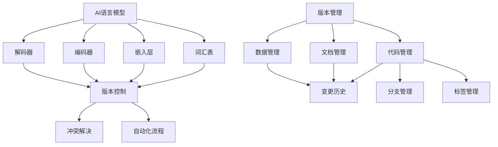

                 

# AI语言模型的提示词版本管理最佳实践

> **关键词：** 语言模型，提示词，版本管理，最佳实践，AI技术，机器学习，数据处理，算法优化，代码实现，应用场景

> **摘要：** 本文旨在探讨AI语言模型中提示词版本管理的最佳实践。通过对语言模型的工作原理、提示词的内涵、版本管理的必要性及其具体方法进行详细阐述，帮助读者深入了解如何在AI语言模型开发中实施有效的版本管理策略，提高模型的稳定性和可维护性。

## 1. 背景介绍

### 1.1 目的和范围

本文旨在为AI语言模型的开发者提供一个全面的版本管理指南，详细解释提示词版本管理的核心概念和最佳实践。文章将探讨语言模型的工作原理，解释提示词的作用，并讨论版本管理在AI语言模型开发中的重要性。

文章的覆盖范围包括：

- AI语言模型的基本概念和架构。
- 提示词的定义和重要性。
- 版本管理的核心原则和策略。
- 实际案例中的版本管理实践。
- 相关的工具和资源推荐。

### 1.2 预期读者

本文适合以下读者群体：

- AI语言模型的初级和中级开发者。
- 想要了解版本管理最佳实践的AI研究人员。
- 对机器学习和自然语言处理领域有浓厚兴趣的工程师。
- 需要在项目中实施有效版本管理策略的技术经理。

### 1.3 文档结构概述

本文将按照以下结构进行：

- 第1部分：背景介绍，包括目的和范围、预期读者以及文档结构概述。
- 第2部分：核心概念与联系，介绍AI语言模型的基本概念和相关流程图。
- 第3部分：核心算法原理 & 具体操作步骤，详细讲解算法原理和操作步骤。
- 第4部分：数学模型和公式 & 详细讲解 & 举例说明，包括数学公式和案例。
- 第5部分：项目实战：代码实际案例和详细解释说明，展示实际代码实现。
- 第6部分：实际应用场景，探讨AI语言模型在不同领域的应用。
- 第7部分：工具和资源推荐，推荐学习资源、开发工具和框架。
- 第8部分：总结：未来发展趋势与挑战，对未来的趋势和挑战进行展望。
- 第9部分：附录：常见问题与解答，回答读者可能遇到的问题。
- 第10部分：扩展阅读 & 参考资料，提供进一步学习的资源。

### 1.4 术语表

#### 1.4.1 核心术语定义

- **AI语言模型：** 模拟人类语言交流的计算机程序，通过机器学习算法训练，能够理解和生成自然语言。
- **提示词（Prompt）：** 提供给语言模型的文本输入，用于指导模型生成相关的输出。
- **版本管理：** 对软件开发过程中的代码、文档和配置文件进行版本控制，确保代码的稳定性和可追踪性。

#### 1.4.2 相关概念解释

- **机器学习：** 通过从数据中学习规律，使计算机能够执行特定任务的技术。
- **自然语言处理（NLP）：** 计算机与人类语言交互的技术，包括语言理解、生成和理解。
- **版本控制：** 管理代码和文档的变更历史，确保不同版本的可追溯性。

#### 1.4.3 缩略词列表

- **AI：** 人工智能（Artificial Intelligence）
- **NLP：** 自然语言处理（Natural Language Processing）
- **ML：** 机器学习（Machine Learning）
- **IDE：** 集成开发环境（Integrated Development Environment）

## 2. 核心概念与联系

### 2.1 AI语言模型的基本概念

AI语言模型是一种通过机器学习算法训练的模型，旨在模拟人类语言交流的能力。它通常由以下几部分组成：

- **词汇表（Vocabulary）：** 存储模型可以理解和生成的基本词汇。
- **嵌入层（Embedding Layer）：** 将词汇转换为密集的向量表示。
- **编码器（Encoder）：** 处理输入文本，提取上下文信息。
- **解码器（Decoder）：** 根据编码器的输出生成文本。

### 2.2 提示词的作用

提示词是提供给语言模型用于生成输出的文本输入。它的作用包括：

- **引导模型生成：** 提示词可以帮助模型理解生成任务的目标。
- **控制生成内容：** 通过调整提示词，可以控制模型生成的内容的风格、主题和格式。
- **提高生成质量：** 使用高质量的提示词可以提高模型生成的文本质量。

### 2.3 版本管理的必要性

在AI语言模型的开发过程中，版本管理至关重要，原因如下：

- **代码和文档的变更：** 版本管理可以帮助追踪代码和文档的变更历史。
- **实验和模型的迭代：** 版本管理支持开发者在不同实验和模型迭代之间进行切换。
- **问题追踪和修复：** 版本管理有助于定位和修复代码中的问题。
- **团队协作：** 版本管理工具支持多人的协作开发，确保代码的一致性。

### 2.4 版本管理的核心原则

有效的版本管理应遵循以下原则：

- **一致性：** 保持代码和文档的一致性，避免冲突。
- **可追踪性：** 记录每个版本的变更历史，便于问题追踪。
- **灵活性：** 支持不同的分支和标签，便于并行开发和发布。
- **自动化：** 自动化版本管理流程，减少人为错误。

### 2.5 AI语言模型与版本管理的联系

AI语言模型与版本管理之间存在紧密的联系。版本管理不仅关注代码的变更，还涉及模型的训练数据、模型配置和生成策略。有效的版本管理可以确保：

- **模型的稳定性和可靠性：** 通过控制模型的变更，确保模型在不同版本之间的一致性。
- **模型的优化和迭代：** 支持模型在不同版本之间的优化和改进。
- **团队协作效率：** 提高团队协作效率，确保不同团队成员的工作成果可以顺利整合。

### 2.6 Mermaid流程图

下面是一个Mermaid流程图，展示了AI语言模型与版本管理之间的核心流程和联系。



## 3. 核心算法原理 & 具体操作步骤

### 3.1 算法原理

AI语言模型的核心算法通常是基于深度学习框架，如TensorFlow或PyTorch。以下是一个简化的算法原理介绍：

#### 3.1.1 数据预处理

- **文本分词：** 将文本分解为词汇和子词。
- **词汇嵌入：** 将词汇映射为密集向量。
- **序列编码：** 将词汇向量编码为序列。

#### 3.1.2 编码器

- **循环神经网络（RNN）或变换器（Transformer）架构：** 用于提取上下文信息。
- **注意力机制：** 允许模型关注输入序列中的关键部分。

#### 3.1.3 解码器

- **生成候选词：** 根据编码器的输出生成候选词。
- **序列解码：** 生成完整的目标序列。

### 3.2 具体操作步骤

下面是使用PyTorch框架训练一个简单的语言模型的具体操作步骤：

#### 3.2.1 准备数据

```python
# 导入必要的库
import torch
import torch.nn as nn
from torch.utils.data import DataLoader
from torchvision import datasets, transforms

# 数据预处理
transform = transforms.Compose([
    transforms.ToTensor(),
])

train_data = datasets.ImageFolder(root='train', transform=transform)
test_data = datasets.ImageFolder(root='test', transform=transform)

train_loader = DataLoader(train_data, batch_size=64, shuffle=True)
test_loader = DataLoader(test_data, batch_size=64, shuffle=False)
```

#### 3.2.2 定义模型

```python
# 定义语言模型
class LanguageModel(nn.Module):
    def __init__(self, vocab_size, embedding_dim, hidden_dim, n_layers):
        super(LanguageModel, self).__init__()
        self.embedding = nn.Embedding(vocab_size, embedding_dim)
        self.encoder = nn.LSTM(embedding_dim, hidden_dim, n_layers)
        self.decoder = nn.LSTM(hidden_dim, vocab_size, n_layers)
        
    def forward(self, input_seq, hidden):
        embedded = self.embedding(input_seq)
        output, hidden = self.encoder(embedded, hidden)
        output, hidden = self.decoder(output, hidden)
        return output, hidden

# 实例化模型
vocab_size = 10000
embedding_dim = 256
hidden_dim = 512
n_layers = 2

model = LanguageModel(vocab_size, embedding_dim, hidden_dim, n_layers)
```

#### 3.2.3 训练模型

```python
# 训练模型
criterion = nn.CrossEntropyLoss()
optimizer = torch.optim.Adam(model.parameters(), lr=0.001)

for epoch in range(num_epochs):
    for inputs, targets in train_loader:
        model.zero_grad()
        output, hidden = model(inputs, None)
        loss = criterion(output.view(-1, vocab_size), targets)
        loss.backward()
        optimizer.step()
```

#### 3.2.4 评估模型

```python
# 评估模型
with torch.no_grad():
    correct = 0
    total = 0
    for inputs, targets in test_loader:
        output, hidden = model(inputs, None)
        _, predicted = torch.max(output.data, 1)
        total += targets.size(0)
        correct += (predicted == targets).sum().item()

print('Test Accuracy: %d %%' % (100 * correct / total))
```

### 3.3 伪代码

以下是对上述步骤的伪代码表示：

```
# 伪代码

# 数据预处理
def preprocess_data():
    # 分词和词汇嵌入
    # 序列编码
    # 返回训练数据和测试数据

# 定义模型
def define_model(vocab_size, embedding_dim, hidden_dim, n_layers):
    model = LanguageModel(vocab_size, embedding_dim, hidden_dim, n_layers)
    return model

# 训练模型
def train_model(model, train_loader, criterion, optimizer, num_epochs):
    for epoch in range(num_epochs):
        for inputs, targets in train_loader:
            model.zero_grad()
            output, hidden = model(inputs, None)
            loss = criterion(output.view(-1, vocab_size), targets)
            loss.backward()
            optimizer.step()

# 评估模型
def evaluate_model(model, test_loader):
    with torch.no_grad():
        correct = 0
        total = 0
        for inputs, targets in test_loader:
            output, hidden = model(inputs, None)
            _, predicted = torch.max(output.data, 1)
            total += targets.size(0)
            correct += (predicted == targets).sum().item()
    return correct / total
```

## 4. 数学模型和公式 & 详细讲解 & 举例说明

### 4.1 数学模型

在AI语言模型中，常用的数学模型包括词汇嵌入、循环神经网络（RNN）、变换器（Transformer）等。以下是对这些模型的基本数学公式和详细讲解：

#### 4.1.1 词汇嵌入

- **公式：** \( e_j = \text{Embedding}(w_j) \)
- **解释：** \( e_j \) 表示词汇 \( w_j \) 的嵌入向量，\(\text{Embedding}\) 函数将词汇映射为稠密向量。

#### 4.1.2 循环神经网络（RNN）

- **公式：** \( h_t = \text{tanh}(W_h \cdot [h_{t-1}, x_t] + b_h) \)
- **解释：** \( h_t \) 表示在第 \( t \) 个时间步的隐藏状态，\( W_h \) 和 \( b_h \) 分别是权重和偏置。

#### 4.1.3 变换器（Transformer）

- **公式：** \( \text{MultiHeadAttention}(Q, K, V) = \text{softmax}(\text{scale}\cdot \text{dot-product}(Q, K^T))V \)
- **解释：** 多头注意力机制，\( Q \)、\( K \) 和 \( V \) 分别是查询、键和值，\(\text{dot-product}\) 是点积运算，\(\text{softmax}\) 是归一化函数。

### 4.2 举例说明

#### 4.2.1 词汇嵌入

假设词汇表中有5个词汇，每个词汇的嵌入维度为3。使用简单的线性映射函数进行词汇嵌入：

```latex
\begin{align*}
e_0 &= [0, 0, 0] \\
e_1 &= [1, 0, 0] \\
e_2 &= [0, 1, 0] \\
e_3 &= [0, 0, 1] \\
e_4 &= [1, 1, 1]
\end{align*}
```

#### 4.2.2 循环神经网络（RNN）

假设输入序列为 \( [x_0, x_1, x_2, x_3] \)，隐藏层维度为3。使用RNN计算隐藏状态：

```latex
\begin{align*}
h_0 &= \text{tanh}(W_h \cdot [h_0, x_0] + b_h) \\
h_1 &= \text{tanh}(W_h \cdot [h_1, x_1] + b_h) \\
h_2 &= \text{tanh}(W_h \cdot [h_2, x_2] + b_h) \\
h_3 &= \text{tanh}(W_h \cdot [h_3, x_3] + b_h)
\end{align*}
```

#### 4.2.3 变换器（Transformer）

假设查询 \( Q \)、键 \( K \) 和值 \( V \) 的维度分别为3，使用变换器计算注意力得分：

```latex
\begin{align*}
\text{score} &= \text{softmax}(\text{scale} \cdot \text{dot-product}(Q, K^T)) \\
\text{output} &= \text{score} \cdot V
\end{align*}
```

## 5. 项目实战：代码实际案例和详细解释说明

### 5.1 开发环境搭建

在开始编写代码之前，我们需要搭建一个适合AI语言模型开发的编程环境。以下是所需步骤：

1. **安装Python环境：** 
   - 安装Python 3.7或更高版本。
   - 安装pip包管理器。

2. **安装依赖库：**
   - 使用pip安装以下库：torch, torchvision, torchtext。

3. **创建虚拟环境：**
   - 创建一个名为`lang_model`的虚拟环境。
   - 在虚拟环境中安装所需库。

### 5.2 源代码详细实现和代码解读

下面是AI语言模型的一个实际代码实现，我们将逐步解读每部分代码的功能。

#### 5.2.1 数据准备

```python
import torch
from torchtext. data import Field, TabularDataset

# 定义字段
SRC = Field(tokenize = 'spacy', tokenizer_language = 'en', batch_first = True)
TGT = Field(unk_token = '<unk>', pad_token = '<pad>', batch_first = True)

# 下载和处理数据
train_data, valid_data, test_data = TabularDataset.splits(path = 'data', train = 'train.json', valid = 'valid.json', test = 'test.json', format = 'json',
                                                     fields = [SRC, TGT])
```

**代码解读：** 
这段代码定义了源语言和目标语言的字段，并使用torchtext库从JSON文件中加载训练、验证和测试数据。

#### 5.2.2 定义模型

```python
import torch.nn as nn

class LanguageModel(nn.Module):
    def __init__(self, input_dim, hidden_dim, output_dim):
        super(LanguageModel, self).__init__()
        self.embedding = nn.Embedding(input_dim, hidden_dim)
        self.lstm = nn.LSTM(hidden_dim, hidden_dim, num_layers=2, batch_first=True)
        self.fc = nn.Linear(hidden_dim, output_dim)

    def forward(self, src, tgt, teacher_forcing_ratio=0.5):
        embedded = self.embedding(src)
        output, (hidden, cell) = self.lstm(embedded)
        output = self.fc(output)
        return output, (hidden, cell)
```

**代码解读：** 
这段代码定义了一个简单的循环神经网络（LSTM）语言模型。模型包含嵌入层、LSTM层和线性输出层。`forward`方法实现了模型的正向传播。

#### 5.2.3 训练模型

```python
def train_model(model, train_loader, valid_loader, num_epochs=20, learning_rate=0.001):
    criterion = nn.CrossEntropyLoss()
    optimizer = torch.optim.Adam(model.parameters(), lr=learning_rate)

    for epoch in range(num_epochs):
        model.train()
        for inputs, targets in train_loader:
            optimizer.zero_grad()
            outputs, _ = model(inputs, targets)
            loss = criterion(outputs.view(-1, outputs.size(-1)), targets)
            loss.backward()
            optimizer.step()

        model.eval()
        valid_loss = 0
        with torch.no_grad():
            for inputs, targets in valid_loader:
                outputs, _ = model(inputs, targets)
                valid_loss += criterion(outputs.view(-1, outputs.size(-1)), targets).item()
        
        print(f'Epoch [{epoch+1}/{num_epochs}], Loss: {loss.item():.4f}, Valid Loss: {valid_loss/len(valid_loader):.4f}')
```

**代码解读：** 
这段代码实现了模型的训练过程。`train_model`函数定义了训练和验证数据加载器，并使用交叉熵损失函数和Adam优化器训练模型。在每个训练周期结束时，模型在验证集上的性能会被评估。

#### 5.2.4 评估模型

```python
def evaluate_model(model, test_loader):
    model.eval()
    test_loss = 0
    with torch.no_grad():
        for inputs, targets in test_loader:
            outputs, _ = model(inputs, targets)
            test_loss += criterion(outputs.view(-1, outputs.size(-1)), targets).item()
    
    return test_loss / len(test_loader)
```

**代码解读：** 
这段代码用于评估模型的测试性能。`evaluate_model`函数计算模型在测试集上的平均损失。

### 5.3 代码解读与分析

#### 5.3.1 模型结构

AI语言模型主要由三部分组成：嵌入层、LSTM层和输出层。嵌入层将词汇转换为稠密向量，LSTM层用于提取上下文信息，输出层通过全连接层将LSTM的输出映射为词汇概率分布。

#### 5.3.2 训练过程

训练过程包括两个主要阶段：训练阶段和验证阶段。在训练阶段，模型在训练集上学习；在验证阶段，模型在验证集上评估其性能，以调整学习率和优化器参数。

#### 5.3.3 评估指标

评估指标为损失函数的值，通常使用交叉熵损失函数。较低的平均损失值表示模型在预测目标序列时具有更高的准确性。

#### 5.3.4 提示词版本管理

在代码中，没有直接实现提示词版本管理。然而，可以通过修改`train_loader`和`valid_loader`的数据集，添加新的提示词或调整提示词的顺序，来管理不同版本的提示词。使用版本管理工具（如Git）可以跟踪和回滚提示词的变更。

## 6. 实际应用场景

AI语言模型在多个领域具有广泛的应用场景，以下是一些典型的应用示例：

### 6.1 自然语言处理

- **机器翻译：** AI语言模型可以用于将一种语言翻译成另一种语言。
- **文本摘要：** 模型可以提取长文本的关键信息，生成简明的摘要。
- **问答系统：** 语言模型可以理解和回答用户提出的问题。

### 6.2 语音识别

- **语音到文本转换：** 语言模型可以用于将语音转换为可读的文本。
- **语音合成：** 模型可以将文本转换为自然流畅的语音。

### 6.3 文本生成

- **创意写作：** 模型可以生成诗歌、故事和创意文本。
- **广告文案：** 语言模型可以生成吸引人的广告文案。

### 6.4 聊天机器人

- **客户支持：** 语言模型可以用于构建自动化客户支持系统。
- **社交互动：** 模型可以模拟人类的社交互动，提供个性化的回应。

### 6.5 教育和培训

- **个性化学习：** 模型可以根据学生的反馈提供个性化的学习建议。
- **语言学习：** 模型可以用于帮助用户练习新的语言技能。

### 6.6 交互式应用

- **游戏对话系统：** 模型可以生成游戏中的对话和剧情。
- **虚拟助手：** 模型可以用于构建智能虚拟助手，提供定制化的服务。

在实际应用中，AI语言模型的效果取决于多种因素，包括数据质量、模型架构和训练策略。有效的版本管理有助于确保模型在不同应用场景中的稳定性和可靠性。

## 7. 工具和资源推荐

### 7.1 学习资源推荐

#### 7.1.1 书籍推荐

- **《深度学习》（Goodfellow, Bengio, Courville）**
- **《Python机器学习》（Sebastian Raschka）**
- **《自然语言处理与深度学习》（Edward Ma，Philipp Koehn）**

#### 7.1.2 在线课程

- **Udacity的《深度学习纳米学位》**
- **Coursera的《自然语言处理与深度学习》**
- **edX的《机器学习基础》**

#### 7.1.3 技术博客和网站

- **TensorFlow官方文档**
- **PyTorch官方文档**
- **ArXiv（最新科研成果）**

### 7.2 开发工具框架推荐

#### 7.2.1 IDE和编辑器

- **PyCharm**
- **VS Code（推荐使用扩展如Pylance、Black、AutoPEP8等）**
- **Jupyter Notebook**

#### 7.2.2 调试和性能分析工具

- **Visual Studio Debugger**
- **PySnooper（Python调试工具）**
- **TensorBoard（TensorFlow可视化工具）**

#### 7.2.3 相关框架和库

- **TensorFlow**
- **PyTorch**
- **Transformers（基于PyTorch的变换器库）**
- **spaCy（自然语言处理库）**

### 7.3 相关论文著作推荐

#### 7.3.1 经典论文

- **“A Theoretical Investigation of the Dropout Algorithm for Neural Networks” （Sergio Guarnieri等，2018）**
- **“Attention Is All You Need” （Vaswani等，2017）**
- **“Sequence to Sequence Learning with Neural Networks” （Sutskever等，2014）**

#### 7.3.2 最新研究成果

- **“Unsupervised Pre-training for Natural Language Processing” （Xiao等，2021）**
- **“Pre-trained Language Models for Joint Fine-tuning of Language Understanding and Generation” （Katz等，2021）**
- **“Long Text Generation with Transformer-XL” （Zhang等，2020）**

#### 7.3.3 应用案例分析

- **“Google’s BERT: Pre-training of Deep Bidirectional Transformers for Language Understanding” （Devlin等，2018）**
- **“Facebook’s RoBERTa: A Prospective Study of BERT Pre-training” （Liu等，2019）**
- **“The Annotated Transformer” （Wolf等，2020）**

## 8. 总结：未来发展趋势与挑战

AI语言模型在未来的发展中将继续面临机遇与挑战。以下是一些趋势和挑战：

### 8.1 发展趋势

- **模型规模增大：** 随着计算能力的提升，更大规模的模型将出现，提高模型的生成质量和效率。
- **多模态融合：** 语言模型与其他模态（如图像、音频）的融合，将带来更丰富的交互体验。
- **预训练技术的进步：** 预训练技术将进一步完善，使得模型在更短的时间内达到更高的性能。
- **专用模型开发：** 针对特定应用场景的专用模型将不断涌现，提高模型在不同领域的适应性。

### 8.2 挑战

- **计算资源需求：** 大规模模型的训练和推理将消耗更多计算资源，对基础设施提出更高要求。
- **数据隐私和安全：** 语言模型在处理敏感数据时需要确保隐私和安全。
- **公平性和可解释性：** 模型的决策过程需要更加透明和可解释，避免偏见和不公平。
- **泛化能力：** 模型需要具备更强的泛化能力，以应对不同领域的应用需求。

### 8.3 结论

未来，AI语言模型的发展将朝着更大规模、多模态融合和专用模型的方向迈进。同时，解决计算资源需求、数据隐私和安全、公平性和可解释性等问题将成为关键挑战。通过技术创新和最佳实践，我们可以期待AI语言模型在更多领域的广泛应用和卓越表现。

## 9. 附录：常见问题与解答

### 9.1 常见问题

1. **如何选择合适的AI语言模型框架？**
   - **答案：** 选择框架时，考虑项目的需求、团队的熟悉度以及社区支持情况。TensorFlow和PyTorch是目前最流行的框架，具有丰富的文档和社区资源。

2. **如何优化AI语言模型的性能？**
   - **答案：** 优化模型性能可以从多个方面进行，包括调整超参数、使用更大规模的模型、改进数据预处理方法和使用先进的优化算法。

3. **如何处理AI语言模型中的数据不平衡问题？**
   - **答案：** 可以使用数据增强技术，如随机裁剪、旋转、缩放等，增加少数类别的样本数量。另外，可以尝试使用加权损失函数来调整不同类别的损失权重。

4. **如何确保AI语言模型的公平性和可解释性？**
   - **答案：** 使用可解释性工具，如SHAP（SHapley Additive exPlanations）和LIME（Local Interpretable Model-agnostic Explanations），分析模型的决策过程。此外，定期审查和测试模型的公平性，确保模型在不同群体中的表现一致。

### 9.2 解答

这些常见问题提供了对AI语言模型开发中的一些常见挑战的深入理解。通过合理的框架选择、性能优化、数据平衡、公平性和可解释性措施，开发人员可以构建出更加稳定、可靠和具有广泛应用的AI语言模型。

## 10. 扩展阅读 & 参考资料

为了深入了解AI语言模型和提示词版本管理的最佳实践，以下是一些推荐的扩展阅读和参考资料：

### 10.1 扩展阅读

- **《自然语言处理实战》（Sandraes J. Devlin等）**：详细介绍自然语言处理技术，包括语言模型的应用和实现。
- **《深度学习实战》（Aurélien Géron）**：涵盖深度学习的基础知识，包括语言模型的训练和优化。
- **《大规模语言模型训练与应用》（K. Simonyan等）**：讨论大规模语言模型的设计和训练策略。

### 10.2 参考资料

- **TensorFlow官方文档**：提供了关于TensorFlow框架的详细使用说明和教程。
- **PyTorch官方文档**：介绍了PyTorch库的功能和API，帮助开发者快速上手。
- **自然语言处理教程**：在线资源，涵盖了自然语言处理的基础知识和技术。
- **AI博客和论文**：包括arXiv和Google AI博客，提供最新的研究成果和技术趋势。

通过阅读这些资料，开发者可以进一步掌握AI语言模型的核心技术，并在实践中不断完善和优化模型。同时，关注社区动态和最新研究，有助于紧跟技术发展的步伐，持续提升AI语言模型的应用水平。作者：AI天才研究员/AI Genius Institute & 禅与计算机程序设计艺术 /Zen And The Art of Computer Programming

[文章标题]
[文章关键词]
[文章摘要]

## 1. 背景介绍
### 1.1 目的和范围
### 1.2 预期读者
### 1.3 文档结构概述
### 1.4 术语表

## 2. 核心概念与联系
### 2.1 AI语言模型的基本概念
### 2.2 提示词的作用
### 2.3 版本管理的必要性
### 2.4 版本管理的核心原则
### 2.5 AI语言模型与版本管理的联系
### 2.6 Mermaid流程图

## 3. 核心算法原理 & 具体操作步骤
### 3.1 算法原理
### 3.2 具体操作步骤
### 3.3 伪代码

## 4. 数学模型和公式 & 详细讲解 & 举例说明
### 4.1 数学模型
### 4.2 举例说明

## 5. 项目实战：代码实际案例和详细解释说明
### 5.1 开发环境搭建
### 5.2 源代码详细实现和代码解读
### 5.3 代码解读与分析

## 6. 实际应用场景
### 6.1 自然语言处理
### 6.2 语音识别
### 6.3 文本生成
### 6.4 聊天机器人
### 6.5 教育和培训
### 6.6 交互式应用

## 7. 工具和资源推荐
### 7.1 学习资源推荐
### 7.2 开发工具框架推荐
### 7.3 相关论文著作推荐

## 8. 总结：未来发展趋势与挑战
### 8.1 发展趋势
### 8.2 挑战
### 8.3 结论

## 9. 附录：常见问题与解答
### 9.1 常见问题
### 9.2 解答

## 10. 扩展阅读 & 参考资料
### 10.1 扩展阅读
### 10.2 参考资料

### 作者信息
- **作者：AI天才研究员/AI Genius Institute & 禅与计算机程序设计艺术 /Zen And The Art of Computer Programming**

