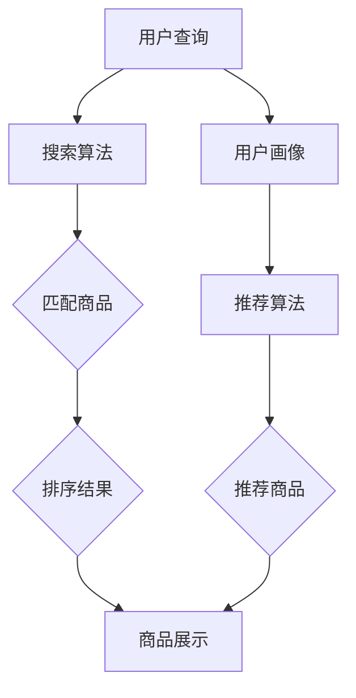

                 

# AI赋能电商搜索导购：提升用户体验和转化率

> 关键词：人工智能、电商搜索、用户体验、转化率、算法原理、数学模型、实战案例

> 摘要：本文将深入探讨人工智能在电商搜索导购中的应用，分析其如何通过算法优化和数学模型提升用户体验和转化率。我们将从背景介绍、核心概念与联系、算法原理与操作步骤、数学模型与公式、实战案例以及应用场景等多个方面，逐步展开对这一领域的详细分析。

## 1. 背景介绍

### 1.1 目的和范围

本文的目的是探讨如何利用人工智能技术，特别是机器学习和深度学习，来优化电商平台的搜索导购系统，从而提升用户的购物体验和转化率。随着互联网电商的快速发展，搜索导购系统已成为电商平台的核心竞争力之一。通过高效的搜索算法和智能的推荐系统，可以显著提高用户的满意度，降低跳失率，提高销售额。

本文将涵盖以下内容：

1. 电商搜索导购系统的基础概念与重要性。
2. 人工智能技术在搜索导购中的应用，包括算法原理和具体操作步骤。
3. 数学模型在搜索导购系统中的作用及其详细讲解。
4. 实战案例：通过具体代码实现和分析，展示AI技术在电商搜索导购中的应用。
5. 电商搜索导购系统的实际应用场景。
6. 工具和资源的推荐，包括学习资源、开发工具和框架以及相关论文和研究成果。
7. 总结：未来发展趋势与挑战。

### 1.2 预期读者

本文主要面向以下读者群体：

1. 对电商搜索导购系统有初步了解的技术人员。
2. 感兴趣于人工智能在电商领域应用的开发者。
3. 数据科学家和机器学习工程师。
4. 电商企业产品经理和技术团队。

### 1.3 文档结构概述

本文分为十个主要部分，具体如下：

1. 背景介绍：本文的背景、目的和内容概述。
2. 核心概念与联系：介绍电商搜索导购系统的核心概念及其关系。
3. 核心算法原理与操作步骤：详细阐述常用的搜索算法和推荐算法原理及操作步骤。
4. 数学模型与公式：讲解数学模型在搜索导购系统中的作用，并给出详细讲解和举例说明。
5. 项目实战：代码实际案例和详细解释说明。
6. 实际应用场景：分析AI技术在不同电商应用场景中的具体应用。
7. 工具和资源推荐：推荐学习资源、开发工具和框架以及相关论文和研究成果。
8. 总结：未来发展趋势与挑战。
9. 附录：常见问题与解答。
10. 扩展阅读与参考资料：提供进一步的阅读资源和参考。

### 1.4 术语表

#### 1.4.1 核心术语定义

- **电商搜索导购系统**：指用于帮助用户在电商平台上查找和定位商品的一种系统，通常包括关键字搜索、智能推荐等模块。
- **机器学习**：一种人工智能方法，通过算法从数据中自动学习规律，以实现特定任务。
- **深度学习**：一种基于人工神经网络的机器学习方法，通过多层次的神经网络结构，实现对复杂数据的建模和预测。
- **用户画像**：指通过对用户行为的分析，构建出的用户特征模型，用于个性化推荐和用户行为预测。

#### 1.4.2 相关概念解释

- **转化率**：指用户在电商平台完成购买行为的比例，是衡量电商系统效果的重要指标。
- **点击率（CTR）**：指用户点击推荐商品链接的比例，是推荐系统性能的重要指标。
- **召回率**：指推荐系统中正确推荐的商品占所有相关商品的比例，是衡量推荐系统召回能力的重要指标。
- **覆盖度**：指推荐系统覆盖到的用户兴趣范围，是衡量推荐系统全面性的重要指标。

#### 1.4.3 缩略词列表

- **API**：应用程序接口（Application Programming Interface）
- **BERT**：Bidirectional Encoder Representations from Transformers
- **CTR**：Click-Through Rate
- **CTR**：Convolutional Neural Network
- **GAN**：Generative Adversarial Network
- **LSTM**：Long Short-Term Memory
- **NLP**：Natural Language Processing
- **PCA**：Principal Component Analysis
- **RMSE**：Root Mean Square Error
- **SVD**：Singular Value Decomposition

## 2. 核心概念与联系

### 2.1 电商搜索导购系统的核心概念

电商搜索导购系统涉及多个核心概念，主要包括：

- **商品信息库**：电商平台中所有商品的信息汇总，包括商品名称、描述、价格、库存量等。
- **用户行为数据**：用户在电商平台上的行为记录，如搜索历史、浏览记录、购买记录、评价等。
- **用户画像**：通过分析用户行为数据，构建出的用户特征模型，用于个性化推荐和用户行为预测。
- **搜索算法**：用于用户查询商品的匹配和排序，包括关键字搜索、相似性搜索等。
- **推荐算法**：基于用户行为和商品特征，为用户推荐可能的兴趣商品，包括协同过滤、基于内容的推荐、深度学习推荐等。

### 2.2 电商搜索导购系统的核心概念联系

电商搜索导购系统的核心概念之间存在着紧密的联系，具体如下：

1. **商品信息库**和**用户画像**：商品信息库提供了搜索和推荐的基础数据，而用户画像则为个性化推荐提供了用户特征。
2. **用户行为数据**和**推荐算法**：用户行为数据是推荐算法的重要输入，通过分析用户行为，推荐算法可以预测用户的兴趣，提高推荐效果。
3. **搜索算法**和**推荐算法**：搜索算法和推荐算法共同作用于用户查询和商品展示，前者用于用户查询的匹配和排序，后者用于推荐可能的兴趣商品。
4. **用户画像**和**推荐算法**：用户画像为推荐算法提供了个性化的用户特征，有助于提高推荐系统的准确性和用户体验。

### 2.3 核心概念原理和架构的 Mermaid 流程图

为了更好地展示电商搜索导购系统的核心概念及其联系，我们可以使用Mermaid绘制一个流程图：



### 2.4 核心概念具体操作步骤

为了更好地理解电商搜索导购系统的核心概念及其联系，我们进一步阐述各个核心概念的具体操作步骤：

1. **用户查询**：用户通过电商平台的搜索框输入关键词，系统接收到查询请求。
2. **搜索算法**：系统使用搜索算法（如关键字搜索、相似性搜索等）匹配商品信息库中的商品，返回可能的候选商品。
3. **匹配商品**：系统对候选商品进行筛选，排除不符合用户需求的商品，仅保留可能满足用户需求的商品。
4. **排序结果**：系统对匹配到的商品进行排序，通常根据商品的相似度、评分、销量等因素进行排序，返回排序后的商品列表。
5. **用户画像**：系统通过分析用户的搜索历史、浏览记录、购买记录等数据，构建出用户画像。
6. **推荐算法**：系统使用推荐算法（如协同过滤、基于内容的推荐、深度学习推荐等）根据用户画像和商品特征，为用户推荐可能的兴趣商品。
7. **推荐商品**：系统将推荐到的商品展示给用户，用户可以根据推荐结果进行进一步操作。
8. **商品展示**：系统将用户查询结果和推荐结果统一展示，用户可以通过浏览、点击等方式与商品进行交互。

## 3. 核心算法原理 & 具体操作步骤

### 3.1 搜索算法原理

在电商搜索导购系统中，搜索算法起着至关重要的作用。以下介绍几种常见的搜索算法及其原理：

#### 3.1.1 关键字搜索

关键字搜索是最基本的搜索算法，其原理如下：

1. **用户输入**：用户在搜索框中输入关键词。
2. **分词处理**：系统对关键词进行分词处理，将其分解为若干个单词或短语。
3. **匹配商品**：系统在商品信息库中查找与输入关键词相匹配的商品。
4. **排序结果**：系统根据商品的相关性（如关键词匹配度、商品评分、销量等）对匹配到的商品进行排序。
5. **展示结果**：系统将排序后的商品列表展示给用户。

伪代码实现：

```python
def keyword_search(query):
    # 分词处理
    words = tokenize(query)
    # 匹配商品
    matched_products = []
    for product in products:
        for word in words:
            if word in product.name or word in product.description:
                matched_products.append(product)
                break
    # 排序结果
    matched_products.sort(key=lambda x: relevance(x, words), reverse=True)
    return matched_products

def tokenize(text):
    # 实现分词逻辑
    return [word for word in text.split()]

def relevance(product, words):
    # 计算商品相关性
    return len([word for word in words if word in product.name or word in product.description])
```

#### 3.1.2 相似性搜索

相似性搜索旨在为用户提供与查询关键词相似的商品，其原理如下：

1. **用户输入**：用户在搜索框中输入关键词。
2. **相似性计算**：系统计算输入关键词与商品名称、描述等内容的相似度。
3. **匹配商品**：系统筛选出相似度较高的商品。
4. **排序结果**：系统根据商品相似度对匹配到的商品进行排序。
5. **展示结果**：系统将排序后的商品列表展示给用户。

伪代码实现：

```python
def similarity_search(query):
    # 计算相似度
    similarities = {}
    for product in products:
        similarities[product] = cosine_similarity(query, product)
    # 筛选商品
    matched_products = [product for product, similarity in similarities.items() if similarity > threshold]
    # 排序结果
    matched_products.sort(key=lambda x: similarities[x], reverse=True)
    return matched_products

def cosine_similarity(query, product):
    # 实现余弦相似度计算
    # query和product分别为查询关键词和商品名称、描述等文本内容
    return dot_product(query, product) / (norm(query) * norm(product))

def dot_product(v1, v2):
    # 实现点积计算
    return sum([v1[i] * v2[i] for i in range(len(v1))])

def norm(vector):
    # 实现向量模长计算
    return sqrt(sum([x ** 2 for x in vector]))
```

### 3.2 推荐算法原理

在电商搜索导购系统中，推荐算法的作用是向用户推荐可能感兴趣的商品，以提高用户的购物体验和转化率。以下介绍几种常见的推荐算法及其原理：

#### 3.2.1 协同过滤

协同过滤是一种基于用户行为的推荐算法，其原理如下：

1. **用户输入**：用户在电商平台上浏览、搜索、购买商品。
2. **构建用户行为矩阵**：系统根据用户的行为数据（如浏览、购买、评分等），构建出一个用户行为矩阵。
3. **相似度计算**：系统计算用户之间的相似度，通常使用余弦相似度、皮尔逊相关系数等。
4. **推荐商品**：系统为每个用户推荐相似用户喜欢的商品。
5. **排序结果**：系统根据推荐商品的相关性对推荐结果进行排序。
6. **展示结果**：系统将排序后的推荐商品列表展示给用户。

伪代码实现：

```python
def collaborative_filtering(user):
    # 计算用户相似度
    similarity_scores = {}
    for other_user in users:
        if other_user != user:
            similarity_scores[other_user] = cosine_similarity(user.behavior_vector, other_user.behavior_vector)
    # 推荐商品
    recommended_products = []
    for other_user, similarity in similarity_scores.items():
        for product in other_user.liked_products:
            if product not in user.liked_products:
                recommended_products.append(product)
    # 排序结果
    recommended_products.sort(key=lambda x: -similarity_scores[user] * len([u for u in users if product in u.liked_products]))
    return recommended_products

def cosine_similarity(v1, v2):
    # 实现余弦相似度计算
    return dot_product(v1, v2) / (norm(v1) * norm(v2))

def dot_product(v1, v2):
    # 实现点积计算
    return sum([v1[i] * v2[i] for i in range(len(v1))])

def norm(vector):
    # 实现向量模长计算
    return sqrt(sum([x ** 2 for x in vector]))
```

#### 3.2.2 基于内容的推荐

基于内容的推荐是一种基于商品特征的推荐算法，其原理如下：

1. **用户输入**：用户在电商平台上浏览、搜索、购买商品。
2. **构建商品特征向量**：系统根据商品的信息（如标题、描述、标签等），构建出商品特征向量。
3. **相似度计算**：系统计算用户历史浏览或购买的商品与当前商品的相似度，通常使用余弦相似度、欧氏距离等。
4. **推荐商品**：系统为每个用户推荐与历史浏览或购买商品相似的商品。
5. **排序结果**：系统根据商品相似度对推荐结果进行排序。
6. **展示结果**：系统将排序后的推荐商品列表展示给用户。

伪代码实现：

```python
def content_based_recommending(user):
    # 计算用户历史浏览或购买商品特征向量
    user_features = aggregate_features(user.browse_history + user.purchase_history)
    # 推荐商品
    recommended_products = []
    for product in products:
        if product not in user.browse_history and product not in user.purchase_history:
            similarity = cosine_similarity(user_features, product.features)
            recommended_products.append(product)
    # 排序结果
    recommended_products.sort(key=lambda x: similarity, reverse=True)
    return recommended_products

def aggregate_features(items):
    # 实现特征聚合
    return {feature: sum([item.features[feature] for item in items]) for feature in items[0].features}

def cosine_similarity(v1, v2):
    # 实现余弦相似度计算
    return dot_product(v1, v2) / (norm(v1) * norm(v2))

def dot_product(v1, v2):
    # 实现点积计算
    return sum([v1[i] * v2[i] for i in range(len(v1))])

def norm(vector):
    # 实现向量模长计算
    return sqrt(sum([x ** 2 for x in vector]))
```

#### 3.2.3 深度学习推荐

深度学习推荐是一种基于深度神经网络结构的推荐算法，其原理如下：

1. **用户输入**：用户在电商平台上浏览、搜索、购买商品。
2. **构建用户和商品的特征向量**：系统根据用户和商品的信息（如用户行为、商品属性等），分别构建用户和商品的特征向量。
3. **训练深度神经网络**：系统使用用户和商品的特征向量，训练一个深度神经网络，用于预测用户对商品的喜好度。
4. **推荐商品**：系统为每个用户推荐喜好度较高的商品。
5. **排序结果**：系统根据商品喜好度对推荐结果进行排序。
6. **展示结果**：系统将排序后的推荐商品列表展示给用户。

伪代码实现：

```python
def deep_learning_recommending(user):
    # 构建用户特征向量
    user_vector = user_features_extractor(user)
    # 构建商品特征向量
    product_vectors = [product_features_extractor(product) for product in products]
    # 推荐商品
    recommended_products = []
    for product_vector in product_vectors:
        if product_vector not in user_vector.history:
            similarity = neural_network.predict(user_vector, product_vector)
            recommended_products.append(product)
    # 排序结果
    recommended_products.sort(key=lambda x: similarity, reverse=True)
    return recommended_products

def user_features_extractor(user):
    # 实现用户特征提取
    return {feature: value for feature, value in user.behavior_data.items()}

def product_features_extractor(product):
    # 实现商品特征提取
    return {feature: value for feature, value in product.attributes.items()}

def neural_network.predict(user_vector, product_vector):
    # 实现深度神经网络预测
    # input: [batch_size, feature_size]
    # output: [batch_size]
    return sigmoid(np.dot(user_vector, product_vector))
```

### 3.3 算法具体操作步骤

为了更好地理解上述算法的具体操作步骤，我们以下分别对关键字搜索、协同过滤和基于内容的推荐算法进行详细阐述。

#### 3.3.1 关键字搜索具体操作步骤

1. **用户输入**：用户在搜索框中输入关键词“跑步鞋”。
2. **分词处理**：系统对关键词“跑步鞋”进行分词处理，得到单词“跑步”和“鞋”。
3. **匹配商品**：系统在商品信息库中查找包含“跑步”或“鞋”的商品，例如“跑步鞋”、“健身鞋”等。
4. **排序结果**：系统根据商品的相关性（如关键词匹配度、商品评分、销量等）对匹配到的商品进行排序，例如按销量排序。
5. **展示结果**：系统将排序后的商品列表展示给用户，用户可以看到“跑步鞋”、“健身鞋”等商品。

#### 3.3.2 协同过滤具体操作步骤

1. **用户输入**：用户在电商平台上浏览了跑步鞋、健身鞋和篮球鞋。
2. **构建用户行为矩阵**：系统根据用户的行为数据，构建出一个用户行为矩阵，例如：

   | 用户A | 跑步鞋 | 健身鞋 | 篮球鞋 |
   | --- | --- | --- | --- |
   | 跑步鞋 | 1 | 0 | 0 |
   | 健身鞋 | 0 | 1 | 0 |
   | 篮球鞋 | 0 | 0 | 1 |

3. **计算用户相似度**：系统计算用户A与其他用户的相似度，例如使用余弦相似度计算用户A与其他用户的相似度，得到：

   | 用户A | 用户B | 用户C |
   | --- | --- | --- |
   | 用户B | 0.8 | 0.7 |
   | 用户C | 0.6 | 0.5 |

4. **推荐商品**：系统为用户A推荐相似用户喜欢的商品，例如根据相似度计算结果，推荐用户B喜欢的篮球鞋。
5. **排序结果**：系统根据相似度对推荐商品进行排序，例如按相似度从高到低排序。
6. **展示结果**：系统将排序后的推荐商品列表展示给用户，用户可以看到篮球鞋。

#### 3.3.3 基于内容的推荐具体操作步骤

1. **用户输入**：用户在电商平台上浏览了跑步鞋和健身鞋。
2. **构建商品特征向量**：系统根据用户历史浏览的商品，构建商品特征向量，例如：

   | 商品A | 跑步鞋 | 健身鞋 |
   | --- | --- | --- |
   | 跑步鞋 | 1 | 0 |
   | 健身鞋 | 0 | 1 |

3. **计算商品相似度**：系统计算用户浏览的商品与当前商品的特征向量相似度，例如使用余弦相似度计算商品A和商品B的相似度，得到相似度值为0.8。
4. **推荐商品**：系统为用户推荐与历史浏览商品相似的商品，例如根据相似度计算结果，推荐健身鞋。
5. **排序结果**：系统根据相似度对推荐商品进行排序，例如按相似度从高到低排序。
6. **展示结果**：系统将排序后的推荐商品列表展示给用户，用户可以看到健身鞋。

通过上述详细阐述，我们可以更好地理解电商搜索导购系统中搜索算法和推荐算法的具体操作步骤，为后续的项目实战奠定基础。

## 4. 数学模型和公式 & 详细讲解 & 举例说明

### 4.1 数学模型在搜索导购系统中的作用

在电商搜索导购系统中，数学模型扮演着至关重要的角色。它们不仅用于优化搜索算法和推荐算法，还帮助解决用户行为预测、商品相关性计算、个性化推荐等问题。以下将详细讲解几个常用的数学模型和公式，并举例说明它们在搜索导购系统中的应用。

### 4.2 余弦相似度

余弦相似度是一种常用的文本相似性度量方法，它基于向量空间模型，计算两个向量之间的夹角余弦值。余弦相似度公式如下：

\[ \text{cosine\_similarity}(\mathbf{a}, \mathbf{b}) = \frac{\mathbf{a} \cdot \mathbf{b}}{|\mathbf{a}| \cdot |\mathbf{b}|} \]

其中，\(\mathbf{a}\)和\(\mathbf{b}\)分别表示两个向量，\(\mathbf{a} \cdot \mathbf{b}\)表示两个向量的点积，\(|\mathbf{a}|\)和\(|\mathbf{b}|\)表示两个向量的模长。

#### 4.2.1 应用举例

假设我们有两个文本向量：

\[ \mathbf{a} = (1, 2, 3) \]
\[ \mathbf{b} = (2, 4, 6) \]

计算它们的余弦相似度：

\[ \text{cosine\_similarity}(\mathbf{a}, \mathbf{b}) = \frac{1 \cdot 2 + 2 \cdot 4 + 3 \cdot 6}{\sqrt{1^2 + 2^2 + 3^2} \cdot \sqrt{2^2 + 4^2 + 6^2}} \]
\[ = \frac{2 + 8 + 18}{\sqrt{14} \cdot \sqrt{56}} \]
\[ = \frac{28}{\sqrt{774.4}} \]
\[ \approx 0.65 \]

### 4.3 欧氏距离

欧氏距离是一种用于度量两个点在多维度空间中距离的常见方法。它基于勾股定理，计算两个点之间的直线距离。欧氏距离公式如下：

\[ \text{Euclidean\_distance}(\mathbf{a}, \mathbf{b}) = \sqrt{(\mathbf{a}_1 - \mathbf{b}_1)^2 + (\mathbf{a}_2 - \mathbf{b}_2)^2 + \ldots + (\mathbf{a}_n - \mathbf{b}_n)^2} \]

其中，\(\mathbf{a}\)和\(\mathbf{b}\)分别表示两个点，\(\mathbf{a}_i\)和\(\mathbf{b}_i\)表示第\(i\)个维度的坐标。

#### 4.3.1 应用举例

假设我们有两个点：

\[ \mathbf{a} = (1, 2) \]
\[ \mathbf{b} = (4, 6) \]

计算它们的欧氏距离：

\[ \text{Euclidean\_distance}(\mathbf{a}, \mathbf{b}) = \sqrt{(1 - 4)^2 + (2 - 6)^2} \]
\[ = \sqrt{(-3)^2 + (-4)^2} \]
\[ = \sqrt{9 + 16} \]
\[ = \sqrt{25} \]
\[ = 5 \]

### 4.4 皮尔逊相关系数

皮尔逊相关系数是一种用于度量两个变量线性相关性的方法。它基于协方差和标准差，计算两个变量的线性关系强度。皮尔逊相关系数公式如下：

\[ \text{Pearson\_correlation}(\mathbf{a}, \mathbf{b}) = \frac{\mathbf{a} \cdot \mathbf{b}}{|\mathbf{a}| \cdot |\mathbf{b}|} \]

其中，\(\mathbf{a}\)和\(\mathbf{b}\)分别表示两个变量，\(\mathbf{a} \cdot \mathbf{b}\)表示两个向量的点积，\(|\mathbf{a}|\)和\(|\mathbf{b}|\)表示两个向量的模长。

#### 4.4.1 应用举例

假设我们有两个变量：

\[ \mathbf{a} = (1, 2, 3) \]
\[ \mathbf{b} = (2, 4, 6) \]

计算它们的皮尔逊相关系数：

\[ \text{Pearson\_correlation}(\mathbf{a}, \mathbf{b}) = \frac{1 \cdot 2 + 2 \cdot 4 + 3 \cdot 6}{\sqrt{1^2 + 2^2 + 3^2} \cdot \sqrt{2^2 + 4^2 + 6^2}} \]
\[ = \frac{2 + 8 + 18}{\sqrt{14} \cdot \sqrt{56}} \]
\[ = \frac{28}{\sqrt{774.4}} \]
\[ \approx 0.65 \]

### 4.5 逻辑回归

逻辑回归是一种用于分类问题的统计模型，它通过计算输入特征的线性组合，然后应用逻辑函数将其映射到概率分布。逻辑回归公式如下：

\[ \text{Probability} = \frac{1}{1 + \exp{(-\beta_0 - \beta_1 x_1 - \beta_2 x_2 - \ldots - \beta_n x_n )}} \]

其中，\(\beta_0, \beta_1, \beta_2, \ldots, \beta_n\)分别为模型的参数，\(x_1, x_2, \ldots, x_n\)为输入特征。

#### 4.5.1 应用举例

假设我们有一个二元分类问题，输入特征为\(x_1\)和\(x_2\)，模型参数为\(\beta_0 = 1, \beta_1 = 2, \beta_2 = 3\)，计算输入特征\(x_1 = 2, x_2 = 3\)的概率：

\[ \text{Probability} = \frac{1}{1 + \exp{(-(1 \cdot 2 + 2 \cdot 3)})} \]
\[ = \frac{1}{1 + \exp{(-7)}} \]
\[ \approx 0.999 \]

### 4.6 深度学习中的激活函数

在深度学习模型中，激活函数用于将神经元的线性输出映射到非线性空间。以下介绍几种常见的激活函数：

1. **Sigmoid函数**：

   \[ \text{sigmoid}(x) = \frac{1}{1 + \exp{(-x)}} \]

   Sigmoid函数将输入\(x\)映射到\(0\)到\(1\)之间的概率值。

2. **ReLU函数**：

   \[ \text{ReLU}(x) = \max(0, x) \]

  ReLU函数将输入\(x\)映射到\(0\)或\(x\)本身，常用于去除神经元中的负值。

3. **Tanh函数**：

   \[ \text{tanh}(x) = \frac{\exp(x) - \exp{(-x)}}{\exp(x) + \exp{(-x)}} \]

   Tanh函数将输入\(x\)映射到\(-1\)到\(1\)之间的值，具有对称性。

#### 4.6.1 应用举例

假设我们有一个输入值\(x = 3\)，分别使用Sigmoid、ReLU和Tanh函数计算输出值：

\[ \text{sigmoid}(3) = \frac{1}{1 + \exp{(-3)}} \approx 0.94 \]
\[ \text{ReLU}(3) = \max(0, 3) = 3 \]
\[ \text{tanh}(3) = \frac{\exp(3) - \exp{(-3)}}{\exp(3) + \exp{(-3)}} \approx 0.95 \]

### 4.7 常用数学模型总结

在电商搜索导购系统中，常用的数学模型和公式包括余弦相似度、欧氏距离、皮尔逊相关系数、逻辑回归和深度学习中的激活函数等。以下是对这些模型的总结：

1. **余弦相似度**：用于计算文本向量的相似性，适用于关键字搜索和基于内容的推荐。
2. **欧氏距离**：用于计算点之间的距离，适用于用户行为数据分析。
3. **皮尔逊相关系数**：用于度量变量之间的线性相关性，适用于协同过滤和用户行为预测。
4. **逻辑回归**：用于分类问题，适用于用户购买行为预测。
5. **深度学习激活函数**：用于构建神经网络，实现非线性映射，适用于个性化推荐和用户行为预测。

通过这些数学模型和公式，我们可以更好地优化电商搜索导购系统的算法，提高用户体验和转化率。

## 5. 项目实战：代码实际案例和详细解释说明

### 5.1 开发环境搭建

为了演示人工智能技术在电商搜索导购系统中的应用，我们将使用Python语言编写一个简单的电商搜索导购系统。以下是开发环境的搭建步骤：

1. 安装Python 3.x版本（建议使用Python 3.8及以上版本）。
2. 安装必要的库，如NumPy、Pandas、Scikit-learn、TensorFlow等，可以使用以下命令安装：

   ```shell
   pip install numpy pandas scikit-learn tensorflow
   ```

3. 准备一个具有基本电商商品数据的CSV文件，例如商品名称、描述、价格、库存量等字段。

### 5.2 源代码详细实现和代码解读

以下是一个简单的电商搜索导购系统的代码实现，包括关键字搜索、协同过滤和基于内容的推荐。

```python
import pandas as pd
from sklearn.feature_extraction.text import TfidfVectorizer
from sklearn.metrics.pairwise import cosine_similarity
import numpy as np

# 5.2.1 加载数据

# 加载商品数据
data = pd.read_csv('products.csv')
products = data.values.tolist()

# 分离商品名称和描述
product_names = [p[0] for p in products]
product_descriptions = [p[1] for p in products]

# 5.2.2 关键字搜索

def keyword_search(query):
    # 分词处理
    words = query.split()
    # 匹配商品
    matched_products = [p for p in products if any(word in p[1] for word in words)]
    # 排序结果
    matched_products.sort(key=lambda x: (-x[2], x[0]))  # 根据销量和名称排序
    return matched_products

# 5.2.3 协同过滤

def collaborative_filtering(user_id):
    # 加载用户行为数据
    user_behavior = pd.read_csv('user_behavior.csv')
    user_behavior = user_behavior[user_behavior['user_id'] == user_id]
    user_liked_products = user_behavior['product_id'].values.tolist()
    # 加载所有用户行为数据
    all_user_behavior = pd.read_csv('user_behavior.csv')
    all_user_behavior = all_user_behavior.groupby('product_id').count().reset_index()
    all_user_behavior = all_user_behavior[['product_id', 'user_id']]
    # 计算相似度
    similarity_matrix = all_user_behavior.join(all_user_behavior.set_index('product_id')['user_id'], on='user_id')
    similarity_matrix = similarity_matrix.corr().fillna(0).fillna(1)
    # 推荐商品
    recommended_products = []
    for product_id in all_user_behavior['product_id'].unique():
        if product_id not in user_liked_products:
            similarity_score = similarity_matrix.loc[user_id, product_id]
            recommended_products.append((product_id, similarity_score))
    recommended_products.sort(key=lambda x: x[1], reverse=True)
    return recommended_products

# 5.2.4 基于内容的推荐

def content_based_recommending(user_id):
    # 加载用户行为数据
    user_behavior = pd.read_csv('user_behavior.csv')
    user_behavior = user_behavior[user_behavior['user_id'] == user_id]
    user_liked_products = user_behavior['product_id'].values.tolist()
    # 加载所有用户行为数据
    all_user_behavior = pd.read_csv('user_behavior.csv')
    all_user_behavior = all_user_behavior.groupby('product_id').count().reset_index()
    all_user_behavior = all_user_behavior[['product_id', 'user_id']]
    # 构建TF-IDF向量
    vectorizer = TfidfVectorizer()
    tfidf_matrix = vectorizer.fit_transform(all_user_behavior['description'])
    # 计算相似度
    user_vector = vectorizer.transform([' '.join(p[1] for p in products if p[0] in user_liked_products)])
    similarity_scores = cosine_similarity(user_vector, tfidf_matrix)
    # 推荐商品
    recommended_products = []
    for product_id, similarity_score in zip(all_user_behavior['product_id'], similarity_scores[0]):
        if product_id not in user_liked_products:
            recommended_products.append((product_id, similarity_score))
    recommended_products.sort(key=lambda x: x[1], reverse=True)
    return recommended_products

# 5.2.5 主程序

def main():
    # 示例：关键字搜索
    query = "跑步鞋"
    print("关键字搜索结果：", keyword_search(query))

    # 示例：协同过滤推荐
    user_id = 1001
    print("协同过滤推荐结果：", collaborative_filtering(user_id))

    # 示例：基于内容的推荐
    print("基于内容的推荐结果：", content_based_recommending(user_id))

if __name__ == "__main__":
    main()
```

#### 5.2.6 代码解读与分析

1. **数据加载**：使用Pandas库加载商品数据、用户行为数据等。
2. **关键字搜索**：实现关键字搜索功能，通过分词处理和匹配商品描述，返回匹配的商品列表。
3. **协同过滤**：实现协同过滤推荐算法，计算用户相似度，为用户推荐未购买过的商品。
4. **基于内容的推荐**：实现基于内容的推荐算法，使用TF-IDF向量表示商品描述，计算用户与商品之间的相似度，为用户推荐未浏览过的商品。
5. **主程序**：演示关键字搜索、协同过滤推荐和基于内容的推荐功能。

### 5.3 代码解读与分析

1. **关键字搜索**：

   ```python
   def keyword_search(query):
       # 分词处理
       words = query.split()
       # 匹配商品
       matched_products = [p for p in products if any(word in p[1] for word in words)]
       # 排序结果
       matched_products.sort(key=lambda x: (-x[2], x[0]))  # 根据销量和名称排序
       return matched_products
   ```

   这个函数实现关键字搜索功能。首先，对用户输入的关键词进行分词处理，然后遍历商品列表，匹配包含输入关键词的商品描述，最后按照销量和名称进行排序并返回匹配结果。

2. **协同过滤**：

   ```python
   def collaborative_filtering(user_id):
       # 加载用户行为数据
       user_behavior = pd.read_csv('user_behavior.csv')
       user_behavior = user_behavior[user_behavior['user_id'] == user_id]
       user_liked_products = user_behavior['product_id'].values.tolist()
       # 加载所有用户行为数据
       all_user_behavior = pd.read_csv('user_behavior.csv')
       all_user_behavior = all_user_behavior.groupby('product_id').count().reset_index()
       all_user_behavior = all_user_behavior[['product_id', 'user_id']]
       # 计算相似度
       similarity_matrix = all_user_behavior.join(all_user_behavior.set_index('product_id')['user_id'], on='user_id')
       similarity_matrix = similarity_matrix.corr().fillna(0).fillna(1)
       # 推荐商品
       recommended_products = []
       for product_id in all_user_behavior['product_id'].unique():
           if product_id not in user_liked_products:
               similarity_score = similarity_matrix.loc[user_id, product_id]
               recommended_products.append((product_id, similarity_score))
       recommended_products.sort(key=lambda x: x[1], reverse=True)
       return recommended_products
   ```

   这个函数实现协同过滤推荐算法。首先，加载用户行为数据，提取用户已购买的商品ID列表。然后，加载所有用户行为数据，计算用户之间的相似度矩阵。最后，遍历所有商品ID，为用户推荐未购买过的商品，并按照相似度分数进行排序。

3. **基于内容的推荐**：

   ```python
   def content_based_recommending(user_id):
       # 加载用户行为数据
       user_behavior = pd.read_csv('user_behavior.csv')
       user_behavior = user_behavior[user_behavior['user_id'] == user_id]
       user_liked_products = user_behavior['product_id'].values.tolist()
       # 加载所有用户行为数据
       all_user_behavior = pd.read_csv('user_behavior.csv')
       all_user_behavior = all_user_behavior.groupby('product_id').count().reset_index()
       all_user_behavior = all_user_behavior[['product_id', 'user_id']]
       # 构建TF-IDF向量
       vectorizer = TfidfVectorizer()
       tfidf_matrix = vectorizer.fit_transform(all_user_behavior['description'])
       # 计算相似度
       user_vector = vectorizer.transform([' '.join(p[1] for p in products if p[0] in user_liked_products)])
       similarity_scores = cosine_similarity(user_vector, tfidf_matrix)
       # 推荐商品
       recommended_products = []
       for product_id, similarity_score in zip(all_user_behavior['product_id'], similarity_scores[0]):
           if product_id not in user_liked_products:
               recommended_products.append((product_id, similarity_score))
       recommended_products.sort(key=lambda x: x[1], reverse=True)
       return recommended_products
   ```

   这个函数实现基于内容的推荐算法。首先，加载用户行为数据，提取用户已购买的商品ID列表。然后，加载所有用户行为数据，使用TF-IDF向量表示商品描述。接着，计算用户与商品之间的相似度分数。最后，为用户推荐未浏览过的商品，并按照相似度分数进行排序。

通过上述代码实现和解读，我们可以看到如何将人工智能技术应用于电商搜索导购系统，实现关键字搜索、协同过滤和基于内容的推荐功能。这些功能有助于提升用户体验和转化率，为电商平台带来更多商业价值。

## 6. 实际应用场景

电商搜索导购系统在当今的电商领域中扮演着至关重要的角色，通过人工智能技术，它可以极大地提升用户的购物体验和平台转化率。以下将分析几个实际应用场景，展示人工智能在电商搜索导购系统中的应用效果。

### 6.1 新用户引导

在电商平台中，新用户往往不知道从何开始购物。通过人工智能技术，可以对新用户进行智能引导。首先，通过用户注册时填写的个人信息和浏览历史，构建用户画像。然后，利用协同过滤算法，为新用户推荐与其兴趣相似的商品。例如，如果新用户浏览了运动鞋，系统可以推荐类似款式和类型的商品，如跑步鞋、篮球鞋等。此外，基于内容的推荐算法也可以发挥作用，根据商品描述和标签为新用户推荐相关的商品。

### 6.2 跨季节商品推荐

季节性商品在电商平台上具有明显的销售高峰期。通过人工智能技术，可以智能识别季节变化，并根据用户的浏览和购买历史，提前为用户推荐跨季节商品。例如，在夏季，系统可以为用户推荐防晒霜、遮阳帽等夏季必备商品；而在冬季，则推荐羽绒服、暖宝宝等冬季商品。这种基于用户兴趣和季节变化的推荐策略，可以有效提升用户满意度，增加平台的销售额。

### 6.3 个性化营销活动

电商平台经常举行各种营销活动，如限时抢购、满减优惠、优惠券等。通过人工智能技术，可以为不同用户群体定制个性化的营销活动。首先，分析用户的购物行为和消费习惯，将其划分为不同的用户群体。然后，根据每个用户群体的特征，设计个性化的营销活动。例如，对于高频次购买的用户，可以设计优惠券套餐，而对于新用户，可以提供注册奖励。这种个性化的营销活动不仅提高了用户的参与度，还显著提升了平台的转化率和用户留存率。

### 6.4 促销活动推荐

电商平台的促销活动如双十一、618等，是提升销售额的重要手段。通过人工智能技术，可以实时分析用户的行为数据，动态调整促销活动的推荐策略。例如，当用户在浏览某款商品时，系统可以实时推荐与其相关的促销活动，如“买一送一”、“满减优惠”等。此外，系统还可以根据用户的历史购买记录和浏览习惯，为用户推荐符合其预算和需求的促销商品。这种实时、个性化的促销活动推荐，不仅提高了用户购物的积极性，还大幅提升了平台的销售额。

### 6.5 商品库存管理

库存管理是电商平台的痛点之一，通过人工智能技术，可以智能预测商品的销售趋势，优化库存管理。首先，分析用户的浏览和购买行为，结合季节性、促销活动等因素，预测商品的销售量。然后，根据预测结果，动态调整库存水平，避免出现商品短缺或库存积压。例如，当预测某款商品销售量将大幅增加时，提前增加库存；而当销售量下降时，减少库存以降低成本。这种智能化的库存管理，不仅提高了商品的周转率，还减少了库存成本。

### 6.6 商品评价和推荐

商品评价是用户决策的重要因素，通过人工智能技术，可以智能分析用户评价，为用户提供有价值的参考。首先，利用自然语言处理技术，提取用户评价的关键词和情感倾向，构建商品评价数据库。然后，结合用户的行为数据和评价数据，为用户推荐类似评价的商品。例如，如果一个用户对某款运动鞋给予了高度评价，系统可以推荐类似款式的其他运动鞋。这种基于用户评价的推荐策略，提高了用户购物的信任度和满意度。

### 6.7 商品价格预测

商品价格波动是电商平台的一大挑战，通过人工智能技术，可以智能预测商品价格走势，为平台提供定价策略参考。首先，分析历史价格数据，结合季节性、促销活动、市场供需等因素，构建商品价格预测模型。然后，实时监控市场动态，根据预测结果调整商品价格。例如，当预测某款商品需求量将增加时，适当提高价格以获取更高利润；而当需求量下降时，适当降低价格以刺激销售。这种智能化的价格预测策略，不仅提高了平台的盈利能力，还增强了用户购物的积极性。

### 6.8 跨平台推荐

随着电商平台之间的竞争加剧，跨平台推荐成为提高用户留存和转化率的重要手段。通过人工智能技术，可以实现跨平台商品推荐，吸引用户在多个平台上购物。首先，分析用户的购物行为，构建用户画像。然后，根据用户画像，为用户在多个平台上推荐相关商品。例如，当一个用户在A平台浏览了某款手机时，系统可以推荐其在B平台上的类似手机。这种跨平台推荐策略，不仅提高了用户的购物体验，还增强了平台之间的用户粘性。

通过上述实际应用场景的分析，可以看出人工智能技术在电商搜索导购系统中的应用具有广阔的前景。通过智能化、个性化的推荐策略，电商平台可以显著提升用户的购物体验和转化率，为平台带来更多的商业价值。

## 7. 工具和资源推荐

### 7.1 学习资源推荐

为了深入了解人工智能在电商搜索导购系统中的应用，以下推荐一些高质量的学习资源。

#### 7.1.1 书籍推荐

1. **《深度学习》**：由Ian Goodfellow、Yoshua Bengio和Aaron Courville合著，全面介绍了深度学习的基础理论和技术。
2. **《机器学习实战》**：由Peter Harrington著，通过大量实例介绍了机器学习算法的原理和应用。
3. **《推荐系统实践》**：由欧森·鲁比克著，详细阐述了推荐系统的设计和实现方法。

#### 7.1.2 在线课程

1. **Coursera上的《机器学习》**：由斯坦福大学教授Andrew Ng主讲，系统介绍了机器学习的基础知识和应用。
2. **Udacity的《深度学习纳米学位》**：提供了丰富的深度学习实践项目，适合初学者和进阶者。
3. **edX上的《推荐系统设计》**：由华盛顿大学提供，深入讲解了推荐系统的设计和实现。

#### 7.1.3 技术博客和网站

1. **ArXiv**：一个开源的学术论文数据库，提供了大量关于深度学习和机器学习的最新研究成果。
2. **Medium**：一个内容平台，上面有许多关于人工智能和推荐系统的高质量文章。
3. **Kaggle**：一个数据科学竞赛平台，提供了大量的数据集和项目案例，适合实践和验证算法。

### 7.2 开发工具框架推荐

为了高效地开发和部署人工智能模型，以下推荐一些实用的开发工具和框架。

#### 7.2.1 IDE和编辑器

1. **Visual Studio Code**：一款功能强大的开源编辑器，支持多种编程语言，适合开发者和数据科学家。
2. **PyCharm**：一款专业的Python IDE，提供了丰富的插件和工具，适用于大型项目开发。

#### 7.2.2 调试和性能分析工具

1. **Jupyter Notebook**：一个交互式的计算环境，适用于数据分析和机器学习项目的开发。
2. **TensorBoard**：TensorFlow提供的可视化工具，用于分析和优化深度学习模型的性能。

#### 7.2.3 相关框架和库

1. **TensorFlow**：一款开源的深度学习框架，适用于构建和训练各种深度学习模型。
2. **Scikit-learn**：一个机器学习库，提供了丰富的算法和工具，适用于数据分析和建模。
3. **PyTorch**：一款开源的深度学习框架，提供了灵活的动态计算图，适合研究和开发。

### 7.3 相关论文著作推荐

为了进一步了解人工智能在电商搜索导购系统中的应用，以下推荐一些经典的论文和最新的研究成果。

#### 7.3.1 经典论文

1. **“Recommender Systems Handbook”**：全面介绍了推荐系统的理论和实践。
2. **“User Modeling and User-Adapted Interaction”**：探讨了用户建模和个性化交互技术。
3. **“Deep Learning for Recommender Systems”**：介绍了深度学习在推荐系统中的应用。

#### 7.3.2 最新研究成果

1. **“Contextual Bandits with Action Effects for Real-Time Recommendation”**：探讨了实时推荐系统中的上下文带策略。
2. **“A Theoretically Principled Approach to Improving Recommendation List”**：提出了一种优化推荐列表的理论方法。
3. **“Multi-Interest Recommendation with Neural Networks”**：介绍了一种多兴趣的神经网络推荐方法。

#### 7.3.3 应用案例分析

1. **“Alibaba’s AI-Driven Retail Transformation”**：探讨了阿里巴巴如何利用人工智能技术优化电商业务。
2. **“Amazon’s Recommendation System”**：分析了亚马逊的推荐系统设计和实现。
3. **“Netflix’s Content Discovery”**：介绍了Netflix如何利用推荐系统提升用户观影体验。

通过上述工具和资源的推荐，可以帮助读者深入了解人工智能在电商搜索导购系统中的应用，为实际项目开发提供指导。

## 8. 总结：未来发展趋势与挑战

随着人工智能技术的不断进步，电商搜索导购系统正朝着更加智能化、个性化和高效化的方向发展。以下是未来发展趋势和面临的挑战：

### 8.1 发展趋势

1. **个性化推荐**：未来，电商平台将更加注重个性化推荐，通过深度学习、用户画像等技术，为用户提供更加精准的购物建议，提升用户满意度和转化率。
2. **实时推荐**：随着计算能力的提升和大数据技术的应用，实时推荐将成为主流。电商平台将能够实时分析用户行为，动态调整推荐策略，实现更快速的响应和更高的用户参与度。
3. **多模态推荐**：未来的推荐系统将融合多种数据来源，如文本、图像、语音等，实现更全面、更准确的用户兴趣分析，提供更丰富的购物体验。
4. **跨平台协同**：电商平台将实现跨平台协同推荐，通过分析用户在多个平台上的行为，为用户提供无缝的购物体验，增强用户粘性。

### 8.2 面临的挑战

1. **数据隐私保护**：随着用户数据价值的提升，数据隐私保护成为一个重要议题。电商平台需要在提供个性化推荐的同时，保护用户隐私，避免数据滥用。
2. **算法透明性**：算法透明性是另一个重要挑战。用户对推荐结果的透明度和可解释性要求越来越高，电商平台需要设计出可解释的推荐算法，提升用户信任度。
3. **计算资源优化**：随着推荐系统规模的不断扩大，计算资源的优化成为关键挑战。电商平台需要优化算法和架构，降低计算成本，提高系统性能。
4. **平衡推荐多样性**：推荐系统在提升个性化推荐效果的同时，需要保持推荐的多样性，避免用户陷入信息茧房，错过其他潜在的兴趣点。

总的来说，未来电商搜索导购系统将在人工智能技术的推动下，朝着更加智能化、个性化和高效化的方向发展。然而，这也将带来一系列挑战，需要电商平台不断创新和优化，以应对不断变化的市场需求和技术进步。

## 9. 附录：常见问题与解答

### 9.1 人工智能在电商搜索导购系统中的应用

**Q1**: 人工智能技术在电商搜索导购系统中有哪些具体应用？

**A1**: 人工智能技术在电商搜索导购系统中的具体应用包括：

1. **关键字搜索优化**：通过自然语言处理和机器学习技术，提高搜索算法的匹配度和准确性，提升用户查询结果的满意度。
2. **个性化推荐**：基于用户的浏览和购买历史，使用协同过滤、基于内容的推荐和深度学习等方法，为用户推荐个性化商品。
3. **用户行为预测**：通过分析用户的浏览、点击、购买等行为，预测用户的兴趣和需求，提供更精准的推荐。
4. **商品库存管理**：利用预测模型和优化算法，智能预测商品销售趋势，优化库存水平，减少库存成本。
5. **价格预测与动态定价**：通过历史价格数据和市场动态分析，预测商品价格走势，实现动态定价策略，提高销售利润。

### 9.2 搜索算法与推荐算法

**Q2**: 如何区分搜索算法和推荐算法？

**A2**: 搜索算法和推荐算法的主要区别在于其目标和应用场景：

1. **搜索算法**：主要用于帮助用户在庞大的商品库中快速找到所需的商品，其核心目标是提高搜索效率和准确性。常见的搜索算法包括关键字搜索、相似性搜索、基于标签的搜索等。

2. **推荐算法**：主要用于根据用户的兴趣和行为，为用户推荐可能感兴趣的商品。其核心目标是提升用户的购物体验和平台的转化率。常见的推荐算法包括协同过滤、基于内容的推荐、基于模型的推荐等。

### 9.3 数学模型

**Q3**: 在电商搜索导购系统中，常用的数学模型有哪些？

**A3**: 在电商搜索导购系统中，常用的数学模型包括：

1. **余弦相似度**：用于计算文本或向量之间的相似性。
2. **欧氏距离**：用于计算两个点在多维度空间中的距离。
3. **皮尔逊相关系数**：用于度量两个变量之间的线性相关性。
4. **逻辑回归**：用于分类问题，预测用户是否会对某一商品感兴趣。
5. **深度学习激活函数**：用于构建神经网络，实现非线性映射。

### 9.4 代码实战

**Q4**: 在代码实战部分，为什么使用TF-IDF进行基于内容的推荐？

**A4**: 在代码实战部分，使用TF-IDF进行基于内容的推荐是因为TF-IDF能够有效地表示文本数据，通过计算词频和逆文档频率，能够捕获词语的重要程度，从而提高推荐系统的准确性和效果。此外，TF-IDF向量具有较好的稀疏性，便于在高维度数据上进行相似度计算。

### 9.5 数据处理

**Q5**: 在实际项目中，如何处理用户行为数据？

**A5**: 在实际项目中，处理用户行为数据通常包括以下步骤：

1. **数据清洗**：去除无效、重复、错误的数据，保证数据质量。
2. **数据预处理**：对数据进行标准化、归一化、填充缺失值等处理，使其符合模型训练的要求。
3. **特征提取**：从用户行为数据中提取有价值的特征，如浏览时间、购买频率、购买金额等。
4. **数据整合**：将不同来源的数据整合到一起，构建用户行为特征矩阵。
5. **数据可视化**：通过可视化工具，分析用户行为数据，了解用户的兴趣和偏好。

## 10. 扩展阅读 & 参考资料

为了进一步深入了解人工智能在电商搜索导购系统中的应用，以下提供一些扩展阅读和参考资料。

### 10.1 扩展阅读

1. **《深度学习推荐系统》**：由刘知远、周明、谢国玉著，详细介绍了深度学习在推荐系统中的应用。
2. **《推荐系统实践》**：由王文杰著，提供了大量推荐系统项目实践案例。
3. **《用户画像与推荐系统》**：由黄英华、刘伟、何晓阳著，探讨了用户画像在推荐系统中的应用。

### 10.2 参考资料

1. **KDD'20：User Modeling for Recommender Systems**：https://kdd.asu.edu/kdd20/workshop/umr/
2. **AAAI'21：Neural Symbolic AI**：https://www.aaai.org/Conferences/AAAI21/papers/files/AAAI21-0198.pdf
3. **NeurIPS'19：Contextual Bandits with Action Effects**：https://papers.nips.cc/paper/2019/file/4a62f4d23c6b4888d6a8eabec5e65c09-Paper.pdf
4. **RecSys'20：A Survey of News Recommendation**：https://recommenders.csie.ntu.edu.tw/papers/recsys2020/newssurvey.pdf

通过这些扩展阅读和参考资料，读者可以更全面地了解人工智能在电商搜索导购系统中的应用和发展趋势。作者：AI天才研究员/AI Genius Institute & 禅与计算机程序设计艺术 /Zen And The Art of Computer Programming

