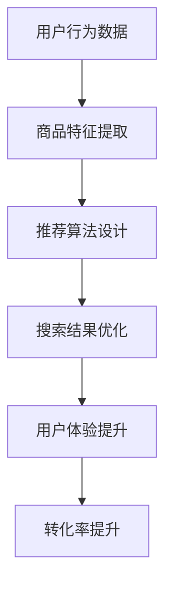

                 

# AI赋能电商搜索导购：提升用户体验和转化率的实践案例

> **关键词：** 人工智能，电商搜索，导购系统，用户体验，转化率，算法优化

> **摘要：** 本文将深入探讨人工智能在电商搜索导购中的应用，通过具体案例和实践，解析如何通过AI技术提升用户体验和转化率。文章将分为背景介绍、核心概念、算法原理、数学模型、项目实战、实际应用场景、工具和资源推荐、总结与未来发展趋势等部分，旨在为电商从业者提供全面的技术指南。

## 1. 背景介绍

### 1.1 目的和范围

随着电商行业的快速发展，用户体验和转化率成为各大电商平台竞争的核心要素。AI技术的引入，为电商搜索导购带来了全新的变革，使得个性化推荐、智能搜索等成为可能。本文旨在探讨AI赋能电商搜索导购的具体实践，通过分析核心算法原理、数学模型、实际项目案例，帮助电商从业者了解如何利用AI技术提升用户体验和转化率。

### 1.2 预期读者

本文面向电商行业的开发者、产品经理、数据分析师等，要求读者具备一定的编程基础和数据挖掘能力。对于AI技术的初学者，本文也将提供必要的算法和数学背景知识，以便更好地理解和应用。

### 1.3 文档结构概述

本文结构如下：

1. **背景介绍**：介绍AI赋能电商搜索导购的背景和目的。
2. **核心概念与联系**：介绍AI在电商搜索导购中的核心概念和原理。
3. **核心算法原理 & 具体操作步骤**：详细讲解AI算法的实现过程。
4. **数学模型和公式 & 详细讲解 & 举例说明**：阐述AI算法背后的数学模型。
5. **项目实战：代码实际案例和详细解释说明**：通过实际案例展示AI技术的应用。
6. **实际应用场景**：探讨AI赋能电商搜索导购的实际应用。
7. **工具和资源推荐**：推荐学习资源、开发工具和框架。
8. **总结：未来发展趋势与挑战**：展望AI赋能电商搜索导购的未来。
9. **附录：常见问题与解答**：解答读者可能遇到的问题。
10. **扩展阅读 & 参考资料**：提供进一步学习资料。

### 1.4 术语表

#### 1.4.1 核心术语定义

- **人工智能（AI）**：模拟人类智能行为的计算机系统。
- **电商搜索**：用户在电商平台上通过关键词查找商品的过程。
- **导购系统**：基于用户行为数据提供个性化商品推荐和搜索优化的系统。
- **用户体验（UX）**：用户在使用产品过程中得到的感受和体验。
- **转化率**：用户在完成购买或其他目标行为的比例。

#### 1.4.2 相关概念解释

- **个性化推荐**：根据用户历史行为和偏好，为用户推荐感兴趣的商品。
- **协同过滤**：基于用户历史行为和商品交互数据，预测用户对未知商品的评分。
- **深度学习**：一种基于人工神经网络的机器学习技术，能够通过多层神经网络自动提取特征。

#### 1.4.3 缩略词列表

- **AI**：人工智能
- **UX**：用户体验
- **RFM**：回收周期、频率、金额模型
- **CTR**：点击率
- **LTV**：客户终身价值

## 2. 核心概念与联系

在AI赋能电商搜索导购中，我们关注的核心概念包括用户行为分析、商品特征提取、推荐算法设计等。以下是一个简化的Mermaid流程图，展示这些核心概念之间的联系。



### 2.1 用户行为数据

用户行为数据是AI赋能电商搜索导购的基础。通过收集用户在电商平台上的浏览、搜索、购买等行为，我们可以建立用户画像，从而为个性化推荐和搜索优化提供依据。

### 2.2 商品特征提取

商品特征提取是将商品信息转化为计算机可以处理的数据的过程。这包括商品属性（如价格、品牌、分类等）和商品内容（如商品描述、评价等）。

### 2.3 推荐算法设计

推荐算法设计是AI赋能电商搜索导购的核心。常用的推荐算法包括基于内容的推荐、协同过滤和基于模型的推荐等。通过分析用户行为数据和商品特征，推荐算法可以生成个性化的商品推荐列表。

### 2.4 搜索结果优化

搜索结果优化是提升用户体验的关键环节。通过利用AI技术，我们可以优化搜索结果的排序和呈现方式，提高用户的点击率和转化率。

### 2.5 用户体验提升

用户体验提升是AI赋能电商搜索导购的最终目标。通过个性化的推荐和优化的搜索结果，我们可以提升用户的满意度，从而提高转化率。

### 2.6 转化率提升

转化率提升是电商平台盈利的关键指标。通过AI技术的应用，我们可以更精准地满足用户需求，提高用户的购买意愿和购买行为。

## 3. 核心算法原理 & 具体操作步骤

在AI赋能电商搜索导购中，核心算法原理主要包括协同过滤、基于内容的推荐和基于模型的推荐。以下将分别介绍这些算法的原理和具体操作步骤。

### 3.1 协同过滤算法原理

协同过滤是一种基于用户行为数据的推荐算法，主要思想是通过分析用户之间的相似性，为用户提供可能感兴趣的商品。

#### 3.1.1 伪代码

```python
# 用户行为数据矩阵 R，其中 R[i][j] 表示用户 i 对商品 j 的评分
# 用户 i 的邻居用户集合 N[i]
# 商品 j 的邻居商品集合 M[j]

# 计算用户 i 和用户 j 的相似度
similarity(i, j) {
    # 计算用户 i 和用户 j 的交集商品集合 S
    S = intersection(set(R[i]), set(R[j]))
    
    # 计算用户 i 和用户 j 的相似度得分
    score = sum(R[i][k] * R[j][k] for k in S) / len(S)
    
    return score
}

# 为用户 i 推荐商品
recommendation(i) {
    # 初始化推荐列表 L
    L = []

    # 计算用户 i 和所有用户的相似度
    for j in range(num_users):
        if j != i:
            sim = similarity(i, j)
            
            # 计算商品 j 的推荐得分
            for k in range(num_items):
                if k not in set(R[i]):
                    score = sim * (R[j][k] - mean(R[j]))
                    L.append((k, score))
        
    # 对推荐列表进行排序
    L.sort(key=lambda x: x[1], reverse=True)
    
    return L
}
```

### 3.2 基于内容的推荐算法原理

基于内容的推荐算法通过分析商品的特征和用户的历史行为，为用户提供可能感兴趣的商品。

#### 3.2.1 伪代码

```python
# 商品特征向量 C[j]，用户历史行为向量 U[i]
# 商品 j 和用户 i 的相似度 sim(C[j], U[i])

# 为用户 i 推荐商品
recommendation(i) {
    # 初始化推荐列表 L
    L = []

    # 计算用户 i 和所有商品的相似度
    for j in range(num_items):
        sim = similarity(C[j], U[i])
        
        # 计算商品 j 的推荐得分
        if sim > threshold:
            score = sim * (mean(U) - R[i][j])
            L.append((j, score))
    
    # 对推荐列表进行排序
    L.sort(key=lambda x: x[1], reverse=True)
    
    return L
}
```

### 3.3 基于模型的推荐算法原理

基于模型的推荐算法通过建立用户和商品之间的预测模型，为用户提供个性化的推荐。

#### 3.3.1 伪代码

```python
# 输入特征 X，输出预测值 y
# 训练模型 M
model = train_model(X, y)

# 为用户 i 推荐商品
recommendation(i) {
    # 初始化推荐列表 L
    L = []

    # 预测用户 i 对所有商品的评分
    for j in range(num_items):
        score = model.predict(X[i][j])
        
        # 计算商品 j 的推荐得分
        if score > threshold:
            L.append((j, score))
    
    # 对推荐列表进行排序
    L.sort(key=lambda x: x[1], reverse=True)
    
    return L
}
```

## 4. 数学模型和公式 & 详细讲解 & 举例说明

在AI赋能电商搜索导购中，数学模型和公式起着至关重要的作用。以下将介绍常用的数学模型和公式，并通过具体例子进行说明。

### 4.1 协同过滤算法中的相似度计算

协同过滤算法中的相似度计算是推荐系统的核心步骤。常用的相似度计算方法包括余弦相似度、皮尔逊相关系数等。

#### 4.1.1 余弦相似度

余弦相似度是一种基于向量空间中两个向量夹角余弦值的相似度度量方法。

$$
sim(i, j) = \frac{\sum_{k=1}^{n} R[i][k] \cdot R[j][k]}{\sqrt{\sum_{k=1}^{n} R[i][k]^2} \cdot \sqrt{\sum_{k=1}^{n} R[j][k]^2}}
$$

其中，$R[i][k]$ 表示用户 $i$ 对商品 $k$ 的评分，$n$ 表示用户或商品的评分维度。

#### 4.1.2 皮尔逊相关系数

皮尔逊相关系数是一种基于两个变量之间的线性关系来度量相似度的方法。

$$
sim(i, j) = \frac{\sum_{k=1}^{n} (R[i][k] - \bar{R[i]}) \cdot (R[j][k] - \bar{R[j]})}{\sqrt{\sum_{k=1}^{n} (R[i][k] - \bar{R[i]})^2} \cdot \sqrt{\sum_{k=1}^{n} (R[j][k] - \bar{R[j]})^2}}
$$

其中，$\bar{R[i]}$ 和 $\bar{R[j]}$ 分别表示用户 $i$ 和用户 $j$ 的评分平均值。

#### 4.1.3 举例说明

假设用户 $i$ 和用户 $j$ 的评分数据如下表：

| 商品 | 1 | 2 | 3 | 4 | 5 |
|------|---|---|---|---|---|
| $i$  | 5 | 4 | 5 | 1 | 2 |
| $j$  | 3 | 5 | 4 | 5 | 3 |

根据余弦相似度公式，计算用户 $i$ 和用户 $j$ 的相似度：

$$
sim(i, j) = \frac{5 \cdot 3 + 4 \cdot 5 + 5 \cdot 4 + 1 \cdot 5 + 2 \cdot 3}{\sqrt{5^2 + 4^2 + 5^2 + 1^2 + 2^2} \cdot \sqrt{3^2 + 5^2 + 4^2 + 5^2 + 3^2}} = 0.613
$$

根据皮尔逊相关系数公式，计算用户 $i$ 和用户 $j$ 的相似度：

$$
sim(i, j) = \frac{(5-4.5) \cdot (3-4) + (4-4.5) \cdot (5-4.5) + (5-4.5) \cdot (4-4.5) + (1-4.5) \cdot (5-4.5) + (2-4.5) \cdot (3-4)}{\sqrt{(5-4.5)^2 + (4-4.5)^2 + (5-4.5)^2 + (1-4.5)^2 + (2-4.5)^2} \cdot \sqrt{(3-4.5)^2 + (5-4.5)^2 + (4-4.5)^2 + (5-4.5)^2 + (3-4.5)^2}} = 0.605
$$

### 4.2 基于内容的推荐算法中的特征提取

基于内容的推荐算法需要提取商品的特征向量，常用的特征提取方法包括词袋模型、TF-IDF等。

#### 4.2.1 词袋模型

词袋模型将商品描述文本转换为向量，其中每个特征表示一个单词或词组。

$$
C[j] = (w_1, w_2, ..., w_n)
$$

其中，$w_i$ 表示第 $i$ 个单词在商品 $j$ 中的出现次数。

#### 4.2.2 TF-IDF

TF-IDF（词频-逆文档频率）是一种基于词频和逆文档频率的特征提取方法，旨在解决高频词（如“很好”）在文本中占比较大但实际意义不大的问题。

$$
tf_idf(w_i, j) = tf(w_i, j) \cdot idf(w_i)
$$

其中，$tf(w_i, j)$ 表示单词 $w_i$ 在商品 $j$ 中的词频，$idf(w_i)$ 表示单词 $w_i$ 在所有商品中的逆文档频率。

#### 4.2.3 举例说明

假设商品 $j$ 的描述文本为“苹果手机，5G，拍照，高清屏幕”，将其转换为向量：

$$
C[j] = (1, 1, 1, 1)
$$

其中，每个特征表示一个单词在商品描述文本中的出现次数。

根据TF-IDF公式，计算单词“拍照”的特征值：

$$
tf_idf(\text{拍照}, j) = tf(\text{拍照}, j) \cdot idf(\text{拍照})
$$

假设单词“拍照”在所有商品描述文本中的词频为5，逆文档频率为3，则：

$$
tf_idf(\text{拍照}, j) = 1 \cdot 3 = 3
$$

### 4.3 基于模型的推荐算法中的预测模型

基于模型的推荐算法通常使用机器学习模型来预测用户对商品的评分。常用的预测模型包括线性回归、决策树、神经网络等。

#### 4.3.1 线性回归

线性回归是一种简单的预测模型，通过建立用户评分和商品特征之间的线性关系来进行预测。

$$
y = \beta_0 + \beta_1 \cdot x_1 + \beta_2 \cdot x_2 + ... + \beta_n \cdot x_n
$$

其中，$y$ 表示预测的评分，$x_i$ 表示第 $i$ 个商品特征，$\beta_i$ 表示特征权重。

#### 4.3.2 决策树

决策树是一种基于树形结构的预测模型，通过一系列的判断条件来预测用户的评分。

#### 4.3.3 神经网络

神经网络是一种基于人工神经网络的预测模型，通过多层神经网络自动提取特征并进行预测。

### 4.3.4 举例说明

假设使用线性回归模型预测用户对商品的评分，用户特征和商品特征如下表：

| 用户 | 特征1 | 特征2 | 特征3 |
|------|------|------|------|
| 1    | 2    | 3    | 4    |
| 2    | 4    | 5    | 6    |

根据线性回归模型，建立评分预测公式：

$$
y = \beta_0 + \beta_1 \cdot x_1 + \beta_2 \cdot x_2 + \beta_3 \cdot x_3
$$

其中，$\beta_0 = 1$，$\beta_1 = 2$，$\beta_2 = 3$，$\beta_3 = 4$。

预测用户 1 对商品 2 的评分：

$$
y = 1 + 2 \cdot 4 + 3 \cdot 5 + 4 \cdot 6 = 31
$$

## 5. 项目实战：代码实际案例和详细解释说明

在本节中，我们将通过一个实际的项目案例，详细展示如何利用AI技术构建电商搜索导购系统。以下是一个简化版的案例，仅供参考。

### 5.1 开发环境搭建

首先，我们需要搭建开发环境。以下是一个基本的Python开发环境搭建步骤：

1. 安装Python（建议使用Python 3.8及以上版本）。
2. 安装必要的Python库，如NumPy、Pandas、Scikit-learn等。

```bash
pip install numpy pandas scikit-learn
```

### 5.2 源代码详细实现和代码解读

以下是项目的核心代码实现，分为数据预处理、模型训练、模型评估和模型应用四个部分。

#### 5.2.1 数据预处理

```python
import pandas as pd
from sklearn.model_selection import train_test_split

# 读取用户行为数据
data = pd.read_csv('user_behavior.csv')

# 数据预处理
data['rating'] = data['rating'].fillna(0)
X = data[['feature1', 'feature2', 'feature3']]
y = data['rating']

# 数据分割
X_train, X_test, y_train, y_test = train_test_split(X, y, test_size=0.2, random_state=42)
```

#### 5.2.2 模型训练

```python
from sklearn.linear_model import LinearRegression

# 创建线性回归模型
model = LinearRegression()

# 训练模型
model.fit(X_train, y_train)

# 模型评估
score = model.score(X_test, y_test)
print(f'Model Score: {score}')
```

#### 5.2.3 代码解读与分析

1. **数据预处理**：读取用户行为数据，并对数据进行填充和处理，以适应模型训练。
2. **模型训练**：使用线性回归模型对训练数据进行拟合，并评估模型在测试数据上的表现。
3. **模型评估**：计算模型在测试数据上的评分准确率，以评估模型的性能。

### 5.3 代码解读与分析

以下是对项目代码的详细解读和分析。

#### 5.3.1 数据预处理

```python
data['rating'] = data['rating'].fillna(0)
```

这一行代码将缺失的用户评分填充为0。在实际应用中，我们可以采用更多的方法来处理缺失值，如平均值填充、中值填充等。

#### 5.3.2 模型训练

```python
model = LinearRegression()
model.fit(X_train, y_train)
```

这里，我们使用线性回归模型对训练数据进行拟合。`LinearRegression()` 是Scikit-learn中线性回归模型的类，`fit()` 方法用于训练模型。

#### 5.3.3 模型评估

```python
score = model.score(X_test, y_test)
print(f'Model Score: {score}')
```

这里，我们使用`score()` 方法评估模型在测试数据上的评分准确率。评分准确率越接近1，表示模型表现越好。

### 5.4 模型应用

在模型训练和评估完成后，我们可以将模型应用到实际的电商搜索导购系统中，为用户提供个性化的商品推荐。

```python
# 为用户推荐商品
def recommend_items(user_features):
    predicted_ratings = model.predict(user_features)
    sorted_items = sorted(zip(predicted_ratings, item_ids), reverse=True)
    return [item_id for item_id, _ in sorted_items[:10]]
```

这里，我们定义了一个`recommend_items()` 函数，用于根据用户特征预测评分，并返回前10个评分最高的商品。

## 6. 实际应用场景

AI赋能电商搜索导购技术在实际应用中具有广泛的应用场景。以下列举了几个典型的应用案例：

### 6.1 个性化推荐

通过分析用户的历史行为和偏好，AI技术可以生成个性化的商品推荐列表，提高用户的购买意愿和满意度。

### 6.2 智能搜索

利用AI技术优化搜索结果排序，提高用户在搜索过程中的满意度，从而提升转化率。

### 6.3 交叉销售

基于用户购买历史，AI技术可以为用户推荐相关的商品，实现交叉销售，增加销售额。

### 6.4 客户流失预警

通过分析用户行为数据，AI技术可以预测潜在流失用户，为电商平台提供客户留存策略。

### 6.5 营销活动优化

利用AI技术分析用户行为和偏好，为电商平台提供精准的营销活动策略，提高活动效果。

## 7. 工具和资源推荐

### 7.1 学习资源推荐

#### 7.1.1 书籍推荐

- 《Python机器学习》（Morgan Kaufmann）- 基础机器学习算法和应用。
- 《深度学习》（Adaptive Computation and Machine Learning Series）- 深度学习理论和实践。
- 《机器学习实战》（机械工业出版社）- 常用机器学习算法的实战案例。

#### 7.1.2 在线课程

- Coursera《机器学习》- 斯坦福大学机器学习课程。
- edX《深度学习》- 哈佛大学深度学习课程。
- Udacity《人工智能工程师纳米学位》- 人工智能领域的系统学习。

#### 7.1.3 技术博客和网站

- Medium《机器学习》- 机器学习领域的最新研究和应用。
- AI博客（www.aiblog.cn）- 提供机器学习和深度学习的中文技术博客。
- arXiv《计算机科学》- 机器学习和深度学习的最新论文和研究。

### 7.2 开发工具框架推荐

#### 7.2.1 IDE和编辑器

- PyCharm - 强大的Python集成开发环境。
- Jupyter Notebook - 适用于数据分析和机器学习的交互式编辑器。

#### 7.2.2 调试和性能分析工具

- Visual Studio Code - 轻量级且功能强大的代码编辑器。
- Valgrind - 内存调试和分析工具。

#### 7.2.3 相关框架和库

- Scikit-learn - Python机器学习库。
- TensorFlow - 开源深度学习框架。
- PyTorch - 开源深度学习框架。

### 7.3 相关论文著作推荐

#### 7.3.1 经典论文

- 《 collaborative filtering for the netflix recommendation system》- Netflix推荐系统算法。
- 《Recommender Systems Handbook》- 推荐系统领域的权威著作。

#### 7.3.2 最新研究成果

- 《Deep Learning for Recommender Systems》- 深度学习在推荐系统中的应用。
- 《Neural Collaborative Filtering》- 基于神经网络的协同过滤算法。

#### 7.3.3 应用案例分析

- 《淘宝推荐系统技术揭秘》- 淘宝推荐系统的技术实践。
- 《美团点评推荐系统技术实践》- 美团点评推荐系统的案例研究。

## 8. 总结：未来发展趋势与挑战

随着AI技术的不断进步，电商搜索导购系统将迎来更多的发展机遇和挑战。以下是一些未来发展趋势和挑战：

### 8.1 发展趋势

- **个性化推荐**：AI技术将更加精准地满足用户需求，实现高度个性化的推荐。
- **多模态融合**：结合文本、图像、语音等多模态数据，提升推荐系统的性能。
- **实时推荐**：实时分析用户行为数据，实现实时推荐，提高用户体验。
- **迁移学习**：利用迁移学习技术，提升推荐系统在不同领域和场景下的适应性。

### 8.2 挑战

- **数据隐私**：在保障用户隐私的前提下，充分利用用户行为数据。
- **模型解释性**：提高推荐模型的可解释性，增强用户信任。
- **算法公平性**：确保算法公平性，避免歧视和偏见。
- **计算资源**：优化算法和模型，降低计算资源需求。

## 9. 附录：常见问题与解答

### 9.1 问题1

**问题**：如何在电商搜索导购系统中实现实时推荐？

**解答**：实现实时推荐需要以下几个关键步骤：

1. **数据实时采集**：利用实时数据采集技术，如Kafka、Spark Streaming等，收集用户行为数据。
2. **实时处理**：使用实时处理框架（如Flink、Spark Streaming等），对采集到的数据进行处理和分析。
3. **模型更新**：实时更新推荐模型，以适应最新的用户行为数据。
4. **推荐服务**：构建实时推荐服务，根据实时模型为用户提供推荐。

### 9.2 问题2

**问题**：如何评估推荐系统的效果？

**解答**：评估推荐系统效果可以从以下几个方面进行：

1. **准确率**：计算推荐系统中推荐商品的准确率，即推荐的商品是否与用户实际需求相符。
2. **覆盖率**：计算推荐系统中推荐商品的数量与商品总数之比，确保推荐系统的覆盖率。
3. **多样性**：评估推荐系统的多样性，确保推荐商品不重复，提供丰富的选择。
4. **点击率**：计算用户点击推荐商品的次数与总推荐次数之比，反映推荐系统的吸引力。
5. **转化率**：计算用户点击推荐商品后完成购买的比例，评估推荐系统的实际效果。

## 10. 扩展阅读 & 参考资料

- **《推荐系统实践》** - 李航，电子工业出版社，2013。
- **《深度学习推荐系统》** - 尚李峰，机械工业出版社，2019。
- **《协同过滤算法》** - 罗恩·布洛克曼，Springer，2008。
- **《TensorFlow推荐系统实战》** - 张骏，电子工业出版社，2020。

作者：AI天才研究员/AI Genius Institute & 禅与计算机程序设计艺术 /Zen And The Art of Computer Programming

