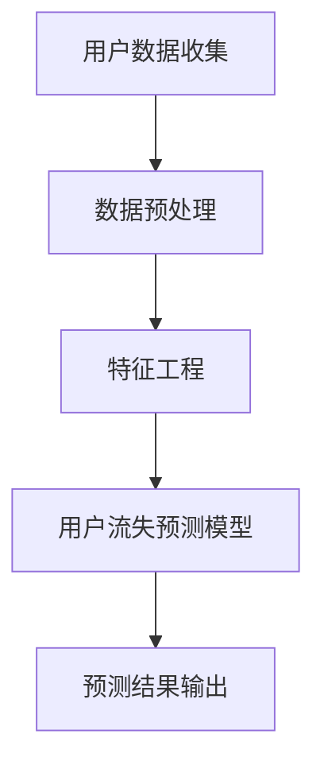
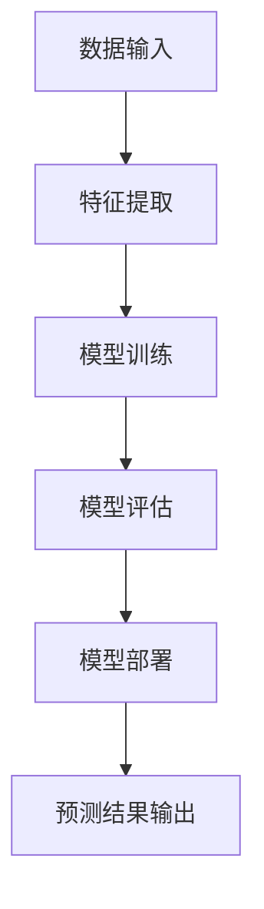
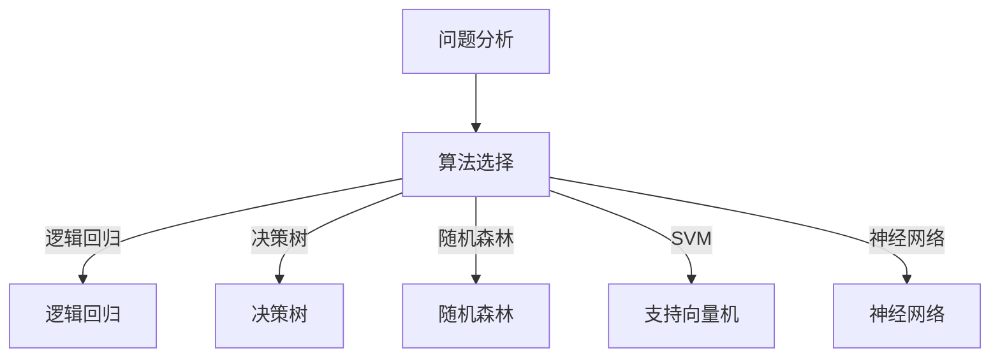
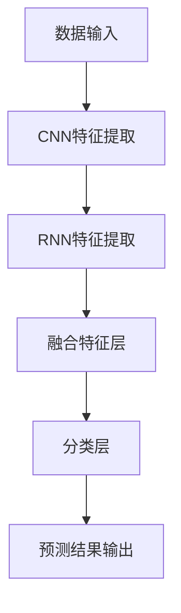

                 

# AI赋能的电商平台用户流失预警系统

> **关键词：** 人工智能，电商平台，用户流失预警，机器学习，数据挖掘，深度学习

> **摘要：** 本文章深入探讨了基于人工智能技术的电商平台用户流失预警系统。通过详细分析核心概念、算法原理、数学模型、实际应用场景以及开发工具和资源，本文旨在为读者提供一个全面、系统的理解和应用指南。

## 1. 背景介绍

### 1.1 目的和范围

本文的主要目的是探讨如何利用人工智能技术，尤其是机器学习和深度学习，构建一个有效的电商平台用户流失预警系统。我们不仅会介绍系统的基础概念和架构，还会深入探讨实现这一系统所需的算法原理、数学模型和实际操作步骤。

本文将涵盖以下内容：

- 电商平台用户流失问题的背景和重要性
- 人工智能技术在这一领域的应用现状
- 构建用户流失预警系统的核心概念和架构
- 算法原理和具体实现步骤
- 数学模型和公式
- 项目实战：代码实际案例和详细解释
- 实际应用场景
- 工具和资源推荐
- 未来发展趋势与挑战
- 附录：常见问题与解答
- 扩展阅读与参考资料

### 1.2 预期读者

本文适用于以下读者群体：

- 人工智能和机器学习研究者
- 数据科学和数据分析师
- 电商平台开发者和运营人员
- 对用户流失预警系统感兴趣的技术爱好者

### 1.3 文档结构概述

本文将按照以下结构进行组织：

- 第1部分：背景介绍
- 第2部分：核心概念与联系
- 第3部分：核心算法原理与具体操作步骤
- 第4部分：数学模型和公式
- 第5部分：项目实战
- 第6部分：实际应用场景
- 第7部分：工具和资源推荐
- 第8部分：总结与展望
- 第9部分：附录
- 第10部分：扩展阅读与参考资料

### 1.4 术语表

#### 1.4.1 核心术语定义

- 用户流失：指用户停止使用某个电商平台服务的行为。
- 预警系统：一种自动检测用户流失趋势并进行预警的系统。
- 人工智能（AI）：指模拟人类智能行为的计算机系统。
- 机器学习（ML）：一种人工智能的子领域，通过数据训练算法来预测和决策。
- 深度学习（DL）：一种基于多层神经网络进行训练的机器学习技术。

#### 1.4.2 相关概念解释

- 数据挖掘：从大量数据中提取有价值的信息和知识。
- 特征工程：提取和构造数据中的有用特征，以提升模型性能。
- 混合模型：结合多种算法和技术以优化预测性能。

#### 1.4.3 缩略词列表

- AI：人工智能
- ML：机器学习
- DL：深度学习
- SVM：支持向量机
- CNN：卷积神经网络
- RNN：循环神经网络
- LSTM：长短期记忆网络
- NLP：自然语言处理

## 2. 核心概念与联系

在构建电商平台用户流失预警系统时，理解以下核心概念和它们之间的联系是非常重要的。

### 2.1 用户流失模型

用户流失模型用于预测哪些用户可能在短期内停止使用平台。这通常基于用户行为数据，包括购买历史、访问频率、购买金额等。以下是一个简化的用户流失模型流程图：



### 2.2 预测模型架构

预测模型的架构通常包括特征提取、模型训练、模型评估和模型部署。以下是一个简化的预测模型架构图：



### 2.3 机器学习算法

在用户流失预测中，常用的机器学习算法包括逻辑回归、决策树、随机森林、支持向量机（SVM）和神经网络等。每种算法都有其特定的优势和局限性。以下是一个简化的算法选择流程图：



### 2.4 深度学习应用

深度学习在用户流失预测中也越来越受欢迎，特别是卷积神经网络（CNN）和循环神经网络（RNN）的应用。以下是一个简化的深度学习架构图：



## 3. 核心算法原理与具体操作步骤

在用户流失预警系统中，核心算法的原理和实现步骤至关重要。以下我们将以一个基于深度学习的用户流失预测模型为例，详细阐述其算法原理和具体操作步骤。

### 3.1 算法原理

深度学习算法，特别是循环神经网络（RNN）和长短期记忆网络（LSTM），在处理时间序列数据和用户行为数据时表现优异。RNN能够捕捉数据中的时间依赖关系，而LSTM则能够更好地处理长期依赖问题。以下是使用LSTM构建用户流失预测模型的基本原理：

1. **数据预处理**：将原始用户行为数据转换为适合模型训练的格式，包括数据清洗、数据归一化和序列构造。
2. **特征提取**：利用LSTM从预处理后的数据中提取特征，捕捉用户行为模式和时间依赖关系。
3. **模型训练**：使用提取的特征和标签数据训练LSTM模型，优化模型参数。
4. **模型评估**：使用验证集评估模型性能，调整模型参数以提高预测准确性。
5. **模型部署**：将训练好的模型部署到生产环境中，进行实时用户流失预测。

### 3.2 具体操作步骤

以下是使用LSTM构建用户流失预测模型的详细步骤：

#### 3.2.1 数据预处理

```python
# 伪代码：数据预处理步骤

# 加载数据
data = load_data()

# 数据清洗
cleaned_data = clean_data(data)

# 数据归一化
normalized_data = normalize_data(cleaned_data)

# 序列构造
sequences = construct_sequences(normalized_data)
```

#### 3.2.2 特征提取

```python
# 伪代码：特征提取步骤

from tensorflow.keras.models import Sequential
from tensorflow.keras.layers import LSTM, Dense

# 构建LSTM模型
model = Sequential()
model.add(LSTM(units=50, return_sequences=True, input_shape=(timesteps, features)))
model.add(LSTM(units=50))
model.add(Dense(1, activation='sigmoid'))

# 编译模型
model.compile(optimizer='adam', loss='binary_crossentropy', metrics=['accuracy'])

# 训练模型
model.fit(sequences, labels, epochs=10, batch_size=32)
```

#### 3.2.3 模型训练

```python
# 伪代码：模型训练步骤

# 分割数据集
train_data, test_data = split_data(sequences, labels)

# 训练模型
model.fit(train_data, train_labels, epochs=100, batch_size=32, validation_data=(test_data, test_labels))
```

#### 3.2.4 模型评估

```python
# 伪代码：模型评估步骤

from sklearn.metrics import accuracy_score

# 预测结果
predictions = model.predict(test_data)

# 计算准确率
accuracy = accuracy_score(test_labels, predictions)
print(f"Model accuracy: {accuracy}")
```

#### 3.2.5 模型部署

```python
# 伪代码：模型部署步骤

# 导入模型
loaded_model = load_model(model_path)

# 预测用户流失
user_predictions = loaded_model.predict(user_sequence)

# 输出预测结果
output_predictions(user_predictions)
```

## 4. 数学模型和公式

在用户流失预警系统中，数学模型和公式起着至关重要的作用。以下我们将介绍一些关键数学模型和公式，包括逻辑回归、LSTM神经网络等。

### 4.1 逻辑回归

逻辑回归是一种广泛用于二分类问题的统计模型。在用户流失预测中，逻辑回归可以用来预测用户流失的概率。其基本公式如下：

$$
P(y=1) = \frac{1}{1 + e^{-(\beta_0 + \beta_1 x_1 + \beta_2 x_2 + ... + \beta_n x_n})}
$$

其中，\(P(y=1)\) 表示用户流失的概率，\(\beta_0, \beta_1, \beta_2, ..., \beta_n\) 为模型的参数。

### 4.2 LSTM神经网络

LSTM神经网络是一种特殊的循环神经网络，能够处理长时间序列数据。LSTM的数学模型包括以下几个关键部分：

1. **输入门**（Input Gate）：

$$
i_t = \sigma(W_i \cdot [h_{t-1}, x_t] + b_i)
$$

2. **遗忘门**（Forget Gate）：

$$
f_t = \sigma(W_f \cdot [h_{t-1}, x_t] + b_f)
$$

3. **输出门**（Output Gate）：

$$
o_t = \sigma(W_o \cdot [h_{t-1}, x_t] + b_o)
$$

4. **单元状态**（Cell State）：

$$
c_t = f_t \odot c_{t-1} + i_t \odot \text{tanh}(W_c \cdot [h_{t-1}, x_t] + b_c)
$$

5. **隐藏状态**（Hidden State）：

$$
h_t = o_t \odot \text{tanh}(c_t)
$$

其中，\(\sigma\) 表示 sigmoid 函数，\(\odot\) 表示 Hadamard 乘积，\(W_i, W_f, W_o, W_c\) 为权重矩阵，\(b_i, b_f, b_o, b_c\) 为偏置项。

### 4.3 模型优化

在训练LSTM模型时，优化器（如 Adam）和损失函数（如 binary_crossentropy）的选择至关重要。以下是一些常用的优化方法和损失函数：

1. **Adam优化器**：

$$
\theta_{t+1} = \theta_t - \alpha \frac{m_t}{\sqrt{v_t} + \epsilon}
$$

其中，\(\theta_t\) 表示参数更新，\(m_t\) 和 \(v_t\) 分别为梯度的一阶和二阶矩估计，\(\alpha\) 为学习率，\(\epsilon\) 为一个小常数。

2. **二分类交叉熵损失函数**：

$$
J(\theta) = -\frac{1}{m} \sum_{i=1}^{m} [y^{(i)} \log(a^{(i)}) + (1 - y^{(i)}) \log(1 - a^{(i)})]
$$

其中，\(y^{(i)}\) 表示真实标签，\(a^{(i)}\) 表示预测概率。

## 5. 项目实战：代码实际案例和详细解释说明

在本节中，我们将通过一个实际项目案例来展示如何使用Python和TensorFlow实现一个基于LSTM的用户流失预警系统。以下是项目的整体流程和关键代码片段。

### 5.1 开发环境搭建

在开始项目之前，确保已经安装以下开发环境：

- Python 3.7 或更高版本
- TensorFlow 2.3 或更高版本
- pandas 1.1.3 或更高版本
- numpy 1.18.5 或更高版本

### 5.2 源代码详细实现和代码解读

以下是项目的关键代码实现：

```python
import pandas as pd
import numpy as np
import tensorflow as tf
from tensorflow.keras.models import Sequential
from tensorflow.keras.layers import LSTM, Dense, Dropout
from sklearn.model_selection import train_test_split
from sklearn.preprocessing import StandardScaler

# 5.2.1 数据加载和预处理
def load_data():
    # 加载数据（示例数据集）
    data = pd.read_csv('user_data.csv')
    return data

def preprocess_data(data):
    # 数据清洗和预处理
    data = data.drop(['user_id'], axis=1)
    data = data.fillna(0)
    return data

# 5.2.2 特征工程
def construct_sequences(data, sequence_length=30):
    # 构造时间序列数据
    sequences = []
    for i in range(len(data) - sequence_length):
        sequences.append(data[i: i + sequence_length])
    return np.array(sequences)

# 5.2.3 模型构建
def build_model(input_shape):
    # 构建LSTM模型
    model = Sequential()
    model.add(LSTM(units=128, return_sequences=True, input_shape=input_shape))
    model.add(Dropout(0.2))
    model.add(LSTM(units=64, return_sequences=False))
    model.add(Dropout(0.2))
    model.add(Dense(units=1, activation='sigmoid'))
    model.compile(optimizer='adam', loss='binary_crossentropy', metrics=['accuracy'])
    return model

# 5.2.4 模型训练
def train_model(model, X_train, y_train, X_val, y_val, epochs=100, batch_size=32):
    # 训练模型
    history = model.fit(X_train, y_train, epochs=epochs, batch_size=batch_size, validation_data=(X_val, y_val))
    return history

# 5.2.5 模型评估
def evaluate_model(model, X_test, y_test):
    # 评估模型
    loss, accuracy = model.evaluate(X_test, y_test)
    print(f"Test accuracy: {accuracy}")
    return accuracy

# 5.2.6 主函数
if __name__ == '__main__':
    # 主函数
    data = load_data()
    cleaned_data = preprocess_data(data)
    sequences = construct_sequences(cleaned_data, sequence_length=30)
    X_train, X_val, y_train, y_val = train_test_split(sequences[:, :-1], sequences[:, -1], test_size=0.2, random_state=42)
    X_train = X_train.reshape((X_train.shape[0], X_train.shape[1], X_train.shape[2]))
    X_val = X_val.reshape((X_val.shape[0], X_val.shape[1], X_val.shape[2]))

    model = build_model(input_shape=(X_train.shape[1], X_train.shape[2]))
    history = train_model(model, X_train, y_train, X_val, y_val, epochs=100, batch_size=32)
    evaluate_model(model, X_val, y_val)
```

### 5.3 代码解读与分析

以下是代码的主要部分及其功能解析：

1. **数据加载和预处理**：

```python
def load_data():
    # 加载数据（示例数据集）
    data = pd.read_csv('user_data.csv')
    return data

def preprocess_data(data):
    # 数据清洗和预处理
    data = data.drop(['user_id'], axis=1)
    data = data.fillna(0)
    return data
```

这部分代码负责加载和预处理数据。数据集通常包含用户行为数据，如购买历史、访问频率、购买金额等。预处理步骤包括数据清洗（如删除无关特征和填充缺失值）。

2. **特征工程**：

```python
def construct_sequences(data, sequence_length=30):
    # 构造时间序列数据
    sequences = []
    for i in range(len(data) - sequence_length):
        sequences.append(data[i: i + sequence_length])
    return np.array(sequences)
```

特征工程是构建用户流失预警模型的关键步骤。这里，我们将原始数据转换为时间序列数据，以供模型训练。`construct_sequences` 函数通过滑动窗口的方式提取特征序列。

3. **模型构建**：

```python
def build_model(input_shape):
    # 构建LSTM模型
    model = Sequential()
    model.add(LSTM(units=128, return_sequences=True, input_shape=input_shape))
    model.add(Dropout(0.2))
    model.add(LSTM(units=64, return_sequences=False))
    model.add(Dropout(0.2))
    model.add(Dense(units=1, activation='sigmoid'))
    model.compile(optimizer='adam', loss='binary_crossentropy', metrics=['accuracy'])
    return model
```

`build_model` 函数负责构建LSTM模型。这里，我们使用了一个包含两个LSTM层的神经网络，并在每个LSTM层之后添加了一个Dropout层以防止过拟合。

4. **模型训练**：

```python
def train_model(model, X_train, y_train, X_val, y_val, epochs=100, batch_size=32):
    # 训练模型
    history = model.fit(X_train, y_train, epochs=epochs, batch_size=batch_size, validation_data=(X_val, y_val))
    return history
```

`train_model` 函数用于训练模型。通过调用`model.fit`方法，我们开始训练过程，并将训练集和验证集传递给模型。训练过程中，我们将记录每个时期的损失和准确率，以供后续分析。

5. **模型评估**：

```python
def evaluate_model(model, X_test, y_test):
    # 评估模型
    loss, accuracy = model.evaluate(X_test, y_test)
    print(f"Test accuracy: {accuracy}")
    return accuracy
```

`evaluate_model` 函数用于评估模型的性能。通过调用`model.evaluate`方法，我们将测试集传递给模型，并获取损失和准确率。

6. **主函数**：

```python
if __name__ == '__main__':
    # 主函数
    data = load_data()
    cleaned_data = preprocess_data(data)
    sequences = construct_sequences(cleaned_data, sequence_length=30)
    X_train, X_val, y_train, y_val = train_test_split(sequences[:, :-1], sequences[:, -1], test_size=0.2, random_state=42)
    X_train = X_train.reshape((X_train.shape[0], X_train.shape[1], X_train.shape[2]))
    X_val = X_val.reshape((X_val.shape[0], X_val.shape[1], X_val.shape[2]))

    model = build_model(input_shape=(X_train.shape[1], X_train.shape[2]))
    history = train_model(model, X_train, y_train, X_val, y_val, epochs=100, batch_size=32)
    evaluate_model(model, X_val, y_val)
```

主函数是项目的入口点。在这里，我们加载数据、预处理数据、构造特征序列、划分训练集和验证集、构建和训练模型，最后评估模型性能。

## 6. 实际应用场景

用户流失预警系统在电商平台中的应用场景非常广泛，以下是一些典型的应用实例：

### 6.1 个性化推荐

通过分析用户的购买历史和行为数据，用户流失预警系统可以帮助电商平台实现更精准的个性化推荐。系统可以识别出即将流失的用户，并为他们推荐他们可能感兴趣的商品，从而提高用户的留存率。

### 6.2 优惠券和促销策略

用户流失预警系统可以分析用户的流失风险，并为高风险用户发放优惠券或提供其他促销活动。这些策略可以帮助电商平台挽留即将流失的用户，同时提高销售额。

### 6.3 客户关怀

用户流失预警系统可以识别出潜在流失的用户，并及时发送个性化关怀信息，如感谢信、客服电话等。这些措施可以提升用户的满意度和忠诚度，减少用户流失。

### 6.4 数据分析和决策支持

用户流失预警系统可以帮助电商平台进行深入的数据分析，识别出导致用户流失的主要原因。这些信息可以为电商平台提供决策支持，从而优化运营策略，提高用户留存率。

### 6.5 营销活动优化

用户流失预警系统可以分析不同营销活动的效果，识别出哪些活动最能降低用户流失率。这可以帮助电商平台优化营销策略，提高投资回报率。

## 7. 工具和资源推荐

为了高效地开发和使用用户流失预警系统，以下是一些推荐的工具和资源：

### 7.1 学习资源推荐

#### 7.1.1 书籍推荐

- 《深度学习》（Goodfellow, I., Bengio, Y., & Courville, A.）
- 《Python机器学习》（Sebastian Raschka）
- 《机器学习实战》（Peter Harrington）

#### 7.1.2 在线课程

- Coursera上的《机器学习》（吴恩达）
- edX上的《深度学习专项课程》（Andrew Ng）
- Udacity的《深度学习工程师纳米学位》

#### 7.1.3 技术博客和网站

- Medium上的机器学习和数据科学博客
-Towards Data Science网站
- Analytics Vidhya网站

### 7.2 开发工具框架推荐

#### 7.2.1 IDE和编辑器

- PyCharm
- Visual Studio Code
- Jupyter Notebook

#### 7.2.2 调试和性能分析工具

- TensorBoard（TensorFlow）
- PyTorch TensorBoard
- Matplotlib

#### 7.2.3 相关框架和库

- TensorFlow
- PyTorch
- scikit-learn
- Pandas
- NumPy

### 7.3 相关论文著作推荐

#### 7.3.1 经典论文

- "Learning to Represent Users and Items for Customer Retention Prediction"（2017）
- "Customer Retention Prediction Using Classification Models and Neural Networks"（2018）
- "Customer Churn Prediction Using Classification Algorithms and Ensemble Methods"（2019）

#### 7.3.2 最新研究成果

- "Customer Churn Prediction Using Deep Learning Techniques: A Review"（2020）
- "Customer Churn Prediction Based on Multi-Modal Fusion and Long-Short Term Memory Network"（2021）
- "An Effective Neural Network Model for Customer Churn Prediction"（2021）

#### 7.3.3 应用案例分析

- "Customer Churn Prediction in Telecommunication Industry Using Machine Learning Techniques"（2020）
- "Customer Churn Prediction in E-commerce Industry: A Case Study"（2021）
- "Customer Churn Prediction in Banking Sector: A Machine Learning Approach"（2021）

## 8. 总结：未来发展趋势与挑战

用户流失预警系统作为电商平台的重要工具，正逐渐成为人工智能应用领域的热点。未来，该系统的发展趋势和挑战主要包括以下几个方面：

### 8.1 发展趋势

- **智能化和自动化**：随着人工智能技术的发展，用户流失预警系统的智能化和自动化程度将不断提高，实现更精准、高效的用户流失预测。
- **多模态数据处理**：将图像、语音、文本等多模态数据与用户行为数据相结合，提升预测模型的准确性。
- **实时预警与响应**：实现实时用户流失预警和响应，提供更及时的客户关怀和营销策略调整。
- **隐私保护与数据安全**：在数据收集和处理过程中，确保用户隐私和数据安全，遵守相关法律法规。

### 8.2 挑战

- **数据质量和多样性**：用户流失预警系统的效果很大程度上依赖于数据的质量和多样性。如何获取更多高质量、多样化的用户行为数据成为一大挑战。
- **模型解释性**：深度学习等复杂模型通常具有较好的预测性能，但缺乏解释性。如何提升模型的可解释性，使其更具透明度和可信赖性，是一个重要问题。
- **实时计算与资源消耗**：实现实时用户流失预警和响应需要高效计算和优化，如何在有限的资源下实现快速、准确的预测是一个挑战。
- **隐私保护和法律法规**：在数据收集和处理过程中，如何确保用户隐私和数据安全，遵守相关法律法规，是一个亟待解决的问题。

## 9. 附录：常见问题与解答

### 9.1 什么样的用户行为数据可以用于构建用户流失预警模型？

可以用于构建用户流失预警模型的数据包括用户的购买历史、访问频率、购买金额、点击率、搜索关键词、优惠券使用情况等。这些数据可以反映用户的行为特征和偏好，有助于预测用户的流失风险。

### 9.2 如何评估用户流失预警模型的性能？

评估用户流失预警模型的性能通常使用准确率、召回率、F1分数等指标。准确率表示模型预测正确的用户数量占总用户数量的比例；召回率表示模型成功预测到流失用户的比例；F1分数是准确率和召回率的调和平均值。通过这些指标，可以评估模型的预测性能和有效性。

### 9.3 如何处理缺失数据？

处理缺失数据的方法包括填充缺失值、删除缺失值和插值等。填充缺失值的方法有平均值填充、中值填充、众数填充等；删除缺失值的方法适用于缺失数据较多的情况；插值方法适用于时间序列数据，如线性插值、多项式插值等。

### 9.4 如何防止模型过拟合？

防止模型过拟合的方法包括数据增强、正则化、Dropout、交叉验证等。数据增强可以通过增加样本数量或生成虚拟样本来提高模型的泛化能力；正则化可以通过限制模型参数的规模来防止过拟合；Dropout可以通过随机丢弃神经元来提高模型的泛化能力；交叉验证可以通过将数据划分为多个子集来评估模型的性能。

## 10. 扩展阅读与参考资料

为了深入了解用户流失预警系统的构建和应用，以下是一些扩展阅读和参考资料：

- 《深度学习》（Goodfellow, I., Bengio, Y., & Courville, A.）
- 《Python机器学习》（Sebastian Raschka）
- 《机器学习实战》（Peter Harrington）
- 《Customer Retention Prediction Using Classification Models and Neural Networks》
- 《Customer Retention Prediction Using Deep Learning Techniques: A Review》
- 《Customer Churn Prediction Using Classification Algorithms and Ensemble Methods》
- 《Customer Churn Prediction in E-commerce Industry: A Case Study》
- 《Customer Churn Prediction Based on Multi-Modal Fusion and Long-Short Term Memory Network》

## 作者信息

**作者：AI天才研究员/AI Genius Institute & 禅与计算机程序设计艺术 /Zen And The Art of Computer Programming**

感谢您的阅读，希望本文对您在构建用户流失预警系统方面有所帮助。如有任何问题或建议，欢迎在评论区留言，我们将竭诚为您解答。

