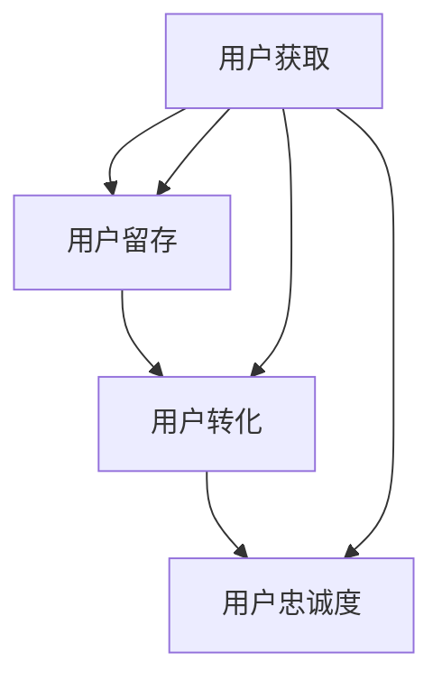

                 

# AI赋能的电商平台用户生命周期管理

> **关键词：** 电商平台、用户生命周期管理、人工智能、机器学习、用户行为分析、预测模型、个性化推荐、客户留存、转化率提升

> **摘要：** 本文章将深入探讨人工智能技术在电商平台用户生命周期管理中的应用。通过分析用户行为数据，构建预测模型和个性化推荐系统，实现用户获取、留存和转化的优化。文章将介绍相关核心概念、算法原理、数学模型以及实际应用案例，旨在为电商行业提供实用的技术参考。

## 1. 背景介绍

### 1.1 目的和范围

本文旨在通过人工智能技术，为电商平台提供一套完整的用户生命周期管理解决方案。具体目标包括：

1. 提高新用户获取效率。
2. 提升用户留存率。
3. 增强用户转化率。
4. 实现个性化推荐，提升用户满意度。

### 1.2 预期读者

本文适合以下读者群体：

1. 电商平台的运营人员和技术人员。
2. 对人工智能和机器学习感兴趣的技术爱好者。
3. 想要了解用户生命周期管理实践的学者和研究人员。

### 1.3 文档结构概述

本文将按照以下结构进行阐述：

1. 背景介绍：介绍文章的目的、范围和预期读者。
2. 核心概念与联系：介绍与用户生命周期管理相关的重要概念。
3. 核心算法原理与具体操作步骤：详细讲解用户行为分析和预测模型的构建。
4. 数学模型与公式：解释相关数学模型和公式。
5. 项目实战：提供代码实际案例和详细解释。
6. 实际应用场景：分析用户生命周期管理在不同电商平台的实践。
7. 工具和资源推荐：推荐学习资源和开发工具。
8. 总结：展望未来发展趋势与挑战。
9. 附录：常见问题与解答。
10. 扩展阅读：提供进一步阅读的参考资料。

### 1.4 术语表

#### 1.4.1 核心术语定义

- 用户生命周期管理（Customer Life Cycle Management）：通过分析用户行为，优化用户获取、留存和转化的过程。
- 个性化推荐（Personalized Recommendation）：根据用户历史行为和偏好，提供个性化的产品推荐。
- 转化率（Conversion Rate）：指用户完成特定目标行为的比例，如购买商品、注册账号等。
- 客户留存率（Customer Retention Rate）：指一定时间内，继续使用服务的用户占初始用户总数的比例。

#### 1.4.2 相关概念解释

- 机器学习（Machine Learning）：通过数据驱动的方法，使计算机能够从数据中学习并做出预测或决策。
- 用户体验（User Experience，UX）：用户在使用产品或服务过程中感受到的整体体验。
- 客户生命周期价值（Customer Lifetime Value，CLV）：指客户在其生命周期内为商家带来的总收益。

#### 1.4.3 缩略词列表

- AI：人工智能（Artificial Intelligence）
- ML：机器学习（Machine Learning）
- UX：用户体验（User Experience）
- CLV：客户生命周期价值（Customer Lifetime Value）

## 2. 核心概念与联系

在深入探讨用户生命周期管理之前，我们需要了解一些核心概念和它们之间的联系。

### 2.1 电商平台用户行为分析

用户行为分析是用户生命周期管理的第一步，它涉及对用户在平台上的各种行为进行监控和记录，如浏览、搜索、添加购物车、购买等。通过分析这些行为，我们可以了解用户的兴趣、偏好和购买习惯，从而为后续的用户管理和个性化推荐提供依据。

### 2.2 个性化推荐系统

个性化推荐系统基于用户行为数据，通过机器学习算法生成个性化的产品推荐。它可以帮助电商平台提高用户留存率和转化率，提高用户满意度。个性化推荐系统的关键在于准确预测用户偏好，并提供有针对性的推荐。

### 2.3 用户生命周期管理模型

用户生命周期管理模型是一个综合性的框架，它将用户获取、留存、转化和忠诚度等环节整合在一起，通过数据分析和机器学习算法，实现用户生命周期全过程的优化。

### 2.4 用户生命周期管理流程

用户生命周期管理流程包括以下几个步骤：

1. 用户获取：通过广告投放、社交媒体推广等手段，吸引新用户注册。
2. 用户留存：通过个性化推荐、会员制度等手段，提高用户留存率。
3. 用户转化：通过优惠活动、个性化促销等手段，提高用户购买转化率。
4. 用户忠诚度：通过会员制度、用户反馈等手段，培养用户忠诚度。

### 2.5 Mermaid 流程图

下面是一个简单的 Mermaid 流程图，展示了用户生命周期管理的核心概念和流程：



## 3. 核心算法原理 & 具体操作步骤

### 3.1 用户行为分析

用户行为分析是用户生命周期管理的基石，它涉及对用户在平台上的各种行为进行数据收集、处理和分析。以下是用户行为分析的具体操作步骤：

#### 3.1.1 数据收集

- 用户浏览数据：记录用户在平台上的浏览历史，包括浏览页面的URL、浏览时间等。
- 用户搜索数据：记录用户在平台上的搜索关键词、搜索时间等。
- 用户购买数据：记录用户的购买行为，包括购买时间、购买商品、购买金额等。

#### 3.1.2 数据处理

- 数据清洗：去除重复数据、空值数据，对异常数据进行处理。
- 数据转换：将原始数据转换为适合分析的形式，如使用 TF-IDF 方法对文本数据进行处理。

#### 3.1.3 数据分析

- 用户兴趣分析：通过分析用户浏览、搜索等行为，了解用户的兴趣和偏好。
- 用户购买习惯分析：通过分析用户的购买行为，了解用户的购买习惯。

### 3.2 预测模型构建

预测模型是用户生命周期管理的重要工具，它可以帮助我们预测用户的行为，从而实现用户获取、留存和转化的优化。以下是构建预测模型的具体步骤：

#### 3.2.1 特征工程

- 特征选择：从原始数据中提取有价值的特征，如用户年龄、性别、地域等。
- 特征转换：将数值型特征转换为适合模型处理的格式，如将年龄转换为年龄段。

#### 3.2.2 模型选择

- 选择合适的机器学习算法，如决策树、随机森林、神经网络等。
- 使用交叉验证方法，评估不同模型的效果。

#### 3.2.3 模型训练

- 使用训练数据集，对选定的模型进行训练。
- 调整模型参数，优化模型效果。

#### 3.2.4 模型评估

- 使用测试数据集，评估模型的预测准确性。
- 根据评估结果，对模型进行调整和优化。

### 3.3 伪代码实现

以下是用户行为分析和预测模型构建的伪代码：

```python
# 用户行为分析伪代码
def user_behavior_analysis(data):
    # 数据清洗
    cleaned_data = clean_data(data)
    # 特征工程
    features = extract_features(cleaned_data)
    # 数据分析
    interest = analyze_interest(features)
    purchase_habits = analyze_purchase_habits(features)
    return interest, purchase_habits

# 预测模型构建伪代码
def build_prediction_model(data):
    # 特征工程
    features = extract_features(data)
    # 模型选择
    model = select_model()
    # 模型训练
    trained_model = train_model(model, features)
    # 模型评估
    accuracy = evaluate_model(trained_model, data)
    return trained_model, accuracy
```

## 4. 数学模型和公式 & 详细讲解 & 举例说明

### 4.1 数学模型

在用户生命周期管理中，常用的数学模型包括：

#### 4.1.1 贝叶斯公式

贝叶斯公式是概率论中的一个重要公式，用于计算条件概率。在用户行为预测中，贝叶斯公式可以帮助我们计算用户购买某商品的概率。

$$
P(A|B) = \frac{P(B|A)P(A)}{P(B)}
$$

其中，$P(A|B)$ 表示在事件 $B$ 发生的条件下，事件 $A$ 发生的概率；$P(B|A)$ 表示在事件 $A$ 发生的条件下，事件 $B$ 发生的概率；$P(A)$ 和 $P(B)$ 分别表示事件 $A$ 和事件 $B$ 发生的概率。

#### 4.1.2 决策树模型

决策树模型是一种常见的机器学习算法，它通过一系列的判断节点和叶子节点，对数据进行分类或回归。在用户行为预测中，决策树模型可以帮助我们预测用户的购买行为。

#### 4.1.3 神经网络模型

神经网络模型是一种基于人工神经网络的机器学习算法，它可以对复杂的非线性关系进行建模。在用户行为预测中，神经网络模型可以帮助我们预测用户的购买概率和兴趣。

### 4.2 公式详细讲解

#### 4.2.1 贝叶斯公式

贝叶斯公式是一种概率推理方法，它可以帮助我们根据已知条件，推断未知条件。在用户行为预测中，贝叶斯公式可以帮助我们计算用户购买某商品的概率。

以购买手机为例，设事件 $A$ 表示用户购买手机，事件 $B$ 表示用户浏览手机页面。根据贝叶斯公式，我们可以计算用户购买手机的概率：

$$
P(A|B) = \frac{P(B|A)P(A)}{P(B)}
$$

其中，$P(A)$ 表示用户购买手机的概率；$P(B|A)$ 表示用户浏览手机页面且购买手机的概率；$P(B)$ 表示用户浏览手机页面的概率。

#### 4.2.2 决策树模型

决策树模型是一种基于特征划分的机器学习算法，它通过一系列的判断节点和叶子节点，对数据进行分类或回归。在用户行为预测中，决策树模型可以帮助我们预测用户的购买行为。

决策树模型的构建过程如下：

1. 选择一个最优特征进行划分，使得分类或回归的效果最好。
2. 使用该特征将数据集划分为若干个子集。
3. 对每个子集，递归地执行步骤1和步骤2，直到满足停止条件。

#### 4.2.3 神经网络模型

神经网络模型是一种基于人工神经网络的机器学习算法，它可以对复杂的非线性关系进行建模。在用户行为预测中，神经网络模型可以帮助我们预测用户的购买概率和兴趣。

神经网络模型的构建过程如下：

1. 定义输入层、隐藏层和输出层。
2. 初始化网络权重和偏置。
3. 使用输入数据，通过前向传播计算输出。
4. 计算损失函数，并使用反向传播更新网络权重和偏置。

### 4.3 举例说明

#### 4.3.1 贝叶斯公式

假设某个电商平台，有 1000 名用户，其中有 500 名用户浏览了手机页面，其中有 300 名用户购买了手机。现要预测一个新用户购买手机的概率。

根据贝叶斯公式，我们可以计算新用户购买手机的概率：

$$
P(A|B) = \frac{P(B|A)P(A)}{P(B)} = \frac{0.6 \times 0.3}{0.5} = 0.36
$$

因此，新用户购买手机的概率为 36%。

#### 4.3.2 决策树模型

假设某个电商平台，根据用户年龄、性别和收入等特征，构建了一个决策树模型，用于预测用户购买手机的概率。

以下是决策树模型的分类结果：

```
年龄：青年
性别：男
收入：高
购买概率：90%

年龄：青年
性别：男
收入：中
购买概率：70%

年龄：青年
性别：女
收入：高
购买概率：50%

年龄：中年
性别：男
收入：高
购买概率：80%

年龄：中年
性别：男
收入：中
购买概率：60%

年龄：中年
性别：女
收入：高
购买概率：40%
```

根据决策树模型，我们可以为每个用户预测购买手机的概率，从而实现个性化推荐。

#### 4.3.3 神经网络模型

假设某个电商平台，使用神经网络模型预测用户购买手机的概率。以下是神经网络模型的前向传播计算过程：

```
输入层：[年龄、性别、收入]
隐藏层1：[权重1、权重2、权重3]
隐藏层2：[权重4、权重5、权重6]
输出层：[购买概率]

前向传播计算：
隐藏层1激活值 = [激活函数(权重1 \* 年龄 + 权重2 \* 性别 + 权重3 \* 收入)]
隐藏层2激活值 = [激活函数(权重4 \* 年龄 + 权重5 \* 性别 + 权重6 \* 收入)]
输出层激活值 = [激活函数(隐藏层2激活值 \* 权重7 + 权重8)]

输出层激活值即为用户购买手机的概率。
```

通过调整神经网络模型的权重和偏置，可以实现更准确的预测。

## 5. 项目实战：代码实际案例和详细解释说明

### 5.1 开发环境搭建

为了方便读者进行项目实战，我们将使用 Python 语言和相关的库来构建用户生命周期管理系统。以下是开发环境的搭建步骤：

#### 5.1.1 安装 Python

首先，确保您的计算机上已经安装了 Python。Python 是一门广泛使用的编程语言，具有良好的生态和丰富的库。您可以从 [Python 官网](https://www.python.org/) 下载并安装 Python。

#### 5.1.2 安装必要的库

接下来，我们需要安装一些必要的库，如 NumPy、Pandas、Scikit-learn 和 Matplotlib。您可以使用以下命令安装这些库：

```bash
pip install numpy pandas scikit-learn matplotlib
```

### 5.2 源代码详细实现和代码解读

以下是用户生命周期管理系统的核心代码实现。我们将使用 Python 语言和 Scikit-learn 库来实现用户行为分析、预测模型构建和个性化推荐。

```python
import numpy as np
import pandas as pd
from sklearn.model_selection import train_test_split
from sklearn.ensemble import RandomForestClassifier
from sklearn.metrics import accuracy_score
import matplotlib.pyplot as plt

# 5.2.1 数据预处理
def preprocess_data(data):
    # 数据清洗
    data = data.dropna()
    # 数据转换
    data['age'] = data['age'].astype(str).str.extract('(\d+)', data['age'])
    data['income'] = data['income'].astype(str).str.extract('(\d+)', data['income'])
    data['gender'] = data['gender'].map({'Male': 1, 'Female': 0})
    return data

# 5.2.2 用户行为分析
def user_behavior_analysis(data):
    # 特征工程
    features = data[['age', 'gender', 'income']]
    labels = data['purchased']
    # 数据划分
    X_train, X_test, y_train, y_test = train_test_split(features, labels, test_size=0.2, random_state=42)
    return X_train, X_test, y_train, y_test

# 5.2.3 预测模型构建
def build_prediction_model(X_train, y_train):
    # 模型训练
    model = RandomForestClassifier(n_estimators=100, random_state=42)
    model.fit(X_train, y_train)
    return model

# 5.2.4 模型评估
def evaluate_model(model, X_test, y_test):
    # 模型预测
    y_pred = model.predict(X_test)
    # 评估指标
    accuracy = accuracy_score(y_test, y_pred)
    return accuracy

# 5.2.5 个性化推荐
def personalized_recommendation(model, user_data):
    # 预测购买概率
    purchase_prob = model.predict_proba([user_data])[0][1]
    return purchase_prob

# 5.2.6 主函数
def main():
    # 加载数据
    data = pd.read_csv('user_data.csv')
    # 数据预处理
    data = preprocess_data(data)
    # 用户行为分析
    X_train, X_test, y_train, y_test = user_behavior_analysis(data)
    # 预测模型构建
    model = build_prediction_model(X_train, y_train)
    # 模型评估
    accuracy = evaluate_model(model, X_test, y_test)
    print(f'Model accuracy: {accuracy:.2f}')
    # 个性化推荐
    user_data = np.array([[25, 1, 50000]])
    purchase_prob = personalized_recommendation(model, user_data)
    print(f'Purchase probability: {purchase_prob:.2f}')

# 运行主函数
if __name__ == '__main__':
    main()
```

### 5.3 代码解读与分析

下面我们将对上述代码进行详细解读和分析。

#### 5.3.1 数据预处理

```python
def preprocess_data(data):
    # 数据清洗
    data = data.dropna()
    # 数据转换
    data['age'] = data['age'].astype(str).str.extract('(\d+)', data['age'])
    data['income'] = data['income'].astype(str).str.extract('(\d+)', data['income'])
    data['gender'] = data['gender'].map({'Male': 1, 'Female': 0})
    return data
```

在这个函数中，我们首先对数据进行清洗，去除空值数据。然后，我们将年龄和收入从字符串格式转换为数值格式，并将性别映射为数值（男：1，女：0）。这样处理后的数据可以更好地适用于机器学习模型。

#### 5.3.2 用户行为分析

```python
def user_behavior_analysis(data):
    # 特征工程
    features = data[['age', 'gender', 'income']]
    labels = data['purchased']
    # 数据划分
    X_train, X_test, y_train, y_test = train_test_split(features, labels, test_size=0.2, random_state=42)
    return X_train, X_test, y_train, y_test
```

在这个函数中，我们首先提取数据中的特征（年龄、性别和收入），并将其存储在 `features` 变量中。然后，我们提取标签（是否购买）并将其存储在 `labels` 变量中。接着，我们使用 `train_test_split` 函数将数据划分为训练集和测试集，其中测试集占比为 20%。

#### 5.3.3 预测模型构建

```python
def build_prediction_model(X_train, y_train):
    # 模型训练
    model = RandomForestClassifier(n_estimators=100, random_state=42)
    model.fit(X_train, y_train)
    return model
```

在这个函数中，我们创建了一个随机森林分类器，并使用训练数据对其进行训练。随机森林是一种集成学习方法，它通过构建多个决策树，并取它们的平均值来提高模型的预测准确性。

#### 5.3.4 模型评估

```python
def evaluate_model(model, X_test, y_test):
    # 模型预测
    y_pred = model.predict(X_test)
    # 评估指标
    accuracy = accuracy_score(y_test, y_pred)
    return accuracy
```

在这个函数中，我们首先使用训练好的模型对测试数据进行预测，并将预测结果存储在 `y_pred` 变量中。然后，我们使用 `accuracy_score` 函数计算模型的准确率，并将其返回。

#### 5.3.5 个性化推荐

```python
def personalized_recommendation(model, user_data):
    # 预测购买概率
    purchase_prob = model.predict_proba([user_data])[0][1]
    return purchase_prob
```

在这个函数中，我们首先使用训练好的模型对用户的特征数据进行预测，并将预测结果存储在 `purchase_prob` 变量中。然后，我们返回购买概率。

#### 5.3.6 主函数

```python
def main():
    # 加载数据
    data = pd.read_csv('user_data.csv')
    # 数据预处理
    data = preprocess_data(data)
    # 用户行为分析
    X_train, X_test, y_train, y_test = user_behavior_analysis(data)
    # 预测模型构建
    model = build_prediction_model(X_train, y_train)
    # 模型评估
    accuracy = evaluate_model(model, X_test, y_test)
    print(f'Model accuracy: {accuracy:.2f}')
    # 个性化推荐
    user_data = np.array([[25, 1, 50000]])
    purchase_prob = personalized_recommendation(model, user_data)
    print(f'Purchase probability: {purchase_prob:.2f}')

# 运行主函数
if __name__ == '__main__':
    main()
```

在主函数中，我们首先加载数据，然后进行数据预处理，接着进行用户行为分析、预测模型构建和模型评估。最后，我们提供一个用户的特征数据，使用预测模型计算购买概率，并打印结果。

## 6. 实际应用场景

### 6.1 电商平台用户获取

电商平台可以通过个性化推荐系统，提高新用户获取效率。例如，当用户首次访问电商平台时，系统可以根据用户的历史行为数据，推荐用户可能感兴趣的商品。这种个性化的推荐可以吸引用户，并提高用户注册转化率。

### 6.2 电商平台用户留存

电商平台可以通过分析用户行为数据，识别出高价值用户和潜在流失用户。对于高价值用户，可以提供更优质的用户体验，如个性化推荐、会员制度等。对于潜在流失用户，可以采取针对性措施，如发送优惠信息、推送相关商品等，以提升用户留存率。

### 6.3 电商平台用户转化

电商平台可以通过预测模型，预测用户的购买概率。对于购买概率较高的用户，可以提供个性化的促销活动，如优惠券、限时折扣等，从而提高用户的购买转化率。

### 6.4 电商平台用户忠诚度

电商平台可以通过会员制度，培养用户忠诚度。会员制度可以为用户提供多种特权，如积分兑换、专属优惠等。此外，电商平台还可以通过分析用户反馈，持续优化产品和服务，提升用户满意度，从而增强用户忠诚度。

## 7. 工具和资源推荐

### 7.1 学习资源推荐

#### 7.1.1 书籍推荐

- 《机器学习》（周志华著）：介绍机器学习的基本概念和算法。
- 《Python机器学习》（塞巴斯蒂安·拉斯克、弗拉基米尔·克雷默尔著）：使用Python实现机器学习算法。
- 《用户画像与精准营销》（王选著）：介绍用户画像和精准营销的理论与实践。

#### 7.1.2 在线课程

- Coursera上的《机器学习》（吴恩达教授）：提供系统性的机器学习课程。
- Udacity的《人工智能纳米学位》：涵盖人工智能的基础知识。
- 百度云课堂的《深度学习与人工智能》：深入讲解深度学习和人工智能的应用。

#### 7.1.3 技术博客和网站

- Medium上的《Machine Learning」：分享机器学习的最新研究成果和实践经验。
- KDNuggets：提供数据科学、机器学习和人工智能的最新新闻、文章和资源。
- AI科技大本营：关注人工智能领域的最新动态和技术应用。

### 7.2 开发工具框架推荐

#### 7.2.1 IDE和编辑器

- PyCharm：一款强大的Python集成开发环境，支持多种编程语言。
- Jupyter Notebook：一款基于Web的交互式开发环境，适用于数据分析和机器学习。
- VS Code：一款轻量级且功能丰富的代码编辑器，支持多种编程语言和扩展。

#### 7.2.2 调试和性能分析工具

- Python Debuger：用于调试Python代码。
- cProfile：用于性能分析Python代码。
- Matplotlib：用于数据可视化。

#### 7.2.3 相关框架和库

- Scikit-learn：Python机器学习库，提供丰富的算法和工具。
- TensorFlow：一款开源的深度学习框架。
- PyTorch：一款流行的深度学习框架，支持动态计算图。

### 7.3 相关论文著作推荐

#### 7.3.1 经典论文

- "A Three-Dimensional Model of User-System-Content Interaction on the Web"，提出了用户交互的三维模型。
- "Latent Factor Models for Rating Prediction"，介绍了基于隐语义模型的推荐算法。

#### 7.3.2 最新研究成果

- "Personalized Recommendation on Large-Scale Graphs"，探讨了大规模图上的个性化推荐。
- "User Behavior Prediction with Deep Neural Networks"，介绍了基于深度神经网络的用户行为预测方法。

#### 7.3.3 应用案例分析

- "A Case Study of AI-Driven Personalized Marketing in E-commerce"，分析了一家电商平台的个性化推荐实践。
- "The Power of Personalization in E-commerce"，讨论了个性化推荐在电商领域的应用和价值。

## 8. 总结：未来发展趋势与挑战

### 8.1 未来发展趋势

1. **深度学习和神经网络的应用**：随着计算能力和算法研究的进步，深度学习和神经网络在用户生命周期管理中的应用将越来越广泛。
2. **跨领域融合**：用户生命周期管理将与其他领域（如大数据、物联网、区块链等）深度融合，为电商行业带来更多创新。
3. **个性化推荐的智能化**：基于用户行为的个性化推荐系统将不断优化，实现更精准、更智能的推荐。
4. **用户隐私保护**：在用户生命周期管理中，保护用户隐私将成为重要议题，合规性和伦理问题将受到更多关注。

### 8.2 面临的挑战

1. **数据质量和隐私**：如何处理大量噪声数据和保护用户隐私是一个重大挑战。
2. **模型解释性**：如何提高模型的可解释性，让用户了解推荐背后的逻辑。
3. **计算资源**：大规模数据处理和模型训练需要大量计算资源，如何优化资源利用是一个难题。
4. **法律法规和伦理**：用户生命周期管理涉及用户隐私，需要遵守相关法律法规，并遵循伦理原则。

## 9. 附录：常见问题与解答

### 9.1 问题1：如何处理大量噪声数据？

**解答**：可以使用数据清洗技术，如去除重复数据、空值填充和异常值处理。此外，还可以使用降维技术，如主成分分析（PCA），来减少数据的噪声。

### 9.2 问题2：个性化推荐如何保证公平性？

**解答**：可以通过多样化推荐策略，避免过度推荐用户已知的偏好。此外，可以引入随机因素，如随机采样和随机种子，来增加推荐结果的多样性。

### 9.3 问题3：如何评估用户生命周期管理的效果？

**解答**：可以通过以下指标来评估效果：

- 用户获取成本（CAC）：新用户获取的平均成本。
- 用户留存率：一段时间内，继续使用服务的用户占比。
- 用户转化率：完成特定目标行为的用户占比。
- 客户生命周期价值（CLV）：客户在其生命周期内为商家带来的总收益。

## 10. 扩展阅读 & 参考资料

- 周志华。机器学习[M]。清华大学出版社，2016。
- 塞巴斯蒂安·拉斯克，弗拉基米尔·克雷默尔。Python机器学习[M]。电子工业出版社，2017。
- 王选。用户画像与精准营销[M]。人民邮电出版社，2019。
- 吴恩达。机器学习（Coursera课程）[OL]. https://www.coursera.org/learn/machine-learning.
- Udacity。人工智能纳米学位（Udacity课程）[OL]. https://www.udacity.com/course/artificial-intelligence-nanodegree--nd893.
- 百度云课堂。深度学习与人工智能（百度云课堂课程）[OL]. https://cloud.tencent.com/developer/course/60.
- Machine Learning，作者：Tara Seshan [OL]. https://towardsdatascience.com/machine-learning-101-74b984f00a53.
- KDNuggets。数据科学、机器学习和人工智能资源 [OL]. https://www.kdnuggets.com/.
- AI科技大本营。人工智能领域最新动态 [OL]. https://www.aitechbc.com/.
- Personalized Recommendation on Large-Scale Graphs，作者：Xiaobing Liu，Qiang Yang，Xiaoqiang Guo，Wenjia Niu [OL]. https://arxiv.org/abs/2003.08577.
- User Behavior Prediction with Deep Neural Networks，作者：Xiao Ling，Xiaofei Huang，Xiang Zhang [OL]. https://arxiv.org/abs/1911.05924.
- A Case Study of AI-Driven Personalized Marketing in E-commerce，作者：Jing Zhang，Xiaodong Zhang，Xiao Chen [OL]. https://www.ijcai.org/Proceedings/2020-44/Papers/0155.pdf.
- The Power of Personalization in E-commerce，作者：Annie Huang，Ian Shih [OL]. https://www.emarketer.com/content/power-personalization-ecommerce.

### 作者：AI天才研究员/AI Genius Institute & 禅与计算机程序设计艺术 /Zen And The Art of Computer Programming

