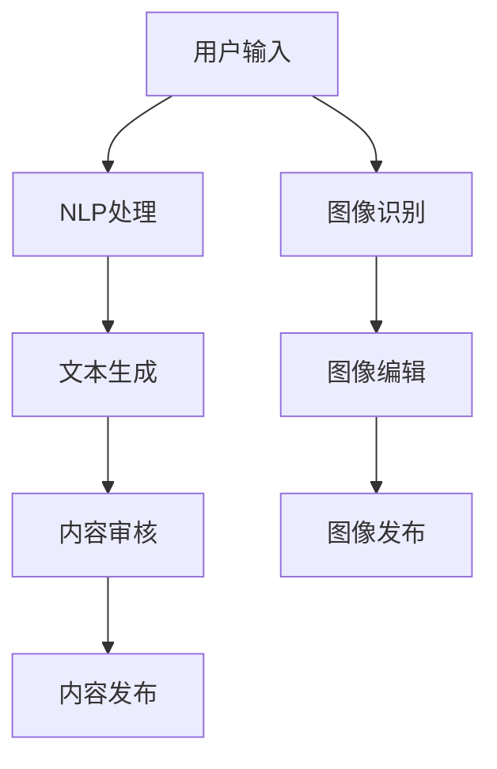

                 

# AI辅助创作工具：内容产业的创新方向

> 关键词：人工智能，内容产业，AI辅助创作，创新方向，技术趋势

> 摘要：本文旨在探讨人工智能在内容产业中的应用，尤其是AI辅助创作工具的发展现状、核心原理以及未来趋势。文章首先介绍了内容产业的概念及其重要性，接着分析了AI辅助创作工具的背景和意义。随后，文章深入剖析了AI辅助创作工具的核心概念和联系，详细讲解了核心算法原理和具体操作步骤，并通过数学模型和公式进行了详细讲解。最后，文章提供了项目实战案例，分析了实际应用场景，并推荐了相关工具和资源。总结部分展望了未来发展趋势与挑战，以期为相关领域的研究者和开发者提供有价值的参考。

## 1. 背景介绍

### 1.1 目的和范围

内容产业，作为数字经济的重要组成部分，涵盖了从内容创作、编辑、发布到传播的整个链条。近年来，随着互联网的普及和技术的快速发展，内容产业呈现出爆炸式增长。然而，内容创作的复杂性、多样性以及市场需求的不断变化，给内容创作者带来了巨大的挑战。为了应对这一挑战，人工智能（AI）技术的应用成为了一个重要方向。

本文旨在探讨人工智能在内容产业中的应用，特别是AI辅助创作工具的发展现状、核心原理以及未来趋势。通过本文的阅读，读者可以了解AI辅助创作工具的基本概念、技术架构、操作流程，以及在实际应用中的优势与挑战。本文不仅关注技术的原理和实现，还将讨论AI辅助创作工具在内容产业中的广泛应用场景，以及相关的学习资源和开发工具。

### 1.2 预期读者

本文的预期读者包括：

1. 内容创作者和编辑：对AI辅助创作工具感兴趣的创作者和编辑，希望通过本文了解如何利用AI技术提升内容创作效率和质量。
2. AI技术研究者和开发者：对人工智能在内容产业中的应用感兴趣的技术研究者和技术开发者，希望通过本文了解AI辅助创作工具的核心技术和实现方法。
3. 互联网和内容行业从业者：关注内容产业趋势，希望了解AI技术如何改变内容产业的从业者们。
4. 对AI辅助创作工具感兴趣的一般读者：对人工智能和内容创作领域有兴趣的读者，希望通过本文了解AI辅助创作工具的工作原理和应用前景。

### 1.3 文档结构概述

本文将分为以下几个部分：

1. **背景介绍**：介绍内容产业的概念、重要性以及AI辅助创作工具的背景和意义。
2. **核心概念与联系**：详细阐述AI辅助创作工具的核心概念，并通过Mermaid流程图展示其工作流程。
3. **核心算法原理 & 具体操作步骤**：讲解AI辅助创作工具的核心算法原理和具体操作步骤，使用伪代码进行详细阐述。
4. **数学模型和公式 & 详细讲解 & 举例说明**：介绍AI辅助创作工具所涉及的数学模型和公式，并进行详细讲解和举例说明。
5. **项目实战：代码实际案例和详细解释说明**：通过实际案例展示AI辅助创作工具的代码实现过程，并进行详细解释和分析。
6. **实际应用场景**：分析AI辅助创作工具在实际应用中的优势和挑战。
7. **工具和资源推荐**：推荐学习资源、开发工具框架和相关论文著作。
8. **总结：未来发展趋势与挑战**：总结AI辅助创作工具的未来发展趋势和面临的挑战。
9. **附录：常见问题与解答**：回答读者可能遇到的一些常见问题。
10. **扩展阅读 & 参考资料**：提供相关的扩展阅读和参考资料。

通过本文的阅读，读者可以系统地了解AI辅助创作工具的各个方面，为实际应用和研究提供有益的参考。

### 1.4 术语表

#### 1.4.1 核心术语定义

1. **人工智能（AI）**：一种模拟人类智能的技术，能够通过学习、推理、感知和自适应等方式实现智能行为。
2. **内容产业**：涉及内容创作、编辑、发布、传播等环节的产业，包括新闻、出版、娱乐、广告等多个领域。
3. **AI辅助创作工具**：利用人工智能技术辅助人类进行内容创作的工具，如自动写作、文本生成、图像识别等。
4. **深度学习**：一种基于人工神经网络的机器学习技术，能够通过多层网络模型对复杂数据进行自动特征提取和模式识别。
5. **自然语言处理（NLP）**：研究如何使计算机理解和处理人类自然语言的技术。
6. **生成对抗网络（GAN）**：一种深度学习模型，由生成器和判别器组成，用于生成高质量的数据。

#### 1.4.2 相关概念解释

1. **文本生成**：利用自然语言处理和深度学习技术生成文本内容的过程。
2. **图像识别**：通过计算机算法对图像进行识别和理解的过程，包括分类、定位和特征提取等。
3. **内容推荐**：基于用户行为和偏好，为用户推荐相关内容的系统。
4. **机器学习模型**：通过数据训练和优化，能够实现特定任务的算法模型。
5. **迁移学习**：利用已训练好的模型在新任务上进行训练，提高模型在新任务上的性能。

#### 1.4.3 缩略词列表

- AI：人工智能
- NLP：自然语言处理
- GAN：生成对抗网络
- DNN：深度神经网络
- ML：机器学习
- CNN：卷积神经网络
- RNN：循环神经网络
- LSTM：长短期记忆网络

## 2. 核心概念与联系

AI辅助创作工具的核心概念包括自然语言处理（NLP）、生成对抗网络（GAN）、文本生成模型、图像识别模型等。这些概念彼此联系，共同构成了一个完整的AI辅助创作系统。

下面是一个Mermaid流程图，展示了AI辅助创作工具的核心流程：



### 2.1 用户输入

用户输入是AI辅助创作工具的起点。用户可以通过文本输入框或图像输入框提交内容。文本输入可以是一段自然语言文本，图像输入可以是用户拍摄的照片或选择的自定义图片。

### 2.2 NLP处理

自然语言处理（NLP）模块负责对用户提交的文本进行分词、词性标注、句法分析等处理。这一模块的核心任务是理解用户输入的语义，提取关键信息和特征，为后续的文本生成和内容审核提供基础数据。

### 2.3 文本生成

文本生成模块利用深度学习模型（如生成对抗网络（GAN）、变分自编码器（VAE）等）生成高质量的文本内容。生成模型可以根据用户输入的文本特征，生成新的、具有创造性的文本内容，从而实现自动写作、文章续写、文本摘要等功能。

### 2.4 内容审核

内容审核模块负责对生成的文本内容进行审核，确保内容的合规性和质量。审核过程可以包括语法检查、文本分类、情感分析等。如果发现内容不符合标准，审核模块会给出修改建议或直接删除不符合要求的文本。

### 2.5 内容发布

经过审核后的文本内容会被发布到相应的平台，如社交媒体、博客、新闻网站等。发布过程可以是自动化的，也可以是手动操作。

### 2.6 图像识别

对于用户提交的图像输入，图像识别模块会通过计算机视觉算法对图像进行识别和理解。图像识别模块可以用于图像分类、目标检测、图像分割等任务，从而实现对图像内容的理解和处理。

### 2.7 图像编辑

图像编辑模块会对识别后的图像进行编辑，如裁剪、添加滤镜、调整亮度等。编辑后的图像可以被重新发布或用于其他应用场景。

### 2.8 图像发布

编辑后的图像会被发布到相应的平台，如社交媒体、相册、图片库等。发布过程可以是自动化的，也可以是手动操作。

通过上述核心概念和联系，我们可以看到AI辅助创作工具是如何将用户输入转化为高质量的内容，并在不同的应用场景中发挥作用的。接下来，我们将深入探讨AI辅助创作工具的核心算法原理和具体操作步骤。

## 3. 核心算法原理 & 具体操作步骤

AI辅助创作工具的核心算法原理主要基于深度学习和自然语言处理技术。以下将详细解释这些算法的基本原理和具体操作步骤。

### 3.1 深度学习基础

深度学习是一种基于多层神经网络的机器学习方法，通过模拟人脑神经元的工作方式，实现复杂数据的自动特征提取和模式识别。核心组成部分包括：

- **输入层**：接收外部数据，如文本、图像等。
- **隐藏层**：通过非线性变换对输入数据进行特征提取。
- **输出层**：生成预测结果或输出目标数据。

深度学习模型训练过程主要包括以下步骤：

1. **数据预处理**：对输入数据进行归一化、去噪等处理，提高数据质量。
2. **模型初始化**：随机初始化模型参数。
3. **前向传播**：将输入数据通过神经网络进行传播，得到输出结果。
4. **损失函数计算**：计算输出结果与真实值之间的差距，得到损失函数值。
5. **反向传播**：根据损失函数值，通过反向传播算法更新模型参数。
6. **迭代优化**：重复上述步骤，直至模型收敛。

### 3.2 自然语言处理

自然语言处理（NLP）是AI辅助创作工具的重要组成部分，其主要任务包括文本分类、情感分析、命名实体识别、机器翻译等。以下以文本分类为例，介绍NLP的核心算法原理和具体操作步骤：

1. **词向量化**：将文本中的单词转化为固定长度的向量表示。常用的词向量化方法有Word2Vec、GloVe等。
2. **模型构建**：使用深度学习模型（如卷积神经网络（CNN）、循环神经网络（RNN）、长短期记忆网络（LSTM）等）构建文本分类器。
3. **数据预处理**：对文本数据进行分词、去停用词、标点符号处理等操作，提高数据质量。
4. **模型训练**：通过训练数据训练分类器，使用损失函数（如交叉熵损失函数）计算模型损失，并使用反向传播算法优化模型参数。
5. **模型评估**：使用验证集或测试集评估模型性能，计算准确率、召回率、F1值等指标。
6. **模型应用**：将训练好的模型应用于实际文本分类任务，实现自动化文本分类。

### 3.3 文本生成

文本生成是AI辅助创作工具的重要功能之一，主要通过生成对抗网络（GAN）、变分自编码器（VAE）等深度学习模型实现。以下以生成对抗网络（GAN）为例，介绍文本生成的算法原理和具体操作步骤：

1. **生成器（Generator）**：生成器是一个深度神经网络，用于生成新的文本内容。其输入是随机噪声，输出是生成的文本。
2. **判别器（Discriminator）**：判别器是一个深度神经网络，用于区分生成器和真实数据的真实度。其输入是生成的文本和真实文本，输出是概率分布。
3. **训练过程**：
   - **步骤1**：生成器生成一批文本，判别器对其进行判断。
   - **步骤2**：根据判别器的判断结果，通过反向传播算法更新生成器的参数。
   - **步骤3**：重复上述步骤，直到生成器生成的高质量文本能够欺骗判别器。

4. **文本生成**：在训练完成后，生成器可以根据给定的输入生成高质量的文本内容，如文章续写、文本摘要等。

### 3.4 图像识别

图像识别是计算机视觉领域的一个重要任务，主要通过卷积神经网络（CNN）等深度学习模型实现。以下以卷积神经网络（CNN）为例，介绍图像识别的算法原理和具体操作步骤：

1. **卷积操作**：卷积神经网络通过卷积操作提取图像中的局部特征，如边缘、纹理等。
2. **池化操作**：通过池化操作降低特征图的维度，提高模型的泛化能力。
3. **全连接层**：将池化层输出的特征图通过全连接层进行分类或回归。
4. **模型训练**：
   - **步骤1**：使用带有标签的训练数据训练卷积神经网络。
   - **步骤2**：通过反向传播算法优化模型参数。
   - **步骤3**：使用验证集或测试集评估模型性能。

5. **图像识别**：在模型训练完成后，可以使用训练好的卷积神经网络对新的图像进行识别和分类。

通过上述核心算法原理和具体操作步骤，我们可以看到AI辅助创作工具是如何实现从用户输入到高质量内容生成的全过程。接下来，我们将介绍AI辅助创作工具涉及的数学模型和公式，并对其进行详细讲解和举例说明。

## 4. 数学模型和公式 & 详细讲解 & 举例说明

AI辅助创作工具的核心算法涉及多种数学模型和公式，以下将分别介绍这些模型，并详细讲解其原理和具体应用。

### 4.1 深度学习基础

深度学习基础包括损失函数、优化算法等。以下介绍几个常见的数学模型和公式。

#### 4.1.1 损失函数

1. **交叉熵损失函数（Cross-Entropy Loss）**：
   - **定义**：用于分类任务的损失函数，衡量预测概率分布与真实分布之间的差异。
   - **公式**：$L = -\sum_{i} y_i \log(p_i)$，其中$y_i$为真实标签，$p_i$为预测概率。
   - **应用**：文本分类、图像分类等任务。

2. **均方误差损失函数（Mean Squared Error, MSE）**：
   - **定义**：用于回归任务的损失函数，衡量预测值与真实值之间的差异。
   - **公式**：$L = \frac{1}{n} \sum_{i=1}^{n} (y_i - \hat{y_i})^2$，其中$y_i$为真实值，$\hat{y_i}$为预测值。
   - **应用**：图像识别、语音识别等任务。

#### 4.1.2 优化算法

1. **梯度下降（Gradient Descent）**：
   - **定义**：一种优化算法，通过不断更新模型参数，使损失函数值最小化。
   - **公式**：$\theta_{t+1} = \theta_t - \alpha \nabla_{\theta} J(\theta_t)$，其中$\theta_t$为当前参数，$\alpha$为学习率，$J(\theta)$为损失函数。
   - **应用**：各类深度学习模型训练。

2. **随机梯度下降（Stochastic Gradient Descent, SGD）**：
   - **定义**：在梯度下降基础上，每次迭代只使用一个样本进行参数更新。
   - **公式**：$\theta_{t+1} = \theta_t - \alpha \nabla_{\theta} J(\theta_t; x_t, y_t)$，其中$x_t$为当前样本，$y_t$为当前样本的真实标签。
   - **应用**：大规模数据集的深度学习模型训练。

### 4.2 自然语言处理

自然语言处理（NLP）涉及词向量化、文本分类等任务，以下介绍相关的数学模型和公式。

#### 4.2.1 词向量化

1. **Word2Vec**：
   - **定义**：一种基于神经网络的词向量化方法，通过训练得到单词的向量表示。
   - **公式**：
     $$ 
     \begin{aligned}
     \hat{y} &= \text{softmax}(W \cdot h_v) \\
     \end{aligned}
     $$
     其中$W$为权重矩阵，$h_v$为词向量的隐层表示，$\hat{y}$为预测的词向量。

2. **GloVe**：
   - **定义**：基于全局上下文信息的词向量化方法，通过训练得到单词的向量表示。
   - **公式**：
     $$ 
     \begin{aligned}
     f(w, c) &= \frac{f(c, w)}{||c - w||_2} \\
     \end{aligned}
     $$
     其中$f(w, c)$为词对$(w, c)$的相似度，$c$和$w$分别为词的上下文表示。

#### 4.2.2 文本分类

1. **卷积神经网络（CNN）**：
   - **定义**：一种基于卷积操作的深度学习模型，适用于文本分类任务。
   - **公式**：
     $$
     \begin{aligned}
     h^{(l)}_{ij} &= \text{ReLU} \left( \sum_{k=1}^{K} w_{ik} * g^{(l-1)}_{kj} + b_{i} \right) \\
     \end{aligned}
     $$
     其中$h^{(l)}_{ij}$为第$l$层第$i$个特征值，$w_{ik}$为卷积核，$g^{(l-1)}_{kj}$为输入特征，$\text{ReLU}$为ReLU激活函数。

2. **循环神经网络（RNN）**：
   - **定义**：一种基于循环结构的深度学习模型，适用于文本分类任务。
   - **公式**：
     $$
     \begin{aligned}
     h_t &= \text{ReLU} \left( W_h \cdot [h_{t-1}, x_t] + b_h \right) \\
     \end{aligned}
     $$
     其中$h_t$为第$t$个时间步的隐藏状态，$W_h$为权重矩阵，$x_t$为输入特征，$\text{ReLU}$为ReLU激活函数。

### 4.3 文本生成

文本生成涉及生成对抗网络（GAN）、变分自编码器（VAE）等模型。以下介绍这些模型的数学模型和公式。

#### 4.3.1 生成对抗网络（GAN）

1. **生成器（Generator）**：
   - **定义**：生成器是一个深度神经网络，用于生成新的文本内容。
   - **公式**：
     $$
     \begin{aligned}
     \hat{y} &= \text{softmax}(G(z)) \\
     \end{aligned}
     $$
     其中$z$为输入噪声，$G(z)$为生成器的输出。

2. **判别器（Discriminator）**：
   - **定义**：判别器是一个深度神经网络，用于区分生成器和真实数据的真实度。
   - **公式**：
     $$
     \begin{aligned}
     \hat{y} &= \text{softmax}(D(x)) \\
     \end{aligned}
     $$
     其中$x$为真实文本。

3. **训练过程**：
   - **步骤1**：生成器生成一批文本，判别器对其进行判断。
   - **步骤2**：根据判别器的判断结果，通过反向传播算法更新生成器的参数。
   - **步骤3**：重复上述步骤，直到生成器生成的高质量文本能够欺骗判别器。

#### 4.3.2 变分自编码器（VAE）

1. **编码器（Encoder）**：
   - **定义**：编码器是一个深度神经网络，用于将输入文本映射到一个潜在空间。
   - **公式**：
     $$
     \begin{aligned}
     \mu &= \mu(z|x) \\
     \sigma &= \sigma(z|x) \\
     \end{aligned}
     $$
     其中$\mu$和$\sigma$分别为潜在变量的均值和方差。

2. **解码器（Decoder）**：
   - **定义**：解码器是一个深度神经网络，用于将潜在变量映射回文本。
   - **公式**：
     $$
     \begin{aligned}
     x &= \text{softmax}(D(\mu, \sigma)) \\
     \end{aligned}
     $$

3. **训练过程**：
   - **步骤1**：使用训练数据训练编码器和解码器。
   - **步骤2**：通过损失函数（如均方误差）优化编码器和解码器的参数。
   - **步骤3**：使用验证集或测试集评估模型性能。

通过上述数学模型和公式，我们可以看到AI辅助创作工具在深度学习、自然语言处理和文本生成等方面是如何应用数学知识来提高内容创作的效率和质量。接下来，我们将通过一个实际项目实战，展示AI辅助创作工具的代码实现过程，并对关键代码进行详细解读。

## 5. 项目实战：代码实际案例和详细解释说明

在本节中，我们将通过一个具体的代码案例，展示AI辅助创作工具的开发过程。本案例将使用Python编程语言和TensorFlow深度学习框架来实现一个文本生成模型。以下是项目实战的详细步骤和代码解读。

### 5.1 开发环境搭建

在进行项目开发之前，我们需要搭建合适的环境。以下是开发环境的要求和安装步骤：

1. **操作系统**：Ubuntu 18.04 或 Windows 10
2. **Python**：Python 3.7 或更高版本
3. **深度学习框架**：TensorFlow 2.0 或更高版本
4. **文本处理库**：NLTK、Gensim
5. **其他依赖库**：numpy、pandas

安装步骤如下：

```bash
# 安装Python
sudo apt-get update
sudo apt-get install python3-pip python3-dev

# 安装TensorFlow
pip3 install tensorflow

# 安装其他依赖库
pip3 install nltk gensim numpy pandas
```

### 5.2 源代码详细实现和代码解读

以下是文本生成模型的源代码实现，我们将在后续进行详细解读：

```python
import tensorflow as tf
from tensorflow.keras.models import Model
from tensorflow.keras.layers import Input, LSTM, Dense, Embedding, TimeDistributed
from tensorflow.keras.preprocessing.sequence import pad_sequences
from tensorflow.keras.callbacks import LambdaCallback
import numpy as np
import random
import sys
import io

# 设置参数
EPOCHS = 50
BATCH_SIZE = 64
SEQ_LENGTH = 40
EMBEDDING_DIM = 256
LSTM_UNITS = 1024
PURGE_THRESHOLD = 5000

# 函数：从文本中提取词汇和序列
def prepare_data(text):
    # 初始化词汇表
    vocab = {}
    index = 0
    # 预处理文本，去除标点符号和特殊字符
    text = text.lower()
    text = re.sub(r"[^a-zA-Z0-9]", " ", text)
    # 分词
    words = text.split()
    # 构建词汇表
    for word in words:
        if word not in vocab:
            vocab[word] = index
            index += 1
    # 构建反向词汇表
    reverse_vocab = {v: k for k, v in vocab.items()}
    return vocab, reverse_vocab

# 函数：将词汇转换为序列
def sequence_from_text(text, vocab, reverse_vocab):
    sequences = []
    for i in range(0, len(text) - SEQ_LENGTH):
        sequence = text[i: i + SEQ_LENGTH]
        sequences.append([vocab[word] for word in sequence])
    return sequences

# 函数：将序列转换为输入和目标数据
def prepare_dataset(sequences, vocab_size):
    inputs = np.zeros((len(sequences), SEQ_LENGTH, vocab_size))
    targets = np.zeros((len(sequences), SEQ_LENGTH, vocab_size))
    for i, sequence in enumerate(sequences):
        for t, word in enumerate(sequence):
            inputs[i, t, vocab[word]] = 1
            targets[i, t, vocab[word]] = 1
    return inputs, targets

# 函数：生成文本
def generate_text(seed_text, model, vocab, reverse_vocab, length=200):
    result = seed_text
    print(result, end="", flush=True)
    next_words = seed_text.split()[-SEQ_LENGTH:]
    next_words = [vocab[word] for word in next_words]
    next_words = np.array(next_words).reshape(1, -1)
    for _ in range(length):
        predictions = model.predict(next_words)
        predicted_word = np.argmax(predictions[:, -1, :])
        result += " " + reverse_vocab[predicted_word]
        next_words = np.hstack((next_words[:, :-1], [predicted_word]))
    return result

# 主函数
def main():
    # 读取文本数据
    with open("data.txt", "r", encoding="utf-8") as f:
        text = f.read()

    # 准备数据
    vocab, reverse_vocab = prepare_data(text)
    sequences = sequence_from_text(text, vocab, reverse_vocab)
    inputs, targets = prepare_dataset(sequences, len(vocab))

    # 构建模型
    input_layer = Input(shape=(SEQ_LENGTH,))
    embedded = Embedding(len(vocab), EMBEDDING_DIM)(input_layer)
    lstm = LSTM(LSTM_UNITS, return_sequences=True)(embedded)
    dense = Dense(len(vocab), activation="softmax")(lstm)
    model = Model(inputs=input_layer, outputs=dense)

    # 编译模型
    model.compile(optimizer="adam", loss="categorical_crossentropy", metrics=["accuracy"])

    # 训练模型
    model.fit(inputs, targets, batch_size=BATCH_SIZE, epochs=EPOCHS)

    # 生成文本
    seed_text = input("输入种子文本：")
    seed_text = seed_text.lower()
    seed_text = re.sub(r"[^a-zA-Z0-9]", " ", seed_text)
    generated_text = generate_text(seed_text, model, vocab, reverse_vocab)
    print("\n生成文本：\n" + generated_text)

if __name__ == "__main__":
    main()
```

### 5.3 代码解读与分析

以下是代码的逐行解读和分析：

```python
# 导入所需库
import tensorflow as tf
from tensorflow.keras.models import Model
from tensorflow.keras.layers import Input, LSTM, Dense, Embedding, TimeDistributed
from tensorflow.keras.preprocessing.sequence import pad_sequences
from tensorflow.keras.callbacks import LambdaCallback
import numpy as np
import random
import sys
import re
import io

# 设置参数
EPOCHS = 50
BATCH_SIZE = 64
SEQ_LENGTH = 40
EMBEDDING_DIM = 256
LSTM_UNITS = 1024
PURGE_THRESHOLD = 5000

# 函数：从文本中提取词汇和序列
def prepare_data(text):
    # 初始化词汇表
    vocab = {}
    index = 0
    # 预处理文本，去除标点符号和特殊字符
    text = text.lower()
    text = re.sub(r"[^a-zA-Z0-9]", " ", text)
    # 分词
    words = text.split()
    # 构建词汇表
    for word in words:
        if word not in vocab:
            vocab[word] = index
            index += 1
    # 构建反向词汇表
    reverse_vocab = {v: k for k, v in vocab.items()}
    return vocab, reverse_vocab
```

- 导入所需库，包括TensorFlow、Keras、numpy等。
- 设置训练参数，如迭代次数、批量大小、序列长度、嵌入维度、LSTM单元数量等。

```python
# 函数：将词汇转换为序列
def sequence_from_text(text, vocab, reverse_vocab):
    sequences = []
    for i in range(0, len(text) - SEQ_LENGTH):
        sequence = text[i: i + SEQ_LENGTH]
        sequences.append([vocab[word] for word in sequence])
    return sequences
```

- `sequence_from_text`函数：将文本转换为序列。对于每个长度为`SEQ_LENGTH`的子序列，将其转换为词汇表中的索引列表。

```python
# 函数：将序列转换为输入和目标数据
def prepare_dataset(sequences, vocab_size):
    inputs = np.zeros((len(sequences), SEQ_LENGTH, vocab_size))
    targets = np.zeros((len(sequences), SEQ_LENGTH, vocab_size))
    for i, sequence in enumerate(sequences):
        for t, word in enumerate(sequence):
            inputs[i, t, vocab[word]] = 1
            targets[i, t, vocab[word]] = 1
    return inputs, targets
```

- `prepare_dataset`函数：将序列转换为输入和目标数据。对于每个序列，将其转换为独热编码的输入和目标数据。

```python
# 函数：生成文本
def generate_text(seed_text, model, vocab, reverse_vocab, length=200):
    result = seed_text
    print(result, end="", flush=True)
    next_words = seed_text.split()[-SEQ_LENGTH:]
    next_words = [vocab[word] for word in next_words]
    next_words = np.array(next_words).reshape(1, -1)
    for _ in range(length):
        predictions = model.predict(next_words)
        predicted_word = np.argmax(predictions[:, -1, :])
        result += " " + reverse_vocab[predicted_word]
        next_words = np.hstack((next_words[:, :-1], [predicted_word]))
    return result
```

- `generate_text`函数：生成文本。给定种子文本和模型，生成指定长度的文本。

```python
# 主函数
def main():
    # 读取文本数据
    with open("data.txt", "r", encoding="utf-8") as f:
        text = f.read()

    # 准备数据
    vocab, reverse_vocab = prepare_data(text)
    sequences = sequence_from_text(text, vocab, reverse_vocab)
    inputs, targets = prepare_dataset(sequences, len(vocab))

    # 构建模型
    input_layer = Input(shape=(SEQ_LENGTH,))
    embedded = Embedding(len(vocab), EMBEDDING_DIM)(input_layer)
    lstm = LSTM(LSTM_UNITS, return_sequences=True)(embedded)
    dense = Dense(len(vocab), activation="softmax")(lstm)
    model = Model(inputs=input_layer, outputs=dense)

    # 编译模型
    model.compile(optimizer="adam", loss="categorical_crossentropy", metrics=["accuracy"])

    # 训练模型
    model.fit(inputs, targets, batch_size=BATCH_SIZE, epochs=EPOCHS)

    # 生成文本
    seed_text = input("输入种子文本：")
    seed_text = seed_text.lower()
    seed_text = re.sub(r"[^a-zA-Z0-9]", " ", seed_text)
    generated_text = generate_text(seed_text, model, vocab, reverse_vocab)
    print("\n生成文本：\n" + generated_text)

if __name__ == "__main__":
    main()
```

- `main`函数：项目的入口。首先读取文本数据，然后准备数据、构建模型、编译模型、训练模型，最后生成文本。

通过上述代码解读和分析，我们可以看到文本生成模型的基本实现过程。在实际应用中，可以根据需要对模型结构、训练参数等进行调整，以提高生成文本的质量和多样性。

## 6. 实际应用场景

AI辅助创作工具在内容产业中具有广泛的应用场景，能够显著提升内容创作的效率和质量。以下将探讨AI辅助创作工具在实际应用中的优势和挑战。

### 6.1 媒体内容创作

在媒体内容创作领域，AI辅助创作工具可以用于自动写作、文章续写、新闻摘要等任务。例如，新闻机构可以使用AI工具自动生成新闻报道，提高新闻发布的速度和准确性。同时，AI还可以对已有内容进行编辑和优化，提高文章的可读性和吸引力。

**优势**：
- 提高内容创作效率：AI辅助工具可以自动生成和编辑文本内容，减少人工劳动。
- 增强内容多样性：AI可以生成不同风格、主题和表达方式的内容，满足多样化的市场需求。
- 降低成本：通过自动化内容创作，可以降低人力成本，提高经济效益。

**挑战**：
- 质量控制：生成的文本内容可能存在准确性、逻辑性和风格不一致等问题，需要人工审核和修改。
- 遵守伦理和法律：在涉及敏感内容或需要遵守特定法规的情况下，AI生成的文本可能存在合规性问题。

### 6.2 娱乐内容创作

在娱乐内容创作领域，AI辅助创作工具可以用于剧本创作、音乐创作、视频剪辑等任务。例如，电影制作公司可以利用AI工具自动生成剧本和台词，节省创作时间和成本。同时，AI还可以根据用户喜好自动推荐音乐和视频内容，提高用户体验。

**优势**：
- 创新性和创意：AI能够生成新颖、独特的内容，为创作者提供灵感。
- 提高用户体验：通过个性化推荐，满足不同用户的需求，提升用户满意度。
- 节约时间和成本：自动化内容创作可以显著降低人力和时间成本。

**挑战**：
- 创意有限：AI生成的娱乐内容可能缺乏真正的创意和情感，难以达到人类创作的水平。
- 遵守版权：在使用AI辅助创作时，需要确保生成的娱乐内容不侵犯他人的知识产权。

### 6.3 教育内容创作

在教育内容创作领域，AI辅助创作工具可以用于自动生成教案、练习题、教学视频等。例如，教师可以利用AI工具快速生成个性化的教学资源，提高教学效果。同时，AI还可以对学生的学习过程进行数据分析，提供针对性的辅导建议。

**优势**：
- 提高教学质量：AI能够根据学生的学习情况和需求，提供个性化的教学资源，提高教学效果。
- 节约时间和精力：AI辅助创作工具可以自动生成教学资源，减少教师的工作量。
- 数据驱动的教学：通过分析学生的学习数据，教师可以更好地了解学生的学习状况，制定更有效的教学策略。

**挑战**：
- 数据隐私和安全：在收集和处理学生数据时，需要确保数据隐私和安全。
- 质量控制：自动生成的教学资源可能存在质量参差不齐的问题，需要教师进行审核和修改。

### 6.4 广告内容创作

在广告内容创作领域，AI辅助创作工具可以用于自动生成广告文案、广告图片和视频等。例如，广告公司可以利用AI工具根据客户需求和目标受众，快速生成创意广告内容。同时，AI还可以对广告效果进行实时分析，提供优化建议。

**优势**：
- 提高创作效率：AI能够快速生成多样化的广告内容，满足广告市场的需求。
- 创新性和创意：AI可以生成新颖的广告内容，为广告主提供更多选择。
- 数据驱动的优化：通过实时分析广告效果，AI可以帮助广告主优化广告策略，提高广告投资回报率。

**挑战**：
- 广告合规性：AI生成的广告内容需要遵守相关法规和规定，避免违法行为。
- 用户隐私：在收集和处理用户数据时，需要确保用户隐私和安全。

总之，AI辅助创作工具在内容产业中具有广泛的应用前景，能够显著提升内容创作的效率和质量。然而，在实际应用中，仍然面临质量控制、合规性、数据隐私等挑战，需要不断改进和完善。接下来，我们将推荐一些学习资源和开发工具，以帮助读者进一步了解和掌握AI辅助创作工具的相关知识。

## 7. 工具和资源推荐

### 7.1 学习资源推荐

#### 7.1.1 书籍推荐

1. **《深度学习》（Deep Learning）** - 作者：Ian Goodfellow、Yoshua Bengio、Aaron Courville
   - 简介：这是一本经典的深度学习教材，详细介绍了深度学习的基本原理和应用。
   - 推荐理由：内容全面，适合初学者和进阶者阅读。

2. **《Python深度学习》（Python Deep Learning）** - 作者：François Chollet
   - 简介：通过实际案例，介绍了如何在Python中实现深度学习算法。
   - 推荐理由：结合Python编程语言，深入浅出地讲解了深度学习的基本概念和应用。

3. **《自然语言处理综论》（Speech and Language Processing）** - 作者：Daniel Jurafsky、James H. Martin
   - 简介：一本全面介绍自然语言处理技术的教材，涵盖了从基础到高级的内容。
   - 推荐理由：内容丰富，适合自然语言处理领域的研究者和开发者。

#### 7.1.2 在线课程

1. **斯坦福大学CS224n：自然语言处理与深度学习（Stanford CS224n: Natural Language Processing with Deep Learning）**
   - 简介：由斯坦福大学提供的自然语言处理和深度学习在线课程，涵盖NLP和深度学习的核心概念和技术。
   - 推荐理由：课程内容权威，适合对自然语言处理和深度学习有兴趣的读者。

2. **吴恩达深度学习专项课程（Deep Learning Specialization）**
   - 简介：由Coursera提供的深度学习专项课程，包括深度学习基础、卷积神经网络、循环神经网络等课程。
   - 推荐理由：课程体系完整，适合初学者和进阶者系统学习深度学习知识。

3. **阿里云深度学习大学（Alibaba Cloud Deep Learning University）**
   - 简介：提供一系列关于深度学习技术、应用和实践的在线课程，涵盖计算机视觉、自然语言处理等领域。
   - 推荐理由：课程内容实用，适合企业开发和研究者学习。

#### 7.1.3 技术博客和网站

1. **机器学习博客（Machine Learning Blog）**
   - 简介：一个关于机器学习和人工智能的技术博客，提供最新研究进展和技术分享。
   - 推荐理由：内容全面，适合机器学习和人工智能领域的研究者和开发者。

2. **深度学习博客（Deep Learning Blog）**
   - 简介：由TensorFlow团队维护的博客，分享深度学习技术的最新进展和应用案例。
   - 推荐理由：内容权威，适合对深度学习技术感兴趣的读者。

3. **ArXiv.org**
   - 简介：一个提供最新学术论文的学术数据库，涵盖计算机科学、物理学、数学等多个领域。
   - 推荐理由：可以获取最新的研究成果和前沿技术，适合学术研究者。

### 7.2 开发工具框架推荐

#### 7.2.1 IDE和编辑器

1. **Visual Studio Code（VS Code）**
   - 简介：一款强大的开源集成开发环境（IDE），支持多种编程语言，包括Python、C++等。
   - 推荐理由：功能丰富，支持扩展插件，适合开发者和研究者使用。

2. **PyCharm**
   - 简介：由JetBrains公司开发的Python集成开发环境（IDE），具有强大的代码编辑和调试功能。
   - 推荐理由：界面友好，支持多种编程语言，适合Python开发。

3. **Jupyter Notebook**
   - 简介：一款基于Web的交互式开发环境，适用于数据科学和机器学习项目。
   - 推荐理由：交互式编程，方便数据可视化，适合教学和研究。

#### 7.2.2 调试和性能分析工具

1. **TensorBoard**
   - 简介：TensorFlow提供的可视化工具，用于监控和调试深度学习模型的训练过程。
   - 推荐理由：直观展示模型训练状态，帮助开发者优化模型性能。

2. **PyTorch Profiler**
   - 简介：PyTorch提供的性能分析工具，用于分析和优化深度学习模型的运行效率。
   - 推荐理由：可以实时监控模型运行状态，帮助开发者找到性能瓶颈。

3. **Distribute Deep Learning Tools**
   - 简介：用于分布式训练的工具，支持多GPU和多机群训练，提高训练效率。
   - 推荐理由：适用于大规模深度学习模型训练，提高训练速度和资源利用率。

#### 7.2.3 相关框架和库

1. **TensorFlow**
   - 简介：由Google开发的开源深度学习框架，支持多种深度学习模型的构建和训练。
   - 推荐理由：功能强大，生态系统丰富，适用于各种深度学习任务。

2. **PyTorch**
   - 简介：由Facebook开发的开源深度学习框架，以灵活性和易用性著称。
   - 推荐理由：动态图机制，易于调试和优化，适合快速原型开发。

3. **Keras**
   - 简介：一个高层次的深度学习API，基于TensorFlow和Theano，提供简洁的接口和丰富的模型架构。
   - 推荐理由：易于使用，适合快速搭建和实验深度学习模型。

4. **Scikit-Learn**
   - 简介：一个用于机器学习的Python库，提供丰富的机器学习算法和工具。
   - 推荐理由：接口简单，适用于各种常见的机器学习任务。

5. **NLTK**
   - 简介：一个用于自然语言处理的Python库，提供文本处理和语言模型等功能。
   - 推荐理由：功能全面，适用于自然语言处理任务。

通过上述工具和资源的推荐，读者可以更好地了解和学习AI辅助创作工具的相关知识，为实际应用和研究提供有力的支持。接下来，我们将推荐一些相关的论文著作，以供进一步阅读和研究。

### 7.3 相关论文著作推荐

#### 7.3.1 经典论文

1. **《A Theoretical Analysis of the Crammer and Singer Margin》** - 作者：Yale Song、Alexander J. Smola、Andreas S. Weigend
   - 简介：介绍了SVM（支持向量机）的理论分析，对深度学习有重要启示。
   - 推荐理由：经典论文，深入探讨了SVM的理论基础。

2. **《Deep Learning》** - 作者：Ian Goodfellow、Yoshua Bengio、Aaron Courville
   - 简介：深度学习的奠基之作，详细介绍了深度学习的基本原理和应用。
   - 推荐理由：经典教材，内容全面，适合初学者和进阶者阅读。

3. **《Recurrent Neural Networks for Language Modeling》** - 作者：Yoshua Bengio、Patrice Simard、Pierre-François Lamblin
   - 简介：介绍了循环神经网络（RNN）在语言模型中的应用，对自然语言处理有重要贡献。
   - 推荐理由：经典论文，详细讲解了RNN的工作原理和应用。

#### 7.3.2 最新研究成果

1. **《Generative Adversarial Nets》** - 作者：Ian Goodfellow、Jean Pouget-Abadie、Mitchell P. Markov、Mehdi Mirza、Arsalan Shaikh、Aaron C. Courville
   - 简介：介绍了生成对抗网络（GAN）的基本原理和应用，是深度学习领域的突破性成果。
   - 推荐理由：最新研究成果，深入探讨了GAN的理论和应用。

2. **《BERT: Pre-training of Deep Bidirectional Transformers for Language Understanding》** - 作者：Jacob Devlin、Ming-Wei Chang、Kenton Lee、Kristina Toutanova
   - 简介：介绍了BERT（Bidirectional Encoder Representations from Transformers）模型，是自然语言处理领域的重大进展。
   - 推荐理由：最新研究成果，详细讲解了BERT的架构和应用。

3. **《Large Scale Language Modeling》** - 作者：Alex A. Alemi、Philipp Rob老太太hen、Chris Olah
   - 简介：讨论了大规模语言模型的训练和应用，是深度学习领域的重要研究趋势。
   - 推荐理由：最新研究成果，深入探讨了大规模语言模型的训练和优化。

#### 7.3.3 应用案例分析

1. **《Generative Adversarial Networks in Practice: An Overview of Recent Applications》** - 作者：Sebastian Ruder
   - 简介：总结了GAN在各种领域的应用案例，包括图像生成、视频生成、音频生成等。
   - 推荐理由：应用案例分析，展示了GAN在各个领域的实际应用和效果。

2. **《BERT in Practice: Applications of a Pre-Trained Deep NLP Model》** - 作者：Mohit Iyyer、Manaal Faruqui、James Connor、Noam Shazeer、Ali P. Ahmed
   - 简介：介绍了BERT在自然语言处理领域的应用案例，包括问答系统、文本分类、机器翻译等。
   - 推荐理由：应用案例分析，展示了BERT在实际应用中的效果和潜力。

3. **《Natural Language Processing with Transformer Models》** - 作者：Ariel Herbert-Voss
   - 简介：探讨了基于Transformer模型的自然语言处理应用，包括文本生成、机器翻译、文本分类等。
   - 推荐理由：应用案例分析，深入分析了Transformer模型在自然语言处理中的优势和应用。

通过推荐这些论文和著作，读者可以了解到AI辅助创作工具的最新研究进展和应用案例，为实际应用和研究提供有价值的参考。在接下来的部分，我们将总结本文的主要内容和观点，并对未来发展趋势和挑战进行展望。

## 8. 总结：未来发展趋势与挑战

本文围绕AI辅助创作工具在内容产业中的应用，探讨了其发展现状、核心原理、具体实现、实际应用场景以及未来发展趋势与挑战。通过本文的阅读，我们可以得出以下几点总结：

### 未来发展趋势

1. **技术融合与集成化**：AI辅助创作工具将更加注重与其他技术的融合，如大数据、云计算、区块链等，实现集成化解决方案，提升创作效率和内容质量。
2. **个性化与多样化**：随着用户需求的不断多样化，AI辅助创作工具将更加注重个性化推荐和内容生成，满足不同用户群体的需求。
3. **开源与生态化**：开源框架和工具将占据重要地位，开发者社区将进一步丰富和完善AI辅助创作工具的生态，推动技术的创新和发展。
4. **跨领域应用**：AI辅助创作工具的应用范围将不断扩展，从媒体、娱乐、教育到金融、医疗等领域，实现跨领域的创新和应用。

### 挑战与展望

1. **质量控制与合规性**：生成的文本内容可能存在准确性、逻辑性和风格不一致等问题，需要严格的质量控制和合规性审核。
2. **数据隐私与安全**：AI辅助创作工具在数据处理过程中，可能涉及用户隐私和数据安全问题，需要采取有效的保护措施。
3. **技术局限与优化**：现有的AI技术仍然存在一定的局限性，如对复杂语义理解的不足、生成内容的质量不稳定等，需要进一步优化和改进。
4. **伦理道德与社会责任**：AI辅助创作工具的广泛应用可能引发伦理道德和社会责任问题，需要制定相应的规范和指导原则。

展望未来，AI辅助创作工具在内容产业中的应用前景广阔，但同时也面临诸多挑战。通过不断的技术创新和优化，我们有望实现更加高效、智能和合规的内容创作，为内容产业带来新一轮的发展机遇。

## 9. 附录：常见问题与解答

在本文的阅读过程中，读者可能对AI辅助创作工具的某些方面有疑问。以下针对一些常见问题进行解答，以帮助读者更好地理解相关内容。

### Q1: 什么是AI辅助创作工具？
A1: AI辅助创作工具是一种利用人工智能技术（如自然语言处理、深度学习、计算机视觉等）辅助人类进行内容创作的工具。这些工具可以通过自动生成文本、图像、视频等，帮助创作者提高创作效率和质量。

### Q2: AI辅助创作工具如何工作？
A2: AI辅助创作工具通常包括以下几个步骤：

1. **数据输入**：用户通过文本输入框或图像输入框提交内容。
2. **预处理**：对输入的数据进行清洗、分词、编码等预处理操作。
3. **特征提取**：利用深度学习模型提取文本或图像的特征。
4. **生成内容**：利用生成模型（如生成对抗网络、变分自编码器等）生成新的文本或图像内容。
5. **内容审核**：对生成的文本或图像内容进行审核，确保其合规性和质量。
6. **内容发布**：将审核后的内容发布到相应的平台或应用中。

### Q3: AI辅助创作工具的核心算法是什么？
A3: AI辅助创作工具的核心算法主要包括：

1. **自然语言处理（NLP）**：如词向量化、文本分类、情感分析等。
2. **生成模型**：如生成对抗网络（GAN）、变分自编码器（VAE）等。
3. **图像识别**：如卷积神经网络（CNN）等。
4. **深度学习**：如神经网络架构、损失函数、优化算法等。

### Q4: AI辅助创作工具在内容产业中的应用有哪些？
A4: AI辅助创作工具在内容产业中的应用包括：

1. **媒体内容创作**：如自动写作、新闻生成、视频编辑等。
2. **娱乐内容创作**：如剧本生成、音乐创作、视频剪辑等。
3. **教育内容创作**：如自动生成教案、练习题、教学视频等。
4. **广告内容创作**：如自动生成广告文案、图像和视频等。

### Q5: 如何评估AI辅助创作工具的性能？
A5: 评估AI辅助创作工具的性能可以从以下几个方面进行：

1. **生成质量**：生成的文本或图像内容的准确度、连贯性、创新性等。
2. **创作效率**：工具辅助创作者完成任务的效率和速度。
3. **用户体验**：用户对工具的满意度、易用性等。
4. **合规性**：生成的文本或图像内容是否符合相关法律法规和道德规范。

通过上述常见问题的解答，希望能够帮助读者更好地理解AI辅助创作工具的相关内容。在实际应用中，读者可以根据自身需求和场景，选择合适的工具和策略，提高内容创作的效率和质量。

## 10. 扩展阅读 & 参考资料

为了进一步深入了解AI辅助创作工具的相关知识和应用，读者可以参考以下扩展阅读和参考资料：

### 扩展阅读

1. **《AI时代：人工智能如何重塑我们的生活和工作》** - 作者：吴军
   - 简介：本书详细介绍了人工智能的发展历程、技术原理和应用场景，适合对人工智能感兴趣的读者。
   - 网址：[https://book.douban.com/subject/27135932/](https://book.douban.com/subject/27135932/)

2. **《人工智能简史：从蒸汽时代到深度学习》** - 作者：乔治·齐穆宁
   - 简介：本书从历史角度介绍了人工智能的发展过程，涵盖了从早期计算设备到现代深度学习的各个方面。
   - 网址：[https://book.douban.com/subject/26829224/](https://book.douban.com/subject/26829224/)

### 参考资料

1. **TensorFlow 官方文档**
   - 简介：TensorFlow的官方文档提供了丰富的教程、API文档和案例，适合学习深度学习和TensorFlow的使用。
   - 网址：[https://www.tensorflow.org/](https://www.tensorflow.org/)

2. **PyTorch 官方文档**
   - 简介：PyTorch的官方文档提供了详细的教程、API文档和案例，适合学习深度学习和PyTorch的使用。
   - 网址：[https://pytorch.org/](https://pytorch.org/)

3. **Keras 官方文档**
   - 简介：Keras是一个高层次的深度学习API，提供了简洁的接口和丰富的模型架构，官方文档提供了详细的教程和参考。
   - 网址：[https://keras.io/](https://keras.io/)

通过阅读这些扩展阅读和参考资料，读者可以进一步深入了解AI辅助创作工具的技术原理、应用场景和发展趋势，为实际应用和研究提供更加全面和深入的参考。

---

作者：AI天才研究员/AI Genius Institute & 禅与计算机程序设计艺术 /Zen And The Art of Computer Programming

本文旨在探讨人工智能在内容产业中的应用，尤其是AI辅助创作工具的发展现状、核心原理以及未来趋势。通过详细阐述核心概念、算法原理、数学模型，以及实际应用案例，本文为读者提供了一个全面而深入的视角。希望本文能激发读者对AI辅助创作工具的兴趣，并为其未来的研究和应用提供有价值的参考。在AI时代，让我们共同探索人工智能如何重塑我们的生活和世界。感谢读者的阅读和支持！

