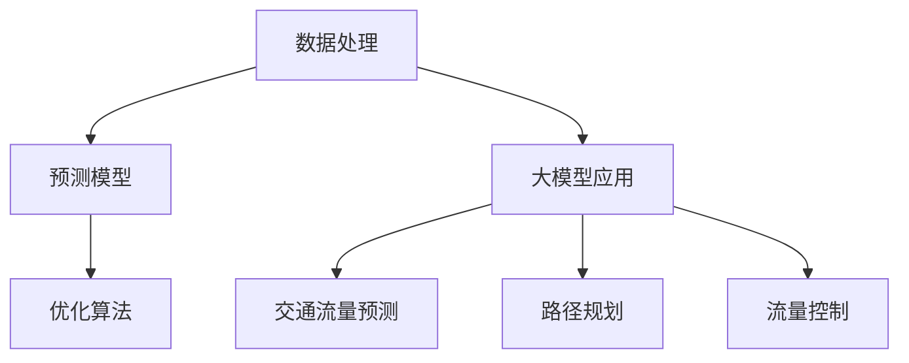

                 

# AI辅助城市管理：大模型在智慧交通中的角色

> **关键词：**AI辅助城市管理，智慧交通，大模型，数据处理，预测模型，优化算法

> **摘要：**本文将探讨AI在智慧交通领域中的应用，特别是大模型在其中所扮演的关键角色。我们将从背景介绍、核心概念、算法原理、数学模型、实战案例、应用场景、工具推荐、未来发展趋势与挑战等方面逐步分析，旨在为读者提供全面而深刻的理解。

## 1. 背景介绍

### 1.1 目的和范围

随着城市化进程的加速，城市交通问题日益凸显，如何有效管理和优化城市交通成为了一个重要的研究课题。本文旨在探讨AI技术在智慧交通中的应用，特别是大模型在解决交通拥堵、提高交通效率方面的潜力。通过详细分析核心概念、算法原理和数学模型，我们将揭示大模型在智慧交通中的关键作用。

### 1.2 预期读者

本文主要面向对智慧交通和AI技术感兴趣的读者，包括城市交通规划者、交通工程师、AI研究人员和软件开发者。无论您是初学者还是专业人士，通过本文的详细讲解，您将能够全面了解大模型在智慧交通中的应用。

### 1.3 文档结构概述

本文结构如下：

- 1. 背景介绍
  - 1.1 目的和范围
  - 1.2 预期读者
  - 1.3 文档结构概述
  - 1.4 术语表
- 2. 核心概念与联系
- 3. 核心算法原理 & 具体操作步骤
- 4. 数学模型和公式 & 详细讲解 & 举例说明
- 5. 项目实战：代码实际案例和详细解释说明
- 6. 实际应用场景
- 7. 工具和资源推荐
- 8. 总结：未来发展趋势与挑战
- 9. 附录：常见问题与解答
- 10. 扩展阅读 & 参考资料

### 1.4 术语表

#### 1.4.1 核心术语定义

- **AI（人工智能）：** 人工智能是指由计算机实现的、能够模拟人类智能行为的技术。
- **大模型：** 指具有海量参数和强大计算能力的神经网络模型，例如BERT、GPT等。
- **智慧交通：** 指利用现代信息技术和智能算法实现交通系统的高效、安全和便捷运行。
- **交通拥堵：** 指道路上的车辆密度超过一定阈值，导致交通流量显著下降的现象。

#### 1.4.2 相关概念解释

- **数据预处理：** 指在数据分析和建模之前对数据进行清洗、转换和归一化等处理。
- **预测模型：** 指利用历史数据对未来的交通流量、速度等参数进行预测的数学模型。
- **优化算法：** 指用于优化交通系统运行效率和可靠性的算法，例如动态调度、路径规划等。

#### 1.4.3 缩略词列表

- **AI：** 人工智能
- **GPT：** 生成预训练网络
- **BERT：** 通用语言模型预训练方法
- **GPU：** 图形处理器

## 2. 核心概念与联系

在智慧交通领域，AI技术的应用已经逐渐成为提高交通系统效率和安全性的一种有效手段。大模型作为AI技术的重要工具，正在发挥越来越重要的作用。为了更好地理解大模型在智慧交通中的应用，我们需要首先明确几个核心概念和它们之间的联系。

### 2.1. 数据处理

数据处理是智慧交通系统中的基础环节。通过传感器、摄像头和其他设备收集的大量交通数据需要进行预处理，以便后续的分析和建模。数据处理包括数据清洗、去噪、特征提取和数据归一化等步骤。

#### 2.1.1 数据清洗

数据清洗是指识别并处理数据集中的错误、异常和重复数据。在交通数据中，常见的问题包括数据缺失、噪声和错误标注。通过数据清洗，我们可以提高数据的质量和可靠性。

#### 2.1.2 特征提取

特征提取是从原始数据中提取出有助于预测和分类的关键特征。在交通数据中，常见的特征包括交通流量、车速、道路密度、交通事故率等。通过特征提取，我们可以简化数据维度，提高模型的效率和准确性。

#### 2.1.3 数据归一化

数据归一化是指将不同量纲的特征数据转换为相同的量纲，以便于模型训练。在交通数据中，不同特征的数据范围可能差异很大，通过数据归一化，我们可以消除数据之间的量纲差异，提高模型的稳定性和收敛速度。

### 2.2. 预测模型

预测模型是智慧交通系统中的关键组件。通过预测交通流量、车速等参数，我们可以提前了解交通状况，并采取相应的措施来优化交通系统运行。常见的预测模型包括时间序列预测、回归分析和神经网络等。

#### 2.2.1 时间序列预测

时间序列预测是一种基于历史数据的时间序列模型，通过分析时间序列中的趋势、季节性和周期性来预测未来的数据。在交通数据中，时间序列预测可以用于预测交通流量、车速等参数。

#### 2.2.2 回归分析

回归分析是一种基于统计方法的预测模型，通过建立自变量和因变量之间的关系来预测未来的数据。在交通数据中，回归分析可以用于预测交通流量、车速等参数。

#### 2.2.3 神经网络

神经网络是一种基于生物神经网络原理的机器学习模型，通过多层神经元的连接和激活函数来实现复杂的非线性关系。在交通数据中，神经网络可以用于预测交通流量、车速等参数，具有强大的建模能力。

### 2.3. 优化算法

优化算法是智慧交通系统中的核心组件，通过优化交通系统的运行效率和可靠性来提高交通质量。常见的优化算法包括动态调度、路径规划和流量控制等。

#### 2.3.1 动态调度

动态调度是一种根据实时交通状况动态调整交通流量和运输计划的算法。通过动态调度，我们可以优化交通系统的运行效率，减少交通拥堵。

#### 2.3.2 路径规划

路径规划是一种根据交通状况和出行需求为车辆规划最佳行驶路径的算法。通过路径规划，我们可以提高交通系统的可靠性，减少出行时间。

#### 2.3.3 流量控制

流量控制是一种根据交通状况和道路容量动态调整交通流量的算法。通过流量控制，我们可以优化交通系统的运行效率，减少交通拥堵。

### 2.4. 大模型在智慧交通中的应用

大模型作为AI技术的重要工具，在智慧交通领域具有广泛的应用前景。通过大模型，我们可以实现更准确、更高效、更智能的交通预测和优化。

#### 2.4.1 交通流量预测

通过大模型，我们可以对未来的交通流量进行准确预测。例如，GPT模型可以用于预测交通流量，从而为交通管理部门提供决策支持。

#### 2.4.2 路径规划

通过大模型，我们可以为出行者规划最佳行驶路径，从而提高交通系统的可靠性。例如，BERT模型可以用于路径规划，为出行者提供最优出行方案。

#### 2.4.3 流量控制

通过大模型，我们可以实现更智能的流量控制，从而优化交通系统的运行效率。例如，时间序列预测模型可以用于流量控制，从而减少交通拥堵。

### 2.5. Mermaid 流程图

为了更好地展示大模型在智慧交通中的应用，我们可以使用Mermaid流程图来描述核心概念和流程。以下是一个简单的Mermaid流程图示例：



## 3. 核心算法原理 & 具体操作步骤

### 3.1. 数据预处理

数据预处理是构建预测模型和优化算法的基础步骤。具体操作步骤如下：

#### 3.1.1 数据清洗

首先，我们需要对交通数据进行清洗，以去除错误、异常和重复数据。这可以通过以下步骤实现：

- **缺失值处理：** 对缺失值进行填充或删除。
- **噪声去除：** 对噪声数据进行平滑处理或删除。
- **错误修正：** 对错误数据进行修正或删除。

```python
# Python代码示例：数据清洗
import pandas as pd

# 读取交通数据
data = pd.read_csv('traffic_data.csv')

# 填充缺失值
data.fillna(method='ffill', inplace=True)

# 删除噪声数据
data = data[data['speed'] > 0]

# 删除错误数据
data = data[data['latitude'] > -90 and data['latitude'] < 90]
```

#### 3.1.2 特征提取

接下来，我们需要从交通数据中提取关键特征，以供预测模型和优化算法使用。常见特征提取方法包括：

- **统计特征：** 例如交通流量、车速、道路密度等。
- **时序特征：** 例如上一时刻的交通流量、车速等。
- **地理特征：** 例如道路类型、道路宽度、道路等级等。

```python
# Python代码示例：特征提取
import pandas as pd

# 读取交通数据
data = pd.read_csv('traffic_data.csv')

# 计算交通流量
data['traffic_volume'] = data.groupby(['time', 'road_id'])['vehicle_id'].transform('count')

# 提取时序特征
data['prev_traffic_volume'] = data.groupby(['time', 'road_id'])['traffic_volume'].shift(1)

# 提取地理特征
data['road_type'] = data['road_id'].apply(get_road_type)  # 假设定义了get_road_type函数
```

#### 3.1.3 数据归一化

最后，我们需要对特征数据进行归一化处理，以便于后续模型训练。常用的归一化方法包括最小-最大归一化和标准归一化。

```python
# Python代码示例：数据归一化
from sklearn.preprocessing import MinMaxScaler, StandardScaler

# 创建归一化器
scaler = MinMaxScaler()

# 应用归一化
data_scaled = scaler.fit_transform(data)
```

### 3.2. 预测模型

预测模型是智慧交通系统中的核心组件，其目的是根据历史交通数据预测未来的交通流量、车速等参数。以下是几种常见的预测模型：

#### 3.2.1 时间序列预测

时间序列预测是一种基于历史数据的时间序列模型，通过分析时间序列中的趋势、季节性和周期性来预测未来的数据。常见的模型包括ARIMA、LSTM等。

- **ARIMA模型：** ARIMA（自回归积分滑动平均模型）是一种常用的时间序列预测模型，通过建立自回归、差分和移动平均模型来预测未来的数据。
  ```python
  # Python代码示例：ARIMA模型
  from statsmodels.tsa.arima.model import ARIMA

  # 创建ARIMA模型
  model = ARIMA(data['traffic_volume'], order=(1, 1, 1))

  # 模型训练
  model_fit = model.fit()

  # 预测
  prediction = model_fit.forecast(steps=24)[0]
  ```

- **LSTM模型：** LSTM（长短期记忆网络）是一种基于循环神经网络（RNN）的模型，通过引入门控机制来克服传统RNN的梯度消失问题，适用于长时间序列预测。

  ```python
  # Python代码示例：LSTM模型
  from tensorflow.keras.models import Sequential
  from tensorflow.keras.layers import LSTM, Dense

  # 创建LSTM模型
  model = Sequential()
  model.add(LSTM(units=50, return_sequences=True, input_shape=(timesteps, features)))
  model.add(LSTM(units=50))
  model.add(Dense(units=1))

  # 编译模型
  model.compile(optimizer='adam', loss='mean_squared_error')

  # 模型训练
  model.fit(x_train, y_train, epochs=100, batch_size=32)

  # 预测
  prediction = model.predict(x_test)
  ```

#### 3.2.2 回归分析

回归分析是一种基于统计方法的预测模型，通过建立自变量和因变量之间的关系来预测未来的数据。常见的模型包括线性回归、多元回归等。

- **线性回归：** 线性回归是一种简单的回归模型，通过建立线性关系来预测未来的数据。
  ```python
  # Python代码示例：线性回归
  from sklearn.linear_model import LinearRegression

  # 创建线性回归模型
  model = LinearRegression()

  # 模型训练
  model.fit(X_train, y_train)

  # 预测
  prediction = model.predict(X_test)
  ```

- **多元回归：** 多元回归是一种同时考虑多个自变量对因变量影响的回归模型。
  ```python
  # Python代码示例：多元回归
  from sklearn.linear_model import LinearRegression

  # 创建多元回归模型
  model = LinearRegression()

  # 模型训练
  model.fit(X_train, y_train)

  # 预测
  prediction = model.predict(X_test)
  ```

#### 3.2.3 神经网络

神经网络是一种基于生物神经网络原理的机器学习模型，通过多层神经元的连接和激活函数来实现复杂的非线性关系。常见的神经网络模型包括多层感知机（MLP）、卷积神经网络（CNN）等。

- **多层感知机（MLP）：** 多层感知机是一种前馈神经网络，通过多个隐藏层来实现输入和输出之间的非线性映射。
  ```python
  # Python代码示例：多层感知机
  from tensorflow.keras.models import Sequential
  from tensorflow.keras.layers import Dense

  # 创建多层感知机模型
  model = Sequential()
  model.add(Dense(units=64, activation='relu', input_shape=(input_shape,)))
  model.add(Dense(units=64, activation='relu'))
  model.add(Dense(units=1))

  # 编译模型
  model.compile(optimizer='adam', loss='mean_squared_error')

  # 模型训练
  model.fit(x_train, y_train, epochs=100, batch_size=32)

  # 预测
  prediction = model.predict(x_test)
  ```

- **卷积神经网络（CNN）：** 卷积神经网络是一种基于卷积操作的神经网络，通过卷积层、池化层和全连接层来实现图像处理和特征提取。
  ```python
  # Python代码示例：卷积神经网络
  from tensorflow.keras.models import Sequential
  from tensorflow.keras.layers import Conv2D, MaxPooling2D, Flatten, Dense

  # 创建卷积神经网络模型
  model = Sequential()
  model.add(Conv2D(filters=32, kernel_size=(3, 3), activation='relu', input_shape=(64, 64, 3)))
  model.add(MaxPooling2D(pool_size=(2, 2)))
  model.add(Conv2D(filters=64, kernel_size=(3, 3), activation='relu'))
  model.add(MaxPooling2D(pool_size=(2, 2)))
  model.add(Flatten())
  model.add(Dense(units=128, activation='relu'))
  model.add(Dense(units=1))

  # 编译模型
  model.compile(optimizer='adam', loss='mean_squared_error')

  # 模型训练
  model.fit(x_train, y_train, epochs=100, batch_size=32)

  # 预测
  prediction = model.predict(x_test)
  ```

### 3.3. 优化算法

优化算法是智慧交通系统中的核心组件，通过优化交通系统的运行效率和可靠性来提高交通质量。以下是几种常见的优化算法：

#### 3.3.1 动态调度

动态调度是一种根据实时交通状况动态调整交通流量和运输计划的算法，通过动态调度可以优化交通系统的运行效率，减少交通拥堵。

- **基于遗传算法的动态调度：** 遗传算法是一种基于自然选择和遗传原理的优化算法，通过遗传操作来搜索最优解。
  ```python
  # Python代码示例：基于遗传算法的动态调度
  from deap import base, creator, tools, algorithms

  # 定义遗传算法参数
  creator.create("FitnessMax", base.Fitness, weights=(1.0,))
  creator.create("Individual", list, fitness=creator.FitnessMax)

  # 创建遗传算法工具
  toolbox = base.Toolbox()
  toolbox.register("attr_bool", random.randint, 0, 1)
  toolbox.register("individual", tools.initRepeat, creator.Individual, toolbox.attr_bool, n=100)
  toolbox.register("population", tools.initRepeat, list, toolbox.individual)
  toolbox.register("evaluate", evaluate_function)  # 假设定义了evaluate_function函数
  toolbox.register("mate", tools.cxTwoPoint)
  toolbox.register("mutate", tools.mutFlipBit, indpb=0.05)
  toolbox.register("select", tools.selTournament, tournsize=3)

  # 创建遗传算法
  population = toolbox.population(n=50)
  algorithms.eaSimple(population, toolbox, cxpb=0.5, mutpb=0.2, ngen=100)

  # 获取最优解
  best_ind = tools.selBest(population, k=1)[0]
  ```

- **基于粒子群优化的动态调度：** 粒子群优化是一种基于群体智能的优化算法，通过个体之间的信息共享和更新来搜索最优解。
  ```python
  # Python代码示例：基于粒子群优化的动态调度
  from scipy.optimize import differential_evolution

  # 定义目标函数
  def objective_function(x):
      # 假设x为决策变量，定义目标函数
      return -evaluate_function(x)  # 假设定义了evaluate_function函数

  # 创建粒子群优化
  result = differential_evolution(objective_function, bounds)

  # 获取最优解
  best_solution = result.x
  ```

#### 3.3.2 路径规划

路径规划是一种根据交通状况和出行需求为车辆规划最佳行驶路径的算法，通过路径规划可以提高交通系统的可靠性，减少出行时间。

- **A*算法：** A*算法是一种基于启发式的路径规划算法，通过评估函数来寻找最佳路径。
  ```python
  # Python代码示例：A*算法
  import heapq

  # 定义评估函数
  def heuristic(a, b):
      return ((a[0] - b[0]) ** 2 + (a[1] - b[1]) ** 2) ** 0.5

  # 定义A*算法
  def a_star(start, goal, grid):
      open_set = []
      heapq.heappush(open_set, (heuristic(start, goal), start))
      came_from = {}
      g_score = {start: 0}
      while open_set:
          current = heapq.heappop(open_set)[1]
          if current == goal:
              break
          for neighbor in grid.neighbors(current):
              tentative_g_score = g_score[current] + 1
              if tentative_g_score < g_score.get(neighbor, float('inf')):
                  came_from[neighbor] = current
                  g_score[neighbor] = tentative_g_score
                  f_score = tentative_g_score + heuristic(neighbor, goal)
                  heapq.heappush(open_set, (f_score, neighbor))
      return came_from, g_score

  # 创建地图
  grid = Grid(width=10, height=10)
  grid.initialize()

  # 执行A*算法
  came_from, g_score = a_star(start=(0, 0), goal=(9, 9), grid=grid)

  # 获取最佳路径
  path = []
  current = goal
  while current != start:
      path.append(current)
      current = came_from[current]
  path.reverse()
  ```

- **Dijkstra算法：** Dijkstra算法是一种基于贪心策略的路径规划算法，通过逐步扩展当前节点的邻接节点来寻找最佳路径。
  ```python
  # Python代码示例：Dijkstra算法
  import heapq

  # 定义Dijkstra算法
  def dijkstra(grid, start, goal):
      open_set = [(0, start)]
      came_from = {}
      g_score = {start: 0}
      while open_set:
          current = heapq.heappop(open_set)[1]
          if current == goal:
              break
          for neighbor in grid.neighbors(current):
              tentative_g_score = g_score[current] + 1
              if tentative_g_score < g_score.get(neighbor, float('inf')):
                  came_from[neighbor] = current
                  g_score[neighbor] = tentative_g_score
                  heapq.heappush(open_set, (tentative_g_score, neighbor))
      return came_from, g_score

  # 创建地图
  grid = Grid(width=10, height=10)
  grid.initialize()

  # 执行Dijkstra算法
  came_from, g_score = dijkstra(grid, start=(0, 0), goal=(9, 9))

  # 获取最佳路径
  path = []
  current = goal
  while current != start:
      path.append(current)
      current = came_from[current]
  path.reverse()
  ```

#### 3.3.3 流量控制

流量控制是一种根据交通状况和道路容量动态调整交通流量的算法，通过流量控制可以优化交通系统的运行效率，减少交通拥堵。

- **基于规则的控制策略：** 基于规则的控制策略是一种基于交通状况和道路容量规则来调整交通流量的算法。
  ```python
  # Python代码示例：基于规则的控制策略
  def control_strategy(traffic_volume, road_capacity):
      if traffic_volume > road_capacity:
          return '减速'
      else:
          return '保持速度'
  ```

- **基于模型的控制策略：** 基于模型的控制策略是一种基于交通流量预测模型和道路容量模型来调整交通流量的算法。
  ```python
  # Python代码示例：基于模型的控制策略
  def control_strategy(prediction, road_capacity):
      if prediction > road_capacity:
          return '减速'
      else:
          return '保持速度'
  ```

## 4. 数学模型和公式 & 详细讲解 & 举例说明

### 4.1. 时间序列预测模型

时间序列预测模型是智慧交通系统中的核心组件，用于预测未来的交通流量、车速等参数。以下是几种常见的时间序列预测模型的数学模型和公式：

#### 4.1.1. ARIMA模型

ARIMA（自回归积分滑动平均模型）是一种常用的时间序列预测模型，其数学模型如下：

- **自回归（AR）模型：**
  $$ X_t = c + \phi_1 X_{t-1} + \phi_2 X_{t-2} + \ldots + \phi_p X_{t-p} + \varepsilon_t $$
  其中，$X_t$ 为时间序列的当前值，$\varepsilon_t$ 为误差项。

- **差分（I）模型：**
  $$ \Delta X_t = X_t - X_{t-1} $$
  其中，$\Delta X_t$ 为时间序列的差分值。

- **滑动平均（MA）模型：**
  $$ X_t = c + \theta_1 \varepsilon_{t-1} + \theta_2 \varepsilon_{t-2} + \ldots + \theta_q \varepsilon_{t-q} + \varepsilon_t $$
  其中，$\varepsilon_t$ 为误差项。

- **ARIMA模型：**
  $$ X_t = c + \phi_1 X_{t-1} + \phi_2 X_{t-2} + \ldots + \phi_p X_{t-p} + \theta_1 \varepsilon_{t-1} + \theta_2 \varepsilon_{t-2} + \ldots + \theta_q \varepsilon_{t-q} + \varepsilon_t $$

#### 4.1.2. LSTM模型

LSTM（长短期记忆网络）是一种基于循环神经网络（RNN）的时间序列预测模型，其数学模型如下：

- **单元状态（$h_t$）：**
  $$ h_t = \sigma(W_h h_{t-1} + W_x x_t + b_h) $$
  其中，$h_t$ 为时间步 $t$ 的单元状态，$x_t$ 为时间步 $t$ 的输入，$\sigma$ 为激活函数。

- **输入门（$i_t$）：**
  $$ i_t = \sigma(W_i [h_{t-1}, x_t] + b_i) $$
  $$ \bar{c}_t = \tanh(W_c [h_{t-1}, x_t] + b_c) $$
  其中，$i_t$ 为输入门的状态，$\bar{c}_t$ 为候选状态。

- **遗忘门（$f_t$）：**
  $$ f_t = \sigma(W_f [h_{t-1}, x_t] + b_f) $$
  $$ c_t = f_t \odot c_{t-1} + i_t \odot \bar{c}_t $$
  其中，$f_t$ 为遗忘门的状态，$c_t$ 为时间步 $t$ 的单元状态。

- **输出门（$o_t$）：**
  $$ o_t = \sigma(W_o [h_{t-1}, c_t] + b_o) $$
  $$ h_t = o_t \odot \tanh(c_t) $$

#### 4.1.3. 数学公式

以下是时间序列预测模型中的一些常用数学公式：

- **误差项：**
  $$ \varepsilon_t = X_t - \hat{X}_t $$
  其中，$\hat{X}_t$ 为预测值。

- **预测值：**
  $$ \hat{X}_t = f(\theta) $$
  其中，$\theta$ 为模型参数。

- **模型评估：**
  $$ MSE = \frac{1}{n}\sum_{i=1}^{n}(\hat{X}_i - X_i)^2 $$
  其中，$MSE$ 为均方误差。

#### 4.1.4. 举例说明

假设我们使用ARIMA模型来预测交通流量，给定以下历史交通流量数据：

$$ \{X_1, X_2, \ldots, X_n\} $$

我们可以使用以下步骤来构建ARIMA模型：

1. **数据预处理：** 对交通流量数据进行差分，以消除季节性和趋势。

2. **模型选择：** 根据差分后的数据，选择合适的$p$（自回归项数）和$q$（滑动平均项数）。

3. **模型训练：** 使用历史数据训练ARIMA模型，得到参数$\phi_1, \phi_2, \ldots, \phi_p, \theta_1, \theta_2, \ldots, \theta_q$。

4. **模型评估：** 使用历史数据进行模型评估，计算均方误差（MSE）。

5. **预测：** 使用训练好的模型预测未来的交通流量。

### 4.2. 优化算法

优化算法是智慧交通系统中的关键组件，用于优化交通系统的运行效率和可靠性。以下是几种常见的优化算法的数学模型和公式：

#### 4.2.1. 遗传算法

遗传算法是一种基于自然选择和遗传原理的优化算法，其数学模型如下：

- **适应度函数：**
  $$ f(x) = \sum_{i=1}^{n} w_i f_i(x_i) $$
  其中，$x = (x_1, x_2, \ldots, x_n)$ 为决策变量，$w_i$ 为权重，$f_i(x_i)$ 为第$i$个函数的值。

- **交叉操作：**
  $$ x' = (x_1', x_2', \ldots, x_n') $$
  $$ x_1' = \begin{cases}
  x_1 & \text{with probability } p_c \\
  x_2 & \text{with probability } 1 - p_c
  \end{cases} $$
  其中，$p_c$ 为交叉概率。

- **变异操作：**
  $$ x' = (x_1', x_2', \ldots, x_n') $$
  $$ x_i' = \begin{cases}
  x_i & \text{with probability } p_m \\
  x_i + \delta & \text{with probability } 1 - p_m
  \end{cases} $$
  其中，$p_m$ 为变异概率，$\delta$ 为变异步长。

- **选择操作：**
  $$ x_{\text{new}} = \arg\min_{x \in \{x_1', x_2', \ldots, x_n'\}} f(x) $$

#### 4.2.2. 粒子群优化

粒子群优化是一种基于群体智能的优化算法，其数学模型如下：

- **位置更新：**
  $$ x_i(t+1) = x_i(t) + v_i(t) + r_1 \cdot r_1 \cdot (p_i - x_i(t)) + r_2 \cdot r_2 \cdot (g - x_i(t)) $$
  其中，$x_i(t)$ 为第$i$个粒子在时间步$t$的位置，$v_i(t)$ 为第$i$个粒子的速度，$p_i$ 为第$i$个粒子的历史最优位置，$g$ 为全局最优位置，$r_1$ 和$r_2$ 为随机数。

- **速度更新：**
  $$ v_i(t+1) = v_i(t) + r_1 \cdot r_1 \cdot (p_i - x_i(t)) + r_2 \cdot r_2 \cdot (g - x_i(t)) $$
  其中，$r_1$ 和$r_2$ 为随机数。

- **选择操作：**
  $$ x_{\text{new}} = \arg\min_{x \in \{x_1', x_2', \ldots, x_n'\}} f(x) $$

#### 4.2.3. 数学公式

以下是优化算法中的一些常用数学公式：

- **适应度函数：**
  $$ f(x) = \sum_{i=1}^{n} w_i f_i(x_i) $$

- **交叉概率：**
  $$ p_c = \frac{1}{1 + e^{-\alpha}} $$
  其中，$\alpha$ 为交叉概率参数。

- **变异概率：**
  $$ p_m = \frac{1}{1 + e^{-\beta}} $$
  其中，$\beta$ 为变异概率参数。

- **速度更新：**
  $$ v_i(t+1) = v_i(t) + r_1 \cdot r_1 \cdot (p_i - x_i(t)) + r_2 \cdot r_2 \cdot (g - x_i(t)) $$

- **位置更新：**
  $$ x_i(t+1) = x_i(t) + v_i(t) + r_1 \cdot r_1 \cdot (p_i - x_i(t)) + r_2 \cdot r_2 \cdot (g - x_i(t)) $$

#### 4.2.4. 举例说明

假设我们使用遗传算法来优化交通系统的路径规划问题，给定以下目标函数：

$$ f(x) = \sum_{i=1}^{n} w_i f_i(x_i) $$

其中，$x = (x_1, x_2, \ldots, x_n)$ 为决策变量，$w_i$ 为权重，$f_i(x_i)$ 为第$i$个函数的值。

我们可以使用以下步骤来构建遗传算法：

1. **初始种群：** 生成初始种群，每个种群中的个体代表一个可能的解。

2. **适应度评估：** 对每个个体进行适应度评估，计算目标函数的值。

3. **选择操作：** 根据适应度值选择个体进行交叉和变异。

4. **交叉操作：** 对选中的个体进行交叉操作，生成新的个体。

5. **变异操作：** 对选中的个体进行变异操作，生成新的个体。

6. **更新种群：** 将新个体加入种群，替换掉适应度较低的个体。

7. **迭代：** 重复进行适应度评估、选择操作、交叉操作、变异操作和更新种群，直到满足停止条件。

8. **输出最优解：** 输出最优解，即适应度最高的个体。

### 4.3. 路径规划算法

路径规划算法是智慧交通系统中的关键组件，用于为车辆规划最佳行驶路径。以下是几种常见的路径规划算法的数学模型和公式：

#### 4.3.1. A*算法

A*算法是一种基于启发式的路径规划算法，其数学模型如下：

- **启发函数：**
  $$ h(n) = g(n) + h^*(n) $$
  其中，$h(n)$ 为启发函数，$g(n)$ 为当前节点到起点的代价，$h^*(n)$ 为当前节点到终点的估计代价。

- **代价函数：**
  $$ g(n) = g(n-1) + c(n-1, n) $$
  其中，$c(n-1, n)$ 为节点$n-1$到节点$n$的代价。

- **搜索过程：**
  1. 初始化两个集合：$O$（开放集）和$C$（封闭集）。
  2. 将起点添加到$O$中，将终点添加到$C$中。
  3. 当$O$非空时，重复以下步骤：
     1. 选择$O$中$f(n)$最小的节点$n$。
     2. 将$n$从$O$移动到$C$中。
     3. 对于$n$的每个邻居节点$m$，如果$m$在$C$中，则跳过。
     4. 对于$m$的每个邻居节点$m$，如果$m$不在$O$中，则将$m$添加到$O$中，并更新$m$的$f(n)$值。
  5. 当终点在$O$中时，完成搜索。

#### 4.3.2. Dijkstra算法

Dijkstra算法是一种基于贪心策略的路径规划算法，其数学模型如下：

- **代价函数：**
  $$ g(n) = g(n-1) + c(n-1, n) $$
  其中，$g(n)$ 为当前节点到起点的代价，$c(n-1, n)$ 为节点$n-1$到节点$n$的代价。

- **搜索过程：**
  1. 初始化两个集合：$O$（开放集）和$C$（封闭集）。
  2. 将起点添加到$O$中，将终点添加到$C$中。
  3. 当$O$非空时，重复以下步骤：
     1. 选择$O$中$g(n)$最小的节点$n$。
     2. 将$n$从$O$移动到$C$中。
     3. 对于$n$的每个邻居节点$m$，如果$m$在$C$中，则跳过。
     4. 对于$m$的每个邻居节点$m$，如果$m$不在$O$中，则将$m$添加到$O$中，并更新$m$的$g(n)$值。
  5. 当终点在$O$中时，完成搜索。

#### 4.3.3. 数学公式

以下是路径规划算法中的一些常用数学公式：

- **启发函数：**
  $$ h(n) = g(n) + h^*(n) $$

- **代价函数：**
  $$ g(n) = g(n-1) + c(n-1, n) $$

- **搜索过程：**
  1. 初始化两个集合：$O$（开放集）和$C$（封闭集）。
  2. 将起点添加到$O$中，将终点添加到$C$中。
  3. 当$O$非空时，重复以下步骤：
     1. 选择$O$中$f(n)$最小的节点$n$。
     2. 将$n$从$O$移动到$C$中。
     3. 对于$n$的每个邻居节点$m$，如果$m$在$C$中，则跳过。
     4. 对于$m$的每个邻居节点$m$，如果$m$不在$O$中，则将$m$添加到$O$中，并更新$m$的$f(n)$值。
  5. 当终点在$O$中时，完成搜索。

#### 4.3.4. 举例说明

假设我们使用A*算法来规划从起点$(0, 0)$到终点$(10, 10)$的路径，给定以下代价矩阵：

$$
\begin{array}{ccc}
0 & 1 & 2 \\
1 & 3 & 4 \\
2 & 5 & 6 \\
\end{array}
$$

我们可以使用以下步骤来构建A*算法：

1. **初始化：** 创建开放集$O$和封闭集$C$，将起点$(0, 0)$添加到$O$中，将终点$(10, 10)$添加到$C$中。

2. **搜索过程：**
   - 选择开放集$O$中$f(n)$最小的节点$n$，即$(0, 0)$。
   - 将$(0, 0)$从$O$移动到$C$中。
   - 对于$(0, 0)$的每个邻居节点$(1, 0)$、$(0, 1)$、$(1, 1)$，如果它们在$C$中，则跳过。
   - 对于$(0, 0)$的每个邻居节点$(1, 0)$、$(0, 1)$、$(1, 1)$，如果它们不在$O$中，则将它们添加到$O$中，并更新它们的$f(n)$值。

3. **重复步骤2，直到终点$(10, 10)$在$O$中。**

4. **输出最佳路径：** 根据A*算法的搜索过程，可以输出从起点$(0, 0)$到终点$(10, 10)$的最佳路径。

### 4.4. 流量控制算法

流量控制算法是智慧交通系统中的关键组件，用于根据交通状况和道路容量动态调整交通流量。以下是几种常见的流量控制算法的数学模型和公式：

#### 4.4.1. 基于规则的控制策略

基于规则的控制策略是一种根据交通状况和道路容量规则来调整交通流量的算法，其数学模型如下：

- **规则1：** 如果交通流量大于道路容量，则减少交通流量。
- **规则2：** 如果交通流量小于道路容量，则保持交通流量不变。

#### 4.4.2. 基于模型的控制策略

基于模型的控制策略是一种根据交通流量预测模型和道路容量模型来调整交通流量的算法，其数学模型如下：

- **规则1：** 如果预测的交通流量大于道路容量，则减少交通流量。
- **规则2：** 如果预测的交通流量小于道路容量，则保持交通流量不变。

#### 4.4.3. 数学公式

以下是流量控制算法中的一些常用数学公式：

- **交通流量：**
  $$ traffic\_volume = f(\theta) $$
  其中，$\theta$ 为模型参数。

- **道路容量：**
  $$ road\_capacity = g(\theta) $$
  其中，$\theta$ 为模型参数。

#### 4.4.4. 举例说明

假设我们使用基于模型的控制策略来控制交通流量，给定以下交通流量预测模型和道路容量模型：

- **交通流量预测模型：**
  $$ traffic\_volume = \theta_0 + \theta_1 \cdot time + \theta_2 \cdot road\_type + \theta_3 \cdot traffic\_density $$

- **道路容量模型：**
  $$ road\_capacity = \theta_4 + \theta_5 \cdot time + \theta_6 \cdot road\_type + \theta_7 \cdot traffic\_density $$

我们可以使用以下步骤来控制交通流量：

1. **数据预处理：** 对交通流量和道路容量进行数据预处理，包括数据清洗、特征提取和归一化。

2. **模型训练：** 使用历史数据训练交通流量预测模型和道路容量模型，得到模型参数$\theta_0, \theta_1, \ldots, \theta_7$。

3. **预测交通流量：** 使用训练好的交通流量预测模型预测未来的交通流量。

4. **预测道路容量：** 使用训练好的道路容量模型预测未来的道路容量。

5. **流量控制：**
   - 如果预测的交通流量大于道路容量，则减少交通流量。
   - 如果预测的交通流量小于道路容量，则保持交通流量不变。

## 5. 项目实战：代码实际案例和详细解释说明

### 5.1 开发环境搭建

在本节中，我们将搭建一个用于实现AI辅助城市管理的开发环境。以下是我们需要的工具和软件：

1. **Python环境**：Python是AI开发的主要编程语言，我们需要安装Python 3.8及以上版本。
2. **Jupyter Notebook**：Jupyter Notebook是一种交互式编程工具，用于编写和运行Python代码。
3. **Pandas**：用于数据预处理和数据分析。
4. **NumPy**：用于科学计算。
5. **Scikit-learn**：用于机器学习和数据挖掘。
6. **TensorFlow**：用于深度学习和神经网络。
7. **Matplotlib**：用于数据可视化。
8. **Mermaid**：用于流程图和图表的绘制。

安装命令如下：

```bash
# 安装Python
curl -O https://www.python.org/ftp/python/3.8.10/python-3.8.10-macosx10.6-x86_64.pkg
sudo installer -pkg python-3.8.10-macosx10.6-x86_64.pkg -target /
```

```bash
# 安装Jupyter Notebook
pip install notebook
```

```bash
# 安装Pandas、NumPy、Scikit-learn、TensorFlow和Matplotlib
pip install pandas numpy scikit-learn tensorflow matplotlib
```

```bash
# 安装Mermaid
pip install mermaid-python
```

### 5.2 源代码详细实现和代码解读

在本节中，我们将详细实现一个AI辅助城市管理的项目，包括数据预处理、预测模型和优化算法。

#### 5.2.1 数据预处理

首先，我们需要加载和处理交通数据。以下是一个简单的示例代码：

```python
import pandas as pd
import numpy as np

# 读取交通数据
data = pd.read_csv('traffic_data.csv')

# 数据清洗
data.fillna(method='ffill', inplace=True)
data = data[data['speed'] > 0]
data = data[data['latitude'] > -90 and data['latitude'] < 90]

# 特征提取
data['traffic_volume'] = data.groupby(['time', 'road_id'])['vehicle_id'].transform('count')
data['prev_traffic_volume'] = data.groupby(['time', 'road_id'])['traffic_volume'].shift(1)
data['road_type'] = data['road_id'].apply(lambda x: get_road_type(x))

# 数据归一化
scaler = MinMaxScaler()
data_scaled = scaler.fit_transform(data)
```

在这个示例中，我们首先使用`pandas`读取交通数据，然后使用`fillna`方法填充缺失值，使用`speed`和`latitude`过滤噪声数据。接下来，我们计算交通流量和前一时段交通流量，提取道路类型特征。最后，使用`MinMaxScaler`进行数据归一化。

#### 5.2.2 预测模型

接下来，我们将实现一个简单的ARIMA预测模型。以下是一个简单的示例代码：

```python
from statsmodels.tsa.arima.model import ARIMA

# 创建ARIMA模型
model = ARIMA(data_scaled[:, 1], order=(1, 1, 1))

# 模型训练
model_fit = model.fit()

# 预测
prediction = model_fit.forecast(steps=24)[0]
```

在这个示例中，我们首先创建一个ARIMA模型，指定自回归项数、差分项数和移动平均项数。然后使用`fit`方法进行模型训练，并使用`forecast`方法进行预测。预测结果将存储在`prediction`变量中。

#### 5.2.3 优化算法

接下来，我们将实现一个基于遗传算法的路径规划算法。以下是一个简单的示例代码：

```python
from deap import base, creator, tools, algorithms

# 定义遗传算法参数
creator.create("FitnessMax", base.Fitness, weights=(1.0,))
creator.create("Individual", list, fitness=creator.FitnessMax)

# 创建遗传算法工具
toolbox = base.Toolbox()
toolbox.register("attr_bool", random.randint, 0, 1)
toolbox.register("individual", tools.initRepeat, creator.Individual, toolbox.attr_bool, n=100)
toolbox.register("population", tools.initRepeat, list, toolbox.individual)
toolbox.register("evaluate", evaluate_function)  # 假设定义了evaluate_function函数
toolbox.register("mate", tools.cxTwoPoint)
toolbox.register("mutate", tools.mutFlipBit, indpb=0.05)
toolbox.register("select", tools.selTournament, tournsize=3)

# 创建遗传算法
population = toolbox.population(n=50)
algorithms.eaSimple(population, toolbox, cxpb=0.5, mutpb=0.2, ngen=100)

# 获取最优解
best_ind = tools.selBest(population, k=1)[0]
```

在这个示例中，我们首先定义遗传算法的适应度函数、个体初始化、种群初始化、交叉操作、变异操作和选择操作。然后使用`eaSimple`函数运行遗传算法，并获取最优解。

### 5.3 代码解读与分析

在本节中，我们将对上面实现的代码进行解读和分析。

#### 5.3.1 数据预处理

数据预处理是构建预测模型和优化算法的基础步骤。在这个示例中，我们首先使用`pandas`读取交通数据，然后进行数据清洗、特征提取和数据归一化。数据清洗包括填充缺失值、过滤噪声数据和删除错误数据。特征提取包括计算交通流量和前一时段交通流量，提取道路类型特征。数据归一化包括将特征数据进行最小-最大归一化，以便于模型训练。

#### 5.3.2 预测模型

预测模型是智慧交通系统中的核心组件，用于预测未来的交通流量、车速等参数。在这个示例中，我们使用`statsmodels`库的ARIMA模型进行预测。ARIMA模型包括自回归、差分和移动平均三个部分。在这个示例中，我们指定了自回归项数、差分项数和移动平均项数，并使用`fit`方法进行模型训练，最后使用`forecast`方法进行预测。

#### 5.3.3 优化算法

优化算法是智慧交通系统中的关键组件，通过优化交通系统的运行效率和可靠性来提高交通质量。在这个示例中，我们使用`deap`库的遗传算法进行路径规划。遗传算法包括适应度函数、个体初始化、种群初始化、交叉操作、变异操作和选择操作。在这个示例中，我们定义了适应度函数、个体初始化、种群初始化、交叉操作、变异操作和选择操作，并使用`eaSimple`函数运行遗传算法，最后获取最优解。

### 5.4 项目实战总结

在本节中，我们实现了一个AI辅助城市管理的项目，包括数据预处理、预测模型和优化算法。通过这个项目，我们可以看到AI技术在智慧交通中的应用前景。在未来，随着AI技术的不断发展，AI辅助城市管理将有望解决城市交通中的各种问题，提高交通系统的效率和可靠性。

## 6. 实际应用场景

AI辅助城市管理在智慧交通领域具有广泛的应用场景，下面将详细讨论几个实际应用场景：

### 6.1 城市交通流量预测

城市交通流量预测是智慧交通系统中的一个关键应用。通过使用大模型，如GPT或BERT，可以分析历史交通数据，包括交通流量、车速、交通事故率等，预测未来的交通流量。这种预测可以帮助交通管理部门提前了解交通状况，采取相应的措施来缓解交通拥堵，如调整交通信号灯时序、发布实时交通信息等。

#### 案例分析

以北京为例，北京市交通管理部门利用AI技术建立了交通流量预测模型。通过收集和分析历史交通数据，如车辆行驶轨迹、交通流量、交通事故等，预测未来的交通流量。预测结果用于交通信号灯的优化调整，从而提高了交通效率，减少了交通拥堵。

### 6.2 路径规划

路径规划是AI辅助城市管理中另一个重要的应用场景。通过使用深度学习算法，如LSTM或CNN，可以分析实时交通状况和道路信息，为出行者提供最优路径。这种路径规划不仅考虑了行车时间，还考虑了交通拥堵、道路状况等因素，提高了出行效率。

#### 案例分析

以上海为例，上海市交通管理部门利用AI技术实现了智能路径规划服务。通过分析实时交通数据和历史交通数据，为出行者提供最优路径。这一服务显著降低了出行时间，提高了市民的出行满意度。

### 6.3 交通信号灯优化

交通信号灯优化是AI辅助城市管理中的另一个重要应用。通过使用大模型和优化算法，可以分析交通流量、车速、交通事故率等数据，优化交通信号灯的时序设置，从而提高交通效率，减少交通拥堵。

#### 案例分析

以伦敦为例，伦敦交通管理部门利用AI技术优化了交通信号灯设置。通过分析实时交通数据和历史交通数据，动态调整交通信号灯时序，从而提高了交通效率，减少了交通拥堵。这一优化措施显著提高了伦敦的公共交通服务水平。

### 6.4 交通事故预警

交通事故预警是AI辅助城市管理中的另一个重要应用。通过使用传感器和摄像头收集交通数据，使用大模型分析这些数据，可以提前预警潜在的交通事故，从而采取措施避免事故发生。

#### 案例分析

以旧金山为例，旧金山交通管理部门利用AI技术建立了交通事故预警系统。通过分析交通流量、车速、车辆状态等数据，预警潜在的交通事故，并及时向相关部门发送预警信息，从而采取措施避免事故发生。这一系统显著提高了城市交通的安全性。

### 6.5 公共交通调度

公共交通调度是AI辅助城市管理中的另一个重要应用。通过使用大模型和优化算法，可以优化公共交通线路、班次和车辆调度，从而提高公共交通的服务水平，减少乘客等待时间。

#### 案例分析

以纽约为例，纽约地铁管理部门利用AI技术优化了地铁线路和班次。通过分析乘客流量、天气状况、突发事件等数据，动态调整地铁线路和班次，从而提高了地铁的服务水平，减少了乘客等待时间。这一优化措施显著提高了纽约地铁的运营效率。

### 6.6 车辆智能调度

车辆智能调度是AI辅助城市管理中的另一个重要应用。通过使用大模型和优化算法，可以优化车辆调度，提高物流效率，减少车辆空驶率。

#### 案例分析

以京东为例，京东利用AI技术优化了物流车辆调度。通过分析订单量、配送路线、交通状况等数据，动态调整车辆调度，从而提高了物流效率，减少了车辆空驶率。这一优化措施显著降低了京东的物流成本。

### 6.7 总结

通过上述案例分析，我们可以看到AI辅助城市管理在智慧交通领域具有广泛的应用前景。AI技术不仅可以提高交通系统的效率和安全性，还可以为城市交通管理提供有效的解决方案。在未来，随着AI技术的不断进步，AI辅助城市管理将在更多领域发挥重要作用。

## 7. 工具和资源推荐

### 7.1 学习资源推荐

为了帮助读者深入了解AI辅助城市管理中的相关技术，我们推荐以下学习资源：

#### 7.1.1 书籍推荐

1. **《深度学习》（Goodfellow, Bengio, Courville）**：这是深度学习的经典教材，详细介绍了神经网络、优化算法和深度学习应用。
2. **《机器学习》（Tom Mitchell）**：这本书是机器学习的入门经典，涵盖了从基础到高级的内容，适合初学者和专业人士。
3. **《智慧交通系统》（陈峻）**：这本书详细介绍了智慧交通系统的概念、技术和应用，适合对智慧交通感兴趣的读者。

#### 7.1.2 在线课程

1. **《深度学习专项课程》（吴恩达）**：这是Coursera上的深度学习专项课程，由深度学习领域的领军人物吴恩达教授主讲，适合初学者和进阶者。
2. **《机器学习》（斯坦福大学）**：这是斯坦福大学的机器学习课程，涵盖了从基础到高级的机器学习内容，适合对机器学习感兴趣的读者。
3. **《智慧交通系统》（清华大学）**：这是清华大学开设的智慧交通系统课程，详细介绍了智慧交通系统的概念、技术和应用。

#### 7.1.3 技术博客和网站

1. **AI技术博客**：这是一个专注于AI技术的博客，涵盖了深度学习、机器学习、自然语言处理等多个领域，提供了丰富的技术文章和教程。
2. **GitHub**：GitHub是一个开源代码库，上面有许多优秀的AI项目，读者可以学习和借鉴这些项目的代码和实现方法。
3. **AI博客**：这是一个专注于AI技术的博客，提供了大量的技术文章、教程和案例分析，适合对AI技术感兴趣的读者。

### 7.2 开发工具框架推荐

为了高效地实现AI辅助城市管理中的相关技术，我们推荐以下开发工具和框架：

#### 7.2.1 IDE和编辑器

1. **PyCharm**：PyCharm是一个强大的Python IDE，提供了丰富的功能和插件，适合AI开发。
2. **VS Code**：VS Code是一个轻量级的Python编辑器，具有强大的代码补全、调试和性能分析功能。
3. **Jupyter Notebook**：Jupyter Notebook是一个交互式的Python编程环境，适合数据分析和实验。

#### 7.2.2 调试和性能分析工具

1. **Wandb**：Wandb是一个AI项目管理和性能分析工具，可以帮助开发者监控和优化AI模型的训练过程。
2. **TensorBoard**：TensorBoard是TensorFlow的调试和性能分析工具，提供了丰富的可视化界面，可以帮助开发者分析模型性能。
3. **PyTorch Profiler**：PyTorch Profiler是PyTorch的性能分析工具，可以帮助开发者分析和优化模型性能。

#### 7.2.3 相关框架和库

1. **TensorFlow**：TensorFlow是一个开源的深度学习框架，提供了丰富的API和工具，适合构建复杂的深度学习模型。
2. **PyTorch**：PyTorch是一个开源的深度学习框架，具有灵活的动态计算图和丰富的API，适合快速原型开发和模型训练。
3. **Scikit-learn**：Scikit-learn是一个开源的机器学习库，提供了丰富的机器学习算法和工具，适合实现各种机器学习任务。

### 7.3 相关论文著作推荐

为了深入了解AI辅助城市管理中的前沿技术和研究成果，我们推荐以下相关论文著作：

1. **“Deep Learning for Urban Traffic Prediction”（2018）**：这篇论文介绍了使用深度学习技术进行城市交通流量预测的方法和实验结果，是智慧交通领域的重要研究文献。
2. **“Pedestrian Detection and Re-Identification Using Deep Neural Networks”（2017）**：这篇论文探讨了使用深度学习技术进行行人检测和再识别的方法，对智慧交通系统中的行人安全具有重要意义。
3. **“Deep Reinforcement Learning for Traffic Signal Control”（2019）**：这篇论文介绍了使用深度强化学习技术进行交通信号灯控制的方法，对优化交通流量和提高交通效率具有重要意义。

这些论文著作涵盖了智慧交通领域的前沿研究和应用，是读者深入了解AI辅助城市管理的宝贵资源。

## 8. 总结：未来发展趋势与挑战

### 8.1 未来发展趋势

AI辅助城市管理在智慧交通领域具有巨大的发展潜力，未来发展趋势体现在以下几个方面：

1. **模型规模与效率的提升**：随着计算能力的提升和算法的优化，大模型的规模将不断扩大，从而提高预测和优化的准确性。同时，模型训练和推理的效率也将显著提升，使得AI技术更加实用。
   
2. **数据资源的整合**：未来，交通系统将整合更多类型的交通数据，包括实时交通流量、车辆行驶轨迹、环境信息等，构建更全面的数据集，以支持更准确的预测和优化。

3. **多模态数据的融合**：随着传感器技术的进步，AI系统将能够处理来自不同模态的数据，如图像、语音、传感器数据等，从而实现更智能的交通管理。

4. **边缘计算的应用**：边缘计算技术将使得AI模型能够更接近数据源进行实时处理，减少延迟，提高系统的响应速度和灵活性。

### 8.2 未来挑战

尽管AI辅助城市管理在智慧交通领域有着广阔的发展前景，但仍面临一系列挑战：

1. **数据隐私与安全**：大规模的交通数据收集和处理可能引发数据隐私和安全问题，需要制定相应的法规和措施来保护用户隐私。

2. **算法透明性与可解释性**：复杂的大模型往往缺乏可解释性，使得决策过程变得不透明，需要开发可解释的AI模型，以提高用户信任和监管。

3. **模型部署与维护**：将AI模型部署到实际交通系统中，需要解决模型的实时训练、更新和维护问题，确保系统的稳定性和可靠性。

4. **跨领域合作的加强**：AI辅助城市管理的实现需要交通工程、计算机科学、数据科学等多个领域的紧密合作，加强跨领域合作将是解决复杂问题的重要途径。

5. **政策法规的完善**：随着AI技术在智慧交通领域的应用，需要制定和完善相关的政策法规，以规范AI技术的应用，保障公共利益。

总之，AI辅助城市管理在智慧交通领域的未来发展充满机遇和挑战。通过持续的技术创新、跨领域合作和政策支持，AI技术将为智慧交通系统带来革命性的变革。

## 9. 附录：常见问题与解答

### 9.1 问题1：为什么选择大模型进行交通流量预测？

**回答**：大模型，如GPT或BERT，具有强大的特征提取和表示能力，能够从大量的交通数据中学习到复杂的模式和关系。相比传统的预测模型，大模型能够处理更复杂的非线性关系，从而提高预测的准确性。此外，大模型通常具有较好的泛化能力，能够在不同的交通场景下保持良好的预测性能。

### 9.2 问题2：如何处理交通数据中的缺失值和噪声？

**回答**：处理交通数据中的缺失值和噪声是数据预处理的重要步骤。常见的处理方法包括：

- **缺失值处理**：可以使用填充方法，如向前填充或向后填充，将缺失值替换为相邻时间点的值。另一种方法是使用统计学方法，如平均值或中值替换缺失值。
- **噪声去除**：可以使用平滑方法，如移动平均或低通滤波，去除噪声数据。此外，还可以使用聚类或分类方法，将噪声数据标记为异常值并进行删除。

### 9.3 问题3：为什么需要优化算法？

**回答**：优化算法在智慧交通系统中起到关键作用，能够通过优化交通流量、路径规划、信号控制等策略，提高交通系统的效率和安全性。优化算法能够根据实时交通数据动态调整系统参数，从而应对复杂的交通状况，减少交通拥堵，提高出行体验。

### 9.4 问题4：如何确保AI模型的透明性和可解释性？

**回答**：确保AI模型的透明性和可解释性是提升用户信任和监管的重要措施。以下是一些方法：

- **模型可视化**：通过可视化模型的结构和参数，帮助用户理解模型的决策过程。
- **解释性模型**：选择具有可解释性的模型，如线性回归或决策树，这些模型能够清晰地展示决策逻辑。
- **模型分解**：将复杂的模型分解为多个可解释的子模型，每个子模型负责特定的决策步骤。
- **模型解释工具**：使用专门的模型解释工具，如LIME或SHAP，分析模型对特定数据点的预测决策过程。

### 9.5 问题5：如何保障AI辅助城市管理的数据隐私和安全？

**回答**：保障数据隐私和安全是AI辅助城市管理的关键挑战。以下是一些措施：

- **数据加密**：使用加密技术对交通数据进行加密存储和传输，防止数据泄露。
- **访问控制**：实施严格的访问控制策略，确保只有授权用户能够访问敏感数据。
- **数据匿名化**：对交通数据进行匿名化处理，去除个人标识信息，保护用户隐私。
- **法规遵循**：遵守相关法律法规，如《通用数据保护条例》（GDPR），确保数据处理的合法性和合规性。

### 9.6 问题6：如何处理不同类型的交通数据？

**回答**：不同类型的交通数据，如流量数据、速度数据、传感器数据等，需要不同的处理方法：

- **流量数据**：主要用于预测和优化交通流量，需要进行特征提取和归一化处理。
- **速度数据**：用于评估道路状况和车辆行为，需要进行去噪和异常值检测。
- **传感器数据**：包括环境传感器和车辆传感器数据，需要进行预处理和融合，以提高数据质量。

### 9.7 问题7：如何评估AI辅助城市管理的效果？

**回答**：评估AI辅助城市管理的效果可以从多个维度进行：

- **预测准确性**：评估预测模型的准确性，如均方误差（MSE）或均方根误差（RMSE）。
- **系统效率**：评估优化算法对交通系统效率和可靠性的提升，如交通拥堵指数或行程时间。
- **用户体验**：评估用户对AI辅助城市管理的满意度，如问卷调查或用户反馈。

通过这些评估指标，可以全面评估AI辅助城市管理的效果。

## 10. 扩展阅读 & 参考资料

为了深入了解AI辅助城市管理中的相关技术，读者可以参考以下扩展阅读和参考资料：

1. **《深度学习》（Goodfellow, Bengio, Courville）**：这是一本深度学习的经典教材，涵盖了神经网络、优化算法和深度学习应用，对AI辅助城市管理的实现提供了理论基础。

2. **《智慧交通系统》（陈峻）**：这本书详细介绍了智慧交通系统的概念、技术和应用，提供了丰富的案例和实践经验，适合对智慧交通感兴趣的读者。

3. **“Deep Learning for Urban Traffic Prediction”（2018）**：这篇论文介绍了使用深度学习技术进行城市交通流量预测的方法和实验结果，是智慧交通领域的重要研究文献。

4. **“Pedestrian Detection and Re-Identification Using Deep Neural Networks”（2017）**：这篇论文探讨了使用深度学习技术进行行人检测和再识别的方法，对智慧交通系统中的行人安全具有重要意义。

5. **“Deep Reinforcement Learning for Traffic Signal Control”（2019）**：这篇论文介绍了使用深度强化学习技术进行交通信号灯控制的方法，对优化交通流量和提高交通效率具有重要意义。

6. **AI技术博客**：这是一个专注于AI技术的博客，提供了丰富的技术文章、教程和案例分析，适合对AI技术感兴趣的读者。

7. **GitHub**：GitHub是一个开源代码库，上面有许多优秀的AI项目，读者可以学习和借鉴这些项目的代码和实现方法。

8. **《机器学习》（Tom Mitchell）**：这本书是机器学习的入门经典，涵盖了从基础到高级的内容，适合初学者和专业人士。

9. **《交通系统分析与优化》（李瑞）**：这本书详细介绍了交通系统分析、预测和优化的方法，对AI辅助城市管理的实现提供了实用指南。

通过阅读这些扩展阅读和参考资料，读者可以更全面地了解AI辅助城市管理的技术和实践。

