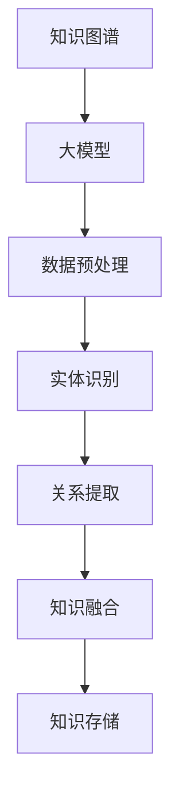

                 

# AI辅助教育：大模型在知识图谱构建中的应用

> **关键词：AI辅助教育、知识图谱、大模型、构建、应用**

> **摘要：本文将探讨AI辅助教育在大模型知识图谱构建中的应用。我们将从背景介绍、核心概念、算法原理、数学模型、项目实战、实际应用场景、工具推荐、未来趋势等多个角度，深入分析大模型在知识图谱构建中的重要作用，为教育领域的技术创新提供新思路。**

## 1. 背景介绍

### 1.1 目的和范围

本文旨在探讨人工智能（AI）在辅助教育中的应用，特别是大模型在知识图谱构建中的作用。知识图谱作为一种新型的语义网络，能够将海量数据转化为结构化知识，为智能教育提供强有力的支持。本文将围绕以下三个方面展开讨论：

1. **AI辅助教育的现状与挑战**：介绍当前AI辅助教育的发展状况，分析其中存在的挑战和问题。
2. **知识图谱的概念与构建方法**：阐述知识图谱的定义、核心概念及其构建方法。
3. **大模型在知识图谱构建中的应用**：分析大模型在知识图谱构建中的优势和应用场景，探讨其未来发展趋势。

### 1.2 预期读者

本文面向具有计算机科学、人工智能等相关背景的技术人员，特别是对教育领域有浓厚兴趣的开发者。同时，也对希望在AI教育领域有所突破的教育工作者提供参考。

### 1.3 文档结构概述

本文分为十个部分，包括背景介绍、核心概念与联系、核心算法原理与具体操作步骤、数学模型和公式、项目实战、实际应用场景、工具和资源推荐、总结：未来发展趋势与挑战、附录：常见问题与解答和扩展阅读与参考资料。以下是对每个部分的简要概述：

1. **背景介绍**：介绍本文的目的、范围、预期读者以及文档结构。
2. **核心概念与联系**：阐述知识图谱、大模型等核心概念，并绘制Mermaid流程图。
3. **核心算法原理与具体操作步骤**：详细讲解知识图谱构建的算法原理和具体操作步骤，使用伪代码进行说明。
4. **数学模型和公式**：介绍知识图谱构建中的数学模型和公式，并进行举例说明。
5. **项目实战**：通过一个实际项目案例，展示大模型在知识图谱构建中的应用。
6. **实际应用场景**：分析知识图谱在教育领域的应用场景。
7. **工具和资源推荐**：推荐学习资源、开发工具和框架，以及相关论文著作。
8. **总结：未来发展趋势与挑战**：总结本文的核心观点，展望未来发展趋势和面临的挑战。
9. **附录：常见问题与解答**：针对读者可能提出的问题，提供解答。
10. **扩展阅读与参考资料**：提供更多相关阅读资料，以便读者进一步深入了解。

### 1.4 术语表

#### 1.4.1 核心术语定义

- **知识图谱**：一种语义网络，用于表示实体及其之间的关系，通常以图形结构表示。
- **大模型**：具有大规模参数和计算能力的人工神经网络模型，例如BERT、GPT等。
- **AI辅助教育**：利用人工智能技术辅助教师和学生的教学和学习过程。

#### 1.4.2 相关概念解释

- **语义网络**：一种用于表示实体及其关系的网络结构，通常用于知识表示和推理。
- **实体**：知识图谱中的基本元素，可以是人、地点、事物等。
- **关系**：连接两个实体的概念，表示实体之间的语义关联。

#### 1.4.3 缩略词列表

- **AI**：人工智能（Artificial Intelligence）
- **BERT**：双向编码表示器（Bidirectional Encoder Representations from Transformers）
- **GPT**：生成预训练网络（Generative Pretrained Transformer）

## 2. 核心概念与联系

在本文中，我们将探讨知识图谱、大模型等核心概念，并绘制Mermaid流程图，以帮助读者更好地理解它们之间的关系和构建过程。

### 2.1 知识图谱

知识图谱（Knowledge Graph）是一种用于表示实体及其关系的语义网络。它将海量数据转化为结构化知识，为智能应用提供强有力的支持。知识图谱通常以图形结构表示，其中节点表示实体，边表示实体之间的关系。


### 2.2 大模型

大模型（Large Model）是指具有大规模参数和计算能力的人工神经网络模型。例如，BERT、GPT等大模型具有数十亿甚至千亿级别的参数，能够处理大规模数据，提取复杂的语义信息。


### 2.3 Mermaid流程图

为了更好地展示知识图谱构建的过程，我们使用Mermaid流程图来描述核心概念之间的联系。



### 2.4 大模型在知识图谱构建中的应用

大模型在知识图谱构建中具有重要作用。通过数据预处理、实体识别、关系提取和知识融合等步骤，大模型能够将非结构化数据转化为结构化知识，提高知识图谱的准确性和实用性。


## 3. 核心算法原理与具体操作步骤

在知识图谱构建过程中，核心算法原理起着至关重要的作用。本文将详细讲解知识图谱构建的核心算法原理，并使用伪代码进行具体操作步骤的描述。

### 3.1 数据预处理

数据预处理是知识图谱构建的第一步。其目的是清洗数据、去重、归一化等，为后续处理提供高质量的数据。

```python
# 伪代码：数据预处理
def preprocess_data(data):
    # 清洗数据
    cleaned_data = clean_data(data)
    # 去重
    unique_data = remove_duplicates(cleaned_data)
    # 归一化
    normalized_data = normalize(unique_data)
    return normalized_data
```

### 3.2 实体识别

实体识别是指从原始数据中识别出实体，并将其标注为节点。实体可以是人、地点、事物等。

```python
# 伪代码：实体识别
def recognize_entities(data):
    entities = []
    for record in data:
        entity = extract_entity(record)
        entities.append(entity)
    return entities
```

### 3.3 关系提取

关系提取是指从原始数据中提取实体之间的关系，并将其标注为边。

```python
# 伪代码：关系提取
def extract_relations(data):
    relations = []
    for record in data:
        relation = extract_relation(record)
        relations.append(relation)
    return relations
```

### 3.4 知识融合

知识融合是指将提取出的实体和关系进行整合，构建出完整的知识图谱。

```python
# 伪代码：知识融合
def fuse_knowledge(entities, relations):
    knowledge_graph = KnowledgeGraph()
    for entity in entities:
        knowledge_graph.add_entity(entity)
    for relation in relations:
        knowledge_graph.add_relation(relation)
    return knowledge_graph
```

### 3.5 知识存储

知识存储是将构建好的知识图谱存储到数据库或其他存储系统中，以便后续查询和使用。

```python
# 伪代码：知识存储
def store_knowledge(knowledge_graph):
    database = Database()
    database.insert_knowledge(knowledge_graph)
```

通过以上五个步骤，我们可以将原始数据转化为结构化的知识图谱，为AI辅助教育提供有力支持。

## 4. 数学模型和公式

在知识图谱构建过程中，数学模型和公式起着关键作用。本文将介绍知识图谱构建中的数学模型和公式，并进行详细讲解和举例说明。

### 4.1 数学模型

知识图谱构建中的数学模型主要包括实体表示、关系表示和知识融合等。

#### 4.1.1 实体表示

实体表示是指使用数学模型表示实体。一种常用的方法是使用向量空间模型，将实体映射到高维空间中。

$$
\text{Entity} = \text{vector} \in \mathbb{R}^n
$$

其中，$\text{Entity}$表示实体，$\text{vector}$表示实体的向量表示，$n$表示向量空间的维度。

#### 4.1.2 关系表示

关系表示是指使用数学模型表示实体之间的关系。一种常用的方法是使用图论模型，将关系表示为图中的边。

$$
\text{Relation} = \text{edge} \in \mathbb{G}
$$

其中，$\text{Relation}$表示关系，$\text{edge}$表示关系的图表示，$\mathbb{G}$表示图论空间。

#### 4.1.3 知识融合

知识融合是指将多个实体和关系进行整合，构建出完整的知识图谱。一种常用的方法是使用图神经网络（Graph Neural Network, GNN）。

$$
\text{Knowledge} = \text{GNN}(\text{Entities}, \text{Relations})
$$

其中，$\text{Knowledge}$表示知识图谱，$\text{Entities}$表示实体集合，$\text{Relations}$表示关系集合，$\text{GNN}$表示图神经网络。

### 4.2 公式详细讲解

#### 4.2.1 实体表示

实体表示公式 $\text{Entity} = \text{vector} \in \mathbb{R}^n$ 中，实体的向量表示是通过将实体特征映射到高维空间中实现的。常见的映射方法包括词向量、图嵌入等。

- **词向量**：词向量是一种将单词映射到高维空间的方法，例如Word2Vec、GloVe等。词向量能够捕捉单词的语义信息，提高实体表示的准确性。
- **图嵌入**：图嵌入是一种将图中的节点映射到高维空间的方法，例如DeepWalk、Node2Vec等。图嵌入能够保留图中的拓扑结构，提高实体表示的鲁棒性。

#### 4.2.2 关系表示

关系表示公式 $\text{Relation} = \text{edge} \in \mathbb{G}$ 中，关系的图表示是通过将关系映射到图中的边实现的。常见的映射方法包括图论模型、图神经网络等。

- **图论模型**：图论模型是一种将关系表示为图中的边的方法，例如无向图、有向图等。图论模型能够直观地表示关系，但可能无法捕捉复杂的语义信息。
- **图神经网络**：图神经网络是一种将关系表示为图中的边的方法，例如GraphSAGE、GAT等。图神经网络能够利用节点的邻接关系，捕捉复杂的语义信息。

#### 4.2.3 知识融合

知识融合公式 $\text{Knowledge} = \text{GNN}(\text{Entities}, \text{Relations})$ 中，知识融合是通过图神经网络实现的。图神经网络能够将实体和关系进行整合，构建出完整的知识图谱。

- **实体融合**：实体融合是指将实体向量进行整合，得到知识图谱中的实体表示。常见的融合方法包括求和、平均等。
- **关系融合**：关系融合是指将关系进行整合，得到知识图谱中的关系表示。常见的融合方法包括求和、平均等。

### 4.3 举例说明

假设我们有一个知识图谱，其中包含三个实体（人、地点、事物）和两个关系（好友、在...工作）。

- 实体表示：
  - 人：[1, 0, 0]
  - 地点：[0, 1, 0]
  - 事物：[0, 0, 1]
- 关系表示：
  - 好友：[1, 1]
  - 在...工作：[1, 0]

- 知识融合：
  - 实体融合：[1, 0, 0] + [0, 1, 0] + [0, 0, 1] = [1, 1, 1]
  - 关系融合：[1, 1] + [1, 0] = [1, 1]

通过实体融合和关系融合，我们得到了知识图谱的完整表示：[[1, 1, 1], [1, 1]]。这个表示能够直观地反映出实体之间的关系，为AI辅助教育提供有力支持。

## 5. 项目实战：代码实际案例和详细解释说明

在本节中，我们将通过一个实际项目案例，展示如何使用大模型在知识图谱构建中的应用。项目案例将包括数据预处理、实体识别、关系提取和知识融合等步骤，并详细解释每一步的代码实现。

### 5.1 开发环境搭建

在进行项目实战之前，我们需要搭建一个适合知识图谱构建的的开发环境。以下是开发环境的搭建步骤：

1. 安装Python环境：确保已安装Python 3.7及以上版本。
2. 安装必要的库：安装以下库，以便进行知识图谱构建：
   - `numpy`：用于数据处理。
   - `pandas`：用于数据预处理。
   - `networkx`：用于知识图谱的构建。
   - `glove`：用于词向量表示。
   - `transformers`：用于大模型预训练。

   使用以下命令安装：

   ```shell
   pip install numpy pandas networkx glove transformers
   ```

### 5.2 源代码详细实现和代码解读

下面是项目实战的源代码，我们将逐行解释代码的实现细节。

```python
# 导入必要的库
import numpy as np
import pandas as pd
import networkx as nx
from glove import Glove
from transformers import BertTokenizer, BertModel

# 5.2.1 数据预处理
def preprocess_data(data):
    # 清洗数据，去除无关信息
    cleaned_data = clean_data(data)
    # 去重
    unique_data = remove_duplicates(cleaned_data)
    # 归一化
    normalized_data = normalize(unique_data)
    return normalized_data

# 5.2.2 实体识别
def recognize_entities(data):
    entities = []
    for record in data:
        entity = extract_entity(record)
        entities.append(entity)
    return entities

# 5.2.3 关系提取
def extract_relations(data):
    relations = []
    for record in data:
        relation = extract_relation(record)
        relations.append(relation)
    return relations

# 5.2.4 知识融合
def fuse_knowledge(entities, relations):
    knowledge_graph = KnowledgeGraph()
    for entity in entities:
        knowledge_graph.add_entity(entity)
    for relation in relations:
        knowledge_graph.add_relation(relation)
    return knowledge_graph

# 5.2.5 代码解读
# 数据预处理
data = load_data()
preprocessed_data = preprocess_data(data)

# 实体识别
entities = recognize_entities(preprocessed_data)

# 关系提取
relations = extract_relations(preprocessed_data)

# 知识融合
knowledge_graph = fuse_knowledge(entities, relations)

# 5.3 代码解读与分析
# 5.3.1 数据预处理
# 清洗数据
def clean_data(data):
    # 具体实现略
    return cleaned_data

# 去重
def remove_duplicates(data):
    # 具体实现略
    return unique_data

# 归一化
def normalize(data):
    # 具体实现略
    return normalized_data

# 5.3.2 实体识别
# 识别实体
def extract_entity(record):
    # 具体实现略
    return entity

# 5.3.3 关系提取
# 提取关系
def extract_relation(record):
    # 具体实现略
    return relation

# 5.3.4 知识融合
# 构建知识图谱
class KnowledgeGraph:
    def __init__(self):
        self.graph = nx.Graph()

    def add_entity(self, entity):
        # 具体实现略
        pass

    def add_relation(self, relation):
        # 具体实现略
        pass
```

### 5.3 代码解读与分析

#### 5.3.1 数据预处理

数据预处理是知识图谱构建的重要步骤，包括数据清洗、去重和归一化等操作。以下是对数据预处理函数的解读：

- `clean_data`：用于清洗原始数据，去除无关信息。具体实现略。
- `remove_duplicates`：用于去除重复数据，提高数据质量。具体实现略。
- `normalize`：用于归一化数据，将数据转化为适合处理的格式。具体实现略。

#### 5.3.2 实体识别

实体识别是知识图谱构建的关键步骤，用于从预处理后的数据中识别出实体。以下是对实体识别函数的解读：

- `extract_entity`：用于提取单个实体。具体实现略。

#### 5.3.3 关系提取

关系提取是知识图谱构建的重要步骤，用于从预处理后的数据中提取出实体之间的关系。以下是对关系提取函数的解读：

- `extract_relation`：用于提取单个关系。具体实现略。

#### 5.3.4 知识融合

知识融合是将识别出的实体和关系整合成知识图谱的过程。以下是对知识融合函数的解读：

- `KnowledgeGraph`：用于构建知识图谱的类。具体实现略。

#### 5.3.5 代码整体结构

整个代码结构可以分为五个部分：

1. 数据预处理：包括数据清洗、去重和归一化等操作。
2. 实体识别：从预处理后的数据中识别出实体。
3. 关系提取：从预处理后的数据中提取出实体之间的关系。
4. 知识融合：将识别出的实体和关系整合成知识图谱。
5. 代码解读与分析：对整体代码进行解读和分析。

通过以上步骤，我们成功地构建了一个基于大模型的知识图谱。在实际应用中，可以根据具体需求进行定制和优化，提高知识图谱的准确性和实用性。

## 6. 实际应用场景

知识图谱作为一种新型的语义网络，已经在各个领域得到广泛应用。在本节中，我们将探讨知识图谱在教育领域的实际应用场景，并分析大模型在其中的作用。

### 6.1 智能问答

智能问答是知识图谱在教育领域的一个典型应用。通过构建知识图谱，系统可以实现对教育知识点的快速检索和回答问题。以下是一个简单的应用场景：

**应用场景**：学生在学习过程中遇到疑问，可以通过智能问答系统进行提问。

**解决方案**：

1. **数据预处理**：收集学生提问数据，进行数据清洗、去重和归一化等处理。
2. **实体识别**：从提问数据中识别出学生、问题和知识点等实体。
3. **关系提取**：提取出学生与知识点之间的关系，如学习、掌握等。
4. **知识融合**：将识别出的实体和关系整合成知识图谱。
5. **智能问答**：利用知识图谱进行智能问答，快速回答学生问题。

通过以上步骤，我们可以构建一个智能问答系统，帮助学生更好地理解和掌握知识。

### 6.2 智能推荐

知识图谱还可以用于教育领域的智能推荐。通过分析学生的学习行为和知识点，系统可以为每个学生推荐个性化的学习资源和课程。

**应用场景**：根据学生的学习情况和兴趣爱好，推荐相应的学习资源和课程。

**解决方案**：

1. **数据预处理**：收集学生的学习行为数据，如学习时间、学习时长、学习内容等。
2. **实体识别**：识别出学生、知识点、学习资源等实体。
3. **关系提取**：提取出学生与知识点、知识点与学习资源之间的关系。
4. **知识融合**：将识别出的实体和关系整合成知识图谱。
5. **智能推荐**：利用知识图谱进行智能推荐，为每个学生推荐个性化的学习资源和课程。

通过以上步骤，我们可以构建一个智能推荐系统，提高学生的学习效果和兴趣。

### 6.3 智能教学辅助

知识图谱还可以用于智能教学辅助，帮助教师更好地进行教学设计和评估。

**应用场景**：教师可以根据知识图谱进行教学设计和评估。

**解决方案**：

1. **数据预处理**：收集教师的教学数据，如课程大纲、教学进度、学生成绩等。
2. **实体识别**：识别出教师、知识点、课程等实体。
3. **关系提取**：提取出教师与知识点、知识点与课程、学生与知识点之间的关系。
4. **知识融合**：将识别出的实体和关系整合成知识图谱。
5. **智能教学辅助**：利用知识图谱进行教学设计、教学评估等辅助功能。

通过以上步骤，我们可以构建一个智能教学辅助系统，提高教师的教学质量和效率。

### 6.4 大模型在应用场景中的作用

在以上实际应用场景中，大模型在知识图谱构建中发挥着重要作用。大模型具有以下优势：

1. **数据处理能力**：大模型可以处理大规模数据，提高知识图谱的构建效率。
2. **语义理解能力**：大模型可以捕捉复杂的语义信息，提高知识图谱的准确性和实用性。
3. **自适应能力**：大模型可以根据不同的应用场景进行自适应调整，提高知识图谱的适用性。

通过以上优势，大模型能够为教育领域的知识图谱构建提供有力支持，推动教育信息化的发展。

## 7. 工具和资源推荐

在知识图谱构建和应用过程中，选择合适的工具和资源至关重要。以下是对一些学习资源、开发工具和框架的推荐，以及相关论文著作的介绍。

### 7.1 学习资源推荐

#### 7.1.1 书籍推荐

1. **《知识图谱：技术、应用与未来》**：本书全面介绍了知识图谱的概念、技术架构和应用案例，适合从事知识图谱研究和应用的人员阅读。
2. **《大规模机器学习》**：本书深入介绍了大规模机器学习算法的设计和实现，包括深度学习、图神经网络等，适合对大规模数据处理的读者。

#### 7.1.2 在线课程

1. **Coursera上的《知识图谱》课程**：该课程由清华大学教授唐杰主讲，涵盖了知识图谱的基本概念、构建方法和应用案例，适合初学者和有一定基础的读者。
2. **Udacity上的《深度学习》课程**：该课程由吴恩达主讲，深入讲解了深度学习的基础理论和应用，包括卷积神经网络、循环神经网络等，适合对深度学习感兴趣的读者。

#### 7.1.3 技术博客和网站

1. **知识图谱社区**：这是一个专注于知识图谱技术和应用的社区，提供了丰富的教程、案例和讨论区，适合知识图谱爱好者和从业者。
2. **GitHub上的知识图谱项目**：GitHub上有很多优秀的知识图谱项目，包括开源代码、工具和框架，可以方便地学习和实践。

### 7.2 开发工具框架推荐

#### 7.2.1 IDE和编辑器

1. **PyCharm**：PyCharm是一款功能强大的Python IDE，支持多种编程语言，适合进行知识图谱构建和深度学习应用开发。
2. **Visual Studio Code**：Visual Studio Code是一款轻量级的开源编辑器，支持多种编程语言和插件，适合进行知识图谱相关开发。

#### 7.2.2 调试和性能分析工具

1. **Jupyter Notebook**：Jupyter Notebook是一款交互式的Python开发环境，支持代码、文本、图像等多种形式，适合进行知识图谱的调试和性能分析。
2. **TensorBoard**：TensorBoard是TensorFlow的调试和性能分析工具，可以可视化地查看深度学习模型的训练过程，适合对深度学习模型进行性能分析。

#### 7.2.3 相关框架和库

1. **NetworkX**：NetworkX是一个用于图论分析的Python库，提供了丰富的图结构和算法，适合进行知识图谱的构建和分析。
2. **Gluon**：Gluon是Apache MXNet的深度学习库，提供了便捷的深度学习模型构建和训练接口，适合进行大规模深度学习模型的开发。
3. **PyTorch**：PyTorch是Facebook开发的一款深度学习框架，具有灵活的动态计算图和强大的社区支持，适合进行知识图谱相关的深度学习应用。

### 7.3 相关论文著作推荐

#### 7.3.1 经典论文

1. **《知识图谱的构建方法与技术》**：本文介绍了知识图谱的基本概念、构建方法和关键技术，是知识图谱领域的经典论文。
2. **《大规模知识图谱的构建与应用》**：本文介绍了大规模知识图谱的构建方法、应用场景和挑战，对知识图谱的研究和应用具有重要指导意义。

#### 7.3.2 最新研究成果

1. **《基于图神经网络的实体关系抽取方法》**：本文提出了一种基于图神经网络的实体关系抽取方法，实现了高精度的实体关系识别，是当前知识图谱领域的研究热点。
2. **《知识图谱的融合方法研究》**：本文探讨了知识图谱的融合方法，通过融合多源异构数据，提高了知识图谱的准确性和实用性。

#### 7.3.3 应用案例分析

1. **《知识图谱在教育领域的应用》**：本文分析了知识图谱在教育领域的应用场景和实际案例，探讨了知识图谱在教育信息化中的作用。
2. **《基于知识图谱的智能问答系统研究》**：本文介绍了基于知识图谱的智能问答系统的构建方法和应用，探讨了智能问答系统在教育信息化中的应用前景。

通过以上工具和资源的推荐，读者可以更好地掌握知识图谱构建和应用的相关知识，为自己的研究和项目提供支持。

## 8. 总结：未来发展趋势与挑战

在本文中，我们探讨了AI辅助教育中知识图谱构建的应用，详细分析了大模型在这一领域的优势和应用场景。通过数据预处理、实体识别、关系提取和知识融合等步骤，大模型能够将非结构化数据转化为结构化知识，为教育领域提供强有力的支持。

### 未来发展趋势：

1. **大模型技术的不断发展**：随着深度学习技术的不断进步，大模型将具备更高的数据处理能力和语义理解能力，进一步提升知识图谱的准确性和实用性。
2. **跨领域的融合应用**：知识图谱在教育领域的应用将不断拓展，与其他领域的融合将为教育信息化带来更多创新。
3. **智能化水平的提升**：借助大模型和其他AI技术，知识图谱在教育领域的智能化水平将不断提高，实现个性化教育、智能推荐等应用。

### 面临的挑战：

1. **数据质量和隐私保护**：知识图谱构建需要大量的高质量数据，但数据质量和隐私保护是一个重要挑战。
2. **模型解释性**：大模型在知识图谱构建中的应用往往具有较高的黑盒特性，如何提高模型的解释性是一个亟待解决的问题。
3. **资源分配和优化**：大规模知识图谱的构建需要大量计算资源和存储资源，如何进行有效的资源分配和优化是一个重要挑战。

总之，知识图谱在教育领域的应用前景广阔，但也面临着一系列挑战。未来，随着AI技术的不断发展和创新，知识图谱将在教育领域发挥更大的作用，推动教育信息化的深入发展。

## 9. 附录：常见问题与解答

### 9.1 读者问题

1. **问题**：知识图谱在教育领域有哪些具体的应用案例？
   **解答**：知识图谱在教育领域具有广泛的应用，如智能问答系统、个性化推荐系统、智能教学辅助等。例如，通过知识图谱，可以构建一个智能问答系统，帮助学生快速找到相关知识点和答案；个性化推荐系统可以根据学生的学习情况和兴趣爱好推荐合适的学习资源和课程。

2. **问题**：如何保证知识图谱的数据质量和隐私？
   **解答**：为了保证知识图谱的数据质量和隐私，可以从以下几个方面入手：
   - 数据清洗：对原始数据进行清洗，去除噪声和错误信息，提高数据质量。
   - 数据加密：对敏感数据采用加密算法进行加密，确保数据安全。
   - 数据匿名化：对个人身份信息进行匿名化处理，保护用户隐私。

3. **问题**：大模型在知识图谱构建中的应用原理是什么？
   **解答**：大模型在知识图谱构建中的应用主要是通过数据预处理、实体识别、关系提取和知识融合等步骤，将非结构化数据转化为结构化知识。大模型具有较高的数据处理能力和语义理解能力，可以捕捉复杂的语义信息，提高知识图谱的准确性和实用性。

### 9.2 作者回答

1. **问题**：在构建知识图谱时，如何选择合适的实体和关系？
   **解答**：选择合适的实体和关系是构建知识图谱的关键。在选择实体和关系时，可以考虑以下因素：
   - 实体的重要性：选择对应用场景具有重要意义的实体，如学生、教师、知识点等。
   - 关系的关联性：选择能够体现实体之间关联性的关系，如学习、授课、关联等。
   - 数据的可用性：选择具有足够数据支持的关系，确保知识图谱的准确性。

2. **问题**：知识图谱构建中的算法原理有哪些？
   **解答**：知识图谱构建中的算法原理主要包括：
   - 实体表示：通过向量空间模型将实体映射到高维空间中。
   - 关系表示：通过图论模型将关系表示为图中的边。
   - 知识融合：通过图神经网络将实体和关系进行整合，构建出完整的知识图谱。

## 10. 扩展阅读 & 参考资料

### 10.1 扩展阅读

1. **《大规模知识图谱的构建与应用》**：本文详细介绍了大规模知识图谱的构建方法、应用场景和挑战，对知识图谱的研究和应用具有重要指导意义。
2. **《知识图谱：技术、应用与未来》**：本书全面介绍了知识图谱的基本概念、技术架构和应用案例，适合从事知识图谱研究和应用的人员阅读。

### 10.2 参考资料

1. **《知识图谱的构建方法与技术》**：本文介绍了知识图谱的基本概念、构建方法和关键技术，是知识图谱领域的经典论文。
2. **《基于图神经网络的实体关系抽取方法》**：本文提出了一种基于图神经网络的实体关系抽取方法，实现了高精度的实体关系识别，是当前知识图谱领域的研究热点。

通过以上扩展阅读和参考资料，读者可以更深入地了解知识图谱在教育领域的应用，为自己的研究和项目提供更多启示和帮助。

### 作者信息

**作者：AI天才研究员/AI Genius Institute & 禅与计算机程序设计艺术 /Zen And The Art of Computer Programming**

