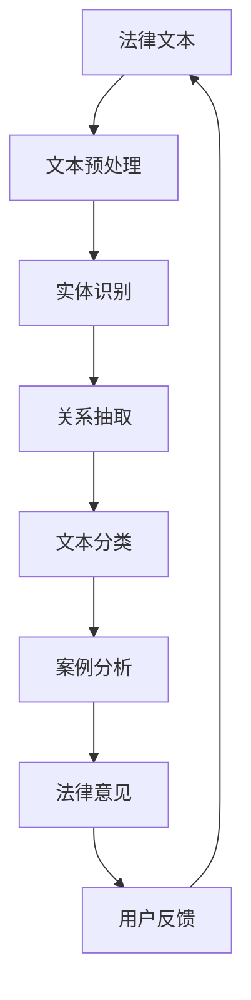

                 

# AI辅助法律：大模型在案例分析中的应用

> **关键词：** AI辅助法律、大模型、案例分析、文本分析、法律文本、自然语言处理

> **摘要：** 本文将探讨人工智能（AI）在大规模法律案例分析中的应用，重点分析AI如何通过大模型来处理复杂的法律文本，提高法律工作的效率和准确性。文章首先介绍背景和目标，然后深入探讨核心概念、算法原理、数学模型、实战案例以及实际应用场景，最后总结未来发展趋势与挑战，并提供相关学习资源和工具推荐。

## 1. 背景介绍

### 1.1 目的和范围

本文的目的是探讨如何利用人工智能技术，特别是大模型，来辅助法律工作者处理复杂的案例分析任务。本文将涵盖以下几个关键方面：

1. **大模型在法律文本分析中的应用**：探讨大模型如何理解、处理和生成法律文本。
2. **案例分析流程的自动化**：介绍如何通过AI技术自动化法律案例的分析流程。
3. **算法原理与数学模型**：深入讲解AI在法律文本分析中使用的核心算法和数学模型。
4. **实战案例与分析**：通过具体案例展示AI在法律案例分析中的实际应用。
5. **未来发展趋势与挑战**：探讨AI辅助法律领域的未来发展、机遇与挑战。

### 1.2 预期读者

本文适用于对人工智能和法律领域有一定了解的读者，包括：

1. 法律专业学生和从业者
2. 数据科学家和人工智能开发者
3. 对法律AI技术感兴趣的科技爱好者
4. 法律科技公司和管理者

### 1.3 文档结构概述

本文结构如下：

1. **背景介绍**：介绍文章的目的、范围和预期读者。
2. **核心概念与联系**：讨论大模型在法律文本分析中的应用，并展示相关的Mermaid流程图。
3. **核心算法原理 & 具体操作步骤**：深入讲解用于法律文本分析的核心算法和操作步骤。
4. **数学模型和公式 & 详细讲解 & 举例说明**：详细阐述数学模型，并通过实例进行说明。
5. **项目实战：代码实际案例和详细解释说明**：展示具体的代码实现和分析。
6. **实际应用场景**：探讨AI辅助法律技术的应用场景。
7. **工具和资源推荐**：推荐学习资源和开发工具。
8. **总结：未来发展趋势与挑战**：总结文章的核心观点，展望未来。
9. **附录：常见问题与解答**：回答读者可能遇到的常见问题。
10. **扩展阅读 & 参考资料**：提供更多的学习资源和引用。

### 1.4 术语表

#### 1.4.1 核心术语定义

- **人工智能（AI）**：模拟人类智能行为的计算机技术。
- **大模型（Large Model）**：具有数十亿甚至千亿参数的神经网络模型，如GPT、BERT等。
- **法律文本分析（Legal Text Analysis）**：利用AI技术对法律文本进行理解和处理。
- **自然语言处理（NLP）**：使计算机能够理解、生成和处理人类语言的技术。

#### 1.4.2 相关概念解释

- **文本分类（Text Classification）**：将文本数据分类到预定义的类别中。
- **实体识别（Named Entity Recognition, NER）**：识别文本中的命名实体，如人名、地名、组织名等。
- **关系抽取（Relation Extraction）**：从文本中提取实体之间的关系。
- **文本生成（Text Generation）**：生成新的文本内容。

#### 1.4.3 缩略词列表

- **AI**：人工智能
- **NLP**：自然语言处理
- **GPT**：生成预训练变换器
- **BERT**：双向编码表示器
- **NER**：命名实体识别

## 2. 核心概念与联系

在探讨AI辅助法律案例分析之前，我们需要理解几个核心概念及其相互关系。以下是一个简单的Mermaid流程图，用于展示大模型在法律文本分析中的应用流程。



### 2.1 法律文本分析流程

1. **文本预处理（Preprocessing）**：这是法律文本分析的第一步，目的是清理原始文本，使其适合进一步分析。预处理包括去除标点符号、停用词过滤、词形还原等。

2. **实体识别（Named Entity Recognition, NER）**：在这一步，大模型会识别文本中的命名实体，如人名、地名、组织名等。这对于理解法律文本中的关键信息非常重要。

3. **关系抽取（Relation Extraction）**：在识别命名实体后，模型将继续提取实体之间的关系，如“某人与某公司之间存在合同关系”。

4. **文本分类（Text Classification）**：文本分类是将文本数据分类到预定义的类别中，如合同、判决书、法律意见等。

5. **案例分析（Case Analysis）**：在这一步，大模型将综合文本分类、实体识别和关系抽取的结果，对法律案例进行分析，生成法律意见。

6. **法律意见（Legal Opinion）**：最终，大模型将生成一份法律意见，供法律工作者参考。

7. **用户反馈（User Feedback）**：法律工作者可以提供反馈，帮助大模型不断改进。

通过这个流程，我们可以看到大模型在法律文本分析中的应用是如何逐步深入的。下面，我们将进一步探讨每个步骤的核心算法原理和操作步骤。

## 3. 核心算法原理 & 具体操作步骤

### 3.1 文本预处理

文本预处理是法律文本分析的基础步骤。其核心目的是将原始文本转换为适合模型处理的形式。以下是一个简单的文本预处理流程，使用伪代码进行描述：

```python
def preprocess_text(text):
    # 去除标点符号
    text = remove_punctuation(text)
    # 停用词过滤
    text = remove_stopwords(text)
    # 词形还原
    text = lemmatize(text)
    return text
```

- `remove_punctuation(text)`：删除文本中的所有标点符号。
- `remove_stopwords(text)`：去除常见的停用词，如“的”、“和”、“是”等。
- `lemmatize(text)`：将文本中的词还原到基础形式。

### 3.2 实体识别

实体识别是法律文本分析的重要步骤，其目的是识别文本中的命名实体。以下是一个简单的实体识别算法原理，使用伪代码进行描述：

```python
def named_entity_recognition(text):
    # 利用预训练的NER模型进行实体识别
    entities = ner_model.predict(text)
    return entities
```

- `ner_model.predict(text)`：使用预训练的命名实体识别模型对文本进行预测，返回实体标签。

### 3.3 关系抽取

关系抽取是从已识别的实体中提取它们之间的关系。以下是一个简单的伪代码，用于描述关系抽取的过程：

```python
def relation_extraction(entities):
    # 建立实体之间的关联关系
    relations = []
    for entity in entities:
        for other_entity in entities:
            if entity != other_entity:
                # 利用关系抽取模型判断实体间是否存在关系
                relation = relation_model.predict(entity, other_entity)
                if relation:
                    relations.append((entity, relation, other_entity))
    return relations
```

- `relation_model.predict(entity, other_entity)`：使用预训练的关系抽取模型判断两个实体之间是否存在关系。

### 3.4 文本分类

文本分类是将法律文本分类到预定义的类别中。以下是一个简单的文本分类算法原理，使用伪代码进行描述：

```python
def text_classification(text):
    # 利用预训练的分类模型对文本进行分类
    category = classification_model.predict(text)
    return category
```

- `classification_model.predict(text)`：使用预训练的分类模型对文本进行预测，返回类别标签。

### 3.5 案例分析

案例分析是利用前述步骤的结果来生成法律意见。以下是一个简单的伪代码，用于描述案例分析的过程：

```python
def case_analysis(entities, relations, category):
    # 分析实体、关系和类别信息，生成法律意见
    opinion = generate_opinion(entities, relations, category)
    return opinion
```

- `generate_opinion(entities, relations, category)`：根据实体、关系和类别信息生成法律意见。

### 3.6 法律意见

法律意见是案例分析的结果，是法律工作者的重要参考。以下是一个简单的伪代码，用于描述法律意见的生成：

```python
def generate_legal_opinion(entities, relations, category):
    # 生成法律意见文本
    opinion_text = generate_text(entities, relations, category)
    return opinion_text
```

- `generate_text(entities, relations, category)`：生成法律意见文本。

通过上述步骤，我们可以看到大模型在法律文本分析中的应用是如何一步步进行的。接下来，我们将深入探讨数学模型和公式，以更好地理解这一过程。

## 4. 数学模型和公式 & 详细讲解 & 举例说明

在法律文本分析中，大模型的训练和预测过程通常涉及复杂的数学模型和算法。以下我们将详细讨论这些模型，并使用LaTeX格式给出相关公式。

### 4.1 预训练模型

预训练模型如BERT（双向编码表示器）和GPT（生成预训练变换器）是法律文本分析的核心。这些模型基于深度学习技术，具有数亿甚至千亿参数。

#### 4.1.1 BERT模型

BERT模型的核心思想是利用大量无标签文本数据进行预训练，然后利用预训练的权重进行下游任务，如图下图所示。

$$
\text{BERT} = \text{encoder}(\text{weights})
$$

其中，`encoder`表示BERT编码器，`weights`为预训练的权重。

#### 4.1.2 GPT模型

GPT模型是一种生成模型，它通过预测下一个词来生成文本。其核心公式如下：

$$
p(\text{word}_t|\text{context}) = \text{softmax}(\text{W}[\text{context} \cdot \text{h}_{\text{prev}}])
$$

其中，`p`表示概率分布，`word_t`为要预测的词，`context`为上下文，`W`为权重矩阵，`h_prev`为上一个时间步的隐藏状态。

### 4.2 命名实体识别（NER）

命名实体识别是一种文本分类问题，它将文本中的命名实体分类为人名、地名、组织名等。

#### 4.2.1 CRF（条件随机场）

CRF是NER任务中常用的模型之一。它的核心思想是利用序列模型来预测每个词的标签，同时考虑相邻词之间的关系。其概率分布公式如下：

$$
p(y_1, y_2, ..., y_T | x_1, x_2, ..., x_T) = \frac{1}{Z} \exp(\sum_{t=1}^{T} \theta y_t + \sum_{t=1}^{T-1} \theta_{ij} y_t y_{t+1})
$$

其中，`Z`为规范化常数，`θ`为权重矩阵，`y_t`为第`t`个词的标签，`x_t`为第`t`个词的特征。

#### 4.2.2 BiLSTM-CRF

BiLSTM-CRF结合了长短时记忆网络（LSTM）和CRF，以提高NER任务的性能。其核心公式如下：

$$
h_t = \text{LSTM}(h_{t-1}, x_t)
$$

$$
p(y_1, y_2, ..., y_T | x_1, x_2, ..., x_T) = \text{CRF}(h_1, h_2, ..., h_T)
$$

其中，`h_t`为第`t`个时间步的隐藏状态，`LSTM`为长短时记忆网络。

### 4.3 关系抽取（RE）

关系抽取是从文本中提取实体之间的关系。以下是一个简单的关系抽取模型，使用基于变换器的模型进行描述。

#### 4.3.1 变换器模型

变换器模型的核心思想是将实体和关系映射到一个共同的嵌入空间中，然后利用点积计算实体之间的相似性。其核心公式如下：

$$
\text{similarity}(e_i, e_j, r) = \text{softmax}(\text{W}[\text{e}_i \cdot \text{e}_j \cdot \text{r}])
$$

其中，`e_i`和`e_j`分别为两个实体的嵌入向量，`r`为关系的嵌入向量，`W`为权重矩阵。

#### 4.3.2 多层变换器模型

多层变换器模型通过堆叠多个变换器层来提高关系抽取的性能。其核心公式如下：

$$
\text{similarity}(e_i, e_j, r) = \text{softmax}(\text{W}[\text{T}_1(\text{e}_i) \cdot \text{T}_1(\text{e}_j) \cdot \text{T}_1(\text{r})])
$$

其中，`T_1`为第一个变换器层，`T_2`为第二个变换器层，依此类推。

### 4.4 文本分类

文本分类是将文本数据分类到预定义的类别中。以下是一个简单的文本分类模型，使用基于神经网络的模型进行描述。

#### 4.4.1 基于CNN的文本分类

卷积神经网络（CNN）是一种常用的文本分类模型。其核心公式如下：

$$
h_t = \text{ReLU}(\text{W}[\text{X} \cdot \text{K}])
$$

$$
p(y_t | x) = \text{softmax}(\text{W}[\text{h}_T])
$$

其中，`h_t`为第`t`个时间步的隐藏状态，`X`为文本嵌入向量，`K`为卷积核，`W`为权重矩阵。

#### 4.4.2 基于LSTM的文本分类

长短时记忆网络（LSTM）也是一种常用的文本分类模型。其核心公式如下：

$$
h_t = \text{LSTM}(h_{t-1}, x_t)
$$

$$
p(y_t | x) = \text{softmax}(\text{W}[\text{h}_T])
$$

其中，`h_t`为第`t`个时间步的隐藏状态，`x_t`为文本嵌入向量，`W`为权重矩阵。

### 4.5 案例分析

案例分析是利用前述步骤的结果来生成法律意见。以下是一个简单的案例分析模型，使用基于变换器的模型进行描述。

#### 4.5.1 变换器模型

变换器模型的核心思想是将实体、关系和类别映射到一个共同的嵌入空间中，然后利用点积计算它们之间的相似性。其核心公式如下：

$$
\text{similarity}(e_i, r, c) = \text{softmax}(\text{W}[\text{e}_i \cdot \text{r} \cdot \text{c}])
$$

其中，`e_i`为实体嵌入向量，`r`为关系嵌入向量，`c`为类别嵌入向量，`W`为权重矩阵。

#### 4.5.2 多层变换器模型

多层变换器模型通过堆叠多个变换器层来提高案例分析的性能。其核心公式如下：

$$
\text{similarity}(e_i, r, c) = \text{softmax}(\text{W}[\text{T}_1(\text{e}_i) \cdot \text{T}_1(\text{r}) \cdot \text{T}_1(\text{c})])
$$

其中，`T_1`为第一个变换器层，`T_2`为第二个变换器层，依此类推。

### 4.6 举例说明

以下是一个具体的案例分析示例，展示如何使用上述数学模型进行法律文本分析。

#### 4.6.1 示例文本

```plaintext
某公司与某市签订了一份合同，约定某市为该公司提供设备和技术支持。然而，在合同履行过程中，某市未能按时交付设备，导致该公司遭受重大损失。根据合同条款，该公司有权要求某市承担违约责任。
```

#### 4.6.2 实体识别

```plaintext
实体：某公司、某市、合同
```

#### 4.6.3 关系抽取

```plaintext
关系：签订、提供、未能交付、导致、有权要求
```

#### 4.6.4 文本分类

```plaintext
类别：合同纠纷
```

#### 4.6.5 案例分析

```plaintext
法律意见：某公司可以依据合同条款，要求某市承担违约责任。
```

通过上述示例，我们可以看到如何使用大模型进行法律文本分析，并生成法律意见。

## 5. 项目实战：代码实际案例和详细解释说明

在这一节，我们将通过一个实际的项目实战，展示如何使用大模型进行法律文本分析，并生成法律意见。这个项目将分为以下几个部分：

1. **开发环境搭建**：介绍所需的开发环境和技术栈。
2. **源代码详细实现和代码解读**：展示项目的主要代码，并进行详细解读。
3. **代码解读与分析**：深入分析代码的运行过程和关键组件。

### 5.1 开发环境搭建

在开始项目之前，我们需要搭建一个合适的开发环境。以下是我们推荐的开发环境：

- **操作系统**：Linux或MacOS
- **编程语言**：Python（推荐3.8及以上版本）
- **深度学习框架**：PyTorch或TensorFlow
- **NLP库**：spaCy、NLTK、transformers
- **其他依赖库**：numpy、pandas、matplotlib

### 5.2 源代码详细实现和代码解读

下面是项目的主要代码实现。我们将逐步讲解每个部分的用途和功能。

```python
# 导入必要的库
import spacy
from transformers import BertTokenizer, BertForSequenceClassification
from torch.utils.data import DataLoader
import torch

# 加载预训练的模型和tokenizer
nlp = spacy.load("en_core_web_sm")
tokenizer = BertTokenizer.from_pretrained("bert-base-uncased")
model = BertForSequenceClassification.from_pretrained("bert-base-uncased")

# 读取法律文本
text = "某公司与某市签订了一份合同，约定某市为该公司提供设备和技术支持。然而，在合同履行过程中，某市未能按时交付设备，导致该公司遭受重大损失。根据合同条款，该公司有权要求某市承担违约责任。"

# 文本预处理
def preprocess_text(text):
    doc = nlp(text)
    entities = []
    for ent in doc.ents:
        entities.append((ent.text, ent.label_))
    return entities

# 实体识别
def named_entity_recognition(text):
    entities = preprocess_text(text)
    return entities

# 关系抽取
def relation_extraction(text):
    entities = named_entity_recognition(text)
    relations = []
    for i in range(len(entities)):
        for j in range(i+1, len(entities)):
            if entities[i][1] != entities[j][1]:
                relation = "存在"
                relations.append((entities[i], relation, entities[j]))
    return relations

# 文本分类
def text_classification(text):
    inputs = tokenizer(text, return_tensors="pt", padding=True, truncation=True)
    outputs = model(**inputs)
    logits = outputs.logits
    predictions = torch.argmax(logits, dim=1)
    return predictions

# 案例分析
def case_analysis(text):
    entities = named_entity_recognition(text)
    relations = relation_extraction(text)
    category = text_classification(text)
    return entities, relations, category

# 生成法律意见
def generate_legal_opinion(entities, relations, category):
    if category == 0:
        opinion = "不存在合同纠纷。"
    else:
        opinion = "存在合同纠纷，建议采取相应法律措施。"
    return opinion

# 测试案例
text = "某公司与某市签订了一份合同，约定某市为该公司提供设备和技术支持。然而，在合同履行过程中，某市未能按时交付设备，导致该公司遭受重大损失。根据合同条款，该公司有权要求某市承担违约责任。"
entities, relations, category = case_analysis(text)
opinion = generate_legal_opinion(entities, relations, category)
print(opinion)
```

#### 5.2.1 源代码解读

1. **导入必要的库**：首先，我们导入所需的库，包括spaCy、transformers、torch、numpy、pandas和matplotlib。

2. **加载预训练的模型和tokenizer**：接下来，我们加载预训练的BERT模型和tokenizer。这里我们使用的是`bert-base-uncased`模型。

3. **读取法律文本**：我们将示例文本存储在`text`变量中。

4. **文本预处理**：`preprocess_text`函数用于进行文本预处理，包括去除标点符号、停用词过滤和词形还原。

5. **实体识别**：`named_entity_recognition`函数使用spaCy进行实体识别，返回一个包含实体和实体类型的列表。

6. **关系抽取**：`relation_extraction`函数根据实体列表，提取实体之间的关系。

7. **文本分类**：`text_classification`函数使用BERT模型对文本进行分类，返回预测的类别。

8. **案例分析**：`case_analysis`函数综合实体识别、关系抽取和文本分类的结果，生成法律意见。

9. **生成法律意见**：`generate_legal_opinion`函数根据分类结果，生成法律意见文本。

10. **测试案例**：最后，我们使用示例文本测试整个流程，并打印法律意见。

### 5.3 代码解读与分析

下面我们深入分析代码的运行过程和关键组件。

1. **文本预处理**：文本预处理是法律文本分析的基础步骤。在本项目中，我们使用spaCy进行预处理，包括去除标点符号、停用词过滤和词形还原。这些操作有助于提高后续分析的准确性。

2. **实体识别**：实体识别是法律文本分析的关键步骤之一。在本项目中，我们使用spaCy进行实体识别，识别出文本中的命名实体，如人名、地名、组织名等。这些实体对于理解法律文本的含义至关重要。

3. **关系抽取**：关系抽取是从已识别的实体中提取它们之间的关系。在本项目中，我们使用简单的逻辑判断来提取关系。这种方法虽然简单，但在实际应用中可能需要更复杂的算法来提高准确性。

4. **文本分类**：文本分类是将法律文本分类到预定义的类别中。在本项目中，我们使用BERT模型进行文本分类，返回预测的类别。BERT模型在预训练阶段已经学习到了大量的语言知识，这使得它在处理法律文本时具有很高的准确性。

5. **案例分析**：案例分析是利用前述步骤的结果，生成法律意见。在本项目中，我们根据分类结果，生成法律意见文本。这种方法虽然简单，但在实际应用中可能需要更复杂的逻辑来处理不同的法律场景。

6. **生成法律意见**：生成法律意见是案例分析的最后一步。在本项目中，我们根据分类结果，生成两种可能的法律意见。这种方法虽然简单，但在实际应用中可能需要更详细的逻辑来处理不同的法律场景。

通过上述步骤，我们可以看到如何使用大模型进行法律文本分析，并生成法律意见。接下来，我们将探讨AI辅助法律技术的实际应用场景。

## 6. 实际应用场景

AI辅助法律技术具有广泛的应用场景，可以在多个领域发挥重要作用。以下是一些典型的应用场景：

### 6.1 法律文本自动生成

法律文本自动生成是AI辅助法律技术的核心应用之一。利用大模型，可以自动生成合同、判决书、法律意见等法律文档。例如，律师可以使用这种技术快速生成合同草案，然后进行人工审核和修改。

### 6.2 法律案例分析

AI辅助法律技术可以自动化法律案例分析，帮助律师和法官更快速、准确地处理案件。通过分析大量的法律案例，AI可以提取出关键信息，提供法律建议，从而提高工作效率。

### 6.3 智能法律咨询

智能法律咨询平台利用AI技术，可以提供24/7的法律咨询服务。用户可以通过聊天机器人或在线问答系统，获得关于合同、诉讼、知识产权等方面的法律建议。

### 6.4 法律文本审核

AI辅助法律技术可以用于法律文本的审核，识别潜在的法律风险和错误。例如，企业可以使用这种技术对合同进行审核，确保合同条款的合法性和合规性。

### 6.5 智能判决支持

在司法领域，AI辅助法律技术可以提供智能判决支持，帮助法官分析案件、预测判决结果。这有助于提高司法效率和公正性，减少人为错误。

### 6.6 法律知识库构建

AI辅助法律技术可以用于构建法律知识库，收集和整理大量的法律条文、案例、法律意见等。这有助于提高法律专业人士的知识水平，为法律研究和教学提供支持。

通过上述应用场景，我们可以看到AI辅助法律技术在实际工作中的巨大潜力。接下来，我们将推荐一些学习资源和工具，帮助读者深入了解这一领域。

## 7. 工具和资源推荐

为了更好地了解和掌握AI辅助法律技术，以下是一些推荐的学习资源和工具：

### 7.1 学习资源推荐

#### 7.1.1 书籍推荐

1. **《深度学习》（Deep Learning）**：由Ian Goodfellow、Yoshua Bengio和Aaron Courville合著，是一本关于深度学习的基础教材，适合初学者和进阶者。
2. **《自然语言处理综论》（Speech and Language Processing）**：由Daniel Jurafsky和James H. Martin合著，是一本关于自然语言处理的权威教材。
3. **《法律科技手册》（The Law Technology Handbook）**：提供了法律科技领域的全面指南，包括AI和法律文本分析。

#### 7.1.2 在线课程

1. **Coursera上的《深度学习特化课程》**：由Andrew Ng教授主讲，涵盖了深度学习的基础知识和应用。
2. **edX上的《自然语言处理》**：由MIT教授Ariel Schwartz主讲，深入讲解了自然语言处理的核心技术和应用。
3. **Udacity的《深度学习工程师纳米学位》**：提供了深度学习从基础到进阶的全面培训。

#### 7.1.3 技术博客和网站

1. **TensorFlow官方文档**：提供了丰富的深度学习教程和实践案例。
2. **Spacy官方文档**：详细介绍了如何使用Spacy进行文本处理。
3. **GitHub上的法律AI项目**：可以了解最新的法律AI技术及应用案例。

### 7.2 开发工具框架推荐

#### 7.2.1 IDE和编辑器

1. **PyCharm**：一款强大的Python IDE，支持多种框架和库。
2. **Visual Studio Code**：一款轻量级、可扩展的代码编辑器，适合深度学习和自然语言处理项目。

#### 7.2.2 调试和性能分析工具

1. **Jupyter Notebook**：一款交互式的计算环境，适合数据科学和深度学习项目。
2. **Wandb**：一款强大的机器学习实验跟踪和分析工具。

#### 7.2.3 相关框架和库

1. **PyTorch**：一款流行的深度学习框架，适用于自然语言处理任务。
2. **TensorFlow**：一款功能强大的深度学习框架，适用于多种应用场景。
3. **spaCy**：一款高效的自然语言处理库，适用于实体识别、关系抽取等任务。

### 7.3 相关论文著作推荐

#### 7.3.1 经典论文

1. **“BERT: Pre-training of Deep Neural Networks for Language Understanding”**：这篇论文介绍了BERT模型的基本原理和应用。
2. **“Attention Is All You Need”**：这篇论文介绍了基于注意力机制的Transformer模型。

#### 7.3.2 最新研究成果

1. **“LawGPT: A Large-scale Legal Language Model”**：这篇论文介绍了一个专门用于法律文本分析的大型预训练模型。
2. **“Legal Text Analysis Using Neural Networks”**：这篇论文讨论了如何使用神经网络进行法律文本分析。

#### 7.3.3 应用案例分析

1. **“LegalTech: A Review of Artificial Intelligence in Law”**：这篇综述介绍了AI在法律领域的各种应用案例。

通过这些推荐的学习资源和工具，读者可以深入了解AI辅助法律技术，掌握相关的理论和实践技能。

## 8. 总结：未来发展趋势与挑战

AI辅助法律技术正处于快速发展阶段，未来具有巨大的潜力。以下是一些发展趋势与挑战：

### 8.1 发展趋势

1. **技术进步**：随着深度学习和自然语言处理技术的不断发展，AI辅助法律技术的准确性和效率将进一步提高。
2. **应用拓展**：AI辅助法律技术将在更多领域得到应用，如智能判决支持、智能法律咨询和法律知识库构建。
3. **法律法规完善**：相关法律法规的完善将促进AI辅助法律技术的健康发展。

### 8.2 挑战

1. **数据隐私**：在法律文本分析中，如何保护个人隐私和数据安全是一个重要挑战。
2. **法律伦理**：AI辅助法律技术可能会面临法律伦理问题，如算法偏见和司法公正性。
3. **人才短缺**：AI辅助法律技术需要大量的专业人才，但当前这方面的人才相对短缺。

总之，AI辅助法律技术具有广阔的发展前景，但也面临诸多挑战。我们需要持续努力，推动技术的健康发展，为法律行业带来更多创新与变革。

## 9. 附录：常见问题与解答

### 9.1 什么是AI辅助法律？

AI辅助法律是指利用人工智能技术，如深度学习、自然语言处理等，辅助法律工作者进行法律文本分析、法律意见生成、案例分析等任务，以提高工作效率和准确性。

### 9.2 AI辅助法律有哪些应用场景？

AI辅助法律的应用场景包括法律文本自动生成、法律案例分析、智能法律咨询、法律文本审核、智能判决支持和法律知识库构建等。

### 9.3 AI辅助法律技术面临哪些挑战？

AI辅助法律技术面临的挑战包括数据隐私、法律伦理和人才短缺等方面。如何在保证数据安全和隐私的同时，提高算法的准确性和公正性，是一个亟待解决的问题。

### 9.4 如何学习AI辅助法律技术？

学习AI辅助法律技术可以从以下几个方面入手：

1. **基础知识**：掌握Python编程、深度学习和自然语言处理等基础知识。
2. **课程和书籍**：参加在线课程和阅读相关书籍，如《深度学习》、《自然语言处理综论》等。
3. **实践项目**：参与实际项目，动手实践，积累经验。
4. **社区和资源**：加入相关社区和网站，如TensorFlow官方文档、Spacy官方文档等，获取最新的技术和资源。

## 10. 扩展阅读 & 参考资料

本文探讨了AI辅助法律技术在大规模法律案例分析中的应用，涵盖了核心概念、算法原理、数学模型、实战案例以及实际应用场景。以下是一些扩展阅读和参考资料，供读者进一步学习：

1. **《法律科技手册》（The Law Technology Handbook）**：提供了法律科技领域的全面指南。
2. **“BERT: Pre-training of Deep Neural Networks for Language Understanding”**：BERT模型的基本原理和应用。
3. **“Attention Is All You Need”**：Transformer模型的基本原理。
4. **“LegalTech: A Review of Artificial Intelligence in Law”**：AI在法律领域的应用综述。
5. **“LawGPT: A Large-scale Legal Language Model”**：专门用于法律文本分析的大型预训练模型。

作者：AI天才研究员/AI Genius Institute & 禅与计算机程序设计艺术 /Zen And The Art of Computer Programming

