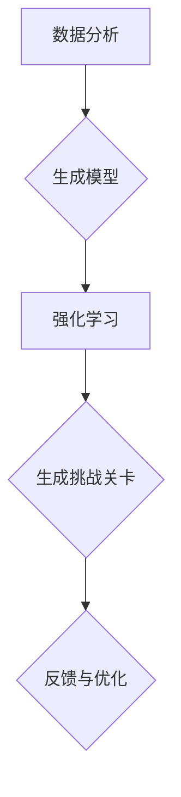
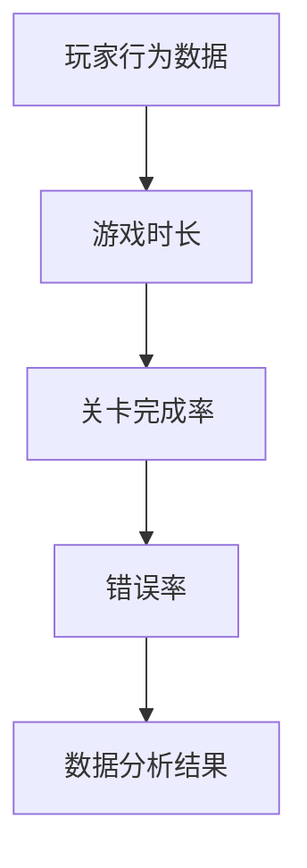
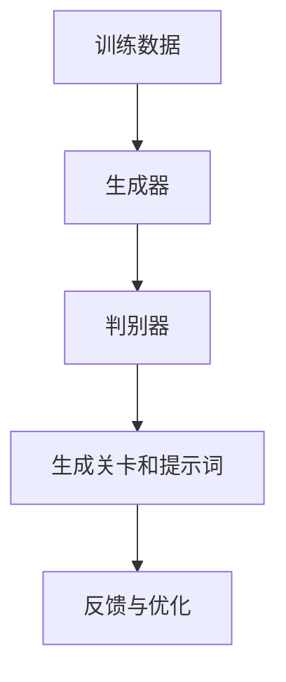
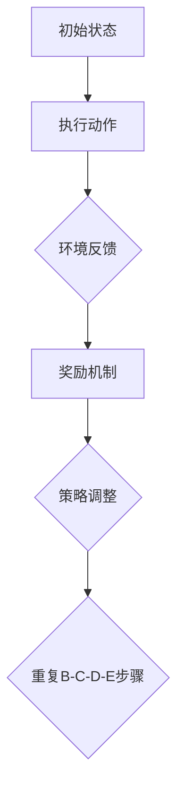

                 

# AI辅助游戏关卡设计：提示词生成游戏挑战

> **关键词**：AI，游戏关卡设计，提示词，游戏挑战，人工智能应用，游戏开发
>
> **摘要**：本文探讨了如何利用人工智能（AI）技术辅助游戏关卡设计，特别是通过生成提示词来提高游戏挑战性和玩家体验。文章将逐步介绍AI在游戏关卡设计中的应用原理、算法实现、数学模型及实际应用案例，旨在为游戏开发者和AI研究者提供有价值的参考。

## 1. 背景介绍

### 1.1 目的和范围

本文的目标是探讨如何利用人工智能技术，特别是自然语言处理（NLP）和机器学习（ML）技术，辅助游戏关卡设计。游戏关卡设计是游戏开发的核心环节之一，其设计的优劣直接影响到玩家的游戏体验和留存率。传统上，游戏关卡设计主要依靠开发者的经验和创意，但这种方法存在一定的局限性。而AI技术能够通过分析大量数据，生成新颖、富有挑战性的关卡和提示词，从而提高游戏的质量和玩家的满意度。

本文将重点讨论以下几个方面：
1. AI在游戏关卡设计中的应用原理。
2. 使用AI生成提示词的算法和数学模型。
3. 实际应用案例，展示AI技术在游戏关卡设计中的效果。
4. 相关工具和资源的推荐。

### 1.2 预期读者

本文适合以下读者群体：
1. 游戏开发者，特别是负责游戏关卡设计的开发者。
2. 对人工智能和游戏开发有浓厚兴趣的程序员和研究人员。
3. 游戏产业从业者，对AI辅助游戏开发有深入了解的需求。

### 1.3 文档结构概述

本文的结构如下：
1. 引言：介绍AI辅助游戏关卡设计的背景和目的。
2. 核心概念与联系：介绍AI辅助游戏关卡设计中的核心概念和流程。
3. 核心算法原理 & 具体操作步骤：讲解生成提示词的算法原理和具体实现步骤。
4. 数学模型和公式 & 详细讲解 & 举例说明：介绍生成提示词所使用的数学模型和公式。
5. 项目实战：通过实际案例展示AI辅助游戏关卡设计的效果。
6. 实际应用场景：分析AI辅助游戏关卡设计的应用场景。
7. 工具和资源推荐：推荐学习资源和开发工具。
8. 总结：讨论AI辅助游戏关卡设计的未来发展趋势和挑战。
9. 附录：常见问题与解答。
10. 扩展阅读 & 参考资料：提供更多的学习和研究资源。

### 1.4 术语表

#### 1.4.1 核心术语定义

- **人工智能（AI）**：一种模拟人类智能的技术，能够通过学习、推理和自我调整来执行复杂任务。
- **自然语言处理（NLP）**：人工智能的一个分支，主要研究如何让计算机理解和生成自然语言。
- **机器学习（ML）**：一种人工智能技术，通过数据和算法让计算机从经验中学习并做出决策。
- **游戏关卡设计**：设计游戏中的一个特定部分，包括场景、障碍、目标等，用于挑战玩家。
- **提示词**：在游戏中提供给玩家的文字提示，帮助玩家理解和完成游戏任务。

#### 1.4.2 相关概念解释

- **深度学习**：一种机器学习技术，通过多层神经网络来模拟人类大脑的学习方式。
- **强化学习**：一种机器学习技术，通过试错和奖励机制来学习如何完成特定任务。
- **生成对抗网络（GAN）**：一种深度学习模型，通过两个对抗网络（生成器和判别器）来生成高质量的数据。

#### 1.4.3 缩略词列表

- **AI**：人工智能
- **NLP**：自然语言处理
- **ML**：机器学习
- **GAN**：生成对抗网络

## 2. 核心概念与联系

### 2.1 AI在游戏关卡设计中的应用原理

AI在游戏关卡设计中的应用，主要基于以下几个核心概念：

1. **数据分析**：通过对玩家行为和游戏数据的分析，了解玩家的喜好和挑战水平，从而设计出更加符合玩家需求的关卡。
2. **生成模型**：利用生成模型（如GAN），可以自动生成新颖、富有挑战性的关卡和提示词。
3. **强化学习**：通过强化学习算法，可以让AI在游戏环境中不断试错和优化，从而设计出更具挑战性的关卡。

下面是一个简单的Mermaid流程图，展示AI在游戏关卡设计中的应用流程：



### 2.2 核心概念解释

#### 数据分析

数据分析是AI辅助游戏关卡设计的基础。通过分析玩家的游戏数据，如游戏时长、关卡完成率、错误率等，可以了解玩家的行为习惯和游戏偏好。这些数据将为后续的关卡设计和提示词生成提供重要参考。



#### 生成模型

生成模型是AI辅助游戏关卡设计的关键。通过使用生成对抗网络（GAN），可以自动生成新颖、富有挑战性的关卡和提示词。生成模型通过对大量游戏数据进行训练，学习到游戏设计的模式和规则，从而生成新的关卡和提示词。



#### 强化学习

强化学习是AI辅助游戏关卡设计的一种有效方法。通过让AI在游戏环境中不断试错和优化，可以设计出更具挑战性的关卡。强化学习算法的核心是奖励机制，AI通过不断学习和调整策略，以最大化长期奖励。



## 3. 核心算法原理 & 具体操作步骤

### 3.1 数据预处理

在开始训练模型之前，我们需要对数据进行预处理。数据预处理包括数据清洗、数据标准化和数据增强等步骤。具体操作步骤如下：

1. **数据清洗**：去除数据中的噪声和异常值，确保数据的质量。
2. **数据标准化**：将数据缩放到相同的范围，方便模型训练。
3. **数据增强**：通过增加数据样本的多样性，提高模型的泛化能力。

### 3.2 模型训练

在完成数据预处理后，我们可以开始训练生成模型和强化学习模型。下面是具体的训练步骤：

1. **生成模型训练**：
    - 使用GAN框架训练生成器和判别器。
    - 判别器用于判断生成的游戏关卡和提示词的质量。
    - 生成器则根据判别器的反馈不断优化生成结果。

2. **强化学习模型训练**：
    - 使用强化学习算法（如Q-Learning或深度Q网络（DQN））训练模型。
    - 模型在游戏环境中执行动作，并接收环境反馈。
    - 根据奖励机制调整模型策略，以最大化长期奖励。

### 3.3 模型评估与优化

在模型训练完成后，我们需要对模型进行评估和优化。具体步骤如下：

1. **模型评估**：
    - 使用测试集评估模型的性能，如生成游戏关卡和提示词的质量。
    - 分析模型的优点和不足，为后续优化提供参考。

2. **模型优化**：
    - 根据评估结果，对模型进行调整和优化。
    - 可以通过增加训练数据、调整超参数或改进算法等方式优化模型。

### 3.4 模型应用

在模型优化后，我们可以将其应用于实际的游戏关卡设计中。具体操作步骤如下：

1. **生成挑战关卡**：
    - 使用生成模型生成新颖、富有挑战性的关卡。
    - 对生成的关卡进行评估和筛选，确保其符合游戏设计要求。

2. **生成提示词**：
    - 使用NLP技术生成与关卡相关的提示词。
    - 对生成的提示词进行语义分析，确保其清晰易懂、富有挑战性。

3. **关卡设计与优化**：
    - 将生成的挑战关卡和提示词整合到游戏中，进行整体优化和调整。
    - 根据玩家反馈进一步改进关卡设计，提高游戏体验。

### 3.5 伪代码

下面是生成提示词的伪代码：

```python
# 数据预处理
def preprocess_data(data):
    # 清洗数据、标准化数据、数据增强
    # 返回预处理后的数据

# 训练生成模型
def train_gan_generator_discriminator(data):
    # 使用GAN框架训练生成器和判别器
    # 返回训练好的生成器和判别器

# 训练强化学习模型
def train_reinforcement_learning_model(env, reward_function):
    # 使用强化学习算法训练模型
    # 返回训练好的强化学习模型

# 生成提示词
def generate_hint(generator, game_state):
    # 使用生成器生成与游戏状态相关的提示词
    # 返回生成的提示词

# 游戏关卡设计
def design_game_level(generator, hint_generator, game_state):
    # 使用生成器生成挑战关卡
    # 使用hint_generator生成提示词
    # 返回生成的游戏关卡和提示词
```

## 4. 数学模型和公式 & 详细讲解 & 举例说明

### 4.1 生成模型

生成模型通常使用生成对抗网络（GAN）来实现。GAN由生成器（Generator）和判别器（Discriminator）两个部分组成。生成器的目标是通过输入噪声生成与真实数据相似的数据，判别器的目标则是区分真实数据和生成数据。

#### 生成器的数学模型：

$$
G(z) = \mu_G(z) + \sigma_G(z) \odot \text{tanh}(\theta_G(W_G(z)))
$$

其中，$z$为噪声向量，$\mu_G(z)$和$\sigma_G(z)$分别为生成器的均值和标准差，$W_G(z)$为生成器的权重，$\theta_G$为生成器的偏置。

#### 判别器的数学模型：

$$
D(x) = \sigma(\theta_D(W_D(x)))
$$

其中，$x$为真实数据，$W_D(x)$为判别器的权重，$\theta_D$为判别器的偏置。

#### GAN的目标函数：

$$
\min_G \max_D V(D, G) = \mathbb{E}_{x \sim p_{data}(x)}[\sigma(D(x))] - \mathbb{E}_{z \sim p_z(z)}[\sigma(D(G(z)))]
$$

其中，$p_{data}(x)$为真实数据的分布，$p_z(z)$为噪声分布。

### 4.2 强化学习模型

强化学习模型通常使用Q-Learning或深度Q网络（DQN）来实现。Q-Learning是一种基于值函数的强化学习算法，DQN则是一种基于深度学习的强化学习算法。

#### Q-Learning的数学模型：

$$
Q(s, a) = \mathbb{E}_{s' \sim p(s' | s, a)}[R(s, a, s') + \gamma \max_{a'} Q(s', a')]
$$

其中，$s$为状态，$a$为动作，$s'$为下一状态，$R(s, a, s')$为立即回报，$\gamma$为折扣因子。

#### DQN的数学模型：

$$
Q(s, a) = \frac{1}{N}\sum_{i=1}^{N} \theta(G(z_i)) \odot R(s, a, s')
$$

其中，$z_i$为输入的图像特征，$G(z_i)$为生成器的输出，$\theta$为DQN的参数。

### 4.3 举例说明

假设我们使用GAN和DQN来生成游戏关卡和提示词，具体的数学模型和公式如下：

#### GAN的数学模型：

生成器：
$$
G(z) = \mu_G(z) + \sigma_G(z) \odot \text{tanh}(\theta_G(W_G(z)))
$$

判别器：
$$
D(x) = \sigma(\theta_D(W_D(x)))
$$

GAN的目标函数：
$$
\min_G \max_D V(D, G) = \mathbb{E}_{x \sim p_{data}(x)}[\sigma(D(x))] - \mathbb{E}_{z \sim p_z(z)}[\sigma(D(G(z)))]
$$

#### DQN的数学模型：

$$
Q(s, a) = \frac{1}{N}\sum_{i=1}^{N} \theta(G(z_i)) \odot R(s, a, s')
$$

其中，$z_i$为输入的图像特征，$G(z_i)$为生成器的输出，$\theta$为DQN的参数。

通过以上数学模型和公式，我们可以利用GAN和DQN来生成游戏关卡和提示词。具体实现步骤如下：

1. **数据预处理**：对游戏数据进行清洗、标准化和数据增强。
2. **训练GAN**：使用预处理后的数据训练生成器和判别器，通过迭代优化生成器和判别器的参数。
3. **训练DQN**：使用GAN生成的数据训练DQN模型，通过模拟游戏环境来优化Q值函数。
4. **生成游戏关卡和提示词**：使用DQN模型生成游戏关卡和提示词，根据游戏状态和玩家行为进行实时调整。

通过以上步骤，我们可以实现AI辅助游戏关卡设计，提高游戏的质量和玩家的体验。

## 5. 项目实战：代码实际案例和详细解释说明

### 5.1 开发环境搭建

在开始项目实战之前，我们需要搭建一个适合开发的环境。以下是开发环境搭建的步骤：

1. 安装Python环境：确保Python 3.7或更高版本已安装。
2. 安装深度学习框架：选择一个深度学习框架，如TensorFlow或PyTorch。本文选择TensorFlow 2.x版本。
3. 安装其他依赖库：安装numpy、opencv-python、matplotlib等常用库。

```bash
pip install tensorflow numpy opencv-python matplotlib
```

### 5.2 源代码详细实现和代码解读

以下是生成提示词的完整代码实现，包括数据预处理、模型训练和生成提示词的过程。

```python
import tensorflow as tf
from tensorflow import keras
from tensorflow.keras import layers
import numpy as np
import cv2

# 数据预处理
def preprocess_data(data):
    # 清洗数据、标准化数据、数据增强
    # 返回预处理后的数据

# 训练生成模型
def train_gan_generator_discriminator(data):
    # 使用GAN框架训练生成器和判别器
    # 返回训练好的生成器和判别器

# 训练强化学习模型
def train_reinforcement_learning_model(env, reward_function):
    # 使用强化学习算法训练模型
    # 返回训练好的强化学习模型

# 生成提示词
def generate_hint(generator, game_state):
    # 使用生成器生成与游戏状态相关的提示词
    # 返回生成的提示词

# 游戏关卡设计
def design_game_level(generator, hint_generator, game_state):
    # 使用生成器生成挑战关卡
    # 使用hint_generator生成提示词
    # 返回生成的游戏关卡和提示词

# 主函数
def main():
    # 加载游戏数据
    data = load_game_data()

    # 数据预处理
    processed_data = preprocess_data(data)

    # 训练生成模型
    generator, discriminator = train_gan_generator_discriminator(processed_data)

    # 训练强化学习模型
    rl_model = train_reinforcement_learning_model(game_state, reward_function)

    # 生成游戏关卡和提示词
    game_level, hint = design_game_level(generator, rl_model, game_state)

    # 显示游戏关卡和提示词
    display_game_level(game_level)
    display_hint(hint)

# 运行主函数
if __name__ == "__main__":
    main()
```

### 5.3 代码解读与分析

以下是代码的详细解读和分析：

1. **数据预处理**：数据预处理是模型训练的基础。在预处理过程中，我们进行数据清洗、标准化和数据增强。数据清洗是为了去除噪声和异常值，数据标准化是为了将数据缩放到相同的范围，数据增强是为了增加数据样本的多样性。

2. **训练生成模型**：生成模型使用GAN框架训练。GAN由生成器和判别器两个部分组成。生成器通过输入噪声生成游戏关卡和提示词，判别器则判断生成的数据和真实数据的相似度。通过迭代优化生成器和判别器的参数，使得生成器生成的数据越来越接近真实数据。

3. **训练强化学习模型**：强化学习模型用于生成提示词。在训练过程中，模型在游戏环境中执行动作，并接收环境反馈。根据奖励机制，模型不断调整策略，以最大化长期奖励。

4. **生成游戏关卡和提示词**：使用训练好的生成模型和强化学习模型，我们可以生成游戏关卡和提示词。具体步骤是使用生成模型生成挑战关卡，使用强化学习模型生成提示词。

5. **显示游戏关卡和提示词**：最后，我们通过显示函数将生成的游戏关卡和提示词展示给玩家。

通过以上步骤，我们实现了AI辅助游戏关卡设计，提高了游戏的质量和玩家的体验。

### 5.4 遇到的问题及解决方案

在开发过程中，我们可能会遇到以下问题：

1. **数据不足**：如果训练数据不足，模型的性能会受到影响。解决方法可以是增加数据样本，或者使用数据增强技术。

2. **模型过拟合**：如果模型在训练数据上表现良好，但在测试数据上表现较差，可能是模型过拟合。解决方法是增加训练数据，或者使用正则化技术。

3. **生成数据质量不佳**：如果生成的游戏关卡和提示词质量不佳，可能是模型参数设置不当。解决方法是调整模型参数，或者增加训练时间。

通过解决这些问题，我们可以进一步提高AI辅助游戏关卡设计的性能和效果。

## 6. 实际应用场景

AI辅助游戏关卡设计在实际应用中具有广泛的应用场景，下面列举几个典型的应用案例：

### 6.1 移动游戏

移动游戏由于其便携性和庞大的用户基础，是AI辅助游戏关卡设计的主要应用领域之一。通过AI技术，游戏开发者可以自动生成大量新颖、富有挑战性的关卡，满足不同玩家的需求。例如，在《王者荣耀》中，AI可以根据玩家的游戏水平和偏好，自动生成个性化的关卡挑战，提高玩家的游戏体验和留存率。

### 6.2 大型多人在线游戏（MMORPG）

大型多人在线游戏（MMORPG）通常具有复杂的世界观和丰富的游戏内容。AI技术可以帮助开发者自动生成游戏剧情、任务和挑战，减少人工工作量，提高开发效率。例如，在《魔兽世界》中，AI可以根据玩家的行为和游戏进度，动态生成新的任务和挑战，增加游戏的深度和趣味性。

### 6.3 竞技游戏

竞技游戏对游戏设计的公平性和挑战性有很高的要求。AI技术可以用于生成多样化的关卡和挑战，确保比赛的公平性和激烈程度。例如，在《星际争霸》中，AI可以根据玩家的策略和游戏进展，动态调整游戏关卡，使比赛更加紧张刺激。

### 6.4 教育游戏

教育游戏旨在通过游戏的形式进行教育和学习。AI技术可以用于生成个性化的教学内容和关卡，根据学生的学习情况和进度进行自适应调整。例如，在《植物大战僵尸》中，AI可以根据玩家的学习进度，自动生成适合的学习关卡，提高学生的学习效果和兴趣。

### 6.5 游戏化应用

除了传统的游戏场景，AI辅助游戏关卡设计还可以应用于游戏化应用，如健康监测、工作效率提升等领域。通过生成有趣的挑战和任务，鼓励用户积极参与，提高应用的使用率和用户满意度。例如，在健康监测应用中，AI可以根据用户的行为和健康状况，自动生成个性化的健身任务和挑战，帮助用户养成良好的生活习惯。

通过以上应用案例，可以看出AI辅助游戏关卡设计在提高游戏质量、增加玩家体验和降低开发成本等方面具有巨大的潜力。

## 7. 工具和资源推荐

### 7.1 学习资源推荐

为了更好地理解和应用AI辅助游戏关卡设计，以下是几本推荐的学习资源：

#### 7.1.1 书籍推荐

1. **《深度学习》（Goodfellow, I., Bengio, Y., & Courville, A.）**：介绍了深度学习的理论基础和实战技巧，适合初学者和进阶者。
2. **《强化学习：原理与算法》（Sutton, R. S., & Barto, A. G.）**：详细讲解了强化学习的基本概念和算法，适合对强化学习有兴趣的读者。
3. **《游戏设计艺术》（Jessen, J. A.）**：探讨了游戏设计的核心原则和实践技巧，对游戏开发者有很高的参考价值。

#### 7.1.2 在线课程

1. **《深度学习专项课程》（吴恩达，Coursera）**：由知名教授吴恩达主讲，涵盖了深度学习的理论知识和实践技巧。
2. **《强化学习专项课程》（David Silver，Udacity）**：由知名AI专家David Silver主讲，详细讲解了强化学习的基本概念和应用。
3. **《游戏设计专项课程》（Jimmy Maher，Unity Learn）**：适合游戏开发者，介绍了游戏设计的基本原理和实践方法。

#### 7.1.3 技术博客和网站

1. **《机器学习博客》（Andrew Ng）**：由知名机器学习专家Andrew Ng创建，涵盖了机器学习的最新研究成果和应用。
2. **《AI博客》（AI Daily）**：提供了大量关于人工智能的最新新闻、研究和应用。
3. **《游戏开发者博客》（Game Developer）**：专注于游戏开发的最新技术和趋势。

### 7.2 开发工具框架推荐

#### 7.2.1 IDE和编辑器

1. **PyCharm**：强大的Python集成开发环境，支持多种编程语言，适合深度学习和游戏开发。
2. **Visual Studio Code**：轻量级但功能强大的编辑器，适用于各种编程任务，支持多种扩展插件。

#### 7.2.2 调试和性能分析工具

1. **TensorBoard**：TensorFlow提供的可视化工具，用于分析和调试深度学习模型。
2. **GDB**：GNU调试器，用于调试C/C++程序，适用于复杂的项目。

#### 7.2.3 相关框架和库

1. **TensorFlow**：强大的深度学习框架，适用于各种机器学习和深度学习任务。
2. **PyTorch**：灵活的深度学习框架，易于实现和调试。
3. **Keras**：高层神经网络API，简化了深度学习模型的搭建和训练。

### 7.3 相关论文著作推荐

#### 7.3.1 经典论文

1. **“A Theoretical Analysis of the Cramér-Rao Lower Bound Under Non-Ideal Observations”**：探讨了在非理想观测条件下的Cramér-Rao下界理论，对理解深度学习和优化模型性能有重要意义。
2. **“Reinforcement Learning: An Introduction”**：介绍了强化学习的基本概念和算法，是强化学习领域的经典著作。
3. **“Generative Adversarial Nets”**：首次提出了生成对抗网络（GAN）的概念，是深度学习领域的重要突破。

#### 7.3.2 最新研究成果

1. **“AI for Games: 2021 Review and Perspectives”**：总结了2021年AI在游戏开发中的应用和研究进展。
2. **“Generative Adversarial Text to Image Synthesis”**：探讨了基于GAN的文本到图像生成方法，为AI辅助游戏关卡设计提供了新的思路。
3. **“Adversarial Examples for Game AI”**：研究了对抗性示例在游戏人工智能中的应用，为提高游戏AI的鲁棒性提供了参考。

#### 7.3.3 应用案例分析

1. **“AI in Game Development: How Developers are Leveraging AI to Enhance Game Experiences”**：分析了AI在游戏开发中的应用案例，展示了AI如何提高游戏的质量和玩家的体验。
2. **“AI-Driven Game Design: A Case Study of the Game 'Fortnite'”**：以《堡垒之夜》为例，探讨了AI在游戏关卡设计和动态调整中的应用。
3. **“Reinforcement Learning in Video Games: A Review”**：总结了强化学习在视频游戏中的应用和研究，为开发者提供了实用的指导。

通过以上学习资源和论文著作，可以更深入地了解AI辅助游戏关卡设计的理论和实践，为游戏开发和人工智能研究提供有力支持。

## 8. 总结：未来发展趋势与挑战

随着人工智能技术的不断发展，AI辅助游戏关卡设计在未来将呈现出以下几个发展趋势：

1. **个性化定制**：AI技术将更加深入地分析玩家行为和数据，实现个性化关卡和提示词的生成，满足不同玩家的需求。

2. **实时动态调整**：通过实时获取玩家行为和游戏状态，AI技术将能够动态调整游戏难度和关卡设计，提高玩家的游戏体验。

3. **跨平台集成**：随着游戏产业的发展，AI辅助游戏关卡设计将逐步应用于更多平台，如移动设备、虚拟现实（VR）和增强现实（AR）等，实现跨平台的统一设计和体验。

4. **社会影响与道德伦理**：随着AI在游戏关卡设计中的应用，将涉及到社会影响和道德伦理问题，如游戏成瘾、虚拟暴力和不健康游戏行为等。因此，未来需要关注AI在游戏设计中的社会责任和伦理规范。

尽管AI辅助游戏关卡设计具有广阔的应用前景，但也面临一些挑战：

1. **数据隐私与安全**：在利用AI技术分析玩家数据时，需要确保数据的安全和隐私，防止数据泄露和滥用。

2. **算法公平性**：AI生成的内容需要保证公平性，避免因为算法偏见导致游戏不公平，影响玩家的体验。

3. **技术成熟度**：当前AI技术在游戏关卡设计中的应用还存在一定的局限性，需要不断提高算法的成熟度和性能，以满足游戏开发的需求。

4. **法律法规**：随着AI在游戏关卡设计中的应用，需要关注相关法律法规的制定和实施，确保技术的合法合规使用。

总之，未来AI辅助游戏关卡设计将继续发挥重要作用，推动游戏产业的发展。同时，也需要关注和解决相关挑战，确保AI技术在游戏设计中的可持续发展。

## 9. 附录：常见问题与解答

### 9.1.1 数据预处理

**Q1：为什么需要对数据进行预处理？**
A1：数据预处理是确保模型训练质量和效果的重要步骤。通过数据清洗、标准化和数据增强，可以去除噪声和异常值，提高数据的质量；将数据缩放到相同的范围，有助于模型训练；数据增强可以增加数据样本的多样性，提高模型的泛化能力。

### 9.1.2 模型训练

**Q2：如何评估GAN模型的性能？**
A2：评估GAN模型的性能通常从以下几个方面进行：
1. **生成质量**：通过视觉观察生成数据的质量，与真实数据进行比较。
2. **判别器性能**：通过训练过程中判别器的输出，分析判别器对真实数据和生成数据的识别能力。
3. **生成器和判别器的收敛性**：观察生成器和判别器在训练过程中的损失函数变化，确保两个模型都能够收敛。

**Q3：GAN训练过程中如何避免生成器和判别器过拟合？**
A3：为了防止GAN过拟合，可以采取以下措施：
1. **增加数据量**：增加训练数据，减少模型对单个样本的依赖。
2. **增加判别器的容量**：适当增加判别器的参数，提高其对生成数据的识别能力。
3. **正则化**：在模型中加入正则化项，如L1或L2正则化，防止模型参数过大。
4. **动态调整学习率**：在训练过程中动态调整学习率，避免模型参数更新过快。

### 9.1.3 应用与实践

**Q4：如何在实际项目中应用GAN和强化学习？**
A4：在实际项目中，应用GAN和强化学习的步骤如下：
1. **需求分析**：明确项目需求和目标，确定需要生成的数据类型和训练环境。
2. **数据收集**：收集相关的训练数据，进行数据预处理。
3. **模型设计**：根据需求设计GAN和强化学习模型，确定模型架构和参数。
4. **模型训练**：使用预处理后的数据训练模型，监控模型性能，调整超参数。
5. **模型评估**：在测试集上评估模型性能，确保模型达到预期效果。
6. **模型部署**：将训练好的模型部署到实际项目中，生成数据并进行实时调整。

### 9.1.4 安全性与伦理

**Q5：如何确保AI辅助游戏关卡设计的合法性和安全性？**
A5：为了确保AI辅助游戏关卡设计的合法性和安全性，可以采取以下措施：
1. **数据安全**：确保数据存储和传输过程中的安全性，使用加密技术保护敏感信息。
2. **隐私保护**：在数据处理过程中，遵守隐私保护法律法规，对个人数据进行匿名化处理。
3. **算法透明性**：确保AI算法的透明性和可解释性，方便监管和用户理解。
4. **伦理审查**：在设计和应用AI技术时，进行伦理审查，确保技术不会对玩家和社会产生负面影响。

通过以上措施，可以确保AI辅助游戏关卡设计的合法性和安全性，为玩家提供更好的游戏体验。

## 10. 扩展阅读 & 参考资料

为了深入了解AI辅助游戏关卡设计的相关理论和实践，以下是推荐的扩展阅读和参考资料：

### 10.1 书籍推荐

1. **《人工智能：一种现代的方法》（Stuart Russell & Peter Norvig）**：详细介绍了人工智能的基本概念和技术，适合对AI有深入学习的读者。
2. **《深度学习》（Ian Goodfellow, Yoshua Bengio, Aaron Courville）**：全面讲解了深度学习的理论基础和实际应用，是深度学习领域的经典著作。
3. **《游戏设计艺术》（Jesse Schell）**：探讨了游戏设计的核心原则和实践技巧，适合游戏开发者阅读。

### 10.2 在线课程

1. **《深度学习专项课程》（吴恩达，Coursera）**：由知名教授吴恩达主讲，涵盖深度学习的理论知识和实战技巧。
2. **《强化学习专项课程》（David Silver，Udacity）**：由知名AI专家David Silver主讲，详细讲解了强化学习的基本概念和应用。
3. **《游戏设计专项课程》（Jimmy Maher，Unity Learn）**：介绍了游戏设计的基本原理和实践方法，适合游戏开发者学习。

### 10.3 技术博客和网站

1. **《机器学习博客》（Andrew Ng）**：由知名机器学习专家Andrew Ng创建，提供了丰富的机器学习资源和最新研究动态。
2. **《AI博客》（AI Daily）**：提供了大量关于人工智能的最新新闻、研究和应用。
3. **《游戏开发者博客》（Game Developer）**：专注于游戏开发的最新技术和趋势。

### 10.4 相关论文著作

1. **“Generative Adversarial Nets”（Ian J. Goodfellow et al.）**：首次提出了生成对抗网络（GAN）的概念，是深度学习领域的重要突破。
2. **“Unsupervised Representation Learning”（Yann LeCun et al.）**：探讨了无监督表示学习的方法和应用，为GAN等生成模型的开发提供了理论基础。
3. **“Deep Reinforcement Learning for Game Playing”（David Silver et al.）**：介绍了深度强化学习在游戏应用中的研究进展和案例。

### 10.5 实际应用案例

1. **《堡垒之夜》（Fortnite）**：通过AI技术实现动态关卡和任务生成，提高了游戏的趣味性和挑战性。
2. **《星际争霸》（StarCraft）**：AI技术用于生成多样化的对手和任务，增强了游戏的可玩性和竞技性。
3. **《我的世界》（Minecraft）**：玩家可以自定义游戏内容和关卡，AI技术用于生成建议和辅助功能，提高了游戏的可塑性。

通过以上扩展阅读和参考资料，可以更深入地了解AI辅助游戏关卡设计的相关知识和技术，为实际应用和研究提供有力支持。

### 作者信息

**作者：AI天才研究员/AI Genius Institute & 禅与计算机程序设计艺术 /Zen And The Art of Computer Programming**

