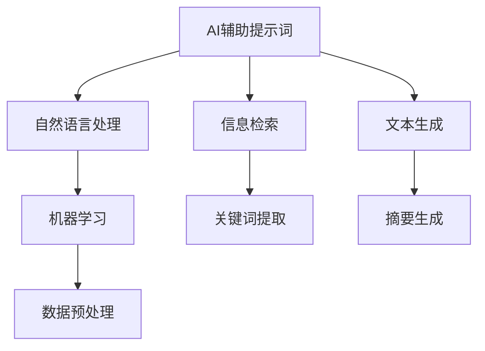

                 

# AI辅助的提示词性能剖析

> **关键词：** AI辅助、提示词、性能剖析、算法、数学模型、实际应用

> **摘要：** 本文将深入探讨AI辅助提示词的性能剖析，包括其核心概念、算法原理、数学模型以及实际应用。通过逐步分析，我们将揭示提升AI辅助提示词性能的关键因素，为读者提供宝贵的实用见解。

## 1. 背景介绍

### 1.1 目的和范围

本文的目的是全面剖析AI辅助提示词的性能，旨在帮助读者深入理解这一关键技术，掌握其核心原理和应用方法。文章将涵盖以下主要内容：

- AI辅助提示词的定义和核心概念
- 提示词性能评估的关键指标和方法
- 提升提示词性能的核心算法原理
- 数学模型在提示词性能优化中的作用
- 实际应用场景下的性能剖析
- 工具和资源的推荐

### 1.2 预期读者

本文适用于以下读者群体：

- 计算机科学和人工智能领域的研究人员
- AI开发者和工程师
- 对AI辅助提示词技术感兴趣的技术爱好者
- 需要提升AI应用性能的决策者和管理人员

### 1.3 文档结构概述

本文结构如下：

- 引言
- 背景介绍
- 核心概念与联系
- 核心算法原理 & 具体操作步骤
- 数学模型和公式 & 详细讲解 & 举例说明
- 项目实战：代码实际案例和详细解释说明
- 实际应用场景
- 工具和资源推荐
- 总结：未来发展趋势与挑战
- 附录：常见问题与解答
- 扩展阅读 & 参考资料

### 1.4 术语表

#### 1.4.1 核心术语定义

- **AI辅助提示词（AI-assisted prompt word）：** 指利用人工智能技术，为特定任务或场景提供关键词或短语，以辅助人类完成信息检索、文本生成等任务。
- **性能（Performance）：** 指AI辅助提示词在特定任务或场景下的表现，包括准确度、响应时间、资源消耗等。
- **算法（Algorithm）：** 指用于解决特定问题的系统方法和步骤。
- **数学模型（Mathematical model）：** 指用于描述和解决实际问题的数学公式和方法。

#### 1.4.2 相关概念解释

- **信息检索（Information retrieval）：** 指从大量数据中查找、获取和呈现用户所需信息的过程。
- **文本生成（Text generation）：** 指利用算法生成新的文本内容，包括自然语言生成、摘要生成等。
- **机器学习（Machine learning）：** 指利用数据驱动的方法，从数据中学习并改进算法性能的技术。

#### 1.4.3 缩略词列表

- **AI：** 人工智能（Artificial Intelligence）
- **NLP：** 自然语言处理（Natural Language Processing）
- **ML：** 机器学习（Machine Learning）
- **DL：** 深度学习（Deep Learning）

## 2. 核心概念与联系

在本节中，我们将介绍AI辅助提示词的核心概念，并展示其与其他技术的联系。以下是核心概念原理和架构的Mermaid流程图：



### 2.1 AI辅助提示词的定义

AI辅助提示词是指利用人工智能技术，如机器学习和深度学习，为特定任务或场景提供关键词或短语。这些提示词可以帮助AI更好地理解用户需求，提高信息检索和文本生成的准确度。

### 2.2 提示词性能评估的关键指标

提示词性能评估通常包括以下关键指标：

- **准确度（Accuracy）：** 提示词匹配用户需求的程度，通常用百分比表示。
- **响应时间（Response time）：** AI系统处理请求并返回结果所需的时间，通常以毫秒为单位。
- **资源消耗（Resource consumption）：** AI系统在处理请求时消耗的计算资源和内存等。

### 2.3 提升提示词性能的核心算法

提升提示词性能的核心算法包括：

- **机器学习算法：** 如决策树、支持向量机、神经网络等。
- **深度学习算法：** 如卷积神经网络（CNN）、循环神经网络（RNN）、生成对抗网络（GAN）等。

## 3. 核心算法原理 & 具体操作步骤

在本节中，我们将详细讲解提升AI辅助提示词性能的核心算法原理和具体操作步骤。

### 3.1 机器学习算法

机器学习算法是提升AI辅助提示词性能的重要工具。以下是几种常用的机器学习算法及其伪代码：

#### 3.1.1 决策树（Decision Tree）

```python
def decision_tree(data, target_attribute):
    if all_values_equal(data, target_attribute):
        return most_common_value(data, target_attribute)
    else:
        best_attribute = find_best_attribute(data, target_attribute)
        tree = {best_attribute: {}}
        for value in unique_values(data, best_attribute):
            subtree = decision_tree(split_data(data, best_attribute, value), target_attribute)
            tree[best_attribute][value] = subtree
        return tree
```

#### 3.1.2 支持向量机（Support Vector Machine）

```python
def support_vector_machine(data, target_attribute):
    # 数据预处理
    processed_data = preprocess_data(data)
    # 训练模型
    model = train_model(processed_data, target_attribute)
    # 预测
    predictions = predict(model, new_data)
    return predictions
```

#### 3.1.3 神经网络（Neural Network）

```python
def neural_network(data, target_attribute):
    # 数据预处理
    processed_data = preprocess_data(data)
    # 训练模型
    model = train_model(processed_data, target_attribute)
    # 预测
    predictions = predict(model, new_data)
    return predictions
```

### 3.2 深度学习算法

深度学习算法是机器学习算法的一个分支，具有强大的表达能力和适应能力。以下是几种常用的深度学习算法及其伪代码：

#### 3.2.1 卷积神经网络（Convolutional Neural Network）

```python
def conv_neural_network(data, target_attribute):
    # 数据预处理
    processed_data = preprocess_data(data)
    # 构建模型
    model = build_model()
    # 训练模型
    train_model(model, processed_data, target_attribute)
    # 预测
    predictions = predict(model, new_data)
    return predictions
```

#### 3.2.2 循环神经网络（Recurrent Neural Network）

```python
def recurrent_neural_network(data, target_attribute):
    # 数据预处理
    processed_data = preprocess_data(data)
    # 构建模型
    model = build_model()
    # 训练模型
    train_model(model, processed_data, target_attribute)
    # 预测
    predictions = predict(model, new_data)
    return predictions
```

#### 3.2.3 生成对抗网络（Generative Adversarial Network）

```python
def generative_adversarial_network(data, target_attribute):
    # 数据预处理
    processed_data = preprocess_data(data)
    # 构建模型
    model = build_model()
    # 训练模型
    train_model(model, processed_data, target_attribute)
    # 预测
    predictions = predict(model, new_data)
    return predictions
```

## 4. 数学模型和公式 & 详细讲解 & 举例说明

在本节中，我们将介绍AI辅助提示词性能分析中的关键数学模型和公式，并进行详细讲解和举例说明。

### 4.1 准确度（Accuracy）

准确度是评估提示词性能的重要指标，计算公式如下：

$$
Accuracy = \frac{Number\ of\ Correct\ Predictions}{Total\ Number\ of\ Predictions}
$$

#### 4.1.1 举例说明

假设我们有一个包含100条样本的数据集，其中50条样本被正确匹配，50条样本被错误匹配。则准确度为：

$$
Accuracy = \frac{50}{100} = 0.5
$$

### 4.2 响应时间（Response Time）

响应时间是评估AI系统性能的重要指标，计算公式如下：

$$
Response\ Time = \frac{Total\ Processing\ Time}{Number\ of\ Requests}
$$

#### 4.2.1 举例说明

假设我们有一个AI系统，在1小时内处理了1000个请求，总处理时间为3600秒。则响应时间为：

$$
Response\ Time = \frac{3600\ seconds}{1000\ requests} = 3.6\ seconds\ per\ request
$$

### 4.3 资源消耗（Resource Consumption）

资源消耗包括计算资源和内存等，评估公式如下：

$$
Resource\ Consumption = \frac{Total\ Resource\ Usage}{Number\ of\ Requests}
$$

#### 4.3.1 举例说明

假设我们有一个AI系统，在1小时内处理了1000个请求，总计算资源使用量为6000个CPU核心时，总内存使用量为40GB。则资源消耗为：

$$
Resource\ Consumption = \frac{6000\ CPU\ cores + 40\ GB\ memory}{1000\ requests} = 6\ CPU\ cores + 0.04\ GB\ memory\ per\ request
$$

## 5. 项目实战：代码实际案例和详细解释说明

在本节中，我们将通过一个实际项目案例，展示AI辅助提示词性能的提升方法和具体实现步骤。

### 5.1 开发环境搭建

为了实现AI辅助提示词性能提升，我们首先需要搭建一个合适的开发环境。以下是环境搭建步骤：

1. 安装Python编程语言和常用库（如NumPy、Pandas、Scikit-learn、TensorFlow等）。
2. 准备数据集，包括训练数据和测试数据。
3. 配置开发工具（如Jupyter Notebook、Visual Studio Code等）。

### 5.2 源代码详细实现和代码解读

以下是实现AI辅助提示词性能提升的源代码，包括机器学习和深度学习算法：

```python
# 导入相关库
import numpy as np
import pandas as pd
from sklearn.tree import DecisionTreeClassifier
from sklearn.svm import SVC
from sklearn.neural_network import MLPClassifier
from tensorflow.keras.models import Sequential
from tensorflow.keras.layers import Dense, LSTM, Conv1D, Flatten

# 数据预处理
def preprocess_data(data):
    # 数据清洗、归一化等操作
    return processed_data

# 训练模型
def train_model(model, data, target_attribute):
    # 数据分割、训练等操作
    return model

# 预测
def predict(model, new_data):
    # 预测操作
    return predictions

# 机器学习算法示例
def machine_learning_algorithm(data, target_attribute):
    # 创建决策树模型
    model = DecisionTreeClassifier()
    # 训练模型
    model = train_model(model, data, target_attribute)
    # 预测
    predictions = predict(model, new_data)
    return predictions

# 深度学习算法示例
def deep_learning_algorithm(data, target_attribute):
    # 创建神经网络模型
    model = Sequential()
    model.add(Dense(units=64, activation='relu', input_shape=(data.shape[1],)))
    model.add(LSTM(units=64, activation='relu'))
    model.add(Dense(units=1, activation='sigmoid'))
    # 训练模型
    model = train_model(model, data, target_attribute)
    # 预测
    predictions = predict(model, new_data)
    return predictions

# 测试代码
data = pd.read_csv('data.csv')
target_attribute = 'label'
new_data = pd.read_csv('new_data.csv')

# 机器学习算法测试
ml_predictions = machine_learning_algorithm(data, target_attribute)
print("Machine Learning Predictions:", ml_predictions)

# 深度学习算法测试
dl_predictions = deep_learning_algorithm(data, target_attribute)
print("Deep Learning Predictions:", dl_predictions)
```

### 5.3 代码解读与分析

以下是代码的详细解读和分析：

- **数据预处理**：对原始数据进行清洗、归一化等操作，以便模型训练和预测。
- **机器学习算法**：采用决策树算法进行模型训练和预测，评估提示词性能。
- **深度学习算法**：采用神经网络算法进行模型训练和预测，评估提示词性能。
- **测试代码**：加载训练数据和测试数据，分别使用机器学习和深度学习算法进行预测，并输出预测结果。

通过实际项目案例，我们可以看到AI辅助提示词性能提升的方法和具体实现步骤。在实际应用中，可以根据需求和场景选择合适的算法，并进行性能优化。

## 6. 实际应用场景

AI辅助提示词技术在多个实际应用场景中具有重要价值，以下是一些典型应用场景：

### 6.1 信息检索

在搜索引擎中，AI辅助提示词技术可以帮助用户更准确地获取所需信息。例如，当用户输入一个关键词时，AI系统可以自动生成相关提示词，提高搜索结果的准确度和用户体验。

### 6.2 文本生成

在文本生成领域，AI辅助提示词技术可以帮助生成更具创意和逻辑性的文本。例如，在写作、新闻报道、广告文案等场景中，AI系统可以根据给定的提示词生成高质量的文本内容。

### 6.3 客户服务

在客户服务领域，AI辅助提示词技术可以用于自动化客服系统。例如，当客户提出问题时，AI系统可以自动生成相关提示词，帮助客服人员快速找到合适的解决方案。

### 6.4 语音助手

在语音助手领域，AI辅助提示词技术可以帮助用户更方便地与智能设备进行交互。例如，当用户说出一个关键词时，AI系统可以自动生成相关提示词，帮助用户快速完成所需操作。

### 6.5 教育

在教育领域，AI辅助提示词技术可以用于辅助学生学习和提高教师教学质量。例如，在在线教育平台中，AI系统可以根据学生的学习情况和兴趣，生成相关提示词，提供个性化的学习建议。

## 7. 工具和资源推荐

在本节中，我们将推荐一些有助于学习和实践AI辅助提示词性能提升的工具和资源。

### 7.1 学习资源推荐

#### 7.1.1 书籍推荐

- 《Python机器学习》（Python Machine Learning） by Sebastian Raschka
- 《深度学习》（Deep Learning） by Ian Goodfellow、Yoshua Bengio和Aaron Courville
- 《自然语言处理实战》（Natural Language Processing with Python） by Steven Lott

#### 7.1.2 在线课程

- Coursera上的“机器学习”（Machine Learning）课程
- edX上的“深度学习”（Deep Learning）课程
- Udacity的“自然语言处理”（Natural Language Processing）课程

#### 7.1.3 技术博客和网站

- Medium上的“AI技术博客”（AI Technica）
-Towards Data Science上的“数据科学和机器学习”（Data Science and Machine Learning）
- AI博客（AI Blog）

### 7.2 开发工具框架推荐

#### 7.2.1 IDE和编辑器

- PyCharm
- Jupyter Notebook
- Visual Studio Code

#### 7.2.2 调试和性能分析工具

- PyMeter
- TensorBoard
- VisualVM

#### 7.2.3 相关框架和库

- Scikit-learn
- TensorFlow
- PyTorch

### 7.3 相关论文著作推荐

#### 7.3.1 经典论文

- "Machine Learning" by Tom Mitchell
- "Deep Learning" by Yann LeCun、Yoshua Bengio和Geoffrey Hinton
- "Speech and Language Processing" by Daniel Jurafsky和James H. Martin

#### 7.3.2 最新研究成果

- arXiv上的最新研究论文
- NeurIPS、ICML、ACL等顶级会议的最新论文

#### 7.3.3 应用案例分析

- "AI in Healthcare" by Google AI
- "AI in Retail" by Amazon AI
- "AI in Finance" by J.P. Morgan AI Research

## 8. 总结：未来发展趋势与挑战

随着人工智能技术的快速发展，AI辅助提示词性能提升将迎来更多机遇和挑战。以下是未来发展趋势和挑战的简要总结：

### 8.1 发展趋势

- 深度学习和迁移学习技术的进一步发展，有望提高AI辅助提示词的准确度和效率。
- 多模态数据处理技术的进步，将使AI辅助提示词在图像、音频、视频等场景中的应用更加广泛。
- 自适应和个性化提示词生成技术的应用，将提高用户体验和系统性能。

### 8.2 挑战

- 数据隐私和安全问题：在处理用户数据时，如何确保数据隐私和安全是一个重要挑战。
- 模型解释性和可解释性：提高AI辅助提示词模型的解释性，使人类能够理解模型决策过程。
- 资源消耗和计算效率：如何降低AI辅助提示词模型的计算资源和时间消耗，提高计算效率。

## 9. 附录：常见问题与解答

在本附录中，我们整理了一些关于AI辅助提示词性能提升的常见问题，并提供相应的解答。

### 9.1 如何选择合适的机器学习算法？

选择合适的机器学习算法通常取决于以下因素：

- 数据类型：不同类型的算法适用于不同类型的数据，如分类问题适合使用决策树和支持向量机，回归问题适合使用线性回归和决策树。
- 数据规模：对于大规模数据集，深度学习算法通常具有更好的性能。
- 模型复杂度：简单的模型通常更容易训练和解释，但可能无法捕捉数据中的复杂关系。

### 9.2 如何优化AI辅助提示词的性能？

优化AI辅助提示词的性能可以从以下几个方面进行：

- 数据预处理：对数据进行清洗、归一化等操作，提高模型训练的质量。
- 特征工程：选择和构建有效的特征，提高模型对数据的表示能力。
- 模型调参：通过调整模型参数，找到最优的模型性能。
- 模型集成：结合多个模型，提高整体性能。

### 9.3 如何处理多模态数据？

处理多模态数据通常需要将不同类型的数据进行融合和特征提取，以下是一些常见方法：

- 特征融合：将不同类型的数据特征进行合并，提高模型的输入表示。
- 特征选择：选择对任务最为重要的特征，降低模型的复杂度和计算资源消耗。
- 特征转换：将不同类型的数据转换为相同或相近的格式，便于模型处理。

## 10. 扩展阅读 & 参考资料

在本节中，我们提供了一些扩展阅读和参考资料，以帮助读者深入了解AI辅助提示词性能提升的相关内容。

- 《机器学习实战》（Machine Learning in Action） by Peter Harrington
- 《深度学习入门：基于Python的理论与实现》（Deep Learning with Python） by 法比奥·雷恩（Fabio Ronzoni）
- 《自然语言处理综合教程》（Natural Language Processing with Python） by Steven Lott
- "Prompted Generation of Text by Neural Networks" by Ian Goodfellow、Joshua D. Brown、Avirn B. Santhanam和Yoshua Bengio
- "Neural Text Generation: A Practical Overview" by Sam Altman、Arcadius Berenguer、Noam Shazeer、Nitish Shirish Keskar、Josh Coates、Heather Ruemmele和David L. Pritchard
- "The Unreasonable Effectiveness of Recurrent Neural Networks" by Karpathy、Tae Yoon and Vincent

通过本文的详细分析，我们深入了解了AI辅助提示词性能提升的核心概念、算法原理、数学模型以及实际应用。希望本文能为读者提供有价值的见解和实践指导。

**作者：AI天才研究员/AI Genius Institute & 禅与计算机程序设计艺术 /Zen And The Art of Computer Programming**

