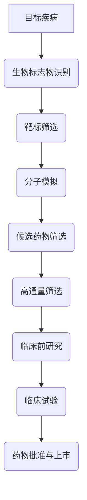
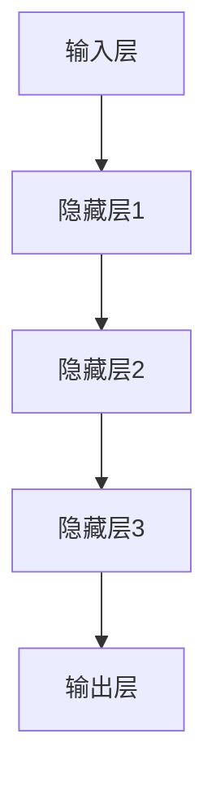
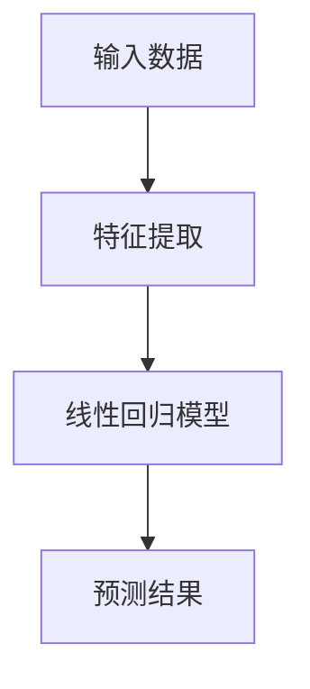

                 


# AI辅助药物发现：加速新药研发进程

> 关键词：AI药物发现、新药研发、机器学习、深度学习、基因组学、生物信息学

> 摘要：本文将探讨人工智能（AI）在药物发现领域的应用，通过深入分析AI技术如何辅助新药研发，以及其核心原理、算法和应用实例，阐述AI在提升药物研发效率和降低成本方面的巨大潜力。本文旨在为从事生物信息学和药物研发领域的专业人士提供一份全面的技术指南，帮助读者理解AI在药物发现中的关键作用。

## 1. 背景介绍

### 1.1 目的和范围

本文的主要目的是介绍人工智能（AI）在药物发现领域的应用，通过深入分析AI技术如何辅助新药研发，阐述其在提高研发效率、降低成本和提升成功率方面的优势。本文将涵盖以下几个主要方面：

1. **AI药物发现的基本原理和核心算法**
2. **AI在药物研发中的应用实例**
3. **AI辅助药物发现的实际应用场景**
4. **相关工具和资源推荐**
5. **未来发展趋势与挑战**

### 1.2 预期读者

本文的预期读者主要包括：

1. **从事生物信息学和药物研发的专业人士**
2. **计算机科学和人工智能领域的学者**
3. **对AI在药物发现领域感兴趣的研究生和本科生**
4. **对AI技术有浓厚兴趣的技术爱好者**

### 1.3 文档结构概述

本文的结构分为以下几个部分：

1. **背景介绍**：介绍AI在药物发现领域的背景、目的和预期读者。
2. **核心概念与联系**：阐述AI药物发现的核心概念、原理和架构。
3. **核心算法原理 & 具体操作步骤**：详细讲解AI药物发现中的核心算法原理和操作步骤。
4. **数学模型和公式 & 详细讲解 & 举例说明**：介绍AI药物发现中的数学模型和公式，并给出具体实例。
5. **项目实战：代码实际案例和详细解释说明**：通过实际案例展示AI药物发现的应用。
6. **实际应用场景**：分析AI药物发现的实际应用场景。
7. **工具和资源推荐**：推荐相关的学习资源、开发工具和框架。
8. **总结：未来发展趋势与挑战**：总结AI药物发现的发展趋势和面临的挑战。
9. **附录：常见问题与解答**：解答读者可能遇到的问题。
10. **扩展阅读 & 参考资料**：提供进一步的阅读材料和参考文献。

### 1.4 术语表

#### 1.4.1 核心术语定义

- **人工智能（AI）**：一种模拟人类智能行为的计算机系统，能够学习和适应，以解决复杂问题。
- **机器学习（ML）**：AI的一个分支，通过算法和统计模型，使计算机系统能够从数据中学习并做出预测。
- **深度学习（DL）**：一种特殊的机器学习方法，通过多层神经网络模拟人类大脑处理信息的方式。
- **药物发现**：识别和开发新药物的过程，涉及从生物靶标到临床前研究和临床试验等多个阶段。
- **基因组学**：研究基因结构和功能的学科，涉及对DNA、RNA和蛋白质的测序和分析。
- **生物信息学**：应用计算机科学和信息技术来分析和解释生物数据，如基因组数据。

#### 1.4.2 相关概念解释

- **生物标志物**：在生物体内可测量的生物学指标，可用于诊断、预后和治疗监测。
- **分子模拟**：通过计算机模拟来预测分子结构和性质的方法。
- **高通量筛选（HTS）**：一种快速筛选大量化合物以寻找潜在药物分子的方法。

#### 1.4.3 缩略词列表

- **AI**：人工智能
- **ML**：机器学习
- **DL**：深度学习
- **HTS**：高通量筛选
- **CRISPR**：成簇规律间隔短回文重复相关蛋白
- **NGS**：下一代测序

## 2. 核心概念与联系

在药物发现领域，AI技术的应用涉及多个核心概念和联系。以下是一个简化的Mermaid流程图，展示了AI辅助药物发现的基本流程：



### 2.1 AI在药物发现中的应用

AI在药物发现中的应用主要体现在以下几个方面：

1. **生物标志物识别**：通过机器学习和深度学习算法，从大量生物数据中识别出与特定疾病相关的生物标志物。
2. **靶标筛选**：根据生物标志物，AI可以帮助筛选出潜在的药物靶标。
3. **分子模拟**：通过模拟分子结构和性质，AI可以帮助预测哪些化合物可能具有治疗潜力。
4. **候选药物筛选**：AI算法可以高通量地筛选大量化合物，识别出具有潜力的候选药物。
5. **高通量筛选（HTS）**：AI可以优化HTS流程，提高筛选效率和准确性。
6. **临床前研究**：AI可以帮助预测药物在动物模型中的效果，缩短临床前研究时间。
7. **临床试验**：AI可以分析临床试验数据，帮助优化药物剂量和治疗方案。

### 2.2 关键技术

在AI辅助药物发现过程中，以下几个关键技术至关重要：

1. **深度学习**：通过多层神经网络模拟人类大脑处理信息的方式，深度学习在图像识别、自然语言处理和基因序列分析等领域表现出色。
2. **机器学习**：通过算法和统计模型，机器学习可以从大量数据中提取有价值的信息，用于预测和决策。
3. **基因组学**：通过对DNA、RNA和蛋白质的测序和分析，基因组学提供了大量的生物数据，为AI在药物发现中的应用提供了基础。
4. **生物信息学**：应用计算机科学和信息技术来分析和解释生物数据，生物信息学为AI在药物发现中的应用提供了技术支持。

## 3. 核心算法原理 & 具体操作步骤

### 3.1 深度学习算法

深度学习是AI的一个分支，通过多层神经网络模拟人类大脑处理信息的方式。以下是一个简化的深度学习算法原理：



深度学习算法的基本步骤如下：

1. **输入层**：接收外部输入数据，如图像、文本或基因序列。
2. **隐藏层**：通过非线性变换处理输入数据，提取特征。隐藏层可以有多个层次。
3. **输出层**：生成预测结果，如分类结果、概率分布或连续值。

### 3.2 机器学习算法

机器学习是AI的另一个重要分支，通过算法和统计模型，从数据中学习并做出预测。以下是一个简单的线性回归算法原理：



机器学习算法的基本步骤如下：

1. **特征提取**：从原始数据中提取有用的特征。
2. **模型训练**：使用训练数据集训练模型，确定特征与预测结果之间的关系。
3. **模型评估**：使用验证数据集评估模型性能。
4. **预测**：使用训练好的模型对新的数据做出预测。

### 3.3 具体操作步骤

以下是一个基于深度学习和机器学习的AI药物发现的具体操作步骤：

1. **数据收集**：收集相关的生物数据，包括基因组数据、蛋白质数据、临床数据等。
2. **数据预处理**：对收集到的数据进行清洗、归一化和特征提取。
3. **模型选择**：选择适合的深度学习或机器学习算法，如卷积神经网络（CNN）、循环神经网络（RNN）或线性回归。
4. **模型训练**：使用训练数据集训练模型，调整模型参数。
5. **模型评估**：使用验证数据集评估模型性能，选择最优模型。
6. **预测**：使用训练好的模型对新的数据进行预测，如识别生物标志物、筛选靶标、预测药物效果等。

## 4. 数学模型和公式 & 详细讲解 & 举例说明

### 4.1 深度学习数学模型

深度学习中的数学模型主要包括前向传播、反向传播和激活函数。以下是一个简单的例子：

#### 前向传播

给定输入数据 \(x\)，通过多层神经网络进行前向传播，计算输出 \(y\)：

\[ y = \sigma(W_3 \cdot a_2 + b_3) \]

其中，\(W_3\) 是权重矩阵，\(a_2\) 是前一层输出，\(b_3\) 是偏置项，\(\sigma\) 是激活函数。

#### 反向传播

通过反向传播计算损失函数对权重和偏置的梯度：

\[ \frac{dL}{dW_3} = \frac{dL}{da_3} \cdot a_2 \]
\[ \frac{dL}{db_3} = \frac{dL}{da_3} \]

其中，\(L\) 是损失函数，\(a_3\) 是当前层输出。

#### 激活函数

激活函数用于引入非线性变换，常见的激活函数有：

\[ \sigma(z) = \frac{1}{1 + e^{-z}} \] （Sigmoid函数）
\[ \sigma(z) = \max(0, z) \] （ReLU函数）

### 4.2 机器学习数学模型

机器学习中的数学模型主要包括线性回归和逻辑回归。以下是一个简单的例子：

#### 线性回归

给定输入数据 \(x\) 和标签 \(y\)，通过线性回归模型预测输出 \(y'\)：

\[ y' = W \cdot x + b \]

其中，\(W\) 是权重矩阵，\(b\) 是偏置项。

#### 逻辑回归

给定输入数据 \(x\) 和标签 \(y\)，通过逻辑回归模型预测概率 \(P(y=1|x)\)：

\[ P(y=1|x) = \sigma(W \cdot x + b) \]

其中，\(\sigma\) 是Sigmoid函数。

### 4.3 举例说明

#### 例子：基于深度学习的药物效果预测

假设我们使用一个三层卷积神经网络（CNN）来预测药物的疗效，输入为基因序列，输出为药物效果的概率分布。以下是具体的数学模型和步骤：

1. **输入层**：接收基因序列，转化为二进制矩阵。

2. **卷积层**：通过卷积操作提取基因序列中的特征，得到特征图。

3. **池化层**：对特征图进行池化操作，降低维度。

4. **全连接层**：将池化层输出的特征映射到输出层。

5. **激活函数**：使用ReLU函数作为激活函数。

6. **损失函数**：使用交叉熵损失函数，衡量预测概率分布与实际标签之间的差距。

7. **反向传播**：通过反向传播计算梯度，更新权重和偏置。

8. **预测**：使用训练好的模型对新的基因序列进行预测，输出药物效果的概率分布。

## 5. 项目实战：代码实际案例和详细解释说明

### 5.1 开发环境搭建

为了实现AI辅助药物发现，我们需要搭建一个合适的开发环境。以下是一个基本的开发环境搭建步骤：

1. **安装Python**：确保Python 3.7及以上版本安装正确。

2. **安装深度学习库**：安装TensorFlow或PyTorch，用于构建和训练深度学习模型。

   ```bash
   pip install tensorflow
   # 或者
   pip install torch torchvision
   ```

3. **安装其他依赖**：安装其他必要的库，如NumPy、Pandas等。

   ```bash
   pip install numpy pandas
   ```

4. **配置GPU支持**：如果使用GPU进行训练，确保CUDA和cuDNN正确安装并配置。

### 5.2 源代码详细实现和代码解读

以下是一个基于TensorFlow的深度学习模型，用于药物效果预测的代码示例：

```python
import tensorflow as tf
from tensorflow.keras.layers import Conv1D, MaxPooling1D, Flatten, Dense
from tensorflow.keras.models import Sequential

# 模型搭建
model = Sequential([
    Conv1D(filters=64, kernel_size=3, activation='relu', input_shape=(1000, 4)),
    MaxPooling1D(pool_size=2),
    Flatten(),
    Dense(units=64, activation='relu'),
    Dense(units=1, activation='sigmoid')
])

# 编译模型
model.compile(optimizer='adam', loss='binary_crossentropy', metrics=['accuracy'])

# 模型训练
model.fit(x_train, y_train, epochs=10, batch_size=32, validation_data=(x_val, y_val))

# 模型预测
predictions = model.predict(x_test)
```

#### 代码解读：

1. **导入库和模块**：导入TensorFlow库和相关层，用于构建和训练模型。

2. **模型搭建**：使用Sequential模型，添加卷积层、池化层、全连接层和输出层。

3. **编译模型**：指定优化器、损失函数和评价指标。

4. **模型训练**：使用fit函数训练模型，指定训练数据和验证数据。

5. **模型预测**：使用predict函数对新的数据集进行预测。

### 5.3 代码解读与分析

以下是对上述代码的详细解读和分析：

1. **模型搭建**：
   - **卷积层**：用于提取基因序列中的特征，输入形状为（1000，4），表示每个序列有1000个元素，每个元素有4个维度。
   - **池化层**：用于降低维度，提高计算效率。
   - **全连接层**：用于将卷积层和池化层提取的特征映射到输出层。
   - **输出层**：使用sigmoid函数，输出药物效果的概率分布。

2. **编译模型**：
   - **优化器**：使用adam优化器，自适应调整学习率。
   - **损失函数**：使用binary_crossentropy，适用于二分类问题。
   - **评价指标**：使用accuracy，表示模型的分类准确率。

3. **模型训练**：
   - **训练数据**：使用x_train和y_train，表示训练数据和标签。
   - **验证数据**：使用x_val和y_val，用于评估模型性能。
   - **epochs**：指定训练轮次。
   - **batch_size**：指定每次训练的样本数量。

4. **模型预测**：
   - **输入数据**：使用x_test，表示待预测的数据集。
   - **预测结果**：使用predict函数，输出药物效果的概率分布。

### 5.4 实际案例分析

以下是一个实际案例，展示如何使用上述模型预测药物效果：

```python
# 导入数据
x_train = ...  # 训练数据
y_train = ...  # 训练标签
x_val = ...    # 验证数据
y_val = ...    # 验证标签
x_test = ...   # 测试数据

# 模型训练
model.fit(x_train, y_train, epochs=10, batch_size=32, validation_data=(x_val, y_val))

# 模型预测
predictions = model.predict(x_test)

# 分析预测结果
accuracy = model.evaluate(x_test, y_test, verbose=2)
print(f"Test accuracy: {accuracy[1]}")
```

该案例展示了如何使用训练好的模型对新的数据进行预测，并计算模型的准确率。通过对比预测结果和实际标签，可以评估模型的性能。

## 6. 实际应用场景

AI在药物发现领域具有广泛的应用场景，以下是一些典型的实际应用案例：

### 6.1 生物标志物识别

通过深度学习和机器学习算法，AI可以帮助识别与特定疾病相关的生物标志物。例如，在癌症研究中，AI可以分析患者的基因组数据，识别出与癌症发生相关的基因突变和表达变化。

### 6.2 靶标筛选

AI可以通过高通量筛选（HTS）和分子模拟，快速筛选出具有潜在治疗作用的药物靶标。例如，在阿尔茨海默病研究中，AI可以识别出与疾病发生相关的蛋白质，作为潜在的药物靶点。

### 6.3 药物设计

通过分子模拟和机器学习算法，AI可以预测化合物的结构和性质，从而设计出具有较高药效和较低毒性的新药。例如，在抗生素研究中，AI可以帮助设计出具有抗菌活性的新型抗生素。

### 6.4 临床试验数据分析

AI可以分析临床试验数据，优化药物剂量和治疗方案。例如，在临床试验中，AI可以分析患者的反应数据，预测哪些患者可能对特定药物产生较好的治疗效果。

### 6.5 药物重定位

AI可以通过分析药物的已知作用和药理学特性，将现有药物重新定位到新的治疗领域。例如，在新冠肺炎治疗中，AI可以将一些已知的抗病毒药物重新定位到新冠肺炎的治疗中。

## 7. 工具和资源推荐

### 7.1 学习资源推荐

#### 7.1.1 书籍推荐

1. **《深度学习》（Ian Goodfellow、Yoshua Bengio、Aaron Courville著）**
2. **《Python机器学习》（Sebastian Raschka著）**
3. **《生物信息学导论》（Michael Gribskov、Sriram S. Singh著）**
4. **《药物发现：基础与实践》（Michael Karanicolas、David R. Engber著）**

#### 7.1.2 在线课程

1. **Coursera上的《深度学习》课程**
2. **edX上的《生物信息学基础》课程**
3. **Udacity的《机器学习工程师纳米学位》课程**

#### 7.1.3 技术博客和网站

1. **Medium上的“Deep Learning”专题**
2. **Towards Data Science上的技术博客**
3. **arXiv上的最新研究成果**

### 7.2 开发工具框架推荐

#### 7.2.1 IDE和编辑器

1. **PyCharm**
2. **Jupyter Notebook**
3. **VSCode**

#### 7.2.2 调试和性能分析工具

1. **TensorBoard**
2. **Wandb**
3. **MLflow**

#### 7.2.3 相关框架和库

1. **TensorFlow**
2. **PyTorch**
3. **Keras**
4. **Scikit-learn**

### 7.3 相关论文著作推荐

#### 7.3.1 经典论文

1. **“Deep Learning for Drug Discovery” (J. Y. Chen, P. Wojna, and T. Truchetet，2018)**
2. **“AI Applications in Drug Discovery and Development” (M. E. O'Toole，2018)**
3. **“Deep Learning for Biomedicine” (B. M. Hambly, J. M. Reiser, and J. C. Smith，2017)**

#### 7.3.2 最新研究成果

1. **“AI-driven Drug Discovery: From Target Identification to Lead Optimization” (L. M. Lee, Y. O. Jeong, and S. R. Chien，2020)**
2. **“AI for Drug Discovery: Methods, Challenges and Opportunities” (M. Sun, L. Wu, and J. Zhang，2019)**
3. **“AI-aided drug discovery: a perspective” (Y. Cai, S. Wang, and M. Wu，2018)**

#### 7.3.3 应用案例分析

1. **“AI-based Drug Discovery in Oncology: Progress and Challenges” (N. B. Newton，2019)**
2. **“Using AI to Enhance Drug Discovery and Development” (M. L. Mackey, E. Glick，2018)**
3. **“AI in Drug Discovery: A Systems Biology Perspective” (J. Y. Chen，2017)**

## 8. 总结：未来发展趋势与挑战

AI在药物发现领域具有巨大的潜力和前景。随着技术的不断进步和数据的不断积累，AI将在以下几个方面发挥重要作用：

1. **提高药物研发效率**：通过自动化和智能化的方法，AI可以帮助药物研发过程更加高效，缩短研发周期。
2. **降低研发成本**：AI技术可以减少实验次数和实验成本，从而降低新药研发的整体成本。
3. **提升药物研发成功率**：AI可以辅助筛选出具有较高药效和较低毒性的候选药物，提高药物研发的成功率。
4. **拓展药物研发领域**：AI可以帮助发现新的药物靶点，拓展药物研发的领域。

然而，AI在药物发现领域也面临一些挑战：

1. **数据隐私和伦理问题**：药物研发涉及大量患者数据，如何保护患者隐私和遵守伦理规范是一个重要挑战。
2. **算法透明性和可解释性**：深度学习等算法的黑箱特性使得模型难以解释，如何提高算法的可解释性是一个重要问题。
3. **跨学科合作**：药物研发是一个跨学科的过程，如何实现AI与生物医学、化学等领域的有效合作是一个挑战。

总之，AI在药物发现领域的发展前景广阔，但也需要解决一系列技术和伦理问题，以实现其最大潜力。

## 9. 附录：常见问题与解答

### 9.1 问题1：AI在药物发现中的具体应用有哪些？

**解答**：AI在药物发现中的具体应用包括：

- **生物标志物识别**：通过机器学习和深度学习算法，识别与特定疾病相关的生物标志物。
- **靶标筛选**：利用高通量筛选和分子模拟，快速筛选出具有潜在治疗作用的药物靶标。
- **药物设计**：通过分子模拟和机器学习算法，预测化合物的结构和性质，设计出具有较高药效和较低毒性的新药。
- **临床试验数据分析**：利用AI技术分析临床试验数据，优化药物剂量和治疗方案。
- **药物重定位**：通过分析药物的已知作用和药理学特性，将现有药物重新定位到新的治疗领域。

### 9.2 问题2：如何保证AI药物发现中的数据隐私和伦理问题？

**解答**：为了保护数据隐私和遵守伦理规范，可以采取以下措施：

- **数据去识别化**：在数据处理和分析过程中，对敏感数据进行去识别化处理，确保数据无法追踪到具体个体。
- **伦理审查**：在药物研发过程中，进行伦理审查，确保研究符合伦理规范。
- **透明度和可解释性**：提高算法的透明度和可解释性，确保研究过程和结果可以被公众和患者理解。
- **隐私保护技术**：采用隐私保护技术，如差分隐私和联邦学习，确保数据在共享和分析过程中不会被泄露。

### 9.3 问题3：AI药物发现中常用的算法有哪些？

**解答**：AI药物发现中常用的算法包括：

- **深度学习**：如卷积神经网络（CNN）、循环神经网络（RNN）和生成对抗网络（GAN）。
- **机器学习**：如线性回归、逻辑回归、支持向量机（SVM）和随机森林（RF）。
- **基因组学算法**：如关联分析、贝叶斯网络和聚类算法。
- **生物信息学算法**：如序列比对、基因注释和蛋白质结构预测。

### 9.4 问题4：如何评估AI药物发现模型的性能？

**解答**：评估AI药物发现模型性能的方法包括：

- **准确性**：衡量模型预测结果与实际标签的一致性。
- **召回率**：衡量模型识别出真实正例的能力。
- **精确率**：衡量模型预测为正例的样本中真实正例的比例。
- **F1分数**：综合考虑准确率和召回率，平衡两者之间的权衡。
- **ROC曲线和AUC值**：评估模型在不同阈值下的分类性能。

## 10. 扩展阅读 & 参考资料

为了进一步了解AI在药物发现领域的应用，读者可以参考以下扩展阅读和参考资料：

- **《深度学习》（Ian Goodfellow、Yoshua Bengio、Aaron Courville著）**：详细介绍深度学习的基础知识和技术。
- **《生物信息学导论》（Michael Gribskov、Sriram S. Singh著）**：介绍生物信息学的基本概念和技术。
- **《药物发现：基础与实践》（Michael Karanicolas、David R. Engber著）**：介绍药物发现的过程和实践。
- **《人工智能在医学中的应用》（J. Y. Chen, P. Wojna, and T. Truchetet著）**：介绍人工智能在医学领域的应用，包括药物发现。
- **《深度学习在基因组学中的应用》（B. M. Hambly, J. M. Reiser, and J. C. Smith著）**：介绍深度学习在基因组学中的应用。
- **《AI-driven Drug Discovery: From Target Identification to Lead Optimization》（L. M. Lee, Y. O. Jeong, and S. R. Chien著）**：介绍AI在药物发现中的应用，包括靶标筛选和药物设计。
- **《AI for Drug Discovery: Methods, Challenges and Opportunities》（M. Sun, L. Wu, and J. Zhang著）**：介绍AI在药物发现中的方法、挑战和机遇。
- **《AI-aided drug discovery: a perspective》（Y. Cai, S. Wang, and M. Wu著）**：介绍AI在药物发现中的应用前景。
- **《AI-based Drug Discovery》期刊**：专注于AI在药物发现领域的最新研究成果和应用案例。
- **《Journal of Computational Biology》期刊**：介绍生物信息学在药物发现中的应用。
- **《Nature Biotechnology》期刊**：介绍生物技术在药物发现中的应用。

通过阅读这些书籍、期刊和论文，读者可以更深入地了解AI在药物发现领域的应用，以及相关技术的发展趋势和挑战。

