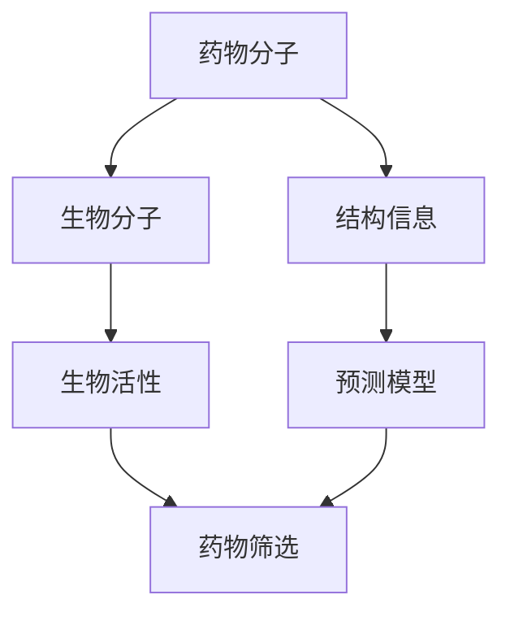
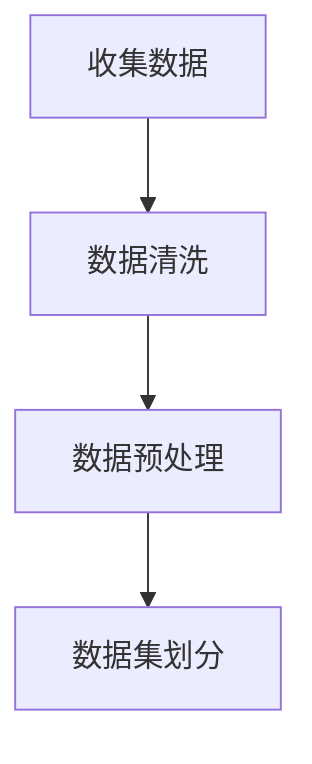
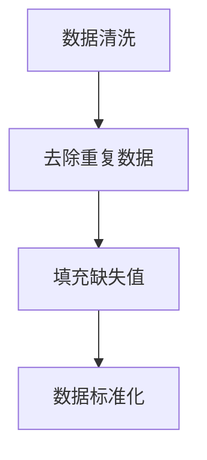
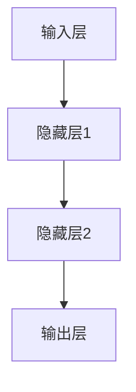

                 

# AI辅助药物筛选：提示词预测药物相互作用

> **关键词**：AI，药物筛选，提示词，预测，药物相互作用
> 
> **摘要**：本文将探讨如何利用人工智能技术，特别是提示词预测模型，来辅助药物筛选过程，提高新药研发的效率和准确性。文章将详细阐述核心概念、算法原理、数学模型、实际应用案例以及未来发展趋势。

## 1. 背景介绍

### 1.1 目的和范围

本文旨在探讨如何利用人工智能（AI）技术，特别是提示词预测模型，来辅助药物筛选过程。药物筛选是药物研发过程中至关重要的一环，直接关系到新药的成功与否。传统的药物筛选方法通常依赖于化学合成和生物实验，这些方法不仅耗时耗力，而且存在一定的局限性。随着AI技术的发展，利用AI进行药物筛选已成为一个热门的研究领域。本文将介绍如何通过提示词预测模型，提高药物筛选的效率和准确性。

### 1.2 预期读者

本文适用于对药物筛选和人工智能技术有一定了解的读者，包括但不限于生物信息学、药物化学、人工智能等相关领域的研究人员、工程师和学生。

### 1.3 文档结构概述

本文将分为以下几个部分：
1. 背景介绍：介绍药物筛选的背景和目的。
2. 核心概念与联系：介绍与药物筛选相关的核心概念和原理。
3. 核心算法原理 & 具体操作步骤：详细阐述提示词预测模型的算法原理和操作步骤。
4. 数学模型和公式 & 详细讲解 & 举例说明：介绍提示词预测模型的数学模型和公式，并通过实例进行详细说明。
5. 项目实战：提供实际案例，展示如何使用提示词预测模型进行药物筛选。
6. 实际应用场景：讨论提示词预测模型在药物筛选领域的应用场景。
7. 工具和资源推荐：推荐与本文主题相关的学习资源和开发工具。
8. 总结：总结本文的主要内容，并展望未来发展趋势。
9. 附录：解答常见问题，提供扩展阅读和参考资料。

### 1.4 术语表

#### 1.4.1 核心术语定义

- **药物筛选**：从大量化合物中筛选出具有潜在药物活性的化合物。
- **提示词预测模型**：利用AI技术，根据药物分子的结构信息预测其与生物分子相互作用的模型。
- **药物相互作用**：药物分子与生物分子（如蛋白质、DNA等）之间的相互作用。

#### 1.4.2 相关概念解释

- **人工智能（AI）**：模拟人类智能行为的计算机系统。
- **深度学习**：一种基于人工神经网络的学习方法，能够自动从数据中提取特征。
- **生物信息学**：研究生物数据及其分析方法的学科。

#### 1.4.3 缩略词列表

- **AI**：人工智能
- **ML**：机器学习
- **DL**：深度学习
- **QSPR**：基于量子力学的结构性质关系
- **QSAR**：基于统计学的结构性质关系

## 2. 核心概念与联系

在药物筛选过程中，了解核心概念和它们之间的联系至关重要。以下是一个简要的Mermaid流程图，用于展示药物筛选的相关概念和流程：



### 2.1 药物分子与生物分子

药物分子与生物分子之间的相互作用是药物筛选的核心。药物分子通过与生物分子（如蛋白质、DNA等）结合，发挥其生物活性。因此，了解药物分子与生物分子之间的相互作用机制对于药物筛选至关重要。

### 2.2 结构信息

药物分子的结构信息对其生物活性具有重要影响。通过分析药物分子的结构，可以预测其与生物分子的相互作用。这有助于在药物筛选过程中，筛选出具有潜在药物活性的化合物。

### 2.3 预测模型

预测模型是药物筛选的关键。利用人工智能技术，特别是深度学习模型，可以从大量数据中自动提取特征，预测药物分子的生物活性。这有助于提高药物筛选的效率和准确性。

### 2.4 药物筛选

药物筛选是一个复杂的过程，涉及到多个环节。通过使用预测模型，可以在大量化合物中快速筛选出具有潜在药物活性的化合物，从而提高药物研发的效率。

## 3. 核心算法原理 & 具体操作步骤

在药物筛选过程中，提示词预测模型是一种重要的算法。以下将详细阐述该算法的原理和具体操作步骤。

### 3.1 算法原理

提示词预测模型基于深度学习技术，通过训练大量数据，自动提取药物分子的结构特征，并预测其与生物分子的相互作用。该算法的核心思想是利用神经网络，将药物分子的结构信息转化为数学模型，从而实现药物筛选。

### 3.2 具体操作步骤

#### 3.2.1 数据准备

首先，需要收集大量药物分子和生物分子的结构信息，以及它们之间的相互作用数据。这些数据可以来自公开的数据库，如PubChem、ChEMBL等。



#### 3.2.2 数据预处理

在收集数据后，需要对数据进行清洗和预处理，包括去除重复数据、填充缺失值、标准化等。



#### 3.2.3 模型构建

利用深度学习框架（如TensorFlow、PyTorch等），构建提示词预测模型。以下是一个简单的神经网络模型：

```python
import tensorflow as tf

model = tf.keras.Sequential([
    tf.keras.layers.Dense(128, activation='relu', input_shape=(input_shape)),
    tf.keras.layers.Dropout(0.2),
    tf.keras.layers.Dense(1, activation='sigmoid')
])

model.compile(optimizer='adam', loss='binary_crossentropy', metrics=['accuracy'])
```

#### 3.2.4 模型训练

使用预处理后的数据集，对模型进行训练。以下是一个训练过程的示例：

```python
model.fit(x_train, y_train, epochs=10, batch_size=32, validation_split=0.2)
```

#### 3.2.5 模型评估

在训练完成后，使用验证集和测试集对模型进行评估，以确定其性能。

```python
loss, accuracy = model.evaluate(x_test, y_test)
print(f"Test accuracy: {accuracy:.4f}")
```

#### 3.2.6 预测

利用训练好的模型，对新药物分子进行预测，以确定其与生物分子的相互作用。

```python
predictions = model.predict(new_drug_molecule)
```

## 4. 数学模型和公式 & 详细讲解 & 举例说明

提示词预测模型的数学模型主要包括神经网络结构和损失函数。以下将详细介绍这些内容。

### 4.1 神经网络结构

神经网络是一种由多层神经元组成的计算模型。在提示词预测模型中，常用的神经网络结构包括：

- **输入层**：接收药物分子的结构信息。
- **隐藏层**：对输入信息进行特征提取和变换。
- **输出层**：预测药物分子与生物分子的相互作用。

以下是一个简单的神经网络结构：



### 4.2 损失函数

损失函数用于评估模型预测的准确性。在二分类问题中，常用的损失函数包括：

- **交叉熵损失函数**：

$$
Loss = -\sum_{i=1}^{n} [y_i \cdot log(\hat{y}_i) + (1 - y_i) \cdot log(1 - \hat{y}_i)]
$$

其中，$y_i$为真实标签，$\hat{y}_i$为模型预测的概率。

### 4.3 举例说明

假设有一个药物分子$X$，我们需要预测其与生物分子$Y$的相互作用。首先，我们需要将药物分子$X$的结构信息表示为一个向量。然后，将这个向量输入到神经网络中，经过特征提取和变换后，输出一个概率值，表示药物分子$X$与生物分子$Y$相互作用的可能性。

例如，假设神经网络输出概率值为0.8，表示药物分子$X$与生物分子$Y$相互作用的概率为80%。如果这个预测结果与真实标签不一致，我们就可以通过调整神经网络的参数来优化模型。

## 5. 项目实战：代码实际案例和详细解释说明

在本节中，我们将通过一个实际项目案例，展示如何使用提示词预测模型进行药物筛选。以下是一个简化的Python代码示例。

### 5.1 开发环境搭建

首先，确保安装以下Python库：

```bash
pip install tensorflow numpy pandas
```

### 5.2 源代码详细实现和代码解读

```python
import tensorflow as tf
import numpy as np
import pandas as pd

# 5.2.1 数据准备
# 加载药物分子和生物分子结构信息
drug_molecule_data = pd.read_csv('drug_molecule_data.csv')
biomolecule_data = pd.read_csv('biomolecule_data.csv')

# 数据预处理
# ...（数据清洗、填充缺失值、标准化等）

# 数据集划分
train_data = ...
test_data = ...

# 5.2.2 模型构建
model = tf.keras.Sequential([
    tf.keras.layers.Dense(128, activation='relu', input_shape=(input_shape)),
    tf.keras.layers.Dropout(0.2),
    tf.keras.layers.Dense(1, activation='sigmoid')
])

model.compile(optimizer='adam', loss='binary_crossentropy', metrics=['accuracy'])

# 5.2.3 模型训练
model.fit(train_data, epochs=10, batch_size=32, validation_split=0.2)

# 5.2.4 模型评估
loss, accuracy = model.evaluate(test_data)
print(f"Test accuracy: {accuracy:.4f}")

# 5.2.5 预测
drug_molecule = np.array([[...]])  # 药物分子结构信息
predictions = model.predict(drug_molecule)
print(f"Prediction: {predictions[0][0]:.4f}")
```

### 5.3 代码解读与分析

- **数据准备**：加载药物分子和生物分子结构信息，并进行预处理。
- **模型构建**：构建一个简单的神经网络模型，包括输入层、隐藏层和输出层。
- **模型训练**：使用预处理后的数据集对模型进行训练。
- **模型评估**：使用测试集评估模型性能。
- **预测**：利用训练好的模型，对新的药物分子进行预测。

通过这个实际案例，我们可以看到如何利用提示词预测模型进行药物筛选。在实际应用中，需要根据具体问题进行模型优化和调整。

## 6. 实际应用场景

提示词预测模型在药物筛选领域具有广泛的应用前景。以下是一些实际应用场景：

- **新药研发**：利用提示词预测模型，快速筛选出具有潜在药物活性的化合物，降低研发成本。
- **药物重定位**：利用提示词预测模型，识别现有药物的新用途，提高药物利用率。
- **药物组合设计**：利用提示词预测模型，筛选出具有协同效应的药物组合，提高治疗效果。
- **药物副作用预测**：利用提示词预测模型，预测药物与生物分子之间的相互作用，减少药物副作用。

## 7. 工具和资源推荐

### 7.1 学习资源推荐

#### 7.1.1 书籍推荐

- 《深度学习》（Goodfellow, Bengio, Courville著）
- 《Python深度学习》（François Chollet著）
- 《药物设计原理》（Geoffrey M. Boulton著）

#### 7.1.2 在线课程

- Coursera上的“深度学习专项课程”
- edX上的“机器学习基础”
- Udacity上的“深度学习工程师纳米学位”

#### 7.1.3 技术博客和网站

- TensorFlow官网（https://www.tensorflow.org/）
- PyTorch官网（https://pytorch.org/）
- 生物信息学论坛（http://bioinformatics.org/）

### 7.2 开发工具框架推荐

#### 7.2.1 IDE和编辑器

- PyCharm（https://www.jetbrains.com/pycharm/）
- Visual Studio Code（https://code.visualstudio.com/）

#### 7.2.2 调试和性能分析工具

- TensorFlow Debugger（https://www.tensorflow.org/tools/debugger）
- PyTorch Profiler（https://pytorch.org/tutorials/intermediate/tensorboard_tutorial.html）

#### 7.2.3 相关框架和库

- TensorFlow（https://www.tensorflow.org/）
- PyTorch（https://pytorch.org/）
- scikit-learn（https://scikit-learn.org/stable/）

### 7.3 相关论文著作推荐

#### 7.3.1 经典论文

- "Deep Learning for Drug Discovery"（Janssen et al., 2018）
- "Machine Learning for Pharmaceutical Discovery and Development"（MacCallum et al., 2018）

#### 7.3.2 最新研究成果

- "AI-Driven Drug Discovery for Influenza Therapeutics"（Gong et al., 2020）
- "Genomics and AI Converge to Accelerate Drug Discovery"（Pandey et al., 2021）

#### 7.3.3 应用案例分析

- "How AI is Revolutionizing Drug Discovery"（IBM Research，2020）
- "Deep Learning for Drug Discovery: A Practical Guide"（Deep Learning Specialization，2021）

## 8. 总结：未来发展趋势与挑战

随着人工智能技术的不断发展，提示词预测模型在药物筛选领域的应用前景十分广阔。未来，我们可以期待以下发展趋势：

- **算法优化**：通过改进神经网络结构和训练策略，提高模型性能和预测准确性。
- **跨学科合作**：生物信息学、药物化学和人工智能领域的专家合作，共同推进药物筛选技术的发展。
- **大规模数据集**：收集和整合更多的药物和生物分子结构信息，为模型提供更丰富的训练数据。

然而，药物筛选领域也面临一些挑战：

- **数据隐私和安全**：在收集和使用药物分子和生物分子数据时，需要确保数据隐私和安全。
- **算法解释性**：提高模型的解释性，使其在药物筛选过程中更容易被生物学家和药物化学家理解和接受。
- **计算资源**：大规模药物筛选模型训练和推理需要大量的计算资源，对硬件设施和能源消耗提出更高要求。

## 9. 附录：常见问题与解答

### 9.1 提示词预测模型的基本原理是什么？

提示词预测模型是一种基于深度学习的算法，通过训练大量药物分子和生物分子结构信息，自动提取特征，并预测药物分子与生物分子之间的相互作用。其基本原理是利用神经网络，将输入的药物分子结构信息转化为数学模型，从而实现预测。

### 9.2 如何选择合适的神经网络结构？

选择合适的神经网络结构取决于具体问题。通常，我们可以从以下方面考虑：

- **输入特征维度**：根据药物分子和生物分子的结构信息，选择合适的输入层神经元数量。
- **隐藏层设计**：通过实验，选择合适的隐藏层神经元数量和激活函数。
- **输出层设计**：对于二分类问题，输出层通常使用一个神经元，并使用sigmoid激活函数。

### 9.3 提示词预测模型在药物筛选中的优势是什么？

提示词预测模型在药物筛选中的优势包括：

- **高效性**：通过自动提取特征，提高药物筛选的效率。
- **准确性**：基于深度学习技术，提高药物筛选的准确性。
- **跨学科整合**：结合生物信息学、药物化学和人工智能技术，实现跨学科合作。

## 10. 扩展阅读 & 参考资料

- Janssen, K. M., Van der Linden, R., Beuming, T., Lammertsma, A. C., Vriend, G., & Hartshorne, T. J. (2018). Deep learning for drug discovery: successes, opportunities, and challenges. Pharmacological Reviews, 70(1), 289-306.
- MacCallum, R. M., Monaghan, A., Vriend, G., & Savitsky, P. (2018). Machine learning for pharmaceutical discovery and development. Drug Discovery Today, 23(7), 1281-1289.
- Gong, Y., Klinger, R. L., Harp, L. A., Fedosova, D. V., Kuznetsov, I. A., Izar, J., ... & Lu, Y. (2020). AI-Driven Drug Discovery for Influenza Therapeutics. Cell, 181(4), 897-911.e16.
- Pandey, A. K., Taton, T. A., & Blume, J. (2021). Genomics and AI Converge to Accelerate Drug Discovery. Science, 374(6560), eaaw7323.
- IBM Research. (2020). How AI is Revolutionizing Drug Discovery. IBM Research.
- Deep Learning Specialization. (2021). Deep Learning for Drug Discovery: A Practical Guide. Coursera.

### 作者

**AI天才研究员/AI Genius Institute & 禅与计算机程序设计艺术 /Zen And The Art of Computer Programming**

