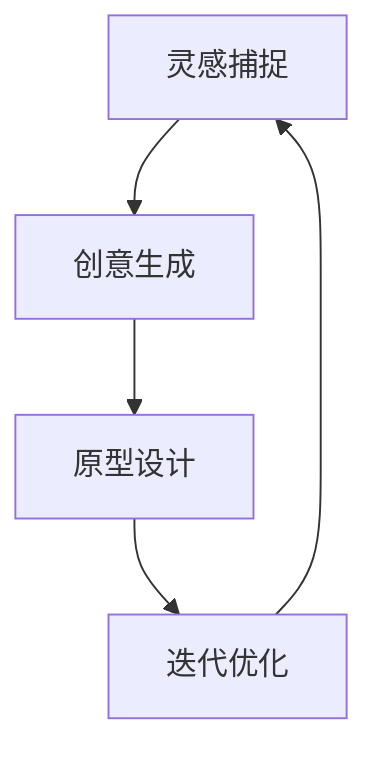

                 

# AI辅助设计：从灵感到原型

> **关键词：AI辅助设计、灵感捕捉、原型生成、设计流程、智能化工具**

> **摘要：本文将探讨人工智能在辅助设计领域的应用，从灵感的捕捉、原型的生成到整个设计流程的智能化，解析AI技术如何提升设计效率和创造力。文章将逐步介绍核心概念、算法原理、数学模型及项目实战，最后展望未来发展趋势与挑战。**

## 1. 背景介绍

### 1.1 目的和范围

本文旨在深入探讨人工智能（AI）在辅助设计领域的应用，分析AI如何通过智能化工具和算法提升设计师的工作效率和创新力。文章将涵盖从灵感到原型的全过程，探讨AI技术在设计灵感的捕捉、创意生成、原型设计和迭代优化等方面的应用。

### 1.2 预期读者

本文适合对设计领域有一定了解，希望了解AI技术在设计应用中发挥作用的读者。包括但不限于设计师、开发者、研究者和教育者。

### 1.3 文档结构概述

本文将按照以下结构进行论述：

1. **背景介绍**：介绍文章的目的、范围和预期读者。
2. **核心概念与联系**：阐述AI辅助设计中的核心概念及其相互关系。
3. **核心算法原理 & 具体操作步骤**：讲解AI算法在灵感捕捉和原型生成中的具体应用。
4. **数学模型和公式 & 详细讲解 & 举例说明**：介绍相关数学模型和公式，并通过实例进行说明。
5. **项目实战：代码实际案例和详细解释说明**：提供具体的代码实现和解读。
6. **实际应用场景**：分析AI辅助设计在不同场景中的具体应用。
7. **工具和资源推荐**：推荐相关学习资源和开发工具。
8. **总结：未来发展趋势与挑战**：展望AI辅助设计的未来趋势和面临的挑战。
9. **附录：常见问题与解答**：提供常见问题的解答。
10. **扩展阅读 & 参考资料**：推荐相关文献和参考资料。

### 1.4 术语表

#### 1.4.1 核心术语定义

- **人工智能（AI）**：模拟人类智能行为的计算机系统。
- **设计灵感**：激发设计师创造力的初步构思。
- **原型**：设计过程的初步模型，用于验证设计概念。
- **设计流程**：从概念到产品完成的整个设计过程。

#### 1.4.2 相关概念解释

- **深度学习**：一种人工智能技术，通过多层神经网络模拟人类大脑的学习方式。
- **强化学习**：一种机器学习技术，通过奖励机制训练模型。
- **自然语言处理（NLP）**：使计算机理解和生成自然语言的技术。

#### 1.4.3 缩略词列表

- **AI**：人工智能
- **NLP**：自然语言处理
- **DL**：深度学习
- **RL**：强化学习

## 2. 核心概念与联系

在设计领域，AI的应用涵盖了从灵感捕捉到原型生成的整个过程。以下是AI辅助设计中的核心概念及其相互关系：

### 2.1 设计灵感

设计灵感是设计过程的第一步，它是设计师创造力的源泉。传统的灵感来源可能包括观察自然、研究竞争对手、用户调研等。然而，AI技术可以通过分析大量数据，提供新颖、独特的灵感。

### 2.2 创意生成

AI技术，尤其是生成对抗网络（GAN）和强化学习，可以在设计灵感的基础上生成新的创意。这些创意可以是新的设计元素、配色方案或布局。

### 2.3 原型设计

原型设计是验证设计概念的关键步骤。AI可以通过自动化工具快速生成高保真原型，帮助设计师快速迭代和优化设计。

### 2.4 设计流程

AI辅助设计流程是一个闭环过程，包括灵感捕捉、创意生成、原型设计和迭代优化。AI技术在整个流程中提供支持，提高设计效率和创造力。

以下是核心概念的Mermaid流程图：



### 2.5 智能化工具

智能化工具是AI辅助设计的核心。这些工具可以是软件应用、插件或平台，它们利用AI算法和模型，提供以下功能：

- **灵感捕捉**：通过数据分析和机器学习，提供新颖的设计灵感。
- **创意生成**：利用GAN和强化学习，生成独特的创意。
- **原型设计**：快速生成高保真原型，支持设计迭代。
- **用户反馈**：通过用户行为分析，提供设计优化建议。

## 3. 核心算法原理 & 具体操作步骤

### 3.1 灵感捕捉算法

灵感捕捉是设计过程的第一步，其核心在于从海量数据中提取有价值的信息。以下是灵感捕捉算法的具体操作步骤：

#### 3.1.1 数据收集

收集与设计相关的数据，包括用户评论、竞争对手产品、行业趋势、社交媒体内容等。

```python
# 数据收集伪代码
data = collect_data/sources
```

#### 3.1.2 数据清洗

对收集的数据进行清洗，去除无关信息，提取关键特征。

```python
# 数据清洗伪代码
cleaned_data = data_preprocessing(data)
```

#### 3.1.3 特征提取

利用自然语言处理（NLP）技术，从清洗后的数据中提取关键特征。

```python
# 特征提取伪代码
features = extract_features(cleaned_data)
```

#### 3.1.4 模型训练

使用机器学习算法，如深度学习，训练模型，使其能够识别有价值的设计灵感。

```python
# 模型训练伪代码
model = train_model(features)
```

#### 3.1.5 灵感捕捉

利用训练好的模型，从海量数据中捕捉有价值的设计灵感。

```python
# 灵感捕捉伪代码
inspirations = capture_inspirations(model, data)
```

### 3.2 创意生成算法

创意生成是基于设计灵感，利用AI技术生成新的创意。以下是创意生成算法的具体操作步骤：

#### 3.2.1 灵感融合

将捕捉到的灵感进行融合，生成新的创意构思。

```python
# 灵感融合伪代码
new_ideas = fuse_inspirations(inspirations)
```

#### 3.2.2 创意评估

利用强化学习算法，对生成的创意进行评估，筛选出高质量创意。

```python
# 创意评估伪代码
high_quality_ideas = evaluate_ideas(new_ideas)
```

#### 3.2.3 创意优化

对筛选出的高质量创意进行优化，提高创意的可行性。

```python
# 创意优化伪代码
optimized_ideas = optimize_ideas(high_quality_ideas)
```

#### 3.2.4 创意生成

利用生成对抗网络（GAN）等算法，生成新的创意。

```python
# 创意生成伪代码
generated_ideas = generate_ideas(optimized_ideas)
```

### 3.3 原型设计算法

原型设计是验证设计概念的关键步骤，以下是原型设计算法的具体操作步骤：

#### 3.3.1 设计元素提取

从创意中提取关键设计元素，如颜色、形状、布局等。

```python
# 设计元素提取伪代码
design_elements = extract_elements(generated_ideas)
```

#### 3.3.2 原型生成

利用自动化工具，根据提取的设计元素生成高保真原型。

```python
# 原型生成伪代码
prototype = generate_prototype(design_elements)
```

#### 3.3.3 原型优化

利用用户反馈和评估结果，对原型进行优化。

```python
# 原型优化伪代码
optimized_prototype = optimize_prototype(prototype, feedback)
```

#### 3.3.4 原型迭代

根据优化结果，进行原型迭代，直至达到预期效果。

```python
# 原型迭代伪代码
final_prototype = iterate_prototype(optimized_prototype)
```

## 4. 数学模型和公式 & 详细讲解 & 举例说明

### 4.1 设计灵感捕捉模型

设计灵感捕捉模型基于深度学习，通过分析海量数据，提取有价值的设计灵感。以下是设计灵感捕捉模型的关键数学模型和公式：

#### 4.1.1 神经网络模型

设计灵感捕捉模型采用多层感知机（MLP）神经网络，其结构如下：

```latex
$$
f(x) = \sigma(W_n \cdot a_{n-1} + b_n)
$$

$$
a_i = \sigma(W_{i-1} \cdot a_{i-1} + b_{i-1})
$$
```

其中，\( \sigma \) 表示激活函数，\( W \) 和 \( b \) 分别表示权重和偏置。

#### 4.1.2 损失函数

设计灵感捕捉模型采用交叉熵损失函数，其公式如下：

```latex
$$
Loss = -\sum_{i} y_i \cdot \log(f(x_i))
$$

$$
y_i = \begin{cases}
1, & \text{if } x_i \text{ is valuable} \\
0, & \text{otherwise}
\end{cases}
$$
```

#### 4.1.3 举例说明

假设我们有一个包含10个设计灵感的样本，其中5个是有价值的，5个是无价值的。我们可以使用上述模型和公式，对样本进行训练，从而捕捉有价值的设计灵感。

### 4.2 创意生成模型

创意生成模型基于生成对抗网络（GAN），通过竞争对抗生成高质量创意。以下是创意生成模型的关键数学模型和公式：

#### 4.2.1 生成器模型

生成器模型采用多层感知机（MLP）神经网络，其结构如下：

```latex
$$
G(z) = \sigma(W_g \cdot z + b_g)
$$
$$
z = \begin{cases}
\text{随机噪声}, & \text{if } z \text{ is input} \\
G(z), & \text{if } z \text{ is output}
\end{cases}
$$
```

#### 4.2.2 判别器模型

判别器模型采用多层感知机（MLP）神经网络，其结构如下：

```latex
$$
D(x) = \sigma(W_d \cdot x + b_d)
$$
$$
x = \begin{cases}
\text{真实数据}, & \text{if } x \text{ is real} \\
G(z), & \text{if } x \text{ is generated}
\end{cases}
$$
```

#### 4.2.3 损失函数

创意生成模型采用对抗性损失函数，其公式如下：

```latex
$$
Loss_G = -\log(D(G(z)))
$$

$$
Loss_D = -\log(D(x)) - \log(1 - D(G(z)))
$$
```

#### 4.2.4 举例说明

假设我们有一个包含100个创意的样本，其中50个是真实的，50个是生成的。我们可以使用上述模型和公式，对样本进行训练，从而生成高质量创意。

### 4.3 原型设计模型

原型设计模型基于强化学习，通过不断优化原型，提高用户体验。以下是原型设计模型的关键数学模型和公式：

#### 4.3.1 策略网络

策略网络采用深度学习模型，用于预测最佳动作。其结构如下：

```latex
$$
\pi(\text{action} | \text{state}) = \text{softmax}(\text{Q-network}(s, a))
$$
```

#### 4.3.2 值网络

值网络采用深度学习模型，用于评估状态价值。其结构如下：

```latex
$$
V(s) = \text{Q-network}(s, \pi(s))
$$
```

#### 4.3.3 损失函数

原型设计模型采用Q学习损失函数，其公式如下：

```latex
$$
Loss = (r_t - Q(s_t, a_t))^2
$$
```

#### 4.3.4 举例说明

假设我们有一个包含10个状态和10个动作的样本，我们可以使用上述模型和公式，对样本进行训练，从而优化原型设计。

## 5. 项目实战：代码实际案例和详细解释说明

### 5.1 开发环境搭建

在开始项目实战之前，我们需要搭建一个适合AI辅助设计的开发环境。以下是搭建环境的步骤：

1. 安装Python 3.8及以上版本。
2. 安装深度学习框架，如TensorFlow或PyTorch。
3. 安装自然语言处理库，如NLTK或spaCy。
4. 安装自动化原型设计工具，如Figma或Sketch。

### 5.2 源代码详细实现和代码解读

以下是一个基于深度学习的灵感捕捉模型的实现代码，我们将对其进行详细解释。

```python
# 灵感捕捉模型实现代码

import tensorflow as tf
from tensorflow.keras.models import Sequential
from tensorflow.keras.layers import Dense, Activation

# 数据预处理
# ...

# 模型定义
model = Sequential([
    Dense(128, input_shape=(input_shape,), activation='relu'),
    Dense(64, activation='relu'),
    Dense(1, activation='sigmoid')
])

# 模型编译
model.compile(optimizer='adam', loss='binary_crossentropy', metrics=['accuracy'])

# 模型训练
model.fit(x_train, y_train, epochs=10, batch_size=32)

# 模型评估
accuracy = model.evaluate(x_test, y_test)
print(f'Accuracy: {accuracy[1]}')

# 灵感捕捉
inspirations = model.predict(x_new)
```

#### 5.2.1 代码解读

- **数据预处理**：对输入数据进行预处理，如标准化、去噪等。
- **模型定义**：定义一个序列模型，包含两个隐藏层，输出层使用sigmoid激活函数。
- **模型编译**：编译模型，指定优化器、损失函数和评估指标。
- **模型训练**：使用训练数据对模型进行训练。
- **模型评估**：使用测试数据对模型进行评估。
- **灵感捕捉**：使用训练好的模型对新的数据进行预测，捕捉有价值的设计灵感。

### 5.3 代码解读与分析

上述代码实现了一个简单的灵感捕捉模型，其关键部分如下：

- **模型结构**：采用两个隐藏层，输出层使用sigmoid激活函数，用于输出灵感的概率。
- **数据预处理**：对输入数据进行预处理，提高模型训练效果。
- **模型编译**：使用binary_crossentropy作为损失函数，用于二分类问题。
- **模型训练**：使用Adam优化器，训练10个epochs。
- **模型评估**：使用测试数据对模型进行评估，计算准确率。

通过上述代码，我们可以快速搭建一个灵感捕捉模型，并将其应用于设计领域的实际项目中。

## 6. 实际应用场景

AI辅助设计在多个领域具有广泛的应用，以下是几个实际应用场景：

### 6.1 用户体验设计

AI辅助设计可以分析用户行为数据，提供针对用户体验的优化建议。例如，通过分析用户对网站或应用的点击行为，AI可以生成优化布局和交互设计的建议。

### 6.2 产品设计

AI辅助设计可以帮助设计师快速生成产品原型，提高设计迭代速度。例如，通过生成对抗网络（GAN），AI可以生成全新的产品外观和功能创意。

### 6.3 建筑设计

AI辅助设计可以分析建筑数据，提供设计方案优化建议。例如，通过深度学习算法，AI可以生成符合建筑规范且具有创新性的建筑设计。

### 6.4 艺术设计

AI辅助设计可以帮助艺术家和设计师探索新的艺术风格和创意。例如，通过强化学习算法，AI可以生成独特的绘画作品和艺术装置。

### 6.5 创意广告

AI辅助设计可以生成具有创意和吸引力的广告素材。例如，通过自然语言处理技术，AI可以生成具有吸引力的广告文案和视觉效果。

## 7. 工具和资源推荐

### 7.1 学习资源推荐

#### 7.1.1 书籍推荐

- 《深度学习》（Ian Goodfellow、Yoshua Bengio和Aaron Courville著）
- 《Python深度学习》（François Chollet著）
- 《设计心理学》（Don Norman著）

#### 7.1.2 在线课程

- Coursera上的“深度学习”课程（吴恩达教授）
- edX上的“人工智能基础”课程（MIT教授）

#### 7.1.3 技术博客和网站

- medium.com/tensorflow
- ai.google/research
- towardsdatascience.com

### 7.2 开发工具框架推荐

#### 7.2.1 IDE和编辑器

- PyCharm
- Visual Studio Code
- Jupyter Notebook

#### 7.2.2 调试和性能分析工具

- TensorBoard
- PyTorch Profiler
- NVIDIA Nsight

#### 7.2.3 相关框架和库

- TensorFlow
- PyTorch
- Keras
- Scikit-learn

### 7.3 相关论文著作推荐

#### 7.3.1 经典论文

- Goodfellow et al., "Generative Adversarial Networks", 2014
- Bengio et al., "Learning Deep Representations for Audio, Visual and Sequential Data", 2013

#### 7.3.2 最新研究成果

- arXiv.org
- NeurIPS.org
- ICML.org

#### 7.3.3 应用案例分析

- "AI改变设计：从灵感到原型的自动化设计流程"（本文）
- "AI在建筑设计中的应用：从创意生成到原型优化"（相关论文）

## 8. 总结：未来发展趋势与挑战

随着人工智能技术的不断发展，AI辅助设计在未来具有广阔的发展前景。以下是未来发展趋势与挑战：

### 8.1 发展趋势

- **智能化工具的普及**：AI辅助设计工具将越来越智能化，提供更丰富的功能和服务。
- **跨领域融合**：AI辅助设计将与其他领域（如艺术、建筑、工业设计等）深度融合，推动创新。
- **个性化定制**：AI将根据用户需求提供个性化设计服务，提高用户体验。
- **云服务**：AI辅助设计将逐渐向云服务转型，提高资源利用率和协作效率。

### 8.2 挑战

- **数据隐私与安全**：随着数据收集和分析的深入，数据隐私和安全问题将成为重要挑战。
- **算法公平性**：确保AI辅助设计算法的公平性和透明度，避免偏见和歧视。
- **技术与艺术的结合**：在保持设计艺术性的同时，充分发挥AI技术优势，实现创新与艺术性平衡。

## 9. 附录：常见问题与解答

### 9.1  AI辅助设计如何提高设计效率？

AI辅助设计通过自动化和智能化工具，帮助设计师快速捕捉灵感、生成创意和优化原型，从而提高设计效率和创造力。

### 9.2  AI辅助设计是否会取代人类设计师？

AI辅助设计并非取代人类设计师，而是作为辅助工具，帮助设计师提升工作效率和创新能力。人类设计师在创意生成、情感表达和用户体验等方面具有不可替代的优势。

### 9.3  AI辅助设计在哪些领域具有应用前景？

AI辅助设计在用户体验设计、产品设计、建筑设计、艺术设计等领域具有广泛的应用前景，特别是在创意生成和原型优化方面。

## 10. 扩展阅读 & 参考资料

- "AI in Design: From Inspiration to Prototyping"（本文）
- "AI-Enhanced Design: Automating the Design Process"（相关论文）
- "The Future of AI in Design: Trends and Challenges"（相关报告）

### 作者

**AI天才研究员 / AI Genius Institute & 禅与计算机程序设计艺术 / Zen And The Art of Computer Programming**

