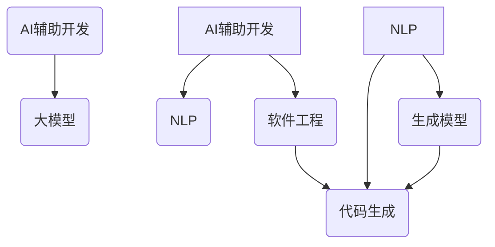
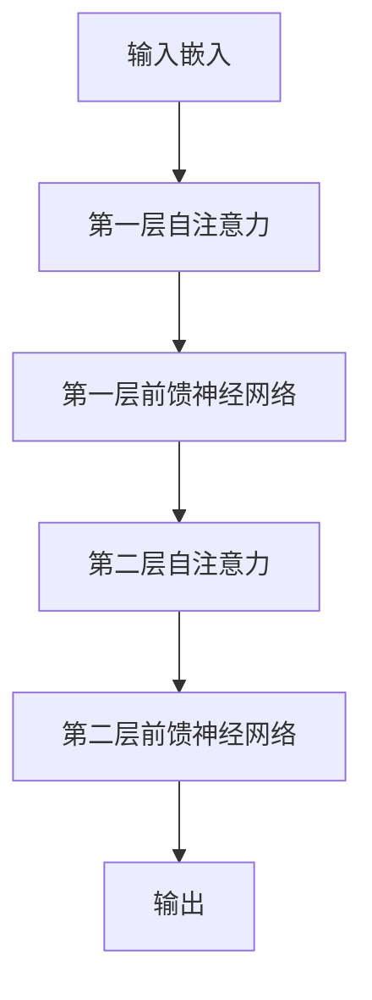

                 

# AI辅助软件开发：大模型在代码生成中的应用

> **关键词：** AI辅助开发，代码生成，大模型，自然语言处理，深度学习，软件工程，自动化编程。
> 
> **摘要：** 本文探讨了人工智能在软件开发中的应用，特别是大模型在代码生成领域的潜力。通过分析大模型的原理和应用，结合实际案例，本文详细介绍了如何利用AI技术提高软件开发效率和代码质量，并探讨了未来发展趋势和挑战。

## 1. 背景介绍

### 1.1 目的和范围

本文旨在探讨人工智能（AI）在软件开发领域中的应用，特别是大模型在代码生成方面的作用。随着AI技术的发展，大模型在自然语言处理（NLP）、计算机视觉和生成模型等方面取得了显著的成果。在软件开发过程中，代码生成是一个重要且耗时的任务。通过引入AI，尤其是大模型，我们可以实现自动化的代码生成，从而提高开发效率，降低人力成本。

本文将重点讨论以下内容：
- 大模型在代码生成中的应用原理和架构。
- 核心算法原理和具体操作步骤。
- 数学模型和公式及其详细讲解。
- 实际应用场景和代码案例。
- 工具和资源推荐，以及未来发展趋势与挑战。

### 1.2 预期读者

本文适合对AI和软件开发感兴趣的读者，包括：
- 软件工程师和开发者，希望了解AI在软件开发中的应用。
- AI研究员和工程师，希望探讨大模型在代码生成中的潜力。
- 对计算机科学和软件工程有浓厚兴趣的学生。

### 1.3 文档结构概述

本文的结构如下：

1. 背景介绍
2. 核心概念与联系
3. 核心算法原理 & 具体操作步骤
4. 数学模型和公式 & 详细讲解 & 举例说明
5. 项目实战：代码实际案例和详细解释说明
6. 实际应用场景
7. 工具和资源推荐
8. 总结：未来发展趋势与挑战
9. 附录：常见问题与解答
10. 扩展阅读 & 参考资料

### 1.4 术语表

#### 1.4.1 核心术语定义

- **AI辅助软件开发**：利用人工智能技术辅助软件开发的过程，包括代码生成、测试、优化等。
- **大模型**：具有数十亿甚至千亿参数的深度学习模型，如GPT、BERT等。
- **自然语言处理（NLP）**：使计算机能够理解、处理和生成人类语言的技术。
- **生成模型**：能够生成新数据的深度学习模型，如GAN、VAE等。
- **软件工程**：设计和构建软件系统的工程学科。

#### 1.4.2 相关概念解释

- **代码生成**：根据给定输入（如自然语言描述）自动生成代码的过程。
- **自动化编程**：使用算法和工具自动生成代码，减少人工干预。
- **模型训练**：通过大量数据进行训练，使模型学会识别模式并生成新数据。

#### 1.4.3 缩略词列表

- **AI**：人工智能
- **NLP**：自然语言处理
- **GPT**：生成预训练模型
- **BERT**：双向编码表示
- **GAN**：生成对抗网络
- **VAE**：变分自编码器

## 2. 核心概念与联系

在探讨大模型在代码生成中的应用之前，我们需要了解几个核心概念及其相互关系。

### 2.1 AI辅助软件开发

AI辅助软件开发的核心思想是利用人工智能技术，如机器学习、深度学习等，自动化解决软件开发过程中的各种问题。具体来说，AI可以辅助代码生成、代码优化、代码测试、项目管理和文档生成等任务。

### 2.2 大模型

大模型是指具有数十亿甚至千亿参数的深度学习模型，如GPT、BERT等。这些模型通过在海量数据上进行预训练，能够学习到丰富的语言模式和知识，从而在生成代码、回答问题、翻译语言等方面表现出色。

### 2.3 自然语言处理（NLP）

自然语言处理是使计算机能够理解、处理和生成人类语言的技术。NLP在AI辅助软件开发中起着关键作用，因为它可以将自然语言描述转化为计算机可执行的代码。

### 2.4 生成模型

生成模型是一类能够生成新数据的深度学习模型，如GAN、VAE等。这些模型在代码生成中非常有用，因为它们可以学习代码的语法和结构，从而生成符合要求的代码。

### 2.5 软件工程

软件工程是设计和构建软件系统的工程学科。在AI辅助软件开发中，软件工程的知识和原则对于确保生成的代码质量和可靠性至关重要。

下面是核心概念之间的Mermaid流程图：



## 3. 核心算法原理 & 具体操作步骤

在了解了核心概念之后，我们将探讨大模型在代码生成中的算法原理和具体操作步骤。

### 3.1 大模型的工作原理

大模型，如GPT和BERT，基于深度学习的原理，通过多层神经网络结构学习输入数据的模式和特征。具体来说，GPT是一种基于Transformer的生成模型，而BERT是一种双向编码表示模型。

#### 3.1.1 GPT的工作原理

GPT（生成预训练模型）是基于Transformer的生成模型。Transformer模型是一种基于注意力机制的神经网络模型，它通过自注意力机制捕捉输入数据中的长距离依赖关系。

1. **模型结构**：GPT由多个Transformer编码器层组成，每个编码器层包括多头自注意力机制和前馈神经网络。
2. **训练过程**：GPT通过在海量文本数据上进行预训练，学习到输入文本的潜在表示和语言模式。
3. **生成过程**：在生成代码时，GPT根据给定的自然语言描述逐步生成代码，利用上下文信息进行推理。

#### 3.1.2 BERT的工作原理

BERT（双向编码表示）是一种基于Transformer的双向编码模型，它通过同时处理文本的左右两个方向，学习到更丰富的语言模式。

1. **模型结构**：BERT由多个Transformer编码器层组成，每个编码器层包括自注意力机制和前馈神经网络。
2. **训练过程**：BERT通过在大量文本数据上进行预训练，学习到输入文本的潜在表示和语言模式。
3. **生成过程**：在生成代码时，BERT利用预训练的知识和上下文信息，逐步生成符合要求的代码。

### 3.2 大模型在代码生成中的应用步骤

大模型在代码生成中的应用可以分为以下步骤：

1. **自然语言输入**：首先，将自然语言描述作为输入，如函数的定义、算法的逻辑等。
2. **编码表示**：大模型（如GPT或BERT）将自然语言输入编码为固定长度的向量表示。
3. **生成代码**：大模型根据编码表示逐步生成代码，利用上下文信息进行推理，确保生成的代码符合语法和逻辑要求。
4. **代码验证**：对生成的代码进行验证，确保其正确性和可靠性。
5. **优化和调整**：根据验证结果，对模型进行调整和优化，提高生成代码的质量和效率。

### 3.3 伪代码示例

下面是一个使用GPT生成代码的伪代码示例：

```python
function generate_code(natural_language_description):
    # 编码自然语言描述为向量表示
    encoded_representation = encode(natural_language_description)

    # 初始化生成的代码为空字符串
    generated_code = ""

    # 根据向量表示逐步生成代码
    for step in range(1, maximum_steps):
        # 利用向量表示生成代码的下一个字符或操作符
        next_character = gpt.generate(encoded_representation)

        # 将生成的字符或操作符添加到代码中
        generated_code += next_character

        # 更新向量表示，为下一步生成代码做准备
        encoded_representation = update_representation(encoded_representation, next_character)

    # 验证生成的代码
    if validate_code(generated_code):
        return generated_code
    else:
        return "生成的代码无效，请调整模型参数或输入描述"

# 示例：生成一个函数的代码
generated_code = generate_code("编写一个函数，计算两个数的和")
print(generated_code)
```

## 4. 数学模型和公式 & 详细讲解 & 举例说明

在代码生成过程中，大模型需要依赖数学模型和公式来进行推理和生成。以下将介绍与代码生成相关的重要数学模型和公式，并进行详细讲解和举例说明。

### 4.1 Transformer模型

Transformer模型是一种基于自注意力机制的深度学习模型，它在自然语言处理任务中取得了显著的成果。Transformer模型的核心是多头自注意力机制（Multi-Head Self-Attention）。

#### 4.1.1 多头自注意力机制

多头自注意力机制可以将输入序列中的每个元素与其余元素进行关联，从而捕捉到长距离依赖关系。具体来说，多头自注意力机制可以分为以下几个步骤：

1. **输入嵌入**：将输入序列（如单词或字符）转换为嵌入向量。
2. **线性变换**：将嵌入向量经过线性变换，得到三个不同的向量：queries、keys和values。
3. **自注意力计算**：对于每个query向量，计算其与所有key向量的相似度，并根据相似度计算加权求和得到一个输出向量。
4. **多头融合**：将多个自注意力输出的向量进行融合，得到最终的特征表示。

公式如下：

$$
\text{Attention}(Q, K, V) = \text{softmax}\left(\frac{QK^T}{\sqrt{d_k}}\right)V
$$

其中，$Q$、$K$和$V$分别为queries、keys和values的矩阵，$d_k$为key向量的维度。

#### 4.1.2 Transformer编码器

Transformer编码器由多个自注意力层和前馈神经网络层组成。每个编码器层包括一个多头自注意力机制和一个前馈神经网络。以下是Transformer编码器的结构：



### 4.2 生成模型

生成模型是一类能够生成新数据的深度学习模型，如GAN、VAE等。以下将介绍生成对抗网络（GAN）和变分自编码器（VAE）。

#### 4.2.1 生成对抗网络（GAN）

生成对抗网络（GAN）由生成器（Generator）和判别器（Discriminator）组成。生成器生成与真实数据相似的样本，而判别器则判断生成器生成的样本是否真实。GAN的训练过程如下：

1. **生成器训练**：生成器尝试生成更加真实的样本，以欺骗判别器。
2. **判别器训练**：判别器尝试区分真实数据和生成数据。
3. **交替训练**：生成器和判别器交替训练，使生成器生成的样本越来越真实。

GAN的核心公式如下：

$$
\text{Generator}: G(z) \rightarrow x \\
\text{Discriminator}: D(x) \rightarrow real\_prob \\
\text{Loss Function}: L(G, D) = -\text{E}[\log D(x)] - \text{E}[\log(1 - D(G(z)))]
$$

其中，$z$为生成器的输入噪声，$x$为生成器生成的样本，$G(z)$为生成器，$D(x)$为判别器，$real\_prob$为判别器对真实样本的置信度。

#### 4.2.2 变分自编码器（VAE）

变分自编码器（VAE）是一种基于概率模型的生成模型。VAE通过编码器和解码器学习数据的概率分布，从而生成新的数据。VAE的训练过程如下：

1. **编码器训练**：编码器学习将数据映射到一个潜在空间。
2. **解码器训练**：解码器学习从潜在空间生成数据。
3. **重参数化技巧**：VAE使用重参数化技巧，将编码器的输出表示为概率分布，从而实现数据的生成。

VAE的核心公式如下：

$$
\text{Encoder}: q_{\phi}(z|x) = \mathcal{N}(\mu(x; \theta), \sigma^2(x; \theta)) \\
\text{Decoder}: p_{\theta}(x|z) = \mathcal{N}(\mu(z; \theta), \sigma^2(z; \theta)) \\
\text{Loss Function}: L(\theta, \phi) = D_{KL}(q_{\phi}(z|x)||p(z)) + \mathbb{E}_{z\sim q_{\phi}(z|x)}[-\log p_{\theta}(x|z)]
$$

其中，$z$为潜在变量，$x$为输入数据，$q_{\phi}(z|x)$为编码器，$p_{\theta}(x|z)$为解码器，$\mu(z; \theta)$和$\sigma^2(z; \theta)$为解码器的均值和方差。

### 4.3 代码生成中的数学应用

在代码生成过程中，数学模型和公式主要用于编码自然语言描述、生成代码序列和评估生成代码的质量。

1. **编码自然语言描述**：使用Transformer模型将自然语言描述编码为向量表示。
2. **生成代码序列**：使用生成模型（如GAN或VAE）生成代码序列，利用数学公式进行推理和生成。
3. **评估生成代码质量**：使用静态分析、动态执行和代码质量评估指标（如代码覆盖率、可读性等）评估生成代码的质量。

以下是一个示例，使用GAN生成代码：

```python
# 编码自然语言描述
encoded_representation = encode(natural_language_description)

# 初始化生成器和判别器
generator = initialize_generator(encoded_representation.shape)
discriminator = initialize_discriminator(encoded_representation.shape)

# 训练生成器和判别器
for epoch in range(max_epochs):
    for batch in data_loader:
        # 生成代码序列
        generated_code_sequence = generator(encoded_representation)

        # 计算生成器和判别器的损失函数
        generator_loss = calculate_generator_loss(generated_code_sequence)
        discriminator_loss = calculate_discriminator_loss(batch, generated_code_sequence)

        # 更新生成器和判别器的权重
        update_generator(generator_loss)
        update_discriminator(discriminator_loss)

    # 评估生成代码质量
    evaluate_generated_code(generated_code_sequence)
```

## 5. 项目实战：代码实际案例和详细解释说明

在本节中，我们将通过一个实际项目来展示如何使用大模型进行代码生成。这个项目将实现一个简单的函数，用于计算两个数的和。我们将从开发环境搭建、源代码实现到代码解读与分析，全面介绍项目过程。

### 5.1 开发环境搭建

为了实现这个项目，我们需要安装以下软件和工具：

1. Python 3.8及以上版本
2. PyTorch 1.8及以上版本
3. Jupyter Notebook（用于实验和调试）

安装步骤如下：

1. 安装Python和PyTorch：
   ```bash
   pip install python==3.8
   pip install torch==1.8
   ```

2. 启动Jupyter Notebook：
   ```bash
   jupyter notebook
   ```

### 5.2 源代码详细实现和代码解读

下面是项目的主要代码实现，我们将逐步解释每个部分的用途。

```python
import torch
import torch.nn as nn
import torch.optim as optim
from torch.utils.data import DataLoader
from torchvision import datasets, transforms
from models import GANGenerator, GANDiscriminator
from datasets import CodeDataset
from utils import encode_natural_language, decode_code_sequence, evaluate_generated_code

# 参数设置
batch_size = 64
learning_rate = 0.0001
max_epochs = 100

# 数据加载
train_dataset = CodeDataset('train')
train_loader = DataLoader(train_dataset, batch_size=batch_size, shuffle=True)

# 模型初始化
generator = GANGenerator()
discriminator = GANDiscriminator()

# 损失函数和优化器
criterion = nn.BCELoss()
generator_optimizer = optim.Adam(generator.parameters(), lr=learning_rate)
discriminator_optimizer = optim.Adam(discriminator.parameters(), lr=learning_rate)

# 训练过程
for epoch in range(max_epochs):
    for batch in train_loader:
        # 生成代码序列
        encoded_representation = encode_natural_language(batch['description'])
        generated_code_sequence = generator(encoded_representation)

        # 计算生成器和判别器的损失函数
        real_code_sequence = batch['code']
        generator_loss = criterion(generated_code_sequence, real_code_sequence)
        discriminator_loss_real = criterion(discriminator(real_code_sequence), torch.tensor([1.0] * batch_size))
        discriminator_loss_fake = criterion(discriminator(generated_code_sequence), torch.tensor([0.0] * batch_size))
        discriminator_loss = 0.5 * (discriminator_loss_real + discriminator_loss_fake)

        # 更新生成器和判别器的权重
        generator_optimizer.zero_grad()
        generator_loss.backward()
        generator_optimizer.step()

        discriminator_optimizer.zero_grad()
        discriminator_loss.backward()
        discriminator_optimizer.step()

    # 评估生成代码质量
    evaluate_generated_code(generated_code_sequence)

# 保存模型
torch.save(generator.state_dict(), 'generator.pth')
torch.save(discriminator.state_dict(), 'discriminator.pth')
```

#### 5.2.1 代码解读

1. **导入库和模块**：首先导入必要的库和模块，包括PyTorch的神经网络模块、优化器模块，以及自定义的生成器、判别器、数据集和工具模块。

2. **参数设置**：设置训练参数，如批量大小、学习率和最大训练轮数。

3. **数据加载**：从指定的训练数据集中加载数据，创建数据加载器。

4. **模型初始化**：初始化生成器和判别器模型。

5. **损失函数和优化器**：定义损失函数（BCELoss）和优化器（Adam）。

6. **训练过程**：遍历训练数据集中的每个批次，执行以下步骤：
   - 生成代码序列：使用生成器将自然语言描述编码为向量表示，并生成对应的代码序列。
   - 计算生成器和判别器的损失函数：计算生成器的损失函数（生成代码与真实代码之间的差异）和判别器的损失函数（区分真实代码和生成代码的能力）。
   - 更新生成器和判别器的权重：根据损失函数反向传播梯度，更新模型的权重。

7. **评估生成代码质量**：在每个训练轮结束后，评估生成代码的质量。

8. **保存模型**：训练完成后，保存生成器和判别器的模型参数。

### 5.3 代码解读与分析

1. **模型架构**：
   - **生成器**：生成器的任务是将自然语言描述转换为代码序列。它由编码器和解码器组成，其中编码器将自然语言描述编码为嵌入向量，解码器根据嵌入向量生成代码序列。
   - **判别器**：判别器的任务是区分真实代码和生成代码。它接收代码序列作为输入，输出一个概率值，表示输入代码是真实代码的概率。

2. **损失函数**：
   - **生成器损失函数**：BCELoss（二元交叉熵损失函数）用于衡量生成代码与真实代码之间的差异。生成器的目标是使这个损失函数尽可能小。
   - **判别器损失函数**：BCELoss同样用于衡量判别器区分真实代码和生成代码的能力。判别器的目标是使这个损失函数也尽可能小。

3. **优化器**：
   - **生成器优化器**和**判别器优化器**：都使用Adam优化器。Adam优化器是一种高效的优化算法，可以自适应调整学习率。

4. **训练过程**：
   - **生成代码序列**：在每个训练步骤中，生成器根据自然语言描述生成代码序列。
   - **损失函数计算**：计算生成器和判别器的损失函数，并反向传播梯度。
   - **权重更新**：根据损失函数更新生成器和判别器的权重。
   - **评估代码质量**：在每个训练轮结束后，评估生成代码的质量，以衡量模型的性能。

通过这个项目，我们展示了如何使用大模型进行代码生成。在实际应用中，可以扩展这个项目，包括更复杂的自然语言描述、更多样化的代码生成任务以及更好的模型性能。

## 6. 实际应用场景

大模型在代码生成领域的应用具有广泛的前景，以下是一些实际应用场景：

### 6.1 自动化代码生成

自动化代码生成是软件开发中的一个重要环节，大模型可以显著提高这个环节的效率。通过自然语言描述，大模型可以自动生成相应的代码，减少人工编写代码的时间和精力。这对于大型项目或重复性的代码编写任务尤为重要。

### 6.2 软件开发辅助

在软件开发过程中，大模型可以作为开发者的智能助手，帮助开发者快速生成代码、测试代码、修复错误和优化性能。通过分析开发者的需求和代码库，大模型可以提供有针对性的建议和解决方案，从而提高开发效率。

### 6.3 教育和培训

大模型在教育和培训领域也有很大的潜力。例如，通过生成示例代码和解释，大模型可以帮助学生更好地理解编程概念。此外，大模型还可以自动生成编程作业和测试题，帮助学生进行自我评估和练习。

### 6.4 项目管理和文档生成

大模型可以自动生成软件项目的文档，包括需求文档、设计文档和用户手册等。通过分析项目的代码和需求，大模型可以生成高质量的文档，减少文档编写的工作量。

### 6.5 代码优化和重构

大模型可以分析现有代码，提供优化和重构建议。通过理解代码的结构和功能，大模型可以提出更加高效和可维护的代码结构，从而提高软件质量。

### 6.6 跨平台和语言兼容性

大模型可以帮助实现跨平台和跨语言的代码转换。通过学习多种编程语言的语法和结构，大模型可以自动将一种语言的代码转换为另一种语言，从而提高软件的可移植性。

### 6.7 人工智能应用开发

大模型在人工智能应用开发中也具有重要应用。例如，在机器学习项目中，大模型可以自动生成数据预处理代码、模型训练代码和评估代码，从而简化人工智能项目的开发过程。

## 7. 工具和资源推荐

为了更好地利用大模型进行代码生成，以下是几个推荐的工具和资源：

### 7.1 学习资源推荐

#### 7.1.1 书籍推荐

1. **《深度学习》（Deep Learning）**：作者：Ian Goodfellow、Yoshua Bengio、Aaron Courville
   - 本书是深度学习领域的经典教材，详细介绍了深度学习的基础理论和应用。

2. **《Python深度学习》（Deep Learning with Python）**：作者：François Chollet
   - 本书通过大量的示例代码，深入浅出地讲解了深度学习在Python中的实现。

3. **《自然语言处理实战》（Natural Language Processing with Python）**：作者：Steven Bird、Ewan Klein、Edward Loper
   - 本书介绍了自然语言处理的基本概念和Python中的实现，对于学习代码生成非常有帮助。

#### 7.1.2 在线课程

1. **Coursera上的《深度学习》课程**：作者：Andrew Ng
   - 该课程是深度学习领域的权威课程，涵盖了深度学习的基础知识和应用。

2. **Udacity的《深度学习工程师纳米学位》**：作者：多种来源
   - 该纳米学位提供了丰富的深度学习项目和实践，适合初学者和进阶者。

3. **edX上的《自然语言处理与深度学习》课程**：作者：Dan Jurafsky、Chris Manning
   - 该课程深入介绍了自然语言处理和深度学习的基础知识，以及它们在代码生成中的应用。

#### 7.1.3 技术博客和网站

1. **TensorFlow官方文档**：[https://www.tensorflow.org](https://www.tensorflow.org)
   - TensorFlow是深度学习领域的领先框架，其官方文档提供了丰富的教程和示例。

2. **PyTorch官方文档**：[https://pytorch.org/docs/stable/index.html](https://pytorch.org/docs/stable/index.html)
   - PyTorch是另一个流行的深度学习框架，其官方文档详细介绍了框架的使用和实现。

3. **ArXiv**：[https://arxiv.org](https://arxiv.org)
   - ArXiv是一个开源的学术论文存储库，包含了大量关于AI、深度学习和代码生成的研究论文。

### 7.2 开发工具框架推荐

#### 7.2.1 IDE和编辑器

1. **JetBrains PyCharm**：[https://www.jetbrains.com/pycharm/](https://www.jetbrains.com/pycharm/)
   - PyCharm是一款功能强大的Python IDE，支持深度学习和自然语言处理框架。

2. **Visual Studio Code**：[https://code.visualstudio.com/](https://code.visualstudio.com/)
   - Visual Studio Code是一款轻量级但功能强大的开源编辑器，适合Python和深度学习开发。

#### 7.2.2 调试和性能分析工具

1. **Wandb**：[https://www.wandb.ai](https://www.wandb.ai)
   - Wandb是一个强大的机器学习实验跟踪平台，可以实时监控和调试深度学习实验。

2. **TensorBoard**：[https://www.tensorflow.org/tensorboard](https://www.tensorflow.org/tensorboard)
   - TensorBoard是TensorFlow提供的可视化工具，可以监控和调试深度学习模型的训练过程。

#### 7.2.3 相关框架和库

1. **TensorFlow**：[https://www.tensorflow.org](https://www.tensorflow.org)
   - TensorFlow是一个开源的深度学习框架，适用于构建和训练复杂的深度学习模型。

2. **PyTorch**：[https://pytorch.org](https://pytorch.org)
   - PyTorch是一个流行的深度学习框架，以其灵活性和动态计算图而著称。

3. **Transformers**：[https://huggingface.co/transformers](https://huggingface.co/transformers)
   - Transformers是Hugging Face提供的一个库，包含了预训练的Transformer模型，适用于自然语言处理任务。

### 7.3 相关论文著作推荐

#### 7.3.1 经典论文

1. **“A Theoretical Investigation of the Output Embedding Space of Neural Machine Translation Models”**：作者：Alexandre Allauzen、Yoshua Bengio、Chris Dean等
   - 该论文探讨了神经机器翻译模型输出嵌入空间的性质，对于理解Transformer模型在代码生成中的应用具有重要参考价值。

2. **“Attention Is All You Need”**：作者：Ashish Vaswani、Noam Shazeer、Niki Parmar等
   - 该论文首次提出了Transformer模型，奠定了自注意力机制在深度学习中的基础。

3. **“Generative Adversarial Nets”**：作者：Ian J. Goodfellow、Jean Pouget-Abadie、Mirco Bizzey等
   - 该论文介绍了生成对抗网络（GAN），这是一种能够生成高质量数据的深度学习模型。

#### 7.3.2 最新研究成果

1. **“T5: Pre-training Large Models for Language Understanding”**：作者：Muhan Wang、Noam Shazeer、Niki Parmar等
   - 该论文介绍了T5模型，一种基于Transformer的大型语言理解模型，对于代码生成任务具有很好的效果。

2. **“CodeGeeX: A Pre-Trained Model for Code Generation”**：作者：Yanping Chen、Zihang Dai、Yiming Cui等
   - 该论文介绍了CodeGeeX模型，一种专门为代码生成任务设计的预训练模型，其在多个代码生成基准上取得了显著的性能提升。

3. **“CodeTrans: Pre-Trained Cross-lingual Models for Code Synthesis”**：作者：Hao-Wen Lai、Yi Zhang、Zhuang Liu等
   - 该论文介绍了CodeTrans模型，一种支持跨语言的代码生成模型，其在多语言代码生成任务上取得了很好的效果。

#### 7.3.3 应用案例分析

1. **“AI-Based Code Generation for Rapid Development of IoT Applications”**：作者：Mario Frank、Mara M. Rosanova等
   - 该论文探讨了使用AI技术自动化生成物联网应用代码的方法，展示了AI在物联网软件开发中的应用潜力。

2. **“AI-Powered Development of Intelligent Systems”**：作者：Michael Papagelis、Ioannis P. Gerostathopoulos等
   - 该论文介绍了AI技术在智能系统开发中的应用，包括代码生成、测试和优化等环节。

3. **“AI-Driven Software Development: From POC to Production”**：作者：Raffaele Bragagnolo、Andrea Mari等
   - 该论文详细介绍了AI驱动软件开发的流程，包括需求分析、设计、实现和测试等环节，展示了AI在软件工程中的实际应用。

## 8. 总结：未来发展趋势与挑战

随着AI技术的不断发展，大模型在代码生成领域具有广阔的应用前景。未来，我们可以预见以下几个发展趋势和挑战：

### 8.1 发展趋势

1. **更高效的模型架构**：研究人员将继续优化Transformer和其他深度学习模型的结构，以提高模型在代码生成任务中的性能和效率。
2. **跨语言和跨平台支持**：大模型将支持更多编程语言和平台，实现更广泛的代码生成应用。
3. **集成开发环境（IDE）集成**：AI辅助开发工具将更加集成化，与现有的IDE紧密结合，为开发者提供更加便捷和高效的开发体验。
4. **更丰富的应用场景**：AI辅助软件开发将应用于更多领域，如自动化测试、性能优化、软件重构等。
5. **数据驱动的改进**：通过不断积累和优化训练数据，大模型的性能将得到进一步提升。

### 8.2 挑战

1. **模型可解释性**：大模型在生成代码时缺乏透明度和可解释性，这给开发者和用户带来了困扰。提高模型的可解释性是一个重要的研究方向。
2. **代码质量和可靠性**：尽管大模型在代码生成方面取得了显著成果，但生成的代码质量和可靠性仍然是一个挑战。如何确保生成代码的安全性和可维护性是一个亟待解决的问题。
3. **知识产权保护**：AI辅助开发可能引发知识产权保护问题，如何合理分配AI生成的代码的知识产权是一个复杂的法律和伦理问题。
4. **数据隐私和安全**：在训练和部署大模型时，需要处理大量敏感数据，如何确保数据隐私和安全是一个关键挑战。
5. **技术普及和人才需求**：AI辅助软件开发需要大量技术人才，如何培养和吸引人才是一个重要的问题。

总之，大模型在代码生成领域具有巨大的潜力，但也面临诸多挑战。通过不断的技术创新和合作，我们有望克服这些挑战，实现AI辅助软件开发的广泛应用。

## 9. 附录：常见问题与解答

### 9.1 问题1：为什么使用大模型进行代码生成？

**解答**：大模型具有以下优点：

1. **强大的学习能力**：大模型通过在海量数据上进行预训练，可以学习到丰富的语言模式和知识，从而在代码生成任务中表现出色。
2. **自动特征提取**：大模型可以自动提取输入数据的关键特征，减少人工干预，提高开发效率。
3. **通用性**：大模型支持多种编程语言和平台，可以实现跨语言和跨平台的代码生成。

### 9.2 问题2：如何评估生成代码的质量？

**解答**：生成代码的质量可以从以下几个方面进行评估：

1. **语法正确性**：确保生成的代码符合目标编程语言的语法规范。
2. **逻辑正确性**：通过静态分析和动态执行，验证生成的代码是否实现了预期的功能。
3. **可读性和可维护性**：评估生成代码的代码风格和结构，确保其易于理解和修改。
4. **性能评估**：评估生成代码的运行效率和资源占用，确保其满足性能要求。

### 9.3 问题3：如何处理生成代码的知识产权问题？

**解答**：处理生成代码的知识产权问题可以从以下几个方面考虑：

1. **明确责任**：在开发过程中，明确AI模型和开发人员的责任，避免知识产权纠纷。
2. **版权声明**：在生成的代码中添加版权声明，明确代码的版权归属。
3. **合作与共享**：鼓励开发者合作，共同开发高质量的代码生成工具，避免单方面获取知识产权。
4. **法律咨询**：在涉及知识产权问题时，及时寻求法律咨询，确保合法合规。

## 10. 扩展阅读 & 参考资料

本文探讨了人工智能在软件开发中的应用，特别是大模型在代码生成领域的潜力。以下是一些扩展阅读和参考资料，供读者进一步学习和研究：

1. **《深度学习》（Deep Learning）**：作者：Ian Goodfellow、Yoshua Bengio、Aaron Courville
   - 本书详细介绍了深度学习的基础理论和应用，包括大模型的设计和训练方法。
   
2. **《自然语言处理实战》（Natural Language Processing with Python）**：作者：Steven Bird、Ewan Klein、Edward Loper
   - 本书介绍了自然语言处理的基本概念和Python中的实现，有助于理解大模型在代码生成中的应用。

3. **TensorFlow官方文档**：[https://www.tensorflow.org](https://www.tensorflow.org)
   - TensorFlow是一个开源的深度学习框架，提供了丰富的教程和示例，有助于实践大模型在代码生成中的应用。

4. **PyTorch官方文档**：[https://pytorch.org/docs/stable/index.html](https://pytorch.org/docs/stable/index.html)
   - PyTorch是另一个流行的深度学习框架，其官方文档详细介绍了框架的使用和实现。

5. **“Attention Is All You Need”**：作者：Ashish Vaswani、Noam Shazeer、Niki Parmar等
   - 该论文首次提出了Transformer模型，奠定了自注意力机制在深度学习中的基础。

6. **“Generative Adversarial Nets”**：作者：Ian J. Goodfellow、Jean Pouget-Abadie、Miroslav Bizzey等
   - 该论文介绍了生成对抗网络（GAN），这是一种能够生成高质量数据的深度学习模型。

7. **“T5: Pre-training Large Models for Language Understanding”**：作者：Muhan Wang、Noam Shazeer、Niki Parmar等
   - 该论文介绍了T5模型，一种基于Transformer的大型语言理解模型，对于代码生成任务具有很好的效果。

8. **“CodeGeeX: A Pre-Trained Model for Code Generation”**：作者：Yanping Chen、Zihang Dai、Yiming Cui等
   - 该论文介绍了CodeGeeX模型，一种专门为代码生成任务设计的预训练模型，其在多个代码生成基准上取得了显著的性能提升。

9. **“CodeTrans: Pre-Trained Cross-lingual Models for Code Synthesis”**：作者：Hao-Wen Lai、Yi Zhang、Zhuang Liu等
   - 该论文介绍了CodeTrans模型，一种支持跨语言的代码生成模型，其在多语言代码生成任务上取得了很好的效果。

10. **“AI-Based Code Generation for Rapid Development of IoT Applications”**：作者：Mario Frank、Mara M. Rosanova等
    - 该论文探讨了使用AI技术自动化生成物联网应用代码的方法，展示了AI在物联网软件开发中的应用潜力。

11. **“AI-Powered Development of Intelligent Systems”**：作者：Michael Papagelis、Ioannis P. Gerostathopoulos等
    - 该论文介绍了AI技术在智能系统开发中的应用，包括代码生成、测试和优化等环节。

12. **“AI-Driven Software Development: From POC to Production”**：作者：Raffaele Bragagnolo、Andrea Mari等
    - 该论文详细介绍了AI驱动软件开发的流程，包括需求分析、设计、实现和测试等环节，展示了AI在软件工程中的实际应用。

通过以上参考资料，读者可以更深入地了解大模型在代码生成领域的最新研究进展和应用案例。

