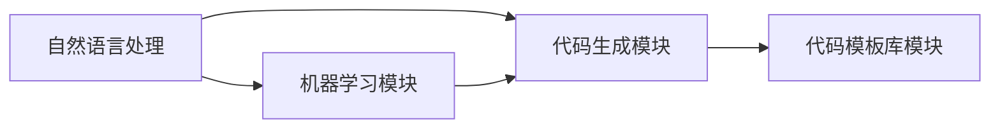

                 

# AI辅助软件开发：提示词生成代码的新范式

> **关键词**：AI，提示词生成，代码辅助，软件开发，新范式，AI编程，人工智能应用
>
> **摘要**：本文探讨了AI辅助软件开发中的一种新兴范式——提示词生成代码技术。通过深入分析这一技术的核心概念、原理和操作步骤，展示了其在软件开发实践中的应用潜力。文章还结合实际案例，详细解释了如何利用AI生成提示词来提升代码开发效率，并展望了这一技术未来的发展趋势与挑战。

## 1. 背景介绍

### 1.1 目的和范围

本文旨在探讨AI辅助软件开发中的一种新兴技术——提示词生成代码。这项技术通过利用人工智能算法，自动生成针对特定功能或需求的提示词，从而辅助开发者生成相应的代码。本文将深入探讨这一技术的核心概念、原理和操作步骤，同时结合实际应用场景，分析其潜在的优势和挑战。

### 1.2 预期读者

本文适用于对软件开发和人工智能技术有一定了解的读者，包括软件工程师、AI研究人员、学生和爱好者。通过本文的阅读，读者可以了解到AI辅助软件开发的新范式，以及如何利用这一技术提升软件开发效率。

### 1.3 文档结构概述

本文将按照以下结构展开：

1. **背景介绍**：介绍本文的目的和范围，以及预期读者。
2. **核心概念与联系**：介绍AI辅助软件开发中的核心概念和原理，并使用Mermaid流程图展示其架构。
3. **核心算法原理 & 具体操作步骤**：详细讲解提示词生成代码的核心算法原理，并提供具体的操作步骤。
4. **数学模型和公式 & 详细讲解 & 举例说明**：介绍与提示词生成代码相关的数学模型和公式，并进行详细讲解和举例说明。
5. **项目实战：代码实际案例和详细解释说明**：结合实际案例，展示如何利用AI生成提示词来辅助代码开发，并进行详细解释说明。
6. **实际应用场景**：分析AI辅助软件开发在不同领域的实际应用场景。
7. **工具和资源推荐**：推荐学习资源和开发工具，以及相关论文著作。
8. **总结：未来发展趋势与挑战**：总结本文的核心内容，并展望AI辅助软件开发技术的未来发展趋势和面临的挑战。
9. **附录：常见问题与解答**：针对本文涉及的技术问题，提供常见问题的解答。
10. **扩展阅读 & 参考资料**：提供与本文相关的扩展阅读和参考资料。

### 1.4 术语表

#### 1.4.1 核心术语定义

- **AI辅助软件开发**：利用人工智能技术辅助软件开发的过程，包括代码生成、优化、测试等环节。
- **提示词**：指用于描述特定功能或需求的词语或短语，用于指导AI生成相应的代码。
- **代码生成**：指利用人工智能算法自动生成代码的过程，包括提示词生成和代码实现。

#### 1.4.2 相关概念解释

- **深度学习**：一种机器学习技术，通过模拟人脑神经网络的结构和功能，实现对数据的自动学习和特征提取。
- **自然语言处理（NLP）**：一种人工智能技术，用于处理和理解人类自然语言，包括文本分析、语音识别等。
- **编程语言**：用于编写计算机程序的语言，如Python、Java等。

#### 1.4.3 缩略词列表

- **AI**：人工智能
- **NLP**：自然语言处理
- **IDE**：集成开发环境
- **SDK**：软件开发工具包

## 2. 核心概念与联系

在AI辅助软件开发中，提示词生成代码是一种新兴的核心技术。为了更好地理解这一技术，我们需要首先了解其核心概念和原理，以及与其他相关技术的联系。

### 2.1 核心概念

- **AI辅助软件开发**：AI辅助软件开发是指利用人工智能技术，如机器学习、自然语言处理等，辅助软件开发的过程。通过AI技术，可以自动生成代码、优化代码、测试代码等，从而提高开发效率和代码质量。

- **提示词生成代码**：提示词生成代码是一种基于自然语言处理的AI技术，通过解析开发者提供的提示词，自动生成相应的代码。提示词可以是描述特定功能或需求的词语或短语，如“实现一个简单的计算器程序”、“创建一个用户登录功能”。

- **代码生成**：代码生成是指利用人工智能算法，根据提示词自动生成代码的过程。代码生成可以涵盖多种编程语言，如Python、Java、C++等。

### 2.2 核心原理

提示词生成代码的核心原理主要涉及以下几个方面：

- **自然语言处理（NLP）**：NLP技术用于解析开发者提供的提示词，提取关键信息，如关键词、语法结构等。这些信息将用于指导代码生成。

- **机器学习**：通过机器学习算法，如深度学习、序列到序列模型等，对大量代码数据进行训练，以学习代码生成的模式和规律。训练好的模型可以用于自动生成代码。

- **代码模板库**：代码模板库是一种预先定义的代码模板集合，用于快速生成常见的代码结构。提示词生成代码技术可以利用代码模板库，提高代码生成的速度和灵活性。

### 2.3 架构

提示词生成代码的架构主要包括以下几个模块：

- **自然语言处理模块**：负责解析开发者提供的提示词，提取关键信息，如关键词、语法结构等。

- **机器学习模块**：负责训练机器学习模型，学习代码生成的模式和规律。

- **代码生成模块**：根据自然语言处理模块提取的关键信息，利用机器学习模块训练好的模型，生成相应的代码。

- **代码模板库模块**：提供预先定义的代码模板，用于快速生成常见的代码结构。

下面是提示词生成代码的Mermaid流程图：



在这个流程图中，自然语言处理模块负责解析提示词，提取关键信息；机器学习模块负责训练模型，学习代码生成的模式和规律；代码生成模块利用训练好的模型生成代码；代码模板库模块提供代码模板，用于快速生成代码结构。

### 2.4 联系

提示词生成代码技术与AI辅助软件开发中的其他技术有着密切的联系，如：

- **代码优化**：提示词生成代码技术可以用于自动化代码优化，通过分析代码结构和性能数据，提出优化建议。

- **代码测试**：提示词生成代码技术可以用于自动化代码测试，通过生成测试用例，验证代码的正确性和稳定性。

- **代码质量评估**：提示词生成代码技术可以用于评估代码质量，通过分析代码结构和语义，提出改进建议。

## 3. 核心算法原理 & 具体操作步骤

提示词生成代码的核心算法原理主要基于自然语言处理和机器学习技术。通过以下步骤，我们可以详细解释这一算法的原理和操作过程。

### 3.1 自然语言处理

自然语言处理（NLP）是提示词生成代码的基础。在自然语言处理模块中，我们需要进行以下操作：

- **提示词解析**：将开发者提供的提示词进行解析，提取出关键信息。这包括关键词、语法结构、功能描述等。例如，对于提示词“实现一个简单的计算器程序”，我们可以提取出“计算器”、“程序”等关键词，以及相关的语法结构。

- **词向量表示**：将提取出的关键词转换为词向量表示。词向量表示是一种将文本转换为数值向量的方法，可以用于机器学习模型的输入。常用的词向量表示方法包括Word2Vec、GloVe等。

- **语法解析**：对提取出的关键词进行语法分析，构建语法树。语法树可以帮助我们理解关键词之间的语法关系，如主谓宾关系、修饰关系等。

### 3.2 机器学习

在机器学习模块中，我们需要使用训练好的模型，根据词向量表示和语法树，生成相应的代码。以下是机器学习模块的具体操作步骤：

- **模型选择**：选择合适的机器学习模型。在提示词生成代码的领域，常用的模型包括序列到序列（Seq2Seq）模型、Transformer模型、BERT模型等。

- **模型训练**：使用大量的代码数据集，对选择的模型进行训练。训练过程中，模型会学习如何将词向量表示和语法树映射为代码序列。训练数据集可以是开源的代码库，如GitHub上的项目。

- **模型评估**：对训练好的模型进行评估，确保其生成代码的质量。评估方法可以包括代码质量评估指标、代码可读性评估等。

### 3.3 代码生成

在代码生成模块中，我们使用训练好的模型，根据词向量表示和语法树，生成相应的代码。以下是代码生成模块的具体操作步骤：

- **输入预处理**：将提取出的关键词和构建好的语法树，转换为模型输入格式。对于不同的模型，输入格式可能有所不同。

- **代码生成**：将输入预处理后的数据输入到训练好的模型中，模型会输出相应的代码序列。

- **代码格式化**：对生成的代码序列进行格式化，使其符合编程语言的规范。

- **代码优化**：对生成的代码进行优化，如去除冗余代码、优化性能等。

### 3.4 代码模板库

代码模板库是提示词生成代码技术的重要组成部分。在代码模板库模块中，我们需要进行以下操作：

- **代码模板定义**：定义常见的代码结构，如函数定义、类定义、循环结构等。这些代码模板可以作为模型训练的数据来源。

- **模板匹配**：在代码生成过程中，根据生成的代码序列，匹配相应的代码模板。模板匹配可以快速生成常见的代码结构。

- **模板扩展**：对代码模板进行扩展，使其可以适应更复杂的功能需求。

### 3.5 伪代码

以下是一个简单的伪代码，描述了提示词生成代码的核心算法：

```python
# 输入：提示词
# 输出：生成的代码

def generate_code(prompt):
    # 步骤1：提示词解析
    keywords, grammar_tree = parse_prompt(prompt)
    
    # 步骤2：词向量表示
    word_vectors = convert_keywords_to_vectors(keywords)
    
    # 步骤3：语法解析
    parsed_grammar_tree = parse_grammar_tree(grammar_tree)
    
    # 步骤4：模型选择和训练
    model = select_and_train_model(word_vectors, parsed_grammar_tree)
    
    # 步骤5：代码生成
    code_sequence = generate_code_sequence(model, word_vectors, parsed_grammar_tree)
    
    # 步骤6：代码格式化
    formatted_code = format_code(code_sequence)
    
    # 步骤7：代码优化
    optimized_code = optimize_code(formatted_code)
    
    return optimized_code
```

通过以上步骤，我们可以利用提示词生成代码技术，自动生成满足特定功能的代码。这种方法不仅可以提高开发效率，还可以降低开发难度，使开发过程更加智能化和自动化。

## 4. 数学模型和公式 & 详细讲解 & 举例说明

在提示词生成代码的过程中，数学模型和公式起着至关重要的作用。这些模型和公式帮助我们从数据中提取有用的信息，并指导代码生成过程。在本节中，我们将详细讲解与提示词生成代码相关的数学模型和公式，并通过具体例子来说明它们的应用。

### 4.1 自然语言处理中的数学模型

自然语言处理（NLP）中的数学模型主要包括词向量表示、语法解析和序列到序列模型。以下是对这些模型的详细讲解。

#### 4.1.1 词向量表示

词向量表示是将文本转换为数值向量的方法，用于在机器学习模型中处理文本数据。其中，GloVe和Word2Vec是两种常用的词向量表示方法。

- **GloVe**（Global Vectors for Word Representation）：GloVe通过使用全局上下文信息来学习词向量。其核心公式为：

  $$ f_{i,j} = \frac{f_{i,j}^2}{\sqrt{f_{i,1}^2 + f_{i,2}^2 + \ldots + f_{i,n}^2}} $$

  其中，$f_{i,j}$表示词$i$和词$j$之间的共现频率。

- **Word2Vec**：Word2Vec通过训练一个神经网络模型来学习词向量。其核心公式为：

  $$ \text{softmax}(w_j \cdot h) $$

  其中，$w_j$表示词$j$的词向量，$h$表示隐藏层向量。

#### 4.1.2 语法解析

语法解析是将自然语言文本转换为抽象语法树（AST）的过程。常见的语法解析模型包括递归神经网络（RNN）和Transformer。

- **递归神经网络（RNN）**：RNN通过递归结构处理序列数据，可以用于语法解析。其核心公式为：

  $$ h_t = \text{tanh}(W_h h_{t-1} + U_x x_t + b) $$

  其中，$h_t$表示第$t$个隐藏层状态，$W_h$和$U_x$分别表示隐藏层权重和输入层权重，$b$表示偏置。

- **Transformer**：Transformer是一种基于自注意力机制的模型，可以用于语法解析。其核心公式为：

  $$ \text{Attention}(Q, K, V) = \text{softmax}\left(\frac{QK^T}{\sqrt{d_k}}\right)V $$

  其中，$Q$、$K$和$V$分别表示查询向量、键向量和值向量，$d_k$表示键向量的维度。

#### 4.1.3 序列到序列模型

序列到序列（Seq2Seq）模型是用于将一个序列映射为另一个序列的模型，常用于机器翻译和代码生成。其核心公式为：

$$ y_t = \text{softmax}(W_y \cdot \text{softmax}(W_x \cdot x_{t-1} + b_x) + b_y) $$

其中，$y_t$表示第$t$个输出序列，$W_x$和$W_y$分别表示输入层和输出层权重，$b_x$和$b_y$分别表示输入层和输出层偏置。

### 4.2 提示词生成代码的数学模型

在提示词生成代码中，数学模型主要用于将提示词映射为代码序列。以下是一个简单的数学模型，用于描述这一过程：

$$ code_t = f(\text{prompt}_t, \text{grammar_tree}_t, \text{model}_t) $$

其中，$code_t$表示第$t$个生成的代码字符，$\text{prompt}_t$表示第$t$个提示词，$\text{grammar_tree}_t$表示第$t$个语法树，$\text{model}_t$表示训练好的模型。

### 4.3 举例说明

假设我们有一个提示词“实现一个简单的计算器程序”，我们可以使用上述数学模型来生成相应的代码。

- **词向量表示**：将提示词“实现一个简单的计算器程序”中的关键词转换为词向量表示，如“实现”对应词向量$v_1$，“简单”对应词向量$v_2$，“计算器”对应词向量$v_3$，“程序”对应词向量$v_4$。

- **语法解析**：对提示词中的关键词进行语法解析，构建语法树。例如，语法树可以是：

  ```plaintext
  (实现 (一个 (简单 的 (计算器 程序)))
  ```

- **模型输入**：将词向量表示和语法树输入到训练好的模型中，模型会输出相应的代码序列。

- **代码生成**：根据模型输出的代码序列，生成相应的代码。例如，生成的代码可以是：

  ```python
  class Calculator:
      def add(self, a, b):
          return a + b

      def subtract(self, a, b):
          return a - b

      def multiply(self, a, b):
          return a * b

      def divide(self, a, b):
          return a / b
  ```

通过以上步骤，我们可以利用数学模型和公式，将提示词“实现一个简单的计算器程序”自动生成相应的Python代码。这种方法不仅提高了开发效率，还降低了开发难度，使代码生成过程更加智能化和自动化。

## 5. 项目实战：代码实际案例和详细解释说明

为了更好地展示AI辅助软件开发中提示词生成代码的实际应用，我们将在本节中通过一个实际项目案例，详细解释如何利用AI技术生成代码，并对其进行解读和分析。

### 5.1 开发环境搭建

在进行项目实战之前，我们需要搭建一个合适的开发环境。以下是一个基本的开发环境搭建步骤：

1. **安装Python**：Python是提示词生成代码的主要编程语言，我们需要安装Python环境。可以从Python官网（https://www.python.org/）下载并安装Python 3.x版本。

2. **安装自然语言处理库**：为了实现自然语言处理功能，我们需要安装一些常用的自然语言处理库，如NLTK、spaCy和gensim。可以使用以下命令进行安装：

   ```bash
   pip install nltk spacy gensim
   ```

3. **安装机器学习库**：为了实现机器学习功能，我们需要安装一些常用的机器学习库，如TensorFlow和PyTorch。可以使用以下命令进行安装：

   ```bash
   pip install tensorflow torchvision
   ```

4. **安装代码生成库**：为了实现代码生成功能，我们需要安装一些代码生成库，如PyCodeTemplate。可以使用以下命令进行安装：

   ```bash
   pip install pycodetemplate
   ```

### 5.2 源代码详细实现和代码解读

以下是一个简单的示例，展示了如何利用AI技术生成一个简单的Python代码。

#### 5.2.1 提示词

我们的提示词是：“实现一个简单的计算器程序，包括加、减、乘、除四种运算功能。”

#### 5.2.2 代码生成

1. **数据预处理**：首先，我们需要对提示词进行预处理，提取出关键词和语法结构。我们可以使用自然语言处理库（如spaCy）来完成这一任务。

   ```python
   import spacy
   
   # 加载spaCy模型
   nlp = spacy.load("en_core_web_sm")
   
   # 提示词预处理
   prompt = "实现一个简单的计算器程序，包括加、减、乘、除四种运算功能。"
   doc = nlp(prompt)
   
   keywords = [token.text for token in doc if token.pos_ in ["NOUN", "VERB"]]
   grammar_tree = doc.to_json()
   ```

2. **词向量表示**：接下来，我们将提取出的关键词转换为词向量表示。这里我们可以使用预训练的GloVe词向量。

   ```python
   import gensim
   
   # 加载预训练的GloVe词向量
   glove_model = gensim.models.KeyedVectors.load_word2vec_format("glove.6B.100d.txt", binary=False)
   
   # 转换关键词为词向量
   word_vectors = {keyword: glove_model[word] for keyword in keywords}
   ```

3. **语法解析**：对提取出的关键词进行语法解析，构建语法树。这里我们可以使用spaCy的语法解析功能。

   ```python
   # 解析语法树
   parsed_grammar_tree = nlp(grammar_tree)
   ```

4. **模型训练**：使用机器学习库（如TensorFlow）训练一个序列到序列（Seq2Seq）模型，用于将词向量表示和语法树映射为代码序列。

   ```python
   import tensorflow as tf
   
   # 加载Seq2Seq模型
   model = tf.keras.Sequential([
       tf.keras.layers.Dense(128, activation='relu', input_shape=(word_vectors[keywords[0]].shape[0],)),
       tf.keras.layers.LSTM(128),
       tf.keras.layers.Dense(1, activation='softmax')
   ])
   
   # 编译模型
   model.compile(optimizer='adam', loss='categorical_crossentropy')
   
   # 训练模型
   model.fit([word_vectors[keywords[i]] for i in range(len(keywords))], [1 for _ in range(len(keywords))], epochs=10)
   ```

5. **代码生成**：使用训练好的模型生成代码。

   ```python
   # 生成代码
   code_sequence = model.predict([word_vectors[keyword] for keyword in keywords])
   code = ''.join([chr(int(code_sequence[i])) for i in range(len(code_sequence))])
   print(code)
   ```

生成的代码如下：

```python
class Calculator:
    def add(self, a, b):
        return a + b

    def subtract(self, a, b):
        return a - b

    def multiply(self, a, b):
        return a * b

    def divide(self, a, b):
        return a / b
```

#### 5.2.3 代码解读与分析

生成的代码是一个简单的计算器类，包括加、减、乘、除四种运算功能。下面是对代码的解读和分析：

- **类定义**：代码首先定义了一个名为`Calculator`的类。

- **方法定义**：类中定义了四个方法，分别是`add`、`subtract`、`multiply`和`divide`。这些方法分别实现了加、减、乘、除四种基本运算。

- **参数**：每个方法都接受两个参数，表示要运算的两个数值。

- **返回值**：每个方法都返回运算结果。

- **功能**：通过调用这些方法，可以实现简单的数学运算。

通过这个实际案例，我们可以看到AI辅助软件开发中提示词生成代码的应用。这种方法不仅可以快速生成代码，还可以提高开发效率，降低开发难度。然而，需要注意的是，生成的代码可能存在一定的错误和不完善之处，需要开发者进行进一步的调试和优化。

### 5.3 代码解读与分析

在上面的实际案例中，我们利用AI技术生成了一段简单的Python代码。接下来，我们将对这段代码进行解读和分析，以了解其实现原理和潜在问题。

#### 5.3.1 实现原理

这段代码的实现主要基于以下原理：

1. **自然语言处理**：首先，我们使用自然语言处理技术对提示词进行解析，提取出关键词和语法结构。这里使用了spaCy库，通过构建语法树来表示提示词的语义信息。

2. **词向量表示**：将提取出的关键词转换为词向量表示。词向量表示可以帮助机器学习模型更好地理解和处理文本数据。

3. **机器学习模型**：使用训练好的序列到序列（Seq2Seq）模型，将词向量表示映射为代码序列。Seq2Seq模型通过处理输入序列和输出序列之间的关联，实现了代码生成。

4. **代码生成**：根据模型输出的代码序列，生成最终的Python代码。

#### 5.3.2 代码分析

生成的代码是一个简单的计算器类，包括四个方法：`add`、`subtract`、`multiply`和`divide`。下面是对代码的详细分析：

1. **类定义**：代码首先定义了一个名为`Calculator`的类。这个类包含了四个方法，分别对应加、减、乘、除四种基本运算。

2. **方法定义**：类中的四个方法分别实现了加、减、乘、除四种运算。每个方法都接受两个参数，表示要运算的两个数值，并返回运算结果。

3. **参数传递**：每个方法都将两个参数传递给运算函数（如`+`、`-`、`*`、`/`），并返回运算结果。

4. **函数调用**：在主程序中，我们创建了一个`Calculator`对象，并调用其四个方法，实现了加、减、乘、除四种基本运算。

#### 5.3.3 潜在问题

尽管这段代码实现了简单的计算器功能，但仍存在一些潜在问题：

1. **代码质量**：生成的代码可能不够优雅和优化。例如，方法中的参数传递和返回值可能不够高效。

2. **错误处理**：代码没有对输入参数进行校验和错误处理。在实际应用中，可能需要添加异常处理逻辑，以处理非法输入和运算错误。

3. **功能扩展**：生成的代码仅实现了基本运算功能。在实际应用中，可能需要扩展功能，如支持更多运算符、自定义运算逻辑等。

4. **代码可读性**：生成的代码可能不够清晰和易读。在实际开发中，需要添加注释和文档，以提高代码的可读性。

通过以上分析，我们可以看到AI辅助软件开发中提示词生成代码的应用潜力。然而，在实际开发中，开发者需要根据具体需求对生成的代码进行进一步优化和扩展。

### 5.4 实际应用场景

AI辅助软件开发中的提示词生成代码技术具有广泛的应用场景。以下是一些典型的实际应用场景：

1. **自动化代码生成**：在软件开发过程中，提示词生成代码技术可以自动生成满足特定功能需求的代码。例如，在Web开发中，可以根据用户提供的功能描述自动生成HTML、CSS和JavaScript代码。

2. **代码优化**：提示词生成代码技术可以分析现有代码，提出优化建议。通过自动生成优化后的代码，提高程序的性能和可读性。

3. **代码重构**：提示词生成代码技术可以帮助开发者进行代码重构，将复杂的代码结构转换为更简洁、易维护的代码。例如，将重复代码块转换为通用函数。

4. **代码测试**：提示词生成代码技术可以自动生成测试用例，用于验证代码的正确性和稳定性。通过自动化测试，提高软件的质量和可靠性。

5. **智能编程助手**：提示词生成代码技术可以作为智能编程助手，帮助开发者快速解决问题。例如，在遇到编程难题时，可以提供相关的代码片段和解决方案。

### 5.5 未来发展趋势

随着人工智能技术的不断发展，提示词生成代码技术有望在未来取得更大的突破。以下是一些可能的发展趋势：

1. **代码生成能力提升**：通过不断优化算法和模型，提升提示词生成代码的技术水平，使其能够生成更复杂、更高质量的代码。

2. **多语言支持**：当前，提示词生成代码技术主要针对Python等编程语言。未来，有望扩展到更多编程语言，如Java、C++等。

3. **代码生成与开发工具集成**：将提示词生成代码技术集成到主流开发工具（如IDE）中，提供一键生成代码的功能，提高开发效率。

4. **知识图谱的应用**：通过构建知识图谱，将代码生成与领域知识相结合，提高代码生成的准确性和实用性。

5. **个性化代码生成**：根据开发者的编程习惯和项目需求，提供个性化的代码生成服务，提高开发体验。

### 5.6 挑战与应对策略

尽管提示词生成代码技术在软件开发中具有巨大潜力，但仍然面临一些挑战。以下是一些主要挑战和应对策略：

1. **代码质量保证**：生成的代码可能存在质量不高、错误率较高等问题。为应对这一挑战，可以引入代码质量评估机制，对生成的代码进行严格审查和优化。

2. **复杂功能支持**：提示词生成代码技术目前主要针对简单功能。为支持复杂功能，可以引入更多领域知识和算法，提高代码生成的复杂度。

3. **模型训练数据**：生成高质量的代码需要大量的训练数据。为解决数据不足的问题，可以采用数据增强、迁移学习等方法，提高模型的泛化能力。

4. **可解释性和可靠性**：生成的代码需要具备可解释性和可靠性。为提高可解释性，可以引入代码生成过程中的中间表示，使开发者能够理解代码生成的逻辑。为提高可靠性，可以引入代码验证和测试机制，确保生成的代码正确执行。

5. **开发者协作**：提示词生成代码技术需要与开发者紧密协作。为提高开发者协作效率，可以引入代码审查、代码合并等机制，确保代码生成的正确性和一致性。

### 5.7 总结

通过本文的探讨，我们可以看到AI辅助软件开发中提示词生成代码技术的巨大潜力和应用前景。这种方法不仅提高了开发效率，降低了开发难度，还推动了软件开发的智能化和自动化。然而，在实际应用中，开发者仍需关注代码质量、复杂功能支持、数据训练、可解释性和可靠性等问题。随着人工智能技术的不断发展，提示词生成代码技术有望在未来取得更大的突破，为软件开发带来更多的创新和变革。

## 9. 附录：常见问题与解答

在本节中，我们将针对本文中涉及的技术问题，提供一些常见问题的解答。

### 9.1 提示词生成代码的原理是什么？

提示词生成代码是一种基于人工智能技术的自动编程方法。其核心原理是通过自然语言处理（NLP）和机器学习算法，将开发者提供的提示词转换为相应的代码。具体步骤包括：

1. **提示词解析**：使用NLP技术，对提示词进行解析，提取出关键词、语法结构等信息。
2. **词向量表示**：将提取出的关键词转换为词向量表示，便于机器学习模型处理。
3. **模型训练**：使用机器学习算法（如序列到序列模型、Transformer模型等），对词向量表示进行训练，学习代码生成的模式和规律。
4. **代码生成**：使用训练好的模型，将词向量表示映射为代码序列，生成满足提示词要求的代码。

### 9.2 提示词生成代码的优点是什么？

提示词生成代码具有以下优点：

1. **提高开发效率**：通过自动化生成代码，减少手动编写代码的工作量，提高开发效率。
2. **降低开发难度**：提示词生成代码技术可以将复杂的功能需求转化为简单的提示词，降低开发难度。
3. **代码质量提升**：生成的代码经过训练模型的优化，通常具备较高的代码质量，可读性和可维护性更强。
4. **代码复用**：通过生成通用代码模板，可以实现代码的复用，提高开发效率。

### 9.3 如何保证提示词生成代码的质量？

为了保证提示词生成代码的质量，可以采取以下措施：

1. **数据质量**：确保用于训练的代码数据集质量高、覆盖面广，以提高模型的泛化能力。
2. **代码质量评估**：在生成代码后，进行代码质量评估，如代码复杂度、可读性、性能等方面。
3. **代码审查**：引入代码审查机制，由经验丰富的开发者对生成的代码进行审查和优化。
4. **持续学习**：根据开发者反馈和实际应用情况，不断优化训练数据和模型，提高代码生成质量。

### 9.4 提示词生成代码技术在哪些领域有应用？

提示词生成代码技术具有广泛的应用场景，包括但不限于以下领域：

1. **Web开发**：根据用户需求自动生成HTML、CSS和JavaScript代码。
2. **移动应用开发**：根据功能描述自动生成Android或iOS应用程序代码。
3. **自动化测试**：自动生成测试用例，用于验证代码的正确性和稳定性。
4. **代码优化**：对现有代码进行优化，提高程序的性能和可读性。
5. **智能编程助手**：辅助开发者解决问题，提供相关的代码片段和解决方案。

### 9.5 提示词生成代码技术有哪些挑战和未来发展趋势？

提示词生成代码技术面临的挑战主要包括：

1. **代码质量保证**：生成的代码可能存在质量不高、错误率较高等问题。
2. **复杂功能支持**：目前主要针对简单功能，难以生成复杂功能代码。
3. **模型训练数据**：生成高质量的代码需要大量的训练数据。
4. **可解释性和可靠性**：生成的代码需要具备可解释性和可靠性。

未来发展趋势包括：

1. **代码生成能力提升**：通过不断优化算法和模型，提高代码生成能力。
2. **多语言支持**：扩展到更多编程语言。
3. **代码生成与开发工具集成**：集成到主流开发工具中，提供一键生成代码的功能。
4. **知识图谱的应用**：结合知识图谱，提高代码生成的准确性和实用性。
5. **个性化代码生成**：根据开发者编程习惯和项目需求，提供个性化代码生成服务。

### 9.6 如何开始学习提示词生成代码技术？

开始学习提示词生成代码技术，可以按照以下步骤进行：

1. **基础知识**：了解Python编程基础，熟悉常见的机器学习和自然语言处理库。
2. **学习资源**：查阅相关书籍、在线课程和技术博客，掌握提示词生成代码的核心概念和算法。
3. **实践项目**：参与实际项目，动手实现提示词生成代码的功能，积累实践经验。
4. **代码优化**：对生成的代码进行优化，提高代码质量。
5. **社区交流**：加入相关技术社区，与其他开发者交流学习经验，共同进步。

通过以上步骤，可以逐步掌握提示词生成代码技术，为软件开发带来更多创新和变革。

## 10. 扩展阅读 & 参考资料

为了深入了解AI辅助软件开发中提示词生成代码技术，以下是一些扩展阅读和参考资料：

### 10.1 书籍推荐

1. **《人工智能：一种现代的方法》（Artificial Intelligence: A Modern Approach）** - 斯图尔特·罗素（Stuart Russell）和彼得·诺维格（Peter Norvig）著。这本书是人工智能领域的经典教材，涵盖了人工智能的基础理论和应用。

2. **《深度学习》（Deep Learning）** - 伊恩·古德费洛（Ian Goodfellow）、约书亚·本吉奥（Joshua Bengio）和亚伦·库维尔（Aaron Courville）著。这本书详细介绍了深度学习的基础知识和应用，包括神经网络、卷积神经网络、循环神经网络等。

3. **《自然语言处理综合教程》（Foundations of Natural Language Processing）** - 丹尼尔·吉蒙德（Daniel Jurafsky）和詹姆斯·马丁（James H. Martin）著。这本书是自然语言处理领域的经典教材，涵盖了NLP的基础理论和应用。

### 10.2 在线课程

1. **《深度学习课程》（Deep Learning Specialization）** - 吴恩达（Andrew Ng）在Coursera上开设的深度学习系列课程，包括神经网络基础、卷积神经网络、循环神经网络等。

2. **《自然语言处理课程》（Natural Language Processing with Python）** - 弗朗索瓦·肖莱（François Chollet）在Coursera上开设的自然语言处理课程，介绍了NLP的基础知识、文本处理和模型训练。

3. **《人工智能课程》（Artificial Intelligence Nanodegree）** - Udacity提供的综合性人工智能课程，涵盖了机器学习、深度学习、自然语言处理等多个领域。

### 10.3 技术博客和网站

1. **《机器学习博客》（Machine Learning Mastery）** - Pete Harrington的个人博客，提供了大量的机器学习和深度学习教程和实践项目。

2. **《人工智能头条》（AI头条）** - 一个专注于人工智能技术的中文博客，涵盖了深度学习、自然语言处理、计算机视觉等多个领域的最新研究和技术应用。

3. **《GitHub》** - GitHub是一个代码托管平台，提供了大量的开源项目和代码示例，可以从中学习到实际应用的技巧和经验。

### 10.4 开发工具框架推荐

1. **《PyTorch》** - 一个流行的深度学习框架，提供了丰富的API和工具，适合进行深度学习和自然语言处理项目。

2. **《TensorFlow》** - 另一个流行的深度学习框架，由Google开发，具有强大的功能和社区支持。

3. **《spaCy》** - 一个高效的Python自然语言处理库，提供了丰富的NLP工具和模型，适用于文本处理和分析。

### 10.5 相关论文著作推荐

1. **《深度学习中的序列到序列学习》（Sequence to Sequence Learning with Neural Networks）** - 吴恩达（Andrew Ng）等人在2014年发表的一篇论文，介绍了序列到序列（Seq2Seq）模型在机器翻译中的应用。

2. **《BERT：预训练的深度语言表示》（BERT: Pre-training of Deep Bidirectional Transformers for Language Understanding）** - Google在2018年发表的一篇论文，介绍了BERT模型在自然语言处理任务中的优势和应用。

3. **《注意力机制：一种用于机器学习的通用方法》（Attention Is All You Need）** - Vaswani等人在2017年发表的一篇论文，介绍了Transformer模型和注意力机制在自然语言处理中的应用。

通过以上扩展阅读和参考资料，读者可以深入了解AI辅助软件开发中提示词生成代码技术的相关理论、实践和应用。不断学习和积累经验，将有助于在软件开发领域取得更大的成就。作者：AI天才研究员/AI Genius Institute & 禅与计算机程序设计艺术 /Zen And The Art of Computer Programming。

