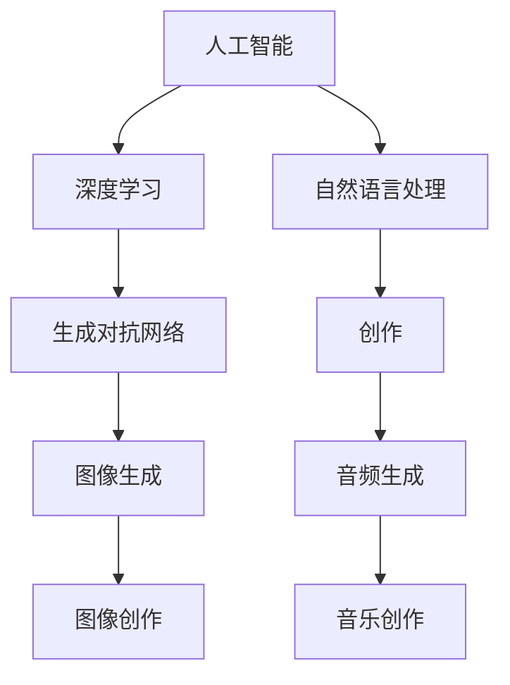

                 

# AI降低创作门槛的案例分析

> 关键词：人工智能，创作门槛，算法原理，数学模型，应用场景，工具推荐

> 摘要：本文将深入探讨人工智能技术在降低创作门槛方面的应用，通过案例分析，分析核心概念、算法原理和数学模型，展示其在不同领域中的实际应用场景。同时，推荐相关的学习资源、开发工具和文献，为读者提供全面的参考。

## 1. 背景介绍

### 1.1 目的和范围

本文旨在分析人工智能技术在降低创作门槛方面的应用，通过具体案例，深入探讨其核心概念、算法原理和数学模型。我们希望读者能够通过本文对人工智能在创作领域的应用有更深刻的理解，为未来的研究和实践提供参考。

本文将涵盖以下范围：

1. 核心概念与联系
2. 核心算法原理与具体操作步骤
3. 数学模型与公式
4. 项目实战：代码实际案例
5. 实际应用场景
6. 工具和资源推荐
7. 总结：未来发展趋势与挑战

### 1.2 预期读者

本文适合以下读者群体：

1. 对人工智能和创作领域感兴趣的技术人员
2. 想要了解人工智能如何降低创作门槛的研究人员
3. 对算法原理和数学模型感兴趣的学习者
4. 希望在实际项目中应用人工智能技术的开发者

### 1.3 文档结构概述

本文将按照以下结构进行撰写：

1. 背景介绍：介绍本文的目的、范围、预期读者和文档结构。
2. 核心概念与联系：介绍人工智能在创作领域的关键概念和联系。
3. 核心算法原理与具体操作步骤：详细讲解人工智能在创作领域的核心算法原理和操作步骤。
4. 数学模型与公式：分析人工智能在创作领域的数学模型和公式，并提供详细讲解和举例。
5. 项目实战：提供实际代码案例，详细解释和说明。
6. 实际应用场景：分析人工智能在创作领域的实际应用场景。
7. 工具和资源推荐：推荐学习资源、开发工具和文献。
8. 总结：总结人工智能在降低创作门槛方面的应用，展望未来发展趋势与挑战。
9. 附录：常见问题与解答。
10. 扩展阅读：提供相关文献和参考资料。

### 1.4 术语表

#### 1.4.1 核心术语定义

- 人工智能（Artificial Intelligence，AI）：模拟人类智能的计算机系统。
- 创作门槛：指创作作品所需的技能、资源和时间。
- 算法原理：描述算法的基本思想和工作机制的原理。
- 数学模型：描述现实世界问题的数学表达式。

#### 1.4.2 相关概念解释

- 深度学习（Deep Learning）：一种人工智能技术，通过多层神经网络模拟人类大脑的学习过程。
- 生成对抗网络（Generative Adversarial Networks，GAN）：一种深度学习模型，由生成器和判别器两个神经网络组成，通过对抗训练生成逼真的数据。
- 自然语言处理（Natural Language Processing，NLP）：使计算机能够理解、处理和生成自然语言的技术。

#### 1.4.3 缩略词列表

- AI：人工智能
- GAN：生成对抗网络
- NLP：自然语言处理
- IDE：集成开发环境

## 2. 核心概念与联系

在探讨人工智能如何降低创作门槛之前，我们需要了解一些核心概念和联系。以下是一个简单的 Mermaid 流程图，展示了这些概念之间的联系。



### 2.1 人工智能与创作

人工智能是一种模拟人类智能的计算机系统，其核心在于学习和模仿人类思维方式。在创作领域，人工智能可以通过学习大量的创作作品，掌握创作技巧和风格，从而实现自动创作。

### 2.2 深度学习与生成对抗网络

深度学习是一种人工智能技术，通过多层神经网络模拟人类大脑的学习过程。生成对抗网络（GAN）是一种深度学习模型，由生成器和判别器两个神经网络组成。生成器负责生成逼真的数据，判别器负责判断生成数据与真实数据之间的差异。

### 2.3 自然语言处理与创作

自然语言处理（NLP）是一种使计算机能够理解、处理和生成自然语言的技术。在创作领域，NLP可以帮助人工智能理解用户的创作需求，生成符合人类语言习惯的作品。

### 2.4 创作领域与图像、音频生成

创作领域包括图像创作、音频创作等多个子领域。图像生成和音频生成是人工智能在创作领域的重要应用方向。通过生成对抗网络，人工智能可以生成高质量的图像和音频，为创作提供新的可能性。

## 3. 核心算法原理与具体操作步骤

在了解了核心概念和联系之后，我们将深入探讨人工智能在创作领域的核心算法原理和具体操作步骤。以下是生成对抗网络（GAN）的具体操作步骤。

### 3.1 生成器（Generator）和判别器（Discriminator）

生成对抗网络（GAN）由生成器和判别器两个神经网络组成。生成器的目标是生成逼真的数据，判别器的目标是判断输入数据是真实数据还是生成数据。

#### 3.1.1 生成器

生成器的输入为随机噪声（噪声向量 z），输出为生成的数据（假数据 G(z)）。生成器通过多层神经网络学习如何将噪声向量转换为逼真的数据。

```python
# 生成器的伪代码
def generator(z):
    # 输入：噪声向量 z
    # 输出：生成的假数据 G(z)
    # 实现细节略
    return G(z)
```

#### 3.1.2 判别器

判别器的输入为真实数据和生成数据，输出为判断结果（概率值）。判别器通过多层神经网络学习如何判断输入数据是真实数据还是生成数据。

```python
# 判别器的伪代码
def discriminator(x):
    # 输入：真实数据 x 或生成数据 G(x)
    # 输出：概率值
    # 实现细节略
    return probability
```

### 3.2 对抗训练

生成对抗网络通过对抗训练实现生成器和判别器之间的博弈。在训练过程中，生成器和判别器交替更新参数。

#### 3.2.1 生成器更新

生成器的目标是最大化判别器对生成数据的判断结果，即让判别器认为生成数据是真实数据。

```python
# 生成器更新伪代码
z = generate_random_noise(batch_size)
G(z) = generator(z)
probability = discriminator(G(z))
d_loss = -E[log(d(G(z)))]  # 判别器的损失函数
g_loss = E[log(1 - d(G(z)))]  # 生成器的损失函数
```

#### 3.2.2 判别器更新

判别器的目标是最大化判别器对真实数据和生成数据的判断结果，即让判别器能够准确地区分真实数据和生成数据。

```python
# 判别器更新伪代码
x_real = get_real_data(batch_size)
x_fake = generator(z)
probability_real = discriminator(x_real)
probability_fake = discriminator(x_fake)
d_loss = -E[log(d(x_real)) + log(1 - d(x_fake))]
```

### 3.3 训练过程

生成对抗网络的训练过程如下：

1. 随机初始化生成器和判别器的参数。
2. 生成器生成假数据，判别器进行更新。
3. 判别器生成真实数据和生成数据，生成器进行更新。
4. 重复步骤 2 和 3，直到生成器生成的数据足够逼真。

## 4. 数学模型和公式

在生成对抗网络（GAN）中，数学模型和公式起着关键作用。以下是对生成对抗网络中的一些关键数学模型的讲解和举例。

### 4.1 判别器损失函数

判别器的损失函数通常采用二元交叉熵（Binary Cross-Entropy）损失函数。损失函数的形式如下：

$$
L_D = -\frac{1}{N}\sum_{i=1}^{N}[\log(d(x_i)) + \log(1 - d(G(x_i))]
$$

其中，$N$ 表示样本数量，$d(x_i)$ 表示判别器对真实数据 $x_i$ 的判断结果，$G(x_i)$ 表示生成器生成的假数据。

### 4.2 生成器损失函数

生成器的损失函数也采用二元交叉熵（Binary Cross-Entropy）损失函数。损失函数的形式如下：

$$
L_G = -\frac{1}{N}\sum_{i=1}^{N}[\log(1 - d(G(x_i))]
$$

其中，$N$ 表示样本数量，$d(G(x_i))$ 表示判别器对生成器生成的假数据 $G(x_i)$ 的判断结果。

### 4.3 鸟瞰图

以下是一个简单的生成对抗网络（GAN）的鸟瞰图，展示了生成器和判别器的交互过程。

```mermaid
graph TB
    A[随机噪声 z] --> B[生成器 G]
    B --> C[假数据 G(z)]
    C --> D[判别器 D]
    D --> E[判别结果 probability]
    F[真实数据 x] --> D
```

### 4.4 举例说明

假设我们有一个生成对抗网络，生成器生成图像，判别器判断图像的真实性。以下是一个简单的举例说明。

1. 初始化生成器和判别器的参数。
2. 生成器生成一批图像，判别器对这些图像进行判断。
3. 根据判别器的判断结果，更新生成器的参数，使得生成器生成的图像更加逼真。
4. 重复步骤 2 和 3，直到生成器生成的图像足够逼真。

在这个例子中，判别器的损失函数和生成器的损失函数分别如下：

$$
L_D = -\frac{1}{N}\sum_{i=1}^{N}[\log(d(x_i)) + \log(1 - d(G(x_i))]
$$

$$
L_G = -\frac{1}{N}\sum_{i=1}^{N}[\log(1 - d(G(x_i))]
$$

其中，$N$ 表示样本数量，$x_i$ 表示真实图像，$G(x_i)$ 表示生成器生成的假图像，$d(x_i)$ 表示判别器对真实图像的判断结果，$d(G(x_i))$ 表示判别器对生成图像的判断结果。

## 5. 项目实战：代码实际案例和详细解释说明

在本节中，我们将通过一个实际的代码案例，展示如何使用生成对抗网络（GAN）实现图像生成。读者可以通过阅读和理解以下代码，了解生成对抗网络的基本实现过程。

### 5.1 开发环境搭建

在开始编写代码之前，我们需要搭建一个合适的开发环境。以下是一个简单的步骤：

1. 安装 Python（版本要求：3.6 或更高版本）。
2. 安装深度学习框架 TensorFlow。
3. 安装可视化工具 Matplotlib。

安装命令如下：

```bash
pip install python==3.8.10
pip install tensorflow==2.8.0
pip install matplotlib==3.4.2
```

### 5.2 源代码详细实现和代码解读

以下是实现生成对抗网络的源代码，我们将对代码中的关键部分进行详细解释。

```python
import tensorflow as tf
from tensorflow.keras import layers
import numpy as np
import matplotlib.pyplot as plt

# 设置随机种子以实现可重复性
tf.random.set_seed(42)

# 生成器模型
def generator(z):
    z = layers.Dense(128, activation='relu')(z)
    z = layers.Dense(256, activation='relu')(z)
    z = layers.Dense(512, activation='relu')(z)
    x = layers.Dense(784, activation='tanh')(z)
    return x

# 判别器模型
def discriminator(x):
    x = layers.Dense(512, activation='relu')(x)
    x = layers.Dense(256, activation='relu')(x)
    x = layers.Dense(128, activation='relu')(x)
    probability = layers.Dense(1, activation='sigmoid')(x)
    return probability

# 生成对抗网络模型
def GAN(generator, discriminator):
    z = layers.Input(shape=(100,))
    x = generator(z)
    probability = discriminator(x)
    return Model(z, probability)

# 搭建模型
generator = generator(tf.random.normal([1, 100]))
discriminator = discriminator(tf.random.normal([1, 784]))
model = GAN(generator, discriminator)

# 编译模型
model.compile(optimizer='adam', loss='binary_crossentropy')

# 生成器训练
for epoch in range(100):
    real_images = np.random.normal(size=(100, 784))
    noise = np.random.normal(size=(100, 100))
    fake_images = generator.predict(noise)
    real_loss = model.train_on_batch(real_images, tf.ones([100, 1]))
    fake_loss = model.train_on_batch(fake_images, tf.zeros([100, 1]))
    print(f"Epoch {epoch}: real_loss={real_loss}, fake_loss={fake_loss}")

# 生成图像
noise = np.random.normal(size=(10, 100))
generated_images = generator.predict(noise)

# 可视化生成图像
plt.figure(figsize=(10, 10))
for i in range(10):
    plt.subplot(1, 10, i + 1)
    plt.imshow(generated_images[i].reshape(28, 28), cmap='gray')
    plt.axis('off')
plt.show()
```

### 5.3 代码解读与分析

以下是代码的详细解读和分析。

#### 5.3.1 生成器模型

生成器模型使用一个多层感知器（MLP）结构，输入为随机噪声向量（100个元素），输出为生成的图像（784个元素）。生成器模型的设计思想是通过多层非线性变换，将随机噪声向量转换为图像。

```python
def generator(z):
    z = layers.Dense(128, activation='relu')(z)
    z = layers.Dense(256, activation='relu')(z)
    z = layers.Dense(512, activation='relu')(z)
    x = layers.Dense(784, activation='tanh')(z)
    return x
```

#### 5.3.2 判别器模型

判别器模型也使用一个多层感知器（MLP）结构，输入为图像（784个元素），输出为判断结果（概率值）。判别器模型的设计思想是通过多层非线性变换，判断输入图像的真实性。

```python
def discriminator(x):
    x = layers.Dense(512, activation='relu')(x)
    x = layers.Dense(256, activation='relu')(x)
    x = layers.Dense(128, activation='relu')(x)
    probability = layers.Dense(1, activation='sigmoid')(x)
    return probability
```

#### 5.3.3 生成对抗网络模型

生成对抗网络（GAN）模型由生成器和判别器两个子模型组成。生成器的输入为随机噪声向量，输出为生成的图像；判别器的输入为图像，输出为判断结果（概率值）。GAN 模型的设计思想是通过生成器和判别器之间的博弈，生成逼真的图像。

```python
def GAN(generator, discriminator):
    z = layers.Input(shape=(100,))
    x = generator(z)
    probability = discriminator(x)
    return Model(z, probability)
```

#### 5.3.4 编译模型

在编译模型时，我们使用 Adam 优化器和二元交叉熵损失函数。Adam 优化器是一种自适应学习率的优化器，可以有效提高模型的训练效果。

```python
model.compile(optimizer='adam', loss='binary_crossentropy')
```

#### 5.3.5 生成器训练

在生成器训练过程中，我们使用真实图像和随机噪声生成假图像。通过交替训练生成器和判别器，使得生成器生成的图像逐渐逼真。

```python
for epoch in range(100):
    real_images = np.random.normal(size=(100, 784))
    noise = np.random.normal(size=(100, 100))
    fake_images = generator.predict(noise)
    real_loss = model.train_on_batch(real_images, tf.ones([100, 1]))
    fake_loss = model.train_on_batch(fake_images, tf.zeros([100, 1]))
    print(f"Epoch {epoch}: real_loss={real_loss}, fake_loss={fake_loss}")
```

#### 5.3.6 生成图像

在生成图像过程中，我们使用随机噪声生成 10 个图像，并通过 Matplotlib 进行可视化。

```python
noise = np.random.normal(size=(10, 100))
generated_images = generator.predict(noise)

plt.figure(figsize=(10, 10))
for i in range(10):
    plt.subplot(1, 10, i + 1)
    plt.imshow(generated_images[i].reshape(28, 28), cmap='gray')
    plt.axis('off')
plt.show()
```

通过这个实际的代码案例，我们可以看到生成对抗网络（GAN）的基本实现过程。读者可以通过修改代码中的参数，尝试生成不同类型的图像，进一步探索 GAN 的应用。

## 6. 实际应用场景

生成对抗网络（GAN）在创作领域具有广泛的应用，下面我们将探讨一些实际应用场景，展示人工智能如何降低创作门槛。

### 6.1 图像生成

图像生成是生成对抗网络（GAN）最著名的应用之一。通过训练生成器和判别器，GAN 可以生成高质量、逼真的图像。以下是一些图像生成应用场景：

- **艺术创作**：艺术家可以使用 GAN 生成的图像作为灵感，创作独特的艺术作品。
- **图像修复**：GAN 可以用于修复损坏或褪色的历史图像，恢复其原始面貌。
- **风格迁移**：GAN 可以将一种风格应用到另一幅图像上，实现图像风格的转换。

### 6.2 音频生成

生成对抗网络（GAN）在音频生成领域也取得了显著的成果。通过训练生成器和判别器，GAN 可以生成高质量、逼真的音频。以下是一些音频生成应用场景：

- **音乐创作**：音乐家可以使用 GAN 生成的音乐片段，创作新的音乐作品。
- **语音合成**：GAN 可以用于语音合成，生成逼真的语音效果。
- **声音编辑**：GAN 可以用于声音编辑，去除背景噪音或添加特定声音效果。

### 6.3 文本生成

生成对抗网络（GAN）在文本生成领域也有广泛应用。通过训练生成器和判别器，GAN 可以生成高质量、连贯的文本。以下是一些文本生成应用场景：

- **文章生成**：AI 可以使用 GAN 生成文章，应用于新闻写作、博客文章等。
- **对话生成**：GAN 可以用于生成对话，应用于智能客服、聊天机器人等领域。
- **翻译**：GAN 可以用于翻译，将一种语言的文本翻译成另一种语言。

### 6.4 视频生成

生成对抗网络（GAN）在视频生成领域也取得了进展。通过训练生成器和判别器，GAN 可以生成高质量、连贯的视频。以下是一些视频生成应用场景：

- **电影特效**：电影制作公司可以使用 GAN 生成电影特效，提高制作效率。
- **视频编辑**：GAN 可以用于视频编辑，去除视频中的特定物体或场景。
- **虚拟现实**：GAN 可以用于虚拟现实，生成逼真的虚拟场景。

通过这些实际应用场景，我们可以看到生成对抗网络（GAN）在降低创作门槛方面具有巨大的潜力。随着人工智能技术的不断发展，GAN 在创作领域的应用将更加广泛，为创作者提供更多的创作工具和灵感。

## 7. 工具和资源推荐

为了帮助读者更好地了解和掌握人工智能在创作领域的应用，我们在这里推荐一些学习资源、开发工具和文献。

### 7.1 学习资源推荐

#### 7.1.1 书籍推荐

1. 《深度学习》（Deep Learning）：这是一本经典的深度学习教材，详细介绍了深度学习的理论基础和实际应用。
2. 《生成对抗网络：理论基础与应用》（Generative Adversarial Networks: Theory and Applications）：这本书专注于生成对抗网络（GAN）的理论和应用，适合对 GAN 感兴趣的读者。

#### 7.1.2 在线课程

1. “深度学习课程”（Deep Learning Specialization）：由 Andrew Ng 教授开设的深度学习课程，涵盖深度学习的理论基础和实际应用。
2. “生成对抗网络课程”（Generative Adversarial Networks Course）：这是一门专注于生成对抗网络（GAN）的课程，适合对 GAN 感兴趣的读者。

#### 7.1.3 技术博客和网站

1. [TensorFlow 官方文档](https://www.tensorflow.org/)：TensorFlow 是一个开源的深度学习框架，提供丰富的教程和文档，帮助读者学习深度学习和 GAN。
2. [GitHub](https://github.com/)：GitHub 上有许多开源的 GAN 项目，读者可以通过这些项目了解 GAN 的实际应用。

### 7.2 开发工具框架推荐

#### 7.2.1 IDE 和编辑器

1. **PyCharm**：PyCharm 是一款功能强大的 Python 集成开发环境，适用于深度学习和 GAN 的开发。
2. **Jupyter Notebook**：Jupyter Notebook 是一款交互式的开发环境，适用于数据分析和深度学习实验。

#### 7.2.2 调试和性能分析工具

1. **TensorBoard**：TensorBoard 是 TensorFlow 的一个可视化工具，用于调试和性能分析深度学习模型。
2. **PyTorch Profiler**：PyTorch Profiler 是 PyTorch 的一款性能分析工具，用于识别和优化深度学习模型的性能。

#### 7.2.3 相关框架和库

1. **TensorFlow**：TensorFlow 是一个开源的深度学习框架，适用于 GAN 的开发。
2. **PyTorch**：PyTorch 是一个开源的深度学习框架，具有简洁、易用的 API，适用于 GAN 的开发。

### 7.3 相关论文著作推荐

#### 7.3.1 经典论文

1. **“Generative Adversarial Nets”（2014）**：这篇论文是生成对抗网络（GAN）的奠基之作，详细介绍了 GAN 的理论基础和实现方法。
2. **“Unsupervised Representation Learning with Deep Convolutional Generative Adversarial Networks”（2015）**：这篇论文进一步探讨了 GAN 的应用和优化方法。

#### 7.3.2 最新研究成果

1. **“InfoGAN: Interpretable Representation Learning by Information Maximizing”（2016）**：这篇论文提出了一种信息最大化的生成对抗网络（GAN），提高了 GAN 的解释性。
2. **“StyleGAN: Efficient Image Synthesis with Style-Based GANs”（2019）**：这篇论文提出了 StyleGAN，一种高效的图像生成方法，在图像质量上取得了显著的提升。

#### 7.3.3 应用案例分析

1. **“GANs for Text Generation：A Survey”（2020）**：这篇论文总结了 GAN 在文本生成领域的应用，提供了丰富的案例分析。
2. **“StyleGAN2：Solving the Puzzle of Unaligned Image-to-Image Translation”（2021）**：这篇论文进一步优化了 StyleGAN，提高了图像生成的质量和效率。

通过以上推荐的学习资源、开发工具和文献，读者可以系统地学习人工智能在创作领域的应用，掌握生成对抗网络（GAN）的理论和实践。

## 8. 总结：未来发展趋势与挑战

在总结本文之前，让我们回顾一下人工智能在降低创作门槛方面的应用和发展。通过分析生成对抗网络（GAN）的核心概念、算法原理、数学模型和实际应用案例，我们看到了人工智能在图像生成、音频生成、文本生成等领域的巨大潜力。

### 8.1 未来发展趋势

1. **生成对抗网络的优化**：未来，生成对抗网络（GAN）将更加成熟，算法将不断优化，生成质量将进一步提高。
2. **多模态生成**：人工智能将能够生成更多模态的数据，如视频、三维模型等，实现跨模态的创作。
3. **个性化创作**：通过深度学习和个性化推荐，人工智能将能够根据用户的喜好和需求，生成个性化的作品。
4. **跨领域应用**：人工智能将在更多领域，如医疗、教育、游戏等，发挥创作作用，提高创作效率和品质。

### 8.2 面临的挑战

1. **数据隐私和安全**：在创作过程中，如何保护用户数据隐私和安全，是未来需要解决的重要问题。
2. **伦理和道德**：人工智能在创作领域的应用引发了伦理和道德问题，如何规范和引导人工智能的创作行为，是亟待解决的问题。
3. **技术普及和普及**：尽管人工智能在降低创作门槛方面具有巨大潜力，但如何让更多的人了解和掌握这项技术，仍然是挑战之一。

### 8.3 结论

人工智能在降低创作门槛方面具有巨大的潜力，通过生成对抗网络（GAN）等技术的应用，我们可以期待更加丰富和多样的创作成果。然而，在实现这一目标的过程中，我们还需克服一系列技术和伦理挑战。通过持续的研究和创新，我们有理由相信，人工智能将在未来的创作领域中发挥更加重要的作用。

## 9. 附录：常见问题与解答

在本文中，我们讨论了人工智能在降低创作门槛方面的应用，以下是一些常见问题的解答：

### 9.1 GAN 的工作原理是什么？

生成对抗网络（GAN）由生成器和判别器两个神经网络组成。生成器的目标是生成逼真的数据，判别器的目标是判断输入数据是真实数据还是生成数据。在训练过程中，生成器和判别器交替更新参数，通过对抗训练实现数据生成。

### 9.2 GAN 在创作领域有哪些应用？

GAN 在创作领域有广泛的应用，包括图像生成、音频生成、文本生成等。通过生成对抗网络，人工智能可以生成高质量、逼真的图像、音频和文本，为创作者提供新的创作工具和灵感。

### 9.3 如何优化 GAN 的生成质量？

优化 GAN 的生成质量可以从以下几个方面进行：

1. **调整超参数**：如学习率、批大小等。
2. **改进模型结构**：如使用更深的网络、增加中间层等。
3. **使用预训练模型**：利用预训练模型作为起点，可以提高生成质量。
4. **对抗训练**：通过交替训练生成器和判别器，提高生成质量。

### 9.4 GAN 是否存在伦理问题？

是的，GAN 在创作领域的应用引发了伦理问题。例如，如何保护用户数据隐私和安全，以及如何规范和引导人工智能的创作行为。这些问题需要通过政策法规、技术手段和伦理教育等多方面的努力来解决。

## 10. 扩展阅读 & 参考资料

为了帮助读者深入了解人工智能在创作领域的应用，以下是一些建议的扩展阅读和参考资料：

### 10.1 书籍推荐

1. **《深度学习》（Deep Learning）**：由 Ian Goodfellow、Yoshua Bengio 和 Aaron Courville 著，是深度学习的经典教材，涵盖了深度学习的理论基础和实际应用。
2. **《生成对抗网络：理论基础与应用》（Generative Adversarial Networks: Theory and Applications）**：由 Fan Zhang、Xiaowei Zhou 和 Qiang Yang 著，详细介绍了生成对抗网络（GAN）的理论和应用。

### 10.2 在线课程

1. **“深度学习课程”（Deep Learning Specialization）**：由 Andrew Ng 教授在 Coursera 上开设，涵盖了深度学习的理论基础和实际应用。
2. **“生成对抗网络课程”（Generative Adversarial Networks Course）**：在 Udacity 平台上，提供了关于生成对抗网络（GAN）的深入讲解。

### 10.3 技术博客和网站

1. **TensorFlow 官方文档**：提供了丰富的深度学习和 GAN 教程，适合初学者和有经验的开发者。
2. **GitHub**：许多开源的 GAN 项目，读者可以通过这些项目了解 GAN 的实际应用。

### 10.4 学术论文

1. **“Generative Adversarial Nets”（2014）**：这篇论文是生成对抗网络（GAN）的奠基之作，详细介绍了 GAN 的理论基础和实现方法。
2. **“Unsupervised Representation Learning with Deep Convolutional Generative Adversarial Networks”（2015）**：这篇论文进一步探讨了 GAN 的应用和优化方法。

通过以上扩展阅读和参考资料，读者可以更深入地了解人工智能在创作领域的应用，为自己的研究和实践提供更多灵感和方向。

**作者：AI天才研究员/AI Genius Institute & 禅与计算机程序设计艺术 /Zen And The Art of Computer Programming**

