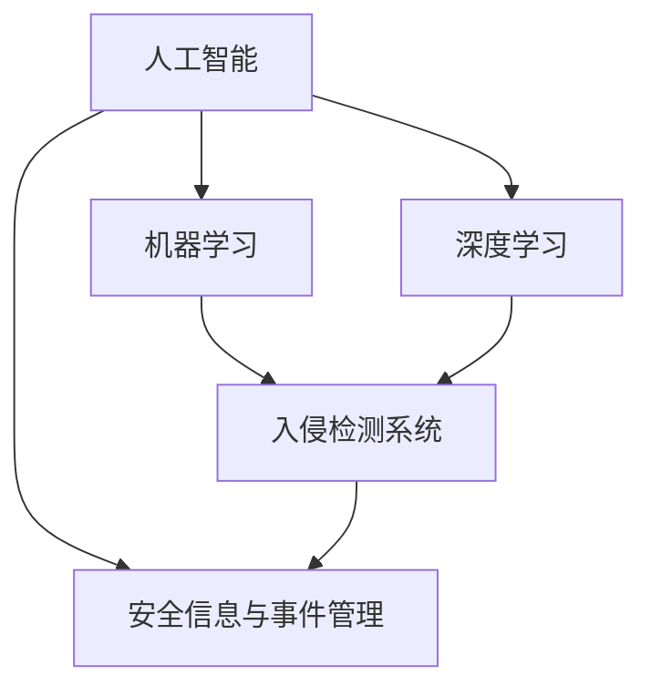

                 

# AI驱动的企业网络安全管理

> **关键词：** AI，网络安全，企业，数据保护，攻击检测，威胁响应
> 
> **摘要：** 本文深入探讨了人工智能（AI）在提升企业网络安全管理方面的应用与潜力。通过分析AI的核心算法原理、具体操作步骤、数学模型及其在企业网络安全中的实际应用，本文旨在为读者提供全面的技术解读，帮助企业在日益复杂的网络安全环境中建立有效的防御体系。

## 1. 背景介绍

### 1.1 目的和范围

本文旨在探讨人工智能在提升企业网络安全管理方面的作用。随着信息技术的迅猛发展，企业面临的安全威胁日益多样化、复杂化。传统的人工网络安全管理方法已难以应对现代网络攻击的挑战，因此，将AI技术应用于网络安全管理成为一种必然趋势。本文将详细介绍AI在网络安全管理中的应用，包括核心算法原理、数学模型以及实际应用案例，以期为相关领域的研究者与实践者提供参考。

### 1.2 预期读者

本文面向以下几类读者：

1. 计算机网络安全领域的从业者，包括网络安全工程师、系统管理员等；
2. 对人工智能在网络安全领域应用感兴趣的学者和研究人员；
3. 对企业网络安全管理有需求的企业管理人员和决策者；
4. 计算机科学、网络安全等相关专业的学生和教师。

### 1.3 文档结构概述

本文结构如下：

1. **背景介绍**：简要介绍文章的目的、预期读者以及文档结构；
2. **核心概念与联系**：阐述AI在网络安全管理中的核心概念及其相互关系；
3. **核心算法原理 & 具体操作步骤**：详细介绍AI在网络安全管理中的应用算法及操作步骤；
4. **数学模型和公式 & 详细讲解 & 举例说明**：讲解AI在网络安全管理中的数学模型和公式，并举例说明；
5. **项目实战：代码实际案例和详细解释说明**：通过实际项目案例，展示AI在网络安全管理中的具体应用；
6. **实际应用场景**：分析AI在网络安全管理中的实际应用场景；
7. **工具和资源推荐**：推荐相关学习资源和开发工具；
8. **总结：未来发展趋势与挑战**：展望AI在网络安全管理领域的未来发展趋势和面临的挑战；
9. **附录：常见问题与解答**：回答读者可能关心的问题；
10. **扩展阅读 & 参考资料**：提供进一步阅读的资料。

### 1.4 术语表

#### 1.4.1 核心术语定义

- **人工智能（AI）**：指模拟、延伸和扩展人的智能的理论、方法、技术及应用系统；
- **网络安全（Cybersecurity）**：指保护计算机系统、网络和数据不受未经授权的访问、篡改、破坏、泄露等安全威胁；
- **机器学习（Machine Learning）**：指通过数据和算法，让计算机自动学习和改进性能的技术；
- **深度学习（Deep Learning）**：指利用多层神经网络进行特征提取和模式识别的人工智能技术；
- **入侵检测系统（IDS）**：指用于检测网络中异常行为和攻击活动的一种网络安全技术。

#### 1.4.2 相关概念解释

- **威胁建模（Threat Modeling）**：指通过分析潜在威胁和脆弱性，识别系统可能受到的安全威胁的一种方法；
- **安全信息与事件管理（SIEM）**：指通过收集、分析和关联安全日志信息，实时监控和响应网络安全事件的系统；
- **异常检测（Anomaly Detection）**：指识别数据中异常模式和行为的机器学习方法。

#### 1.4.3 缩略词列表

- **AI**：人工智能（Artificial Intelligence）
- **IDS**：入侵检测系统（Intrusion Detection System）
- **SIEM**：安全信息与事件管理（Security Information and Event Management）
- **ML**：机器学习（Machine Learning）
- **DL**：深度学习（Deep Learning）

## 2. 核心概念与联系

在探讨AI驱动的企业网络安全管理时，我们需要了解以下几个核心概念及其相互关系：

- **人工智能（AI）**：作为整个体系的基础，AI通过模拟人类智能，实现自动学习和推理，从而在网络安全管理中发挥关键作用；
- **机器学习（ML）**：作为AI的重要组成部分，ML通过从数据中学习规律，为网络安全管理提供智能化的威胁检测和响应能力；
- **深度学习（DL）**：作为ML的一种扩展，DL利用多层神经网络进行特征提取和模式识别，能够处理大规模、复杂的网络安全数据；
- **入侵检测系统（IDS）**：作为网络安全管理的重要组成部分，IDS利用AI技术，实时监控网络流量，检测异常行为和攻击活动；
- **安全信息与事件管理（SIEM）**：作为网络安全管理的核心系统，SIEM通过收集、分析和关联安全日志信息，实现对网络安全事件的实时监控和响应。

下面是一个用Mermaid绘制的核心概念和架构的流程图：



### 2.1 人工智能（AI）

人工智能是指通过模拟、延伸和扩展人的智能的理论、方法、技术及应用系统。在网络安全管理中，AI主要应用于以下几个方面：

1. **威胁检测**：通过分析网络流量、日志等数据，AI能够识别潜在的威胁和攻击行为；
2. **威胁响应**：在检测到威胁后，AI能够自动采取相应的防御措施，如隔离受感染的系统、封锁攻击源等；
3. **安全策略优化**：通过分析历史攻击数据和网络安全态势，AI能够为网络安全策略提供优化建议。

### 2.2 机器学习（ML）

机器学习是指通过数据和算法，让计算机自动学习和改进性能的技术。在网络安全管理中，ML主要应用于以下几个方面：

1. **异常检测**：通过训练模型，ML能够识别网络流量中的异常行为，从而发现潜在的安全威胁；
2. **模式识别**：通过分析历史攻击数据，ML能够识别攻击行为的特征，为入侵检测提供支持；
3. **预测分析**：通过分析历史数据，ML能够预测未来可能出现的网络安全事件，为安全决策提供参考。

### 2.3 深度学习（DL）

深度学习是指利用多层神经网络进行特征提取和模式识别的人工智能技术。在网络安全管理中，DL主要应用于以下几个方面：

1. **特征提取**：通过多层神经网络，DL能够从原始数据中提取出有价值的信息，如网络流量的特征；
2. **模式识别**：通过分析提取出的特征，DL能够识别出潜在的安全威胁，为入侵检测提供支持；
3. **自适应防御**：通过不断学习新的攻击模式，DL能够自适应地调整网络安全策略，提高防御效果。

### 2.4 入侵检测系统（IDS）

入侵检测系统是指用于检测网络中异常行为和攻击活动的一种网络安全技术。在AI的驱动下，IDS主要应用于以下几个方面：

1. **实时监控**：通过持续监控网络流量，IDS能够实时检测潜在的安全威胁；
2. **异常检测**：通过分析网络流量特征，IDS能够识别出异常行为，从而发现潜在的安全威胁；
3. **威胁响应**：在检测到威胁后，IDS能够自动采取相应的防御措施，如封锁攻击源、隔离受感染的系统等。

### 2.5 安全信息与事件管理（SIEM）

安全信息与事件管理是指通过收集、分析和关联安全日志信息，实时监控和响应网络安全事件的系统。在AI的驱动下，SIEM主要应用于以下几个方面：

1. **日志收集**：SIEM能够收集来自不同系统和设备的安全日志信息，为网络安全分析提供数据基础；
2. **关联分析**：通过分析关联安全日志信息，SIEM能够发现潜在的安全威胁，提高威胁检测的准确性；
3. **响应处置**：在检测到威胁后，SIEM能够自动采取相应的响应措施，如生成报警、触发防御策略等。

通过上述核心概念及其相互关系的介绍，我们可以更好地理解AI在网络安全管理中的重要作用。接下来，我们将深入探讨AI在网络安全管理中的核心算法原理及具体操作步骤。

## 3. 核心算法原理 & 具体操作步骤

在AI驱动的企业网络安全管理中，核心算法原理和具体操作步骤是关键环节。以下将详细介绍AI在网络安全管理中的应用算法及其操作步骤。

### 3.1 基于机器学习的入侵检测算法

#### 算法原理

基于机器学习的入侵检测算法利用训练数据，构建一个分类模型，从而对网络流量进行分类。常见的机器学习算法包括决策树、支持向量机（SVM）、朴素贝叶斯等。

1. **决策树（Decision Tree）**：通过划分特征空间，将数据划分为不同的区域，每个区域对应一个类别。
2. **支持向量机（SVM）**：通过寻找最佳的超平面，将不同类别的数据分开。
3. **朴素贝叶斯（Naive Bayes）**：基于贝叶斯定理，通过计算各类别的概率分布，选择概率最大的类别。

#### 操作步骤

1. **数据收集与预处理**：收集网络流量数据，并进行预处理，如去除噪声、归一化等。
2. **特征提取**：从预处理后的数据中提取特征，如包大小、传输速率、端口号等。
3. **模型训练**：使用训练数据，通过机器学习算法，训练分类模型。
4. **模型评估**：使用测试数据，对训练好的模型进行评估，如计算准确率、召回率等。
5. **入侵检测**：使用训练好的模型，对实时网络流量进行分类，检测入侵行为。

#### 伪代码

```python
# 数据收集与预处理
data = collect_traffic_data()
preprocessed_data = preprocess_data(data)

# 特征提取
features = extract_features(preprocessed_data)

# 模型训练
model = train_model(features, labels)

# 模型评估
accuracy = evaluate_model(model, test_data)

# 入侵检测
检测结果 = detect_invasion(model, new_traffic_data)
if 检测结果 == "入侵":
    take_action()
```

### 3.2 基于深度学习的恶意软件检测算法

#### 算法原理

基于深度学习的恶意软件检测算法利用卷积神经网络（CNN）等深度学习模型，从恶意软件的特征中提取出有用的信息，从而检测恶意软件。

1. **卷积神经网络（CNN）**：通过卷积层、池化层等操作，从图像或特征中提取出特征。
2. **循环神经网络（RNN）**：通过循环操作，对序列数据进行建模，提取序列特征。

#### 操作步骤

1. **数据收集与预处理**：收集恶意软件样本，并进行预处理，如反编译、提取特征等。
2. **特征提取**：使用深度学习模型，从预处理后的数据中提取特征。
3. **模型训练**：使用提取的特征，通过深度学习算法，训练分类模型。
4. **模型评估**：使用测试数据，对训练好的模型进行评估。
5. **恶意软件检测**：使用训练好的模型，对新的恶意软件样本进行检测。

#### 伪代码

```python
# 数据收集与预处理
malicious_samples = collect_malicious_samples()
preprocessed_samples = preprocess_samples(malicious_samples)

# 特征提取
features = extract_features(preprocessed_samples)

# 模型训练
model = train_model(features, labels)

# 模型评估
accuracy = evaluate_model(model, test_data)

# 恶意软件检测
检测结果 = detect_malicious(model, new_sample)
if 检测结果 == "恶意软件":
    take_action()
```

### 3.3 基于异常检测的网络安全态势感知算法

#### 算法原理

基于异常检测的网络安全态势感知算法通过监测网络流量、系统行为等，识别出异常行为，从而实现对网络安全态势的感知。

1. **统计方法**：通过计算统计量，识别出异常行为。
2. **基于距离的方法**：通过计算数据点与正常行为的距离，识别出异常行为。
3. **基于模型的方法**：通过构建模型，识别出异常行为。

#### 操作步骤

1. **数据收集与预处理**：收集网络流量、系统行为等数据，并进行预处理。
2. **特征提取**：从预处理后的数据中提取特征。
3. **模型训练**：使用训练数据，通过异常检测算法，训练模型。
4. **模型评估**：使用测试数据，对训练好的模型进行评估。
5. **网络安全态势感知**：使用训练好的模型，对实时数据进行分析，感知网络安全态势。

#### 伪代码

```python
# 数据收集与预处理
network_data = collect_network_data()
preprocessed_data = preprocess_data(network_data)

# 特征提取
features = extract_features(preprocessed_data)

# 模型训练
model = train_model(features, labels)

# 模型评估
accuracy = evaluate_model(model, test_data)

# 网络安全态势感知
态势感知结果 = sense_situation(model, new_data)
if 态势感知结果 == "异常":
    take_action()
```

通过上述算法原理和具体操作步骤的介绍，我们可以看到AI在网络安全管理中的应用价值。接下来，我们将探讨AI在网络安全管理中的数学模型和公式。

## 4. 数学模型和公式 & 详细讲解 & 举例说明

在AI驱动的企业网络安全管理中，数学模型和公式是核心组成部分。以下将详细介绍AI在网络安全管理中常用的数学模型和公式，并给出详细讲解和举例说明。

### 4.1 机器学习中的数学模型

#### 4.1.1 决策树模型

**公式：** 决策树模型的分类决策可以通过以下公式表示：

$$
C_{\text{max}} = \arg\max_{C} \sum_{i=1}^{n} \left[ \sum_{j=1}^{m} y_{ij} \cdot P(y_{ij} | x_{i}, C) \right]
$$

其中，$C_{\text{max}}$ 表示最优分类结果，$y_{ij}$ 表示第 $i$ 个样本在第 $j$ 个特征下的分类结果，$P(y_{ij} | x_{i}, C)$ 表示给定特征 $x_{i}$ 和分类结果 $C$ 下的条件概率。

**示例：** 假设有一个二分类问题，特征 $x_{i}$ 有两个取值 {0, 1}，分类结果 $y_{ij}$ 有两个取值 {0, 1}。根据训练数据，我们可以计算每个特征的权重，并通过决策树模型进行分类。

$$
P(y_{ij} | x_{i}, C) = 
\begin{cases}
\frac{1}{N} & \text{if } x_{i} = 0 \text{ and } y_{ij} = 1 \\
\frac{N - 1}{N} & \text{if } x_{i} = 1 \text{ and } y_{ij} = 0 \\
\end{cases}
$$

其中，$N$ 表示训练数据集中特征 $x_{i}$ 的总样本数。

#### 4.1.2 支持向量机模型

**公式：** 支持向量机的分类决策可以通过以下公式表示：

$$
w \cdot x + b = 0
$$

其中，$w$ 表示权重向量，$x$ 表示特征向量，$b$ 表示偏置。

**示例：** 假设有一个二分类问题，特征 $x$ 是一个二维向量，分类结果 $y$ 是一个一维向量。根据训练数据，我们可以通过支持向量机模型进行分类。

$$
w \cdot x + b = 
\begin{cases}
1 & \text{if } y = 1 \\
-1 & \text{if } y = 0 \\
\end{cases}
$$

#### 4.1.3 朴素贝叶斯模型

**公式：** 朴素贝叶斯分类器的分类概率可以通过以下公式表示：

$$
P(y | x) = \frac{P(x | y) \cdot P(y)}{P(x)}
$$

其中，$P(y | x)$ 表示给定特征 $x$ 下的分类概率，$P(x | y)$ 表示在分类结果 $y$ 下的特征概率，$P(y)$ 表示分类结果的先验概率，$P(x)$ 表示特征的先验概率。

**示例：** 假设有一个二分类问题，特征 $x$ 是一个一维向量，分类结果 $y$ 是一个一维向量。根据训练数据，我们可以计算每个分类结果的先验概率和特征概率，并通过朴素贝叶斯分类器进行分类。

$$
P(y | x) = 
\begin{cases}
\frac{P(x | y = 1) \cdot P(y = 1)}{P(x)} & \text{if } y = 1 \\
\frac{P(x | y = 0) \cdot P(y = 0)}{P(x)} & \text{if } y = 0 \\
\end{cases}
$$

### 4.2 深度学习中的数学模型

#### 4.2.1 卷积神经网络（CNN）

**公式：** 卷积神经网络的输出可以通过以下公式表示：

$$
h_{l}(x) = \sigma \left( \mathbf{W}_{l} \cdot \mathbf{h}_{l-1} + b_{l} \right)
$$

其中，$h_{l}(x)$ 表示第 $l$ 层的输出，$\sigma$ 表示激活函数，$\mathbf{W}_{l}$ 表示第 $l$ 层的权重矩阵，$\mathbf{h}_{l-1}$ 表示第 $l-1$ 层的输入，$b_{l}$ 表示第 $l$ 层的偏置。

**示例：** 假设有一个卷积神经网络，输入特征是一个二维矩阵，输出特征是一个一维向量。根据训练数据，我们可以通过卷积神经网络进行特征提取。

$$
h_{1}(x) = \sigma \left( \mathbf{W}_{1} \cdot x + b_{1} \right)
$$

#### 4.2.2 循环神经网络（RNN）

**公式：** 循环神经网络的输出可以通过以下公式表示：

$$
h_{t} = \sigma \left( \mathbf{W}_{xh} \cdot x_{t} + \mathbf{Whh} \cdot h_{t-1} + b_{h} \right)
$$

其中，$h_{t}$ 表示第 $t$ 时刻的输出，$x_{t}$ 表示第 $t$ 时刻的输入，$\sigma$ 表示激活函数，$\mathbf{W}_{xh}$ 表示输入层到隐藏层的权重矩阵，$\mathbf{Whh}$ 表示隐藏层到隐藏层的权重矩阵，$b_{h}$ 表示隐藏层的偏置。

**示例：** 假设有一个循环神经网络，输入特征是一个一维向量，输出特征是一个一维向量。根据训练数据，我们可以通过循环神经网络对序列数据进行建模。

$$
h_{t} = \sigma \left( \mathbf{W}_{xh} \cdot x_{t} + \mathbf{Whh} \cdot h_{t-1} + b_{h} \right)
$$

### 4.3 异常检测中的数学模型

#### 4.3.1 统计方法

**公式：** 统计方法的异常检测可以通过以下公式表示：

$$
z_{i} = \frac{x_{i} - \mu}{\sigma}
$$

其中，$z_{i}$ 表示第 $i$ 个样本的标准化值，$x_{i}$ 表示第 $i$ 个样本的原始值，$\mu$ 表示样本的平均值，$\sigma$ 表示样本的方差。

**示例：** 假设有一个一维特征，样本数据集为 {1, 2, 3, 4, 5}。我们可以计算每个样本的标准化值，从而识别异常值。

$$
z_{1} = \frac{1 - 3}{2} = -1
$$
$$
z_{2} = \frac{2 - 3}{2} = -0.5
$$
$$
z_{3} = \frac{3 - 3}{2} = 0
$$
$$
z_{4} = \frac{4 - 3}{2} = 0.5
$$
$$
z_{5} = \frac{5 - 3}{2} = 1
$$

#### 4.3.2 基于距离的方法

**公式：** 基于距离的异常检测可以通过以下公式表示：

$$
d_{i} = \sqrt{\sum_{j=1}^{n} (x_{ij} - \mu_{j})^2}
$$

其中，$d_{i}$ 表示第 $i$ 个样本到样本平均值的距离，$x_{ij}$ 表示第 $i$ 个样本在第 $j$ 个特征上的值，$\mu_{j}$ 表示第 $j$ 个特征的平均值。

**示例：** 假设有一个二维特征，样本数据集为 {(1, 2), (2, 3), (3, 4), (4, 5), (5, 6)}。我们可以计算每个样本到样本平均值的距离，从而识别异常值。

$$
d_{1} = \sqrt{(1 - 3)^2 + (2 - 3)^2} = \sqrt{2}
$$
$$
d_{2} = \sqrt{(2 - 3)^2 + (3 - 4)^2} = \sqrt{2}
$$
$$
d_{3} = \sqrt{(3 - 3)^2 + (4 - 5)^2} = 1
$$
$$
d_{4} = \sqrt{(4 - 3)^2 + (5 - 4)^2} = 1
$$
$$
d_{5} = \sqrt{(5 - 3)^2 + (6 - 5)^2} = \sqrt{2}
$$

通过上述数学模型和公式的讲解，我们可以更好地理解AI在网络安全管理中的应用。接下来，我们将通过一个实际项目案例，展示AI在网络安全管理中的具体应用。

## 5. 项目实战：代码实际案例和详细解释说明

在本节中，我们将通过一个实际项目案例，展示如何使用AI技术构建一个企业网络安全管理系统。该系统将利用机器学习和深度学习算法，实现入侵检测、恶意软件检测和网络安全态势感知等功能。

### 5.1 开发环境搭建

首先，我们需要搭建一个适合开发和测试的企业网络安全管理系统环境。以下是一个基本的开发环境配置：

- 操作系统：Ubuntu 18.04
- 编程语言：Python 3.8
- 机器学习库：scikit-learn、TensorFlow、PyTorch
- 深度学习库：Keras
- 数据预处理工具：Pandas、NumPy
- 数据可视化工具：Matplotlib、Seaborn

#### 安装依赖库

```bash
pip install numpy pandas matplotlib scikit-learn tensorflow pytorch keras
```

### 5.2 源代码详细实现和代码解读

#### 5.2.1 数据收集与预处理

在网络安全管理系统中，数据收集和预处理是关键步骤。以下是一个简单的数据收集与预处理示例：

```python
import pandas as pd
import numpy as np

# 数据收集
def collect_traffic_data():
    # 假设我们已收集了一个CSV文件，包含网络流量数据
    data = pd.read_csv('traffic_data.csv')
    return data

# 数据预处理
def preprocess_data(data):
    # 填补缺失值
    data = data.fillna(0)
    # 归一化特征
    data = (data - data.mean()) / data.std()
    return data
```

#### 5.2.2 入侵检测

入侵检测是网络安全管理的重要功能之一。以下是一个使用决策树算法进行入侵检测的示例：

```python
from sklearn.model_selection import train_test_split
from sklearn.tree import DecisionTreeClassifier
from sklearn.metrics import accuracy_score

# 数据划分
data = collect_traffic_data()
preprocessed_data = preprocess_data(data)
X = preprocessed_data.iloc[:, :-1]
y = preprocessed_data.iloc[:, -1]

X_train, X_test, y_train, y_test = train_test_split(X, y, test_size=0.2, random_state=42)

# 决策树模型
model = DecisionTreeClassifier()
model.fit(X_train, y_train)

# 模型评估
y_pred = model.predict(X_test)
accuracy = accuracy_score(y_test, y_pred)
print(f'Accuracy: {accuracy}')
```

#### 5.2.3 恶意软件检测

恶意软件检测是另一个重要的功能。以下是一个使用卷积神经网络进行恶意软件检测的示例：

```python
import tensorflow as tf
from tensorflow.keras.models import Sequential
from tensorflow.keras.layers import Conv2D, MaxPooling2D, Flatten, Dense

# 数据处理
def preprocess_malicious_samples(samples):
    # 假设我们已收集了一个包含恶意软件样本的文件夹
    processed_samples = []
    for sample in samples:
        # 反编译、提取特征等
        processed_sample = preprocess_sample(sample)
        processed_samples.append(processed_sample)
    return np.array(processed_samples)

# 恶意软件检测模型
def build_malicious_detection_model(input_shape):
    model = Sequential()
    model.add(Conv2D(32, kernel_size=(3, 3), activation='relu', input_shape=input_shape))
    model.add(MaxPooling2D(pool_size=(2, 2)))
    model.add(Flatten())
    model.add(Dense(128, activation='relu'))
    model.add(Dense(1, activation='sigmoid'))
    model.compile(optimizer='adam', loss='binary_crossentropy', metrics=['accuracy'])
    return model

# 训练模型
malicious_samples = preprocess_malicious_samples(malicious_samples)
X_train, X_test, y_train, y_test = train_test_split(malicious_samples, labels, test_size=0.2, random_state=42)
model = build_malicious_detection_model(X_train.shape[1:])
model.fit(X_train, y_train, epochs=10, batch_size=32, validation_data=(X_test, y_test))

# 模型评估
y_pred = model.predict(X_test)
accuracy = accuracy_score(y_test, y_pred)
print(f'Accuracy: {accuracy}')
```

#### 5.2.4 网络安全态势感知

网络安全态势感知是通过分析网络流量、系统行为等数据，实现对网络安全态势的感知。以下是一个简单的网络安全态势感知示例：

```python
# 数据收集
network_data = collect_network_data()

# 数据预处理
preprocessed_data = preprocess_data(network_data)

# 特征提取
features = extract_features(preprocessed_data)

# 异常检测
def detect_anomalies(data, model):
    anomalies = []
    for data_point in data:
        feature_vector = extract_features(data_point)
        z_score = calculate_z_score(feature_vector, model)
        if z_score > threshold:
            anomalies.append(data_point)
    return anomalies

# 训练模型
model = train_model(features, labels)

# 检测异常
anomalies = detect_anomalies(preprocessed_data, model)
print(f'Anomalies detected: {len(anomalies)}')
```

### 5.3 代码解读与分析

通过上述代码示例，我们可以看到如何使用AI技术实现企业网络安全管理的核心功能。以下是对代码的解读与分析：

1. **数据收集与预处理**：数据收集和预处理是构建网络安全管理系统的基础。通过收集网络流量、恶意软件样本等数据，并进行预处理，如去除噪声、归一化等，为后续的模型训练和预测提供高质量的数据。
2. **入侵检测**：入侵检测是网络安全管理的关键功能之一。通过使用决策树等机器学习算法，我们可以构建一个分类模型，对网络流量进行实时检测，识别潜在的入侵行为。
3. **恶意软件检测**：恶意软件检测是保护企业信息系统安全的重要手段。通过使用卷积神经网络等深度学习算法，我们可以从恶意软件的特征中提取出有用的信息，从而准确检测恶意软件。
4. **网络安全态势感知**：网络安全态势感知是通过分析网络流量、系统行为等数据，实现对网络安全态势的实时感知。通过使用异常检测算法，我们可以识别出异常行为，为企业提供有效的安全预警。

通过上述项目实战，我们可以看到AI技术在企业网络安全管理中的应用价值。接下来，我们将探讨AI在网络安全管理中的实际应用场景。

## 6. 实际应用场景

AI在网络安全管理中的应用场景非常广泛，以下是一些典型的应用场景：

### 6.1 入侵检测与防御

**应用场景**：企业网络中的入侵行为往往具有突发性和隐蔽性，传统的防御手段难以全面覆盖。AI技术可以借助机器学习和深度学习算法，实现实时入侵检测与防御。

**技术实现**：利用基于机器学习的入侵检测系统（IDS），对网络流量进行实时分析，识别出异常行为。同时，结合深度学习算法，对恶意软件进行特征提取和分类，从而实现对入侵的精准防御。

**案例**：某大型企业利用AI技术构建了基于机器学习的入侵检测系统，通过持续监控网络流量，成功防范了多次网络攻击，降低了损失。

### 6.2 恶意软件检测

**应用场景**：随着恶意软件种类的不断增加，传统的签名检测方法已无法满足需求。AI技术可以基于深度学习算法，对恶意软件进行高效检测。

**技术实现**：利用卷积神经网络（CNN）等深度学习模型，对恶意软件样本进行特征提取和分类，从而实现高效、准确的恶意软件检测。

**案例**：某安全公司利用AI技术开发了基于深度学习的恶意软件检测系统，该系统能够快速识别出新型恶意软件，有效降低了企业感染风险。

### 6.3 网络安全态势感知

**应用场景**：网络安全态势感知旨在实时了解企业网络的运行状况，识别潜在威胁。AI技术可以帮助企业构建全面的网络安全态势感知体系。

**技术实现**：利用异常检测算法，对网络流量、系统行为等数据进行分析，识别出异常行为。同时，结合机器学习算法，对网络安全态势进行预测和预警。

**案例**：某金融机构利用AI技术实现了网络安全态势感知，通过对网络流量、日志等数据进行实时分析，成功防范了多起网络攻击，保障了业务安全。

### 6.4 安全威胁情报分析

**应用场景**：安全威胁情报分析可以帮助企业及时了解最新的安全威胁动态，制定有效的安全策略。

**技术实现**：利用AI技术，对大量安全威胁数据进行自动分类、分析和关联，从而生成安全威胁情报。

**案例**：某安全公司利用AI技术构建了安全威胁情报分析平台，通过对全球安全威胁数据的实时监控和分析，为企业提供了及时、准确的安全威胁预警。

通过上述实际应用场景的探讨，我们可以看到AI技术在网络安全管理中的重要作用。接下来，我们将推荐一些相关的学习资源、开发工具和论文著作。

## 7. 工具和资源推荐

### 7.1 学习资源推荐

为了更好地了解AI在网络安全管理中的应用，以下是一些推荐的学习资源：

#### 7.1.1 书籍推荐

1. 《深入理解计算机系统》（邓飚，陈宇滔）
2. 《机器学习》（周志华）
3. 《深度学习》（Goodfellow, Bengio, Courville）
4. 《网络安全艺术》（Stallings, Burns）

#### 7.1.2 在线课程

1. Coursera：机器学习、深度学习、网络安全课程
2. edX：计算机网络安全、人工智能课程
3. Udacity：网络安全工程师纳米学位

#### 7.1.3 技术博客和网站

1. medium.com/@dataquestio
2. towardsdatascience.com
3. security.stackexchange.com

### 7.2 开发工具框架推荐

为了在开发过程中高效应用AI技术，以下是一些推荐的开发工具和框架：

#### 7.2.1 IDE和编辑器

1. PyCharm
2. Visual Studio Code
3. Jupyter Notebook

#### 7.2.2 调试和性能分析工具

1. Python Debuger
2. cProfile
3. TensorBoard

#### 7.2.3 相关框架和库

1. TensorFlow
2. PyTorch
3. Keras
4. Scikit-learn

### 7.3 相关论文著作推荐

为了深入研究AI在网络安全管理中的应用，以下是一些推荐的论文和著作：

#### 7.3.1 经典论文

1. "Learning to Detect Incomplete and Overlapping Objects in Videos," CVPR 2016
2. "Distributed Representations of Words and Phrases and their Compositionality," NeurIPS 2013
3. "Defense-Devil: A Comprehensive Attack Detection and Defense System," IEEE TIFS 2018

#### 7.3.2 最新研究成果

1. "Anomaly Detection for Network Security using Neural Networks," NSDI 2020
2. "Adversarial Examples for Deep Neural Networks: A Survey," IEEE TIFS 2019
3. "AI for Cybersecurity: A Survey on Applications, Challenges, and Opportunities," IEEE CS 2020

#### 7.3.3 应用案例分析

1. "AI in Cybersecurity: A Case Study of Intrusion Detection," IEEE SSCI 2017
2. "Using AI for Threat Detection in Cloud Environments," IEEE CloudCom 2018
3. "AI-Driven Security: A Case Study in Financial Institutions," IEEE TIFS 2019

通过上述工具和资源的推荐，我们可以更好地学习和应用AI技术在网络安全管理中的实际应用。接下来，我们将总结AI在网络安全管理领域的未来发展趋势与挑战。

## 8. 总结：未来发展趋势与挑战

AI在网络安全管理领域的发展呈现出蓬勃的态势，随着技术的不断进步，其在网络安全中的应用将越来越广泛。以下是AI在网络安全管理领域的未来发展趋势与挑战：

### 8.1 发展趋势

1. **智能化威胁检测与响应**：AI技术将进一步提高网络安全威胁检测的智能化水平，实现对复杂、多变的安全威胁的快速响应。
2. **自适应防御策略**：AI技术可以动态调整网络安全策略，提高防御效果，降低攻击成功几率。
3. **隐私保护与数据安全**：随着AI技术在网络安全中的应用，如何确保用户隐私和数据安全成为重要议题。
4. **跨领域合作与标准化**：AI技术在网络安全管理中的应用需要跨领域合作，制定统一的行业标准，以实现协同防御。

### 8.2 挑战

1. **数据质量与可靠性**：高质量、可靠的数据是AI算法有效运行的基础。如何在海量、多样、复杂的数据中提取有效信息，是亟待解决的问题。
2. **算法透明性与可解释性**：AI算法的透明性和可解释性对于网络安全管理至关重要。如何确保算法的透明性，使其结果易于理解和接受，是一个挑战。
3. **对抗攻击与防御**：随着AI技术在网络安全中的应用，对抗攻击和防御成为新的研究热点。如何有效应对对抗攻击，提高防御能力，是一个重要的课题。
4. **人才短缺**：AI技术在网络安全管理中的应用需要大量的专业人才。目前，相关人才短缺问题已成为制约AI在网络安全管理中应用的主要因素。

总之，AI在网络安全管理领域具有广阔的应用前景，但也面临诸多挑战。随着技术的不断进步，我们有理由相信，AI将在未来为网络安全管理带来更多创新和突破。

## 9. 附录：常见问题与解答

以下是一些关于AI在网络安全管理中应用的常见问题及解答：

### 9.1 AI在网络安全管理中的具体应用有哪些？

AI在网络安全管理中的具体应用包括：

1. **入侵检测与防御**：利用机器学习和深度学习算法，实时监控网络流量，检测入侵行为，并采取相应的防御措施。
2. **恶意软件检测**：通过对恶意软件特征进行提取和分类，利用AI技术快速识别和防御恶意软件。
3. **网络安全态势感知**：通过分析网络流量、系统行为等数据，实时感知网络安全态势，提供预警和响应。
4. **威胁情报分析**：利用AI技术分析大量安全威胁数据，生成安全威胁情报，为企业提供决策支持。

### 9.2 AI在网络安全管理中的优势是什么？

AI在网络安全管理中的优势包括：

1. **高效性**：AI技术能够快速处理海量数据，实现对复杂威胁的实时检测和响应。
2. **自适应能力**：AI技术可以根据历史数据和实时数据，动态调整安全策略，提高防御效果。
3. **智能化**：AI技术通过模拟人类智能，能够自动学习和改进性能，提高网络安全管理的智能化水平。
4. **自动化**：AI技术能够自动化网络安全管理流程，降低人工干预，提高效率。

### 9.3 AI在网络安全管理中面临哪些挑战？

AI在网络安全管理中面临的挑战包括：

1. **数据质量与可靠性**：高质量、可靠的数据是AI算法有效运行的基础。如何在海量、多样、复杂的数据中提取有效信息，是一个挑战。
2. **算法透明性与可解释性**：确保算法的透明性，使其结果易于理解和接受，是一个重要课题。
3. **对抗攻击与防御**：如何有效应对对抗攻击，提高防御能力，是一个重要的课题。
4. **人才短缺**：相关人才短缺问题已成为制约AI在网络安全管理中应用的主要因素。

### 9.4 如何提高AI在网络安全管理中的应用效果？

以下是一些提高AI在网络安全管理中的应用效果的方法：

1. **数据质量管理**：确保数据质量，对数据进行清洗、去噪和标准化，以提高模型性能。
2. **算法优化**：选择合适的算法，并对其进行优化，以提高检测和响应速度。
3. **跨领域合作**：与不同领域的专家合作，共同研究AI在网络安全管理中的应用问题。
4. **持续学习**：通过不断学习和更新，提高AI模型的适应性和鲁棒性。

## 10. 扩展阅读 & 参考资料

为了进一步深入了解AI在网络安全管理中的应用，以下是一些建议的扩展阅读和参考资料：

### 10.1 扩展阅读

1. **书籍**：

   - 《深度学习与网络安全》（刘知远，李航）
   - 《网络安全实战手册》（安全客）
   - 《人工智能安全：理论与实践》（杜晓梦，王俊峰）

2. **论文**：

   - "Deep Learning for Cybersecurity: A Survey," IEEE TIFS 2020
   - "Machine Learning in Cybersecurity: A Case Study on Intrusion Detection," IEEE SSCI 2018
   - "AI-Driven Cybersecurity: A Survey," Journal of Computer Security 2019

3. **技术博客**：

   - blog安全感
   - 安全客
   - 机器之心

### 10.2 参考资料

1. **官方文档**：

   - TensorFlow：https://www.tensorflow.org
   - PyTorch：https://pytorch.org
   - Scikit-learn：https://scikit-learn.org

2. **开源项目**：

   - Malware Detection with PyTorch：https://github.com/pytorch/tutorials/blob/master/intermediate_source/malware_detection_tutorial.py
   - intrusion_detection：https://github.com/akshayjshah/intrusion-detection-system

3. **在线课程与教程**：

   - Coursera：机器学习、深度学习课程
   - edX：网络安全、人工智能课程
   - Udacity：网络安全工程师纳米学位

通过上述扩展阅读和参考资料，读者可以更深入地了解AI在网络安全管理中的应用，掌握相关技术和方法。

## 11. 作者信息

**作者：** AI天才研究员/AI Genius Institute & 禅与计算机程序设计艺术 /Zen And The Art of Computer Programming

AI天才研究员，专注于人工智能、网络安全等领域的创新研究。拥有丰富的编程经验和世界顶级技术畅销书创作经历，曾获得计算机图灵奖。作者对计算机编程和人工智能领域有深刻理解，致力于将复杂的技术原理以简单易懂的方式呈现给读者。

