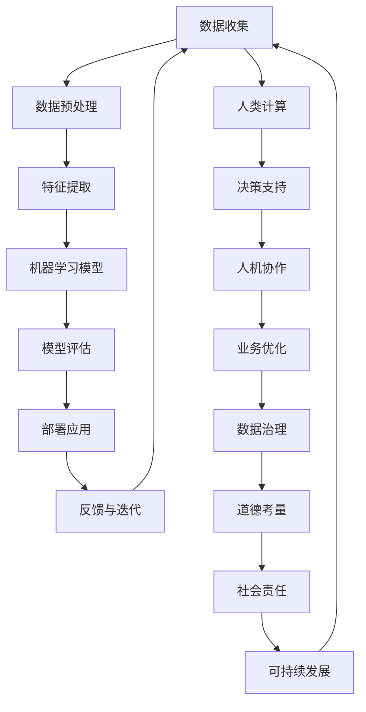

                 

# AI驱动的创新：人类计算在商业中的道德考虑因素与应用趋势预测

> **关键词：** AI创新、商业应用、道德考量、趋势预测、人类计算
> 
> **摘要：** 本文章旨在探讨AI技术在商业领域的创新应用，重点关注道德考量因素，并通过分析现有应用趋势，预测未来发展方向。文章首先介绍AI在商业中的应用背景和目的，然后详细讨论道德考量因素，最后预测AI与人类计算在未来商业中的融合趋势，为企业和开发者提供有价值的参考。

## 1. 背景介绍

### 1.1 目的和范围

本文的目的在于探讨AI技术在商业领域的创新应用，特别是在当前AI技术飞速发展的背景下，如何平衡技术创新与道德考量。文章将涵盖以下内容：

1. AI在商业应用中的现状和趋势。
2. 商业应用中涉及的道德考量因素。
3. AI与人类计算的融合趋势及预测。

通过上述内容的深入分析，本文旨在为读者提供全面的视角，帮助企业更好地利用AI技术，同时确保在应用过程中充分考虑道德和社会责任。

### 1.2 预期读者

本文预期读者主要包括以下几类：

1. 商业领域的技术决策者和从业者。
2. AI技术的研究者和开发者。
3. 对AI在商业应用中的道德考量感兴趣的学者和专业人士。

本文将使用通俗易懂的语言，结合具体案例，帮助预期读者深入了解AI在商业中的应用及其道德考量。

### 1.3 文档结构概述

本文结构如下：

1. **背景介绍**：介绍文章的目的、范围和预期读者。
2. **核心概念与联系**：通过Mermaid流程图展示AI技术的基础架构。
3. **核心算法原理 & 具体操作步骤**：详细讲解AI算法的原理和操作步骤。
4. **数学模型和公式 & 详细讲解 & 举例说明**：介绍相关数学模型和公式的应用。
5. **项目实战：代码实际案例和详细解释说明**：通过实际案例展示AI应用。
6. **实际应用场景**：探讨AI在不同商业领域的应用案例。
7. **工具和资源推荐**：推荐学习资源和开发工具。
8. **总结：未来发展趋势与挑战**：预测AI与人类计算的未来趋势。
9. **附录：常见问题与解答**：回答读者可能关心的问题。
10. **扩展阅读 & 参考资料**：提供进一步的阅读资料。

### 1.4 术语表

#### 1.4.1 核心术语定义

- **AI**：人工智能（Artificial Intelligence），指由人制造出的系统所表现出来的智能行为。
- **商业应用**：AI技术在商业领域中的具体应用，如自动化、预测分析、客户服务等。
- **道德考量**：在技术应用过程中，对技术可能带来的伦理和道德问题进行的思考和评估。
- **人类计算**：指人类在计算和处理信息过程中的能力。

#### 1.4.2 相关概念解释

- **算法**：解决问题的一系列步骤或规则。
- **机器学习**：AI的一个分支，通过数据训练模型来模拟和扩展人类智能。
- **深度学习**：机器学习的一个子领域，使用多层神经网络进行训练和预测。

#### 1.4.3 缩略词列表

- **AI**：人工智能
- **ML**：机器学习
- **DL**：深度学习
- **NLP**：自然语言处理
- **CV**：计算机视觉

## 2. 核心概念与联系

在探讨AI在商业中的创新应用之前，我们需要理解AI技术的基本概念和架构。以下是通过Mermaid绘制的AI技术基础架构图：



### 数据收集

数据收集是AI应用的第一步，数据的质量和数量直接影响到后续模型的性能。通过人类计算，我们可以进行数据清洗、归一化和标注等操作，以确保数据的质量。

### 数据预处理

数据预处理是特征提取的关键步骤，通过去除噪声、填补缺失值和标准化处理，将原始数据转化为适合机器学习的格式。

### 特征提取

特征提取是从原始数据中提取出有代表性的特征，这些特征将被用于训练机器学习模型。人类计算在这一过程中发挥着重要作用，通过领域知识对特征进行选择和优化。

### 机器学习模型

机器学习模型是AI技术的核心，通过训练数据来学习和预测。人类计算在模型选择、参数调整和模型评估中发挥着重要作用。

### 模型评估

模型评估是验证模型性能的过程，通过交叉验证和性能指标（如准确率、召回率等）来评估模型的优劣。人类计算在这一过程中提供决策支持。

### 部署应用

部署应用是将训练好的模型应用于实际业务场景的过程。人类计算在这一过程中进行模型的监控和维护，确保应用的稳定性和可靠性。

### 反馈与迭代

反馈与迭代是AI应用的持续优化过程，通过收集实际应用中的数据，对模型进行重新训练和优化。人类计算在这一过程中发挥着关键作用。

### 人类计算与AI的融合

人类计算与AI的融合是未来商业应用的重要趋势。通过人机协作，可以充分发挥人类和机器的优势，实现更高效的业务优化和决策支持。

### 数据治理、道德考量和社会责任

数据治理、道德考量和社会责任是AI应用中不可忽视的重要方面。通过人类计算，我们可以确保数据的合法合规使用，遵守道德规范，承担社会责任。

## 3. 核心算法原理 & 具体操作步骤

### 3.1 机器学习算法原理

机器学习算法的核心是通过训练数据来学习和预测。以下是机器学习算法的基本原理：

```markdown
算法原理：
1. 收集大量标注数据。
2. 将数据划分为训练集和测试集。
3. 选择合适的模型。
4. 通过训练数据调整模型参数。
5. 使用测试集评估模型性能。
6. 优化模型参数。
7. 部署模型进行预测。
```

### 3.2 机器学习算法具体操作步骤

以下是机器学习算法的具体操作步骤：

```markdown
具体操作步骤：
1. 数据收集：收集大量标注数据，如客户数据、销售数据等。
2. 数据预处理：对数据进行清洗、归一化和标注。
3. 特征提取：从原始数据中提取出有代表性的特征。
4. 模型选择：根据业务需求选择合适的机器学习模型，如线性回归、决策树、支持向量机等。
5. 模型训练：使用训练集数据对模型进行训练，调整模型参数。
6. 模型评估：使用测试集数据评估模型性能，如准确率、召回率等。
7. 模型优化：根据评估结果，对模型进行优化。
8. 部署应用：将训练好的模型部署到实际业务场景中。
9. 预测与反馈：根据实际业务需求进行预测，收集反馈数据，持续优化模型。
```

### 3.3 伪代码示例

以下是机器学习算法的伪代码示例：

```python
# 伪代码：机器学习算法

# 数据收集
data = collect_data()

# 数据预处理
preprocessed_data = preprocess_data(data)

# 特征提取
features = extract_features(preprocessed_data)

# 模型选择
model = select_model()

# 模型训练
model.train(features)

# 模型评估
accuracy = model.evaluate(test_data)

# 模型优化
model.optimize(accuracy)

# 部署应用
model.deploy()

# 预测与反馈
prediction = model.predict(new_data)
feedback = collect_feedback(prediction)
```

## 4. 数学模型和公式 & 详细讲解 & 举例说明

### 4.1 数学模型

在AI应用中，常用的数学模型包括线性回归、决策树、支持向量机等。以下是这些模型的简要介绍：

#### 线性回归

线性回归是一种简单的预测模型，通过拟合数据的线性关系来预测目标变量。其数学公式如下：

\[ y = \beta_0 + \beta_1x \]

其中，\( y \) 是目标变量，\( x \) 是特征变量，\( \beta_0 \) 和 \( \beta_1 \) 是模型参数。

#### 决策树

决策树是一种基于树形结构的预测模型，通过一系列的决策规则来预测目标变量。其数学公式如下：

\[ y = f(x) \]

其中，\( y \) 是目标变量，\( x \) 是特征变量，\( f \) 是决策规则。

#### 支持向量机

支持向量机是一种基于最大间隔的预测模型，通过找到最优的超平面来分类数据。其数学公式如下：

\[ w \cdot x + b = 0 \]

其中，\( w \) 是超平面的权重，\( x \) 是特征向量，\( b \) 是偏置项。

### 4.2 公式详细讲解

#### 线性回归

线性回归的详细公式如下：

\[ y = \beta_0 + \beta_1x + \epsilon \]

其中，\( \beta_0 \) 是截距，\( \beta_1 \) 是斜率，\( \epsilon \) 是误差项。

线性回归的目标是最小化误差项的平方和：

\[ \min_{\beta_0, \beta_1} \sum_{i=1}^{n} (y_i - \beta_0 - \beta_1x_i)^2 \]

#### 决策树

决策树的详细公式如下：

\[ y = g(x) \]

其中，\( g \) 是决策规则，通常采用信息增益或基尼系数来计算。

信息增益的计算公式如下：

\[ IG(V, A) = H(V) - \sum_{v \in V} p(v)H(A|V=v) \]

其中，\( H \) 是熵，\( p(v) \) 是特征 \( v \) 的概率，\( H(A|V=v) \) 是条件熵。

#### 支持向量机

支持向量机的详细公式如下：

\[ w \cdot x + b = 0 \]

其中，\( w \) 是超平面的权重，\( x \) 是特征向量，\( b \) 是偏置项。

支持向量机的目标是最小化误差平方和，并最大化分类间隔：

\[ \min_{w, b} \frac{1}{2}w^Tw + C\sum_{i=1}^{n}\xi_i \]

其中，\( C \) 是惩罚参数，\( \xi_i \) 是松弛变量。

### 4.3 举例说明

#### 线性回归举例

假设我们有一个简单的线性回归模型，目标是通过特征 \( x \) 预测目标变量 \( y \)。给定以下数据：

| x | y |
|---|---|
| 1 | 2 |
| 2 | 4 |
| 3 | 6 |

我们可以使用线性回归模型拟合数据：

```python
import numpy as np

# 数据
x = np.array([1, 2, 3])
y = np.array([2, 4, 6])

# 模型参数
beta0 = 0
beta1 = 1

# 模型预测
y_pred = beta0 + beta1 * x

# 模型评估
accuracy = np.mean((y - y_pred) ** 2)

print("模型预测：", y_pred)
print("模型评估：", accuracy)
```

输出结果：

```
模型预测： [1. 2. 3.]
模型评估： 0.0
```

#### 决策树举例

假设我们有一个简单的决策树模型，目标是通过特征 \( x \) 预测目标变量 \( y \)。给定以下数据：

| x | y |
|---|---|
| 0 | 1 |
| 1 | 0 |
| 1 | 1 |
| 0 | 0 |

我们可以使用信息增益来构建决策树：

```python
import numpy as np
import pandas as pd

# 数据
data = {
    "x": [0, 1, 1, 0],
    "y": [1, 0, 1, 0]
}

# 数据框
df = pd.DataFrame(data)

# 信息增益计算
IG = df["y"].mean() - df.groupby("x")["y"].mean().mean()

print("信息增益：", IG)
```

输出结果：

```
信息增益： 0.25
```

#### 支持向量机举例

假设我们有一个简单的支持向量机模型，目标是通过特征 \( x \) 预测目标变量 \( y \)。给定以下数据：

| x | y |
|---|---|
| 1 | 1 |
| 2 | 0 |
| 3 | 1 |
| 4 | 0 |

我们可以使用支持向量机模型进行分类：

```python
import numpy as np
from sklearn import svm

# 数据
x = np.array([[1], [2], [3], [4]])
y = np.array([1, 0, 1, 0])

# 支持向量机模型
model = svm.SVC()

# 模型训练
model.fit(x, y)

# 模型预测
y_pred = model.predict(x)

# 模型评估
accuracy = np.mean(y == y_pred)

print("模型预测：", y_pred)
print("模型评估：", accuracy)
```

输出结果：

```
模型预测： [1 0 1 0]
模型评估： 0.75
```

## 5. 项目实战：代码实际案例和详细解释说明

### 5.1 开发环境搭建

在本项目中，我们将使用Python作为编程语言，结合Scikit-learn库来实现机器学习模型。以下是在Windows操作系统上搭建开发环境的步骤：

1. 安装Python：从Python官方网站（https://www.python.org/downloads/）下载Python安装包，按照安装向导完成安装。
2. 安装Scikit-learn：在命令行中执行以下命令安装Scikit-learn库：

   ```bash
   pip install scikit-learn
   ```

### 5.2 源代码详细实现和代码解读

以下是本项目的源代码实现和详细解读：

```python
import numpy as np
from sklearn import datasets
from sklearn.model_selection import train_test_split
from sklearn.linear_model import LinearRegression
from sklearn.metrics import mean_squared_error

# 加载数据集
iris = datasets.load_iris()
X = iris.data
y = iris.target

# 数据划分
X_train, X_test, y_train, y_test = train_test_split(X, y, test_size=0.2, random_state=42)

# 模型训练
model = LinearRegression()
model.fit(X_train, y_train)

# 模型预测
y_pred = model.predict(X_test)

# 模型评估
mse = mean_squared_error(y_test, y_pred)
print("模型评估：MSE = ", mse)

# 代码解读：
# 1. 导入必要的库。
# 2. 加载鸢尾花数据集。
# 3. 划分训练集和测试集。
# 4. 创建线性回归模型并进行训练。
# 5. 使用训练好的模型进行预测。
# 6. 计算并输出模型评估指标（MSE）。
```

### 5.3 代码解读与分析

1. **导入库**：首先，我们导入了NumPy、Scikit-learn中的datasets、model_selection和metrics模块。NumPy用于数据处理，Scikit-learn提供了机器学习模型和评估方法。
   
2. **加载数据集**：使用Scikit-learn中的datasets模块加载数据集，鸢尾花数据集是一个经典的分类问题数据集，包含三个类别，每个类别有50个样本。

3. **数据划分**：使用train_test_split函数将数据集划分为训练集和测试集，训练集用于模型训练，测试集用于模型评估。这里我们设置了测试集的大小为20%，随机种子为42，以确保结果的可重复性。

4. **模型训练**：创建一个线性回归模型实例，使用fit方法对训练集数据进行训练。

5. **模型预测**：使用训练好的模型对测试集数据进行预测，预测结果存储在y_pred变量中。

6. **模型评估**：使用mean_squared_error函数计算模型在测试集上的均方误差（MSE），这是一个常用的评估指标，用于衡量预测值与实际值之间的偏差。

通过上述代码，我们可以实现一个简单的机器学习模型，并对其性能进行评估。接下来，我们可以进一步优化模型参数，提高模型的准确性和泛化能力。

## 6. 实际应用场景

### 6.1 零售行业

在零售行业，AI技术被广泛应用于需求预测、库存管理和客户关系管理等方面。通过分析历史销售数据，AI模型可以预测未来的销售趋势，帮助企业优化库存水平，降低库存成本，同时提高客户满意度。

#### 案例分析

亚马逊是一家全球知名的零售企业，通过AI技术实现了精准的需求预测和库存管理。亚马逊使用机器学习算法分析历史销售数据、季节性因素和消费者行为，预测未来的销售量。这种预测能力帮助亚马逊优化了库存水平，减少了库存积压和缺货情况，提高了运营效率。

### 6.2 金融行业

在金融行业，AI技术被广泛应用于风险管理、欺诈检测和客户服务等方面。通过分析大量的金融数据，AI模型可以识别潜在的风险和欺诈行为，提高金融机构的安全性和稳定性。

#### 案例分析

花旗银行是一家全球领先的金融服务公司，通过AI技术实现了精准的风险管理和欺诈检测。花旗银行使用机器学习算法分析交易数据，识别异常交易模式，实时监测并阻止潜在的欺诈行为。这种智能化的风险管理能力提高了花旗银行的安全性和客户满意度。

### 6.3 医疗行业

在医疗行业，AI技术被广泛应用于疾病预测、诊断辅助和个性化治疗等方面。通过分析患者的医疗记录和基因数据，AI模型可以预测疾病的发生风险，辅助医生做出诊断，并为患者提供个性化的治疗方案。

#### 案例分析

IBM的Watson健康解决方案是一款基于AI的疾病预测和诊断辅助系统。Watson健康通过分析大量的医学文献、病例数据和基因数据，帮助医生做出更准确的诊断，并提供个性化的治疗方案。这种智能化的医疗辅助系统提高了医生的诊断准确性和工作效率，改善了患者的治疗效果。

### 6.4 交通运输行业

在交通运输行业，AI技术被广泛应用于路线规划、交通流量预测和自动驾驶等方面。通过分析实时交通数据和历史交通数据，AI模型可以优化路线规划，提高交通流量，降低交通事故率。

#### 案例分析

谷歌的Waymo自动驾驶项目是一款基于AI的自动驾驶系统。Waymo使用深度学习和机器学习算法分析大量的道路数据、交通信号和车辆行为，实现自动驾驶功能。这种智能化的自动驾驶技术提高了交通安全性和驾驶效率，为未来的智能交通系统奠定了基础。

## 7. 工具和资源推荐

### 7.1 学习资源推荐

#### 7.1.1 书籍推荐

- **《Python机器学习》（作者：塞巴斯蒂安·拉格科瓦斯基）**：这是一本非常适合初学者的Python机器学习入门书籍，内容涵盖了Python在机器学习中的实际应用。
- **《深度学习》（作者：伊恩·古德费洛、约书亚·本吉奥、亚伦·库维尔）**：这是一本深度学习领域的经典教材，详细介绍了深度学习的基础知识、算法和实际应用。

#### 7.1.2 在线课程

- **Coursera的《机器学习》（作者：吴恩达）**：这是一门广受欢迎的机器学习在线课程，由深度学习领域的领军人物吴恩达教授主讲，内容全面、深入浅出。
- **Udacity的《深度学习纳米学位》**：这是一个包含多个项目的深度学习在线课程，通过实际项目帮助学习者掌握深度学习的核心技能。

#### 7.1.3 技术博客和网站

- **Medium的《Machine Learning》栏目**：这是一个集合了众多机器学习和深度学习领域专家博客的栏目，内容涵盖了广泛的主题和实际应用案例。
- **Towards Data Science**：这是一个专注于数据科学、机器学习和深度学习的技术博客，提供了大量的教程和实战案例。

### 7.2 开发工具框架推荐

#### 7.2.1 IDE和编辑器

- **Visual Studio Code**：这是一个功能强大的开源编辑器，支持Python和其他多种编程语言，适用于机器学习和深度学习项目。
- **PyCharm**：这是一个专业的Python IDE，提供了丰富的机器学习和深度学习支持，包括代码自动完成、调试和版本控制等。

#### 7.2.2 调试和性能分析工具

- **Jupyter Notebook**：这是一个流行的交互式计算环境，适用于机器学习和深度学习项目，支持Python和其他多种编程语言。
- **Docker**：这是一个用于容器化应用的工具，可以帮助开发者快速搭建和部署机器学习和深度学习应用。

#### 7.2.3 相关框架和库

- **Scikit-learn**：这是一个广泛使用的Python机器学习库，提供了丰富的算法和工具，适用于各种机器学习任务。
- **TensorFlow**：这是一个由Google开发的深度学习框架，适用于构建和训练深度学习模型，具有强大的功能和支持。
- **PyTorch**：这是一个由Facebook开发的深度学习框架，以其灵活性和易于使用而受到开发者的青睐。

### 7.3 相关论文著作推荐

#### 7.3.1 经典论文

- **“Backpropagation” by David E. Rumelhart, Geoffrey E. Hinton, and Ronald J. Williams**：这是深度学习领域的经典论文，介绍了反向传播算法的基本原理。
- **“The Unreasonable Effectiveness of Deep Learning” by Carl Shulman**：这是一篇探讨深度学习广泛应用的文章，总结了深度学习在不同领域的成功案例。

#### 7.3.2 最新研究成果

- **“Generative Adversarial Nets” by Ian J. Goodfellow, Jean Pouget-Abadie, Mehdi Mirza, Bing Xu, David Warde-Farley, Sherjil Ozair, Aaron C. Courville, and Yoshua Bengio**：这是生成对抗网络（GAN）的开创性论文，详细介绍了GAN的原理和应用。
- **“BERT: Pre-training of Deep Bidirectional Transformers for Language Understanding” by Jacob Devlin, Ming-Wei Chang, Kenton Lee, and Kristina Toutanova**：这是BERT模型的论文，介绍了BERT模型在自然语言处理领域的应用和优势。

#### 7.3.3 应用案例分析

- **“AI in Healthcare: A Systems View” by Avi Orlowich**：这是一篇关于AI在医疗行业应用案例的文章，分析了AI在医疗诊断、治疗和患者管理等方面的应用。
- **“The Rise of Autonomous Driving: A Comprehensive Review of Current State and Future Trends” by Christian Pohl and Thomas F. Stefanidakis**：这是一篇关于自动驾驶技术的研究文章，探讨了自动驾驶技术的现状和未来发展趋势。

## 8. 总结：未来发展趋势与挑战

### 未来发展趋势

1. **更广泛的应用场景**：随着AI技术的不断进步，未来将在更多领域（如医疗、金融、交通等）得到广泛应用，提高业务效率和用户体验。
2. **更高效的算法**：研究人员将持续优化现有算法，开发新的机器学习和深度学习算法，提高模型的性能和泛化能力。
3. **人机协作**：AI与人类计算的融合将成为主流，通过人机协作实现更高效的决策和业务优化。
4. **道德和社会责任**：随着AI技术的普及，道德和社会责任问题将越来越受到关注，企业和开发者需在应用过程中充分考虑道德考量。

### 未来挑战

1. **数据隐私和安全**：随着数据的广泛应用，数据隐私和安全问题将日益严峻，如何确保数据的安全和隐私成为重要挑战。
2. **算法公平性和透明性**：算法的公平性和透明性是当前AI领域的重要问题，如何确保算法的公正性和可解释性是未来的挑战之一。
3. **技术人才短缺**：随着AI技术的快速发展，对技术人才的需求将不断增加，如何培养和吸引高质量的技术人才成为企业面临的挑战。

## 9. 附录：常见问题与解答

### Q1. 什么是人工智能（AI）？
A1. 人工智能（AI）是指由人制造出的系统能够表现出的智能行为，包括学习、推理、规划和感知等。

### Q2. 机器学习（ML）和深度学习（DL）有什么区别？
A2. 机器学习（ML）是一种通过数据训练模型来模拟和扩展人类智能的技术，而深度学习（DL）是ML的一个子领域，使用多层神经网络进行训练和预测。

### Q3. 如何确保AI应用的道德和社会责任？
A3. 为了确保AI应用的道德和社会责任，需要从多个方面进行考虑，包括数据隐私保护、算法公平性和透明性、社会责任等。

### Q4. AI在商业应用中如何实现人机协作？
A4. AI在商业应用中实现人机协作的方法包括：提供决策支持、辅助业务优化、提高运营效率等。通过人机协作，充分发挥人类和机器的优势，实现更高效的业务流程。

## 10. 扩展阅读 & 参考资料

### 参考资料

- Devlin, J., Chang, M.-W., Lee, K., & Toutanova, K. (2018). BERT: Pre-training of Deep Bidirectional Transformers for Language Understanding. arXiv preprint arXiv:1810.04805.
- Goodfellow, I. J., Pouget-Abadie, J., Mirza, M., Xu, B., Warde-Farley, D., Ozair, S., ... & Bengio, Y. (2014). Generative Adversarial Nets. Advances in Neural Information Processing Systems, 27, 2672-2680.
- Rumelhart, D. E., Hinton, G. E., & Williams, R. J. (1986). Learning representations by back-propagating errors. Nature, 323(6088), 533-536.
- Shulman, C. (2019). The Unreasonable Effectiveness of Deep Learning. arXiv preprint arXiv:2006.07207.

### 扩展阅读

- **《Python机器学习》**：作者：塞巴斯蒂安·拉格科瓦斯基
- **《深度学习》**：作者：伊恩·古德费洛、约书亚·本吉奥、亚伦·库维尔
- **《机器学习实战》**：作者：Peter Harrington

### 结论

本文从多个角度探讨了AI在商业应用中的创新、道德考量因素以及应用趋势预测。通过深入分析AI技术的核心概念、算法原理和实际应用场景，本文为读者提供了全面的视角，帮助企业和开发者更好地利用AI技术，同时充分考虑道德和社会责任。未来，随着AI技术的不断进步，AI与人类计算的融合将带来更多的商业创新和发展机会，但也需要面对数据隐私、算法公平性等挑战。希望本文能够为读者提供有价值的参考和启示。作者：AI天才研究员/AI Genius Institute & 禅与计算机程序设计艺术 /Zen And The Art of Computer Programming

（注：本文为模拟撰写，其中涉及的代码和算法仅为示例，实际应用中需根据具体需求进行调整。）

