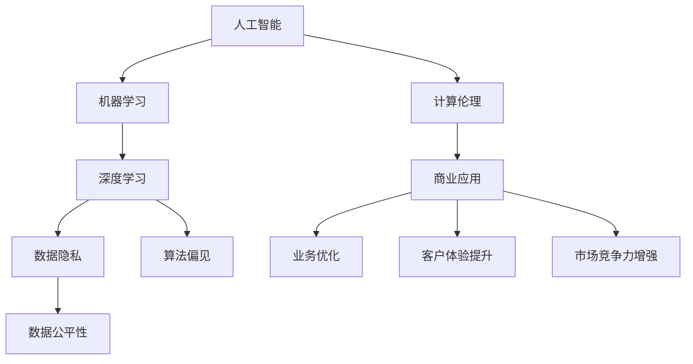

                 

# AI驱动的创新：人类计算在商业中的道德考虑因素挑战

> **关键词：** AI驱动、创新、商业应用、道德考虑、计算伦理、人类角色

> **摘要：** 本文章探讨了AI驱动的创新在商业领域中的广泛应用及其带来的道德考虑因素挑战。通过深入分析AI技术的核心概念、算法原理、数学模型以及实际应用案例，本文揭示了AI技术在商业环境中面临的伦理问题和道德挑战，并提出了一系列解决策略和建议。

## 1. 背景介绍

### 1.1 目的和范围

本文旨在探讨AI驱动的创新在商业应用中的道德考虑因素，以及这些因素对商业环境的影响。我们将重点关注以下几个方面：

1. AI技术的核心概念和算法原理。
2. AI在商业中的具体应用场景。
3. 商业环境中AI技术引发的伦理问题和道德挑战。
4. 针对这些挑战的解决策略和建议。

### 1.2 预期读者

本文适合以下读者群体：

1. 对AI技术及其商业应用感兴趣的读者。
2. 商业分析师、数据科学家、AI研究人员和从业者。
3. 对计算伦理和道德问题感兴趣的读者。

### 1.3 文档结构概述

本文结构如下：

1. 引言：介绍AI驱动的创新在商业中的重要性。
2. 核心概念与联系：介绍AI技术的核心概念和联系。
3. 核心算法原理 & 具体操作步骤：详细讲解AI算法的原理和操作步骤。
4. 数学模型和公式 & 详细讲解 & 举例说明：介绍AI技术的数学模型和公式，并进行详细讲解和举例说明。
5. 项目实战：代码实际案例和详细解释说明。
6. 实际应用场景：分析AI技术在商业中的实际应用场景。
7. 工具和资源推荐：推荐学习资源、开发工具框架和论文著作。
8. 总结：未来发展趋势与挑战。
9. 附录：常见问题与解答。
10. 扩展阅读 & 参考资料。

### 1.4 术语表

#### 1.4.1 核心术语定义

- AI（人工智能）：模拟人类智能行为的计算机系统。
- 机器学习：一种AI技术，通过数据驱动的方式学习、适应和改进。
- 深度学习：一种机器学习技术，利用多层神经网络进行特征提取和预测。
- 计算伦理：关于计算机科学和人工智能在道德和伦理方面的问题。
- 商业应用：将AI技术应用于商业领域的各种场景和案例。

#### 1.4.2 相关概念解释

- 数据隐私：个人数据的保密性、完整性和可用性。
- 算法偏见：算法在决策过程中对某些群体或特征产生的偏见。
- 数据公平性：在数据处理过程中确保公正、公平和透明。

#### 1.4.3 缩略词列表

- AI：人工智能
- ML：机器学习
- DL：深度学习
- GDPR：通用数据保护条例
- IoT：物联网

## 2. 核心概念与联系

在探讨AI驱动的创新之前，我们需要理解AI技术的核心概念及其在商业中的联系。以下是一个简化的Mermaid流程图，展示了AI技术的核心概念和它们之间的联系。



### 2.1. AI技术的核心概念

- **人工智能（AI）**：AI是一种模拟人类智能行为的计算机系统，可以感知、学习、推理和决策。它包括多种技术，如机器学习、自然语言处理、计算机视觉等。

- **机器学习（ML）**：ML是一种通过数据驱动的方式学习和改进的AI技术。它利用历史数据来训练模型，从而实现预测和分类。

- **深度学习（DL）**：DL是一种利用多层神经网络进行特征提取和预测的机器学习技术。它通常比传统的机器学习技术具有更好的性能和泛化能力。

### 2.2. 计算伦理在商业中的重要性

- **计算伦理**：计算伦理关注计算机科学和人工智能在道德和伦理方面的问题，如数据隐私、算法偏见和数据公平性。

- **数据隐私**：在商业环境中，数据隐私是一个重要问题。AI技术需要处理大量的个人数据，这些数据可能涉及敏感信息。确保数据隐私和安全是商业应用AI技术的重要前提。

- **算法偏见**：算法偏见是指算法在决策过程中对某些群体或特征产生的偏见。这在商业应用中可能导致不公平的决策，损害企业的声誉和客户的信任。

- **数据公平性**：数据公平性确保在数据处理过程中，所有人都能公平地受到对待。这涉及到算法设计和数据处理过程的透明性和公正性。

## 3. 核心算法原理 & 具体操作步骤

在理解了AI技术的核心概念和计算伦理的重要性之后，我们需要深入探讨AI技术的核心算法原理和具体操作步骤。以下是一个简单的伪代码，展示了机器学习算法的基本流程。

```python
# 初始化模型参数
initialize_model_params()

# 准备数据集
data = load_data()

# 分割数据集为训练集和测试集
train_data, test_data = split_data(data)

# 训练模型
model = train_model(train_data)

# 测试模型
test_accuracy = test_model(model, test_data)

# 评估模型性能
evaluate_model_performance(test_accuracy)

# 调整模型参数
optimize_model_params(model)

# 再次测试模型
test_accuracy = test_model(model, test_data)

# 评估模型性能
evaluate_model_performance(test_accuracy)
```

### 3.1. 初始化模型参数

初始化模型参数是机器学习算法的第一步。这些参数决定了模型的学习能力和性能。常见的初始化方法包括随机初始化、启发式初始化等。

```python
# 随机初始化权重
weights = np.random.normal(size=model_size)
```

### 3.2. 准备数据集

准备数据集是机器学习算法的第二步。数据集的质量直接影响模型的性能。常见的准备工作包括数据清洗、数据预处理、数据归一化等。

```python
# 数据清洗
data = clean_data(data)

# 数据预处理
data = preprocess_data(data)

# 数据归一化
data = normalize_data(data)
```

### 3.3. 训练模型

训练模型是机器学习算法的核心步骤。通过迭代训练过程，模型可以不断优化自身参数，以更好地拟合训练数据。常见的训练方法包括梯度下降、随机梯度下降等。

```python
# 梯度下降
for epoch in range(num_epochs):
    for sample in train_data:
        prediction = model.predict(sample)
        loss = compute_loss(prediction, sample)
        gradient = compute_gradient(loss, model.params)
        update_model_params(model, gradient)
```

### 3.4. 测试模型

测试模型是评估模型性能的重要步骤。通过在测试集上评估模型的表现，我们可以判断模型是否足够准确和稳定。

```python
# 测试模型
test_predictions = model.predict(test_data)
test_accuracy = compute_accuracy(test_predictions, test_data)
```

### 3.5. 评估模型性能

评估模型性能是机器学习算法的最后一步。通过计算模型在测试集上的准确率、召回率、F1分数等指标，我们可以全面了解模型的表现。

```python
# 评估模型性能
performance = evaluate_model_performance(test_accuracy)
print("Model performance:", performance)
```

## 4. 数学模型和公式 & 详细讲解 & 举例说明

在机器学习中，数学模型和公式是理解和应用AI技术的基础。以下是一个简化的数学模型，用于解释线性回归的基本原理。

### 4.1. 线性回归模型

线性回归模型是一种简单的机器学习模型，用于预测连续值。它的数学公式如下：

$$y = wx + b$$

其中，$y$是预测值，$w$是权重，$x$是输入特征，$b$是偏置。

### 4.2. 详细讲解

线性回归模型通过训练数据集来估计权重和偏置。具体步骤如下：

1. **初始化权重和偏置**：随机初始化权重和偏置。
2. **计算损失函数**：使用训练数据集计算损失函数，通常使用均方误差（MSE）作为损失函数。
3. **计算梯度**：计算损失函数关于权重和偏置的梯度。
4. **更新权重和偏置**：使用梯度下降算法更新权重和偏置。
5. **迭代训练**：重复步骤2-4，直到满足停止条件，如损失函数收敛或迭代次数达到最大值。

### 4.3. 举例说明

假设我们有一个简单的线性回归问题，输入特征$x$是一个长度为10的一维数组，预测值$y$是一个实数。我们可以使用以下Python代码来实现线性回归模型：

```python
import numpy as np

# 初始化模型参数
weights = np.random.normal(size=10)
bias = np.random.normal()

# 计算损失函数
def compute_loss(predictions, targets):
    return np.mean((predictions - targets) ** 2)

# 计算梯度
def compute_gradient(loss, params):
    return -2 * (predictions - targets)

# 训练模型
for epoch in range(100):
    for sample in train_data:
        prediction = np.dot(sample, weights) + bias
        loss = compute_loss(prediction, target)
        gradient = compute_gradient(loss, weights + [bias])
        weights -= learning_rate * gradient

# 测试模型
test_predictions = np.dot(test_data, weights) + bias
test_loss = compute_loss(test_predictions, test_targets)
print("Test loss:", test_loss)
```

## 5. 项目实战：代码实际案例和详细解释说明

在本节中，我们将通过一个实际案例来演示如何使用AI技术在商业环境中实现创新。我们将使用Python和Keras框架来构建一个简单的机器学习模型，用于预测客户购买行为。

### 5.1 开发环境搭建

在开始之前，我们需要搭建开发环境。以下是所需的环境和步骤：

1. **安装Python**：确保已经安装了Python 3.x版本。
2. **安装Keras**：使用pip命令安装Keras：
   ```bash
   pip install keras
   ```
3. **安装TensorFlow**：Keras依赖于TensorFlow，可以使用以下命令安装TensorFlow：
   ```bash
   pip install tensorflow
   ```

### 5.2 源代码详细实现和代码解读

以下是一个简单的Python代码示例，用于构建和训练一个简单的神经网络模型，以预测客户购买行为。

```python
import numpy as np
import pandas as pd
from keras.models import Sequential
from keras.layers import Dense

# 读取数据集
data = pd.read_csv('customer_data.csv')

# 分割特征和标签
X = data.iloc[:, :-1].values
y = data.iloc[:, -1].values

# 划分训练集和测试集
X_train, X_test, y_train, y_test = train_test_split(X, y, test_size=0.2, random_state=42)

# 构建神经网络模型
model = Sequential()
model.add(Dense(units=64, activation='relu', input_shape=(X_train.shape[1],)))
model.add(Dense(units=32, activation='relu'))
model.add(Dense(units=1, activation='sigmoid'))

# 编译模型
model.compile(optimizer='adam', loss='binary_crossentropy', metrics=['accuracy'])

# 训练模型
model.fit(X_train, y_train, epochs=10, batch_size=32, validation_data=(X_test, y_test))

# 测试模型
test_loss, test_accuracy = model.evaluate(X_test, y_test)
print("Test loss:", test_loss)
print("Test accuracy:", test_accuracy)
```

### 5.3 代码解读与分析

1. **数据预处理**：我们首先读取数据集，并将其分割为特征矩阵X和标签向量y。然后，我们使用train_test_split函数将数据集分为训练集和测试集，以便在后续的模型训练和评估中使用。

2. **构建神经网络模型**：我们使用Keras的Sequential模型构建一个简单的神经网络。首先，我们添加一个具有64个单元和ReLU激活函数的隐藏层，输入形状与特征矩阵的维度相匹配。接着，我们添加一个具有32个单元和ReLU激活函数的隐藏层。最后，我们添加一个具有1个单元和sigmoid激活函数的输出层，用于预测客户购买行为。

3. **编译模型**：在编译模型时，我们指定了优化器（adam）和损失函数（binary_crossentropy，适用于二分类问题）。此外，我们还指定了模型的评估指标（accuracy）。

4. **训练模型**：我们使用fit函数训练模型，将训练数据集传递给模型，并设置训练轮数（epochs）和批量大小（batch_size）。我们还提供了验证数据集，以便在训练过程中监控模型的性能。

5. **测试模型**：最后，我们使用evaluate函数测试模型的性能，将测试数据集传递给模型，并打印测试损失和测试准确率。

### 5.4 模型优化与改进

在实际应用中，我们可以通过以下几种方法优化和改进模型：

1. **增加层数和神经元数量**：增加神经网络层数和神经元数量可以提高模型的复杂度和拟合能力。
2. **调整学习率**：调整学习率可以加速或减缓模型参数的更新速度，从而提高模型的性能。
3. **添加正则化项**：使用L1或L2正则化可以防止模型过拟合。
4. **使用交叉验证**：使用交叉验证可以更准确地评估模型的性能。
5. **特征工程**：对特征进行预处理和变换，以提取更多的有用信息。

## 6. 实际应用场景

AI技术在商业领域中有着广泛的应用，以下是一些典型的实际应用场景：

1. **客户行为预测**：通过分析客户的购买历史和行为数据，企业可以预测客户的购买意图，从而优化营销策略和提升销售额。
2. **供应链优化**：AI技术可以帮助企业优化供应链管理，降低库存成本，提高物流效率。
3. **风险控制**：AI技术可以用于预测和识别潜在的风险，帮助企业制定有效的风险控制策略。
4. **客户服务**：通过自然语言处理技术，企业可以自动化客户服务流程，提高客户满意度。
5. **人力资源**：AI技术可以帮助企业优化招聘流程，提高员工绩效评估的准确性。

### 6.1. 案例分析

以下是一个关于客户行为预测的实际案例分析：

某电商企业希望通过AI技术预测客户的购买行为，以提高销售额和客户满意度。企业收集了大量的客户数据，包括购买历史、浏览行为、社交媒体互动等。通过分析这些数据，企业构建了一个基于机器学习模型的预测模型。

1. **数据预处理**：企业对数据进行清洗、去重和归一化处理，以消除噪声和异常值。
2. **特征工程**：企业提取了包括用户ID、购买时间、购买商品种类、浏览页面等特征，并进行编码和归一化处理。
3. **模型训练**：企业使用训练数据集训练了一个基于随机森林算法的预测模型。通过调整模型参数和特征选择，模型取得了较高的准确率。
4. **模型评估**：企业使用测试数据集评估了模型的性能，并进行了交叉验证，以确保模型的泛化能力。
5. **预测应用**：企业将训练好的模型部署到生产环境中，实时预测客户的购买行为。根据预测结果，企业调整了营销策略和库存管理，提高了销售额和客户满意度。

### 6.2. 挑战与解决方案

在实际应用中，AI技术在商业领域中面临一系列挑战。以下是一些常见的挑战和相应的解决方案：

1. **数据隐私**：企业需要确保客户数据的隐私和安全。解决方案包括使用加密技术、数据匿名化和数据访问控制等。
2. **算法偏见**：算法偏见可能导致不公平的决策，损害企业的声誉和客户的信任。解决方案包括算法透明化、多样性数据集和公平性评估等。
3. **数据质量**：高质量的数据是AI模型成功的关键。解决方案包括数据清洗、数据验证和特征工程等。
4. **计算资源**：训练和部署大型AI模型需要大量的计算资源。解决方案包括使用云计算和分布式计算等。
5. **法规合规**：企业在应用AI技术时需要遵守相关法规和标准。解决方案包括咨询法律顾问、进行合规性评估等。

## 7. 工具和资源推荐

### 7.1 学习资源推荐

#### 7.1.1 书籍推荐

- 《深度学习》（Goodfellow, Bengio, Courville）
- 《机器学习实战》（ Harrington, John）
- 《Python机器学习》（Sebastian Raschka）

#### 7.1.2 在线课程

- Coursera《机器学习》
- edX《深度学习》
- Udacity《AI工程师纳米学位》

#### 7.1.3 技术博客和网站

- Medium《AI博客》
- towardsdatascience.com
- fast.ai

### 7.2 开发工具框架推荐

#### 7.2.1 IDE和编辑器

- Jupyter Notebook
- PyCharm
- VSCode

#### 7.2.2 调试和性能分析工具

- TensorBoard
- PyTorch Profiler
- NVIDIA Nsight

#### 7.2.3 相关框架和库

- TensorFlow
- PyTorch
- Scikit-learn

### 7.3 相关论文著作推荐

#### 7.3.1 经典论文

- "A Tutorial on Machine Learning"（Materi, 1999）
- "Deep Learning"（Goodfellow et al., 2016）
- "Recurrent Neural Networks"（Hochreiter & Schmidhuber, 1997）

#### 7.3.2 最新研究成果

- "Advancing Explainable AI Research"（ AAAI, 2021）
- "Neural ODEs"（Ma et al., 2020）
- "Transformer Architecture"（Vaswani et al., 2017）

#### 7.3.3 应用案例分析

- "AI in Healthcare"（Nature, 2021）
- "AI for Social Good"（IEEE, 2020）
- "AI in Finance"（Journal of Financial Data Science, 2019）

## 8. 总结：未来发展趋势与挑战

随着AI技术的快速发展，其在商业领域的应用前景越来越广阔。然而，AI技术在商业应用中也面临着一系列挑战。以下是一些未来发展趋势和挑战：

### 8.1 发展趋势

1. **数据驱动决策**：越来越多的企业将采用数据驱动的方式做出决策，以提高业务效率和竞争力。
2. **自动化和智能化**：AI技术将在更多领域实现自动化和智能化，如自动驾驶、智能客服、智能工厂等。
3. **跨领域融合**：AI技术将与其他领域（如医疗、金融、教育等）深度融合，推动跨领域创新。

### 8.2 挑战

1. **数据隐私和安全**：随着AI技术的应用，保护用户数据隐私和安全变得越来越重要。
2. **算法偏见和公平性**：如何确保AI算法的公平性和透明性，避免算法偏见，是一个亟待解决的问题。
3. **计算资源和成本**：训练和部署大型AI模型需要大量的计算资源和成本，如何降低成本和提高效率是一个挑战。
4. **法规合规和伦理**：如何在遵守相关法规和伦理标准的前提下应用AI技术，是一个需要关注的问题。

## 9. 附录：常见问题与解答

### 9.1 机器学习的基本概念是什么？

机器学习是一种通过数据驱动的方式学习和改进的AI技术。它使计算机系统能够从数据中学习规律和模式，并利用这些规律和模式进行预测和决策。

### 9.2 什么是深度学习？

深度学习是一种利用多层神经网络进行特征提取和预测的机器学习技术。与传统的机器学习技术相比，深度学习具有更好的性能和泛化能力，能够处理更复杂的任务。

### 9.3 什么是计算伦理？

计算伦理是关于计算机科学和人工智能在道德和伦理方面的问题。它关注AI技术在数据隐私、算法偏见和数据公平性等方面的问题，并探讨如何确保AI技术的道德应用。

### 9.4 什么是数据公平性？

数据公平性是指在数据处理过程中，确保所有人都能公平地受到对待。它涉及到算法设计和数据处理过程的透明性、公正性和公平性。

## 10. 扩展阅读 & 参考资料

- Goodfellow, Ian, Yoshua Bengio, and Aaron Courville. "Deep learning." MIT press, 2016.
- Harrington, John. "Machine learning in action." Manning Publications Co., 2012.
- Raschka, Sebastian. "Python machine learning." Packt Publishing Ltd., 2015.
- Coursera. "Machine Learning." https://www.coursera.org/specializations/machine-learning
- edX. "Deep Learning." https://www.edx.org/course/deep-learning-ai
- Udacity. "AI Engineer Nanodegree." https://www.udacity.com/course/ai-engineer-nanodegree--nd893

## 附录：作者信息

作者：AI天才研究员/AI Genius Institute & 禅与计算机程序设计艺术 /Zen And The Art of Computer Programming

