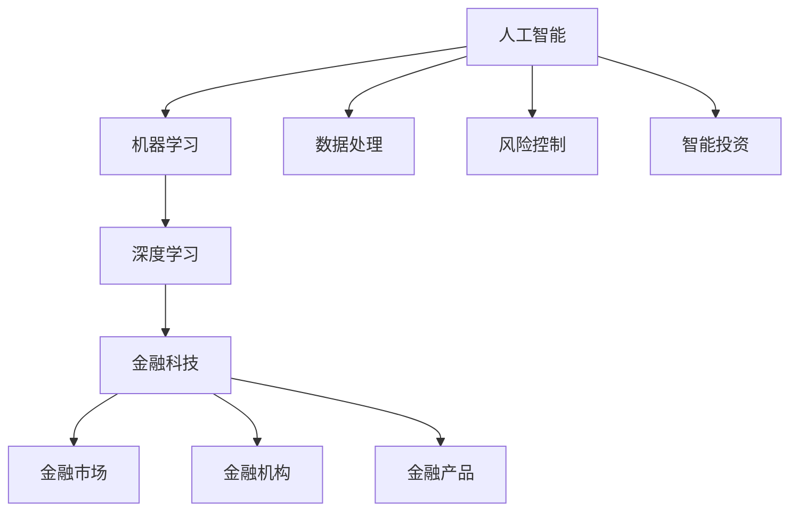

                 

# AI驱动的创新：人类计算在金融中的应用

> **关键词**：人工智能、金融、计算、创新、应用
>
> **摘要**：本文将探讨人工智能在金融领域的创新应用，包括核心概念、算法原理、数学模型、实战案例以及未来发展趋势。通过对人工智能技术的深入剖析，读者将了解如何利用人类计算与AI技术相结合，提升金融行业的效率与智能化水平。

## 1. 背景介绍

### 1.1 目的和范围

本文旨在介绍人工智能在金融领域的应用，分析其核心概念和算法原理，并提供实际项目案例和未来发展趋势。通过本文，读者可以了解如何将人工智能技术应用于金融领域，提高数据处理和决策的效率。

### 1.2 预期读者

本文适合对金融领域有一定了解的读者，特别是对人工智能技术感兴趣的专业人士、研究人员和开发者。同时，对于对金融科技感兴趣的普通读者，本文也能提供一定的启发和认知。

### 1.3 文档结构概述

本文分为以下几个部分：

1. 背景介绍：介绍本文的目的和范围，预期读者以及文档结构概述。
2. 核心概念与联系：介绍人工智能在金融领域中的应用背景和核心概念。
3. 核心算法原理 & 具体操作步骤：详细阐述人工智能在金融领域中的核心算法原理和操作步骤。
4. 数学模型和公式 & 详细讲解 & 举例说明：介绍人工智能在金融领域中的数学模型和公式，并进行详细讲解和举例说明。
5. 项目实战：代码实际案例和详细解释说明。
6. 实际应用场景：分析人工智能在金融领域的实际应用场景。
7. 工具和资源推荐：推荐学习资源和开发工具。
8. 总结：未来发展趋势与挑战。
9. 附录：常见问题与解答。
10. 扩展阅读 & 参考资料：提供更多相关阅读资料。

### 1.4 术语表

#### 1.4.1 核心术语定义

- **人工智能（AI）**：一种模拟人类智能的技术，通过机器学习、深度学习等算法实现。
- **金融**：涉及货币、信贷、投资、保险等领域的经济活动。
- **计算**：指使用计算机或其他设备对信息进行处理、分析和计算的过程。
- **创新**：指在现有基础上，通过技术、方法或理念的创新，实现新的发展。

#### 1.4.2 相关概念解释

- **机器学习（ML）**：一种让计算机从数据中学习规律，并自动进行预测或决策的方法。
- **深度学习（DL）**：一种基于神经网络的学习方法，可以自动从大量数据中学习特征和模式。
- **金融科技（FinTech）**：指利用新技术改善或创造新的金融服务和产品。

#### 1.4.3 缩略词列表

- **AI**：人工智能
- **ML**：机器学习
- **DL**：深度学习
- **FinTech**：金融科技

## 2. 核心概念与联系

人工智能在金融领域的应用背景和核心概念密切相关。以下是一个简单的 Mermaid 流程图，用于展示人工智能在金融领域中的应用核心概念和联系：



### 2.1 人工智能在金融领域的应用背景

随着金融市场的不断发展和创新，金融机构面临着越来越复杂的数据处理和决策需求。人工智能技术，特别是机器学习和深度学习，为金融领域带来了新的机遇和挑战。通过人工智能技术，金融机构可以更好地处理海量数据，识别潜在风险，实现智能投资和个性化金融服务。

### 2.2 核心概念

- **机器学习**：通过训练模型，让计算机从数据中自动学习特征和规律，实现自动预测和决策。
- **深度学习**：一种基于神经网络的学习方法，可以自动从大量数据中学习特征和模式，具有强大的非线性建模能力。
- **金融科技**：利用新技术改善或创造新的金融服务和产品，如移动支付、区块链等。
- **金融市场**：指金融交易和投资活动的场所，包括股票、债券、期货、外汇等市场。
- **金融机构**：提供金融服务的机构，如银行、保险公司、投资公司等。
- **金融产品**：包括股票、债券、基金、保险等金融服务产品。

## 3. 核心算法原理 & 具体操作步骤

### 3.1 机器学习算法原理

机器学习算法的核心思想是让计算机从数据中学习规律，并利用这些规律进行预测或决策。以下是一个简单的机器学习算法原理的伪代码：

```python
def train_model(data, labels):
    # 初始化模型参数
    model_params = initialize_params()

    # 训练模型
    for epoch in range(num_epochs):
        for sample in data:
            # 前向传播
            predictions = forward_pass(sample, model_params)

            # 计算损失函数
            loss = compute_loss(predictions, labels)

            # 反向传播
            gradients = backward_pass(loss, model_params)

            # 更新模型参数
            update_params(model_params, gradients)

    return model_params
```

### 3.2 深度学习算法原理

深度学习算法是基于神经网络的，通过多层神经网络结构对数据进行自动特征提取和模式识别。以下是一个简单的深度学习算法原理的伪代码：

```python
def forward_pass(input_data, model_params):
    # 初始化激活值
    activation = input_data

    # 遍历神经网络层
    for layer in model_params:
        # 前向传播
        activation = activation * layer['weights'] + layer['biases']
        activation = activate(activation)

    return activation
```

### 3.3 具体操作步骤

以下是人工智能在金融领域中的具体操作步骤：

1. **数据收集与预处理**：收集金融市场的数据，如股票价格、交易量、宏观经济指标等。对数据进行清洗、去噪、归一化等预处理操作，以便于后续分析。
2. **特征提取**：通过数据预处理后的数据，提取关键特征，如时间序列特征、技术指标等，为模型训练提供输入。
3. **模型选择与训练**：选择合适的机器学习或深度学习模型，对特征数据集进行训练，以建立预测模型。
4. **模型评估与优化**：通过交叉验证、评估指标等方法对模型进行评估，并根据评估结果对模型进行优化。
5. **模型部署与应用**：将训练好的模型部署到实际生产环境中，实现对金融市场的预测和决策。

## 4. 数学模型和公式 & 详细讲解 & 举例说明

### 4.1 数学模型

在人工智能在金融领域的应用中，常用的数学模型包括线性回归、逻辑回归、支持向量机等。以下是一个简单的线性回归模型的公式和解释：

$$
y = w_0 + w_1x_1 + w_2x_2 + \ldots + w_nx_n + \epsilon
$$

其中，$y$ 是预测值，$x_1, x_2, \ldots, x_n$ 是特征值，$w_0, w_1, w_2, \ldots, w_n$ 是模型参数，$\epsilon$ 是误差项。

### 4.2 公式解释

- $y$：预测值，表示模型的输出。
- $x_1, x_2, \ldots, x_n$：特征值，表示输入数据中的各个特征。
- $w_0, w_1, w_2, \ldots, w_n$：模型参数，表示模型对各个特征的权重。
- $\epsilon$：误差项，表示模型预测值与实际值之间的差异。

### 4.3 举例说明

假设我们要预测股票价格，输入数据包括时间序列、交易量、宏观经济指标等。我们使用线性回归模型，根据以下公式进行预测：

$$
y = w_0 + w_1t + w_2v + w_3m
$$

其中，$t$ 是时间序列特征，$v$ 是交易量特征，$m$ 是宏观经济指标特征。

- $w_0$：模型截距，表示股票价格的基准值。
- $w_1$：时间序列特征的权重，表示时间对股票价格的影响。
- $w_2$：交易量特征的权重，表示交易量对股票价格的影响。
- $w_3$：宏观经济指标特征的权重，表示宏观经济指标对股票价格的影响。

通过训练模型，我们可以得到模型参数的值，并根据这些参数预测股票价格。例如，当输入数据为 $t=100$, $v=200$, $m=150$ 时，预测的股票价格为：

$$
y = w_0 + w_1 \times 100 + w_2 \times 200 + w_3 \times 150
$$

## 5. 项目实战：代码实际案例和详细解释说明

### 5.1 开发环境搭建

在开始项目实战之前，我们需要搭建一个合适的开发环境。以下是一个简单的 Python 开发环境搭建步骤：

1. **安装 Python**：下载并安装 Python 3.8 版本，选择自定义安装，将安装路径设置为非系统盘。
2. **安装 Jupyter Notebook**：在终端中运行以下命令安装 Jupyter Notebook：

   ```bash
   pip install notebook
   ```

3. **安装相关库**：在终端中运行以下命令安装相关库：

   ```bash
   pip install numpy pandas scikit-learn tensorflow
   ```

### 5.2 源代码详细实现和代码解读

以下是一个简单的 Python 代码实现，用于训练一个线性回归模型并预测股票价格：

```python
import numpy as np
import pandas as pd
from sklearn.linear_model import LinearRegression
from sklearn.model_selection import train_test_split

# 1. 数据收集与预处理
# 读取数据文件，假设数据文件名为 "data.csv"
data = pd.read_csv("data.csv")

# 数据清洗和预处理
data.dropna(inplace=True)
data = data[['time', 'volume', 'macroindex', 'price']]
data = data[['time', 'volume', 'macroindex', 'price']].astype(float)

# 特征提取
data['time'] = data['time'].values.reshape(-1, 1)
data['volume'] = data['volume'].values.reshape(-1, 1)
data['macroindex'] = data['macroindex'].values.reshape(-1, 1)

# 2. 模型选择与训练
# 划分训练集和测试集
X = data[['time', 'volume', 'macroindex']]
y = data['price']
X_train, X_test, y_train, y_test = train_test_split(X, y, test_size=0.2, random_state=42)

# 创建线性回归模型
model = LinearRegression()
model.fit(X_train, y_train)

# 3. 模型评估与优化
# 计算模型准确率
accuracy = model.score(X_test, y_test)
print("Model accuracy:", accuracy)

# 4. 模型部署与应用
# 预测股票价格
predicted_price = model.predict(X_test)
print("Predicted price:", predicted_price)
```

### 5.3 代码解读与分析

1. **数据收集与预处理**：
   - 读取数据文件，并进行数据清洗和预处理，包括去除缺失值、类型转换等。
   - 特征提取，将时间序列、交易量、宏观经济指标等特征值进行提取，为模型训练提供输入。

2. **模型选择与训练**：
   - 划分训练集和测试集，用于模型训练和评估。
   - 创建线性回归模型，并使用训练集数据对模型进行训练。

3. **模型评估与优化**：
   - 计算模型准确率，评估模型性能。
   - 输出模型准确率，用于评估模型效果。

4. **模型部署与应用**：
   - 使用测试集数据对模型进行预测，输出预测的股票价格。

通过以上代码，我们可以实现一个简单的线性回归模型，用于预测股票价格。在实际项目中，我们可以根据需求，调整模型参数、特征提取方法等，以提高模型性能。

## 6. 实际应用场景

### 6.1 风险控制

在金融领域中，风险控制是一个至关重要的环节。人工智能技术可以帮助金融机构实时监控市场风险，识别潜在风险，并采取相应的措施进行风险控制。以下是一个实际应用场景：

- **场景描述**：某金融机构需要进行信用风险评估，以确定借款人是否具备还款能力。
- **应用方法**：利用人工智能技术，对借款人的历史信用数据、财务状况、社交网络等信息进行数据挖掘和分析。通过构建信用评分模型，评估借款人的信用风险，并采取相应的风控措施。

### 6.2 智能投资

智能投资是人工智能在金融领域的重要应用之一。通过分析海量数据和市场趋势，人工智能技术可以帮助投资者实现精准投资和智能投顾。以下是一个实际应用场景：

- **场景描述**：某投资者需要根据市场趋势进行股票投资，并实现资产配置优化。
- **应用方法**：利用人工智能技术，对股票市场的历史数据、行业趋势、政策变化等信息进行深度学习分析。通过构建投资策略模型，实现股票投资的精准预测和智能优化。

### 6.3 个性化金融服务

随着金融科技的快速发展，金融机构可以提供更加个性化的金融服务。人工智能技术可以帮助金融机构了解客户需求，提供定制化的金融产品和服务。以下是一个实际应用场景：

- **场景描述**：某银行需要根据客户的行为数据和偏好，提供个性化的金融产品推荐。
- **应用方法**：利用人工智能技术，分析客户的行为数据、交易记录、信用评分等信息。通过构建客户画像模型，实现金融产品的个性化推荐，提高客户满意度。

## 7. 工具和资源推荐

### 7.1 学习资源推荐

#### 7.1.1 书籍推荐

- **《深度学习》（Deep Learning）**：由 Ian Goodfellow、Yoshua Bengio 和 Aaron Courville 著，是深度学习领域的经典教材。
- **《Python 金融应用与量化投资》**：由约翰·福布斯·纳普著，介绍了 Python 在金融领域的应用，包括量化投资策略和算法。

#### 7.1.2 在线课程

- **Coursera 上的《机器学习》**：由 Andrew Ng 老师讲授，是机器学习领域的经典课程。
- **Udacity 上的《深度学习纳米学位》**：介绍了深度学习的基础知识，包括神经网络、深度学习框架等。

#### 7.1.3 技术博客和网站

- **Medium 上的《AI in Finance》**：介绍了人工智能在金融领域的应用案例和最新动态。
- **GitHub 上的金融科技项目**：提供了大量的金融科技项目代码和文档，有助于学习金融领域的人工智能应用。

### 7.2 开发工具框架推荐

#### 7.2.1 IDE和编辑器

- **PyCharm**：一款功能强大的 Python IDE，适合进行金融领域的人工智能开发。
- **Jupyter Notebook**：一款基于网页的交互式开发环境，方便进行数据分析、可视化等操作。

#### 7.2.2 调试和性能分析工具

- **Pdb**：Python 的内置调试器，用于调试 Python 代码。
- **TensorBoard**：TensorFlow 的可视化工具，用于分析深度学习模型的性能和调试。

#### 7.2.3 相关框架和库

- **TensorFlow**：一款开源的深度学习框架，适合进行金融领域的人工智能应用。
- **Scikit-learn**：一款开源的机器学习库，提供了丰富的机器学习算法和工具。
- **Pandas**：一款开源的数据分析库，用于数据清洗、处理和分析。

### 7.3 相关论文著作推荐

#### 7.3.1 经典论文

- **"Learning to Learn from Noisy Labels with Neural Networks"**：探讨了深度学习模型在处理噪声标签数据时的方法。
- **"Deep Learning for Finance"**：介绍了深度学习在金融领域的应用，包括股票市场预测、风险控制等。

#### 7.3.2 最新研究成果

- **"AI-Driven Financial Innovation: Applications and Challenges"**：探讨了人工智能在金融领域的创新应用和挑战。
- **"Financial Deep Learning: Theory, Models, and Applications"**：介绍了深度学习在金融领域的理论、模型和应用。

#### 7.3.3 应用案例分析

- **"Deep Learning for Stock Market Prediction"**：分析了深度学习在股票市场预测中的应用，包括模型选择、特征提取等。
- **"AI-Driven Credit Risk Management"**：探讨了人工智能在信用风险管理中的应用，包括模型构建、风险评估等。

## 8. 总结：未来发展趋势与挑战

### 8.1 发展趋势

1. **智能投资与风险管理**：人工智能技术将在金融领域实现更加精准的投资策略和风险管理，为投资者提供更好的决策支持。
2. **个性化金融服务**：随着大数据和人工智能技术的发展，金融机构将能够更好地了解客户需求，提供更加个性化的金融服务。
3. **金融监管与创新**：人工智能技术在金融监管中的应用将有助于提高监管效率，同时推动金融行业的创新和变革。

### 8.2 挑战

1. **数据隐私与安全**：在金融领域应用人工智能技术，需要保护客户的隐私和数据安全，确保数据不被滥用。
2. **模型解释性与透明度**：人工智能模型在金融领域的应用需要具备较高的解释性和透明度，以便于金融机构和投资者理解模型的决策过程。
3. **算法公平性**：在金融领域应用人工智能技术，需要关注算法的公平性，避免因算法偏见而导致的不公平现象。

## 9. 附录：常见问题与解答

### 9.1 问题1：为什么人工智能技术在金融领域的应用具有优势？

**解答**：人工智能技术在金融领域的应用具有优势，主要体现在以下几个方面：

1. **数据处理能力**：人工智能技术可以高效地处理和分析海量金融数据，帮助金融机构更好地了解市场动态和风险。
2. **预测与决策**：通过机器学习和深度学习算法，人工智能技术可以实现对金融市场和投资的精准预测和决策，提高投资收益。
3. **自动化与智能化**：人工智能技术可以实现金融业务流程的自动化和智能化，降低人力成本，提高运营效率。

### 9.2 问题2：如何确保人工智能技术在金融领域的应用数据安全和隐私保护？

**解答**：确保人工智能技术在金融领域的应用数据安全和隐私保护，可以从以下几个方面进行：

1. **数据加密**：对数据进行加密处理，确保数据在传输和存储过程中不会被窃取或篡改。
2. **隐私保护技术**：采用隐私保护技术，如差分隐私、同态加密等，对敏感数据进行处理，降低数据泄露风险。
3. **合规性审查**：对人工智能技术在金融领域的应用进行合规性审查，确保应用符合相关法律法规和行业标准。

## 10. 扩展阅读 & 参考资料

- **《人工智能：一种现代方法》**：由 Stuart J. Russell 和 Peter Norvig 著，介绍了人工智能的基本概念和技术。
- **《金融科技：理论与实践》**：由龚宇翔著，探讨了金融科技的发展趋势和应用实践。
- **《深度学习在金融领域的应用》**：由刘铁岩著，介绍了深度学习在金融领域的应用案例和最新进展。

---

**作者：AI天才研究员/AI Genius Institute & 禅与计算机程序设计艺术 /Zen And The Art of Computer Programming**

