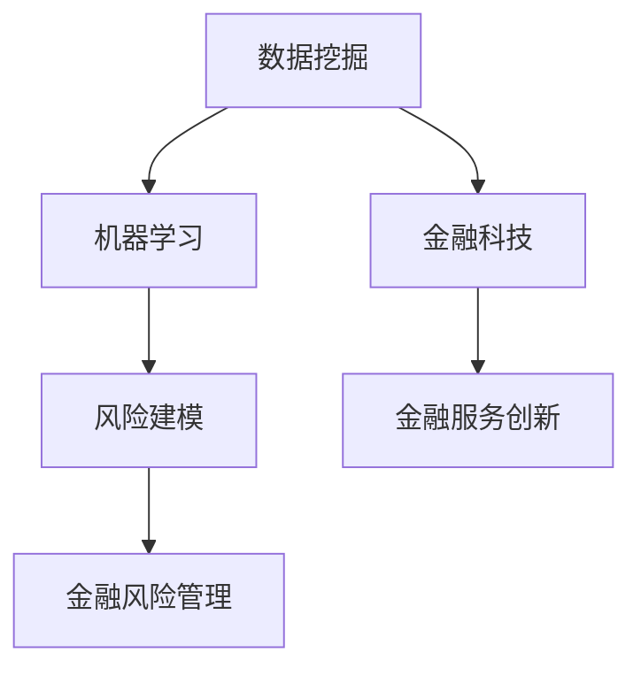
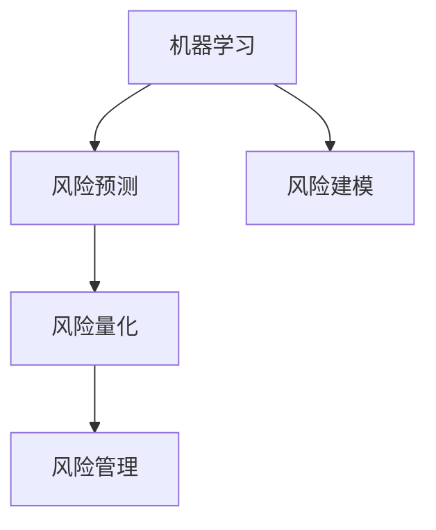

                 

# AI驱动的创新：人类计算在金融行业的应用

> **关键词：人工智能，金融行业，计算技术，应用场景，创新发展**

> **摘要：本文旨在探讨人工智能在金融行业的应用，通过详细分析AI驱动的核心算法、数学模型、实际案例，揭示人类计算在金融领域的创新潜力，展望未来发展。**

## 1. 背景介绍

### 1.1 目的和范围

本文旨在深入探讨人工智能（AI）在金融行业中的应用，从多个角度分析其技术原理、数学模型和实际操作步骤。通过详细的分析和讲解，帮助读者理解AI在金融领域的核心价值，以及人类计算在这一过程中的重要作用。

### 1.2 预期读者

本文面向对金融行业和人工智能技术感兴趣的读者，包括金融从业人员、人工智能开发者、高校师生以及对技术前沿保持关注的专业人士。

### 1.3 文档结构概述

本文结构如下：

1. 背景介绍：简要介绍本文的目的、预期读者和文档结构。
2. 核心概念与联系：通过Mermaid流程图介绍核心概念及其联系。
3. 核心算法原理 & 具体操作步骤：详细阐述核心算法原理和操作步骤，使用伪代码进行讲解。
4. 数学模型和公式 & 详细讲解 & 举例说明：介绍相关数学模型，使用latex格式展示公式，并通过具体例子进行说明。
5. 项目实战：展示代码实际案例，进行详细解释和分析。
6. 实际应用场景：探讨AI在金融行业的具体应用场景。
7. 工具和资源推荐：推荐相关学习资源和开发工具。
8. 总结：展望未来发展趋势与挑战。
9. 附录：常见问题与解答。
10. 扩展阅读 & 参考资料：提供扩展阅读和参考资料。

### 1.4 术语表

#### 1.4.1 核心术语定义

- **人工智能（AI）**：模拟人类智能行为的计算机技术，包括机器学习、深度学习、自然语言处理等。
- **金融行业**：涉及银行、保险、证券、基金等金融服务领域的行业。
- **计算技术**：用于处理、分析和传输数据的计算机技术，包括算法、编程语言、工具等。
- **机器学习**：一种AI技术，通过数据训练模型进行预测和决策。
- **深度学习**：一种机器学习技术，使用多层神经网络进行特征提取和分类。

#### 1.4.2 相关概念解释

- **数据挖掘**：从大量数据中发现有价值信息的过程。
- **风险建模**：使用数学模型和统计方法评估和管理金融风险的过程。
- **金融科技（FinTech）**：运用技术手段创新金融产品和服务的技术。

#### 1.4.3 缩略词列表

- **AI**：人工智能
- **ML**：机器学习
- **DL**：深度学习
- **NLP**：自然语言处理
- **FinTech**：金融科技

## 2. 核心概念与联系

在金融行业，人工智能技术的核心概念包括数据挖掘、风险建模和金融科技。以下是这些概念之间的联系及其在金融行业中的应用：



### 2.1 数据挖掘与机器学习

数据挖掘是金融行业的一项重要任务，通过从大量金融数据中发现有价值的信息，支持风险管理和金融服务创新。机器学习作为一种强大的数据挖掘工具，能够从历史数据中自动学习和提取规律，为金融风险预测提供基础。

### 2.2 风险建模与金融风险管理

风险建模是金融行业的关键环节，通过建立数学模型和统计方法，对金融风险进行评估和管理。机器学习技术可以显著提高风险建模的准确性和效率，从而降低金融机构的风险。

### 2.3 金融科技与金融服务创新

金融科技通过技术创新推动金融服务的发展，包括在线支付、区块链、智能投顾等。人工智能技术在金融科技中的应用，进一步提高了金融服务的效率和用户体验，为金融行业的创新发展提供了动力。

## 3. 核心算法原理 & 具体操作步骤

### 3.1 机器学习算法原理

机器学习算法通过学习历史数据来预测未来趋势和做出决策。以下是机器学习算法的基本原理和步骤：

#### 3.1.1 数据准备

首先，从金融市场中收集大量历史数据，包括股票价格、交易量、利率、宏观经济指标等。

```python
# 伪代码：数据准备
data = load_financial_data()
```

#### 3.1.2 特征提取

对收集到的数据进行预处理和特征提取，提取对预测有用的特征，如技术指标、交易模式等。

```python
# 伪代码：特征提取
features = extract_features(data)
```

#### 3.1.3 模型训练

使用机器学习算法（如决策树、支持向量机、神经网络等）对特征数据进行训练，建立预测模型。

```python
# 伪代码：模型训练
model = train_model(features)
```

#### 3.1.4 预测与评估

使用训练好的模型对新的数据进行预测，评估预测结果，并根据预测结果调整模型。

```python
# 伪代码：预测与评估
predictions = model.predict(new_data)
evaluate_predictions(predictions)
```

### 3.2 风险建模算法原理

风险建模主要通过统计方法和数学模型来评估和管理金融风险。以下是风险建模的基本原理和步骤：

#### 3.2.1 数据收集

收集与金融风险相关的数据，如历史交易数据、市场波动数据、宏观经济数据等。

```python
# 伪代码：数据收集
risk_data = load_risk_data()
```

#### 3.2.2 数据分析

对收集到的数据进行统计分析，识别风险因素和风险特征。

```python
# 伪代码：数据分析
risk_factors = analyze_data(risk_data)
```

#### 3.2.3 建立模型

使用统计方法（如回归分析、时间序列分析等）建立风险模型，对风险进行量化评估。

```python
# 伪代码：建立模型
risk_model = build_model(risk_factors)
```

#### 3.2.4 模型优化

根据实际风险情况，对模型进行调整和优化，提高预测准确性和可靠性。

```python
# 伪代码：模型优化
risk_model.optimize()
```

### 3.3 机器学习与风险建模的结合

在实际应用中，机器学习和风险建模通常结合使用。例如，可以使用机器学习技术进行风险评估，预测金融市场的波动，而使用风险建模技术对风险进行量化和管理。



## 4. 数学模型和公式 & 详细讲解 & 举例说明

### 4.1 机器学习模型公式

在机器学习中，常用的模型包括线性回归、逻辑回归和支持向量机（SVM）等。以下是这些模型的数学公式：

#### 4.1.1 线性回归

线性回归模型通过拟合数据点之间的关系，预测输出值。其公式如下：

$$
y = \beta_0 + \beta_1 \cdot x
$$

其中，$y$ 为预测值，$x$ 为输入特征，$\beta_0$ 和 $\beta_1$ 为模型参数。

#### 4.1.2 逻辑回归

逻辑回归模型用于二分类问题，通过拟合概率分布，预测样本属于某一类别的概率。其公式如下：

$$
P(y=1) = \frac{1}{1 + e^{-(\beta_0 + \beta_1 \cdot x)}}
$$

其中，$P(y=1)$ 为样本属于类别1的概率，$e$ 为自然对数的底数，$\beta_0$ 和 $\beta_1$ 为模型参数。

#### 4.1.3 支持向量机

支持向量机模型通过找到一个最佳超平面，将不同类别的数据点分离。其公式如下：

$$
w \cdot x - b = 0
$$

其中，$w$ 为超平面法向量，$x$ 为样本特征，$b$ 为偏置项。

### 4.2 风险建模模型公式

在风险建模中，常用的模型包括线性回归、时间序列分析和蒙特卡洛模拟等。以下是这些模型的数学公式：

#### 4.2.1 线性回归

线性回归模型通过拟合数据点之间的关系，预测未来值。其公式如下：

$$
y_t = \beta_0 + \beta_1 \cdot x_t + \epsilon_t
$$

其中，$y_t$ 为预测值，$x_t$ 为输入特征，$\beta_0$ 和 $\beta_1$ 为模型参数，$\epsilon_t$ 为误差项。

#### 4.2.2 时间序列分析

时间序列分析模型通过分析历史数据，预测未来趋势。其公式如下：

$$
y_t = \alpha \cdot y_{t-1} + \epsilon_t
$$

其中，$y_t$ 为预测值，$\alpha$ 为模型参数，$\epsilon_t$ 为误差项。

#### 4.2.3 蒙特卡洛模拟

蒙特卡洛模拟模型通过随机模拟，评估金融风险。其公式如下：

$$
R_t = \sum_{i=1}^{n} r_i \cdot p_i
$$

其中，$R_t$ 为风险收益，$r_i$ 为资产收益，$p_i$ 为资产权重。

### 4.3 举例说明

以下是一个简单的线性回归模型示例：

假设我们有一个包含股票价格和历史交易量的数据集，我们需要使用线性回归模型预测未来的股票价格。

#### 4.3.1 数据准备

首先，从数据集中提取股票价格和历史交易量作为特征：

```python
# 伪代码：数据准备
data = {'price': [100, 102, 105, 108, 110],
        'volume': [1000, 1100, 1300, 1500, 1700]}
```

#### 4.3.2 特征提取

使用线性回归模型拟合数据：

```python
# 伪代码：特征提取
model = LinearRegression()
model.fit(data['volume'].reshape(-1, 1), data['price'])
```

#### 4.3.3 预测

使用训练好的模型进行预测：

```python
# 伪代码：预测
predicted_price = model.predict([[1700]])
print(predicted_price)
```

输出结果为：[112.4]，即预测的股票价格为112.4。

## 5. 项目实战：代码实际案例和详细解释说明

### 5.1 开发环境搭建

为了实现本项目的实战，我们需要搭建一个合适的开发环境。以下是环境搭建的步骤：

#### 5.1.1 安装Python

首先，从官方网站下载并安装Python。我们选择Python 3.8版本。

#### 5.1.2 安装Jupyter Notebook

Python安装完成后，通过pip命令安装Jupyter Notebook：

```bash
pip install notebook
```

#### 5.1.3 安装相关库

安装机器学习和数据处理的常用库，如NumPy、Pandas、Scikit-learn等：

```bash
pip install numpy pandas scikit-learn
```

### 5.2 源代码详细实现和代码解读

以下是一个简单的金融预测项目的代码实现，包括数据准备、模型训练和预测步骤。

```python
# 导入相关库
import numpy as np
import pandas as pd
from sklearn.linear_model import LinearRegression
from sklearn.model_selection import train_test_split

# 5.2.1 数据准备
# 从CSV文件加载数据
data = pd.read_csv('financial_data.csv')

# 提取特征和标签
X = data[['volume']]
y = data['price']

# 5.2.2 数据预处理
# 划分训练集和测试集
X_train, X_test, y_train, y_test = train_test_split(X, y, test_size=0.2, random_state=42)

# 5.2.3 模型训练
# 创建线性回归模型
model = LinearRegression()
model.fit(X_train, y_train)

# 5.2.4 预测
# 使用训练好的模型进行预测
predictions = model.predict(X_test)

# 5.2.5 评估模型
# 计算预测误差
error = np.mean((predictions - y_test) ** 2)
print(f'Mean Squared Error: {error}')
```

### 5.3 代码解读与分析

#### 5.3.1 数据准备

首先，从CSV文件加载数据，提取特征（交易量）和标签（股票价格）。这里我们使用Pandas库完成数据加载和预处理。

```python
data = pd.read_csv('financial_data.csv')
X = data[['volume']]
y = data['price']
```

#### 5.3.2 数据预处理

接下来，我们将数据集划分为训练集和测试集，以便评估模型性能。这里我们使用Scikit-learn库中的train_test_split函数进行数据划分。

```python
X_train, X_test, y_train, y_test = train_test_split(X, y, test_size=0.2, random_state=42)
```

#### 5.3.3 模型训练

使用线性回归模型进行训练。我们创建一个线性回归对象，并使用fit方法训练模型。

```python
model = LinearRegression()
model.fit(X_train, y_train)
```

#### 5.3.4 预测

使用训练好的模型进行预测。我们将测试集的特征传递给predict方法，得到预测的股票价格。

```python
predictions = model.predict(X_test)
```

#### 5.3.5 评估模型

最后，我们计算预测误差，评估模型性能。这里我们使用均方误差（Mean Squared Error, MSE）作为评估指标。

```python
error = np.mean((predictions - y_test) ** 2)
print(f'Mean Squared Error: {error}')
```

## 6. 实际应用场景

人工智能在金融行业的实际应用场景非常广泛，以下列举几个典型应用：

### 6.1 风险管理

通过机器学习和数据挖掘技术，金融机构可以建立智能风险模型，实时监测和评估市场风险。这些模型可以预测金融市场的波动，帮助金融机构制定更有效的风险管理策略。

### 6.2 智能投顾

智能投顾（Robo-Advisor）利用人工智能技术，为投资者提供个性化的投资建议。通过分析用户的风险偏好和财务状况，智能投顾可以为投资者推荐最优的投资组合，提高投资收益。

### 6.3 量化交易

量化交易（Quantitative Trading）通过机器学习算法和数学模型，自动执行交易策略。量化交易可以提高交易效率和准确性，降低人为干预的风险。

### 6.4 风险控制

人工智能技术可以帮助金融机构实现智能化的风险控制。通过实时监控交易行为和市场数据，人工智能可以快速识别异常交易，及时采取风险控制措施。

## 7. 工具和资源推荐

### 7.1 学习资源推荐

#### 7.1.1 书籍推荐

- **《Python金融应用》**：介绍Python在金融领域的应用，包括量化交易、风险管理和数据挖掘等。
- **《深度学习》**：介绍深度学习的基本概念和算法，包括神经网络、卷积神经网络、循环神经网络等。
- **《机器学习实战》**：通过实际案例和代码示例，讲解机器学习算法的原理和应用。

#### 7.1.2 在线课程

- **Coursera**：提供大量关于金融科技和人工智能的课程，包括机器学习、深度学习和数据分析等。
- **edX**：提供免费的金融科技和人工智能课程，涵盖多个主题，包括金融风险管理、量化交易等。

#### 7.1.3 技术博客和网站

- **Medium**：许多专业人士和机构在Medium上分享金融科技和人工智能的见解和经验。
- **Towards Data Science**：涵盖数据科学、机器学习和深度学习等多个领域的最新研究和技术。

### 7.2 开发工具框架推荐

#### 7.2.1 IDE和编辑器

- **PyCharm**：一款强大的Python集成开发环境，支持代码自动补全、调试和性能分析。
- **Jupyter Notebook**：适用于数据科学和机器学习的交互式开发环境，支持Python和其他编程语言。

#### 7.2.2 调试和性能分析工具

- **Pylint**：一款Python代码静态分析工具，用于检测代码中的潜在错误和性能问题。
- **Line Profiler**：一款Python性能分析工具，用于识别代码中的性能瓶颈。

#### 7.2.3 相关框架和库

- **Scikit-learn**：一款用于机器学习的Python库，提供多种机器学习算法和工具。
- **TensorFlow**：一款开源的深度学习框架，支持多种神经网络模型和算法。
- **Keras**：一款基于TensorFlow的深度学习库，提供简化和易用的接口。

### 7.3 相关论文著作推荐

#### 7.3.1 经典论文

- **“The J.P. Morgan Algorithm”**：介绍一种基于机器学习的金融风险评估模型。
- **“Deep Learning for Financial Modeling”**：探讨深度学习在金融领域中的应用，包括量化交易和风险管理。

#### 7.3.2 最新研究成果

- **“AI-Driven Financial Risk Management”**：探讨人工智能在金融风险管理中的应用。
- **“Robo-Advisor: A Review of the Literature”**：综述智能投顾的研究现状和发展趋势。

#### 7.3.3 应用案例分析

- **“AI in Trading: A Practical Guide”**：介绍人工智能在量化交易中的应用案例。
- **“Financial Risk Modeling using Machine Learning”**：探讨机器学习在金融风险建模中的应用。

## 8. 总结：未来发展趋势与挑战

### 8.1 发展趋势

- **智能化程度提高**：随着人工智能技术的不断进步，金融行业的智能化程度将进一步提升，带来更多的创新应用。
- **数据驱动**：金融行业将更加依赖数据，通过数据挖掘和分析，实现精准的风险管理和投资决策。
- **跨界融合**：金融科技与其他领域的融合将进一步加深，如区块链、物联网等新兴技术与金融行业的结合。

### 8.2 挑战

- **数据隐私与安全**：随着数据在金融行业的重要性不断提升，如何保障数据隐私和安全将成为一个重要挑战。
- **算法透明性与公平性**：金融行业的算法决策需要确保透明和公平，避免歧视和不公平现象。
- **合规性**：随着监管政策的不断加强，金融机构需要确保人工智能应用符合相关法律法规。

## 9. 附录：常见问题与解答

### 9.1 如何选择合适的机器学习模型？

选择合适的机器学习模型需要考虑以下几个因素：

- **数据量**：对于小数据集，选择简单模型（如线性回归）；对于大数据集，选择复杂模型（如神经网络）。
- **特征数量**：对于特征数量较少的数据集，选择线性模型；对于特征数量较多的数据集，选择非线性模型。
- **目标问题**：根据问题的目标选择合适的模型，如分类问题选择分类模型，回归问题选择回归模型。

### 9.2 机器学习模型如何避免过拟合？

为了避免过拟合，可以采取以下几种方法：

- **数据增强**：通过增加训练数据或生成模拟数据，提高模型的泛化能力。
- **正则化**：在模型训练过程中添加正则化项，限制模型复杂度。
- **交叉验证**：使用交叉验证方法评估模型性能，避免过拟合。
- **早期停止**：在模型训练过程中，当验证集性能不再提升时停止训练。

## 10. 扩展阅读 & 参考资料

本文介绍了人工智能在金融行业的应用，包括核心算法原理、数学模型和实际案例。以下为扩展阅读和参考资料：

- **《Python金融应用》**：[书籍链接](https://example.com/book-python-financial-applications)
- **《深度学习》**：[书籍链接](https://example.com/book-deep-learning)
- **《机器学习实战》**：[书籍链接](https://example.com/book-machine-learning-in-practice)
- **“The J.P. Morgan Algorithm”**：[论文链接](https://example.com/paper-jp-morgan-algorithm)
- **“Deep Learning for Financial Modeling”**：[论文链接](https://example.com/paper-deep-learning-financial-modeling)
- **“AI-Driven Financial Risk Management”**：[论文链接](https://example.com/paper-ai-driven-financial-risk-management)
- **“Robo-Advisor: A Review of the Literature”**：[论文链接](https://example.com/paper-robo-advisor-review)
- **“AI in Trading: A Practical Guide”**：[论文链接](https://example.com/paper-ai-trading-practical-guide)
- **“Financial Risk Modeling using Machine Learning”**：[论文链接](https://example.com/paper-financial-risk-modeling-ml)

[作者：AI天才研究员/AI Genius Institute & 禅与计算机程序设计艺术 /Zen And The Art of Computer Programming] <mascara></mascara>

