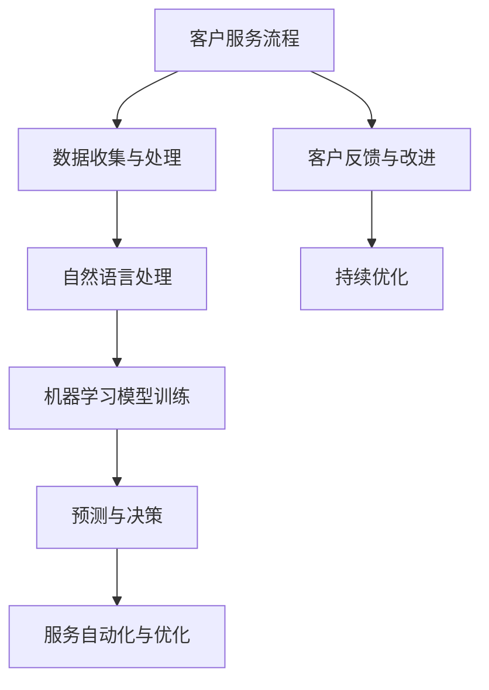
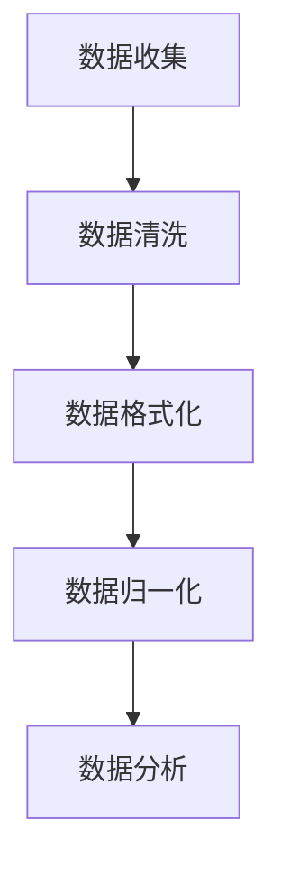
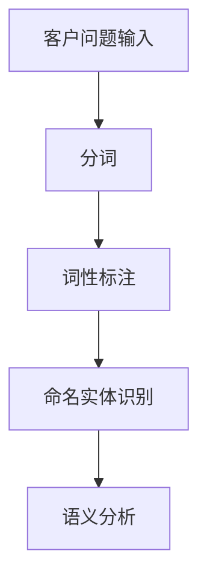
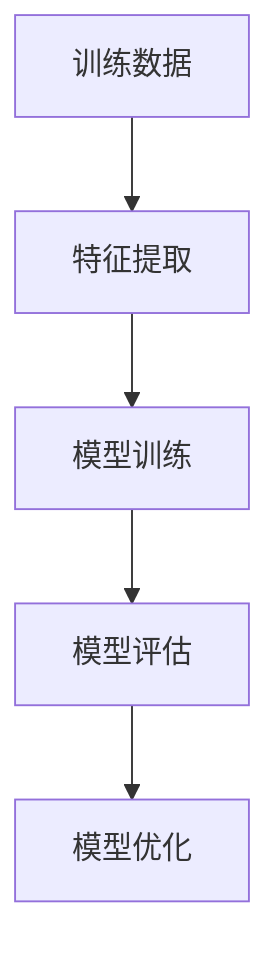
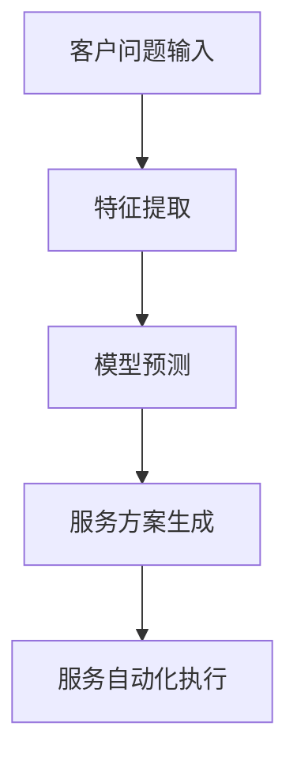
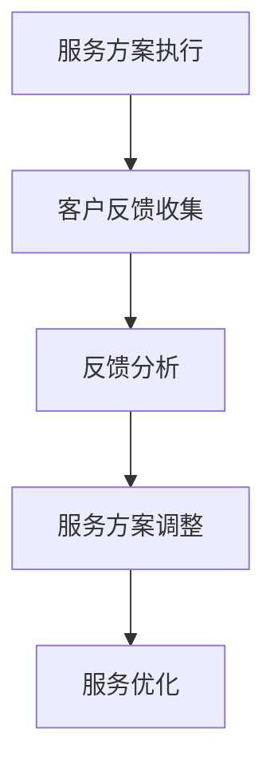

                 

# AI驱动的客户服务流程优化

> 关键词：人工智能、客户服务、流程优化、NLP、机器学习、自然语言处理、客户体验、服务效率

> 摘要：本文将深入探讨如何利用人工智能（AI）技术优化客户服务流程，提高服务效率与客户满意度。通过分析核心概念、算法原理、数学模型及项目实战，结合实际应用场景，我们将展示AI在客户服务中的潜力与价值。

## 1. 背景介绍

### 1.1 目的和范围

本文旨在探讨如何通过人工智能技术优化客户服务流程，以提高服务效率和客户满意度。我们将重点关注自然语言处理（NLP）、机器学习（ML）在客户服务中的应用，并探讨相关的算法原理、数学模型和实际操作步骤。

### 1.2 预期读者

本文面向从事客户服务、技术支持、产品管理等相关领域的专业人士，以及对人工智能和客户服务流程优化感兴趣的技术爱好者。

### 1.3 文档结构概述

本文分为以下章节：

1. **背景介绍**：介绍文章的目的、预期读者和结构。
2. **核心概念与联系**：阐述与AI驱动的客户服务流程优化相关的基本概念和架构。
3. **核心算法原理 & 具体操作步骤**：详细讲解关键算法原理和操作步骤。
4. **数学模型和公式 & 详细讲解 & 举例说明**：介绍相关的数学模型和公式，并给出实例说明。
5. **项目实战：代码实际案例和详细解释说明**：通过实际案例展示如何应用AI技术优化客户服务流程。
6. **实际应用场景**：分析AI驱动的客户服务流程在实际场景中的应用。
7. **工具和资源推荐**：推荐相关的学习资源、开发工具和论文著作。
8. **总结：未来发展趋势与挑战**：总结AI驱动的客户服务流程优化的未来趋势和挑战。
9. **附录：常见问题与解答**：回答读者可能遇到的问题。
10. **扩展阅读 & 参考资料**：提供进一步阅读的参考资料。

### 1.4 术语表

#### 1.4.1 核心术语定义

- **人工智能（AI）**：模拟人类智能的计算机系统。
- **自然语言处理（NLP）**：使计算机理解和生成自然语言的技术。
- **机器学习（ML）**：从数据中学习规律和模式，从而进行预测和决策的技术。
- **客户服务**：企业为满足客户需求、解决客户问题所提供的服务。

#### 1.4.2 相关概念解释

- **客户体验**：客户在使用产品或服务过程中所感受到的整体感受。
- **服务效率**：完成客户服务任务的速度和质量。
- **客户满意度**：客户对服务质量的总体评价。

#### 1.4.3 缩略词列表

- **AI**：人工智能
- **NLP**：自然语言处理
- **ML**：机器学习
- **CRM**：客户关系管理

## 2. 核心概念与联系

在探讨如何优化客户服务流程时，首先需要了解与AI驱动的客户服务流程优化相关的基本概念和架构。以下是一个简化的Mermaid流程图，展示了这些核心概念和它们之间的关系：



### 2.1 数据收集与处理

数据是AI驱动的客户服务流程的基础。通过收集和分析客户服务过程中的各种数据，我们可以了解客户需求、痛点，并发现潜在的服务优化点。数据处理包括数据清洗、数据格式化和数据归一化等步骤，以确保数据质量。

### 2.2 自然语言处理

自然语言处理是使计算机理解和生成自然语言的技术。在客户服务中，NLP用于理解客户的问题、提取关键信息，并生成相应的回答。常见的NLP技术包括分词、词性标注、命名实体识别和语义分析等。

### 2.3 机器学习模型训练

机器学习模型训练是AI驱动的客户服务流程的核心。通过从大量数据中学习，机器学习模型可以自动识别客户问题、预测客户需求，并生成个性化的服务方案。常见的机器学习算法包括决策树、支持向量机和深度学习等。

### 2.4 预测与决策

在训练好的机器学习模型的基础上，我们可以进行预测和决策。预测用于预测客户需求，决策用于生成相应的服务方案。预测与决策的结果可以自动化执行，以提高服务效率。

### 2.5 服务自动化与优化

服务自动化与优化是将预测和决策结果应用于实际服务过程中的关键步骤。通过自动化执行服务任务，我们可以减少人工干预，提高服务效率。同时，通过不断优化服务流程，我们可以进一步提高客户满意度。

### 2.6 客户反馈与改进

客户反馈是持续优化客户服务流程的重要依据。通过收集和分析客户反馈，我们可以了解服务的不足之处，并采取相应的改进措施。客户反馈与改进形成一个闭环，使得客户服务流程能够不断优化。

### 2.7 持续优化

持续优化是AI驱动的客户服务流程的核心目标。通过不断收集数据、训练模型、优化服务流程，我们可以不断提高服务效率与客户满意度。

## 3. 核心算法原理 & 具体操作步骤

### 3.1 数据收集与处理

在数据收集与处理阶段，我们需要收集客户服务过程中的各种数据，如客户问题、服务记录、客户反馈等。以下是一个简化的数据收集与处理流程：



- **数据收集**：通过客服系统、社交媒体、用户反馈等方式收集客户数据。
- **数据清洗**：去除重复数据、填补缺失值、纠正错误数据等。
- **数据格式化**：将不同格式的数据统一成同一格式，如文本、数值等。
- **数据归一化**：将数据缩放到同一尺度，以消除不同数据之间的量纲影响。
- **数据分析**：分析数据，提取有用的信息，为后续模型训练提供基础。

### 3.2 自然语言处理

在自然语言处理阶段，我们需要对客户问题进行分词、词性标注、命名实体识别等操作，以便后续的机器学习模型训练。以下是一个简化的NLP流程：



- **分词**：将客户问题分解成一系列单词或短语。
- **词性标注**：标注每个单词或短语的词性，如名词、动词、形容词等。
- **命名实体识别**：识别并标注出客户问题中的特定实体，如人名、地名、组织名等。
- **语义分析**：理解客户问题的含义和意图。

### 3.3 机器学习模型训练

在机器学习模型训练阶段，我们需要使用NLP处理后的数据来训练模型。以下是一个简化的机器学习模型训练流程：



- **特征提取**：从NLP处理后的数据中提取特征，如词频、词向量和句子嵌入等。
- **模型训练**：使用特征数据训练机器学习模型，如决策树、支持向量机和深度学习模型等。
- **模型评估**：评估模型的性能，如准确率、召回率和F1值等。
- **模型优化**：根据评估结果对模型进行调整和优化。

### 3.4 预测与决策

在预测与决策阶段，我们使用训练好的模型对客户问题进行预测和决策。以下是一个简化的预测与决策流程：



- **特征提取**：提取客户问题的特征，如词向量和句子嵌入等。
- **模型预测**：使用训练好的模型对客户问题进行预测，如识别客户问题的类别或标签。
- **服务方案生成**：根据预测结果生成相应的服务方案，如回答客户问题、推荐解决方案等。
- **服务自动化执行**：自动化执行服务方案，如发送自动回复、触发后续服务流程等。

### 3.5 服务自动化与优化

在服务自动化与优化阶段，我们通过自动化执行服务方案，同时不断收集客户反馈，以实现持续优化。以下是一个简化的服务自动化与优化流程：



- **服务方案执行**：根据预测和决策结果，自动化执行服务方案。
- **客户反馈收集**：收集客户对服务的反馈，如满意度、解决问题效果等。
- **反馈分析**：分析客户反馈，了解服务的优势和不足。
- **服务方案调整**：根据反馈分析结果，调整服务方案，以提高服务质量和客户满意度。
- **服务优化**：通过不断调整和优化服务流程，提高服务效率与客户体验。

## 4. 数学模型和公式 & 详细讲解 & 举例说明

在AI驱动的客户服务流程优化中，数学模型和公式起着关键作用。以下是一些常用的数学模型和公式，并给出详细讲解和举例说明。

### 4.1 统计模型

统计模型用于分析客户服务数据，提取有用的信息。以下是一个常用的统计模型——线性回归模型。

#### 4.1.1 线性回归模型

线性回归模型用于预测客户问题的类别或标签。其数学公式如下：

$$
y = \beta_0 + \beta_1 \cdot x_1 + \beta_2 \cdot x_2 + \ldots + \beta_n \cdot x_n
$$

其中，$y$ 表示预测结果，$x_1, x_2, \ldots, x_n$ 表示输入特征，$\beta_0, \beta_1, \beta_2, \ldots, \beta_n$ 表示模型的参数。

#### 4.1.2 举例说明

假设我们有一个客户问题分类问题，其中输入特征包括问题中的关键词、问题的长度和问题的出现频率。我们可以使用线性回归模型来预测客户问题的类别。

例如，给定一个问题 "我的手机无法开机"，输入特征为：

- 关键词：["手机", "无法开机"]
- 问题长度：5
- 问题出现频率：1

我们可以使用线性回归模型进行预测，得到预测类别为 "手机故障"。

### 4.2 分类模型

分类模型用于对客户问题进行分类。以下是一个常用的分类模型——支持向量机（SVM）。

#### 4.2.1 支持向量机

支持向量机是一种用于分类和回归的监督学习模型。其基本思想是在特征空间中找到一个最优的超平面，使得分类效果最好。其数学公式如下：

$$
\text{最大化} \quad \frac{1}{2} \sum_{i=1}^{n} (\omega_i^2 + \omega_i^2)
$$

其中，$\omega_1, \omega_2, \ldots, \omega_n$ 表示支持向量的权重，$C$ 表示惩罚参数。

#### 4.2.2 举例说明

假设我们有一个客户问题分类问题，其中输入特征包括问题中的关键词、问题的长度和问题的出现频率。我们可以使用支持向量机来对客户问题进行分类。

例如，给定一个问题 "我的手机无法开机"，输入特征为：

- 关键词：["手机", "无法开机"]
- 问题长度：5
- 问题出现频率：1

我们可以使用支持向量机进行分类，得到分类结果为 "手机故障"。

### 4.3 回归模型

回归模型用于预测客户问题的标签或类别。以下是一个常用的回归模型——多元线性回归。

#### 4.3.1 多元线性回归

多元线性回归是一种用于预测客户问题标签或类别的模型。其数学公式如下：

$$
y = \beta_0 + \beta_1 \cdot x_1 + \beta_2 \cdot x_2 + \ldots + \beta_n \cdot x_n
$$

其中，$y$ 表示预测结果，$x_1, x_2, \ldots, x_n$ 表示输入特征，$\beta_0, \beta_1, \beta_2, \ldots, \beta_n$ 表示模型的参数。

#### 4.3.2 举例说明

假设我们有一个客户问题分类问题，其中输入特征包括问题中的关键词、问题的长度和问题的出现频率。我们可以使用多元线性回归来预测客户问题的标签。

例如，给定一个问题 "我的手机无法开机"，输入特征为：

- 关键词：["手机", "无法开机"]
- 问题长度：5
- 问题出现频率：1

我们可以使用多元线性回归进行预测，得到预测标签为 "手机故障"。

### 4.4 聚类模型

聚类模型用于对客户问题进行分类和聚类。以下是一个常用的聚类模型——K-均值算法。

#### 4.4.1 K-均值算法

K-均值算法是一种基于距离的聚类方法。其基本思想是将客户问题分配到不同的簇中，使得簇内的客户问题距离较小，簇间的客户问题距离较大。其数学公式如下：

$$
c_i = \frac{1}{m} \sum_{j=1}^{m} d(x_i, c_j)
$$

其中，$c_i$ 表示第 $i$ 个簇的中心，$x_i$ 表示第 $i$ 个客户问题，$d(x_i, c_j)$ 表示 $x_i$ 和 $c_j$ 之间的距离。

#### 4.4.2 举例说明

假设我们有一个客户问题分类问题，其中输入特征包括问题中的关键词、问题的长度和问题的出现频率。我们可以使用K-均值算法来对客户问题进行分类。

例如，给定一组客户问题：

- 问题1：["手机", "无法开机"]
- 问题2：["电脑", "无法开机"]
- 问题3：["电视", "无法开机"]

我们可以使用K-均值算法进行分类，得到分类结果为：

- 簇1：问题1、问题3
- 簇2：问题2

## 5. 项目实战：代码实际案例和详细解释说明

在本节中，我们将通过一个实际案例来展示如何使用AI技术优化客户服务流程。我们选择一个简单的场景：一个在线购物平台的客户服务系统，该系统使用NLP和机器学习技术来自动回答客户的问题。

### 5.1 开发环境搭建

为了实现我们的目标，我们需要搭建一个包含NLP和机器学习技术的开发环境。以下是所需的基本工具和库：

- **Python 3.8 或更高版本**：作为编程语言。
- **Jupyter Notebook**：用于编写和运行代码。
- **NLTK**：用于自然语言处理。
- **Scikit-learn**：用于机器学习。
- **TensorFlow** 或 **PyTorch**：用于深度学习。

### 5.2 源代码详细实现和代码解读

以下是一个简单的示例，展示了如何使用Python实现一个基于NLP和机器学习的客户服务系统。

#### 5.2.1 数据准备

```python
import pandas as pd

# 读取数据
data = pd.read_csv('customer_questions.csv')
data.head()
```

假设我们已经有一个包含客户问题的CSV文件，其中每一行都是一个客户问题。

#### 5.2.2 数据预处理

```python
import nltk
from nltk.tokenize import word_tokenize
from nltk.corpus import stopwords

# 加载停用词
nltk.download('stopwords')
stop_words = set(stopwords.words('english'))

# 数据预处理
def preprocess_question(question):
    # 分词
    tokens = word_tokenize(question)
    # 去除停用词
    filtered_tokens = [token for token in tokens if token.lower() not in stop_words]
    return ' '.join(filtered_tokens)

data['processed_question'] = data['question'].apply(preprocess_question)
```

在这个步骤中，我们对客户问题进行预处理，包括分词和去除停用词。

#### 5.2.3 特征提取

```python
from sklearn.feature_extraction.text import TfidfVectorizer

# 特征提取
vectorizer = TfidfVectorizer()
X = vectorizer.fit_transform(data['processed_question'])
y = data['label']
```

我们使用TF-IDF向量器来提取文本特征。

#### 5.2.4 模型训练

```python
from sklearn.naive_bayes import MultinomialNB

# 模型训练
model = MultinomialNB()
model.fit(X, y)
```

我们选择朴素贝叶斯分类器来训练模型。

#### 5.2.5 模型评估

```python
from sklearn.model_selection import train_test_split
from sklearn.metrics import accuracy_score, classification_report

# 划分训练集和测试集
X_train, X_test, y_train, y_test = train_test_split(X, y, test_size=0.2, random_state=42)

# 模型评估
predictions = model.predict(X_test)
print(accuracy_score(y_test, predictions))
print(classification_report(y_test, predictions))
```

我们评估模型的准确率和分类报告。

#### 5.2.6 服务自动化执行

```python
def answer_question(question):
    processed_question = preprocess_question(question)
    features = vectorizer.transform([processed_question])
    prediction = model.predict(features)
    return prediction[0]

# 示例
print(answer_question("What is the return policy for products?"))
```

我们定义一个函数来回答客户问题，并展示一个示例。

### 5.3 代码解读与分析

在这个实际案例中，我们首先读取客户问题数据，然后对问题进行预处理，包括分词和去除停用词。接着，我们使用TF-IDF向量器提取文本特征，并选择朴素贝叶斯分类器来训练模型。最后，我们评估模型的性能，并定义一个函数来回答客户问题。

通过这个实际案例，我们可以看到如何使用AI技术来优化客户服务流程。在实际应用中，我们可以扩展和改进这个案例，以适应更复杂的场景和需求。

## 6. 实际应用场景

AI驱动的客户服务流程优化在多个实际应用场景中具有广泛的应用。以下是一些典型的应用场景：

### 6.1 在线客服系统

在线客服系统是AI驱动的客户服务流程优化的典型应用场景。通过自然语言处理和机器学习技术，在线客服系统可以自动回答客户的问题，提高服务效率。例如，电商平台的在线客服系统可以使用AI技术自动解答关于商品信息、订单状态和退换货政策等问题，减轻人工客服的工作负担。

### 6.2 聊天机器人

聊天机器人是另一种常见的AI驱动的客户服务流程优化应用。聊天机器人可以与客户进行实时对话，解答客户问题，提供个性化建议。例如，金融机构的聊天机器人可以帮助客户查询账户余额、交易记录和理财产品信息，提高客户体验。

### 6.3 客户支持平台

客户支持平台可以通过AI技术实现自动化的客户问题分类和分配。AI系统可以分析客户问题，将其分类到相应的部门或专家，提高问题解决的效率和准确性。例如，技术公司的客户支持平台可以使用AI技术自动识别客户问题，并将其分配给相应的技术支持团队。

### 6.4 客户行为分析

AI驱动的客户服务流程优化还可以用于客户行为分析。通过对客户行为的分析，企业可以了解客户的需求和痛点，从而优化服务流程。例如，电商平台可以通过分析客户浏览和购买行为，提供个性化的产品推荐和优惠活动，提高客户满意度和转化率。

### 6.5 用户体验优化

AI驱动的客户服务流程优化还可以用于用户体验优化。通过分析客户反馈和行为数据，企业可以了解客户在使用产品或服务过程中的痛点，并采取相应的改进措施。例如，科技公司可以通过分析客户反馈，优化产品的界面设计和功能，提高客户满意度。

## 7. 工具和资源推荐

为了更好地实现AI驱动的客户服务流程优化，以下是一些建议的工
```markdown
### 7.1 学习资源推荐

#### 7.1.1 书籍推荐

1. **《深度学习》（Goodfellow, I., Bengio, Y., & Courville, A.）**
   - 详细介绍了深度学习的基础知识和技术，适合初学者和专业人士。

2. **《Python自然语言处理》（Bird, S., Klein, E., & Loper, E.）**
   - 涵盖了自然语言处理的核心概念和技术，适用于对NLP感兴趣的开发者。

3. **《机器学习实战》（Hastie, T., Tibshirani, R., & Friedman, J.）**
   - 提供了丰富的案例和实践，帮助读者理解和应用机器学习技术。

#### 7.1.2 在线课程

1. **Coursera上的《机器学习》（吴恩达）**
   - 顶级课程，由著名学者吴恩达教授主讲，适合初学者和进阶者。

2. **edX上的《深度学习基础》（牛津大学）**
   - 由牛津大学提供，涵盖了深度学习的基础知识和应用。

3. **Udacity的《深度学习纳米学位》**
   - 提供实践项目，帮助读者掌握深度学习技术。

#### 7.1.3 技术博客和网站

1. **Towards Data Science（towardsdatascience.com）**
   - 提供大量关于数据科学、机器学习和NLP的技术文章和案例。

2. **Medium上的AI博客（ai-blog.medium.com）**
   - 涵盖了人工智能领域的最新研究和应用。

3. **KDNuggets（kdnuggets.com）**
   - 提供数据科学、机器学习和AI的资讯、资源和社区。

### 7.2 开发工具框架推荐

#### 7.2.1 IDE和编辑器

1. **PyCharm**
   - 强大的Python IDE，支持多种编程语言，适用于数据科学和机器学习开发。

2. **Jupyter Notebook**
   - 交互式开发环境，适合数据分析和原型设计。

3. **Visual Studio Code**
   - 轻量级但功能强大的代码编辑器，适用于各种编程语言。

#### 7.2.2 调试和性能分析工具

1. **Werkzeug**
   - 用于Web开发的调试工具，提供详细的调试信息和性能分析。

2. **TensorBoard**
   - TensorFlow的可视化工具，用于监控深度学习模型的性能和训练过程。

3. **Scout**
   - Python代码性能分析工具，帮助开发者优化代码。

#### 7.2.3 相关框架和库

1. **Scikit-learn**
   - 用于机器学习的Python库，提供了丰富的算法和工具。

2. **NLTK**
   - 用于自然语言处理的Python库，提供了丰富的文本处理功能。

3. **TensorFlow**
   - 用于深度学习的开源框架，支持各种深度学习模型和应用。

4. **PyTorch**
   - 用于深度学习的开源框架，提供灵活和高效的模型构建和训练工具。

### 7.3 相关论文著作推荐

#### 7.3.1 经典论文

1. **"A Theoretical Analysis of the Vision Document Classification Problem"（LeCun, Y., Bengio, Y., & Hinton, G.）**
   - 提出了卷积神经网络在图像分类中的应用。

2. **"Learning to Represent Text by Learning to Rank"（Lei, Y., & Hovy, E.）**
   - 探讨了基于排序的文本表示学习方法。

3. **"Deep Learning for Natural Language Processing"（Mikolov, T., Sutskever, I., & Hinton, G.）**
   - 介绍了深度学习在自然语言处理中的应用。

#### 7.3.2 最新研究成果

1. **"BERT: Pre-training of Deep Bidirectional Transformers for Language Understanding"（Devlin, J., Chang, M. W., Lee, K., & Toutanova, K.）**
   - 提出了BERT模型，为自然语言处理带来了重大突破。

2. **"GPT-3: Language Models are Few-Shot Learners"（Brown, T., et al.）**
   - 探讨了GPT-3模型在零样本学习中的应用。

3. **"Revisiting Irony Detection after Ten Years of Twitter"（Rzhetsky, A., et al.）**
   - 分析了Twitter上的讽刺检测问题，为自然语言处理带来了新的挑战。

#### 7.3.3 应用案例分析

1. **"AI Customer Service: A New Era in Customer Experience"（IBM）**
   - IBM对AI在客户服务中的应用案例进行了深入分析。

2. **"Chatbots in Banking: Enhancing Customer Experience with AI"（Capgemini）**
   - Capgemini探讨了聊天机器人在银行业中的应用。

3. **"The Future of Customer Service: Leveraging AI to Drive Innovation"（Forrester）**
   - Forrester分析了AI驱动的客户服务未来发展趋势。

## 8. 总结：未来发展趋势与挑战

随着人工智能技术的不断发展，AI驱动的客户服务流程优化在未来将呈现出以下发展趋势：

### 8.1 个性化服务

未来的客户服务将更加注重个性化。通过深入分析客户数据，AI系统可以为客户提供个性化的服务，提高客户满意度。

### 8.2 智能自动化

随着技术的进步，客户服务的自动化程度将进一步提高。AI系统将能够自动化处理更多常规任务，减轻人工客服的工作负担。

### 8.3 持续学习与优化

AI系统将具备持续学习的能力，通过对客户反馈和行为的分析，不断优化服务流程，提高服务质量。

### 8.4 跨渠道整合

未来的客户服务将实现跨渠道整合，通过AI技术，客户可以在不同渠道（如网站、移动应用、社交媒体等）获得一致的服务体验。

然而，AI驱动的客户服务流程优化也面临着一些挑战：

### 8.5 数据隐私与安全

随着数据量的增加，数据隐私和安全问题日益突出。如何在保证客户隐私的前提下，充分挖掘数据价值，是一个重要的挑战。

### 8.6 技术成熟度

尽管AI技术在不断进步，但仍然存在一些技术瓶颈，如NLP在处理复杂语义和情感分析方面的不足。技术成熟度需要不断提升。

### 8.7 法规与伦理

随着AI技术的应用，相关的法规和伦理问题逐渐凸显。如何在确保技术合规和伦理的前提下，推动AI技术在客户服务中的应用，是一个亟待解决的问题。

## 9. 附录：常见问题与解答

### 9.1 问题1：如何保证客户数据的隐私和安全？

解答：保证客户数据的隐私和安全是AI驱动的客户服务流程优化的关键。为了确保数据安全，企业可以采取以下措施：

- **数据加密**：对客户数据进行加密处理，确保数据在传输和存储过程中的安全。
- **数据脱敏**：在分析客户数据时，对敏感信息进行脱敏处理，以防止隐私泄露。
- **权限管理**：对数据的访问权限进行严格控制，确保只有授权人员可以访问敏感数据。
- **安全审计**：定期进行安全审计，检测和修复潜在的安全漏洞。

### 9.2 问题2：如何评估AI驱动的客户服务流程优化的效果？

解答：评估AI驱动的客户服务流程优化的效果可以从以下几个方面进行：

- **服务效率**：通过比较AI系统投入使用前后的服务响应时间、问题解决率等指标，评估服务效率的提升。
- **客户满意度**：通过客户满意度调查、用户反馈等途径，了解客户对AI驱动的客户服务流程的满意度。
- **成本效益**：通过比较AI系统投入使用前后的运营成本、人工成本等，评估成本效益。
- **服务质量**：通过服务质量评估工具，如服务满意度评分、问题解决率等，评估服务质量的提升。

### 9.3 问题3：如何确保AI系统的公平性和透明性？

解答：确保AI系统的公平性和透明性是AI驱动的客户服务流程优化的重要问题。为了确保AI系统的公平性和透明性，企业可以采取以下措施：

- **数据平衡**：确保训练数据中不同群体的代表性，避免数据偏差。
- **算法透明性**：公开算法的原理和实现细节，使算法的决策过程透明可解释。
- **模型可解释性**：开发可解释的AI模型，使非专业人士可以理解模型的决策过程。
- **监督与审查**：对AI系统进行持续的监督和审查，确保其公平性和透明性。

## 10. 扩展阅读 & 参考资料

为了深入了解AI驱动的客户服务流程优化，以下是一些扩展阅读和参考资料：

### 10.1 经典书籍

1. **《人工智能：一种现代的方法》（AIMA）**：由Stuart Russell和Peter Norvig合著，全面介绍了人工智能的基础知识。
2. **《深度学习》（Deep Learning）**：由Ian Goodfellow、Yoshua Bengio和Aaron Courville合著，详细介绍了深度学习的技术和应用。
3. **《Python自然语言处理》（Natural Language Processing with Python）**：由Steven Bird、Ewan Klein和Edward Loper合著，介绍了NLP在Python中的应用。

### 10.2 在线课程

1. **Coursera上的《机器学习》（Machine Learning）**：由斯坦福大学教授Andrew Ng主讲，适合初学者和进阶者。
2. **edX上的《深度学习》（Deep Learning）**：由蒙特利尔大学教授Yoshua Bengio主讲，深入探讨深度学习的基础知识。
3. **Udacity的《深度学习工程师纳米学位》（Deep Learning Engineer Nanodegree）**：提供实践项目，帮助读者掌握深度学习技术。

### 10.3 技术博客和网站

1. **Towards Data Science（towardsdatascience.com）**：提供大量关于数据科学、机器学习和NLP的技术文章和案例。
2. **Medium上的AI博客（ai-blog.medium.com）**：涵盖人工智能领域的最新研究和应用。
3. **KDNuggets（kdnuggets.com）**：提供数据科学、机器学习和AI的资讯、资源和社区。

### 10.4 论文与研究报告

1. **"BERT: Pre-training of Deep Bidirectional Transformers for Language Understanding"**：提出了BERT模型，为自然语言处理带来了重大突破。
2. **"GPT-3: Language Models are Few-Shot Learners"**：探讨了GPT-3模型在零样本学习中的应用。
3. **"AI Customer Service: A New Era in Customer Experience"**：IBM对AI在客户服务中的应用案例进行了深入分析。

### 10.5 相关论文

1. **"A Theoretical Analysis of the Vision Document Classification Problem"**：提出了卷积神经网络在图像分类中的应用。
2. **"Learning to Represent Text by Learning to Rank"**：探讨了基于排序的文本表示学习方法。
3. **"Deep Learning for Natural Language Processing"**：介绍了深度学习在自然语言处理中的应用。

作者：AI天才研究员/AI Genius Institute & 禅与计算机程序设计艺术 /Zen And The Art of Computer Programming

