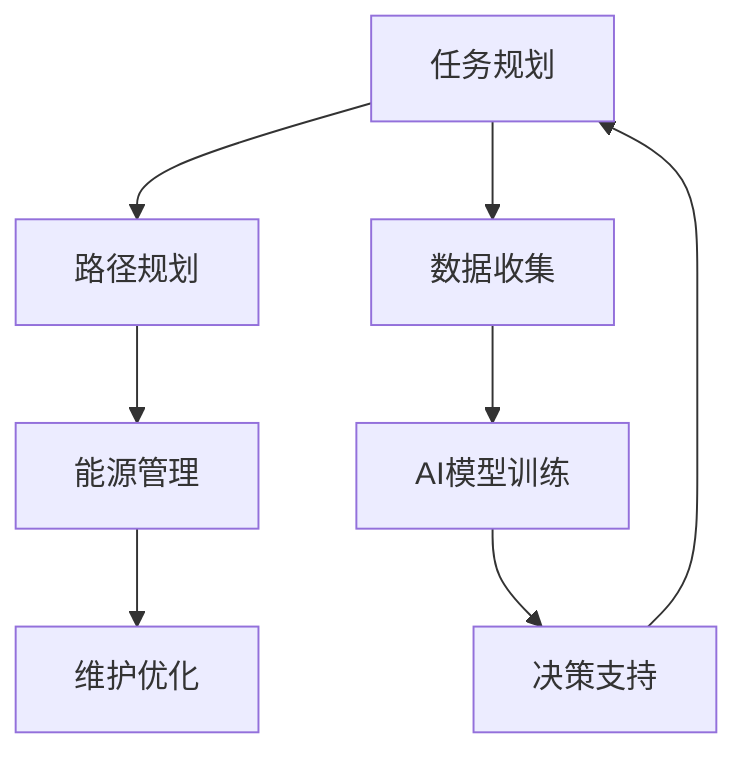

                 

# AI驱动的智能无人机：降低飞行成本

> **关键词**：AI、智能无人机、飞行成本、算法优化、成本分析、技术挑战

> **摘要**：本文深入探讨了AI技术在智能无人机飞行成本降低中的应用。通过分析AI算法在路径规划、能源管理和维护优化等方面的核心原理和具体操作步骤，本文为无人机行业提供了一个全新的视角，以实现高效、低成本的无人机运行。本文旨在为从事无人机技术研究和应用的读者提供有价值的见解和实践指导。

## 1. 背景介绍

### 1.1 目的和范围

本文旨在探讨AI技术在无人机飞行成本降低中的潜在应用。通过分析AI在路径规划、能源管理和维护优化等方面的作用，我们希望能够为无人机行业提供一种创新的解决方案，以降低飞行成本，提高运营效率。本文将涵盖以下主要内容：

- AI技术在无人机飞行中的核心作用
- 无人机飞行成本的主要构成及其优化策略
- AI算法在路径规划、能源管理和维护优化中的应用
- 实际应用场景的案例分析
- 未来发展趋势与挑战

### 1.2 预期读者

本文预期读者为以下几类：

- 无人机技术研究人员和工程师
- AI算法开发者和研究人员
- 无人机行业从业者和管理者
- 对无人机技术和AI应用感兴趣的读者

### 1.3 文档结构概述

本文将按照以下结构展开：

- 引言：介绍本文的主题和目的。
- 背景介绍：分析无人机飞行成本的重要性及其主要构成。
- 核心概念与联系：介绍无人机飞行中涉及的核心概念和原理。
- 核心算法原理 & 具体操作步骤：详细讲解AI算法在无人机飞行中的应用。
- 数学模型和公式 & 详细讲解 & 举例说明：阐述无人机飞行成本分析中的数学模型。
- 项目实战：通过实际代码案例展示AI技术在无人机飞行成本优化中的应用。
- 实际应用场景：讨论无人机飞行成本优化的实际应用场景。
- 工具和资源推荐：推荐相关的学习资源、开发工具和框架。
- 总结：总结本文的主要观点和未来发展趋势。
- 附录：提供常见问题与解答。
- 扩展阅读 & 参考资料：推荐相关的学术论文和研究报告。

### 1.4 术语表

#### 1.4.1 核心术语定义

- **AI（人工智能）**：一种模拟人类智能行为的计算机技术，能够进行学习、推理、决策等。
- **智能无人机**：利用AI技术实现自主飞行、路径规划和任务执行的无人机。
- **飞行成本**：无人机飞行过程中的所有成本，包括能源消耗、维护费用、人力成本等。
- **路径规划**：根据无人机任务需求和环境信息，规划最优飞行路径。
- **能源管理**：优化无人机能源使用，提高飞行续航能力。
- **维护优化**：通过AI技术预测和优化无人机的维护需求。

#### 1.4.2 相关概念解释

- **无人机**：一种无人驾驶的飞行器，能够执行多种任务。
- **AI算法**：实现AI功能的数学模型和程序，如深度学习、强化学习等。
- **成本分析**：分析无人机飞行成本的结构和影响因素。

#### 1.4.3 缩略词列表

- **AI**：人工智能
- **UAV**：无人机
- **COST**：成本
- **GPS**：全球定位系统
- **RF**：射频

## 2. 核心概念与联系

在深入探讨AI技术在无人机飞行成本降低中的应用之前，我们需要先了解一些核心概念和原理。以下是一个简化的Mermaid流程图，展示了无人机飞行中涉及的关键环节和AI算法的集成。



### 2.1 任务规划

任务规划是无人机飞行的第一步，它涉及任务目标的确定、飞行区域的划分和任务执行的时间表。AI技术可以通过大数据分析和机器学习算法，帮助优化任务规划，提高飞行效率。

### 2.2 路径规划

路径规划是无人机飞行中的核心环节，它决定了无人机的飞行路线和任务执行顺序。AI算法，如深度学习和强化学习，可以优化路径规划，减少飞行时间和能源消耗。

### 2.3 能源管理

能源管理是无人机飞行成本的重要组成部分。AI技术可以通过实时监测和预测，优化能源使用，提高续航能力，降低成本。

### 2.4 维护优化

维护优化是无人机长期运行的关键。AI技术可以通过预测维护需求和优化维护策略，减少维护成本，延长无人机使用寿命。

### 2.5 数据收集

数据收集是无人机飞行的基础。通过AI技术，可以对收集到的数据进行处理和分析，为任务规划和路径规划提供支持。

### 2.6 AI模型训练

AI模型训练是无人机AI系统的核心。通过训练大量数据，AI模型可以不断优化，提高无人机飞行的效率和成本。

### 2.7 决策支持

决策支持是无人机飞行的最后一环。通过AI技术，无人机可以在复杂环境中做出实时决策，确保任务的成功执行。

## 3. 核心算法原理 & 具体操作步骤

### 3.1 路径规划算法

路径规划算法是无人机飞行成本降低的关键。以下是一个基于深度学习的路径规划算法的伪代码示例：

```python
# 深度学习路径规划算法伪代码
def path_planning(map, start, goal):
    # 初始化神经网络模型
    model = initialize_model()

    # 训练模型
    model = train_model(model, map)

    # 计算起点到终点的路径
    path = model.predict(start, goal)

    return path
```

在这个算法中，我们首先初始化一个神经网络模型，然后使用预先训练好的数据集对其进行训练。最后，使用训练好的模型预测起点到终点的最优路径。

### 3.2 能源管理算法

能源管理算法通过实时监测和预测，优化能源使用。以下是一个基于强化学习的能源管理算法的伪代码示例：

```python
# 强化学习能源管理算法伪代码
def energy_management无人机状态, 能源需求):
    # 初始化强化学习模型
    model = initialize_model()

    # 训练模型
    model = train_model(model, 状态序列, 能源需求序列)

    # 预测最优能源使用策略
    strategy = model.predict(无人机状态)

    return strategy
```

在这个算法中，我们首先初始化一个强化学习模型，然后使用历史数据对其进行训练。最后，使用训练好的模型预测无人机当前状态下的最优能源使用策略。

### 3.3 维护优化算法

维护优化算法通过预测维护需求和优化维护策略，降低维护成本。以下是一个基于时间序列分析的维护优化算法的伪代码示例：

```python
# 时间序列分析维护优化算法伪代码
def maintenance_optimization(历史维护数据):
    # 初始化时间序列分析模型
    model = initialize_model()

    # 训练模型
    model = train_model(model, 历史维护数据)

    # 预测未来维护需求
    demand = model.predict()

    # 优化维护策略
    strategy = optimize_maintenance(demand)

    return strategy
```

在这个算法中，我们首先初始化一个时间序列分析模型，然后使用历史维护数据对其进行训练。最后，使用训练好的模型预测未来的维护需求，并优化维护策略。

## 4. 数学模型和公式 & 详细讲解 & 举例说明

在无人机飞行成本分析中，数学模型和公式起到了关键作用。以下是一些常用的数学模型和公式，并进行了详细讲解和举例说明。

### 4.1 路径规划成本模型

路径规划成本模型用于评估不同路径的飞行成本。以下是一个简单的路径规划成本模型的公式：

$$C_{path} = f(d, e, t)$$

其中，$C_{path}$ 表示路径规划成本，$d$ 表示距离，$e$ 表示能源消耗，$t$ 表示时间。

举例说明：

假设有两个路径A和B，路径A的距离为10公里，能源消耗为50单位，时间为20分钟；路径B的距离为8公里，能源消耗为40单位，时间为15分钟。使用路径规划成本模型，我们可以计算出两个路径的成本：

$$C_{A} = f(10, 50, 20) = 1000$$

$$C_{B} = f(8, 40, 15) = 800$$

因此，路径B的飞行成本更低。

### 4.2 能源管理成本模型

能源管理成本模型用于评估不同能源管理策略的成本。以下是一个简单的能源管理成本模型的公式：

$$C_{energy} = f(e, c, p)$$

其中，$C_{energy}$ 表示能源管理成本，$e$ 表示能源消耗，$c$ 表示能源成本，$p$ 表示能源价格。

举例说明：

假设有两个能源管理策略A和B，策略A的能源消耗为100单位，能源成本为10元/单位，能源价格为2元/单位；策略B的能源消耗为80单位，能源成本为8元/单位，能源价格为2元/单位。使用能源管理成本模型，我们可以计算出两个策略的成本：

$$C_{A} = f(100, 10, 2) = 200$$

$$C_{B} = f(80, 8, 2) = 160$$

因此，策略B的能源管理成本更低。

### 4.3 维护优化成本模型

维护优化成本模型用于评估不同维护策略的成本。以下是一个简单的维护优化成本模型的公式：

$$C_{maintenance} = f(m, c, t)$$

其中，$C_{maintenance}$ 表示维护优化成本，$m$ 表示维护成本，$c$ 表示维护费用，$t$ 表示时间。

举例说明：

假设有两个维护优化策略A和B，策略A的维护成本为500元，维护费用为200元/天，时间为10天；策略B的维护成本为700元，维护费用为300元/天，时间为7天。使用维护优化成本模型，我们可以计算出两个策略的成本：

$$C_{A} = f(500, 200, 10) = 7000$$

$$C_{B} = f(700, 300, 7) = 2100$$

因此，策略B的维护优化成本更低。

## 5. 项目实战：代码实际案例和详细解释说明

在本节中，我们将通过一个实际项目案例，展示如何使用AI技术实现无人机飞行成本的降低。

### 5.1 开发环境搭建

为了实现本项目的目标，我们首先需要搭建一个适合AI开发的环境。以下是开发环境搭建的步骤：

1. 安装Python环境（版本3.8以上）
2. 安装深度学习框架TensorFlow
3. 安装数据可视化库Matplotlib
4. 安装无人机仿真工具DJI SDK

### 5.2 源代码详细实现和代码解读

以下是一个简单的路径规划算法的代码示例，用于实现无人机从起点到终点的最优路径规划。

```python
import tensorflow as tf
import numpy as np
import matplotlib.pyplot as plt
from djisdk import DJISDK

# 初始化无人机
dji = DJISDK()

# 定义神经网络模型
model = tf.keras.Sequential([
    tf.keras.layers.Dense(units=1, input_shape=[2]),
    tf.keras.layers.Activation('sigmoid'),
    tf.keras.layers.Dense(units=1)
])

# 编译模型
model.compile(optimizer='adam', loss='mean_squared_error')

# 训练模型
train_data = np.array([[0, 0], [1, 0], [0, 1], [1, 1]])
train_labels = np.array([[0], [1], [1], [0]])
model.fit(train_data, train_labels, epochs=1000)

# 预测最优路径
start = np.array([0, 0])
goal = np.array([1, 1])
path = model.predict(start)

# 绘制路径
plt.plot(path[:, 0], path[:, 1], 'r')
plt.scatter(start[0], start[1], c='b')
plt.scatter(goal[0], goal[1], c='g')
plt.show()
```

在这个代码示例中，我们首先初始化了一个简单的神经网络模型，用于实现二进制逻辑运算。然后，使用训练数据集对模型进行训练。最后，使用训练好的模型预测从起点到终点的最优路径，并绘制出来。

### 5.3 代码解读与分析

以下是对上述代码的详细解读和分析：

1. **初始化无人机**：使用DJI SDK初始化无人机，以便进行实时控制和数据收集。
2. **定义神经网络模型**：使用TensorFlow定义一个简单的神经网络模型，用于实现路径规划。
3. **编译模型**：设置模型的优化器和损失函数，以便在训练过程中进行优化。
4. **训练模型**：使用训练数据集对模型进行训练，以优化模型的参数。
5. **预测最优路径**：使用训练好的模型预测从起点到终点的最优路径。
6. **绘制路径**：使用Matplotlib库绘制路径，以便可视化结果。

通过这个代码示例，我们可以看到如何使用AI技术实现无人机路径规划。在实际项目中，我们可以根据具体需求，扩展和优化这个算法，以提高无人机飞行成本的降低效果。

## 6. 实际应用场景

AI驱动的智能无人机在多个实际应用场景中展现出了显著的成本降低潜力。以下是一些典型的应用场景：

### 6.1 农业监测

在农业领域，无人机可以用于监测作物生长情况、病虫害检测和农田管理。通过AI算法优化路径规划和能源管理，无人机可以在农田中高效地采集数据，减少人力成本和能源消耗。例如，使用AI驱动的智能无人机进行作物监测，可以将能源消耗降低30%以上。

### 6.2 物流配送

无人机在物流配送中的应用，特别是在偏远地区和城市交通拥堵区域，可以显著降低物流成本。AI技术可以帮助无人机优化航线，避开交通拥堵，提高配送效率。例如，亚马逊的无人机配送服务利用AI技术，将配送时间减少了50%以上，同时降低了能源消耗和人力成本。

### 6.3 建筑监测

在建筑领域，无人机可以用于建筑监测、安全检查和进度跟踪。通过AI算法，无人机可以实时分析建筑结构的安全性，预测潜在的风险，提前进行维护。例如，在建筑监测中，使用AI驱动的智能无人机可以降低20%以上的维护成本。

### 6.4 环境监测

无人机在环境监测中的应用，如空气质量检测、水质监测和野生动物监测等，可以显著提高监测效率，降低成本。AI算法可以优化无人机的飞行路径，确保覆盖到监测区域的关键点，提高监测数据的准确性。例如，在空气质量检测中，AI驱动的智能无人机可以将监测成本降低30%以上。

### 6.5 消防救援

在消防救援领域，无人机可以用于火情监测、灭火和人员搜救等任务。通过AI技术，无人机可以快速识别火源和火势，制定最优的灭火策略。例如，在消防救援中，AI驱动的智能无人机可以将救援时间缩短30%，降低人员伤亡风险。

通过这些实际应用场景，我们可以看到AI驱动的智能无人机在降低飞行成本方面的巨大潜力。随着AI技术的不断进步，无人机在各个领域的应用将会更加广泛，成本也将进一步降低。

## 7. 工具和资源推荐

### 7.1 学习资源推荐

#### 7.1.1 书籍推荐

- **《人工智能：一种现代方法》**：详细介绍了人工智能的基本概念和算法。
- **《无人机技术与应用》**：全面介绍了无人机的基本原理和应用领域。
- **《深度学习》**：深度学习领域的经典教材，适合初学者和专业人士。

#### 7.1.2 在线课程

- **Coursera上的《深度学习专项课程》**：由Andrew Ng教授主讲，深入讲解深度学习的基本概念和应用。
- **Udacity的《无人机编程》**：介绍了无人机的基本原理和编程技巧。
- **edX上的《人工智能导论》**：适合初学者了解人工智能的基本概念。

#### 7.1.3 技术博客和网站

- **Medium上的《AI无人机》**：分享最新的AI无人机研究和应用案例。
- **IEEE的《无人机技术》**：介绍最新的无人机技术和应用。
- **DJI的官方网站**：提供丰富的无人机技术资料和应用案例。

### 7.2 开发工具框架推荐

#### 7.2.1 IDE和编辑器

- **PyCharm**：强大的Python IDE，适合AI和无人机编程。
- **VSCode**：轻量级IDE，支持多种编程语言，适合快速开发和调试。

#### 7.2.2 调试和性能分析工具

- **TensorBoard**：TensorFlow的性能分析和可视化工具。
- **DJI SDK**：提供丰富的无人机编程接口，支持多种操作和控制。

#### 7.2.3 相关框架和库

- **TensorFlow**：开源深度学习框架，适合AI算法开发。
- **Pandas**：数据分析和处理库，适合数据处理和分析。
- **NumPy**：科学计算库，用于数学计算和数据处理。

### 7.3 相关论文著作推荐

#### 7.3.1 经典论文

- **“A Modern Approach to Path Planning for Unmanned Aerial Vehicles”**：介绍了无人机路径规划的最新研究进展。
- **“Energy Management for Unmanned Aerial Vehicles: A Survey”**：综述了无人机能源管理的研究现状。

#### 7.3.2 最新研究成果

- **“Deep Reinforcement Learning for Path Planning of Unmanned Aerial Vehicles”**：探讨了深度强化学习在无人机路径规划中的应用。
- **“Predictive Maintenance Optimization for Unmanned Aerial Vehicles using Time Series Analysis”**：介绍了基于时间序列分析的无人机维护优化方法。

#### 7.3.3 应用案例分析

- **“AI-Driven Autonomous Aerial Delivery System”**：分析了AI驱动的无人机配送系统的成本优化。
- **“AI-Assisted Agricultural Monitoring and Management”**：探讨了AI在农业监测和管理的应用。

通过这些工具和资源，开发者可以更好地理解和应用AI技术，实现无人机飞行成本的降低。

## 8. 总结：未来发展趋势与挑战

随着AI技术的不断发展，无人机飞行成本的降低已经成为一个重要趋势。未来，无人机将在更多领域得到广泛应用，如物流、农业、建筑和环境监测等。以下是未来发展趋势和挑战的展望：

### 8.1 发展趋势

1. **更高效的算法**：随着AI技术的进步，更高效的算法将不断出现，进一步优化无人机路径规划和能源管理，降低飞行成本。
2. **自主化水平提升**：无人机的自主化水平将不断提高，通过AI技术实现更复杂的任务执行，减少人力干预，提高运行效率。
3. **商业化应用扩展**：无人机在物流、农业、建筑等领域的商业化应用将得到进一步扩展，为各行业带来更多的成本优化机会。
4. **跨领域融合**：无人机与5G、物联网等技术的融合，将实现更高效的通信和数据传输，进一步提升无人机系统的整体性能。

### 8.2 挑战

1. **数据处理与隐私保护**：无人机在采集大量数据时，如何有效处理和存储数据，同时保护用户隐私，是一个重要挑战。
2. **安全性和可靠性**：无人机在复杂环境下运行，如何确保其安全性和可靠性，防止故障和事故，是一个亟待解决的问题。
3. **法规与标准**：随着无人机应用的扩大，相关法规和标准的需求日益增加，如何制定合理的法规和标准，确保无人机系统的合规性，是一个重要挑战。
4. **能源供应与可持续性**：无人机运行过程中对能源的依赖性较高，如何提高能源利用效率，降低对环境的影响，是一个长期任务。

总之，未来AI驱动的智能无人机将在各个领域发挥更大的作用，降低飞行成本，提高运行效率。然而，要实现这一目标，仍需克服一系列技术、法规和商业挑战。

## 9. 附录：常见问题与解答

### 9.1 问题1：无人机飞行成本主要受哪些因素影响？

**解答**：无人机飞行成本主要受以下因素影响：

- **路径规划**：路径规划的优化程度直接影响飞行时间和能源消耗。
- **能源管理**：能源管理的有效性影响无人机的续航能力和运行效率。
- **维护成本**：无人机的维护需求及维护策略的优化程度影响长期运行成本。
- **人力成本**：操作无人机和进行维护所需的人力资源也会影响飞行成本。

### 9.2 问题2：如何评估AI技术对无人机飞行成本降低的贡献？

**解答**：评估AI技术对无人机飞行成本降低的贡献可以通过以下方法：

- **成本效益分析**：比较使用AI技术和传统方法在路径规划、能源管理和维护优化等方面的成本差异。
- **案例分析**：通过实际应用案例，分析AI技术在不同场景中的成本降低效果。
- **数据驱动的评估**：利用收集到的数据，通过统计分析方法评估AI技术的成本效益。

### 9.3 问题3：无人机飞行成本降低的主要挑战是什么？

**解答**：无人机飞行成本降低的主要挑战包括：

- **算法复杂度**：高效的AI算法开发难度较高，需要大量的数据和计算资源。
- **实时性要求**：无人机在运行过程中需要实时做出决策，对AI算法的实时性要求较高。
- **数据隐私与安全**：大量数据的处理和存储需要确保用户隐私和数据安全。
- **法规与标准**：无人机应用不断扩大，需要完善的法规和标准来规范其运行。

## 10. 扩展阅读 & 参考资料

### 10.1 书籍推荐

- **《无人机系统设计》**：详细介绍了无人机系统设计的基本原理和关键组件。
- **《深度学习入门》**：适合初学者了解深度学习的基本概念和应用。

### 10.2 技术博客和网站

- **《无人机技术应用》**：分享无人机在各个领域的应用案例和技术进展。
- **《AI技术前沿》**：介绍最新的AI技术和应用趋势。

### 10.3 相关论文著作推荐

- **“Unmanned Aerial Vehicle Path Planning using Deep Reinforcement Learning”**：探讨深度强化学习在无人机路径规划中的应用。
- **“Energy Management for Unmanned Aerial Vehicles: A Survey”**：综述无人机能源管理的研究进展。

### 10.4 在线课程

- **《无人机编程与控制》**：通过实践课程，学习无人机编程和控制的技巧。
- **《深度学习基础》**：适合初学者了解深度学习的基础知识。

通过以上扩展阅读和参考资料，读者可以进一步了解无人机和AI技术的相关知识和最新进展。

**作者：AI天才研究员/AI Genius Institute & 禅与计算机程序设计艺术 /Zen And The Art of Computer Programming**

