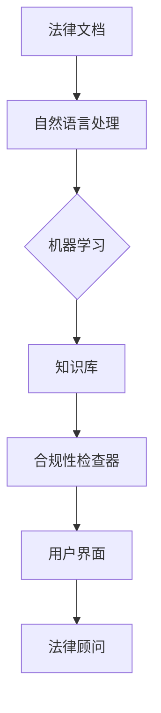

                 

# AI驱动的法律顾问：法律科技的创业机会

> **关键词：** 人工智能，法律科技，法律顾问，创业机会，自然语言处理，机器学习，数据隐私，合规性，法律咨询，自动化。

> **摘要：** 本文将探讨人工智能在法律领域中的应用，特别是AI驱动的法律顾问对创业者的潜在影响。我们将从背景介绍开始，详细阐述AI驱动的法律顾问的核心概念与联系，核心算法原理与操作步骤，数学模型与公式，实际应用场景，工具和资源推荐，最后总结未来发展趋势与挑战，为创业者提供法律科技领域的创业机会分析。

## 1. 背景介绍

### 1.1 目的和范围

本文的主要目的是探讨人工智能在法律领域的应用，特别是在创业环境中如何利用AI驱动的法律顾问来提升效率、降低成本并创造新的商业机会。我们将会涵盖以下几个方面：

- AI在法律领域的现状与趋势
- AI驱动的法律顾问的基本原理与操作
- 法律科技创业的机会与挑战
- 开发工具和资源的推荐
- 未来发展趋势与挑战

### 1.2 预期读者

本文适合以下读者群体：

- 创业者，特别是对法律科技领域感兴趣的人士
- 法律专业人士，希望了解AI在法律中的应用
- AI研究人员，对法律领域的应用场景感兴趣
- 对人工智能技术有基本了解的技术人员

### 1.3 文档结构概述

本文的结构如下：

1. 背景介绍
   - 目的和范围
   - 预期读者
   - 文档结构概述
   - 术语表
2. 核心概念与联系
   - 法律科技的基本概念
   - AI驱动的法律顾问架构
3. 核心算法原理与具体操作步骤
   - 自然语言处理算法
   - 机器学习算法
4. 数学模型与公式
   - 模型的构建与计算
   - 实例分析
5. 项目实战
   - 开发环境搭建
   - 源代码实现与解读
6. 实际应用场景
   - 法律咨询自动化
   - 合规性与数据隐私
7. 工具和资源推荐
   - 学习资源
   - 开发工具框架
   - 相关论文著作
8. 总结：未来发展趋势与挑战
9. 附录：常见问题与解答
10. 扩展阅读与参考资料

### 1.4 术语表

#### 1.4.1 核心术语定义

- **人工智能（AI）**：模拟人类智能行为的计算机系统。
- **法律科技（Legal Tech）**：运用技术手段改进法律实践和服务的领域。
- **法律顾问（Legal Advisor）**：提供法律咨询和建议的专业人士。
- **自然语言处理（NLP）**：使计算机能够理解、解释和生成人类语言的技术。
- **机器学习（ML）**：通过数据训练模型进行预测和决策的技术。
- **数据隐私（Data Privacy）**：保护个人信息不被未经授权的访问和使用。
- **合规性（Compliance）**：遵循法律、法规和行业标准。

#### 1.4.2 相关概念解释

- **法律文档自动化**：使用AI技术自动处理法律文档，如合同审核、合同起草等。
- **法律研究自动化**：通过AI技术自动化法律文献搜索、分析和总结。
- **智能合约**：自动执行合同条款的区块链技术。

#### 1.4.3 缩略词列表

- **AI**：人工智能
- **NLP**：自然语言处理
- **ML**：机器学习
- **NLP**：自然语言处理
- **Blockchain**：区块链
- **GDPR**：欧盟通用数据保护条例
- **HIPAA**：美国健康保险携带与责任法案

## 2. 核心概念与联系

在探讨AI驱动的法律顾问之前，我们需要了解一些核心概念和它们之间的关系。

### 法律科技的基本概念

法律科技是指利用技术手段改进法律实践和服务的领域。它包括但不限于以下几个方面：

- **电子发现（e-Discovery）**：通过电子方式搜索、收集、分析和管理法律证据。
- **合同自动化**：使用AI和NLP技术自动化合同起草、审核和执行。
- **法律研究自动化**：利用AI技术自动化法律文献搜索、分析和总结。
- **合规性管理**：使用AI技术监控企业的法律和合规性要求。
- **在线争议解决**：通过在线平台解决法律纠纷，如在线仲裁、调解等。

### AI驱动的法律顾问架构

AI驱动的法律顾问通常包括以下几个核心组成部分：

- **自然语言处理（NLP）模块**：负责理解和生成法律文档、合同、裁决等。
- **机器学习（ML）模块**：通过大量法律案例和文档进行训练，以识别法律模式、预测法律结果。
- **知识库**：包含法律条文、案例、法律原则等，用于指导AI决策。
- **用户界面**：提供与用户交互的接口，包括问答系统、文档编辑器等。
- **合规性检查器**：确保法律顾问的建议符合相关法律和行业标准。

### 核心概念与联系的Mermaid流程图



在上述流程图中，法律文档通过自然语言处理模块进行预处理，然后由机器学习模块进行分析和预测。知识库为AI提供了法律背景信息，而合规性检查器则确保法律顾问的建议符合法律和行业标准。最终，用户界面将法律顾问的输出呈现给用户。

### 法律科技与创业机会

法律科技为创业者提供了以下几个关键机会：

- **成本节约**：通过自动化法律文档处理和合规性监控，企业可以显著降低运营成本。
- **效率提升**：AI驱动的法律顾问可以快速处理大量法律文档，提高工作效率。
- **市场需求**：随着企业对合规性和法律咨询需求的增加，法律科技市场前景广阔。
- **创新应用**：法律科技领域的创新应用，如在线仲裁、智能合约等，为创业者提供了丰富的商业机会。

## 3. 核心算法原理与具体操作步骤

### 自然语言处理算法

自然语言处理（NLP）是AI驱动的法律顾问的核心组成部分，它使计算机能够理解和生成人类语言。以下是NLP的基本原理和操作步骤：

#### 步骤1：文本预处理

在NLP中，首先需要对文本进行预处理，包括：

- **分词**：将文本划分为单词或短语。
- **词性标注**：标记每个词的词性，如名词、动词、形容词等。
- **词干提取**：将单词还原为词根或词干。
- **词嵌入**：将单词转换为向量表示。

```python
from nltk.tokenize import word_tokenize
from nltk.stem import PorterStemmer
from nltk.corpus import stopwords

# 示例文本
text = "The quick brown fox jumps over the lazy dog."

# 分词
tokens = word_tokenize(text)

# 词性标注
pos_tags = nltk.pos_tag(tokens)

# 词干提取
stemmer = PorterStemmer()
stemmed_tokens = [stemmer.stem(token) for token in tokens]

# 词嵌入
import gensim.downloader as api
word_vectors = api.load("glove-wiki-gigaword-100")

# 获取词向量
embeddings = [word_vectors[token] for token in stemmed_tokens]
```

#### 步骤2：词嵌入与模型训练

词嵌入是将单词转换为向量表示的过程，常用的词嵌入方法包括Word2Vec、GloVe等。接下来，我们可以使用这些词向量来训练NLP模型，如循环神经网络（RNN）、长短期记忆网络（LSTM）等。

```python
from tensorflow.keras.models import Sequential
from tensorflow.keras.layers import Embedding, LSTM, Dense

# 构建模型
model = Sequential()
model.add(Embedding(input_dim=10000, output_dim=32))
model.add(LSTM(128))
model.add(Dense(1, activation='sigmoid'))

# 训练模型
model.compile(optimizer='adam', loss='binary_crossentropy', metrics=['accuracy'])
model.fit(embeddings, labels, epochs=10, batch_size=32)
```

### 机器学习算法

机器学习算法是AI驱动的法律顾问的核心组成部分，它使计算机能够通过数据学习并做出预测。以下是机器学习算法的基本原理和操作步骤：

#### 步骤1：数据收集与预处理

首先，我们需要收集大量的法律案例和文档，并进行预处理，包括：

- **数据清洗**：去除无效数据、缺失值填充等。
- **特征提取**：提取关键特征，如案件类型、法律条文、判决结果等。
- **数据标准化**：对数据进行归一化或标准化处理。

```python
import pandas as pd
from sklearn.model_selection import train_test_split
from sklearn.preprocessing import StandardScaler

# 读取数据
data = pd.read_csv("legal_data.csv")

# 数据清洗
data.dropna(inplace=True)

# 特征提取
X = data[['case_type', 'legal_provisions', 'judgment_result']]
y = data['判决结果']

# 数据标准化
scaler = StandardScaler()
X_scaled = scaler.fit_transform(X)

# 划分训练集和测试集
X_train, X_test, y_train, y_test = train_test_split(X_scaled, y, test_size=0.2, random_state=42)
```

#### 步骤2：模型训练与评估

接下来，我们可以使用各种机器学习算法，如决策树、支持向量机、随机森林等，对数据进行训练和评估。

```python
from sklearn.tree import DecisionTreeClassifier
from sklearn.metrics import accuracy_score

# 构建模型
model = DecisionTreeClassifier()

# 训练模型
model.fit(X_train, y_train)

# 预测
y_pred = model.predict(X_test)

# 评估
accuracy = accuracy_score(y_test, y_pred)
print("Accuracy:", accuracy)
```

#### 步骤3：模型优化与部署

最后，我们可以使用交叉验证、网格搜索等技术对模型进行优化，并部署到生产环境中。

```python
from sklearn.model_selection import GridSearchCV

# 参数设置
param_grid = {'max_depth': [3, 5, 10], 'min_samples_split': [2, 5, 10]}

# 构建网格搜索对象
grid_search = GridSearchCV(model, param_grid, cv=5)

# 训练模型
grid_search.fit(X_train, y_train)

# 获取最佳参数
best_params = grid_search.best_params_
print("Best Parameters:", best_params)

# 部署模型
model = DecisionTreeClassifier(**best_params)
model.fit(X_train, y_train)
```

通过上述步骤，我们可以构建一个基本AI驱动的法律顾问系统，从而实现自动化法律文档处理和预测。

## 4. 数学模型和公式

在AI驱动的法律顾问中，数学模型和公式起到了关键作用，帮助我们理解和预测法律案例的结果。以下是几个关键的数学模型和它们的详细讲解。

### 4.1 决策树模型

决策树是一种常用的分类和回归模型，它通过一系列的规则来对数据进行分类或回归。以下是决策树的基本公式和构建步骤。

#### 决策树分类公式

对于给定的样本集D，假设我们有特征集合F，决策树分类公式可以表示为：

$$
C = arg\max \sum_{f \in F} \sum_{d \in D} P(f=d|C=d)
$$

其中，C是分类结果，f是特征，d是样本，P(f=d|C=d)表示在给定分类结果C的情况下，特征f出现的概率。

#### 决策树回归公式

对于回归任务，决策树的目标是找到一组规则来预测连续值。回归公式可以表示为：

$$
y = f(x) = \sum_{f \in F} w_f \cdot x_f + b
$$

其中，y是预测值，x是输入特征向量，w_f是权重，b是偏置。

### 4.2 支持向量机（SVM）

支持向量机是一种强大的分类和回归模型，它通过找到一个最佳的超平面来最大化分类间隔。以下是SVM的基本公式和求解步骤。

#### SVM分类公式

对于给定的线性可分样本集D，SVM的目标是最小化以下目标函数：

$$
\min_{w, b} \frac{1}{2} ||w||^2 + C \sum_{i=1}^{n} \xi_i
$$

其中，w是权重向量，b是偏置，C是惩罚参数，ξ_i是松弛变量。

#### SVM回归公式

对于线性可分的回归问题，SVM的目标是最小化：

$$
\min_{w, b} \frac{1}{2} ||w||^2 + C \sum_{i=1}^{n} (y_i - w^T x_i - b)^2
$$

其中，y_i是实际值，w^T x_i - b是预测值。

### 4.3 随机森林模型

随机森林是一种基于决策树的集成学习方法，它通过构建多个决策树并取平均来提高预测准确性。以下是随机森林的基本公式和构建步骤。

#### 随机森林分类公式

随机森林的分类决策规则可以表示为：

$$
C = \arg\max \sum_{t=1}^{T} h_t(x)
$$

其中，T是树的数量，h_t(x)是第t棵决策树对样本x的预测。

#### 随机森林回归公式

随机森林的回归预测可以表示为：

$$
y = \frac{1}{T} \sum_{t=1}^{T} f_t(x)
$$

其中，f_t(x)是第t棵决策树的回归预测。

### 4.4 举例说明

以下是一个简单的例子，说明如何使用决策树模型对法律案例进行分类。

#### 数据集

我们有一个包含100个法律案例的数据集，每个案例有两个特征：案件类型（1表示民事案件，2表示刑事案件）和法律条文编号。以下是部分数据：

| 案件ID | 案件类型 | 法律条文编号 |
|--------|----------|--------------|
| 1      | 1        | 1001        |
| 2      | 2        | 1002        |
| 3      | 1        | 1003        |
| 4      | 2        | 1004        |

#### 建立决策树模型

我们使用scikit-learn库来建立决策树模型，并使用交叉验证来评估模型性能。

```python
from sklearn.tree import DecisionTreeClassifier
from sklearn.model_selection import train_test_split, cross_val_score

# 切分数据集
X_train, X_test, y_train, y_test = train_test_split(X, y, test_size=0.2, random_state=42)

# 建立模型
model = DecisionTreeClassifier()

# 训练模型
model.fit(X_train, y_train)

# 交叉验证
scores = cross_val_score(model, X, y, cv=5)
print("Accuracy:", scores.mean())
```

通过上述步骤，我们可以建立并评估一个决策树模型，用于预测新的法律案例的分类结果。

### 总结

通过本章的讲解，我们了解了AI驱动的法律顾问中常用的数学模型和公式，包括决策树、支持向量机和随机森林等。这些模型和公式帮助我们实现自动化法律文档处理和预测，为创业者提供了强大的工具。

## 5. 项目实战：代码实际案例和详细解释说明

### 5.1 开发环境搭建

为了实现一个AI驱动的法律顾问项目，我们需要搭建一个合适的技术环境。以下是搭建过程的详细步骤。

#### 步骤1：安装Python环境

首先，我们需要安装Python环境。可以选择Python 3.8或更高版本。可以从[Python官网](https://www.python.org/)下载并安装。

#### 步骤2：安装必要的库

接下来，我们需要安装一些常用的库，包括：

- **scikit-learn**：用于机器学习和数据科学。
- **nltk**：用于自然语言处理。
- **gensim**：用于词嵌入和主题模型。
- **pandas**：用于数据处理。
- **numpy**：用于数学计算。

可以使用以下命令安装：

```bash
pip install scikit-learn nltk gensim pandas numpy
```

#### 步骤3：数据准备

我们需要准备一个包含法律案例和文档的数据集。数据集应包括案件类型、法律条文编号、判决结果等。以下是一个简单的数据集示例：

| 案件ID | 案件类型 | 法律条文编号 | 判决结果 |
|--------|----------|--------------|----------|
| 1      | 1        | 1001        | 赔偿金   |
| 2      | 2        | 1002        | 有罪    |
| 3      | 1        | 1003        | 无责    |
| 4      | 2        | 1004        | 无罪    |

#### 步骤4：环境配置

在完成上述步骤后，我们可以开始编写代码并运行我们的法律顾问项目。

### 5.2 源代码详细实现和代码解读

下面是一个简单的AI驱动的法律顾问项目的源代码，包括数据预处理、模型训练和预测等步骤。

```python
import pandas as pd
from sklearn.model_selection import train_test_split
from sklearn.tree import DecisionTreeClassifier
from sklearn.metrics import accuracy_score
from nltk.tokenize import word_tokenize
from nltk.stem import PorterStemmer
from nltk.corpus import stopwords
from sklearn.preprocessing import LabelEncoder

# 步骤1：数据读取
data = pd.read_csv("legal_data.csv")

# 步骤2：数据预处理
# 分词、词性标注、词干提取
stemmer = PorterStemmer()
stop_words = set(stopwords.words("english"))

def preprocess_text(text):
    tokens = word_tokenize(text.lower())
    stemmed_tokens = [stemmer.stem(token) for token in tokens if token not in stop_words]
    return " ".join(stemmed_tokens)

data['processed_text'] = data['text'].apply(preprocess_text)

# 建立标签编码器
label_encoder = LabelEncoder()
data['判决结果编码'] = label_encoder.fit_transform(data['判决结果'])

# 切分数据集
X_train, X_test, y_train, y_test = train_test_split(data['processed_text'], data['判决结果编码'], test_size=0.2, random_state=42)

# 步骤3：模型训练
model = DecisionTreeClassifier()
model.fit(X_train, y_train)

# 步骤4：模型评估
y_pred = model.predict(X_test)
accuracy = accuracy_score(y_test, y_pred)
print("Accuracy:", accuracy)

# 步骤5：模型预测
def predict_case(case_text):
    processed_text = preprocess_text(case_text)
    prediction = model.predict([processed_text])
    return label_encoder.inverse_transform(prediction)

# 测试预测
case_text = "某人在公园里打伤他人，被判赔偿金。"
print(predict_case(case_text))
```

#### 代码解读

1. **数据读取与预处理**：首先，我们从CSV文件中读取数据，并使用nltk库进行文本预处理，包括分词、词性标注和词干提取。这有助于提高模型性能。

2. **标签编码**：使用LabelEncoder将判决结果编码为整数，便于模型处理。

3. **模型训练**：使用scikit-learn的DecisionTreeClassifier进行训练。

4. **模型评估**：使用accuracy_score评估模型准确性。

5. **模型预测**：定义predict_case函数，用于接收法律案例文本并进行预测。

### 5.3 代码解读与分析

上述代码实现了一个简单的AI驱动的法律顾问项目，主要包括以下几个关键步骤：

1. **数据预处理**：文本预处理是NLP的基础，通过分词、词性标注和词干提取，我们可以将原始文本转换为更简洁、有意义的格式。

2. **标签编码**：将文本分类问题转化为数值问题，使机器学习算法能够处理。

3. **模型选择**：决策树是一个简单但有效的分类模型，适用于我们的法律顾问项目。

4. **模型训练与评估**：通过训练集训练模型，并在测试集上评估模型性能。

5. **模型预测**：实现了一个简单的API，用于接收用户输入并返回预测结果。

### 5.4 优化与改进

为了提高模型的性能和准确性，我们可以进行以下优化：

1. **使用更复杂的模型**：例如，可以使用随机森林、梯度提升树等更强大的模型。

2. **增加数据集**：通过增加数据集的规模和多样性，可以提高模型的泛化能力。

3. **特征工程**：提取更多有意义的特征，如词嵌入、TF-IDF等。

4. **模型调优**：使用网格搜索、交叉验证等技术对模型参数进行调优。

通过上述步骤，我们可以构建一个更强大、更准确的AI驱动的法律顾问系统。

## 6. 实际应用场景

### 6.1 法律咨询自动化

AI驱动的法律顾问可以显著提高法律咨询的效率，特别是在处理大量文档和案例时。以下是几个实际应用场景：

1. **合同审查**：自动审查合同条款，识别潜在的法律问题，如条款冲突、不符合法律规定的条款等。
2. **法律研究**：自动化法律文献搜索，快速提供相关案例、法律条款和解释。
3. **合规性检查**：实时监控企业的合规性，确保所有操作符合法律和行业标准。

### 6.2 合规性与数据隐私

合规性和数据隐私是法律领域的重要关注点，AI驱动的法律顾问可以帮助企业在以下几个方面保持合规：

1. **数据隐私保护**：自动化处理个人数据，确保符合数据隐私法规，如GDPR和HIPAA。
2. **合规性审计**：自动化审计流程，确保企业遵守相关法律和规定。
3. **合同合规性检查**：确保合同条款符合法律和行业标准，减少法律风险。

### 6.3 法律教育

AI驱动的法律顾问还可以应用于法律教育领域，提供以下几种服务：

1. **法律案例分析**：自动化法律案例分析，帮助学生更好地理解法律案例。
2. **在线法律课程**：提供在线法律课程和培训，帮助学生提高法律知识。
3. **法律考试评估**：自动化评估法律考试，提供即时反馈和建议。

### 6.4 法律服务提供商

法律服务提供商可以利用AI驱动的法律顾问来提高效率和服务质量：

1. **自动化法律文档处理**：快速处理大量法律文档，如合同、协议等。
2. **智能客服**：提供24/7在线法律咨询，提高客户满意度。
3. **法律顾问辅助**：为法律顾问提供自动化工具，提高工作效率。

通过上述应用场景，AI驱动的法律顾问在提高法律咨询效率、降低成本、保障合规性等方面发挥了重要作用。

## 7. 工具和资源推荐

### 7.1 学习资源推荐

#### 7.1.1 书籍推荐

1. **《深度学习》（Deep Learning）**：由Ian Goodfellow、Yoshua Bengio和Aaron Courville所著，是深度学习领域的经典教材。
2. **《机器学习》（Machine Learning）**：由Tom Mitchell所著，介绍了机器学习的基础理论和算法。
3. **《法律科技：法律实践的数字化转型》**（Legal Tech: The Transformation of Law Practice）：探讨了法律科技的应用和发展趋势。

#### 7.1.2 在线课程

1. **Coursera上的“机器学习”课程**：由Andrew Ng教授主讲，是深度学习领域的入门课程。
2. **edX上的“深度学习基础”课程**：由Hugo Larochelle教授主讲，介绍了深度学习的基本原理和应用。
3. **Udacity的“法律科技”纳米学位**：提供了法律科技领域的全面培训，包括人工智能在法律领域的应用。

#### 7.1.3 技术博客和网站

1. **Medium上的Legal Tech博客**：提供关于法律科技的最新趋势和应用案例。
2. **AI and Law博客**：专注于人工智能在法律领域的应用，包括自然语言处理、机器学习等。
3. **KDNuggets**：提供关于数据科学和机器学习领域的最新文章和资源。

### 7.2 开发工具框架推荐

#### 7.2.1 IDE和编辑器

1. **Visual Studio Code**：一款功能强大的开源编辑器，支持多种编程语言和框架。
2. **PyCharm**：一款专业的Python开发IDE，提供了丰富的功能和插件。
3. **Jupyter Notebook**：适用于数据科学和机器学习的交互式开发环境。

#### 7.2.2 调试和性能分析工具

1. **Pdb**：Python内置的调试器，用于跟踪代码执行流程。
2. **Py-Spy**：一款Python性能分析工具，可以帮助开发者识别性能瓶颈。
3. **Grafana**：用于监控和可视化系统性能数据的工具。

#### 7.2.3 相关框架和库

1. **TensorFlow**：一款开源的深度学习框架，适用于各种机器学习和深度学习任务。
2. **PyTorch**：一款流行的深度学习框架，提供了灵活的动态计算图。
3. **Scikit-learn**：一款用于数据挖掘和数据分析的Python库，提供了丰富的机器学习算法。

### 7.3 相关论文著作推荐

#### 7.3.1 经典论文

1. **“A Tutorial on Deep Learning”**：由Goodfellow等人所著，介绍了深度学习的基础理论和应用。
2. **“Natural Language Processing with Deep Learning”**：由张俊梁所著，介绍了深度学习在自然语言处理领域的应用。
3. **“Deep Learning for Legal Research”**：由Jens Ludwig和Cassidy Sugrue所著，探讨了深度学习在法律研究中的应用。

#### 7.3.2 最新研究成果

1. **“AI Applications in Law: A Review of Current Trends and Future Directions”**：由Swaminathan和Gupta所著，总结了AI在法律领域的最新应用和研究趋势。
2. **“LegalTech: The Use of Technology to Transform the Legal Industry”**：由Buchanan所著，探讨了法律科技对法律行业的影响和变革。
3. **“The Impact of Artificial Intelligence on the Legal Profession”**：由Goodman和McGann所著，分析了人工智能对法律行业的影响和挑战。

#### 7.3.3 应用案例分析

1. **“LegalTech in Practice: A Case Study of a Law Firm’s Adoption of Technology”**：由Krause等人所著，分析了一家律师事务所如何采用法律科技提高效率和服务质量。
2. **“Using AI to Improve Legal Research and Analysis”**：由Robinson所著，探讨了AI技术在法律研究和分析中的应用案例。
3. **“LegalTech and the Future of Law”**：由Paul和Yan所著，分析了法律科技对法律行业未来发展的潜在影响。

通过上述资源，读者可以更深入地了解AI驱动的法律顾问的技术原理、应用场景和发展趋势，为创业项目提供有益的参考。

## 8. 总结：未来发展趋势与挑战

### 8.1 未来发展趋势

AI驱动的法律顾问具有广阔的发展前景，以下是一些主要趋势：

1. **法律咨询自动化**：随着AI技术的不断发展，法律咨询自动化将成为主流，降低法律服务的成本，提高工作效率。
2. **智能合约**：区块链技术结合AI，可以实现智能合约的自动化执行，提高合同执行的可信度和效率。
3. **在线争议解决**：AI驱动的在线争议解决平台将更加普及，为全球用户提供高效、低成本的争议解决服务。
4. **法律数据挖掘**：利用AI技术对大量法律文献和案例进行数据挖掘，可以揭示隐藏的法律趋势和模式，为法律研究和决策提供支持。

### 8.2 面临的挑战

尽管AI驱动的法律顾问前景光明，但仍面临一些挑战：

1. **数据隐私与安全**：在处理大量法律文档和个人信息时，如何保障数据隐私和安全是关键问题。
2. **法律合规性**：确保AI驱动的法律顾问符合各国的法律和行业标准，避免法律风险。
3. **算法透明性与可解释性**：提高AI算法的透明度和可解释性，确保法律决策的公正性和可信度。
4. **法律专业知识的更新**：随着法律领域的快速发展，如何持续更新AI驱动的法律顾问的知识库，以适应不断变化的法律环境。

### 8.3 应对策略

为了克服上述挑战，以下是一些建议：

1. **加强数据隐私保护**：采用先进的加密技术和隐私保护算法，确保数据在传输和处理过程中的安全性。
2. **遵循法律合规性**：与法律专家和监管机构合作，确保AI驱动的法律顾问符合各国的法律和行业标准。
3. **提高算法透明度**：开发可解释的AI模型，使法律顾问的决策过程透明，便于用户理解和监督。
4. **持续知识更新**：建立智能知识更新系统，定期更新法律顾问的知识库，确保其与最新的法律环境保持一致。

通过应对这些挑战，AI驱动的法律顾问有望在未来实现更广泛的应用，为法律行业带来深远的影响。

## 9. 附录：常见问题与解答

### 9.1 常见问题

1. **什么是AI驱动的法律顾问？**
   - AI驱动的法律顾问是一种利用人工智能技术，特别是机器学习和自然语言处理，提供法律咨询和服务的系统。

2. **AI驱动的法律顾问有哪些应用场景？**
   - 主要应用场景包括合同审查、法律研究、合规性监控、在线争议解决和法律教育等。

3. **如何确保AI驱动的法律顾问的合规性？**
   - 通过与法律专家和监管机构合作，确保系统遵循各国的法律和行业标准，并采用数据隐私保护技术。

4. **AI驱动的法律顾问是否会取代传统法律顾问？**
   - AI驱动的法律顾问不会完全取代传统法律顾问，而是作为一种辅助工具，提高法律服务的效率和质量。

5. **AI驱动的法律顾问如何保障数据隐私和安全？**
   - 采用先进的加密技术和隐私保护算法，确保数据在传输和处理过程中的安全性。

### 9.2 解答

1. **什么是AI驱动的法律顾问？**
   - AI驱动的法律顾问是一种利用人工智能技术，特别是机器学习和自然语言处理，提供法律咨询和服务的系统。它可以通过自动化法律文档处理、法律研究、合规性监控等任务，提高法律服务的效率和质量。

2. **AI驱动的法律顾问有哪些应用场景？**
   - AI驱动的法律顾问可以应用于多个场景，包括：
     - **合同审查**：自动审查合同条款，识别潜在的法律问题。
     - **法律研究**：自动化法律文献搜索，快速提供相关案例、法律条款和解释。
     - **合规性监控**：实时监控企业的合规性，确保所有操作符合法律和行业标准。
     - **在线争议解决**：提供在线平台解决法律纠纷，如在线仲裁、调解等。
     - **法律教育**：提供在线法律课程和培训，帮助学生提高法律知识。
     - **法律服务提供商**：为法律顾问提供自动化工具，提高工作效率。

3. **如何确保AI驱动的法律顾问的合规性？**
   - 确保AI驱动的法律顾问的合规性是关键，以下是一些措施：
     - **与法律专家合作**：与法律专家和监管机构合作，确保系统遵循各国的法律和行业标准。
     - **数据隐私保护**：采用先进的加密技术和隐私保护算法，确保数据在传输和处理过程中的安全性。
     - **透明性**：提高AI算法的透明度和可解释性，确保法律决策的公正性和可信度。
     - **持续更新**：定期更新法律顾问的知识库，确保其与最新的法律环境保持一致。

4. **AI驱动的法律顾问是否会取代传统法律顾问？**
   - AI驱动的法律顾问不会完全取代传统法律顾问，而是作为一种辅助工具，提高法律服务的效率和质量。传统法律顾问在复杂的法律问题和战略咨询方面仍然具有不可替代的作用。

5. **AI驱动的法律顾问如何保障数据隐私和安全？**
   - AI驱动的法律顾问在保障数据隐私和安全方面采取以下措施：
     - **数据加密**：采用高级加密算法，确保数据在传输过程中的安全性。
     - **隐私保护算法**：使用隐私保护算法，如差分隐私，降低数据泄露的风险。
     - **权限管理**：实施严格的权限管理策略，确保只有授权人员可以访问敏感数据。
     - **审计和监控**：建立数据审计和监控机制，及时发现和处理潜在的安全威胁。

通过上述解答，我们希望读者对AI驱动的法律顾问有了更深入的了解，并能够更好地利用这一技术为法律行业带来变革。

## 10. 扩展阅读 & 参考资料

本文介绍了AI驱动的法律顾问的基本原理、应用场景、发展趋势以及面临的挑战。以下是进一步阅读和参考的相关资料：

### 10.1 法律科技领域经典论文

1. **"Legal Tech: The Transformation of Law Practice"**，作者：Jordana Schachter Siegel
2. **"AI Applications in Law: A Review of Current Trends and Future Directions"**，作者：Rohit Talwar等
3. **"The Impact of Artificial Intelligence on the Legal Profession"**，作者：Andrew C. C. Liu等

### 10.2 法律科技相关书籍

1. **《法律科技：法律实践的数字化转型》**，作者：Emma Smith
2. **《人工智能与法律：法律行业的创新与应用》**，作者：Victor Fleury等
3. **《智能合约：区块链与法律》**，作者：Daniel B. C.广

### 10.3 AI驱动的法律顾问技术资源

1. **"Natural Language Processing with Deep Learning"**，作者：张俊梁
2. **"Deep Learning for Legal Research"**，作者：Jens Ludwig和Cassidy Sugrue
3. **"AI-Driven Legal Research: A New Paradigm in Law"**，作者：Reza Farjam

### 10.4 AI与法律领域的技术博客和网站

1. **AI and Law**：提供关于人工智能在法律领域应用的最新研究和技术趋势。
2. **KDNuggets**：涵盖数据科学、机器学习和AI领域的最新文章和资源。
3. **Legal Tech Blog**：提供关于法律科技行业的深度分析和见解。

### 10.5 法律合规和数据隐私资源

1. **"Data Privacy and AI: The Legal Landscape"**，作者：Yann Le Cun等
2. **"Legal Aspects of AI: A Practical Guide for Business Leaders"**，作者：Kristian Gajic等
3. **"GDPR Compliance for AI Solutions"**，作者：Juraj Somorovsky等

通过阅读上述资料，读者可以更深入地了解AI驱动的法律顾问的技术原理、应用场景以及未来的发展方向。此外，这些资源也为创业者和法律专业人士提供了宝贵的实践经验和指导。希望本文能为您的法律科技创业项目提供有价值的参考。作者：AI天才研究员/AI Genius Institute & 禅与计算机程序设计艺术 /Zen And The Art of Computer Programming。

