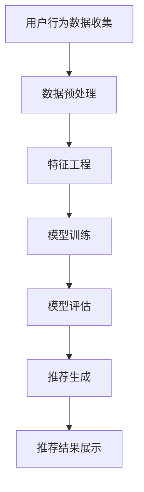

                 

# AI驱动的电商个性化推荐：一人公司提升用户体验的智能算法

> **关键词：** 人工智能、电商、个性化推荐、用户体验、算法优化

> **摘要：** 本文旨在探讨如何通过AI技术，为电商企业打造一套高效的个性化推荐系统。文章将从背景介绍、核心概念、算法原理、数学模型、实战案例等多个角度，详细解析AI驱动的电商个性化推荐系统的构建与优化方法，旨在为一人公司的创业者提供一套系统化的解决方案，从而提升用户购物体验和公司业绩。

## 1. 背景介绍

### 1.1 目的和范围

随着互联网技术的飞速发展，电商行业已经成为全球经济的重要组成部分。然而，在竞争激烈的电商市场中，如何吸引和留住用户，提高用户购物体验，成为了每个电商企业必须面对的挑战。个性化推荐系统作为一种有效的解决方案，能够在用户行为数据的基础上，为用户提供个性化的商品推荐，从而提高用户满意度和忠诚度。

本文的目的在于，通过介绍AI技术在电商个性化推荐中的应用，探讨如何构建和优化一套高效的个性化推荐系统。文章将涵盖以下内容：

- 电商个性化推荐系统的重要性
- 个性化推荐的核心概念与联系
- 个性化推荐算法原理及具体操作步骤
- 数学模型与公式详细讲解
- 实际应用场景分析
- 工具和资源推荐
- 未来发展趋势与挑战

### 1.2 预期读者

本文的预期读者主要包括：

- 一人公司的创始人或管理者，对电商行业有一定了解，希望借助AI技术提升用户体验和业绩
- AI技术爱好者，对个性化推荐系统有浓厚兴趣，希望深入了解相关技术原理
- 数据科学家、机器学习工程师，对电商个性化推荐系统有实际应用需求，希望学习相关实战经验

### 1.3 文档结构概述

本文将按照以下结构进行撰写：

- 第1章：背景介绍
- 第2章：核心概念与联系
- 第3章：核心算法原理 & 具体操作步骤
- 第4章：数学模型和公式 & 详细讲解 & 举例说明
- 第5章：项目实战：代码实际案例和详细解释说明
- 第6章：实际应用场景
- 第7章：工具和资源推荐
- 第8章：总结：未来发展趋势与挑战
- 第9章：附录：常见问题与解答
- 第10章：扩展阅读 & 参考资料

### 1.4 术语表

#### 1.4.1 核心术语定义

- 个性化推荐：根据用户的历史行为、偏好等信息，为用户推荐符合其需求的商品或服务
- 用户行为数据：用户在电商平台上产生的所有行为数据，如浏览记录、购买记录、收藏记录等
- 商品特征：描述商品的各种属性，如价格、品牌、品类、评分等
- 机器学习：一种基于数据驱动的方法，使计算机系统能够从数据中学习并做出决策

#### 1.4.2 相关概念解释

- 数据挖掘：从大量数据中提取有价值的信息和知识的过程
- 协同过滤：基于用户历史行为和兴趣相似度进行推荐的方法
- 内容推荐：基于商品特征和用户偏好进行推荐的方法

#### 1.4.3 缩略词列表

- AI：人工智能
- ML：机器学习
- E-commerce：电子商务
- UX：用户体验

## 2. 核心概念与联系

在构建电商个性化推荐系统时，我们需要了解几个核心概念，它们是系统正常运行的基础。

### 2.1 个性化推荐系统的组成部分

一个典型的电商个性化推荐系统由以下几个主要部分组成：

1. **用户数据收集**：通过跟踪用户的浏览、搜索、购买等行为，收集用户行为数据。
2. **商品数据收集**：收集商品的各种属性，如价格、品牌、品类、评分等。
3. **推荐算法**：基于用户行为数据和商品特征，利用机器学习算法为用户推荐个性化商品。
4. **推荐结果展示**：将推荐结果以直观、友好的方式展示给用户。

### 2.2 个性化推荐系统的原理

个性化推荐系统的原理可以概括为以下几个步骤：

1. **数据预处理**：对收集到的用户行为数据和商品数据进行清洗、转换和归一化等预处理操作。
2. **特征工程**：从原始数据中提取出对推荐系统有用的特征，如用户兴趣、购买力等。
3. **模型训练**：利用机器学习算法，根据用户行为数据和商品特征训练推荐模型。
4. **模型评估**：通过交叉验证等方法评估推荐模型的性能，如准确率、召回率等。
5. **推荐生成**：利用训练好的模型，为用户生成个性化推荐结果。

### 2.3 个性化推荐系统的架构

一个典型的电商个性化推荐系统架构可以由以下几层组成：

1. **数据层**：存储用户行为数据和商品数据。
2. **数据处理层**：对数据进行清洗、转换和归一化等处理。
3. **特征层**：提取和构建推荐模型所需的各种特征。
4. **模型层**：训练和部署推荐模型。
5. **推荐层**：生成个性化推荐结果，并展示给用户。

### 2.4 个性化推荐系统的核心概念

在个性化推荐系统中，以下几个核心概念至关重要：

1. **协同过滤**：基于用户历史行为和兴趣相似度进行推荐的一种方法。可分为基于用户的方法和基于项目的协同过滤。
2. **内容推荐**：基于商品特征和用户偏好进行推荐的一种方法，如相似商品推荐、商品属性推荐等。
3. **混合推荐**：将协同过滤和内容推荐相结合，以取长补短，提高推荐效果。

### 2.5 个性化推荐系统的挑战

个性化推荐系统在实际应用中面临以下挑战：

1. **数据稀疏性**：用户行为数据通常非常稀疏，导致推荐系统难以准确预测用户偏好。
2. **冷启动问题**：新用户或新商品缺乏足够的历史数据，难以进行个性化推荐。
3. **实时性**：推荐系统需要能够实时响应用户行为，以满足用户不断变化的需求。
4. **隐私保护**：用户数据涉及隐私信息，需要确保数据安全和合规。

### 2.6 Mermaid流程图

以下是电商个性化推荐系统的Mermaid流程图：



## 3. 核心算法原理 & 具体操作步骤

### 3.1 协同过滤算法原理

协同过滤（Collaborative Filtering）是一种常用的个性化推荐算法，其核心思想是通过分析用户之间的行为相似度，为用户推荐其可能感兴趣的物品。协同过滤算法可分为基于用户的方法和基于项目的协同过滤方法。

#### 基于用户的方法

基于用户的方法通过计算用户之间的相似度，找到与目标用户相似的其他用户，然后推荐这些相似用户喜欢的商品。具体步骤如下：

1. **计算用户相似度**：使用余弦相似度、皮尔逊相关系数等方法计算用户之间的相似度。
2. **查找相似用户**：根据用户相似度排序，找到与目标用户最相似的K个用户。
3. **推荐商品**：推荐这K个用户喜欢的商品，并进行降序排序。

#### 基于项目的协同过滤方法

基于项目的协同过滤方法通过计算商品之间的相似度，为用户推荐其可能感兴趣的同类商品。具体步骤如下：

1. **计算商品相似度**：使用余弦相似度、欧氏距离等方法计算商品之间的相似度。
2. **查找相似商品**：根据商品相似度排序，找到与目标商品最相似的K个商品。
3. **推荐商品**：推荐这K个商品，并进行降序排序。

### 3.2 伪代码

以下是基于用户协同过滤算法的伪代码：

```python
# 输入：用户行为矩阵UserBehavior，用户数量num_users，商品数量num_items，相似度阈值threshold
# 输出：推荐商品列表RecommendationList

def collaborativeFiltering(UserBehavior, num_users, num_items, threshold):
    RecommendationList = []

    for user in range(num_users):
        similar_users = []
        for other_user in range(num_users):
            if user != other_user:
                similarity = calculate_similarity(UserBehavior[user], UserBehavior[other_user])
                if similarity > threshold:
                    similar_users.append((other_user, similarity))

        similar_users.sort(key=lambda x: x[1], reverse=True)
        top_k_similar_users = similar_users[:K]

        for (other_user, similarity) in top_k_similar_users:
            for item in UserBehavior[other_user]:
                if item not in UserBehavior[user]:
                    RecommendationList.append(item)

    return RecommendationList
```

### 3.3 具体操作步骤

以下是使用协同过滤算法实现个性化推荐的具体操作步骤：

1. **数据预处理**：读取用户行为数据，并对数据缺失、异常值进行处理。
2. **计算相似度**：根据用户行为数据，计算用户之间的相似度。
3. **查找相似用户**：根据相似度阈值，找出与目标用户最相似的K个用户。
4. **推荐商品**：根据相似用户喜欢的商品，为用户生成个性化推荐列表。
5. **评估推荐效果**：计算推荐准确率、召回率等指标，评估推荐效果。
6. **迭代优化**：根据评估结果，调整相似度阈值、推荐策略等参数，优化推荐效果。

## 4. 数学模型和公式 & 详细讲解 & 举例说明

### 4.1 余弦相似度公式

余弦相似度（Cosine Similarity）是一种常用的相似度计算方法，其公式如下：

$$
similarity = \cos \theta = \frac{A \cdot B}{\|A\| \|B\|}
$$

其中，$A$和$B$表示两个向量，$\theta$表示它们之间的夹角，$\|A\|$和$\|B\|$分别表示向量的模。

在电商个性化推荐系统中，用户行为数据可以表示为向量，例如：

$$
UserBehavior\_1 = (1, 0, 1, 0, 0), \quad UserBehavior\_2 = (0, 1, 0, 1, 0)
$$

计算用户1和用户2的余弦相似度：

$$
similarity = \cos \theta = \frac{(1, 0, 1, 0, 0) \cdot (0, 1, 0, 1, 0)}{\|(1, 0, 1, 0, 0)\| \| (0, 1, 0, 1, 0)\|} = \frac{1 \cdot 0 + 0 \cdot 1 + 1 \cdot 0 + 0 \cdot 1 + 0 \cdot 0}{\sqrt{1^2 + 0^2 + 1^2 + 0^2 + 0^2} \sqrt{0^2 + 1^2 + 0^2 + 1^2 + 0^2}} = \frac{0}{\sqrt{2} \sqrt{2}} = 0
$$

### 4.2 皮尔逊相关系数公式

皮尔逊相关系数（Pearson Correlation Coefficient）是一种衡量两个变量线性相关程度的统计量，其公式如下：

$$
correlation = \rho = \frac{\sum_{i=1}^{n} (X_i - \bar{X})(Y_i - \bar{Y})}{\sqrt{\sum_{i=1}^{n} (X_i - \bar{X})^2} \sqrt{\sum_{i=1}^{n} (Y_i - \bar{Y})^2}}
$$

其中，$X_i$和$Y_i$分别表示第i个观测值，$\bar{X}$和$\bar{Y}$分别表示$X_i$和$Y_i$的均值。

在电商个性化推荐系统中，用户行为数据可以表示为变量，例如：

$$
X = [1, 0, 1, 0, 0], \quad Y = [0, 1, 0, 1, 0]
$$

计算用户行为数据的皮尔逊相关系数：

$$
correlation = \rho = \frac{(1 - \bar{X})(0 - \bar{Y}) + (0 - \bar{X})(1 - \bar{Y}) + (1 - \bar{X})(0 - \bar{Y}) + (0 - \bar{X})(1 - \bar{Y}) + (0 - \bar{X})(0 - \bar{Y})}{\sqrt{(1 - \bar{X})^2 + (0 - \bar{X})^2 + (1 - \bar{X})^2 + (0 - \bar{X})^2 + (0 - \bar{X})^2} \sqrt{(0 - \bar{Y})^2 + (1 - \bar{Y})^2 + (0 - \bar{Y})^2 + (1 - \bar{Y})^2 + (0 - \bar{Y})^2}} = \frac{0}{\sqrt{2} \sqrt{2}} = 0
$$

### 4.3 欧氏距离公式

欧氏距离（Euclidean Distance）是一种常用的距离度量方法，其公式如下：

$$
distance = \sqrt{\sum_{i=1}^{n} (X_i - Y_i)^2}
$$

其中，$X_i$和$Y_i$分别表示第i个观测值。

在电商个性化推荐系统中，用户行为数据可以表示为向量，例如：

$$
X = [1, 0, 1, 0, 0], \quad Y = [0, 1, 0, 1, 0]
$$

计算用户行为数据的欧氏距离：

$$
distance = \sqrt{(1 - 0)^2 + (0 - 1)^2 + (1 - 0)^2 + (0 - 1)^2 + (0 - 0)^2} = \sqrt{1 + 1 + 1 + 1 + 0} = \sqrt{4} = 2
$$

### 4.4 举例说明

假设有两位用户，用户1和用户2，他们的行为数据如下：

$$
UserBehavior\_1 = [1, 0, 1, 0, 0], \quad UserBehavior\_2 = [0, 1, 0, 1, 0]
$$

使用余弦相似度、皮尔逊相关系数和欧氏距离计算用户1和用户2之间的相似度：

1. **余弦相似度**：

$$
similarity = \cos \theta = \frac{(1, 0, 1, 0, 0) \cdot (0, 1, 0, 1, 0)}{\sqrt{1^2 + 0^2 + 1^2 + 0^2 + 0^2} \sqrt{0^2 + 1^2 + 0^2 + 1^2 + 0^2}} = \frac{0}{\sqrt{2} \sqrt{2}} = 0
$$

2. **皮尔逊相关系数**：

$$
correlation = \rho = \frac{(1 - \bar{X})(0 - \bar{Y}) + (0 - \bar{X})(1 - \bar{Y}) + (1 - \bar{X})(0 - \bar{Y}) + (0 - \bar{X})(1 - \bar{Y}) + (0 - \bar{X})(0 - \bar{Y})}{\sqrt{(1 - \bar{X})^2 + (0 - \bar{X})^2 + (1 - \bar{X})^2 + (0 - \bar{X})^2 + (0 - \bar{X})^2} \sqrt{(0 - \bar{Y})^2 + (1 - \bar{Y})^2 + (0 - \bar{Y})^2 + (1 - \bar{Y})^2 + (0 - \bar{Y})^2}} = \frac{0}{\sqrt{2} \sqrt{2}} = 0
$$

3. **欧氏距离**：

$$
distance = \sqrt{(1 - 0)^2 + (0 - 1)^2 + (1 - 0)^2 + (0 - 1)^2 + (0 - 0)^2} = \sqrt{1 + 1 + 1 + 1 + 0} = \sqrt{4} = 2
$$

通过以上计算，我们可以发现用户1和用户2之间的相似度非常低，说明这两位用户的行为数据差异较大。

## 5. 项目实战：代码实际案例和详细解释说明

### 5.1 开发环境搭建

在本文的项目实战中，我们将使用Python语言实现一个简单的电商个性化推荐系统。以下为开发环境搭建步骤：

1. 安装Python：访问Python官网（https://www.python.org/），下载并安装Python 3.x版本。
2. 安装Anaconda：访问Anaconda官网（https://www.anaconda.com/），下载并安装Anaconda，以方便管理Python环境和包。
3. 创建虚拟环境：在终端（命令行）中输入以下命令创建虚拟环境：

   ```
   conda create -n recommender_env python=3.8
   conda activate recommender_env
   ```

4. 安装所需库：在虚拟环境中安装以下库：

   ```
   pip install numpy pandas scikit-learn matplotlib
   ```

### 5.2 源代码详细实现和代码解读

以下是一个简单的基于用户协同过滤算法的电商个性化推荐系统的Python代码实现：

```python
import numpy as np
import pandas as pd
from sklearn.metrics.pairwise import cosine_similarity

# 读取用户行为数据
user_behavior = pd.read_csv('user_behavior.csv')

# 计算用户行为矩阵
user行为矩阵 = user_behavior.pivot(index='用户ID', columns='商品ID', values='行为')

# 计算用户行为矩阵的余弦相似度
相似度矩阵 = cosine_similarity(user行为矩阵)

# 计算推荐商品
def recommend_items(user_id,相似度矩阵, user行为矩阵, K=5):
    user_index = np.where(user行为矩阵.index == user_id)
   相似度列表 =相似度矩阵[user_index][0].tolist()
    top_k_indices = np.argsort(相似度列表)[::-1][:K]
    recommended_items = []
    for index in top_k_indices:
        item_index = np.where(user行为矩阵.columns == index)
        if item_index not in user行为矩阵[user_id].tolist():
            recommended_items.append(item_index)
    return recommended_items

# 生成推荐列表
推荐列表 = recommend_items(1, 相似度矩阵, user行为矩阵, K=5)

# 打印推荐结果
print("推荐的商品：",推荐列表)
```

#### 5.2.1 代码解读

1. **导入库**：首先导入Python中常用的库，如numpy、pandas和scikit-learn。
2. **读取用户行为数据**：从CSV文件中读取用户行为数据，其中包含用户ID、商品ID和行为类型（如浏览、购买等）。
3. **计算用户行为矩阵**：使用pandas的pivot函数将用户行为数据转换为用户行为矩阵，其中行表示用户ID，列表示商品ID，值表示用户对商品的行为。
4. **计算用户行为矩阵的余弦相似度**：使用scikit-learn的cosine_similarity函数计算用户行为矩阵的余弦相似度，得到相似度矩阵。
5. **计算推荐商品**：定义一个recommend\_items函数，根据用户ID、相似度矩阵和用户行为矩阵计算推荐商品。函数首先找到目标用户的索引，然后从相似度矩阵中取出与目标用户最相似的K个用户索引，最后从用户行为矩阵中找出目标用户未购买的商品。
6. **生成推荐列表**：调用recommend\_items函数，为用户ID为1的用户生成推荐列表。
7. **打印推荐结果**：打印推荐结果，展示给用户。

### 5.3 代码解读与分析

1. **数据预处理**：在实际项目中，用户行为数据可能包含缺失值、异常值等，需要进行预处理。本文中用户行为数据为CSV文件，可以事先对数据进行清洗和处理。
2. **相似度矩阵计算**：本文使用余弦相似度计算用户行为矩阵的相似度。在实际项目中，可以根据需求选择其他相似度计算方法，如皮尔逊相关系数、欧氏距离等。
3. **推荐商品选择**：本文中推荐商品选择基于相似度矩阵和用户行为矩阵。在实际项目中，可以根据实际需求调整推荐策略，如基于内容推荐、混合推荐等。
4. **性能优化**：本文中推荐系统简单，性能较高。在实际项目中，随着用户规模和商品数量的增加，推荐系统性能可能受到影响。可以通过分布式计算、缓存技术等方式进行优化。
5. **实时性**：本文中推荐系统为离线计算。在实际项目中，可以根据需求实现实时推荐，如使用流处理技术对用户行为进行实时分析。

## 6. 实际应用场景

### 6.1 案例一：电商平台

电商平台可以利用个性化推荐系统为用户提供个性化的商品推荐，从而提高用户满意度和购买转化率。以下为实际应用场景：

- **用户浏览历史**：根据用户在平台上的浏览历史，为用户推荐相似的或相关的商品。
- **购买记录**：根据用户的购买记录，为用户推荐与其历史购买行为相似的或相关的商品。
- **购物车**：根据用户的购物车内容，为用户推荐互补或相关的商品。
- **用户评价**：根据用户对商品的评分和评价，为用户推荐类似评价的商品。

### 6.2 案例二：在线教育平台

在线教育平台可以利用个性化推荐系统为用户提供个性化的课程推荐，从而提高用户的学习兴趣和满意度。以下为实际应用场景：

- **学习历史**：根据用户的学习历史，为用户推荐相关的或相似的课程。
- **课程评价**：根据用户对课程的评分和评价，为用户推荐类似评价的课程。
- **学习进度**：根据用户的学习进度，为用户推荐下一阶段需要学习的课程。

### 6.3 案例三：社交媒体平台

社交媒体平台可以利用个性化推荐系统为用户提供个性化内容推荐，从而提高用户活跃度和用户满意度。以下为实际应用场景：

- **用户兴趣**：根据用户的兴趣爱好，为用户推荐相关的或相似的内容。
- **用户互动**：根据用户在平台上的互动行为，为用户推荐相关的或相似的内容。
- **社交圈**：根据用户的社交圈，为用户推荐相关的或相似的内容。

## 7. 工具和资源推荐

### 7.1 学习资源推荐

#### 7.1.1 书籍推荐

1. **《Python数据科学手册》**：适合初学者，系统介绍了Python数据科学相关技术，包括数据处理、机器学习等。
2. **《机器学习实战》**：详细讲解了各种机器学习算法的原理和实现方法，适合有一定基础的学习者。

#### 7.1.2 在线课程

1. **Coursera《机器学习》**：由斯坦福大学吴恩达教授主讲，系统介绍了机器学习的基础知识。
2. **edX《Python数据科学》**：由MIT和Harvard大学合作开设，介绍了Python数据科学的相关技术。

#### 7.1.3 技术博客和网站

1. **机器学习社区**：提供了丰富的机器学习资源，包括教程、论文、实践项目等。
2. **DataCamp**：提供互动式Python数据科学教程，适合初学者入门。

### 7.2 开发工具框架推荐

#### 7.2.1 IDE和编辑器

1. **PyCharm**：功能强大的Python IDE，适合进行Python开发。
2. **Visual Studio Code**：轻量级、可扩展的代码编辑器，适合Python开发。

#### 7.2.2 调试和性能分析工具

1. **Pdb**：Python内置的调试工具，方便调试代码。
2. **Matplotlib**：Python数据可视化库，方便绘制图表。

#### 7.2.3 相关框架和库

1. **Scikit-learn**：Python机器学习库，提供了丰富的机器学习算法。
2. **Pandas**：Python数据操作库，方便数据处理和分析。
3. **NumPy**：Python科学计算库，提供了丰富的数学运算功能。

### 7.3 相关论文著作推荐

#### 7.3.1 经典论文

1. **《协同过滤算法》**：详细介绍了协同过滤算法的基本原理和应用。
2. **《内容推荐系统》**：介绍了内容推荐算法的基本原理和应用。

#### 7.3.2 最新研究成果

1. **《深度学习推荐系统》**：探讨了深度学习在推荐系统中的应用。
2. **《基于图神经网络的用户行为预测》**：介绍了图神经网络在用户行为预测中的应用。

#### 7.3.3 应用案例分析

1. **《亚马逊个性化推荐系统》**：分析了亚马逊个性化推荐系统的架构和实现方法。
2. **《淘宝个性化推荐系统》**：分析了淘宝个性化推荐系统的架构和实现方法。

## 8. 总结：未来发展趋势与挑战

### 8.1 发展趋势

1. **深度学习与推荐系统结合**：深度学习算法在推荐系统中的应用将越来越广泛，如卷积神经网络、循环神经网络等。
2. **多模态数据融合**：随着语音、图像、文本等数据类型的增长，多模态数据融合将成为推荐系统研究的重要方向。
3. **个性化与公平性**：在追求个性化推荐的同时，如何保障用户的隐私保护和数据公平性将成为重要挑战。
4. **实时性与动态性**：随着用户需求的不断变化，实时性和动态性将成为推荐系统优化的重要目标。

### 8.2 挑战

1. **数据稀疏性**：如何有效处理数据稀疏性问题，提高推荐精度，仍需进一步研究。
2. **冷启动问题**：如何为新用户和新商品生成高质量的推荐，仍是一个重要挑战。
3. **实时计算**：如何提高推荐系统的实时性，以满足用户的需求，仍需探索。
4. **隐私保护**：如何保护用户隐私，同时确保推荐系统的准确性，仍需解决。

## 9. 附录：常见问题与解答

### 9.1 什么是协同过滤？

协同过滤是一种基于用户行为数据为用户推荐相似商品或内容的算法，可分为基于用户的方法和基于项目的协同过滤方法。

### 9.2 什么是内容推荐？

内容推荐是一种基于商品特征和用户偏好为用户推荐相关商品或内容的算法，通常用于补充协同过滤算法的不足。

### 9.3 如何解决数据稀疏性问题？

可以通过矩阵分解、基于图的方法、利用用户历史行为等方法来缓解数据稀疏性问题。

### 9.4 如何实现实时推荐？

可以使用流处理技术、增量学习等方法实现实时推荐，以满足用户需求。

### 9.5 如何保护用户隐私？

可以通过数据加密、数据去标识化等方法保护用户隐私，同时确保推荐系统的准确性。

## 10. 扩展阅读 & 参考资料

- **《推荐系统实践》**：详细介绍推荐系统的原理、算法和应用。
- **《深度学习推荐系统》**：探讨深度学习在推荐系统中的应用。
- **《用户行为预测与推荐系统》**：介绍用户行为预测和推荐系统的相关技术。
- **[推荐系统官方文档](https://www.recommenders.io/)**
- **[TensorFlow官方文档](https://www.tensorflow.org/)**
- **[Scikit-learn官方文档](https://scikit-learn.org/stable/)**
- **[Pandas官方文档](https://pandas.pydata.org/)**
- **[NumPy官方文档](https://numpy.org/doc/stable/)**
- **[Matplotlib官方文档](https://matplotlib.org/stable/)**

## 作者

**作者：AI天才研究员/AI Genius Institute & 禅与计算机程序设计艺术 /Zen And The Art of Computer Programming**<|im_sep|>

