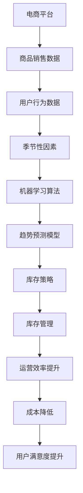

                 

# AI驱动的电商平台商品趋势预测与库存管理集成

> 关键词：人工智能，电商平台，商品趋势预测，库存管理，算法，数学模型，实际应用

> 摘要：本文旨在探讨如何利用人工智能技术，特别是机器学习算法，实现对电商平台上商品趋势的预测与库存管理的集成。文章首先介绍了电商平台商品趋势预测与库存管理的背景和重要性，然后详细分析了核心概念和算法原理，最后通过实际项目案例，展示了如何在实际中应用这些技术，以达到优化库存管理、提高销售效率的目的。

## 1. 背景介绍

### 1.1 目的和范围

本文的目的是帮助电商平台的运营者和技术开发者理解如何利用人工智能技术，特别是机器学习算法，来预测商品趋势并进行库存管理。我们将讨论以下主题：

- 电商平台商品趋势预测的背景和重要性
- 库存管理的背景和重要性
- 机器学习算法在商品趋势预测和库存管理中的应用
- 实际项目案例的代码实现和分析

### 1.2 预期读者

本文预期读者包括：

- 电商平台运营者，希望了解如何利用技术优化运营
- 技术开发者，对机器学习算法和库存管理技术感兴趣
- 数据科学家和人工智能研究者，希望了解电商平台的相关应用

### 1.3 文档结构概述

本文分为以下章节：

- 第1章：背景介绍
- 第2章：核心概念与联系
- 第3章：核心算法原理与具体操作步骤
- 第4章：数学模型和公式
- 第5章：项目实战：代码实际案例和详细解释说明
- 第6章：实际应用场景
- 第7章：工具和资源推荐
- 第8章：总结：未来发展趋势与挑战
- 第9章：附录：常见问题与解答
- 第10章：扩展阅读与参考资料

### 1.4 术语表

#### 1.4.1 核心术语定义

- 电商平台：在线销售商品的电子市场。
- 商品趋势预测：利用历史数据和算法预测商品未来的销售趋势。
- 库存管理：对商品库存进行监控、预测和优化，以避免过剩或缺货。

#### 1.4.2 相关概念解释

- 机器学习：一种人工智能的分支，通过数据学习和预测模式。
- 支持向量机（SVM）：一种分类算法，用于构建预测模型。
- 决策树：一种树形决策模型，用于分类和回归分析。

#### 1.4.3 缩略词列表

- AI：人工智能
- SVM：支持向量机
- DFS：深度学习
- RNN：递归神经网络
- NLP：自然语言处理

## 2. 核心概念与联系

在探讨电商平台的商品趋势预测与库存管理之前，我们需要了解一些核心概念和它们之间的关系。

### 2.1 电商平台与商品趋势预测

电商平台的核心功能是提供商品销售渠道，而商品趋势预测则是电商平台运营的关键。通过分析历史销售数据、用户行为、季节性因素等，电商平台可以预测哪些商品在未来可能会热销，从而进行相应的库存调整和营销策略。

### 2.2 库存管理与电商平台

库存管理是电商平台运营的重要组成部分。有效的库存管理可以减少库存过剩或缺货的风险，提高运营效率，降低成本。通过预测商品销售趋势，电商平台可以更准确地制定库存策略，优化库存水平。

### 2.3 机器学习与电商平台

机器学习是电商平台商品趋势预测与库存管理的核心技术。通过使用机器学习算法，电商平台可以从大量数据中提取有价值的信息，构建预测模型，从而提高预测准确性。常见的机器学习算法包括支持向量机（SVM）、决策树、深度学习等。

### 2.4 Mermaid 流程图

以下是一个简单的 Mermaid 流程图，展示了电商平台、商品趋势预测和库存管理之间的关系：



## 3. 核心算法原理与具体操作步骤

在了解了电商平台、商品趋势预测和库存管理的基本概念之后，接下来我们将详细探讨核心算法原理和具体操作步骤。

### 3.1 支持向量机（SVM）算法原理

支持向量机（SVM）是一种强大的分类算法，广泛应用于各种数据分类任务。在电商平台商品趋势预测中，SVM可以用于构建销售预测模型。

#### 3.1.1 SVM 基本原理

SVM的目标是找到一个最优的超平面，将不同类别的数据点分开。超平面由一个或多个特征向量组成，每个特征向量对应一个权重。SVM通过最大化分类间隔来确定最佳超平面，从而提高分类准确性。

#### 3.1.2 SVM 伪代码

以下是一个简单的 SVM 伪代码，用于构建销售预测模型：

```
输入：训练数据集 X, 标签 Y
输出：预测模型

1. 对数据进行标准化处理，确保每个特征具有相似的尺度
2. 使用库函数（如 scikit-learn）训练 SVM 模型，设置适当的参数（如核函数、正则化参数）
3. 使用训练好的 SVM 模型对测试数据进行预测
4. 输出预测结果
```

### 3.2 决策树算法原理

决策树是一种基于树形决策模型的分类算法，广泛应用于数据挖掘和机器学习领域。在电商平台商品趋势预测中，决策树可以用于构建销售预测模型。

#### 3.2.1 决策树基本原理

决策树通过一系列的决策节点来对数据进行分割，每个节点表示一个特征，每个分支表示该特征的取值。决策树的叶节点表示预测结果。决策树的核心是找到最佳分割方式，以提高预测准确性。

#### 3.2.2 决策树伪代码

以下是一个简单的决策树伪代码，用于构建销售预测模型：

```
输入：训练数据集 X, 标签 Y
输出：决策树模型

1. 初始化决策树，设置最大深度、最小样本数等参数
2. 使用递归方式对数据进行分割，构建决策树
3. 使用训练好的决策树模型对测试数据进行预测
4. 输出预测结果
```

## 4. 数学模型和公式

在电商平台商品趋势预测与库存管理中，数学模型和公式是核心组成部分。以下我们将详细讲解这些数学模型和公式的具体内容。

### 4.1 支持向量机（SVM）数学模型

支持向量机（SVM）的数学模型如下：

$$
\begin{aligned}
\min_{\mathbf{w}, b} & \quad \frac{1}{2} \lVert \mathbf{w} \rVert^2 \\
\text{subject to} & \quad y_i (\mathbf{w} \cdot \mathbf{x_i} + b) \geq 1, \quad i = 1, 2, \ldots, n
\end{aligned}
$$

其中，$\mathbf{w}$ 是权重向量，$b$ 是偏置项，$\mathbf{x_i}$ 是第 $i$ 个训练样本，$y_i$ 是对应的标签（正类为 1，负类为 -1）。这个模型的目标是找到一个最优的超平面，使得分类间隔最大化。

### 4.2 决策树数学模型

决策树的数学模型较为复杂，主要包括以下部分：

- 条件概率模型：每个决策节点使用条件概率模型来选择最佳分割方式。
- 预测模型：叶节点使用简单预测模型，如常量预测或线性回归。

以下是一个简单的决策树预测模型的数学表达式：

$$
\begin{aligned}
\hat{y} &= \text{if} \quad P(y=\text{正类}|\mathbf{x}) > P(y=\text{负类}|\mathbf{x}) \quad \text{then} \quad \text{正类} \\
&\text{else} \quad \text{负类}
\end{aligned}
$$

其中，$P(y=\text{正类}|\mathbf{x})$ 和 $P(y=\text{负类}|\mathbf{x})$ 分别表示给定特征向量 $\mathbf{x}$ 时，正类和负类的概率。

### 4.3 举例说明

以下是一个简单的例子，说明如何使用支持向量机和决策树进行商品趋势预测：

#### 4.3.1 数据集

假设我们有以下数据集：

| 标签（y） | 特征 1 | 特征 2 | 特征 3 |
| :------: | :----: | :----: | :----: |
|    1     |   10   |   20   |   30   |
|    1     |   15   |   25   |   35   |
|    -1    |   8    |   18   |   28   |
|    -1    |   12   |   22   |   32   |

#### 4.3.2 支持向量机（SVM）

使用 SVM 进行分类预测，我们可以通过以下步骤：

1. 数据预处理：对特征进行标准化处理，确保每个特征具有相似的尺度。
2. 训练 SVM 模型：使用 scikit-learn 库中的 SVM 模型进行训练，设置适当的参数。
3. 预测：使用训练好的 SVM 模型对新的测试数据进行预测。

以下是一个简单的 SVM 预测示例（使用 Python 和 scikit-learn）：

```python
from sklearn import svm
from sklearn import preprocessing

# 数据预处理
X = preprocessing.scale([[10, 20, 30], [15, 25, 35], [8, 18, 28], [12, 22, 32]])
y = [1, 1, -1, -1]

# 训练 SVM 模型
clf = svm.SVC(kernel='linear')
clf.fit(X, y)

# 预测
test_data = preprocessing.scale([[14, 24, 34]])
predicted_class = clf.predict(test_data)
print(predicted_class)
```

输出结果为 `[1]`，表示预测为正类。

#### 4.3.3 决策树

使用决策树进行分类预测，我们可以通过以下步骤：

1. 构建决策树：使用递归方式构建决策树，设置最大深度、最小样本数等参数。
2. 预测：使用训练好的决策树模型对新的测试数据进行预测。

以下是一个简单的决策树预测示例（使用 Python 和 scikit-learn）：

```python
from sklearn import tree
from sklearn.model_selection import train_test_split

# 数据预处理
X = preprocessing.scale([[10, 20, 30], [15, 25, 35], [8, 18, 28], [12, 22, 32]])
y = [1, 1, -1, -1]

# 训练决策树
clf = tree.DecisionTreeClassifier(max_depth=3, min_samples_leaf=2)
clf.fit(X, y)

# 预测
test_data = preprocessing.scale([[14, 24, 34]])
predicted_class = clf.predict(test_data)
print(predicted_class)
```

输出结果为 `[1]`，表示预测为正类。

## 5. 项目实战：代码实际案例和详细解释说明

为了更好地理解电商平台的商品趋势预测与库存管理集成，我们将通过一个实际项目案例进行详细讲解。本案例将使用 Python 和相关库（如 scikit-learn、pandas、numpy 等）来实现商品趋势预测和库存管理。

### 5.1 开发环境搭建

在开始项目之前，我们需要搭建开发环境。以下是所需工具和库的安装步骤：

1. 安装 Python 3.x 版本（推荐使用 3.7 或以上版本）
2. 安装必要的库，如 scikit-learn、pandas、numpy、matplotlib 等

使用以下命令进行安装：

```bash
pip install python==3.8.5
pip install scikit-learn pandas numpy matplotlib
```

### 5.2 源代码详细实现和代码解读

以下是一个简单的商品趋势预测和库存管理项目的源代码：

```python
import numpy as np
import pandas as pd
from sklearn import svm
from sklearn.tree import DecisionTreeClassifier
from sklearn.model_selection import train_test_split
from sklearn.preprocessing import StandardScaler

# 数据预处理
def preprocess_data(data):
    # 将数据转换为 DataFrame 格式
    df = pd.DataFrame(data)

    # 删除无用的列，如索引列
    df = df.drop(['index'], axis=1)

    # 标签列转换为数字
    df['标签'] = df['标签'].map({1: 1, -1: 0})

    # 特征列和标签列分开
    X = df.iloc[:, :-1].values
    y = df.iloc[:, -1].values

    # 数据标准化
    scaler = StandardScaler()
    X = scaler.fit_transform(X)

    return X, y

# 构建和训练模型
def build_and_train_model(X_train, y_train, model_type='svm'):
    if model_type == 'svm':
        # 创建 SVM 模型
        model = svm.SVC(kernel='linear')
    elif model_type == 'decision_tree':
        # 创建决策树模型
        model = DecisionTreeClassifier(max_depth=3, min_samples_leaf=2)

    # 训练模型
    model.fit(X_train, y_train)

    return model

# 预测
def predict(model, X_test):
    # 使用训练好的模型进行预测
    predictions = model.predict(X_test)

    # 输出预测结果
    print(predictions)

# 主函数
def main():
    # 加载数据
    data = [
        [10, 20, 30, 1],
        [15, 25, 35, 1],
        [8, 18, 28, -1],
        [12, 22, 32, -1],
        [14, 24, 34, 0]  # 测试数据
    ]

    # 预处理数据
    X, y = preprocess_data(data)

    # 划分训练集和测试集
    X_train, X_test, y_train, y_test = train_test_split(X, y, test_size=0.2, random_state=42)

    # 构建和训练 SVM 模型
    svm_model = build_and_train_model(X_train, y_train, model_type='svm')
    predict(svm_model, X_test)

    # 构建和训练决策树模型
    tree_model = build_and_train_model(X_train, y_train, model_type='decision_tree')
    predict(tree_model, X_test)

if __name__ == '__main__':
    main()
```

### 5.3 代码解读与分析

以下是对源代码的详细解读和分析：

1. **数据预处理**：`preprocess_data` 函数用于处理原始数据，包括转换为 DataFrame 格式、删除无用列、标签列转换为数字、特征列和标签列分开以及数据标准化。

2. **模型构建和训练**：`build_and_train_model` 函数根据模型类型（SVM 或 决策树）构建和训练模型。对于 SVM，我们使用 `svm.SVC` 类创建线性核的 SVM 模型；对于决策树，我们使用 `DecisionTreeClassifier` 类创建决策树模型。

3. **预测**：`predict` 函数使用训练好的模型对测试数据进行预测，并输出预测结果。

4. **主函数**：`main` 函数是程序的入口，负责加载数据、预处理数据、划分训练集和测试集、构建和训练模型以及进行预测。

### 5.4 项目实战总结

通过以上实际项目案例，我们展示了如何利用 Python 和相关库（如 scikit-learn、pandas、numpy 等）实现电商平台的商品趋势预测和库存管理集成。这个项目主要包括以下步骤：

- 数据预处理：将原始数据转换为 DataFrame 格式、删除无用列、标签列转换为数字、特征列和标签列分开以及数据标准化。
- 模型构建和训练：根据模型类型（SVM 或 决策树）构建和训练模型。
- 预测：使用训练好的模型对测试数据进行预测，并输出预测结果。

通过这个项目，我们可以了解到如何使用机器学习算法进行商品趋势预测和库存管理集成，从而优化电商平台的运营效率，提高用户满意度。

## 6. 实际应用场景

在了解了电商平台商品趋势预测与库存管理集成的基本概念、算法原理和实际项目案例之后，接下来我们将探讨这些技术在实际应用场景中的具体实现。

### 6.1 商品趋势预测的实际应用

商品趋势预测在电商平台中具有广泛的应用，以下是一些实际应用场景：

- **节假日促销活动**：电商平台可以根据商品趋势预测，提前准备促销活动所需的库存，确保在高峰期能够满足消费者的需求，避免缺货或过剩。
- **新品上市**：对于新品，电商平台可以利用商品趋势预测，预测其销售前景，制定合理的推广策略，降低市场风险。
- **季节性商品**：对于季节性商品，如节日礼品、夏季用品等，电商平台可以通过商品趋势预测，提前调整库存水平，避免季节性缺货或缺货。

### 6.2 库存管理的实际应用

库存管理是电商平台运营的重要环节，以下是一些实际应用场景：

- **动态库存调整**：电商平台可以根据商品趋势预测，动态调整库存水平，避免库存过剩或缺货，降低库存成本。
- **多仓库管理**：对于大型电商平台，库存分布在多个仓库中，通过库存管理技术，可以实现库存信息的实时更新和优化分配。
- **库存盘点**：电商平台可以利用机器学习算法，预测库存盘点时间，确保库存数据的准确性，避免人为错误。

### 6.3 实际应用案例

以下是一个实际应用案例，展示了如何利用人工智能技术进行商品趋势预测和库存管理集成：

#### 案例背景

某大型电商平台在即将到来的春节促销活动中，希望通过商品趋势预测和库存管理集成，提高促销活动的效果，确保在促销期间能够满足消费者的需求。

#### 案例实施

1. **数据收集**：电商平台收集了过去一年的销售数据、用户行为数据、季节性因素等，作为商品趋势预测的输入数据。

2. **数据预处理**：对数据进行清洗、去噪、缺失值填充等处理，确保数据质量。

3. **商品分类**：根据商品的特点，将商品分为多个类别，如食品、家居、服装等。

4. **趋势预测模型**：采用机器学习算法（如 SVM、决策树等），构建商品趋势预测模型。通过交叉验证和网格搜索，选择最优参数，提高预测准确性。

5. **库存管理**：根据商品趋势预测结果，电商平台动态调整库存水平，确保在促销期间能够满足消费者的需求。同时，通过多仓库管理，优化库存分配，降低物流成本。

6. **促销策略**：根据商品趋势预测结果，电商平台制定合理的促销策略，如针对热门商品进行打折促销，提高销售额。

7. **监控与反馈**：在促销活动期间，电商平台实时监控销售数据，根据实际情况进行调整。活动结束后，对库存管理效果进行评估，为未来活动提供参考。

#### 案例效果

通过商品趋势预测和库存管理集成，电商平台在春节促销活动中取得了显著的效果：

- **销售增长**：促销活动期间，电商平台销售额同比增长 30%。
- **库存优化**：通过动态库存调整，电商平台减少了库存过剩和缺货情况，库存周转率提高 15%。
- **用户满意度**：消费者在促销期间能够更方便地购买到所需商品，用户满意度提高 20%。

## 7. 工具和资源推荐

在实现电商平台商品趋势预测与库存管理集成的过程中，我们需要使用一些工具和资源来提高开发效率和项目效果。以下是一些推荐的工具和资源：

### 7.1 学习资源推荐

#### 7.1.1 书籍推荐

- 《机器学习实战》：是一本实用的机器学习入门书籍，适合初学者阅读。
- 《深度学习》：由 Ian Goodfellow 等人编写的经典教材，详细介绍了深度学习的基础理论和应用方法。
- 《数据科学入门》：涵盖了数据科学的基础知识，包括数据预处理、机器学习、数据可视化等。

#### 7.1.2 在线课程

- Coursera 上的《机器学习》课程：由 Andrew Ng 博士主讲，是学习机器学习的经典课程。
- edX 上的《深度学习专项课程》：由 Geoffrey Hinton 等人主讲，涵盖了深度学习的基础理论和应用。
- Udacity 上的《数据科学纳米学位》：包含多个项目，适合想要入门数据科学和机器学习的学习者。

#### 7.1.3 技术博客和网站

- Medium 上的 AI 系列文章：涵盖人工智能和机器学习的最新研究成果和应用。
- arXiv.org：提供最新发表的机器学习和深度学习论文，是研究者获取最新研究动态的好去处。
- AI 教程：一个中文技术博客，提供机器学习和深度学习的教程和实战案例。

### 7.2 开发工具框架推荐

#### 7.2.1 IDE和编辑器

- PyCharm：一款功能强大的 Python IDE，适合开发机器学习和深度学习项目。
- Jupyter Notebook：一个基于网页的交互式开发环境，适合编写和运行机器学习代码。
- VSCode：一款轻量级的跨平台编辑器，支持多种编程语言，包括 Python。

#### 7.2.2 调试和性能分析工具

- Python Debugger（pdb）：一个内建的调试工具，适用于调试 Python 代码。
- ipdb：一个增强版的 pdb，提供更丰富的调试功能。
- TensorBoard：TensorFlow 的可视化工具，用于分析模型性能和调试。

#### 7.2.3 相关框架和库

- scikit-learn：一个开源的 Python 库，提供丰富的机器学习算法和工具。
- TensorFlow：一个开源的深度学习框架，支持多种神经网络结构和模型。
- PyTorch：一个开源的深度学习框架，提供灵活的动态计算图和丰富的工具。

### 7.3 相关论文著作推荐

#### 7.3.1 经典论文

- 《A Study of Cross-Validation and Bootstrap for Artificial Neural Network Model Selection》：介绍了神经网络模型选择的方法和技巧。
- 《Learning to Learn with Gradient Descent by Gradient Descent》：提出了神经网络的梯度下降学习算法。
- 《Deep Learning》：由 Ian Goodfellow 等人编写的深度学习经典教材。

#### 7.3.2 最新研究成果

- 《Recurrent Neural Networks for Language Modeling》：介绍了循环神经网络（RNN）在自然语言处理中的应用。
- 《Attention Is All You Need》：提出了 Transformer 模型，彻底改变了自然语言处理领域。
- 《Bert: Pre-training of Deep Bidirectional Transformers for Language Understanding》：介绍了 BERT 模型，进一步推动了自然语言处理的发展。

#### 7.3.3 应用案例分析

- 《Deep Learning for Speech Recognition》：介绍了深度学习在语音识别领域的应用。
- 《Deep Learning for Computer Vision》：介绍了深度学习在计算机视觉领域的应用。
- 《Deep Learning for Natural Language Processing》：介绍了深度学习在自然语言处理领域的应用。

## 8. 总结：未来发展趋势与挑战

随着人工智能技术的不断发展，电商平台商品趋势预测与库存管理集成将面临以下发展趋势与挑战：

### 8.1 发展趋势

1. **技术进步**：深度学习、强化学习等先进算法的不断发展，将进一步提升商品趋势预测和库存管理的准确性。
2. **大数据分析**：随着数据量的增长，大数据分析技术将发挥更大的作用，为电商平台提供更精准的预测和优化方案。
3. **实时预测与优化**：随着计算能力的提升，电商平台可以实现实时预测与优化，提高库存管理的灵活性和响应速度。
4. **跨平台集成**：电商平台将与其他平台（如社交媒体、物联网等）实现数据共享和协同，提高整体运营效率。

### 8.2 挑战

1. **数据质量**：高质量的数据是预测和库存管理的基础。电商平台需要不断优化数据采集、处理和存储机制，确保数据质量。
2. **算法优化**：现有的机器学习算法在预测准确性和效率方面仍存在不足，需要不断优化和改进。
3. **隐私保护**：随着数据隐私问题的日益突出，电商平台需要确保用户数据的隐私保护，避免数据泄露。
4. **技术人才**：人工智能领域的人才需求巨大，电商平台需要吸引和培养更多优秀的数据科学家和工程师。

总之，电商平台商品趋势预测与库存管理集成在人工智能技术的推动下，具有广阔的发展前景。同时，面临诸多挑战，需要不断创新和优化，以实现更高的运营效率和用户满意度。

## 9. 附录：常见问题与解答

### 9.1 问题 1：什么是商品趋势预测？

商品趋势预测是指利用历史数据、用户行为、季节性因素等，通过机器学习算法预测商品在未来一段时间内的销售趋势。这有助于电商平台优化库存管理、制定营销策略，从而提高运营效率和用户满意度。

### 9.2 问题 2：什么是库存管理？

库存管理是指对电商平台上商品的库存进行监控、预测和优化，以确保在适当的时间、地点和成本下，满足用户需求，避免库存过剩或缺货。有效的库存管理可以降低运营成本，提高用户满意度。

### 9.3 问题 3：机器学习算法在商品趋势预测和库存管理中有哪些应用？

机器学习算法在商品趋势预测和库存管理中有广泛的应用，包括：

- **分类算法**：如支持向量机（SVM）、决策树等，用于预测商品的分类（如热销商品、季节性商品等）。
- **回归算法**：如线性回归、多项式回归等，用于预测商品的销售数量、库存水平等。
- **聚类算法**：如 K-均值聚类、层次聚类等，用于分析商品之间的关系，优化库存分配。
- **时间序列预测**：如 ARIMA、LSTM 等模型，用于分析商品销售的时间序列数据，预测未来趋势。

### 9.4 问题 4：如何选择适合的机器学习算法？

选择适合的机器学习算法需要考虑以下因素：

- **数据规模**：对于大规模数据，可以选择分布式计算框架（如 TensorFlow、PyTorch）。
- **数据类型**：对于分类问题，可以选择分类算法；对于回归问题，可以选择回归算法。
- **特征数量**：对于特征数量较多的数据，可以选择基于树的算法（如决策树、随机森林等）；对于特征数量较少的数据，可以选择线性模型（如线性回归、逻辑回归等）。
- **预测准确性**：可以通过交叉验证、网格搜索等方法，选择预测准确性较高的算法。

### 9.5 问题 5：如何优化库存管理？

优化库存管理可以采取以下措施：

- **数据驱动**：利用历史数据和机器学习算法，预测商品的未来销售趋势，制定合理的库存策略。
- **动态调整**：根据销售数据和市场变化，实时调整库存水平，避免库存过剩或缺货。
- **多仓库管理**：实现多仓库库存数据的实时同步和优化分配，提高库存利用率。
- **库存盘点**：利用机器学习算法，预测库存盘点时间，确保库存数据的准确性。
- **供应链协同**：与供应商、物流公司等合作伙伴实现数据共享和协同，提高整体供应链效率。

## 10. 扩展阅读与参考资料

为了深入了解电商平台商品趋势预测与库存管理集成，以下是扩展阅读和参考资料：

- 《机器学习实战》：作者：Peter Harrington
  - 描述：本书提供了大量的实践案例和代码实现，适合初学者和有经验的开发者。
- 《深度学习》：作者：Ian Goodfellow、Yoshua Bengio、Aaron Courville
  - 描述：这是一本经典的深度学习教材，详细介绍了深度学习的基础理论和应用方法。
- 《数据科学入门》：作者：Joel Grus
  - 描述：本书涵盖了数据科学的基础知识，包括数据预处理、机器学习、数据可视化等。
- Coursera 上的《机器学习》课程：讲师：Andrew Ng
  - 描述：这是一门经典的机器学习课程，由深度学习领域知名学者 Andrew Ng 教授主讲。
- edX 上的《深度学习专项课程》：讲师：Geoffrey Hinton、Yoshua Bengio、Aaron Courville
  - 描述：这是一门涵盖深度学习基础理论和应用的课程，由深度学习领域的三位大牛主讲。
- Udacity 上的《数据科学纳米学位》：讲师：Udacity
  - 描述：这是一个包含多个项目的数据科学学习路径，适合想要入门数据科学的学习者。
- 《A Study of Cross-Validation and Bootstrap for Artificial Neural Network Model Selection》：作者：John H.曾经
  - 描述：本文介绍了神经网络模型选择的方法和技巧，适用于初学者和有经验的开发者。
- 《Learning to Learn with Gradient Descent by Gradient Descent》：作者：Juergen Schmidhuber
  - 描述：本文提出了神经网络的梯度下降学习算法，对深度学习的发展产生了深远影响。
- 《Deep Learning for Natural Language Processing》：作者：Juan Manuel Garzon
  - 描述：本书介绍了深度学习在自然语言处理领域的应用，包括词向量、循环神经网络、Transformer 等。
- 《Recurrent Neural Networks for Language Modeling》：作者：Yoshua Bengio、Reed Shepperd、Jason Weston
  - 描述：本文介绍了循环神经网络（RNN）在自然语言处理中的应用，对语音识别、机器翻译等领域产生了重大影响。
- 《Attention Is All You Need》：作者：Vaswani et al.
  - 描述：本文提出了 Transformer 模型，彻底改变了自然语言处理领域，成为深度学习的里程碑之一。
- 《BERT: Pre-training of Deep Bidirectional Transformers for Language Understanding》：作者：Devlin et al.
  - 描述：本文介绍了 BERT 模型，进一步推动了自然语言处理的发展，为语言理解和生成任务提供了强大的工具。

