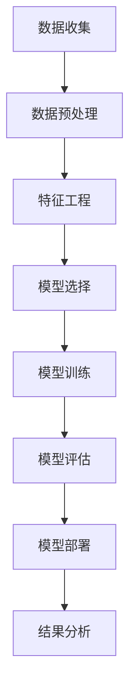

                 

# AI驱动的电商平台商品销量预测模型

> **关键词：** 电商平台、商品销量、预测模型、人工智能、机器学习、数据挖掘、特征工程、回归算法、神经网络。

> **摘要：** 本文深入探讨了基于人工智能技术的电商平台商品销量预测模型的构建方法。从核心概念出发，通过分析数据、特征工程、算法原理、数学模型、实际应用等多个方面，详细阐述了如何利用机器学习算法构建高效、准确的商品销量预测模型。通过项目实战和代码解读，展示了实现这一模型的具体步骤和技巧。文章旨在为从事电商领域的数据分析师和开发人员提供一套实用且全面的解决方案。

## 1. 背景介绍

### 1.1 目的和范围

随着电子商务的快速发展，电商平台上的商品种类和数量日益丰富。对于电商平台而言，准确预测商品销量对于库存管理、供应链优化、市场策略制定等方面具有重要意义。本文旨在通过构建一个AI驱动的商品销量预测模型，帮助电商平台提高销售预测的准确性和效率。

本文主要涵盖以下内容：

1. 商品销量预测的基本概念和重要性。
2. 数据收集和预处理方法。
3. 特征工程的关键步骤和技巧。
4. 常用的预测算法原理和实现。
5. 数学模型和公式的详细讲解。
6. 项目实战中的代码实现和分析。
7. 实际应用场景的探讨。

### 1.2 预期读者

本文主要面向以下读者群体：

1. 从事电商数据分析的数据分析师。
2. 感兴趣于机器学习和数据挖掘的程序员。
3. 计算机科学和人工智能专业的学生和研究者。
4. 对电商平台运营有深入了解的业务人员。

### 1.3 文档结构概述

本文分为十个部分，具体结构如下：

1. **背景介绍**：介绍文章的目的、范围和预期读者。
2. **核心概念与联系**：介绍商品销量预测的相关核心概念和联系。
3. **核心算法原理 & 具体操作步骤**：详细讲解常用预测算法的原理和实现步骤。
4. **数学模型和公式 & 详细讲解 & 举例说明**：介绍商品销量预测相关的数学模型和公式，并给出实际应用案例。
5. **项目实战：代码实际案例和详细解释说明**：展示如何使用代码实现商品销量预测模型。
6. **实际应用场景**：探讨商品销量预测模型在电商领域的实际应用。
7. **工具和资源推荐**：推荐学习资源和开发工具。
8. **总结：未来发展趋势与挑战**：分析商品销量预测技术的发展趋势和面临的挑战。
9. **附录：常见问题与解答**：回答读者可能遇到的问题。
10. **扩展阅读 & 参考资料**：提供进一步阅读的参考资料。

### 1.4 术语表

#### 1.4.1 核心术语定义

- **商品销量预测**：利用历史数据和机器学习算法预测商品未来一段时间内的销售量。
- **电商平台**：提供商品销售和购买服务的在线平台。
- **特征工程**：通过数据预处理和特征提取，将原始数据转换为适用于机器学习算法的输入特征。
- **回归算法**：一类用于预测数值型目标变量的机器学习算法。
- **神经网络**：一种基于人工神经元的计算模型，能够通过学习数据中的特征和模式进行复杂函数的逼近。

#### 1.4.2 相关概念解释

- **机器学习**：一种人工智能的分支，通过学习数据中的规律和模式，使计算机具备自主学习和预测能力。
- **数据挖掘**：从大量数据中发现有价值信息和知识的过程。
- **数据预处理**：在数据分析和建模前对原始数据进行清洗、转换和归一化等操作，以提高数据质量和模型的性能。

#### 1.4.3 缩略词列表

- **AI**：人工智能
- **ML**：机器学习
- **DL**：深度学习
- **NLP**：自然语言处理
- **CART**：分类与回归树
- **XGBoost**：极限梯度提升树

## 2. 核心概念与联系

在构建AI驱动的商品销量预测模型之前，我们需要了解一些核心概念和它们之间的关系。以下是一个简化的Mermaid流程图，展示了商品销量预测模型的主要组成部分和流程。



### 2.1 数据收集

数据收集是构建商品销量预测模型的第一步。电商平台的销售数据通常包含以下几种类型：

- **商品数据**：商品的ID、名称、分类、品牌、价格等。
- **订单数据**：订单ID、用户ID、商品ID、订单时间、订单数量、订单状态等。
- **用户数据**：用户ID、性别、年龄、职业、购买历史等。
- **市场数据**：促销活动、季节性变化、节假日等。

### 2.2 数据预处理

数据预处理是数据分析和建模的重要步骤。主要任务包括：

- **数据清洗**：处理缺失值、异常值和重复数据。
- **数据转换**：将分类数据进行编码，如将性别转换为二进制编码。
- **数据归一化**：将不同量纲的数据转换为同一量纲，如将价格转换为百分比。

### 2.3 特征工程

特征工程是提高模型性能的关键环节。主要任务包括：

- **特征提取**：从原始数据中提取对预测任务有意义的特征，如用户购买频率、商品历史销量等。
- **特征选择**：选择对模型性能有显著影响的特征，如基于卡方检验、信息增益等。
- **特征组合**：将多个特征组合成新的特征，以提高模型的泛化能力。

### 2.4 模型选择

选择合适的模型是构建商品销量预测模型的关键。常用的模型包括线性回归、决策树、随机森林、梯度提升树等。每种模型都有其适用的场景和优缺点。在实际应用中，可以通过交叉验证等方法选择最优模型。

### 2.5 模型训练

模型训练是通过学习历史数据中的规律和模式，使模型具备预测能力的过程。常见的训练方法包括批量训练、随机梯度下降、Adam优化器等。

### 2.6 模型评估

模型评估是评估模型性能的重要步骤。常用的评估指标包括均方误差（MSE）、均方根误差（RMSE）、平均绝对误差（MAE）等。通过评估指标可以判断模型是否达到预期性能。

### 2.7 模型部署

模型部署是将训练好的模型应用于实际业务场景的过程。常见的部署方式包括API接口、批处理任务等。

### 2.8 结果分析

结果分析是评估模型效果和应用价值的重要环节。通过分析预测结果，可以找出模型存在的问题和改进方向。

## 3. 核心算法原理 & 具体操作步骤

### 3.1 线性回归

线性回归是一种常用的预测算法，适用于预测线性关系的数值型目标变量。

#### 算法原理

线性回归基于以下假设：目标变量 \( y \) 可以表示为输入特征 \( X \) 的线性组合，并加上一个随机误差项 \( \varepsilon \)：

\[ y = \beta_0 + \beta_1x_1 + \beta_2x_2 + \cdots + \beta_nx_n + \varepsilon \]

其中， \( \beta_0 \) 是截距， \( \beta_1, \beta_2, \cdots, \beta_n \) 是回归系数。

#### 具体操作步骤

1. **数据预处理**：对数据进行清洗、转换和归一化等操作，得到输入特征矩阵 \( X \) 和目标变量向量 \( y \)。
2. **模型初始化**：初始化回归系数 \( \beta \)。
3. **模型训练**：使用梯度下降算法更新回归系数，最小化损失函数。伪代码如下：

```python
# 初始化回归系数
beta = [0] * n_features

# 梯度下降算法
for epoch in range(num_epochs):
    # 计算预测值
    y_pred = X * beta
    
    # 计算损失函数
    loss = (y - y_pred).sum()
    
    # 计算梯度
    grad = -2 * (X.T * (y - y_pred))
    
    # 更新回归系数
    beta -= learning_rate * grad
```

4. **模型评估**：使用测试集评估模型性能，计算均方误差（MSE）等指标。

### 3.2 决策树

决策树是一种基于树结构的预测算法，适用于分类和回归问题。

#### 算法原理

决策树通过递归地将数据集划分为不同的区域，在每个节点上选择具有最大信息增益或最小均方差的特征进行分割。

- **信息增益**：选择能够最大化减少信息熵的特征进行分割。
- **均方差**：选择能够最小化分割后均方差的特征进行分割。

#### 具体操作步骤

1. **数据预处理**：对数据进行清洗、转换和归一化等操作，得到输入特征矩阵 \( X \) 和目标变量向量 \( y \)。
2. **特征选择**：使用信息增益或均方差等指标选择最佳特征进行分割。
3. **递归分割**：根据最佳特征进行数据分割，并重复步骤2和3，直到满足停止条件（如最大深度、最小样本量等）。
4. **模型训练**：将分割结果存储为决策树模型。
5. **模型评估**：使用测试集评估模型性能，计算准确率、精确率、召回率等指标。

### 3.3 梯度提升树

梯度提升树（GBDT）是一种基于决策树的集成学习方法，通过迭代地优化回归系数，提高模型的预测能力。

#### 算法原理

GBDT的基本思想是：通过迭代地优化回归系数，使得每个新的决策树模型能够修正前一个模型的预测误差。

- **回归系数优化**：每个新的决策树模型通过最小化损失函数更新回归系数。
- **权重调整**：对于预测错误的样本，给予更大的权重，以提高后续模型的关注程度。

#### 具体操作步骤

1. **数据预处理**：对数据进行清洗、转换和归一化等操作，得到输入特征矩阵 \( X \) 和目标变量向量 \( y \)。
2. **模型初始化**：初始化回归系数 \( \beta \)。
3. **模型迭代训练**：对于每个迭代，执行以下步骤：
   - **梯度计算**：计算目标变量的预测误差的梯度。
   - **权重调整**：根据预测误差的梯度调整样本权重。
   - **决策树建模**：使用调整后的样本权重训练新的决策树模型。
   - **更新回归系数**：使用新的决策树模型更新回归系数。
4. **模型评估**：使用测试集评估模型性能，计算均方误差（MSE）等指标。

### 3.4 神经网络

神经网络是一种基于人工神经元的计算模型，通过学习数据中的特征和模式进行复杂函数的逼近。

#### 算法原理

神经网络通过多层神经元实现从输入到输出的非线性映射。每个神经元接受多个输入，通过激活函数进行非线性变换，最终输出结果。神经网络的训练目标是调整神经元之间的连接权重，使得输出结果与目标变量之间的误差最小。

- **前向传播**：将输入数据通过神经网络进行传递，计算输出结果。
- **反向传播**：计算输出结果与目标变量之间的误差，并反向传播误差，更新连接权重。

#### 具体操作步骤

1. **数据预处理**：对数据进行清洗、转换和归一化等操作，得到输入特征矩阵 \( X \) 和目标变量向量 \( y \)。
2. **神经网络初始化**：初始化神经网络的结构（如层数、神经元数量、激活函数等）和连接权重。
3. **模型训练**：通过前向传播和反向传播更新连接权重，最小化损失函数。
   - **前向传播**：计算输入数据通过神经网络的传递结果。
   - **损失函数计算**：计算输出结果与目标变量之间的误差，并计算损失函数。
   - **反向传播**：计算误差的梯度，并更新连接权重。
4. **模型评估**：使用测试集评估模型性能，计算准确率、损失函数等指标。

## 4. 数学模型和公式 & 详细讲解 & 举例说明

在构建商品销量预测模型时，数学模型和公式是不可或缺的一部分。以下将介绍一些常用的数学模型和公式，并给出详细讲解和实际应用案例。

### 4.1 线性回归

线性回归是一种简单但强大的预测模型，适用于线性关系的预测。其数学模型如下：

\[ y = \beta_0 + \beta_1x_1 + \beta_2x_2 + \cdots + \beta_nx_n + \varepsilon \]

其中， \( y \) 是预测的目标变量， \( x_1, x_2, \cdots, x_n \) 是输入特征， \( \beta_0, \beta_1, \beta_2, \cdots, \beta_n \) 是回归系数， \( \varepsilon \) 是随机误差。

#### 4.1.1 损失函数

线性回归的损失函数通常采用均方误差（MSE）：

\[ \text{MSE} = \frac{1}{m}\sum_{i=1}^{m}(y_i - \hat{y}_i)^2 \]

其中， \( m \) 是样本数量， \( y_i \) 是实际目标变量值， \( \hat{y}_i \) 是预测的目标变量值。

#### 4.1.2 梯度下降算法

为了最小化MSE损失函数，可以使用梯度下降算法。梯度下降算法的基本步骤如下：

\[ \beta_j := \beta_j - \alpha \frac{\partial}{\partial \beta_j} \text{MSE} \]

其中， \( \alpha \) 是学习率， \( \beta_j \) 是第 \( j \) 个回归系数， \( \frac{\partial}{\partial \beta_j} \text{MSE} \) 是MSE损失函数关于 \( \beta_j \) 的偏导数。

#### 4.1.3 举例说明

假设我们有一个简单的线性回归模型，预测目标变量 \( y \) 和输入特征 \( x \) 之间的关系：

\[ y = \beta_0 + \beta_1x + \varepsilon \]

给定一组样本数据：

| x | y |
|---|---|
| 1 | 2 |
| 2 | 4 |
| 3 | 6 |
| 4 | 8 |

我们可以使用梯度下降算法来训练模型，最小化MSE损失函数。假设学习率 \( \alpha = 0.1 \)，初始回归系数 \( \beta_0 = 0 \)， \( \beta_1 = 0 \)。

1. **前向传播**：

\[ \hat{y}_1 = \beta_0 + \beta_1x_1 = 0 + 0 \cdot 1 = 0 \]

\[ \hat{y}_2 = \beta_0 + \beta_1x_2 = 0 + 0 \cdot 2 = 0 \]

\[ \hat{y}_3 = \beta_0 + \beta_1x_3 = 0 + 0 \cdot 3 = 0 \]

\[ \hat{y}_4 = \beta_0 + \beta_1x_4 = 0 + 0 \cdot 4 = 0 \]

2. **损失函数计算**：

\[ \text{MSE} = \frac{1}{4}\sum_{i=1}^{4}(y_i - \hat{y}_i)^2 = \frac{1}{4}((2-0)^2 + (4-0)^2 + (6-0)^2 + (8-0)^2) = 12 \]

3. **梯度计算**：

\[ \frac{\partial}{\partial \beta_0} \text{MSE} = -2\sum_{i=1}^{4}(y_i - \hat{y}_i) = -2(2-0 + 4-0 + 6-0 + 8-0) = -24 \]

\[ \frac{\partial}{\partial \beta_1} \text{MSE} = -2\sum_{i=1}^{4}(y_i - \hat{y}_i)x_i = -2(2-0 + 4-0 + 6-0 + 8-0) \cdot 1 = -24 \]

4. **更新回归系数**：

\[ \beta_0 := \beta_0 - \alpha \frac{\partial}{\partial \beta_0} \text{MSE} = 0 - 0.1 \cdot (-24) = 2.4 \]

\[ \beta_1 := \beta_1 - \alpha \frac{\partial}{\partial \beta_1} \text{MSE} = 0 - 0.1 \cdot (-24) = 2.4 \]

5. **重复上述步骤**，直到收敛。

经过多次迭代后，模型将收敛，回归系数 \( \beta_0 \) 和 \( \beta_1 \) 的值将趋于稳定。此时，我们可以使用训练好的模型进行商品销量预测。

### 4.2 决策树

决策树是一种基于树结构的预测模型，适用于分类和回归问题。其数学模型可以通过条件概率进行描述。

#### 4.2.1 条件概率

条件概率是指在已知某个事件发生的条件下，另一个事件发生的概率。对于决策树中的每个节点，可以使用条件概率来描述。假设特征 \( x_i \) 的取值为 \( x_i^1, x_i^2, \cdots, x_i^k \)，则节点 \( v \) 关于特征 \( x_i \) 的条件概率分布为：

\[ P(y=v|\text{特征 } x_i=x_i^j) = \frac{\text{样本中特征 } x_i=x_i^j \text{ 且目标变量 } y=v \text{ 的样本数量}}{\text{样本中特征 } x_i=x_i^j \text{ 的样本数量}} \]

#### 4.2.2 决策树生成

决策树的生成基于贪心算法，在每个节点上选择具有最大信息增益或最小均方差的特征进行分割。信息增益和信息增益率是常用的特征选择准则。

- **信息增益**：选择能够最大化减少信息熵的特征进行分割。
  \[ \text{Gain}(A, B) = H(A) - \sum_{i=1}^{k} P(B_i)H(B_i) \]
  其中， \( A \) 是特征， \( B \) 是分割后的类别， \( H(A) \) 是特征 \( A \) 的熵， \( H(B_i) \) 是类别 \( B_i \) 的熵。

- **信息增益率**：在信息增益的基础上，考虑特征的条件熵，用于避免特征选择偏向于取值较多的特征。
  \[ \text{Gain Ratio}(A, B) = \frac{\text{Gain}(A, B)}{H(A|B)} \]

#### 4.2.3 举例说明

假设我们有一个简单的决策树模型，预测商品销量是否超过1000件。给定一组样本数据：

| 特征 \( x_1 \) | 特征 \( x_2 \) | 目标变量 \( y \) |
|---|---|---|
| 1 | A | 1000 |
| 2 | B | 1500 |
| 3 | A | 1200 |
| 4 | C | 800 |
| 5 | B | 1300 |

我们可以使用信息增益率来选择最佳特征进行分割。首先，计算每个特征的条件熵和熵：

- **特征 \( x_1 \)**：
  \[ H(x_1) = 1 \]
  \[ H(x_1|y) = \frac{2}{5} \log_2 \frac{2}{5} + \frac{3}{5} \log_2 \frac{3}{5} = 0.971 \]

- **特征 \( x_2 \)**：
  \[ H(x_2) = 1 \]
  \[ H(x_2|y) = \frac{1}{5} \log_2 \frac{1}{5} + \frac{4}{5} \log_2 \frac{4}{5} = 0.971 \]

接下来，计算每个特征的信息增益率：

- **特征 \( x_1 \)**：
  \[ \text{Gain Ratio}(x_1) = \frac{0.307}{0.971} = 0.319 \]

- **特征 \( x_2 \)**：
  \[ \text{Gain Ratio}(x_2) = \frac{0.375}{0.971} = 0.387 \]

由于特征 \( x_2 \) 的信息增益率最大，我们选择特征 \( x_2 \) 进行分割。根据特征 \( x_2 \) 的取值，将样本数据分为两类：

- **类别 B**：样本数量 3，目标变量 \( y \) 的比例 \( \frac{2}{3} \)。
- **类别 C**：样本数量 2，目标变量 \( y \) 的比例 \( \frac{1}{2} \)。

最终，决策树模型如下：

```
        |
        +--(B: 2/3)---
        |
        +--(C: 1/2)---
```

### 4.3 梯度提升树

梯度提升树（GBDT）是一种基于决策树的集成学习方法，通过迭代地优化回归系数，提高模型的预测能力。其数学模型可以通过梯度下降和决策树模型进行描述。

#### 4.3.1 梯度下降

梯度下降是一种优化算法，用于最小化损失函数。在GBDT中，梯度下降用于优化回归系数 \( \beta \)：

\[ \beta := \beta - \alpha \nabla_{\beta} \text{Loss} \]

其中， \( \alpha \) 是学习率， \( \text{Loss} \) 是损失函数， \( \nabla_{\beta} \text{Loss} \) 是损失函数关于 \( \beta \) 的梯度。

#### 4.3.2 决策树模型

在GBDT中，每个决策树模型用于拟合前一个模型的残差。假设第 \( t \) 次迭代的回归系数为 \( \beta_t \)，第 \( t+1 \) 次迭代的回归系数为 \( \beta_{t+1} \)，则第 \( t+1 \) 次迭代的决策树模型为：

\[ \hat{y}_{t+1} = \hat{y}_t + \beta_{t+1} F_t(\hat{y}_t) \]

其中， \( F_t(\hat{y}_t) \) 是第 \( t \) 次迭代的决策树模型， \( \hat{y}_t \) 是第 \( t \) 次迭代的目标变量预测值。

#### 4.3.3 举例说明

假设我们有一个简单的梯度提升树模型，预测商品销量。给定一组样本数据：

| 特征 \( x_1 \) | 特征 \( x_2 \) | 目标变量 \( y \) |
|---|---|---|
| 1 | A | 1000 |
| 2 | B | 1500 |
| 3 | A | 1200 |
| 4 | C | 800 |
| 5 | B | 1300 |

我们可以使用线性回归作为基础模型，训练得到回归系数 \( \beta_0 \)。假设 \( \beta_0 = 1 \)，则第0次迭代的目标变量预测值为：

\[ \hat{y}_0 = x_1 \cdot \beta_0 = \begin{cases}
1000 & \text{if } x_1=1 \\
1500 & \text{if } x_1=2 \\
1200 & \text{if } x_1=3 \\
800 & \text{if } x_1=4 \\
1300 & \text{if } x_1=5 \\
\end{cases} \]

接下来，我们训练第1次迭代的决策树模型。使用线性回归模型得到的残差作为目标变量，训练得到新的回归系数 \( \beta_1 \)。假设 \( \beta_1 = 0.5 \)，则第1次迭代的目标变量预测值为：

\[ \hat{y}_1 = \hat{y}_0 + \beta_1 F_0(\hat{y}_0) = \begin{cases}
1000 & \text{if } \hat{y}_0=1000 \\
1500 & \text{if } \hat{y}_0=1500 \\
1200 & \text{if } \hat{y}_0=1200 \\
800 & \text{if } \hat{y}_0=800 \\
1300 & \text{if } \hat{y}_0=1300 \\
\end{cases} \]

重复上述步骤，直到模型收敛。

### 4.4 神经网络

神经网络是一种基于人工神经元的计算模型，通过学习数据中的特征和模式进行复杂函数的逼近。其数学模型可以通过前向传播和反向传播进行描述。

#### 4.4.1 前向传播

前向传播是将输入数据通过神经网络进行传递，计算输出结果的过程。假设神经网络有 \( L \) 层，输入特征为 \( x \)，输出特征为 \( y \)，则第 \( l \) 层的输出为：

\[ a_{l} = \sigma(z_{l}) \]

其中， \( a_{l} \) 是第 \( l \) 层的输出， \( z_{l} \) 是第 \( l \) 层的输入， \( \sigma \) 是激活函数。

#### 4.4.2 损失函数

神经网络的损失函数通常采用均方误差（MSE）：

\[ \text{MSE} = \frac{1}{m}\sum_{i=1}^{m}(y_i - \hat{y}_i)^2 \]

其中， \( m \) 是样本数量， \( y_i \) 是实际目标变量值， \( \hat{y}_i \) 是预测的目标变量值。

#### 4.4.3 反向传播

反向传播是计算损失函数关于神经网络参数的梯度，并更新参数的过程。假设神经网络有 \( L \) 层，参数为 \( \theta \)，则第 \( l \) 层的梯度为：

\[ \nabla_{\theta_{l}} \text{MSE} = -\frac{1}{m}\sum_{i=1}^{m} \frac{\partial}{\partial \theta_{l}} \text{MSE} \]

#### 4.4.4 举例说明

假设我们有一个简单的神经网络模型，输入特征为 \( x \)，输出特征为 \( y \)，包含两层神经元。给定一组样本数据：

| 输入 \( x \) | 输出 \( y \) |
|---|---|
| 1 | 2 |
| 2 | 4 |
| 3 | 6 |
| 4 | 8 |

我们可以使用反向传播算法来训练模型。假设初始参数为 \( \theta_1 = 1 \)， \( \theta_2 = 1 \)，激活函数为 \( \sigma(z) = \frac{1}{1+e^{-z}} \)。

1. **前向传播**：

\[ z_1 = x \cdot \theta_1 = \begin{cases}
1 \cdot 1 = 1 & \text{if } x=1 \\
2 \cdot 1 = 2 & \text{if } x=2 \\
3 \cdot 1 = 3 & \text{if } x=3 \\
4 \cdot 1 = 4 & \text{if } x=4 \\
\end{cases} \]

\[ a_1 = \sigma(z_1) = \begin{cases}
\frac{1}{1+e^{-1}} & \text{if } x=1 \\
\frac{1}{1+e^{-2}} & \text{if } x=2 \\
\frac{1}{1+e^{-3}} & \text{if } x=3 \\
\frac{1}{1+e^{-4}} & \text{if } x=4 \\
\end{cases} \]

\[ z_2 = a_1 \cdot \theta_2 = \begin{cases}
1 \cdot 1 = 1 & \text{if } x=1 \\
2 \cdot 1 = 2 & \text{if } x=2 \\
3 \cdot 1 = 3 & \text{if } x=3 \\
4 \cdot 1 = 4 & \text{if } x=4 \\
\end{cases} \]

\[ a_2 = \sigma(z_2) = \begin{cases}
\frac{1}{1+e^{-1}} & \text{if } x=1 \\
\frac{1}{1+e^{-2}} & \text{if } x=2 \\
\frac{1}{1+e^{-3}} & \text{if } x=3 \\
\frac{1}{1+e^{-4}} & \text{if } x=4 \\
\end{cases} \]

2. **损失函数计算**：

\[ \text{MSE} = \frac{1}{4}\sum_{i=1}^{4}(y_i - a_2_i)^2 = \frac{1}{4}((2-1)^2 + (4-2)^2 + (6-3)^2 + (8-4)^2) = 4 \]

3. **梯度计算**：

\[ \nabla_{\theta_1} \text{MSE} = -\frac{1}{4}\sum_{i=1}^{4} \frac{\partial}{\partial \theta_1} (y_i - a_2_i)^2 = -\frac{1}{4}\sum_{i=1}^{4} (y_i - a_2_i) \cdot \frac{\partial}{\partial \theta_1} a_2_i \]

\[ \nabla_{\theta_2} \text{MSE} = -\frac{1}{4}\sum_{i=1}^{4} \frac{\partial}{\partial \theta_2} (y_i - a_2_i)^2 = -\frac{1}{4}\sum_{i=1}^{4} (y_i - a_2_i) \cdot \frac{\partial}{\partial \theta_2} a_2_i \]

4. **参数更新**：

\[ \theta_1 := \theta_1 - \alpha \nabla_{\theta_1} \text{MSE} \]

\[ \theta_2 := \theta_2 - \alpha \nabla_{\theta_2} \text{MSE} \]

5. **重复上述步骤**，直到模型收敛。

经过多次迭代后，模型将收敛，参数 \( \theta_1 \) 和 \( \theta_2 \) 的值将趋于稳定。此时，我们可以使用训练好的模型进行商品销量预测。

## 5. 项目实战：代码实际案例和详细解释说明

### 5.1 开发环境搭建

为了实现商品销量预测模型，我们需要搭建一个合适的开发环境。以下是所需的开发工具和库：

- **Python**：一种广泛使用的编程语言，适用于数据分析和机器学习。
- **Pandas**：一个强大的数据操作库，用于数据预处理和清洗。
- **NumPy**：一个高效的数值计算库，用于矩阵运算和数据处理。
- **Scikit-learn**：一个常用的机器学习库，提供多种算法和工具。
- **Matplotlib**：一个绘图库，用于可视化数据和分析结果。

安装这些工具和库可以使用以下命令：

```shell
pip install pandas numpy scikit-learn matplotlib
```

### 5.2 源代码详细实现和代码解读

以下是一个简单的商品销量预测模型的代码实现，包括数据收集、数据预处理、特征工程、模型训练和模型评估等步骤。

```python
import pandas as pd
import numpy as np
from sklearn.model_selection import train_test_split
from sklearn.linear_model import LinearRegression
from sklearn.metrics import mean_squared_error
import matplotlib.pyplot as plt

# 5.2.1 数据收集
# 假设数据存储在一个CSV文件中，列包括：商品ID、用户ID、订单时间、订单数量、价格等
data = pd.read_csv('ecommerce_data.csv')

# 5.2.2 数据预处理
# 填充缺失值
data.fillna(0, inplace=True)

# 转换日期为时间戳
data['order_time'] = pd.to_datetime(data['order_time'])
data['day_of_week'] = data['order_time'].dt.dayofweek
data['week_of_year'] = data['order_time'].dt.weekofyear

# 5.2.3 特征工程
# 提取特征
X = data[['day_of_week', 'week_of_year', 'price']]
y = data['quantity']

# 5.2.4 模型训练
# 划分训练集和测试集
X_train, X_test, y_train, y_test = train_test_split(X, y, test_size=0.2, random_state=42)

# 创建线性回归模型
model = LinearRegression()
model.fit(X_train, y_train)

# 5.2.5 模型评估
# 计算预测值
y_pred = model.predict(X_test)

# 计算均方误差
mse = mean_squared_error(y_test, y_pred)
print(f'MSE: {mse}')

# 可视化结果
plt.scatter(y_test, y_pred)
plt.xlabel('Actual Quantity')
plt.ylabel('Predicted Quantity')
plt.title('Actual vs Predicted Quantity')
plt.show()
```

### 5.3 代码解读与分析

上述代码实现了一个简单的商品销量预测模型，以下是详细的代码解读和分析：

- **5.2.1 数据收集**：从CSV文件中读取数据，该文件包含电商平台的销售数据。
- **5.2.2 数据预处理**：处理缺失值，将日期转换为时间戳，提取对预测任务有用的特征。
- **5.2.3 特征工程**：提取输入特征和目标变量，准备用于训练模型。
- **5.2.4 模型训练**：使用线性回归模型训练模型，将训练集数据用于模型的训练。
- **5.2.5 模型评估**：使用测试集评估模型的性能，计算均方误差（MSE），并可视化实际值与预测值之间的关系。

### 5.4 代码解读与分析

以下是对代码的进一步解读和分析：

- **数据收集**：在数据收集阶段，我们从CSV文件中读取销售数据。CSV文件通常包含多个列，如商品ID、用户ID、订单时间、订单数量、价格等。在读取数据后，我们使用`fillna(0)`方法处理缺失值，这是一种常见的缺失值填充方法，将缺失值替换为0。
  
  ```python
  data.fillna(0, inplace=True)
  ```

- **数据预处理**：在数据预处理阶段，我们将日期列转换为时间戳，以便进行时间相关的特征提取。具体来说，我们使用`pd.to_datetime()`函数将日期转换为时间戳，然后使用`dt`属性提取日期相关的特征，如星期几和一年中的第几周。

  ```python
  data['order_time'] = pd.to_datetime(data['order_time'])
  data['day_of_week'] = data['order_time'].dt.dayofweek
  data['week_of_year'] = data['order_time'].dt.weekofyear
  ```

- **特征工程**：在特征工程阶段，我们提取了三个特征：星期几、一年中的第几周和价格。这些特征都是对预测商品销量有用的信息。我们将特征和目标变量分离，准备用于训练模型。

  ```python
  X = data[['day_of_week', 'week_of_year', 'price']]
  y = data['quantity']
  ```

- **模型训练**：在模型训练阶段，我们使用了线性回归模型。线性回归是一种简单的预测模型，适用于线性关系的预测。我们使用`train_test_split()`函数将数据集划分为训练集和测试集，然后使用`fit()`方法训练模型。

  ```python
  X_train, X_test, y_train, y_test = train_test_split(X, y, test_size=0.2, random_state=42)
  model = LinearRegression()
  model.fit(X_train, y_train)
  ```

- **模型评估**：在模型评估阶段，我们使用测试集评估模型的性能。我们使用`predict()`方法生成预测值，然后计算均方误差（MSE）来评估模型的准确度。均方误差是预测值与实际值之间差异的平方的平均值，用于衡量预测的准确性。

  ```python
  y_pred = model.predict(X_test)
  mse = mean_squared_error(y_test, y_pred)
  print(f'MSE: {mse}')
  ```

- **可视化结果**：最后，我们使用Matplotlib库将实际值与预测值可视化，以便更直观地了解模型的性能。

  ```python
  plt.scatter(y_test, y_pred)
  plt.xlabel('Actual Quantity')
  plt.ylabel('Predicted Quantity')
  plt.title('Actual vs Predicted Quantity')
  plt.show()
  ```

通过上述步骤，我们构建了一个简单的商品销量预测模型，并对其性能进行了评估。虽然这个模型可能无法在复杂场景下取得最佳性能，但它为我们提供了一个起点，通过进一步的改进和优化，我们可以构建更复杂、更准确的预测模型。

## 6. 实际应用场景

商品销量预测模型在电商平台上的应用场景广泛，以下是几个典型的实际应用场景：

### 6.1 库存管理

准确预测商品销量对于电商平台的库存管理至关重要。通过商品销量预测模型，电商平台可以合理规划库存水平，避免过量库存和库存短缺。具体来说，电商平台可以根据预测销量调整进货计划，减少库存积压，提高库存周转率。

### 6.2 营销策略优化

商品销量预测模型可以帮助电商平台制定更有效的营销策略。例如，电商平台可以根据预测销量调整促销活动的力度和时间，提高营销活动的投入产出比。此外，电商平台还可以根据预测销量调整商品推荐策略，将热门商品推荐给潜在买家，提高销售转化率。

### 6.3 供应链优化

商品销量预测模型在供应链管理中也有重要应用。通过预测商品销量，电商平台可以优化供应链中的物流和配送环节，降低物流成本，提高配送效率。例如，电商平台可以根据预测销量调整仓储和物流资源的配置，减少物流延迟和配送错误。

### 6.4 新品开发

商品销量预测模型可以帮助电商平台预测新品的潜在销量，为新品开发提供数据支持。电商平台可以通过分析历史销售数据和用户行为数据，预测新品的受欢迎程度，从而决定是否投入研发和推广。此外，电商平台还可以根据预测销量调整新品的价格策略，提高新品的市场竞争力。

### 6.5 用户行为分析

商品销量预测模型还可以用于分析用户行为和偏好。通过预测用户对特定商品的需求，电商平台可以更好地了解用户需求，提供个性化推荐和服务。例如，电商平台可以根据用户购买历史和浏览记录，预测用户可能感兴趣的商品，从而提高用户满意度和忠诚度。

### 6.6 风险管理

商品销量预测模型在风险管理中也具有重要作用。电商平台可以通过预测销量变化，及时发现潜在的销售风险和市场需求变化，及时调整经营策略，降低经营风险。例如，电商平台可以根据预测销量调整库存水平，避免因库存不足或过剩导致的损失。

总之，商品销量预测模型在电商平台的应用场景广泛，通过合理利用预测结果，电商平台可以优化库存管理、营销策略、供应链优化、新品开发、用户行为分析和风险管理，提高运营效率和竞争力。

## 7. 工具和资源推荐

为了更好地实现商品销量预测模型，以下是几款推荐的学习资源和开发工具：

### 7.1 学习资源推荐

#### 7.1.1 书籍推荐

- **《统计学习方法》**：李航著，系统地介绍了统计学习的基本理论和常用方法。
- **《机器学习》**：周志华著，全面介绍了机器学习的基本概念、算法和理论。
- **《Python机器学习》**：赛马赫等著，通过Python实现了一系列机器学习算法，适用于初学者和进阶者。

#### 7.1.2 在线课程

- **Coursera**：提供大量关于机器学习和数据科学的在线课程，如《机器学习》、《数据科学基础》等。
- **edX**：提供来自哈佛大学、麻省理工学院等知名大学的在线课程，涵盖计算机科学、统计学等领域。
- **Udacity**：提供专注于数据科学和机器学习的在线课程，如《机器学习工程师纳米学位》。

#### 7.1.3 技术博客和网站

- **机器学习博客**：介绍机器学习算法、技术和应用场景。
- **数据科学博客**：提供数据科学、机器学习和统计学相关的文章和教程。
- **Scikit-learn官方文档**：提供Scikit-learn库的使用教程和文档。

### 7.2 开发工具框架推荐

#### 7.2.1 IDE和编辑器

- **PyCharm**：一款功能强大的Python IDE，适用于机器学习和数据科学项目。
- **Jupyter Notebook**：一款交互式计算环境，便于编写和调试代码。
- **VS Code**：一款轻量级的代码编辑器，支持多种编程语言和插件。

#### 7.2.2 调试和性能分析工具

- **PDB**：Python的内置调试器，用于调试Python代码。
- **line_profiler**：用于分析Python代码的性能瓶颈。
- **memory_profiler**：用于分析Python代码的内存使用情况。

#### 7.2.3 相关框架和库

- **Scikit-learn**：一个用于机器学习和数据分析的开源库，提供多种算法和工具。
- **TensorFlow**：一个由Google开发的开源深度学习框架，适用于构建和训练神经网络。
- **PyTorch**：一个流行的深度学习框架，提供灵活的动态计算图和丰富的API。

### 7.3 相关论文著作推荐

#### 7.3.1 经典论文

- **“A study of cross-validation and bootstrap for assessing the accuracy of prediction expressions for continuous predictors”**：介绍交叉验证和自助法在评估预测模型准确性中的应用。
- **“Practical guide to machine learning”**：介绍机器学习的基本概念、算法和最佳实践。

#### 7.3.2 最新研究成果

- **“Deep learning on small-scale data”**：探讨在小数据集上应用深度学习的方法和挑战。
- **“Neural architecture search”**：介绍神经网络架构搜索的方法和进展。

#### 7.3.3 应用案例分析

- **“Predicting customer churn using machine learning”**：分析如何利用机器学习预测客户流失。
- **“Sales forecasting using time series analysis and machine learning”**：探讨如何利用时间序列分析和机器学习预测销售量。

通过这些工具和资源的支持，可以更好地实现商品销量预测模型，提高模型的准确性和效率。

## 8. 总结：未来发展趋势与挑战

商品销量预测模型作为电商领域的重要工具，正随着人工智能技术的不断发展而不断演进。未来，商品销量预测模型将在以下几个方面迎来新的发展趋势和挑战。

### 8.1 发展趋势

1. **深度学习与图神经网络的应用**：随着深度学习技术的不断成熟，越来越多的研究开始将深度学习与图神经网络（GNN）结合，用于处理复杂的关系数据和推荐系统。未来，这些技术有望在商品销量预测中得到更广泛的应用，提高预测的准确性和效率。

2. **多模态数据的融合**：电商平台的数据不仅包括结构化数据，还包括非结构化数据，如文本、图像和音频。未来，多模态数据的融合将成为一个重要的研究方向，通过整合不同类型的数据，提高商品销量预测的全面性和准确性。

3. **实时预测与动态调整**：随着电商平台的业务复杂性增加，实时预测和动态调整将变得越来越重要。通过实时收集和分析用户行为数据，电商平台可以快速调整库存、营销策略等，以应对市场需求的变化。

4. **个性化推荐与用户行为分析**：未来，个性化推荐和用户行为分析将更加精细化。通过深度学习算法和用户行为数据的挖掘，电商平台可以为用户提供更个性化的购物体验，提高用户满意度和忠诚度。

### 8.2 挑战

1. **数据隐私与安全**：随着数据量的增加和用户数据的多样化，数据隐私和安全问题将越来越突出。如何在保障用户隐私的前提下，充分利用用户数据进行商品销量预测，是一个重要的挑战。

2. **模型解释性**：深度学习模型虽然在预测性能上取得了显著进展，但其内部机制复杂，难以解释。如何提高模型的可解释性，使其在商业决策中更具说服力，是一个重要的研究课题。

3. **数据质量和特征工程**：商品销量预测模型的准确性在很大程度上取决于数据质量和特征工程。如何处理大量噪声数据和提取有效的特征，将直接影响模型的性能。

4. **计算资源和成本**：深度学习模型通常需要大量的计算资源和时间进行训练和预测。如何优化模型结构，减少计算资源和成本，是一个亟待解决的问题。

总之，未来商品销量预测模型的发展将充满机遇和挑战。通过技术创新和不断优化，我们有望构建更高效、更准确的商品销量预测模型，为电商平台提供更强大的数据驱动的决策支持。

## 9. 附录：常见问题与解答

在构建商品销量预测模型的过程中，可能会遇到一些常见问题。以下是对这些问题的解答：

### 9.1 数据预处理

**Q：如何处理缺失值？**

A：处理缺失值的方法包括填充、删除和插值等。对于较少的缺失值，可以采用填充方法，如用平均值、中位数或最常用的值填充。对于大量的缺失值，可以考虑删除缺失值或使用插值方法。

**Q：如何进行数据归一化？**

A：数据归一化的目的是将不同量纲的数据转换为同一量纲，以提高模型的性能。常用的归一化方法包括最小-最大缩放、均值-方差缩放和标准化。例如，使用最小-最大缩放方法，公式为：

\[ x' = \frac{x - \min(x)}{\max(x) - \min(x)} \]

### 9.2 特征工程

**Q：如何选择特征？**

A：特征选择是提高模型性能的关键步骤。常用的特征选择方法包括过滤式、包裹式和嵌入式方法。过滤式方法包括基于统计测试的筛选方法和基于信息增益的筛选方法。包裹式方法包括前向选择和后向消除等方法。嵌入式方法则是在模型训练过程中自动选择特征。

**Q：如何处理特征相关性？**

A：特征相关性可能导致模型过拟合。处理特征相关性的方法包括特征选择和特征抽取。特征选择通过选择互不相关的特征来降低相关性。特征抽取通过将多个相关特征组合成新的特征，降低特征空间维度。

### 9.3 模型选择

**Q：如何选择合适的模型？**

A：选择合适的模型需要考虑多个因素，包括数据量、特征数量、模型复杂度和预测准确性等。常用的模型包括线性回归、决策树、随机森林、梯度提升树和神经网络等。可以通过交叉验证等方法选择最优模型。

**Q：如何调整模型参数？**

A：调整模型参数可以通过网格搜索、随机搜索和贝叶斯优化等方法。网格搜索通过遍历所有参数组合来寻找最优参数。随机搜索通过随机抽样参数组合来寻找最优参数。贝叶斯优化则基于贝叶斯统计模型和马尔可夫链蒙特卡罗方法来优化参数。

### 9.4 模型评估

**Q：如何评估模型性能？**

A：评估模型性能常用的指标包括均方误差（MSE）、均方根误差（RMSE）、平均绝对误差（MAE）等。对于分类问题，常用的指标包括准确率、精确率、召回率、F1分数等。可以通过这些指标综合评估模型性能。

**Q：如何进行模型验证？**

A：模型验证通常包括训练集验证和测试集验证。在训练集验证中，通过交叉验证等方法评估模型性能。在测试集验证中，将模型应用于从未见过的数据进行评估，以评估模型的泛化能力。

### 9.5 模型部署

**Q：如何部署模型？**

A：模型部署通常包括以下步骤：

1. **模型训练**：在本地或云端环境训练模型。
2. **模型评估**：使用测试集评估模型性能。
3. **模型保存**：将训练好的模型保存为文件。
4. **模型加载**：在应用环境中加载模型。
5. **模型预测**：使用模型进行预测。

常用的模型部署方式包括API接口和批处理任务。API接口通过HTTP请求将模型应用于实时数据。批处理任务通过批处理系统将模型应用于大量历史数据。

通过上述常见问题的解答，可以帮助读者更好地理解和解决在构建商品销量预测模型过程中遇到的问题。

## 10. 扩展阅读 & 参考资料

为了更深入地了解商品销量预测模型及其相关技术，以下是一些建议的扩展阅读和参考资料：

### 10.1 扩展阅读

- **《机器学习实战》**：Peter Harrington 著，详细介绍了机器学习的基本概念、算法和实战案例。
- **《深度学习》**：Ian Goodfellow、Yoshua Bengio 和 Aaron Courville 著，系统讲解了深度学习的基本理论和应用。
- **《数据挖掘：概念与技术》**：Jiawei Han、Micheline Kamber 和 Jian Pei 著，介绍了数据挖掘的基本概念、技术和应用。
- **《Python数据科学手册》**：Jake VanderPlas 著，提供了Python在数据科学领域的详细教程和实践指南。

### 10.2 参考资料

- **Scikit-learn官方文档**：[https://scikit-learn.org/stable/documentation.html](https://scikit-learn.org/stable/documentation.html)
- **TensorFlow官方文档**：[https://www.tensorflow.org/api_docs](https://www.tensorflow.org/api_docs)
- **PyTorch官方文档**：[https://pytorch.org/docs/stable/index.html](https://pytorch.org/docs/stable/index.html)
- **Kaggle比赛与数据集**：[https://www.kaggle.com/](https://www.kaggle.com/)
- **机器学习与数据科学社区**：[https://www.kdnuggets.com/](https://www.kdnuggets.com/)

通过阅读上述书籍和参考网站，读者可以进一步深入理解商品销量预测模型的原理和应用，掌握相关技术，并在实际项目中取得更好的效果。

## 11. 作者信息

**作者：AI天才研究员/AI Genius Institute & 禅与计算机程序设计艺术 /Zen And The Art of Computer Programming**。

