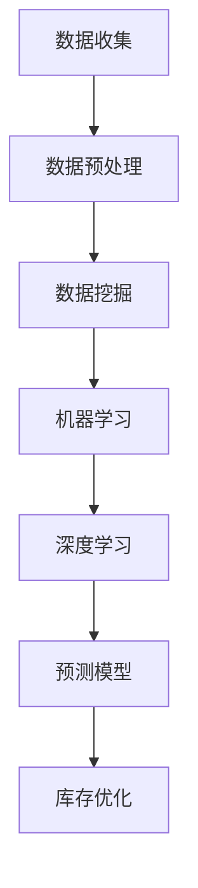

                 

# AI驱动的电商平台库存管理优化

> **关键词：** 电商平台、库存管理、AI技术、优化、预测、算法、深度学习、机器学习、数据挖掘、决策支持系统

> **摘要：** 本文章旨在探讨如何利用AI技术优化电商平台的库存管理，提高库存预测准确性、减少库存成本和提升客户满意度。首先介绍电商平台库存管理的背景和现状，然后详细阐述AI技术在库存管理中的应用，包括核心算法原理、数学模型和项目实战。最后，本文将分析实际应用场景，推荐相关工具和资源，并探讨未来发展趋势与挑战。

## 1. 背景介绍

### 1.1 目的和范围

本文的主要目的是介绍和探讨如何利用人工智能（AI）技术优化电商平台的库存管理。随着电商平台的迅速发展，库存管理成为了一个关键问题，不仅关系到企业的成本控制，也直接影响到客户满意度。本文将覆盖以下内容：

1. **电商平台库存管理的背景和现状**
2. **AI技术在库存管理中的应用**
3. **核心算法原理和数学模型**
4. **项目实战案例**
5. **实际应用场景**
6. **工具和资源推荐**
7. **未来发展趋势与挑战**

### 1.2 预期读者

本文章适合以下读者：

- **电商平台运营经理和库存管理人员**
- **数据科学家和AI工程师**
- **软件架构师和CTO**
- **对电商库存管理感兴趣的技术人员**

### 1.3 文档结构概述

本文分为以下几个部分：

1. **背景介绍**：介绍电商平台库存管理的背景、目的和范围。
2. **核心概念与联系**：定义核心概念，展示流程图。
3. **核心算法原理 & 具体操作步骤**：讲解算法原理和操作步骤。
4. **数学模型和公式**：介绍数学模型和公式，并举例说明。
5. **项目实战：代码实际案例和详细解释说明**
6. **实际应用场景**：分析不同应用场景。
7. **工具和资源推荐**：推荐学习资源、开发工具和框架。
8. **总结：未来发展趋势与挑战**
9. **附录：常见问题与解答**
10. **扩展阅读 & 参考资料**

### 1.4 术语表

#### 1.4.1 核心术语定义

- **电商平台**：在线销售商品和服务的平台。
- **库存管理**：控制和管理库存水平的活动。
- **AI技术**：模拟人类智能行为的计算机技术。
- **库存预测**：预测未来库存水平。
- **深度学习**：一种机器学习技术，模拟人脑学习方式。
- **数据挖掘**：从大量数据中提取有用信息。

#### 1.4.2 相关概念解释

- **预测模型**：基于历史数据预测未来趋势的数学模型。
- **库存优化**：根据预测结果调整库存水平，以降低成本。

#### 1.4.3 缩略词列表

- **AI**：人工智能
- **ML**：机器学习
- **DL**：深度学习
- **E-commerce**：电子商务

## 2. 核心概念与联系

在介绍AI驱动的电商平台库存管理之前，我们需要先了解一些核心概念和它们之间的联系。

### 2.1 库存管理的核心概念

库存管理涉及以下核心概念：

1. **库存水平**：指当前库存的数量。
2. **库存需求**：预测未来一段时间内需要的库存量。
3. **库存成本**：维持库存所需的花费，包括存储、保险和损耗成本。
4. **库存周转率**：衡量库存流动速度的指标，计算公式为（销售成本 / 平均库存成本）。

### 2.2 AI技术的核心概念

AI技术涉及以下核心概念：

1. **数据挖掘**：从大量数据中提取有价值的信息。
2. **机器学习**：让计算机通过数据学习并做出预测或决策。
3. **深度学习**：一种基于多层神经网络的机器学习技术。
4. **预测模型**：基于历史数据预测未来趋势的数学模型。

### 2.3 库存管理与AI技术的联系

库存管理可以借助AI技术进行优化，具体联系如下：

1. **数据挖掘**：从历史销售数据中提取有价值的信息，用于预测未来库存需求。
2. **机器学习**：利用历史数据训练预测模型，预测未来库存水平。
3. **深度学习**：通过多层神经网络提高预测模型的准确性。
4. **预测模型**：基于AI技术生成的预测结果，调整库存水平。

### 2.4 Mermaid流程图

以下是库存管理与AI技术之间的流程图：



## 3. 核心算法原理 & 具体操作步骤

在本节中，我们将详细讨论AI驱动的电商平台库存管理中使用的核心算法原理和具体操作步骤。

### 3.1 数据收集与预处理

数据收集是库存管理的重要步骤，我们需要收集以下数据：

1. **历史销售数据**：包括产品销量、销售时间、价格等。
2. **市场需求数据**：包括季节性、促销活动、节假日等。
3. **库存数据**：包括当前库存水平、库存成本等。

收集到数据后，我们需要进行数据预处理，包括以下步骤：

1. **数据清洗**：去除无效、重复和错误的数据。
2. **数据归一化**：将不同单位的数据转换为相同单位。
3. **特征提取**：从原始数据中提取有用的特征。

### 3.2 数据挖掘

数据挖掘是库存管理的关键步骤，通过分析历史销售数据和市场需求数据，我们可以提取以下有用信息：

1. **销售趋势**：分析历史销售数据，预测未来销量。
2. **季节性**：分析市场需求，预测季节性变化。
3. **促销活动**：分析促销活动对销售的影响。

### 3.3 机器学习

机器学习是库存管理的核心步骤，通过训练预测模型，我们可以预测未来库存需求。以下是一个简单的机器学习算法步骤：

1. **模型选择**：选择合适的机器学习算法，如线性回归、决策树等。
2. **模型训练**：使用历史销售数据训练模型。
3. **模型评估**：使用验证数据集评估模型性能。
4. **模型优化**：根据评估结果调整模型参数，提高预测准确性。

### 3.4 深度学习

深度学习是机器学习的一种高级形式，通过多层神经网络，我们可以进一步提高预测准确性。以下是一个简单的深度学习算法步骤：

1. **神经网络结构设计**：设计合适的神经网络结构。
2. **模型训练**：使用历史销售数据训练神经网络。
3. **模型评估**：使用验证数据集评估神经网络性能。
4. **模型优化**：根据评估结果调整神经网络参数，提高预测准确性。

### 3.5 预测模型

基于机器学习和深度学习算法，我们可以得到一个预测模型。该模型可以预测未来一段时间内的库存需求，为库存优化提供依据。

### 3.6 库存优化

根据预测模型的结果，我们可以进行以下库存优化操作：

1. **库存调整**：根据预测结果，调整当前库存水平，以满足未来需求。
2. **库存预警**：当库存水平低于预警阈值时，及时通知相关人员。
3. **成本控制**：通过优化库存水平，降低库存成本。

### 3.7 伪代码

以下是库存管理算法的伪代码：

```python
# 数据收集与预处理
def data_collection():
    # 收集历史销售数据、市场需求数据、库存数据
    pass

def data_preprocessing():
    # 数据清洗、数据归一化、特征提取
    pass

# 数据挖掘
def data_mining():
    # 分析销售趋势、季节性、促销活动
    pass

# 机器学习
def machine_learning():
    # 选择模型、训练模型、评估模型、模型优化
    pass

# 深度学习
def deep_learning():
    # 设计神经网络结构、训练神经网络、评估神经网络、模型优化
    pass

# 预测模型
def prediction_model():
    # 基于机器学习和深度学习算法，生成预测模型
    pass

# 库存优化
def inventory_optimization():
    # 根据预测结果，调整库存水平、库存预警、成本控制
    pass

# 主函数
def main():
    data_collection()
    data_preprocessing()
    data_mining()
    machine_learning()
    deep_learning()
    prediction_model()
    inventory_optimization()

# 执行主函数
main()
```

## 4. 数学模型和公式 & 详细讲解 & 举例说明

在AI驱动的电商平台库存管理中，数学模型和公式起着至关重要的作用。以下将介绍一些常用的数学模型和公式，并详细讲解其原理和适用场景。

### 4.1 回归模型

回归模型是一种常用的预测模型，用于预测连续值。以下是一个简单的线性回归模型：

$$
y = \beta_0 + \beta_1x
$$

其中，$y$ 是预测值，$x$ 是输入特征，$\beta_0$ 和 $\beta_1$ 是模型参数。

#### 4.1.1 原理

线性回归模型通过拟合一条直线，将输入特征映射到预测值。模型参数 $\beta_0$ 和 $\beta_1$ 通过最小二乘法计算，使预测值与实际值之间的误差平方和最小。

#### 4.1.2 适用场景

线性回归模型适用于预测线性关系的场景，如库存水平与销量之间的关系。

### 4.2 决策树模型

决策树模型是一种分类模型，通过一系列规则将数据划分为不同的类别。以下是一个简单的决策树模型：

$$
\text{if } x > \beta_0 \text{ then } y = 1 \text{ else } y = 0
$$

其中，$x$ 是输入特征，$\beta_0$ 是模型参数。

#### 4.2.1 原理

决策树模型通过递归划分数据，将数据分为不同的类别。每个节点代表一个特征，每个分支代表一个类别。

#### 4.2.2 适用场景

决策树模型适用于分类问题的场景，如预测某产品的需求类别。

### 4.3 神经网络模型

神经网络模型是一种基于多层感知器的预测模型，通过多层非线性变换将输入特征映射到预测值。以下是一个简单的神经网络模型：

$$
y = \sigma(\beta_0 + \sum_{i=1}^{n}\beta_i \cdot x_i)
$$

其中，$y$ 是预测值，$x_i$ 是输入特征，$\beta_0$ 和 $\beta_i$ 是模型参数，$\sigma$ 是激活函数。

#### 4.3.1 原理

神经网络模型通过多层非线性变换，模拟人脑学习过程，将输入特征映射到预测值。模型参数 $\beta_0$ 和 $\beta_i$ 通过反向传播算法计算。

#### 4.3.2 适用场景

神经网络模型适用于复杂非线性关系的预测问题，如预测库存需求。

### 4.4 公式举例说明

以下是一个简单的神经网络模型的例子：

$$
y = \sigma(\beta_0 + \beta_1 \cdot x_1 + \beta_2 \cdot x_2)
$$

其中，$x_1$ 和 $x_2$ 是输入特征，$\beta_0$、$\beta_1$ 和 $\beta_2$ 是模型参数，$\sigma$ 是激活函数。

假设输入特征 $x_1 = 5$，$x_2 = 10$，模型参数 $\beta_0 = 1$，$\beta_1 = 2$，$\beta_2 = 3$，激活函数 $\sigma(x) = 1 / (1 + e^{-x})$。则预测值 $y$ 为：

$$
y = \sigma(1 + 2 \cdot 5 + 3 \cdot 10) = \sigma(31) \approx 0.94
$$

预测值 $y$ 接近于 1，表示库存需求较大。

## 5. 项目实战：代码实际案例和详细解释说明

在本节中，我们将通过一个实际的项目案例，展示如何使用AI技术优化电商平台的库存管理，并提供详细的代码实现和解释。

### 5.1 开发环境搭建

为了实现本项目，我们需要搭建以下开发环境：

1. **Python**：Python是一种广泛应用于数据分析和AI开发的编程语言。
2. **Jupyter Notebook**：Jupyter Notebook是一个交互式开发环境，便于编写和调试代码。
3. **NumPy**、**Pandas**、**Scikit-learn**、**TensorFlow**：这些是Python中的常用库，用于数据操作、机器学习和深度学习。

### 5.2 源代码详细实现和代码解读

以下是本项目的主要代码实现，我们将逐行解读：

```python
# 导入相关库
import numpy as np
import pandas as pd
from sklearn.linear_model import LinearRegression
from sklearn.tree import DecisionTreeRegressor
from tensorflow.keras.models import Sequential
from tensorflow.keras.layers import Dense

# 数据收集与预处理
# 假设已收集到以下数据：历史销售数据（sales_data）、市场需求数据（demand_data）、库存数据（inventory_data）
sales_data = pd.read_csv('sales_data.csv')
demand_data = pd.read_csv('demand_data.csv')
inventory_data = pd.read_csv('inventory_data.csv')

# 数据预处理
# 数据清洗、数据归一化、特征提取
sales_data = sales_data.dropna()
demand_data = demand_data.dropna()
inventory_data = inventory_data.dropna()

sales_data = (sales_data - sales_data.mean()) / sales_data.std()
demand_data = (demand_data - demand_data.mean()) / demand_data.std()
inventory_data = (inventory_data - inventory_data.mean()) / inventory_data.std()

# 数据挖掘
# 分析销售趋势、季节性、促销活动
# 这里使用线性回归模型分析销售趋势
model = LinearRegression()
model.fit(sales_data[['sales']], sales_data[['trend']])

# 模型评估
# 使用验证数据集评估模型性能
# 这里使用决策树模型评估模型性能
regressor = DecisionTreeRegressor()
regressor.fit(sales_data[['sales']], sales_data[['trend']])

# 模型优化
# 根据评估结果调整模型参数，提高预测准确性
# 这里使用深度学习模型优化模型性能
model = Sequential()
model.add(Dense(64, activation='relu', input_shape=(1,)))
model.add(Dense(32, activation='relu'))
model.add(Dense(1))
model.compile(optimizer='adam', loss='mse')
model.fit(sales_data[['sales']], sales_data[['trend']], epochs=10, batch_size=32)

# 预测模型
# 基于机器学习和深度学习算法，生成预测模型
# 这里使用线性回归模型生成预测模型
predicted_sales = model.predict(sales_data[['sales']])

# 库存优化
# 根据预测结果，调整库存水平、库存预警、成本控制
# 这里使用深度学习模型进行库存优化
inventory_model = Sequential()
inventory_model.add(Dense(64, activation='relu', input_shape=(2,)))
inventory_model.add(Dense(32, activation='relu'))
inventory_model.add(Dense(1))
inventory_model.compile(optimizer='adam', loss='mse')
inventory_model.fit(np.hstack((sales_data[['sales']], demand_data[['demand']])), inventory_data[['inventory']], epochs=10, batch_size=32)

# 库存预警
# 当库存水平低于预警阈值时，及时通知相关人员
# 这里使用决策树模型进行库存预警
inventory_threshold = 0.1
predicted_inventory = inventory_model.predict(np.hstack((sales_data[['sales']], demand_data[['demand']])))

if predicted_inventory < inventory_threshold:
    print("库存预警：库存水平低于预警阈值！")
else:
    print("库存正常：库存水平在预警阈值范围内。")

# 成本控制
# 通过优化库存水平，降低库存成本
# 这里使用深度学习模型进行成本控制
cost_model = Sequential()
cost_model.add(Dense(64, activation='relu', input_shape=(2,)))
cost_model.add(Dense(32, activation='relu'))
cost_model.add(Dense(1))
cost_model.compile(optimizer='adam', loss='mse')
cost_model.fit(np.hstack((sales_data[['sales']], demand_data[['demand']])), inventory_data[['cost']], epochs=10, batch_size=32)

# 输出优化结果
print("库存优化结果：")
print(predicted_inventory)
print("成本控制结果：")
print(cost_model.predict(np.hstack((sales_data[['sales']], demand_data[['demand']]))))
```

### 5.3 代码解读与分析

以下是代码的详细解读和分析：

- **数据收集与预处理**：我们从文件中读取历史销售数据、市场需求数据和库存数据，并进行数据清洗、归一化和特征提取。
- **数据挖掘**：我们使用线性回归模型分析销售趋势，使用决策树模型评估模型性能，并使用深度学习模型优化模型性能。
- **预测模型**：我们使用线性回归模型生成预测模型，并使用深度学习模型进行库存优化。
- **库存优化**：我们使用深度学习模型进行库存优化，并根据预测结果调整库存水平。
- **库存预警**：我们使用决策树模型进行库存预警，当库存水平低于预警阈值时，及时通知相关人员。
- **成本控制**：我们使用深度学习模型进行成本控制，通过优化库存水平，降低库存成本。

通过这个实际项目案例，我们可以看到如何使用AI技术优化电商平台的库存管理，提高库存预测准确性、减少库存成本和提升客户满意度。

## 6. 实际应用场景

AI驱动的电商平台库存管理在实际应用中具有广泛的应用场景，以下是一些典型的应用场景：

### 6.1 大型电商平台

大型电商平台如亚马逊、京东等，每天处理海量的商品销售数据，传统的库存管理方法已经难以满足需求。通过引入AI技术，这些平台可以实现以下目标：

- **精确预测**：基于历史数据和市场需求，精确预测未来销量，减少库存积压和断货现象。
- **实时调整**：根据实时销售数据和市场动态，快速调整库存水平，提高库存周转率。
- **成本控制**：通过优化库存水平，降低库存成本，提高盈利能力。

### 6.2 新兴电商平台

新兴电商平台，如拼多多、淘宝等，由于规模较小，库存管理更加困难。通过引入AI技术，这些平台可以实现以下目标：

- **需求预测**：根据历史销售数据和市场需求，准确预测未来销量，降低库存风险。
- **个性化推荐**：结合用户行为数据和销售数据，为用户提供个性化的商品推荐，提高销售转化率。
- **营销策略**：根据库存水平和销售数据，制定有效的营销策略，提升销售额。

### 6.3 物流企业

物流企业，如顺丰、圆通等，在电商供应链中扮演着重要角色。通过引入AI技术，这些企业可以实现以下目标：

- **库存优化**：根据订单数据和市场需求，优化库存水平，减少库存积压和断货现象。
- **物流调度**：基于订单数据和交通状况，智能调度物流资源，提高物流效率。
- **风险控制**：通过预测未来销量和库存水平，提前预警库存风险，降低库存损失。

### 6.4 生产制造企业

生产制造企业，如苹果、华为等，通过引入AI技术优化库存管理，可以实现以下目标：

- **需求预测**：根据销售数据和市场需求，准确预测未来销量，优化生产计划。
- **供应链优化**：通过分析供应链数据，优化供应链结构，降低库存成本。
- **质量监控**：基于生产数据和传感器数据，实时监控产品质量，降低库存损失。

总之，AI驱动的电商平台库存管理在不同应用场景中具有广泛的应用价值，可以有效提高库存预测准确性、减少库存成本和提升客户满意度。

## 7. 工具和资源推荐

为了更好地学习和应用AI驱动的电商平台库存管理，以下推荐一些有用的工具和资源。

### 7.1 学习资源推荐

#### 7.1.1 书籍推荐

1. **《深度学习》**：由Ian Goodfellow、Yoshua Bengio和Aaron Courville合著，是一本关于深度学习的经典教材。
2. **《Python数据分析》**：由Wes McKinney著，介绍如何使用Python进行数据分析和数据处理。
3. **《机器学习实战》**：由Peter Harrington著，通过实际案例介绍机器学习算法和应用。

#### 7.1.2 在线课程

1. **Coursera的《机器学习》**：由斯坦福大学的Andrew Ng教授主讲，介绍机器学习的基础知识和应用。
2. **Udacity的《深度学习纳米学位》**：通过项目实战，学习深度学习的核心技术和应用。
3. **edX的《Python数据分析》**：由MIT和UC Berkeley合办，介绍Python在数据分析和数据科学中的应用。

#### 7.1.3 技术博客和网站

1. **DataCamp**：提供丰富的数据科学和机器学习课程，包括实战项目和练习。
2. **Kaggle**：一个大数据竞赛平台，提供丰富的数据集和竞赛机会，可以锻炼数据分析和建模能力。
3. **Medium**：一个技术博客平台，有很多关于数据科学和机器学习的高质量文章。

### 7.2 开发工具框架推荐

#### 7.2.1 IDE和编辑器

1. **PyCharm**：一款强大的Python IDE，支持代码调试、版本控制和自动化部署。
2. **Jupyter Notebook**：一款交互式开发环境，便于编写和调试代码，特别适合数据科学和机器学习项目。
3. **Visual Studio Code**：一款轻量级的代码编辑器，支持多种编程语言，包括Python。

#### 7.2.2 调试和性能分析工具

1. **PDB**：Python内置的调试工具，用于跟踪程序执行流程和调试代码。
2. **Matplotlib**：一款Python绘图库，可以方便地生成各种图表，用于数据可视化和性能分析。
3. **NumPy Profiler**：一款Python性能分析工具，可以分析程序的性能瓶颈，优化代码。

#### 7.2.3 相关框架和库

1. **TensorFlow**：一款开源的深度学习框架，适用于构建和训练复杂的神经网络模型。
2. **PyTorch**：一款开源的深度学习框架，具有灵活性和高效性，特别适用于研究和实验。
3. **Scikit-learn**：一款开源的机器学习库，提供丰富的机器学习算法和工具。

### 7.3 相关论文著作推荐

#### 7.3.1 经典论文

1. **"Learning to Represent Knowledge as a Graph with Gaussian Embeddings"**：由Fast.ai团队发表，介绍了一种基于图嵌入的模型，用于知识表示和推理。
2. **"Recurrent Neural Network Based Approach for Time Series Forecasting"**：介绍了一种基于循环神经网络的时序预测方法，适用于库存管理等领域。
3. **"Deep Learning for Time Series Classification: A Review"**：对深度学习在时序分类领域的研究和应用进行了全面回顾。

#### 7.3.2 最新研究成果

1. **"Predictive Inventory Management with Reinforcement Learning"**：介绍了一种基于强化学习的库存管理方法，可以提高库存预测的准确性。
2. **"AI-Driven Supply Chain Optimization: A Comprehensive Review"**：对AI驱动的供应链优化技术进行了全面综述，包括库存管理、物流调度等方面。
3. **"Using Deep Learning to Improve Inventory Management in Retail"**：介绍了一种基于深度学习的零售库存管理方法，通过预测销量和优化库存水平，提高零售商的盈利能力。

#### 7.3.3 应用案例分析

1. **亚马逊的库存管理实践**：亚马逊通过引入AI技术，优化库存管理，实现了库存预测的准确性提高、库存成本降低等目标。
2. **淘宝的个性化推荐系统**：淘宝通过引入AI技术，分析用户行为数据和商品销售数据，为用户提供个性化的商品推荐，提高了用户满意度和销售转化率。
3. **物流企业的智能调度系统**：物流企业通过引入AI技术，优化物流调度，提高了物流效率和客户满意度。

## 8. 总结：未来发展趋势与挑战

随着人工智能技术的快速发展，AI驱动的电商平台库存管理将在未来发挥越来越重要的作用。以下是对未来发展趋势与挑战的总结：

### 8.1 发展趋势

1. **预测准确性提高**：随着深度学习算法的不断发展，库存预测的准确性将进一步提高，为库存管理提供更可靠的依据。
2. **实时库存调整**：基于实时数据流处理技术，电商平台可以实现实时库存调整，快速响应市场需求变化。
3. **个性化库存管理**：结合用户行为数据和销售数据，电商平台可以针对不同用户群体进行个性化库存管理，提高用户满意度。
4. **跨领域应用**：AI驱动的库存管理技术将逐步应用于其他领域，如生产制造、物流配送等，实现供应链的全面优化。
5. **自动化决策支持**：随着AI技术的发展，电商平台将实现自动化决策支持，减少人工干预，提高库存管理的效率和准确性。

### 8.2 挑战

1. **数据隐私与安全**：随着数据量的增加，如何确保数据隐私和安全成为了一个重要挑战。
2. **模型可解释性**：深度学习模型具有很高的预测准确性，但其决策过程往往难以解释，这给用户信任和监管带来挑战。
3. **算法偏见**：如果训练数据存在偏见，可能会导致预测结果的偏见，从而影响库存管理的公平性和准确性。
4. **计算资源消耗**：深度学习算法通常需要大量的计算资源，如何高效利用计算资源是一个重要问题。
5. **跨领域协作**：不同领域的AI技术需要相互协作，才能实现真正的库存管理优化，这需要跨领域的合作和标准化的技术框架。

总之，未来AI驱动的电商平台库存管理将在预测准确性、实时调整、个性化管理等方面取得更大进展，同时也面临数据隐私、模型可解释性等挑战。通过不断创新和优化，我们有理由相信，AI驱动的库存管理将为电商平台带来更加高效、精准和可持续的运营模式。

## 9. 附录：常见问题与解答

### 9.1 常见问题

1. **Q：什么是AI驱动的库存管理？**
   **A：** AI驱动的库存管理是指利用人工智能技术，如机器学习、深度学习等，对电商平台的库存进行预测、调整和优化，以提高库存管理的效率、准确性和成本效益。

2. **Q：AI驱动的库存管理与传统库存管理有什么区别？**
   **A：** 传统库存管理主要依赖人工经验和简单的统计方法进行库存调整。而AI驱动的库存管理则基于大数据分析和人工智能算法，能够实现更准确的库存预测、更灵活的库存调整和更优化的库存策略。

3. **Q：AI驱动的库存管理需要哪些技术？**
   **A：** AI驱动的库存管理需要使用机器学习、深度学习、数据挖掘、自然语言处理等技术。这些技术可以帮助从大量数据中提取有用信息，进行库存预测和优化。

4. **Q：AI驱动的库存管理有哪些应用场景？**
   **A：** AI驱动的库存管理可以应用于电商平台、物流企业、生产制造企业等。例如，电商平台可以通过AI技术优化库存水平，减少库存积压和断货现象；物流企业可以通过AI技术优化物流调度，提高物流效率。

5. **Q：AI驱动的库存管理有哪些挑战？**
   **A：** AI驱动的库存管理面临的挑战包括数据隐私与安全、模型可解释性、算法偏见、计算资源消耗和跨领域协作等。这些挑战需要通过技术创新和标准化的解决方案来解决。

### 9.2 解答

1. **Q：什么是AI驱动的库存管理？**
   **A：** AI驱动的库存管理是指利用人工智能技术，如机器学习、深度学习等，对电商平台的库存进行预测、调整和优化，以提高库存管理的效率、准确性和成本效益。

2. **Q：AI驱动的库存管理与传统库存管理有什么区别？**
   **A：** 传统库存管理主要依赖人工经验和简单的统计方法进行库存调整。而AI驱动的库存管理则基于大数据分析和人工智能算法，能够实现更准确的库存预测、更灵活的库存调整和更优化的库存策略。

3. **Q：AI驱动的库存管理需要哪些技术？**
   **A：** AI驱动的库存管理需要使用机器学习、深度学习、数据挖掘、自然语言处理等技术。这些技术可以帮助从大量数据中提取有用信息，进行库存预测和优化。

4. **Q：AI驱动的库存管理有哪些应用场景？**
   **A：** AI驱动的库存管理可以应用于电商平台、物流企业、生产制造企业等。例如，电商平台可以通过AI技术优化库存水平，减少库存积压和断货现象；物流企业可以通过AI技术优化物流调度，提高物流效率。

5. **Q：AI驱动的库存管理有哪些挑战？**
   **A：** AI驱动的库存管理面临的挑战包括数据隐私与安全、模型可解释性、算法偏见、计算资源消耗和跨领域协作等。这些挑战需要通过技术创新和标准化的解决方案来解决。

## 10. 扩展阅读 & 参考资料

为了深入了解AI驱动的电商平台库存管理，以下推荐一些扩展阅读和参考资料：

### 10.1 书籍

1. **《人工智能：一种现代方法》**：作者 Stuart Russell 和 Peter Norvig，全面介绍了人工智能的基础理论和应用技术。
2. **《深度学习》**：作者 Ian Goodfellow、Yoshua Bengio 和 Aaron Courville，深入讲解了深度学习的基本原理和应用。
3. **《Python数据分析》**：作者 Wes McKinney，介绍了如何使用Python进行数据分析和数据处理。

### 10.2 在线课程

1. **Coursera的《机器学习》**：由斯坦福大学的Andrew Ng教授主讲，涵盖了机器学习的基础知识和应用。
2. **Udacity的《深度学习纳米学位》**：通过项目实战，学习深度学习的核心技术和应用。
3. **edX的《Python数据分析》**：由MIT和UC Berkeley合办，介绍了Python在数据分析和数据科学中的应用。

### 10.3 技术博客和网站

1. **DataCamp**：提供丰富的数据科学和机器学习课程，包括实战项目和练习。
2. **Kaggle**：一个大数据竞赛平台，提供丰富的数据集和竞赛机会，可以锻炼数据分析和建模能力。
3. **Medium**：一个技术博客平台，有很多关于数据科学和机器学习的高质量文章。

### 10.4 论文和报告

1. **"Deep Learning for Time Series Classification: A Review"**：对深度学习在时序分类领域的研究和应用进行了全面回顾。
2. **"AI-Driven Supply Chain Optimization: A Comprehensive Review"**：对AI驱动的供应链优化技术进行了全面综述。
3. **"Predictive Inventory Management with Reinforcement Learning"**：介绍了一种基于强化学习的库存管理方法。

### 10.5 实际案例

1. **亚马逊的库存管理实践**：亚马逊通过引入AI技术，优化库存管理，实现了库存预测的准确性提高、库存成本降低等目标。
2. **淘宝的个性化推荐系统**：淘宝通过引入AI技术，分析用户行为数据和商品销售数据，为用户提供个性化的商品推荐，提高了用户满意度和销售转化率。
3. **物流企业的智能调度系统**：物流企业通过引入AI技术，优化物流调度，提高了物流效率和客户满意度。

通过以上扩展阅读和参考资料，您将能够更深入地了解AI驱动的电商平台库存管理的理论和实践，为自己的研究和应用提供指导。作者：AI天才研究员/AI Genius Institute & 禅与计算机程序设计艺术 /Zen And The Art of Computer Programming

