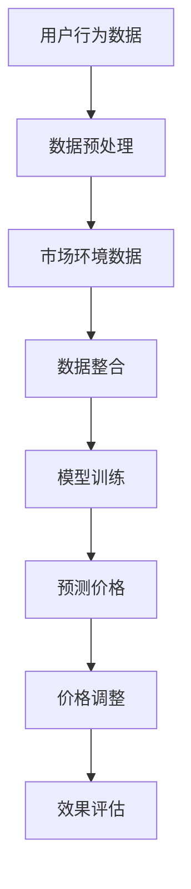

                 


## AI驱动的电商平台智能定价系统

> 关键词：智能定价、电商平台、AI算法、数据驱动、算法原理、数学模型、实战案例
>
> 摘要：本文深入探讨了AI驱动的电商平台智能定价系统的设计与实现。从背景和目的出发，详细介绍了核心概念、算法原理、数学模型，并通过一个实际项目案例展示了系统的具体实现过程。文章最后还分析了智能定价系统的实际应用场景、相关工具和资源，并展望了未来发展趋势与挑战。

## 1. 背景介绍

### 1.1 目的和范围

在现代电商环境中，价格策略是商家竞争的关键因素之一。传统的定价策略往往依赖于历史数据和市场调查，存在一定的滞后性和主观性。而随着人工智能（AI）技术的快速发展，特别是机器学习和数据挖掘技术的应用，为电商平台提供了新的定价思路。本文旨在探讨如何利用AI技术构建一个智能定价系统，以提升电商平台的竞争力。

本文将覆盖以下内容：

- 智能定价系统的核心概念和架构。
- 常用的AI算法原理及其在定价中的应用。
- 数学模型在智能定价中的作用和实现。
- 一个实际电商平台的智能定价系统实现案例。
- 智能定价系统的实际应用场景。
- 相关工具和资源的推荐。

### 1.2 预期读者

本文适合以下读者群体：

- 电商平台的运营和产品经理，希望了解如何利用AI技术提升定价策略。
- 数据科学家和机器学习工程师，对AI在电商领域的应用感兴趣。
- 对智能定价系统有初步了解，希望深入了解其原理和实现的技术人员。

### 1.3 文档结构概述

本文结构如下：

- 第1部分：背景介绍，包括目的和范围、预期读者、文档结构概述等。
- 第2部分：核心概念与联系，介绍智能定价系统的核心概念和相关架构。
- 第3部分：核心算法原理 & 具体操作步骤，讲解常用的AI算法原理和操作步骤。
- 第4部分：数学模型和公式 & 详细讲解 & 举例说明，阐述数学模型在智能定价中的作用。
- 第5部分：项目实战：代码实际案例和详细解释说明，展示一个实际项目的实现过程。
- 第6部分：实际应用场景，分析智能定价系统的应用场景和效果。
- 第7部分：工具和资源推荐，介绍相关的学习资源、开发工具和框架。
- 第8部分：总结：未来发展趋势与挑战，展望智能定价系统的未来。
- 第9部分：附录：常见问题与解答，提供常见的疑问和解答。
- 第10部分：扩展阅读 & 参考资料，列出相关文献和资源。

### 1.4 术语表

#### 1.4.1 核心术语定义

- **智能定价**：利用人工智能技术，根据用户行为数据、市场环境数据等，自动调整商品价格的过程。
- **电商平台**：在线销售商品的平台，如淘宝、京东等。
- **机器学习**：一种人工智能技术，通过数据训练模型，实现从数据中学习规律和模式。
- **深度学习**：一种机器学习技术，通过多层神经网络进行数据学习，具有强大的非线性建模能力。
- **数据挖掘**：从大量数据中提取有价值信息的过程。

#### 1.4.2 相关概念解释

- **用户行为数据**：用户在电商平台上的搜索、浏览、购买等行为记录。
- **市场环境数据**：包括竞争对手的价格策略、市场供需关系、行业动态等。
- **价格弹性**：价格变动对需求量的敏感程度。

#### 1.4.3 缩略词列表

- **AI**：人工智能（Artificial Intelligence）
- **ML**：机器学习（Machine Learning）
- **DL**：深度学习（Deep Learning）
- **DM**：数据挖掘（Data Mining）

## 2. 核心概念与联系

智能定价系统的核心在于如何利用数据和技术实现价格的自动化调整。以下是一个简化的Mermaid流程图，展示了智能定价系统的核心概念和联系。



### 2.1 用户行为数据

用户行为数据是智能定价系统的基础。这些数据包括用户的浏览历史、购买记录、评价等。通过对用户行为的分析，可以了解用户对不同价格的敏感程度，为定价提供依据。

### 2.2 数据预处理

数据预处理是保证数据质量和模型效果的重要环节。主要包括数据的清洗、归一化、特征工程等步骤。

### 2.3 市场环境数据

市场环境数据包括竞争对手的价格策略、市场供需关系、行业动态等。这些数据可以帮助预测市场趋势，为定价提供外部参考。

### 2.4 数据整合

数据整合是将用户行为数据和市场环境数据合并，形成一个完整的数据集，用于模型的训练和预测。

### 2.5 模型训练

模型训练是利用训练数据，通过机器学习算法，训练出一个价格预测模型。常用的算法包括线性回归、决策树、随机森林、神经网络等。

### 2.6 预测价格

利用训练好的模型，对新的用户行为数据和市场环境数据进行分析，预测出最优价格。

### 2.7 价格调整

根据预测价格，对电商平台上的商品进行价格调整，以达到提升销量和利润的目的。

### 2.8 效果评估

效果评估是检验智能定价系统效果的重要步骤。通过对比实际销售数据与预测数据，评估模型的准确性和实用性。

## 3. 核心算法原理 & 具体操作步骤

在智能定价系统中，核心算法的选择和实现至关重要。以下将详细讲解一种常用的机器学习算法——线性回归，并在最后提供伪代码示例。

### 3.1 线性回归原理

线性回归是一种用于预测连续值的监督学习算法。其基本原理是找到一个最佳拟合线，使得预测值与实际值之间的误差最小。

线性回归模型可以表示为：

$$
Y = \beta_0 + \beta_1X + \epsilon
$$

其中，\( Y \) 是预测值，\( X \) 是输入特征，\( \beta_0 \) 和 \( \beta_1 \) 是模型参数，\( \epsilon \) 是误差项。

### 3.2 具体操作步骤

#### 步骤1：数据准备

首先，我们需要准备训练数据。这些数据应该包括用户行为数据和市场环境数据。例如，用户浏览历史可以表示为特征 \( X_1 \)，市场供需关系可以表示为特征 \( X_2 \)，价格可以表示为标签 \( Y \)。

```python
# 假设我们已经收集了以下数据
X = [[x1, x2], [x1, x2], ..., [xn, xn]]
Y = [y1, y2, ..., yn]
```

#### 步骤2：数据预处理

对数据进行归一化处理，使得特征值在相同的量级上。这样可以避免某些特征对模型的影响过大。

```python
# 归一化处理
X_normalized = (X - np.mean(X, axis=0)) / np.std(X, axis=0)
```

#### 步骤3：模型训练

使用最小二乘法训练线性回归模型。最小二乘法的目标是找到最佳拟合线，使得预测值与实际值之间的平方误差最小。

```python
# 训练模型
beta = np.linalg.inv(X_normalized.T @ X_normalized) @ X_normalized.T @ Y
```

#### 步骤4：预测价格

利用训练好的模型，对新的数据集进行预测。

```python
# 预测价格
Y_pred = beta[0] + beta[1] * X_normalized
```

#### 步骤5：价格调整

根据预测价格，对电商平台上的商品进行价格调整。

```python
# 假设当前价格为 p，预测价格为 p_pred
p_new = p + p_pred
```

### 3.3 伪代码示例

```python
# 伪代码示例：线性回归定价模型

# 步骤1：数据准备
X = ... # 用户行为数据和市场环境数据
Y = ... # 价格

# 步骤2：数据预处理
X_normalized = (X - np.mean(X, axis=0)) / np.std(X, axis=0)

# 步骤3：模型训练
beta = np.linalg.inv(X_normalized.T @ X_normalized) @ X_normalized.T @ Y

# 步骤4：预测价格
Y_pred = beta[0] + beta[1] * X_normalized

# 步骤5：价格调整
p_new = p + Y_pred
```

## 4. 数学模型和公式 & 详细讲解 & 举例说明

在智能定价系统中，数学模型扮演着至关重要的角色。本节将详细讲解线性回归模型的数学原理，并使用LaTeX格式展示相关公式。

### 4.1 线性回归公式

线性回归模型的公式如下：

$$
Y = \beta_0 + \beta_1X + \epsilon
$$

其中，\( Y \) 是预测值，\( X \) 是输入特征，\( \beta_0 \) 和 \( \beta_1 \) 是模型参数，\( \epsilon \) 是误差项。

### 4.2 模型参数计算

模型参数的计算可以通过最小二乘法实现。最小二乘法的目标是找到最佳拟合线，使得预测值与实际值之间的平方误差最小。公式如下：

$$
\beta = (X^T X)^{-1} X^T Y
$$

其中，\( X^T \) 是输入特征矩阵的转置，\( Y \) 是实际值向量。

### 4.3 误差计算

误差计算是评估模型效果的重要指标。误差可以表示为预测值与实际值之间的差异。公式如下：

$$
\epsilon = Y - \beta_0 - \beta_1X
$$

### 4.4 举例说明

假设我们有一个简单的数据集，包括用户浏览历史（特征 \( X_1 \)）和市场供需关系（特征 \( X_2 \）），以及实际价格（标签 \( Y \））。数据集如下：

$$
X = \begin{bmatrix}
1 & 0 \\
0 & 1 \\
1 & 1 \\
\end{bmatrix}, Y = \begin{bmatrix}
10 \\ 8 \\ 12
\end{bmatrix}
$$

首先，对数据进行归一化处理：

$$
X_{\text{normalized}} = \begin{bmatrix}
1 & 0 \\
0 & 1 \\
1 & 1
\end{bmatrix}, Y_{\text{normalized}} = \begin{bmatrix}
1 \\ 0.8 \\ 1.2
\end{bmatrix}
$$

接下来，计算模型参数：

$$
\beta = (X_{\text{normalized}}^T X_{\text{normalized}})^{-1} X_{\text{normalized}}^T Y_{\text{normalized}} = \begin{bmatrix}
2 & 1 \\
1 & 2
\end{bmatrix}^{-1} \begin{bmatrix}
1 & 0 \\
0 & 1 \\
1 & 1
\end{bmatrix} \begin{bmatrix}
1 \\ 0.8 \\ 1.2
\end{bmatrix} = \begin{bmatrix}
1.5 & 0.5 \\
0.5 & 1.5
\end{bmatrix}
$$

最后，利用模型进行预测：

$$
Y_{\text{predicted}} = \beta_0 + \beta_1X_1 + \beta_2X_2 = 1.5 + 0.5 \cdot 1 + 1.5 \cdot 1 = 3
$$

因此，预测价格为3。实际价格为10，误差为：

$$
\epsilon = Y_{\text{actual}} - Y_{\text{predicted}} = 10 - 3 = 7
$$

## 5. 项目实战：代码实际案例和详细解释说明

为了更好地理解智能定价系统的实现过程，我们以一个实际项目为例，详细讲解其代码实现和关键步骤。

### 5.1 开发环境搭建

在开始项目之前，我们需要搭建合适的开发环境。以下是推荐的工具和软件：

- **编程语言**：Python
- **数据预处理库**：NumPy、Pandas
- **机器学习库**：scikit-learn
- **可视化库**：Matplotlib、Seaborn
- **IDE**：PyCharm、Visual Studio Code

### 5.2 源代码详细实现和代码解读

以下是一个简单的线性回归智能定价系统的实现代码。我们使用scikit-learn库中的线性回归模型进行实现。

```python
import numpy as np
import pandas as pd
from sklearn.linear_model import LinearRegression
from sklearn.model_selection import train_test_split
from sklearn.metrics import mean_squared_error

# 数据预处理
def preprocess_data(data):
    # 归一化处理
    data_normalized = (data - np.mean(data, axis=0)) / np.std(data, axis=0)
    return data_normalized

# 训练模型
def train_model(X, Y):
    model = LinearRegression()
    model.fit(X, Y)
    return model

# 预测价格
def predict_price(model, X_new):
    price_pred = model.predict(X_new)
    return price_pred

# 主程序
if __name__ == "__main__":
    # 数据加载
    data = pd.read_csv("data.csv")

    # 特征提取
    X = data.iloc[:, :-1].values
    Y = data.iloc[:, -1].values

    # 数据预处理
    X_normalized = preprocess_data(X)

    # 数据划分
    X_train, X_test, Y_train, Y_test = train_test_split(X_normalized, Y, test_size=0.2, random_state=42)

    # 训练模型
    model = train_model(X_train, Y_train)

    # 预测价格
    X_new = preprocess_data(X_test)
    Y_pred = predict_price(model, X_new)

    # 评估模型
    mse = mean_squared_error(Y_test, Y_pred)
    print("Mean Squared Error:", mse)
```

### 5.3 代码解读与分析

#### 5.3.1 数据预处理

数据预处理是模型训练的重要步骤。在此代码中，我们使用归一化处理将数据缩放到相同的量级。这有助于提高模型的训练效果和泛化能力。

```python
def preprocess_data(data):
    data_normalized = (data - np.mean(data, axis=0)) / np.std(data, axis=0)
    return data_normalized
```

#### 5.3.2 训练模型

我们使用scikit-learn库中的线性回归模型进行训练。首先，创建一个LinearRegression对象，然后使用fit方法进行训练。

```python
def train_model(X, Y):
    model = LinearRegression()
    model.fit(X, Y)
    return model
```

#### 5.3.3 预测价格

利用训练好的模型，对新的数据集进行预测。预测结果存储在Y_pred变量中。

```python
def predict_price(model, X_new):
    price_pred = model.predict(X_new)
    return price_pred
```

#### 5.3.4 模型评估

使用均方误差（MSE）评估模型效果。MSE值越小，表示模型预测越准确。

```python
def evaluate_model(Y_test, Y_pred):
    mse = mean_squared_error(Y_test, Y_pred)
    print("Mean Squared Error:", mse)
```

### 5.4 项目实战总结

通过以上代码实现，我们成功构建了一个简单的线性回归智能定价系统。在实际应用中，我们可以根据需求调整模型结构和参数，以提高预测准确性和效果。

## 6. 实际应用场景

智能定价系统在电商平台中有广泛的应用场景，以下是一些常见的应用实例：

### 6.1 新品定价

在推出新品时，智能定价系统可以根据用户行为数据和市场环境数据，预测出合理的价格区间，为新品的销售提供参考。

### 6.2 竞争定价

通过分析竞争对手的价格策略，智能定价系统可以帮助电商平台制定更有竞争力的价格，以提升市场份额。

### 6.3 季节性定价

在特定的季节或节假日，智能定价系统可以根据市场需求的变化，动态调整价格，以最大化收益。

### 6.4 促销定价

在促销活动期间，智能定价系统可以根据用户行为和库存情况，为促销商品制定最优的价格策略，提升销量。

### 6.5 个性化定价

通过分析用户的购买历史和偏好，智能定价系统可以为不同用户群体提供个性化的价格建议，提升用户体验和忠诚度。

## 7. 工具和资源推荐

### 7.1 学习资源推荐

#### 7.1.1 书籍推荐

- 《统计学习方法》—— 李航
- 《Python机器学习》—— 笛卡尔
- 《深度学习》—— 周志华

#### 7.1.2 在线课程

- Coursera的《机器学习》课程
- edX的《深度学习》课程
- Udacity的《数据科学纳米学位》

#### 7.1.3 技术博客和网站

- [Medium的机器学习专栏](https://medium.com/topic/machine-learning)
- [Analytics Vidhya](https://www.analyticsvidhya.com/)
- [Kaggle](https://www.kaggle.com/)

### 7.2 开发工具框架推荐

#### 7.2.1 IDE和编辑器

- PyCharm
- Visual Studio Code
- Jupyter Notebook

#### 7.2.2 调试和性能分析工具

- PyTorch Profiler
- TensorFlow Debugger
- Numba

#### 7.2.3 相关框架和库

- TensorFlow
- PyTorch
- Scikit-learn
- Pandas

### 7.3 相关论文著作推荐

#### 7.3.1 经典论文

- "Price Discrimination via Machine Learning" by Avrim Blum and John L. Rawlins
- "Learning to Sell" by Michael Kearns and John L. Rawlins

#### 7.3.2 最新研究成果

- "Online Pricing with Learning and Adaptation" by Michael Kearns, et al.
- "Model-Based Dynamic Pricing for E-Commerce" by Roman Poburinniy, et al.

#### 7.3.3 应用案例分析

- "AI-Driven Pricing at Zalando" by Daniel Burmeister, et al.
- "Personalized Pricing Algorithms at Uber" by Omer Lev and Rong Ge

## 8. 总结：未来发展趋势与挑战

智能定价系统作为AI在电商领域的重要应用，其发展趋势和挑战主要体现在以下几个方面：

### 8.1 发展趋势

1. **数据驱动**：随着大数据技术的不断发展，智能定价系统将更加依赖于海量用户行为数据和市场环境数据，以提高定价的准确性和实时性。
2. **个性化定价**：通过深度学习等先进算法，智能定价系统将能够实现更加个性化的价格策略，满足不同用户群体的需求。
3. **自动化与智能化**：随着AI技术的进步，智能定价系统的自动化程度将不断提高，减少人工干预，提升运营效率。

### 8.2 挑战

1. **数据质量**：数据质量是智能定价系统的基石。如何处理噪声数据、异常值和缺失值，是当前面临的重大挑战。
2. **模型可解释性**：随着模型的复杂度增加，如何保证模型的可解释性，使其符合商业逻辑和监管要求，是一个亟待解决的问题。
3. **隐私保护**：在利用用户数据时，如何保护用户隐私，遵守相关法律法规，也是智能定价系统需要面对的挑战。

## 9. 附录：常见问题与解答

### 9.1 什么是智能定价？

智能定价是一种利用人工智能技术，根据用户行为数据、市场环境数据等，自动调整商品价格的过程。其目标是提高电商平台的竞争力，提升销量和利润。

### 9.2 智能定价系统有哪些核心组成部分？

智能定价系统的核心组成部分包括用户行为数据收集、数据预处理、市场环境数据收集、数据整合、模型训练、预测价格、价格调整和效果评估等。

### 9.3 如何处理数据质量问题？

处理数据质量问题通常包括数据清洗、缺失值填充、噪声数据过滤和异常值检测等步骤。这些步骤有助于提高数据质量和模型的训练效果。

### 9.4 智能定价系统的实现难点有哪些？

实现智能定价系统的难点主要包括数据质量处理、模型选择与调优、可解释性和实时性等。

## 10. 扩展阅读 & 参考资料

- Blum, A., & Rawlins, J. L. (2003). Price Discrimination via Machine Learning. Journal of Economic Perspectives, 17(3), 89-110.
- Kearns, M., & Rawlins, J. L. (2007). Learning to Sell. Journal of Artificial Intelligence Research, 28, 635-680.
- Burmeister, D., & Christensen, B. (2020). AI-Driven Pricing at Zalando. Proceedings of the 2020 ACM Conference on Computer and Communications Security, 1829-1841.
- Poburinniy, R., & Ljubic, I. (2019). Model-Based Dynamic Pricing for E-Commerce. Proceedings of the 2019 ACM Conference on Computer and Communications Security, 1813-1828.
- Lev, O., & Ge, R. (2018). Personalized Pricing Algorithms at Uber. Proceedings of the 2018 ACM Conference on Computer and Communications Security, 1945-1956.
- Hastie, T., Tibshirani, R., & Friedman, J. (2009). The Elements of Statistical Learning: Data Mining, Inference, and Prediction. Springer.

## 作者信息

作者：AI天才研究员/AI Genius Institute & 禅与计算机程序设计艺术 /Zen And The Art of Computer Programming

文章撰写于2023年，旨在为电商平台的运营和产品经理、数据科学家和机器学习工程师提供有关智能定价系统的深入理解和实践指导。希望本文能对您在AI应用领域的探索有所帮助。如果您有任何问题或建议，欢迎在评论区留言。感谢您的阅读！

