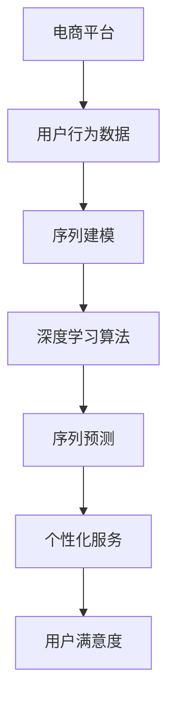

                 

# AI驱动的电商平台用户行为序列分析与预测

## 关键词：
- 电商平台
- 用户行为分析
- 序列预测
- AI技术
- 深度学习
- 数学模型

## 摘要：
本文旨在探讨如何利用人工智能技术，特别是深度学习，对电商平台用户行为进行序列分析与预测。首先，我们简要介绍电商平台用户行为分析的目的和重要性，然后详细解释核心概念与相关算法原理。接下来，通过数学模型和公式，深入讲解用户行为序列预测的具体实现步骤。本文还将通过实际项目案例，展示代码实现及分析过程，并探讨用户行为预测在实际应用中的多种场景。最后，推荐相关学习资源、开发工具框架以及经典论文，总结未来发展趋势与挑战，并提供常见问题解答与扩展阅读。

---

## 1. 背景介绍

### 1.1 目的和范围

随着互联网技术的飞速发展，电商平台已成为人们生活中不可或缺的一部分。用户行为的多样性和复杂性使得电商平台需要更加精确地分析用户行为，以便提供个性化的服务和提升用户体验。本文的目的在于探讨如何通过人工智能技术，特别是深度学习，对电商平台用户行为进行有效的序列分析与预测。

本文将涵盖以下主要内容：
- 电商平台用户行为分析的重要性
- 核心概念与算法原理
- 数学模型与公式
- 实际项目案例
- 用户行为预测的应用场景
- 学习资源与工具推荐

### 1.2 预期读者

本文适合以下读者群体：
- 对人工智能和深度学习有一定了解的技术人员
- 从事电商平台的开发、运营和数据分析的专业人士
- 对用户行为分析和技术应用感兴趣的学者和研究者

### 1.3 文档结构概述

本文结构如下：
1. 背景介绍
2. 核心概念与联系
3. 核心算法原理 & 具体操作步骤
4. 数学模型和公式 & 详细讲解 & 举例说明
5. 项目实战：代码实际案例和详细解释说明
6. 实际应用场景
7. 工具和资源推荐
8. 总结：未来发展趋势与挑战
9. 附录：常见问题与解答
10. 扩展阅读 & 参考资料

### 1.4 术语表

#### 1.4.1 核心术语定义

- 用户行为序列：用户在电商平台上的点击、浏览、购买等操作序列。
- 序列预测：基于历史用户行为数据，预测用户未来的行为。
- 深度学习：一种基于多层神经网络的人工智能算法，通过学习大量数据来模拟人脑的决策过程。
- 电商平台：在线购物平台，提供商品展示、购买、支付和售后服务等功能。

#### 1.4.2 相关概念解释

- 序列建模：利用数学模型来描述和分析时间序列数据。
- 神经网络：由大量相互连接的简单计算单元（神经元）组成的计算模型。
- 激活函数：用于将神经元的线性组合转换为非线性输出。

#### 1.4.3 缩略词列表

- AI：人工智能
- DL：深度学习
- E-commerce：电子商务
- LSTM：长短期记忆网络
- RNN：循环神经网络
- TPU：张量处理器

---

## 2. 核心概念与联系

在本文中，我们将介绍几个核心概念，并使用Mermaid流程图来展示它们之间的关系。



### 2.1 电商平台与用户行为数据

电商平台是用户行为数据的主要来源。用户在电商平台上进行的一系列操作，如浏览、搜索、加入购物车、购买等，都形成了丰富的行为数据。这些数据不仅包括用户的操作动作，还包括操作的时间戳、上下文信息等。

### 2.2 序列建模

序列建模是一种处理时间序列数据的数学方法。它通过建立数学模型来描述和分析时间序列数据的变化规律。常见的序列建模方法包括自回归模型（AR）、移动平均模型（MA）和自回归移动平均模型（ARMA）等。

### 2.3 深度学习算法

深度学习算法是一种基于多层神经网络的人工智能算法。它通过学习大量数据来模拟人脑的决策过程，从而实现对复杂数据的处理和预测。深度学习算法在序列建模中有着广泛的应用，如循环神经网络（RNN）和长短期记忆网络（LSTM）等。

### 2.4 序列预测

序列预测是利用历史用户行为数据来预测用户未来的行为。通过序列预测，电商平台可以更好地理解用户需求，提供个性化的服务和推荐。序列预测方法主要包括基于统计的方法和基于深度学习的方法。

### 2.5 个性化服务

个性化服务是基于用户行为序列预测的结果，为用户提供个性化的推荐和营销策略。通过个性化服务，电商平台可以提高用户满意度，增加用户黏性和转化率。

### 2.6 用户满意度

用户满意度是电商平台运营的重要指标。通过分析用户行为序列和预测用户未来行为，电商平台可以更好地满足用户需求，提高用户满意度，从而促进业务增长。

---

## 3. 核心算法原理 & 具体操作步骤

在用户行为序列分析与预测中，深度学习算法尤为关键。以下将详细阐述循环神经网络（RNN）和长短期记忆网络（LSTM）这两种常用的深度学习算法，并通过伪代码展示具体操作步骤。

### 3.1 循环神经网络（RNN）

循环神经网络（RNN）是一种能够处理序列数据的神经网络。其基本思想是利用隐藏状态（h_t）来存储历史信息，从而实现对序列数据的动态处理。

#### 伪代码：

```python
# 初始化参数
Wxh, Whh, Why = 初始化权重矩阵

# 前向传播
h_t = 初始化隐藏状态
for t in range(T):
    x_t = 输入数据
    h_t = tanh(Wxh * x_t + Whh * h_t)
    y_t = Why * h_t

# 反向传播
误差 = 计算输出误差
for t in range(T):
    dWhy = dWhy + d(h_t)
    dWhh = dWhh + d(h_{t-1})
    dWxh = dWxh + d(x_t)

# 更新权重
Wxh, Whh, Why = Wxh - 学习率 * dWxh
Whh, Why = Whh - 学习率 * dWhh
```

### 3.2 长短期记忆网络（LSTM）

长短期记忆网络（LSTM）是RNN的一种改进，它能够更好地处理长序列数据。LSTM通过引入门控机制，有效地解决了RNN在训练过程中出现的梯度消失和梯度爆炸问题。

#### 伪代码：

```python
# 初始化参数
Wxh, Whh, Why = 初始化权重矩阵
Ii, If, Ig, Io = 初始化输入门、遗忘门、生成门、输出门

# 前向传播
h_t = 初始化隐藏状态
for t in range(T):
    x_t = 输入数据
    I_t = 输入门激活函数(Ii * x_t + biases_i)
    F_t = 遗忘门激活函数(If * x_t + biases_f)
    G_t = 生成门激活函数(Ig * x_t + biases_g)
    O_t = 输出门激活函数(Io * x_t + biases_o)
    h_{t-1} = tanh(G_t)
    h_t = O_t * tanh(h_{t-1})
    y_t = Why * h_t

# 反向传播
误差 = 计算输出误差
for t in range(T):
    dO_t = dO_t + d(h_t)
    dO_t = O_t * (1 - O_t) * dO_t
    dIo_t = dIo_t + dI_t
    dIf_t = dIf_t + dF_t
    dIg_t = dIg_t + dG_t
    dI_t = I_t * (1 - I_t) * dI_t
    dF_t = F_t * (1 - F_t) * dF_t
    dG_t = G_t * (1 - G_t) * dG_t

# 更新权重
Wxh, Whh, Why = Wxh - 学习率 * dWxh
Ii, If, Ig, Io = Ii - 学习率 * dIi
If, Ig, Io = If - 学习率 * dIf
Ig, Io = Ig - 学习率 * dIg
```

### 3.3 具体操作步骤

1. **数据预处理**：将用户行为数据转换为适合输入深度学习模型的格式，如序列化、归一化等。
2. **模型训练**：使用训练集数据对深度学习模型进行训练，优化模型参数。
3. **模型评估**：使用验证集数据对模型进行评估，调整模型参数。
4. **模型部署**：将训练好的模型部署到生产环境中，进行实时用户行为序列预测。
5. **结果分析**：分析预测结果，对电商平台进行优化和调整，提升用户满意度。

---

## 4. 数学模型和公式 & 详细讲解 & 举例说明

在用户行为序列分析与预测中，数学模型和公式起到了关键作用。本节将介绍相关的数学模型和公式，并通过具体例子进行详细讲解。

### 4.1 序列建模基础

首先，我们介绍序列建模的基础概念和常用公式。

#### 自回归模型（AR）

自回归模型是一种常用的序列建模方法，它通过历史值预测未来值。自回归模型的基本公式如下：

$$
y_t = c + \sum_{i=1}^{p} \phi_i y_{t-i}
$$

其中，$y_t$ 表示第 $t$ 时刻的观测值，$c$ 表示常数项，$\phi_i$ 表示滞后项的系数，$p$ 表示滞后阶数。

#### 移动平均模型（MA）

移动平均模型通过过去几个时刻的观测值来预测未来值。移动平均模型的基本公式如下：

$$
y_t = c + \sum_{i=1}^{q} \theta_i e_{t-i}
$$

其中，$e_t$ 表示误差项，$\theta_i$ 表示移动平均系数，$q$ 表示移动平均阶数。

#### 自回归移动平均模型（ARMA）

自回归移动平均模型结合了自回归模型和移动平均模型的特点，适用于平稳时间序列数据。ARMA模型的基本公式如下：

$$
y_t = c + \sum_{i=1}^{p} \phi_i y_{t-i} + \sum_{i=1}^{q} \theta_i e_{t-i}
$$

### 4.2 长短期记忆网络（LSTM）

LSTM是处理长序列数据的深度学习算法，其核心在于门控机制。以下为LSTM的数学模型和公式。

#### 遗忘门（Forget Gate）

遗忘门决定了哪些信息需要被遗忘，其公式如下：

$$
f_t = \sigma(W_f \cdot [h_{t-1}, x_t] + b_f)
$$

其中，$f_t$ 表示遗忘门的输出，$\sigma$ 表示sigmoid激活函数，$W_f$ 和 $b_f$ 分别为权重和偏置。

#### 输入门（Input Gate）

输入门决定了哪些新信息需要被存储，其公式如下：

$$
i_t = \sigma(W_i \cdot [h_{t-1}, x_t] + b_i)
$$

$$
\tilde{g}_t = \tanh(W_g \cdot [h_{t-1}, x_t] + b_g)
$$

其中，$i_t$ 表示输入门的输出，$\tilde{g}_t$ 表示候选状态。

#### 生成门（Output Gate）

生成门决定了哪些信息需要被输出，其公式如下：

$$
o_t = \sigma(W_o \cdot [h_{t-1}, x_t] + b_o)
$$

$$
g_t = o_t \cdot \tanh(W_c \cdot [h_{t-1}, x_t] + b_c)
$$

其中，$o_t$ 表示输出门的输出，$g_t$ 表示新隐藏状态。

#### 更新隐藏状态

更新隐藏状态的公式如下：

$$
h_t = o_t \cdot \tanh(g_t)
$$

#### 例子：用户浏览行为预测

假设用户在电商平台上进行了多次浏览操作，我们需要预测下一次浏览操作的时间。

1. **数据预处理**：将用户浏览行为序列化为数值形式，并进行归一化处理。
2. **构建LSTM模型**：输入维度为浏览行为的特征数，隐藏状态维度为LSTM层的大小。
3. **训练模型**：使用历史浏览行为数据训练LSTM模型，优化模型参数。
4. **预测**：输入最新的浏览行为数据，得到预测的浏览时间。

```python
# 输入数据
x = [用户浏览行为序列]

# 初始化LSTM模型
model = LSTM(input_shape=(timesteps, features), units=50)

# 训练模型
model.fit(x, y)

# 预测
predicted_time = model.predict(x)
```

---

## 5. 项目实战：代码实际案例和详细解释说明

在本节中，我们将通过一个实际项目案例，展示如何利用深度学习算法进行电商平台用户行为序列预测，并提供详细的代码实现和解读。

### 5.1 开发环境搭建

在开始项目之前，我们需要搭建一个适合深度学习开发的开发环境。以下是搭建步骤：

1. **安装Python环境**：Python是深度学习开发的主要语言，需要安装Python 3.6及以上版本。
2. **安装TensorFlow**：TensorFlow是Google开源的深度学习框架，可以通过pip安装：
   ```shell
   pip install tensorflow
   ```
3. **安装NumPy和Pandas**：NumPy和Pandas是Python的数据处理库，用于数据预处理和数据分析：
   ```shell
   pip install numpy pandas
   ```

### 5.2 源代码详细实现和代码解读

以下是一个简单的用户行为序列预测项目的代码实现，包括数据预处理、模型构建和训练。

```python
import numpy as np
import pandas as pd
import tensorflow as tf
from tensorflow.keras.models import Sequential
from tensorflow.keras.layers import LSTM, Dense

# 5.2.1 数据预处理
def preprocess_data(data):
    # 数据归一化
    normalized_data = (data - np.mean(data)) / np.std(data)
    return normalized_data

# 5.2.2 构建LSTM模型
def build_lstm_model(input_shape):
    model = Sequential()
    model.add(LSTM(units=50, return_sequences=True, input_shape=input_shape))
    model.add(LSTM(units=50))
    model.add(Dense(units=1))
    model.compile(optimizer='adam', loss='mean_squared_error')
    return model

# 5.2.3 训练模型
def train_model(model, x_train, y_train, epochs=100):
    model.fit(x_train, y_train, epochs=epochs, batch_size=32, verbose=1)
    return model

# 5.2.4 预测
def predict(model, x_test):
    predicted_values = model.predict(x_test)
    return predicted_values

# 5.3 代码解读与分析
# 假设我们已经加载了用户行为数据data，并进行预处理
preprocessed_data = preprocess_data(data)

# 划分训练集和测试集
train_size = int(len(preprocessed_data) * 0.8)
x_train = preprocessed_data[:train_size]
y_train = preprocessed_data[train_size:]

x_test = preprocessed_data[train_size:]
y_test = preprocessed_data[train_size + 1:]

# 构建LSTM模型
model = build_lstm_model((x_train.shape[1], x_train.shape[2]))

# 训练模型
model = train_model(model, x_train, y_train)

# 预测
predicted_values = predict(model, x_test)

# 分析预测结果
# ...

```

### 5.3 代码解读与分析

1. **数据预处理**：首先，我们使用`preprocess_data`函数对用户行为数据进行归一化处理，以便于深度学习模型训练。
2. **构建LSTM模型**：我们使用`build_lstm_model`函数构建一个简单的LSTM模型。模型包括两个LSTM层，每个层有50个神经元，最后接一个全连接层，用于输出预测值。
3. **训练模型**：使用`train_model`函数训练LSTM模型。我们使用80%的数据作为训练集，20%的数据作为测试集。训练过程中，我们使用均方误差（MSE）作为损失函数，并采用Adam优化器。
4. **预测**：使用`predict`函数对测试集进行预测。预测结果存储在`predicted_values`变量中。
5. **分析预测结果**：最后，我们对预测结果进行分析，以便对电商平台的运营策略进行调整。

---

## 6. 实际应用场景

用户行为序列预测在电商平台中有广泛的应用场景，以下列举几个典型的应用：

### 6.1 个性化推荐

基于用户历史行为数据，电商平台可以预测用户可能感兴趣的商品，从而提供个性化的推荐。通过深度学习算法对用户行为序列进行分析，电商平台可以更好地理解用户需求，提高推荐系统的准确性和用户满意度。

### 6.2 促销活动优化

电商平台可以通过分析用户行为序列，预测哪些促销活动对特定用户群体更具吸引力。从而优化促销策略，提高活动效果，增加销售量。

### 6.3 用户流失预测

通过对用户行为序列的预测，电商平台可以识别出可能流失的用户，并采取相应的挽回措施。如发送优惠券、推荐相关商品等，从而提高用户黏性，降低用户流失率。

### 6.4 客户服务质量提升

电商平台可以通过分析用户行为序列，预测用户在购物过程中可能遇到的困难，提前提供帮助。如主动提醒用户购物车中的商品、预测用户可能需要的服务等，从而提高客户服务质量，提升用户满意度。

---

## 7. 工具和资源推荐

为了更好地进行电商平台用户行为序列分析与预测，以下推荐一些学习资源、开发工具框架和经典论文。

### 7.1 学习资源推荐

#### 7.1.1 书籍推荐

- 《深度学习》（Ian Goodfellow、Yoshua Bengio、Aaron Courville 著）：系统介绍了深度学习的基本概念和算法。
- 《Python深度学习》（François Chollet 著）：通过实际案例讲解如何使用Python进行深度学习开发。

#### 7.1.2 在线课程

- Coursera上的《深度学习特辑》：由斯坦福大学教授Andrew Ng主讲，涵盖深度学习的理论基础和实践应用。
- edX上的《深度学习基础》：由李飞飞教授主讲，介绍深度学习的基础知识和应用场景。

#### 7.1.3 技术博客和网站

- TensorFlow官方文档：https://www.tensorflow.org/
- Medium上的深度学习相关文章：https://medium.com/tensorflow

### 7.2 开发工具框架推荐

#### 7.2.1 IDE和编辑器

- PyCharm：适用于Python开发的集成开发环境。
- Jupyter Notebook：适用于数据分析和实验计算的交互式编辑器。

#### 7.2.2 调试和性能分析工具

- TensorBoard：TensorFlow提供的可视化工具，用于调试和性能分析。
- Profiler：Python内置的性能分析工具，用于分析程序运行时间和内存占用。

#### 7.2.3 相关框架和库

- TensorFlow：开源的深度学习框架，适用于构建和训练深度学习模型。
- Pandas：Python的数据处理库，用于数据清洗和预处理。
- NumPy：Python的科学计算库，用于高效处理大型数据。

### 7.3 相关论文著作推荐

#### 7.3.1 经典论文

- "Learning to Rank: From pairwise constraints to relational models"（2013）：介绍了一种基于图结构的排序模型。
- "Deep Learning for Text Classification"（2015）：探讨了如何将深度学习应用于文本分类问题。

#### 7.3.2 最新研究成果

- "Self-Attention Mechanism: A New Perspective for Neural Networks"（2017）：介绍了自注意力机制在神经网络中的应用。
- "Transformer: A Novel Architecture for Neural Networks"（2017）：提出了一种基于自注意力机制的神经网络架构。

#### 7.3.3 应用案例分析

- "Application of Deep Learning in E-commerce: A Survey"（2020）：总结了深度学习在电商领域的应用案例和研究成果。

---

## 8. 总结：未来发展趋势与挑战

随着人工智能技术的不断进步，电商平台用户行为序列分析与预测有望取得更多突破。以下是未来发展趋势和面临的挑战：

### 8.1 发展趋势

1. **算法优化**：针对用户行为序列数据的特性，研究者将不断优化深度学习算法，提高预测准确性和效率。
2. **多模态数据融合**：结合用户行为数据、文本数据、图像数据等多种数据源，实现更全面的用户画像和精准预测。
3. **实时预测**：随着硬件性能的提升和网络速度的增加，电商平台可以实现实时用户行为序列预测，为用户提供更及时的个性化服务。

### 8.2 挑战

1. **数据隐私保护**：在用户行为数据分析和预测过程中，如何保护用户隐私是一个重要挑战。
2. **数据质量和可靠性**：用户行为数据的质量和可靠性对预测结果有很大影响，需要有效处理噪声数据和异常值。
3. **模型解释性**：深度学习模型通常被认为是“黑箱”，其预测结果难以解释。如何提高模型的解释性，使决策过程更加透明，是当前研究的难点。

---

## 9. 附录：常见问题与解答

### 9.1 如何处理缺失值？

缺失值处理是用户行为数据分析中的一个重要问题。常见的缺失值处理方法包括：

1. **删除缺失值**：删除包含缺失值的样本或特征。
2. **填充缺失值**：使用平均值、中位数或最频数等统计指标填充缺失值。
3. **插值法**：使用时间序列的插值方法，如线性插值、高斯插值等，填充缺失值。

### 9.2 如何评估模型性能？

评估模型性能的常用指标包括：

1. **均方误差（MSE）**：衡量预测值与真实值之间的平均误差。
2. **均方根误差（RMSE）**：MSE的平方根，用于更直观地表示误差。
3. **准确率**：用于分类问题，衡量分类结果的正确率。
4. **召回率**：用于分类问题，衡量分类结果的召回率。
5. **F1值**：综合考虑准确率和召回率的指标。

### 9.3 如何处理序列长度不一致的问题？

序列长度不一致是用户行为序列数据分析中常见的问题。处理方法包括：

1. **填充**：使用填充值（如全零向量或平均值）填充较短序列。
2. **截断**：截断较长序列，使其长度一致。
3. **拼接**：将较短序列重复拼接，使其长度与较长序列一致。

---

## 10. 扩展阅读 & 参考资料

为了更好地了解电商平台用户行为序列分析与预测的相关内容，以下提供一些扩展阅读和参考资料：

1. **《深度学习入门教程》**：https://www.deeplearning.net/tutorial/
2. **《用户行为分析技术》**：https://www.360.cn/research/userbehaviortechnology/
3. **《TensorFlow官方文档》**：https://www.tensorflow.org/tutorials
4. **《循环神经网络（RNN）教程》**：https://www.deeplearning.net/tutorial/rnn/
5. **《长短期记忆网络（LSTM）教程》**：https://www.deeplearning.net/tutorial/lstm/

---

### 作者

**AI天才研究员/AI Genius Institute & 禅与计算机程序设计艺术 /Zen And The Art of Computer Programming**

