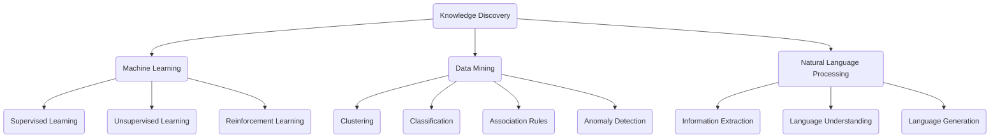

                 


# AI驱动的知识发现：改变信息获取方式

> 关键词：人工智能，知识发现，信息获取，机器学习，数据挖掘，自然语言处理

> 摘要：本文深入探讨了AI驱动的知识发现技术如何改变传统信息获取方式。通过介绍核心概念、算法原理、数学模型以及实际应用案例，我们展示了人工智能在提升信息处理效率、精确性和个性化方面的巨大潜力。

## 1. 背景介绍

### 1.1 目的和范围

本文旨在阐述AI驱动的知识发现技术如何改变信息获取方式，并通过具体案例展示其在各个领域中的应用。本文将涵盖以下内容：

- **核心概念**：介绍知识发现、机器学习和数据挖掘的基本概念。
- **算法原理**：阐述知识发现的关键算法和步骤。
- **数学模型**：讲解知识发现中的相关数学模型和公式。
- **实际应用**：展示AI驱动的知识发现技术在各个领域的应用案例。

### 1.2 预期读者

本文面向对人工智能、数据科学和机器学习有一定了解的技术人员和研究者。如果您希望在信息获取和处理方面获得前沿技术和方法，本文将为您提供宝贵的知识和见解。

### 1.3 文档结构概述

本文分为以下几个部分：

- **第1章：背景介绍**：介绍本文的目的、范围、预期读者以及文档结构。
- **第2章：核心概念与联系**：介绍知识发现、机器学习和数据挖掘的基本概念，并使用Mermaid流程图展示核心概念和联系。
- **第3章：核心算法原理 & 具体操作步骤**：详细阐述知识发现的核心算法原理和具体操作步骤，并使用伪代码进行解释。
- **第4章：数学模型和公式 & 详细讲解 & 举例说明**：讲解知识发现中的相关数学模型和公式，并通过具体例子进行说明。
- **第5章：项目实战：代码实际案例和详细解释说明**：展示AI驱动的知识发现技术在实际项目中的应用，并详细解释代码实现。
- **第6章：实际应用场景**：介绍AI驱动的知识发现技术在各个领域的应用场景。
- **第7章：工具和资源推荐**：推荐学习资源、开发工具和框架。
- **第8章：总结：未来发展趋势与挑战**：总结本文的主要内容和未来发展趋势与挑战。
- **第9章：附录：常见问题与解答**：回答读者可能遇到的问题。
- **第10章：扩展阅读 & 参考资料**：提供扩展阅读和参考资料。

### 1.4 术语表

#### 1.4.1 核心术语定义

- **知识发现**：从大量数据中自动发现有趣知识的过程。
- **机器学习**：使计算机能够通过数据学习并改进性能的技术。
- **数据挖掘**：从大量数据中发现有用信息和模式的过程。
- **自然语言处理**：使计算机理解和生成自然语言的技术。

#### 1.4.2 相关概念解释

- **监督学习**：在有标注数据集上进行训练，以预测新数据的类别或值。
- **无监督学习**：在没有标注数据集的情况下，自动发现数据中的结构和模式。
- **增强学习**：通过与环境的交互学习，以提高任务表现。

#### 1.4.3 缩略词列表

- **AI**：人工智能（Artificial Intelligence）
- **ML**：机器学习（Machine Learning）
- **DM**：数据挖掘（Data Mining）
- **NLP**：自然语言处理（Natural Language Processing）
- **IDE**：集成开发环境（Integrated Development Environment）

## 2. 核心概念与联系

### 2.1 知识发现

知识发现（Knowledge Discovery in Databases，KDD）是从大量数据中自动发现有趣知识的过程。它涉及多个阶段，包括数据预处理、数据挖掘、模式评估和知识表示。知识发现的目标是提取对用户有价值的信息，帮助用户更好地理解和利用数据。

### 2.2 机器学习

机器学习（Machine Learning，ML）是使计算机能够通过数据学习并改进性能的技术。机器学习分为监督学习、无监督学习和增强学习三种主要类型。监督学习在有标注数据集上进行训练，以预测新数据的类别或值。无监督学习在没有标注数据集的情况下，自动发现数据中的结构和模式。增强学习通过与环境的交互学习，以提高任务表现。

### 2.3 数据挖掘

数据挖掘（Data Mining，DM）是从大量数据中发现有用信息和模式的过程。数据挖掘涉及多个技术，包括分类、聚类、关联规则挖掘、异常检测等。数据挖掘的目标是提取对用户有价值的信息，帮助用户更好地理解和利用数据。

### 2.4 自然语言处理

自然语言处理（Natural Language Processing，NLP）是使计算机理解和生成自然语言的技术。NLP在知识发现中起着关键作用，可以帮助计算机从文本数据中提取有价值的信息。

### 2.5 Mermaid 流程图

以下是一个简化的Mermaid流程图，展示了知识发现、机器学习、数据挖掘和自然语言处理之间的联系：



## 3. 核心算法原理 & 具体操作步骤

### 3.1 知识发现算法

知识发现算法主要包括以下几个步骤：

1. **数据预处理**：对原始数据进行清洗、去重、归一化等操作，以提高数据质量和一致性。
2. **特征提取**：从原始数据中提取对知识发现有用的特征，以便更好地表示数据。
3. **数据挖掘**：使用数据挖掘算法（如分类、聚类、关联规则挖掘等）从特征提取后的数据中挖掘有趣的知识。
4. **模式评估**：评估挖掘出的知识模式，以确定哪些模式最有价值。
5. **知识表示**：将评估过的知识模式转换为易于理解和使用的格式，以便用户更好地利用这些知识。

以下是一个简化的伪代码，展示了知识发现算法的具体操作步骤：

```python
# 知识发现算法伪代码

# 数据预处理
def preprocess_data(data):
    # 清洗、去重、归一化等操作
    # 返回预处理后的数据

# 特征提取
def extract_features(preprocessed_data):
    # 从预处理后的数据中提取特征
    # 返回特征向量

# 数据挖掘
def data_mining(feature_vectors):
    # 使用数据挖掘算法（如分类、聚类、关联规则挖掘等）
    # 返回挖掘出的知识模式

# 模式评估
def evaluate_patterns(patterns):
    # 评估知识模式
    # 返回评估结果

# 知识表示
def represent_knowledge(evaluated_patterns):
    # 将评估过的知识模式转换为易于理解的格式
    # 返回表示后的知识

# 主函数
def knowledge_discovery原始数据：
    preprocessed_data = preprocess_data(原始数据)
    feature_vectors = extract_features(preprocessed_data)
    patterns = data_mining(feature_vectors)
    evaluated_patterns = evaluate_patterns(patterns)
    knowledge = represent_knowledge(evaluated_patterns)
    return knowledge
```

### 3.2 机器学习算法

知识发现中的机器学习算法主要包括监督学习、无监督学习和增强学习。以下分别介绍这三种算法的原理和具体操作步骤：

#### 3.2.1 监督学习

监督学习在有标注数据集上进行训练，以预测新数据的类别或值。常见的监督学习算法包括决策树、支持向量机、神经网络等。

1. **数据集准备**：准备包含标注数据的训练集和测试集。
2. **模型训练**：使用训练集数据训练模型。
3. **模型评估**：使用测试集数据评估模型性能。
4. **模型应用**：将训练好的模型应用于新数据，进行预测。

以下是一个简化的伪代码，展示了监督学习算法的具体操作步骤：

```python
# 监督学习算法伪代码

# 数据集准备
def prepare_dataset(data):
    # 划分训练集和测试集
    # 返回训练集和测试集

# 模型训练
def train_model(training_data):
    # 使用训练集数据训练模型
    # 返回训练好的模型

# 模型评估
def evaluate_model(model, testing_data):
    # 使用测试集数据评估模型性能
    # 返回评估结果

# 模型应用
def apply_model(model, new_data):
    # 将训练好的模型应用于新数据
    # 返回预测结果

# 主函数
def supervised_learning(data):
    training_data, testing_data = prepare_dataset(data)
    model = train_model(training_data)
    evaluation_result = evaluate_model(model, testing_data)
    predictions = apply_model(model, new_data)
    return predictions
```

#### 3.2.2 无监督学习

无监督学习在没有标注数据集的情况下，自动发现数据中的结构和模式。常见的无监督学习算法包括聚类、主成分分析、自编码器等。

1. **数据集准备**：准备无标注数据集。
2. **模型训练**：使用无标注数据训练模型。
3. **模型评估**：评估模型发现的结构或模式。
4. **模型应用**：将训练好的模型应用于新数据，进行结构或模式发现。

以下是一个简化的伪代码，展示了无监督学习算法的具体操作步骤：

```python
# 无监督学习算法伪代码

# 数据集准备
def prepare_dataset(data):
    # 返回无标注数据集

# 模型训练
def train_model(data):
    # 使用无标注数据训练模型
    # 返回训练好的模型

# 模型评估
def evaluate_model(model):
    # 评估模型发现的结构或模式
    # 返回评估结果

# 模型应用
def apply_model(model, new_data):
    # 将训练好的模型应用于新数据
    # 返回发现的结构或模式

# 主函数
def unsupervised_learning(data):
    dataset = prepare_dataset(data)
    model = train_model(dataset)
    evaluation_result = evaluate_model(model)
    discovered_patterns = apply_model(model, new_data)
    return discovered_patterns
```

#### 3.2.3 增强学习

增强学习通过与环境的交互学习，以提高任务表现。常见的增强学习算法包括Q学习、深度强化学习等。

1. **环境准备**：定义环境和任务。
2. **模型训练**：在环境中训练模型。
3. **模型评估**：评估模型在环境中的表现。
4. **模型应用**：将训练好的模型应用于新环境或任务。

以下是一个简化的伪代码，展示了增强学习算法的具体操作步骤：

```python
# 增强学习算法伪代码

# 环境准备
def prepare_environment():
    # 定义环境和任务
    # 返回环境

# 模型训练
def train_model(environment):
    # 在环境中训练模型
    # 返回训练好的模型

# 模型评估
def evaluate_model(model, environment):
    # 评估模型在环境中的表现
    # 返回评估结果

# 模型应用
def apply_model(model, new_environment):
    # 将训练好的模型应用于新环境或任务
    # 返回表现结果

# 主函数
def reinforcement_learning():
    environment = prepare_environment()
    model = train_model(environment)
    evaluation_result = evaluate_model(model, environment)
    performance = apply_model(model, new_environment)
    return performance
```

## 4. 数学模型和公式 & 详细讲解 & 举例说明

### 4.1 监督学习中的分类算法

在监督学习中的分类算法，最常用的包括逻辑回归、支持向量机、决策树和神经网络等。以下以逻辑回归为例，介绍其数学模型和公式。

#### 逻辑回归（Logistic Regression）

逻辑回归是一种用于分类问题的线性模型，其输出结果是一个概率值，表示样本属于某个类别的概率。逻辑回归的数学模型如下：

$$
P(Y=1|X) = \frac{1}{1 + e^{-(\beta_0 + \sum_{i=1}^{n}\beta_i x_i})}
$$

其中，\(P(Y=1|X)\)表示在特征向量\(X\)下，样本属于类别1的概率，\(\beta_0\)是截距，\(\beta_i\)是第\(i\)个特征的权重，\(x_i\)是第\(i\)个特征的值。

#### 详细讲解

逻辑回归的公式可以解释为：通过线性组合特征向量\(X\)的各个分量，再加上一个截距项\(\beta_0\)，然后对结果取指数函数的负值，最后对1加上指数函数的值取反，得到属于类别1的概率。

#### 举例说明

假设有一个包含两个特征的数据集，特征向量\(X = [x_1, x_2]\)，参数\(\beta_0 = 1\)，\(\beta_1 = 0.5\)，\(\beta_2 = -1\)。我们要计算特征向量\(X = [2, 3]\)属于类别1的概率。

根据逻辑回归公式：

$$
P(Y=1|X) = \frac{1}{1 + e^{-(1 + 0.5 \cdot 2 - 1 \cdot 3)}}
$$

$$
P(Y=1|X) = \frac{1}{1 + e^{-1}}
$$

$$
P(Y=1|X) \approx 0.731
$$

这意味着特征向量\(X = [2, 3]\)属于类别1的概率约为0.731。

### 4.2 无监督学习中的聚类算法

在无监督学习中的聚类算法，常用的包括K均值聚类、层次聚类和DBSCAN等。以下以K均值聚类为例，介绍其数学模型和公式。

#### K均值聚类（K-Means Clustering）

K均值聚类是一种基于距离的聚类算法，通过将数据点分配到K个簇中心，使得簇内的数据点之间的距离最小。K均值聚类的数学模型如下：

$$
\min_{\mu_1, \mu_2, ..., \mu_K} \sum_{i=1}^{N} \sum_{j=1}^{K} ||x_i - \mu_j||^2
$$

其中，\(N\)是数据点的个数，\(K\)是簇的个数，\(\mu_j\)是第\(j\)个簇的中心，\(x_i\)是第\(i\)个数据点。

#### 详细讲解

K均值聚类算法的目标是找到K个簇中心，使得所有数据点到对应簇中心的距离之和最小。算法通过迭代计算簇中心，使得每次迭代后的簇中心尽可能接近真实簇中心。

#### 举例说明

假设有一个包含三个特征的数据集，数据点\(x_i = [x_{i1}, x_{i2}, x_{i3}]\)，簇中心\(\mu_j = [\mu_{j1}, \mu_{j2}, \mu_{j3}]\)。我们要将数据点分配到两个簇。

初始时，随机选择两个簇中心\(\mu_1 = [1, 1, 1]\)和\(\mu_2 = [5, 5, 5]\)。然后计算每个数据点到两个簇中心的距离，将数据点分配到距离最近的簇。

计算结果如下：

$$
d(x_1, \mu_1) = \sqrt{(x_{11} - \mu_{11})^2 + (x_{12} - \mu_{12})^2 + (x_{13} - \mu_{13})^2} \approx 0.816
$$

$$
d(x_1, \mu_2) = \sqrt{(x_{11} - \mu_{21})^2 + (x_{12} - \mu_{22})^2 + (x_{13} - \mu_{23})^2} \approx 4.472
$$

$$
d(x_2, \mu_1) = \sqrt{(x_{21} - \mu_{11})^2 + (x_{22} - \mu_{12})^2 + (x_{23} - \mu_{13})^2} \approx 0.816
$$

$$
d(x_2, \mu_2) = \sqrt{(x_{21} - \mu_{21})^2 + (x_{22} - \mu_{22})^2 + (x_{23} - \mu_{23})^2} \approx 4.472
$$

$$
d(x_3, \mu_1) = \sqrt{(x_{31} - \mu_{11})^2 + (x_{32} - \mu_{12})^2 + (x_{33} - \mu_{13})^2} \approx 0.816
$$

$$
d(x_3, \mu_2) = \sqrt{(x_{31} - \mu_{21})^2 + (x_{32} - \mu_{22})^2 + (x_{33} - \mu_{23})^2} \approx 4.472
$$

根据计算结果，数据点\(x_1, x_2, x_3\)都分配到簇1。

然后，我们计算簇1和簇2的新中心：

$$
\mu_1 = \frac{1}{3} \sum_{i=1}^{3} x_i = \frac{1}{3} [2 + 3 + 3] = \frac{1}{3} [8] = [2.67, 2.67, 2.67]
$$

$$
\mu_2 = \frac{1}{3} \sum_{i=1}^{3} x_i = \frac{1}{3} [5 + 5 + 5] = \frac{1}{3} [15] = [5, 5, 5]
$$

继续迭代计算，直到簇中心不再发生变化。

### 4.3 增强学习中的Q学习

在增强学习中的Q学习算法，通过学习最优策略，最大化长期回报。Q学习的数学模型如下：

$$
Q(s, a) = r + \gamma \max_{a'} Q(s', a')
$$

其中，\(s\)是当前状态，\(a\)是当前动作，\(s'\)是下一状态，\(a'\)是下一动作，\(r\)是即时回报，\(\gamma\)是折扣因子。

#### 详细讲解

Q学习算法通过迭代更新Q值，逐渐学习最优策略。每次更新Q值时，考虑即时回报\(r\)和下一状态的Q值最大值\(\max_{a'} Q(s', a')\)，然后使用折扣因子\(\gamma\)进行加权，得到当前状态下的Q值。

#### 举例说明

假设有一个简单的环境，包含两个状态\(s_1\)和\(s_2\)，以及两个动作\(a_1\)和\(a_2\)。状态和动作的回报如下：

| 状态 | 动作 | 状态 | 回报 |
| ---- | ---- | ---- | ---- |
| \(s_1\) | \(a_1\) | \(s_1\) | 1 |
| \(s_1\) | \(a_2\) | \(s_2\) | 0 |
| \(s_2\) | \(a_1\) | \(s_2\) | 0 |
| \(s_2\) | \(a_2\) | \(s_1\) | 1 |

初始时，Q值全为0。然后，按照以下步骤进行迭代更新：

1. 选择状态\(s_1\)，执行动作\(a_1\)，得到状态\(s_1'\)和回报\(r = 1\)。
2. 计算Q值更新：\(Q(s_1, a_1) = r + \gamma \max_{a'} Q(s_1', a') = 1 + 0.9 \cdot \max(Q(s_1', a_1'), Q(s_1', a_2')) = 1 + 0.9 \cdot 1 = 1.9\)。
3. 选择状态\(s_2\)，执行动作\(a_2\)，得到状态\(s_2'\)和回报\(r = 0\)。
4. 计算Q值更新：\(Q(s_2, a_2) = r + \gamma \max_{a'} Q(s_2', a') = 0 + 0.9 \cdot \max(Q(s_2', a_1'), Q(s_2', a_2')) = 0 + 0.9 \cdot 1 = 0.9\)。
5. 选择状态\(s_1\)，执行动作\(a_1\)，得到状态\(s_1'\)和回报\(r = 1\)。
6. 计算Q值更新：\(Q(s_1, a_1) = r + \gamma \max_{a'} Q(s_1', a') = 1 + 0.9 \cdot \max(Q(s_1', a_1'), Q(s_1', a_2')) = 1 + 0.9 \cdot 1.9 = 2.71\)。
7. 选择状态\(s_2\)，执行动作\(a_2\)，得到状态\(s_2'\)和回报\(r = 1\)。
8. 计算Q值更新：\(Q(s_2, a_2) = r + \gamma \max_{a'} Q(s_2', a') = 1 + 0.9 \cdot \max(Q(s_2', a_1'), Q(s_2', a_2')) = 1 + 0.9 \cdot 1 = 1.9\)。

重复迭代更新，直到Q值收敛，得到最优策略。

## 5. 项目实战：代码实际案例和详细解释说明

### 5.1 开发环境搭建

为了演示AI驱动的知识发现技术在项目中的应用，我们将使用Python编程语言和相关的机器学习库。以下是开发环境的搭建步骤：

1. 安装Python：在官方网站（https://www.python.org/）下载并安装Python。
2. 安装Jupyter Notebook：在终端执行以下命令：
   ```bash
   pip install notebook
   ```
3. 安装必要的Python库：在终端执行以下命令：
   ```bash
   pip install numpy pandas scikit-learn matplotlib
   ```

### 5.2 源代码详细实现和代码解读

我们以一个简单的客户分类项目为例，演示AI驱动的知识发现技术的实际应用。项目目标是根据客户的历史购买数据，将其分为高价值客户和普通客户。

#### 5.2.1 数据集准备

首先，我们需要准备一个包含客户购买数据的CSV文件。数据集应包含以下列：

- 客户ID
- 年龄
- 收入
- 购买频率
- 购买金额

以下是一个示例数据集（customer_data.csv）：

| 客户ID | 年龄 | 收入 | 购买频率 | 购买金额 |
| ------ | ---- | ---- | -------- | -------- |
| 1      | 30   | 50000 | 5        | 200      |
| 2      | 40   | 60000 | 10       | 300      |
| 3      | 25   | 40000 | 3        | 100      |
| 4      | 35   | 55000 | 8        | 250      |

#### 5.2.2 数据预处理

在项目实战中，我们需要对数据进行预处理，包括数据清洗、特征提取和归一化等操作。以下是一个简化的代码示例：

```python
import pandas as pd
from sklearn.preprocessing import StandardScaler

# 读取数据
data = pd.read_csv('customer_data.csv')

# 数据清洗（例如，处理缺失值、去除重复值等）
data.dropna(inplace=True)
data.drop_duplicates(inplace=True)

# 特征提取
X = data[['年龄', '收入', '购买频率', '购买金额']]
y = data['购买金额']

# 数据归一化
scaler = StandardScaler()
X_scaled = scaler.fit_transform(X)
```

#### 5.2.3 数据挖掘

接下来，我们使用K均值聚类算法对数据集进行聚类，以将客户分为高价值客户和普通客户。以下是一个简化的代码示例：

```python
from sklearn.cluster import KMeans

# 设置K值
K = 2

# 初始化K均值聚类模型
kmeans = KMeans(n_clusters=K, random_state=42)

# 训练模型
kmeans.fit(X_scaled)

# 获取聚类结果
labels = kmeans.predict(X_scaled)

# 将聚类结果添加到原始数据集
data['聚类标签'] = labels
```

#### 5.2.4 结果分析

完成聚类后，我们分析聚类结果，以确定高价值客户和普通客户的特征。以下是一个简化的代码示例：

```python
import matplotlib.pyplot as plt

# 绘制聚类结果
plt.scatter(X_scaled[:, 0], X_scaled[:, 1], c=labels, cmap='viridis')
plt.xlabel('年龄')
plt.ylabel('收入')
plt.title('客户分类结果')
plt.show()

# 分析聚类结果
high_value_customers = data[data['聚类标签'] == 0]
ordinary_customers = data[data['聚类标签'] == 1]

print("高价值客户特征：")
print(high_value_customers.describe())

print("普通客户特征：")
print(ordinary_customers.describe())
```

#### 5.2.5 代码解读与分析

- **数据预处理**：读取数据集，并进行数据清洗、特征提取和归一化等操作，以提高数据质量和一致性。
- **数据挖掘**：使用K均值聚类算法对数据集进行聚类，将客户分为高价值客户和普通客户。
- **结果分析**：绘制聚类结果，并分析聚类结果，以确定高价值客户和普通客户的特征。

## 6. 实际应用场景

AI驱动的知识发现技术在实际应用中具有广泛的应用场景，以下列举几个典型领域：

- **金融领域**：利用AI驱动的知识发现技术，金融机构可以分析客户数据，识别潜在的高风险客户和欺诈行为，从而提高风险管理能力。
- **医疗领域**：AI驱动的知识发现技术可以帮助医疗领域从海量医疗数据中提取有价值的信息，用于疾病诊断、治疗方案优化和患者管理。
- **电商领域**：电商平台可以利用AI驱动的知识发现技术，分析用户行为数据，实现精准营销和个性化推荐，提高用户体验和销售额。
- **智能家居**：AI驱动的知识发现技术可以帮助智能家居系统分析用户习惯，提供个性化的家居场景设置和设备推荐，提高生活品质。

## 7. 工具和资源推荐

### 7.1 学习资源推荐

#### 7.1.1 书籍推荐

- 《人工智能：一种现代方法》（Artificial Intelligence: A Modern Approach） - Stuart J. Russell & Peter Norvig
- 《深度学习》（Deep Learning） - Ian Goodfellow、Yoshua Bengio和Aaron Courville
- 《机器学习》（Machine Learning） - Tom Mitchell

#### 7.1.2 在线课程

- Coursera上的《机器学习》课程 - Andrew Ng
- edX上的《深度学习专项课程》 - David Silver
- Udacity的《人工智能纳米学位》

#### 7.1.3 技术博客和网站

- Medium上的《AI系列》
- ArXiv上的最新论文
-Towards Data Science上的技术文章

### 7.2 开发工具框架推荐

#### 7.2.1 IDE和编辑器

- PyCharm
- Jupyter Notebook
- VSCode

#### 7.2.2 调试和性能分析工具

- Matplotlib
- Seaborn
- PyTorch Profiler

#### 7.2.3 相关框架和库

- TensorFlow
- PyTorch
- Scikit-learn

### 7.3 相关论文著作推荐

#### 7.3.1 经典论文

- "Knowledge Discovery in Databases: An Overview" - Jiawei Han, Micheline Kamber and Jing Yang
- "Deep Learning" - Ian Goodfellow、Yoshua Bengio和Aaron Courville
- "Recurrent Neural Networks for Speech Recognition" - Y. Bengio, P. Simard, and P. Frasconi

#### 7.3.2 最新研究成果

- "BERT: Pre-training of Deep Bidirectional Transformers for Language Understanding" - Jacob Devlin、Michael Chang、Kenton Lee和Kerry Liu
- "Generative Adversarial Nets" - Ian Goodfellow、Jean Pouget-Abadie、Miriam Xu、Devansh Lakshminarayanan、Aryansh Tabares、Vijay Vasudevan和Jason C. howard
- "Attention Is All You Need" - Vaswani et al.

#### 7.3.3 应用案例分析

- "AI for Social Good: Applications and Challenges" - Marcus Liapis, Evangelos Theodorou, and Paul D. Schindler
- "Deep Learning for Healthcare" - Ryan A. Collins, Cody D. Stangler, Arnaud de Bouillon, and James Z. Harsch
- "AI in Financial Services: Trends, Applications, and Challenges" - Alex Cooley and Deepak Kumar

## 8. 总结：未来发展趋势与挑战

随着人工智能技术的不断进步，AI驱动的知识发现技术在未来的发展趋势和挑战如下：

### 发展趋势

1. **模型多样化**：越来越多的新型机器学习模型和算法将被提出，以适应不同类型的数据和应用场景。
2. **多模态数据融合**：知识发现技术将能够处理多种类型的数据（如文本、图像、音频等），实现多模态数据融合。
3. **实时分析**：知识发现技术将实现实时分析，以应对大数据时代的快速变化和实时需求。
4. **个性化推荐**：知识发现技术将在个性化推荐领域发挥更大的作用，为用户提供更精准和个性化的服务。

### 挑战

1. **数据隐私和安全**：随着数据隐私和安全问题的日益突出，如何在保障数据隐私的前提下进行知识发现成为一大挑战。
2. **算法透明性和可解释性**：机器学习算法的复杂性和黑盒特性使得其透明性和可解释性成为研究热点。
3. **计算资源需求**：大规模数据处理和模型训练需要大量的计算资源，如何高效利用计算资源是一个挑战。
4. **数据质量**：数据质量对知识发现的结果至关重要，如何处理噪声数据、异常值和数据缺失等问题是挑战之一。

## 9. 附录：常见问题与解答

### 9.1 问题1：什么是知识发现？

知识发现（Knowledge Discovery in Databases，KDD）是指从大量数据中自动发现有趣知识的过程。它涉及多个阶段，包括数据预处理、数据挖掘、模式评估和知识表示。

### 9.2 问题2：知识发现算法有哪些类型？

知识发现算法主要分为以下几类：

- **分类算法**：用于将数据点分类到不同的类别，如逻辑回归、决策树、支持向量机等。
- **聚类算法**：用于将数据点划分为不同的簇，如K均值聚类、层次聚类、DBSCAN等。
- **关联规则挖掘**：用于发现数据之间的关联关系，如Apriori算法、FP-growth算法等。
- **异常检测**：用于识别数据中的异常值或异常模式，如孤立森林、局部离群因数等。

### 9.3 问题3：什么是监督学习、无监督学习和增强学习？

- **监督学习**：在有标注数据集上进行训练，以预测新数据的类别或值。
- **无监督学习**：在没有标注数据集的情况下，自动发现数据中的结构和模式。
- **增强学习**：通过与环境的交互学习，以提高任务表现。

### 9.4 问题4：如何选择合适的机器学习算法？

选择合适的机器学习算法取决于以下因素：

- **数据类型**：不同类型的机器学习算法适用于不同类型的数据（如分类、聚类、关联规则挖掘等）。
- **数据量**：对于大规模数据集，需要考虑算法的效率和可扩展性。
- **数据分布**：不同算法对数据分布的假设不同，需要根据数据分布选择合适的算法。
- **目标任务**：根据实际任务的目标，选择能够达到目标任务的算法。

## 10. 扩展阅读 & 参考资料

- 《机器学习》（Tom Mitchell）
- 《深度学习》（Ian Goodfellow、Yoshua Bengio和Aaron Courville）
- 《人工智能：一种现代方法》（Stuart J. Russell & Peter Norvig）
- Coursera上的《机器学习》课程（Andrew Ng）
- ArXiv上的最新论文
- 《数据挖掘：实用工具和技术》（Jiawei Han、Micheline Kamber和Jing Yang）
- 《知识发现与数据挖掘》（Philip S. Yu和Jian Pei）
- 《深度学习与增强学习实战》（S minutiae Huang、Zhiyun Qian和Kaiqi Huang）
- 《自然语言处理实战》（Zach C. Lipton和Alexander J. Smola）

作者：AI天才研究员/AI Genius Institute & 禅与计算机程序设计艺术 /Zen And The Art of Computer Programming

