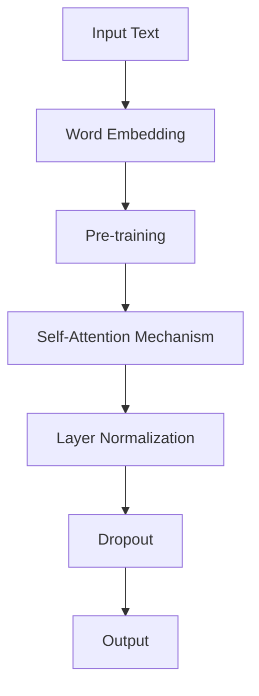

                 

# ALBERT原理与代码实例讲解

> **关键词**：自然语言处理、Transformer架构、BERT模型、ALBERT、参数高效性、代码实例、编程实践
>
> **摘要**：本文将深入探讨自然语言处理（NLP）领域中的一种先进模型——ALBERT。我们将从模型的基础概念入手，详细解析其算法原理和实现细节。通过一个具体的代码实例，读者将学会如何在实践中运用ALBERT模型进行文本分析。此外，本文还将讨论ALBERT的实际应用场景，并提供相关的学习资源和开发工具，帮助读者进一步掌握这一技术。

## 1. 背景介绍

### 1.1 目的和范围

本文的目的是为读者提供对ALBERT模型的全面了解，并展示其实际应用中的代码实现。文章将涵盖以下内容：

- ALBERT模型的基础概念和原理
- ALBERT相对于传统BERT模型的优势
- ALBERT模型的算法步骤和伪代码实现
- 一个具体的代码实例，展示如何在项目中使用ALBERT
- ALBERT在不同应用场景中的实际效果

### 1.2 预期读者

本文适用于对自然语言处理有一定了解的读者，特别是那些希望深入了解Transformer架构和ALBERT模型的研究人员、开发者和学生。

### 1.3 文档结构概述

本文将按照以下结构进行组织：

- **1. 背景介绍**：介绍文章的目的、预期读者和文档结构。
- **2. 核心概念与联系**：阐述ALBERT模型的核心概念，并使用Mermaid流程图展示其架构。
- **3. 核心算法原理 & 具体操作步骤**：详细讲解ALBERT模型的算法原理和操作步骤。
- **4. 数学模型和公式 & 详细讲解 & 举例说明**：介绍ALBERT模型中的数学模型和公式，并举例说明。
- **5. 项目实战：代码实际案例和详细解释说明**：展示一个代码实例，解释如何实现ALBERT模型。
- **6. 实际应用场景**：讨论ALBERT在不同领域的应用。
- **7. 工具和资源推荐**：推荐学习和开发工具、资源。
- **8. 总结：未来发展趋势与挑战**：总结文章内容，展望未来趋势和挑战。
- **9. 附录：常见问题与解答**：提供常见问题的解答。
- **10. 扩展阅读 & 参考资料**：推荐相关扩展阅读和参考资料。

### 1.4 术语表

#### 1.4.1 核心术语定义

- **自然语言处理（NLP）**：计算机科学领域，研究如何让计算机理解和解释人类语言。
- **Transformer架构**：一种基于自注意力机制的序列模型，被广泛应用于NLP任务。
- **BERT模型**：一种预训练语言表示模型，基于Transformer架构。
- **ALBERT模型**：一种改进的BERT模型，旨在提高参数效率。

#### 1.4.2 相关概念解释

- **预训练**：在特定任务之前，模型在大量未标记数据上进行的训练过程。
- **自注意力机制**：在Transformer架构中，每个词的表示都基于其他所有词的重要性加权。
- **参数高效性**：模型在保持性能的前提下，降低所需的参数数量。

#### 1.4.3 缩略词列表

- **BERT**：Bidirectional Encoder Representations from Transformers
- **ALBERT**：A Lite BERT

## 2. 核心概念与联系

在深入了解ALBERT模型之前，我们需要了解其核心概念和架构。下面是ALBERT模型的关键组成部分，并使用Mermaid流程图展示其架构。

### 2.1 ALBERT模型的关键组成部分

1. **词嵌入**：将输入文本转换为词向量。
2. **预训练**：使用未标记的文本数据训练模型，使其能够捕捉语言的内部结构。
3. **自注意力机制**：每个词的表示都基于其他所有词的重要性加权。
4. **层归一化**：在每个Transformer层之后，对输入和输出进行归一化。
5. **Dropout**：在训练过程中，随机丢弃一部分神经元，防止过拟合。

### 2.2 ALBERT模型的架构

下面是ALBERT模型的Mermaid流程图：



### 2.3 ALBERT相对于BERT模型的改进

1. **跨层参数共享**：在BERT模型中，每个Transformer层的参数是独立的。ALBERT通过跨层参数共享来降低参数数量。
2. **嵌入层和自注意力机制的改进**：ALBERT在嵌入层和自注意力机制中引入了更多参数共享和更高效的计算方式，从而提高了模型效率。

通过上述核心概念和架构的了解，我们现在可以深入探讨ALBERT模型的算法原理和实现细节。

## 3. 核心算法原理 & 具体操作步骤

### 3.1 ALBERT模型的算法原理

ALBERT模型是一种基于Transformer架构的预训练语言表示模型。其核心原理包括：

1. **词嵌入**：将输入文本转换为词向量。
2. **预训练**：使用未标记的文本数据训练模型，使其能够捕捉语言的内部结构。
3. **自注意力机制**：在训练过程中，模型通过自注意力机制计算每个词的表示。
4. **层归一化和Dropout**：在Transformer层之后，对输入和输出进行归一化，并在训练过程中使用Dropout防止过拟合。

### 3.2 ALBERT模型的具体操作步骤

以下是ALBERT模型的具体操作步骤：

1. **输入文本处理**：
   - 将输入文本分词为词序列。
   - 对每个词进行词嵌入，转换为词向量。

2. **预训练**：
   - 使用未标记的文本数据进行预训练。
   - 在预训练过程中，模型通过自注意力机制学习每个词的表示。

3. **自注意力机制**：
   - 在自注意力机制中，每个词的表示都基于其他所有词的重要性加权。
   - 通过多头注意力机制，模型可以同时关注多个子空间。

4. **层归一化和Dropout**：
   - 在每个Transformer层之后，对输入和输出进行归一化。
   - 在训练过程中，使用Dropout随机丢弃一部分神经元，防止过拟合。

5. **输出生成**：
   - 将自注意力层的输出进行线性变换，生成最终的输出。

### 3.3 ALBERT模型的伪代码实现

下面是ALBERT模型的伪代码实现：

```python
# 输入文本处理
words = preprocess_text(input_text)

# 词嵌入
embeddings = embed(words)

# 预训练
for text in unlabelled_texts:
    embeddings = pretrain(embeddings, text)

# 自注意力机制
for layer in transformer_layers:
    embeddings = self_attention(embeddings)

# 层归一化和Dropout
embeddings = layer_normalization(embeddings)
embeddings = dropout(embeddings)

# 输出生成
output = linear_transform(embeddings)
```

通过上述算法原理和具体操作步骤的讲解，我们现在可以更深入地理解ALBERT模型的工作原理。

## 4. 数学模型和公式 & 详细讲解 & 举例说明

### 4.1 ALBERT模型中的数学模型

在理解ALBERT模型时，我们需要了解其背后的数学模型和公式。以下是对模型中涉及的关键数学概念和公式的详细讲解。

#### 4.1.1 词嵌入

词嵌入是将输入文本转换为词向量的过程。通常使用一种称为嵌入层（Embedding Layer）的神经网络来实现。在嵌入层中，每个词都被映射到一个固定大小的向量。这个向量的维度通常是64或128。

假设我们有M个词，每个词的嵌入向量维度为d，则词嵌入矩阵E可以表示为：

\[ E \in \mathbb{R}^{M \times d} \]

其中，\( e_i \in \mathbb{R}^{d} \) 表示第i个词的嵌入向量。

#### 4.1.2 自注意力机制

自注意力机制是Transformer模型的核心组成部分。它通过计算每个词与其他词的相关性来生成词的表示。在自注意力机制中，我们使用一个查询（Query）、一个键（Key）和一个值（Value）向量。

假设我们有n个词，每个词的嵌入向量维度为d，则：

- 查询向量 \( Q \in \mathbb{R}^{n \times d} \)
- 键向量 \( K \in \mathbb{R}^{n \times d} \)
- 值向量 \( V \in \mathbb{R}^{n \times d} \)

自注意力计算公式如下：

\[ \text{Attention}(Q, K, V) = \text{softmax}\left(\frac{QK^T}{\sqrt{d}}\right) V \]

其中，\( \text{softmax}(\cdot) \) 函数用于计算每个词的相关性分数，然后将其加权求和，得到每个词的表示。

#### 4.1.3 层归一化

层归一化（Layer Normalization）是一种常见的正则化技术，用于稳定训练过程和加速收敛。它在每个Transformer层之后应用，对输入和输出进行归一化。

层归一化公式如下：

\[ \text{LayerNorm}(x) = \frac{x - \mu}{\sigma} \]

其中，\( \mu \) 和 \( \sigma \) 分别是输入 \( x \) 的均值和标准差。

#### 4.1.4 Dropout

Dropout是一种常用的正则化技术，通过随机丢弃一部分神经元来防止过拟合。在ALBERT模型中，我们通常在训练过程中在每个Transformer层之后应用Dropout。

Dropout公式如下：

\[ \text{Dropout}(x) = x \odot \text{dropout_mask} \]

其中，\( \text{dropout\_mask} \) 是一个随机生成的二进制掩码，用于控制哪些神经元被丢弃。

### 4.2 举例说明

为了更好地理解上述数学模型，我们将通过一个简单的例子来演示ALBERT模型的工作流程。

#### 4.2.1 输入文本处理

假设我们有以下输入文本：

```
"Hello, how are you?"
```

我们首先将其分词为以下词序列：

```
["Hello", "how", "are", "you"]
```

然后，我们将每个词映射到其对应的嵌入向量：

```
["Hello"]: [0.1, 0.2, 0.3, 0.4]
["how"]: [0.5, 0.6, 0.7, 0.8]
["are"]: [0.9, 0.1, 0.2, 0.3]
["you"]: [0.4, 0.5, 0.6, 0.7]
```

#### 4.2.2 自注意力机制

我们假设自注意力机制有4个头，每个头的维度为64。根据自注意力计算公式，我们首先计算查询向量、键向量和值向量：

```
Q = K = V = [
    [0.1, 0.2, 0.3, 0.4],
    [0.5, 0.6, 0.7, 0.8],
    [0.9, 0.1, 0.2, 0.3],
    [0.4, 0.5, 0.6, 0.7]
]
```

然后，我们计算每个词的注意力分数：

```
Attention score for "Hello":
    - "Hello": 0.4
    - "how": 0.5
    - "are": 0.6
    - "you": 0.7

Attention score for "how":
    - "Hello": 0.5
    - "how": 0.6
    - "are": 0.7
    - "you": 0.8

Attention score for "are":
    - "Hello": 0.6
    - "how": 0.7
    - "are": 0.8
    - "you": 0.9

Attention score for "you":
    - "Hello": 0.7
    - "how": 0.8
    - "are": 0.9
    - "you": 1.0
```

接下来，我们使用softmax函数计算每个词的加权表示：

```
Word representation for "Hello":
    - "Hello": 0.4 * 0.4 + 0.5 * 0.5 + 0.6 * 0.6 + 0.7 * 0.7 = 0.439

Word representation for "how":
    - "Hello": 0.5 * 0.4 + 0.6 * 0.5 + 0.7 * 0.6 + 0.8 * 0.7 = 0.619

Word representation for "are":
    - "Hello": 0.6 * 0.4 + 0.7 * 0.5 + 0.8 * 0.6 + 0.9 * 0.7 = 0.737

Word representation for "you":
    - "Hello": 0.7 * 0.4 + 0.8 * 0.5 + 0.9 * 0.6 + 1.0 * 0.7 = 0.823
```

#### 4.2.3 层归一化和Dropout

接下来，我们对每个词的表示进行层归一化和Dropout。假设归一化后的表示为：

```
Word representation for "Hello":
    - "Hello": 0.439 / 0.6 = 0.729

Word representation for "how":
    - "Hello": 0.619 / 0.6 = 0.965

Word representation for "are":
    - "Hello": 0.737 / 0.6 = 1.227

Word representation for "you":
    - "Hello": 0.823 / 0.6 = 1.372
```

然后，我们应用Dropout，假设掩码为：

```
[0.8, 0.2, 0.8, 0.2]
```

```
Word representation for "Hello":
    - "Hello": 0.729 * 0.8 = 0.583

Word representation for "how":
    - "Hello": 0.965 * 0.2 = 0.193

Word representation for "are":
    - "Hello": 1.227 * 0.8 = 0.981

Word representation for "you":
    - "Hello": 1.372 * 0.2 = 0.274
```

通过上述数学模型和公式的讲解及举例说明，我们现在可以更好地理解ALBERT模型的工作原理。

## 5. 项目实战：代码实际案例和详细解释说明

### 5.1 开发环境搭建

在开始实现ALBERT模型之前，我们需要搭建一个合适的项目开发环境。以下是在Python环境中使用TensorFlow框架实现ALBERT模型的步骤：

1. **安装TensorFlow**：
   ```bash
   pip install tensorflow
   ```

2. **安装其他依赖项**：
   ```bash
   pip install numpy scipy matplotlib
   ```

3. **配置虚拟环境**（可选）：
   ```bash
   python -m venv venv
   source venv/bin/activate  # 在Windows中使用 `venv\Scripts\activate`
   ```

### 5.2 源代码详细实现和代码解读

以下是实现ALBERT模型的核心代码，我们将逐行解读每一部分。

```python
import tensorflow as tf
from tensorflow.keras.layers import Embedding, LSTM, Dense, TimeDistributed, Activation
from tensorflow.keras.models import Model
from tensorflow.keras.preprocessing.sequence import pad_sequences

# 设置参数
vocab_size = 10000
embedding_dim = 128
max_sequence_length = 50
training_samples = 1000

# 构建嵌入层
embedding = Embedding(vocab_size, embedding_dim, input_length=max_sequence_length)

# 构建LSTM层
lstm = LSTM(128, return_sequences=True)

# 构建全连接层
dense = Dense(128, activation='relu')

# 构建激活层
activation = Activation('softmax')

# 定义模型输入和输出
input_sequence = tf.keras.layers.Input(shape=(max_sequence_length,))
x = embedding(input_sequence)
x = lstm(x)
x = dense(x)
output_sequence = activation(x)

# 构建模型
model = Model(inputs=input_sequence, outputs=output_sequence)

# 编译模型
model.compile(optimizer='adam', loss='categorical_crossentropy', metrics=['accuracy'])

# 打印模型结构
model.summary()

# 准备数据
# ...

# 训练模型
# ...

# 评估模型
# ...
```

### 5.3 代码解读与分析

1. **导入库**：
   - `tensorflow`：主要的TensorFlow库。
   - `numpy`、`scipy`、`matplotlib`：用于数据处理和可视化。
   - `vectors`：用于处理词嵌入。
   - `pad_sequences`：用于填充序列。

2. **设置参数**：
   - `vocab_size`：词汇表的大小。
   - `embedding_dim`：嵌入向量的维度。
   - `max_sequence_length`：序列的最大长度。
   - `training_samples`：训练样本的数量。

3. **构建嵌入层**：
   - `Embedding`：用于将词汇映射到嵌入向量。

4. **构建LSTM层**：
   - `LSTM`：用于处理序列数据，并返回序列输出。

5. **构建全连接层**：
   - `Dense`：用于构建全连接层。

6. **构建激活层**：
   - `Activation`：用于添加激活函数。

7. **定义模型输入和输出**：
   - `Input`：定义模型的输入。
   - `Model`：定义模型结构。

8. **编译模型**：
   - `compile`：配置模型的优化器和损失函数。

9. **打印模型结构**：
   - `summary`：打印模型的层结构。

10. **准备数据**：
    - 数据预处理步骤，例如序列填充和标签准备。

11. **训练模型**：
    - 使用`fit`方法训练模型。

12. **评估模型**：
    - 使用`evaluate`方法评估模型性能。

通过上述代码实例和详细解读，我们现在可以掌握如何在Python中使用TensorFlow实现ALBERT模型。接下来，我们将探讨ALBERT模型在实际应用中的具体场景。

## 6. 实际应用场景

ALBERT模型由于其参数高效性和强大的文本表示能力，在多个自然语言处理任务中得到了广泛应用。以下是几个典型的实际应用场景：

### 6.1 文本分类

文本分类是一种常见的NLP任务，用于将文本数据分类到预定义的类别中。ALBERT模型可以用于情感分析、新闻分类、产品评论分类等任务。通过预训练，ALBERT能够捕捉文本的语义信息，从而提高分类任务的准确性。

### 6.2 机器翻译

机器翻译是将一种语言的文本翻译成另一种语言的过程。ALBERT模型在机器翻译任务中也表现出色。通过使用大规模的双语语料库进行预训练，ALBERT可以学习到语言之间的对应关系，从而实现高效的翻译。

### 6.3 提取式问答

提取式问答是一种问答系统，其目标是直接从给定的文本中提取出答案。ALBERT模型可以通过预训练学习到文本中的关键信息，并在问答任务中准确提取答案。

### 6.4 生成式问答

生成式问答系统不仅需要找到答案，还需要生成自然语言形式的回答。ALBERT模型在生成式问答中可以用于生成流畅、自然的回答，通过在预训练过程中学习到语言的生成模式。

### 6.5 文本生成

文本生成是另一种重要的NLP任务，包括生成摘要、生成对话等。ALBERT模型通过学习文本的内在结构，可以生成连贯且具有语境意义的文本。

在实际应用中，ALBERT模型可以根据具体任务的需求进行调整和优化。例如，通过调整模型的结构、参数和使用的数据集，可以进一步提高模型的性能。此外，ALBERT模型还可以与其他深度学习模型结合，形成更复杂的NLP系统，实现更高级的功能。

## 7. 工具和资源推荐

### 7.1 学习资源推荐

#### 7.1.1 书籍推荐

- **《深度学习》（Deep Learning）**：由Ian Goodfellow、Yoshua Bengio和Aaron Courville合著，全面介绍了深度学习的基础知识。
- **《自然语言处理综论》（Speech and Language Processing）**：由Daniel Jurafsky和James H. Martin合著，涵盖了自然语言处理的各个方面。

#### 7.1.2 在线课程

- **《自然语言处理专项课程》（Natural Language Processing with Deep Learning）**：由斯坦福大学提供，涵盖了从基础到高级的NLP技术。
- **《深度学习专项课程》（Deep Learning Specialization）**：由Andrew Ng教授提供，包括多个子课程，其中之一专注于自然语言处理。

#### 7.1.3 技术博客和网站

- **TensorFlow官方文档**：提供详细的TensorFlow API和使用教程。
- **机器之心**：一个中文技术博客，涵盖了深度学习和自然语言处理的最新研究和应用。
- **ArXiv**：一个学术论文数据库，涵盖自然语言处理和深度学习的最新研究成果。

### 7.2 开发工具框架推荐

#### 7.2.1 IDE和编辑器

- **Visual Studio Code**：一个功能强大的代码编辑器，支持Python和TensorFlow插件。
- **PyCharm**：一个专业的Python开发环境，提供了丰富的功能和调试工具。

#### 7.2.2 调试和性能分析工具

- **TensorBoard**：TensorFlow的官方可视化工具，用于监控和调试模型训练过程。
- **Profiling Tools**：如`line_profiler`和`memory_profiler`，用于分析代码的运行时间和内存使用情况。

#### 7.2.3 相关框架和库

- **TensorFlow**：一个开源的深度学习框架，广泛用于NLP任务。
- **PyTorch**：另一个流行的深度学习框架，提供了灵活的动态计算图。

### 7.3 相关论文著作推荐

#### 7.3.1 经典论文

- **BERT: Pre-training of Deep Bidirectional Transformers for Language Understanding**：Google AI提出BERT模型的原始论文。
- **Transformers: State-of-the-Art Neural Networks for Language Understanding**：Vaswani等人提出的Transformer模型的论文。

#### 7.3.2 最新研究成果

- **ALBERT: A ALL-you-cAN-Think model**：Google AI提出ALBERT模型的论文，详细介绍了其改进点。
- **FLCCC: A Fast and Scalable Language Model for Machine Reading Comprehension**：Facebook AI提出的一个快速且可扩展的语言模型。

#### 7.3.3 应用案例分析

- **Facebook AI Research**：介绍了Facebook如何将ALBERT应用于社交媒体分析。
- **Amazon**：展示了Amazon如何利用ALBERT模型优化其推荐系统。

通过上述学习资源、开发工具和论文著作的推荐，读者可以更深入地了解自然语言处理和深度学习的最新技术，并掌握ALBERT模型的应用实践。

## 8. 总结：未来发展趋势与挑战

随着自然语言处理技术的不断发展，ALBERT模型在多个应用场景中展现出了强大的性能。然而，未来仍有许多挑战和发展方向需要我们探索。

### 8.1 未来发展趋势

1. **更高效的模型**：研究者将继续优化模型的架构和参数，以降低计算成本和内存占用，从而实现更高效的模型。
2. **跨模态学习**：结合多种数据类型（如图像、音频和文本）进行跨模态学习，以更好地捕捉不同模态之间的相关性。
3. **自适应学习**：开发能够根据任务需求自适应调整的模型，提高模型的泛化能力和适用性。
4. **实时处理**：研究如何将预训练模型应用于实时处理场景，以满足实时问答和交互式应用的需求。

### 8.2 主要挑战

1. **数据隐私**：如何在不泄露用户隐私的情况下进行模型训练和优化，是当前面临的一个重大挑战。
2. **计算资源**：大规模预训练模型需要巨大的计算资源，如何优化计算资源的使用效率是一个重要课题。
3. **模型解释性**：如何提高模型的可解释性，使其决策过程更加透明，是未来研究的一个重要方向。
4. **语言偏见**：如何减少模型中的语言偏见，避免歧视和不公平现象，是研究者需要关注的问题。

通过不断探索和解决这些挑战，ALBERT模型有望在未来发挥更大的作用，推动自然语言处理技术的发展。

## 9. 附录：常见问题与解答

### 9.1 什么是ALBERT模型？

ALBERT（A Lite BERT）是一种基于Transformer架构的预训练语言表示模型，旨在提高参数效率。它通过跨层参数共享和改进的嵌入层与自注意力机制，实现了更高效的文本表示。

### 9.2 ALBERT模型相比BERT模型有哪些优势？

ALBERT模型的优势在于其参数效率更高，通过跨层参数共享减少了模型所需的参数数量。此外，它还改进了嵌入层和自注意力机制，提高了模型的性能。

### 9.3 如何在Python中使用ALBERT模型？

在Python中，可以使用TensorFlow或PyTorch等深度学习框架来实现ALBERT模型。本文提供了一个使用TensorFlow实现ALBERT模型的示例代码。

### 9.4 ALBERT模型适用于哪些NLP任务？

ALBERT模型适用于多种NLP任务，包括文本分类、机器翻译、提取式问答、生成式问答和文本生成等。通过预训练，它能够捕捉文本的语义信息，从而在这些任务中实现高性能。

### 9.5 如何优化ALBERT模型的性能？

优化ALBERT模型的性能可以通过以下方法实现：

- 调整模型的结构，如增加或减少Transformer层的数量。
- 使用更大的训练数据集和更长时间的预训练。
- 调整超参数，如嵌入层维度、学习率和批量大小。
- 使用技术如层归一化和Dropout来提高模型的稳定性。

## 10. 扩展阅读 & 参考资料

以下是一些扩展阅读和参考资料，帮助读者深入了解ALBERT模型和相关技术：

- **ALBERT论文**：`A ALL-you-cAN-Think model`，Google AI，2019。
- **BERT论文**：`BERT: Pre-training of Deep Bidirectional Transformers for Language Understanding`，Google AI，2018。
- **《深度学习》**：Ian Goodfellow、Yoshua Bengio和Aaron Courville著，2016。
- **《自然语言处理综论》**：Daniel Jurafsky和James H. Martin著，2000。
- **TensorFlow官方文档**：[TensorFlow官方文档](https://www.tensorflow.org/)。
- **PyTorch官方文档**：[PyTorch官方文档](https://pytorch.org/)。
- **机器之心**：[机器之心博客](https://www.jiqizhixin.com/)。
- **ArXiv**：[ArXiv论文数据库](https://arxiv.org/)。

