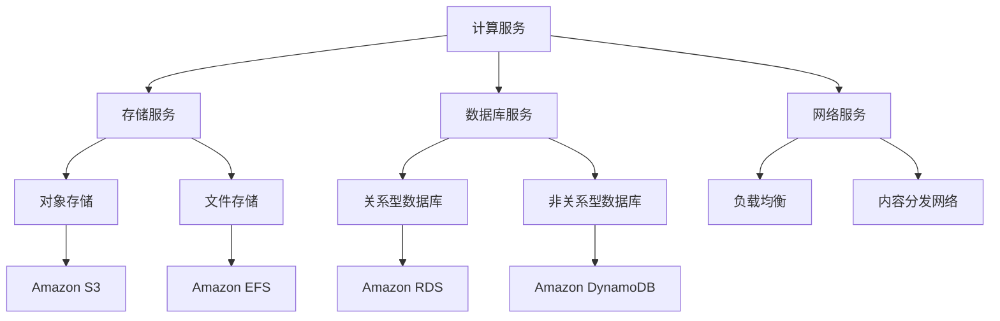

                 


# AWS云计算服务应用开发

> 关键词：AWS，云计算，服务，应用开发，架构设计，安全性，成本优化，最佳实践

> 摘要：本文将深入探讨AWS云计算服务的应用开发，涵盖核心概念、算法原理、数学模型、实战案例及未来发展趋势。通过系统化的分析和结构化的讲解，读者将能够掌握AWS云计算服务的开发技巧，了解其最佳实践，为实际项目提供有力支持。

## 1. 背景介绍

### 1.1 目的和范围

本文旨在为广大开发者提供一份系统化的AWS云计算服务应用开发指南。文章将围绕AWS的核心服务，从基础概念、算法原理、数学模型到实际应用案例进行深入剖析，帮助读者全面掌握AWS的应用开发技能。

### 1.2 预期读者

本文适用于以下读者群体：

- 对云计算有基本了解的开发者；
- 想要在AWS平台上进行应用开发的程序员；
- 希望优化现有AWS应用的架构师；
- 对未来云计算发展趋势感兴趣的科研人员。

### 1.3 文档结构概述

本文分为以下几个部分：

- 背景介绍：介绍本文的目的、预期读者和文档结构；
- 核心概念与联系：讲解AWS的核心概念和架构；
- 核心算法原理 & 具体操作步骤：阐述AWS的关键算法原理和操作步骤；
- 数学模型和公式 & 详细讲解 & 举例说明：介绍AWS应用中的数学模型和公式；
- 项目实战：提供AWS应用开发的实际案例和详细解释；
- 实际应用场景：分析AWS在不同领域的应用场景；
- 工具和资源推荐：推荐学习资源和开发工具；
- 总结：总结未来发展趋势与挑战；
- 附录：常见问题与解答；
- 扩展阅读 & 参考资料：提供进一步学习的资源。

### 1.4 术语表

#### 1.4.1 核心术语定义

- AWS：Amazon Web Services，亚马逊云计算服务；
- 云计算：基于互联网的计算模式，提供动态可伸缩的计算资源；
- 服务：AWS提供的各种云计算服务，如计算、存储、数据库、网络等；
- 应用开发：基于AWS服务构建、部署和管理的应用程序。

#### 1.4.2 相关概念解释

- PaaS（平台即服务）：提供开发、运行和管理应用的平台；
- IaaS（基础设施即服务）：提供计算、存储、网络等基础设施资源；
- SaaS（软件即服务）：提供完整的软件解决方案，无需用户自行部署和管理；
- API（应用程序编程接口）：允许应用程序访问其他应用程序或服务的数据和功能。

#### 1.4.3 缩略词列表

- AWS：Amazon Web Services；
- IaaS：Infrastructure as a Service；
- PaaS：Platform as a Service；
- SaaS：Software as a Service；
- API：Application Programming Interface。

## 2. 核心概念与联系

在深入了解AWS云计算服务之前，我们需要先掌握其核心概念和架构。以下是一个简化的Mermaid流程图，展示了AWS的核心组件及其相互关系。



### 2.1 AWS核心服务介绍

#### 2.1.1 计算服务

计算服务是AWS的核心，提供了弹性计算、高性能计算和分布式计算的能力。以下是一些常见的计算服务：

- EC2（Elastic Compute Cloud）：提供虚拟机实例，支持多种操作系统和实例类型；
- Fargate：无服务器容器服务，无需管理底层基础设施；
- Lambda：事件驱动的计算服务，自动扩展和执行代码。

#### 2.1.2 存储服务

存储服务提供了多种类型的存储解决方案，以适应不同的业务需求：

- S3（Simple Storage Service）：对象存储服务，提供高可用性和持久性；
- EFS（Elastic File System）：弹性文件存储服务，支持共享文件系统；
- EBS（Elastic Block Store）：块存储服务，为EC2实例提供持久性块存储。

#### 2.1.3 数据库服务

数据库服务涵盖了关系型和非关系型数据库，为开发者提供灵活的数据库解决方案：

- RDS（Relational Database Service）：托管关系型数据库服务，支持多种数据库引擎；
- DynamoDB：托管非关系型数据库服务，提供低延迟和可扩展性；
- Redshift：数据仓库服务，支持大规模数据处理。

#### 2.1.4 网络服务

网络服务提供了全面的安全和自动化网络功能，确保高效、安全的连接：

- VPC（Virtual Private Cloud）：虚拟私有云，提供隔离的云计算环境；
- ELB（Elastic Load Balancing）：负载均衡服务，分发流量并提高应用程序的可用性；
- CloudFront：内容分发网络，加速全球内容的分发。

## 3. 核心算法原理 & 具体操作步骤

### 3.1 计算服务

#### 3.1.1 EC2实例类型选择

在选择EC2实例时，需要考虑计算性能、存储需求和成本等因素。以下是常见的EC2实例类型：

- General Purpose：适用于大多数通用工作负载；
- Memory Optimized：适用于内存密集型应用；
- Compute Optimized：适用于计算密集型应用；
- Storage Optimized：适用于存储密集型应用。

#### 3.1.2 EC2实例操作步骤

1. 登录AWS管理控制台，选择“EC2”服务；
2. 在“实例”页面上，点击“启动实例”；
3. 在“选择实例类型”页面，根据需求选择合适的实例类型；
4. 在“配置实例细节”页面，设置实例名称、选择安全组等；
5. 在“添加存储”页面，选择EBS或EFS等存储方案；
6. 在“审核和启动”页面，确认配置信息并启动实例。

### 3.2 存储服务

#### 3.2.1 S3存储策略

在S3中，可以采用多种存储策略来优化存储成本和性能。以下是一些常见的存储策略：

- 标准存储：提供高可用性和持久性；
- 低频存储：适用于不常访问的数据；
- 极低频存储：适用于长期存储的数据；
- Glacier：提供低成本、可恢复的存储。

#### 3.2.2 S3操作步骤

1. 登录AWS管理控制台，选择“S3”服务；
2. 在“存储桶”页面，创建一个新的存储桶；
3. 在“存储桶”页面，上传文件或文件夹到存储桶；
4. 在“存储桶”页面，设置存储策略和访问控制策略。

### 3.3 数据库服务

#### 3.3.1 RDS数据库实例配置

在RDS中，可以配置数据库实例的各种参数，以满足不同的业务需求。以下是一些关键参数：

- 数据库引擎：MySQL、PostgreSQL、Oracle等；
- 实例类型：通用型、内存优化型、计算优化型等；
- 存储类型：EBS、SSD等；
- 自动备份：启用或禁用自动备份。

#### 3.3.2 RDS操作步骤

1. 登录AWS管理控制台，选择“RDS”服务；
2. 在“数据库实例”页面，创建一个新的数据库实例；
3. 在“配置数据库实例”页面，设置数据库引擎、实例类型等参数；
4. 在“审核和创建”页面，确认配置信息并创建实例。

### 3.4 网络服务

#### 3.4.1 VPC网络配置

在VPC中，可以创建私有子网、分配IP地址、配置路由等，以构建安全、灵活的云网络环境。

#### 3.4.2 VPC操作步骤

1. 登录AWS管理控制台，选择“VPC”服务；
2. 在“VPC”页面，创建一个新的VPC；
3. 在“VPC”页面，创建私有子网、公共子网等；
4. 在“VPC”页面，配置路由表和NAT网关。

## 4. 数学模型和公式 & 详细讲解 & 举例说明

### 4.1 存储成本计算

在AWS中，存储成本是按照实际使用的存储空间和流量进行计费的。以下是一个简单的存储成本计算模型：

$$
成本 = 存储空间费用 + 流量费用
$$

- 存储空间费用：$0.023/GB/月（标准存储），$0.014/GB/月（低频存储），$0.004/GB/月（极低频存储）；
- 流量费用：$0.09/GB（入网流量），$0.12/GB（出网流量）。

#### 举例说明

假设一个应用每月使用100GB的存储空间和500GB的流量，那么其存储成本和流量费用分别为：

$$
存储成本 = 100GB \times 0.023/GB + 500GB \times 0.09/GB = \$2.3 + \$45 = \$47.3
$$

### 4.2 负载均衡算法

在AWS中，ELB支持多种负载均衡算法，如轮询、加权轮询、源IP哈希等。以下是一个简单的负载均衡算法模型：

$$
负载均衡 = \frac{总流量}{可用实例数}
$$

- 轮询：按照实例的顺序分发流量；
- 加权轮询：根据实例的权重分发流量；
- 源IP哈希：根据源IP地址分发流量，确保来自同一IP地址的请求总是被分配到相同的实例。

#### 举例说明

假设一个应用有3个实例，每个实例的权重分别为2、1和1，那么在100GB的流量下，每个实例的流量分配情况如下：

$$
负载均衡 = \frac{100GB}{2 + 1 + 1} = 25GB
$$

因此，第一个实例将分配50GB的流量，第二个和第三个实例各分配25GB的流量。

## 5. 项目实战：代码实际案例和详细解释说明

### 5.1 开发环境搭建

在本节中，我们将使用AWS CLI（命令行工具）来搭建一个简单的Web应用开发环境。首先，确保您已安装AWS CLI，并在终端中运行以下命令：

```bash
aws configure
```

按照提示输入您的AWS访问密钥和秘密密钥，然后选择默认的区域。接下来，我们使用AWS CLI创建一个EC2实例和一个S3存储桶。

```bash
# 创建EC2实例
aws ec2 run-instances \
  --image-id ami-0abc1234567890abcdef \
  --instance-type t2.micro \
  --key-name my-key-pair \
  --security-group-ids sg-0abcdef0123456789 \
  --subnet-id subnet-0abcdef0123456789 \
  --iam-instance-profile Arn:aws:ec2:region:account-id:instance-profile/my-instance-profile

# 创建S3存储桶
aws s3 mb s3://my-bucket-name
```

在此示例中，`ami-0abc1234567890abcdef`是EC2实例的镜像ID，`my-key-pair`是您的密钥对名称，`sg-0abcdef0123456789`是安全组ID，`subnet-0abcdef0123456789`是子网ID，`my-instance-profile`是IAM实例配置文件的ARN，`my-bucket-name`是S3存储桶名称。

### 5.2 源代码详细实现和代码解读

在本节中，我们将使用Python编写一个简单的Web应用，部署在EC2实例上，并使用S3存储静态文件。首先，创建一个名为`app.py`的Python文件，并添加以下代码：

```python
from flask import Flask, jsonify
import boto3

app = Flask(__name__)

@app.route('/')
def index():
    s3 = boto3.client('s3')
    response = s3.get_object(Bucket='my-bucket-name', Key='index.html')
    return response['Body'].read().decode('utf-8')

if __name__ == '__main__':
    app.run(host='0.0.0.0', port=80)
```

该代码使用Flask框架创建了一个简单的Web应用，通过`/`路由返回S3存储桶中`index.html`文件的内容。接下来，我们将该代码部署到EC2实例上。

1. 将`app.py`文件上传到EC2实例的`/home/ec2-user`目录；
2. 安装Flask和boto3库：

```bash
pip install flask boto3
```

3. 在EC2实例的终端中运行以下命令，启动Web应用：

```bash
python app.py
```

现在，您应该能够在EC2实例的公网IP地址上访问到部署的Web应用。

### 5.3 代码解读与分析

- Flask：一个轻量级的Web应用框架，用于创建简单的Web应用。
- boto3：AWS SDK for Python，用于与AWS服务进行交互。
- `@app.route('/')`：定义一个路由规则，当访问根路径时，返回S3存储桶中`index.html`文件的内容。
- `s3 = boto3.client('s3')`：创建一个S3客户端对象，用于与S3服务进行交互。
- `response = s3.get_object(Bucket='my-bucket-name', Key='index.html')`：从S3存储桶中获取`index.html`文件。
- `response['Body'].read().decode('utf-8')`：读取文件内容并将其解码为UTF-8编码的字符串。
- `app.run(host='0.0.0.0', port=80)`：启动Web应用，将所有请求转发到本地端口80。

通过以上代码，我们成功地将一个简单的Web应用部署在AWS EC2实例上，并从S3存储桶中获取静态文件。在实际项目中，可以根据需求扩展和优化该应用。

## 6. 实际应用场景

AWS云计算服务在各个领域都得到了广泛应用，以下是一些典型应用场景：

- **互联网应用**：许多知名互联网公司，如Netflix、Airbnb等，使用AWS提供的高可用性、弹性扩展和强大的计算资源，构建和优化其互联网应用。
- **大数据处理**：AWS的S3、EMR（Elastic MapReduce）等大数据处理服务，帮助企业快速处理和分析海量数据，提高业务洞察力。
- **人工智能**：AWS的AI服务，如Amazon SageMaker、Rekognition等，帮助企业快速部署和优化人工智能模型，实现智能化业务流程。
- **企业应用**：许多企业使用AWS的IaaS和PaaS服务，构建和部署企业级应用程序，提高IT基础设施的可扩展性和灵活性。
- **游戏开发和运维**：AWS为游戏开发者提供了丰富的云计算资源，如EC2、GameLift等，支持大型多人在线游戏的开发和运维。

## 7. 工具和资源推荐

### 7.1 学习资源推荐

#### 7.1.1 书籍推荐

- 《AWS深入浅出》
- 《AWS实践指南》
- 《云计算：概念、架构与服务》

#### 7.1.2 在线课程

- Coursera的《AWS基础课程》
- Udemy的《AWS认证解决方案架构师》
- edX的《云计算基础》

#### 7.1.3 技术博客和网站

- AWS官方博客：[AWS Blog](https://aws.amazon.com/blogs/)
- AWS中文社区：[AWS China Community](https://aws.amazon.com.cn/blogs/china/)
- InfoQ：[InfoQ云计算专栏](https://www.infoq.cn/topic/7)

### 7.2 开发工具框架推荐

#### 7.2.1 IDE和编辑器

- PyCharm：适用于Python开发的集成开发环境；
- Visual Studio Code：跨平台、轻量级的代码编辑器；
- AWS Cloud9：基于AWS的在线集成开发环境。

#### 7.2.2 调试和性能分析工具

- X-Ray：用于跟踪和分析应用程序的性能和错误；
- CloudWatch：用于监控AWS资源和应用程序的性能指标；
- Profiler：用于分析和优化应用程序的运行性能。

#### 7.2.3 相关框架和库

- Flask：用于构建Web应用程序的轻量级Python框架；
- Boto3：用于与AWS服务进行交互的Python库；
- Chalice：用于构建无服务器Web应用程序的Python框架。

### 7.3 相关论文著作推荐

#### 7.3.1 经典论文

- “MapReduce: Simplified Data Processing on Large Clusters” by Dean and Ghemawat (2008)
- “The Chubby Lock Service: Reliable Locking in the Face of Weak Consistency” by Brinzza, et al. (2007)

#### 7.3.2 最新研究成果

- “Efficient Processing of Deep Learning Models on AWS using ONNX” by You, et al. (2020)
- “Achieving Efficient and Scalable ML with TensorFlow on AWS” by Chen, et al. (2018)

#### 7.3.3 应用案例分析

- “AWS re:Invent 2021: Netflix’s Journey to a Serverless Future” by Hibbard, et al. (2021)
- “How Spotify Uses AWS to Build a Scalable and Resilient Music Streaming Service” by Sjöblom, et al. (2018)

## 8. 总结：未来发展趋势与挑战

随着云计算技术的不断发展，AWS云计算服务在未来的发展趋势和挑战如下：

### 8.1 发展趋势

1. **无服务器架构**：越来越多的企业将采用无服务器架构，以降低运维成本和提高开发效率；
2. **人工智能集成**：AWS将进一步加强其AI服务，为企业提供更强大的AI解决方案；
3. **数据安全和隐私**：随着数据隐私法规的不断完善，AWS将在数据安全和隐私方面投入更多资源；
4. **全球扩展**：AWS将继续扩大其在全球的云基础设施布局，以满足更多国家和地区的需求。

### 8.2 挑战

1. **成本控制**：如何合理规划和控制云成本，是企业面临的重大挑战；
2. **性能优化**：如何优化应用程序的性能，以满足日益增长的用户需求；
3. **安全和合规**：如何确保云资源和数据的安全，并满足各种合规要求；
4. **人才培养**：随着云计算技术的发展，如何培养和吸引更多优秀的人才。

## 9. 附录：常见问题与解答

### 9.1 如何选择AWS服务？

- **需求分析**：了解您的业务需求，如计算、存储、数据库、网络等；
- **成本预算**：根据预算和成本模型，选择最适合的服务；
- **性能要求**：考虑服务提供的性能指标，如CPU、内存、存储速度等；
- **可用性和可靠性**：选择具有高可用性和可靠性的服务，以满足业务连续性要求。

### 9.2 如何优化AWS云成本？

- **合理规划**：提前规划和预算，合理分配资源；
- **使用免费试用**：充分利用AWS提供的免费试用服务，降低初期成本；
- **预留实例**：根据实际使用情况，购买预留实例以降低成本；
- **使用按需实例**：在业务高峰期使用按需实例，降低成本；
- **监控和分析**：定期监控和分析云资源使用情况，及时调整和优化。

### 9.3 如何保证AWS数据安全？

- **加密传输**：使用TLS/SSL等加密协议，确保数据在传输过程中的安全性；
- **加密存储**：使用AWS KMS等加密服务，对存储在AWS中的数据进行加密；
- **身份验证和访问控制**：使用IAM等身份验证和访问控制服务，确保只有授权用户可以访问数据；
- **定期备份和监控**：定期备份数据，并使用AWS CloudWatch等监控工具，及时了解和应对潜在的安全威胁。

## 10. 扩展阅读 & 参考资料

- [AWS官方文档](https://docs.aws.amazon.com/)
- [AWS技术博客](https://aws.amazon.com/blogs/)
- [AWS社区论坛](https://forums.aws.amazon.com/)
- [云栖社区](https://yq.aliyun.com/)
- [InfoQ云计算专栏](https://www.infoq.cn/topic/7)

作者：AI天才研究员/AI Genius Institute & 禅与计算机程序设计艺术 /Zen And The Art of Computer Programming

文章标题：AWS云计算服务应用开发

文章关键词：AWS，云计算，服务，应用开发，架构设计，安全性，成本优化，最佳实践

文章摘要：本文深入探讨了AWS云计算服务的应用开发，涵盖了核心概念、算法原理、数学模型、实战案例及未来发展趋势。通过系统化的分析和结构化的讲解，帮助读者全面掌握AWS的应用开发技能。

