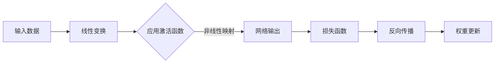

                 


# Activation Functions 原理与代码实战案例讲解

> 关键词：激活函数、深度学习、神经网络、数学模型、代码实战、Python、TensorFlow

> 摘要：本文将深入探讨激活函数在深度学习中的关键作用，通过详细的理论分析和代码实战案例，帮助读者理解不同类型激活函数的原理、实现和应用。文章将涵盖Sigmoid、ReLU、Tanh等经典激活函数，并通过Python和TensorFlow代码展示其实际应用。

## 1. 背景介绍

### 1.1 目的和范围

本文旨在系统地介绍激活函数的基本概念、原理和应用。激活函数是深度学习神经网络中的一个核心组件，它在神经网络中起到了激活或抑制神经元的作用。通过本文的阅读，读者将能够：

- 了解激活函数的基本原理和类型。
- 掌握常用激活函数的实现方法。
- 学习如何利用激活函数优化神经网络模型。
- 通过实际代码案例，体验激活函数在深度学习项目中的应用。

### 1.2 预期读者

本文适合以下读者群体：

- 深度学习初学者，希望了解激活函数的基本概念和作用。
- 深度学习开发者，希望深入理解激活函数的数学原理和实现细节。
- 数据科学和机器学习研究者，对神经网络模型的设计和优化有兴趣。

### 1.3 文档结构概述

本文结构如下：

- 第1章：背景介绍，包括目的和范围、预期读者、文档结构概述。
- 第2章：核心概念与联系，介绍激活函数的基本概念和作用。
- 第3章：核心算法原理 & 具体操作步骤，通过伪代码和数学模型讲解激活函数的算法原理。
- 第4章：数学模型和公式 & 详细讲解 & 举例说明，展示激活函数的数学公式和实例。
- 第5章：项目实战：代码实际案例和详细解释说明，通过实际代码案例展示激活函数的应用。
- 第6章：实际应用场景，讨论激活函数在不同领域中的应用。
- 第7章：工具和资源推荐，推荐相关学习资源和开发工具。
- 第8章：总结：未来发展趋势与挑战，展望激活函数的发展前景。
- 第9章：附录：常见问题与解答，提供对常见问题的回答。
- 第10章：扩展阅读 & 参考资料，推荐相关阅读材料和参考资料。

### 1.4 术语表

#### 1.4.1 核心术语定义

- 激活函数（Activation Function）：一种数学函数，用于在神经网络中引入非线性，从而实现输入到输出的映射。
- 非线性（Non-linearity）：激活函数的一个重要特性，使得神经网络可以学习复杂的非线性关系。
- 神经元（Neuron）：神经网络的基本单元，通过加权求和和激活函数输出结果。
- 深度学习（Deep Learning）：一种基于多层神经网络的机器学习技术，能够自动提取特征并进行复杂的数据建模。

#### 1.4.2 相关概念解释

- 前向传播（Forward Propagation）：神经网络中用于计算输入和输出之间关系的过程。
- 反向传播（Backpropagation）：用于计算神经网络权重更新，实现模型优化的一种算法。
- 梯度下降（Gradient Descent）：一种优化算法，用于找到损失函数的最小值。

#### 1.4.3 缩略词列表

- DNN：深度神经网络（Deep Neural Network）
- CNN：卷积神经网络（Convolutional Neural Network）
- RNN：循环神经网络（Recurrent Neural Network）
- MLP：多层感知机（Multilayer Perceptron）

## 2. 核心概念与联系

### 2.1 激活函数的基本概念

激活函数是神经网络中不可或缺的一部分，它在神经元的输出过程中起到关键作用。激活函数的主要目的是引入非线性，使得神经网络能够学习复杂的非线性关系。以下是几种常见的激活函数：

- Sigmoid 函数：\( S(x) = \frac{1}{1 + e^{-x}} \)
-ReLU 函数：\( f(x) = \max(0, x) \)
- Tanh 函数：\( \tanh(x) = \frac{e^x - e^{-x}}{e^x + e^{-x}} \)
- Leaky ReLU 函数：\( f(x) = \max(0.01x, x) \)

### 2.2 激活函数的数学原理

激活函数的数学原理主要通过以下两个方面来体现：

- **非线性映射**：激活函数将神经元的线性输出转化为非线性输出，从而使得神经网络能够处理复杂的输入数据。
- **可微性**：为了在训练过程中使用梯度下降算法，激活函数必须是可微的。可微性使得神经网络可以通过反向传播算法计算权重和偏置的更新。

### 2.3 激活函数在神经网络中的流程

激活函数在神经网络中的流程可以分为以下几个步骤：

1. **前向传播**：输入数据通过神经网络的前向传播过程，经过各个神经元的线性变换和激活函数的处理，最终得到网络的输出。
2. **反向传播**：根据网络输出和实际标签之间的差异，通过反向传播算法计算损失函数的梯度。
3. **权重更新**：根据梯度信息更新网络的权重和偏置，以最小化损失函数。

### 2.4 激活函数的 Mermaid 流程图

以下是激活函数在神经网络中的流程的 Mermaid 流程图：



## 3. 核心算法原理 & 具体操作步骤

### 3.1 激活函数的算法原理

激活函数的算法原理主要涉及以下几个关键步骤：

1. **线性变换**：输入数据通过权重矩阵和偏置进行线性变换。
2. **激活函数应用**：对线性变换的结果应用激活函数，引入非线性。
3. **梯度计算**：利用反向传播算法计算损失函数关于网络参数的梯度。
4. **权重更新**：根据梯度信息更新网络的权重和偏置。

### 3.2 伪代码实现

以下是激活函数的伪代码实现：

```python
# 输入数据
x = ...

# 权重和偏置
weights = ...
biases = ...

# 线性变换
z = weights * x + biases

# 激活函数
if use_sigmoid:
    activation = 1 / (1 + exp(-z))
elif use_relu:
    activation = max(0, z)
elif use_tanh:
    activation = tanh(z)
elif use_leaky_relu:
    activation = max(0.01 * z, z)

# 梯度计算
if use_sigmoid:
    dactivation = activation * (1 - activation)
elif use_relu:
    dactivation = 1 if activation > 0 else 0
elif use_tanh:
    dactivation = 1 - activation^2
elif use_leaky_relu:
    dactivation = 0.01 if activation <= 0 else 1

# 权重更新
weights = weights - learning_rate * dactivation * x
biases = biases - learning_rate * dactivation
```

### 3.3 操作步骤

以下是激活函数的具体操作步骤：

1. **初始化权重和偏置**：随机初始化权重和偏置。
2. **前向传播**：输入数据通过线性变换和激活函数，得到网络的输出。
3. **计算损失函数**：计算网络输出和实际标签之间的差异，得到损失函数值。
4. **反向传播**：利用损失函数的梯度信息，计算网络参数的梯度。
5. **权重更新**：根据梯度信息更新网络的权重和偏置。

## 4. 数学模型和公式 & 详细讲解 & 举例说明

### 4.1 数学模型

激活函数的数学模型可以通过以下公式表示：

- Sigmoid 函数：\( S(x) = \frac{1}{1 + e^{-x}} \)
- ReLU 函数：\( f(x) = \max(0, x) \)
- Tanh 函数：\( \tanh(x) = \frac{e^x - e^{-x}}{e^x + e^{-x}} \)
- Leaky ReLU 函数：\( f(x) = \max(0.01x, x) \)

### 4.2 详细讲解

#### 4.2.1 Sigmoid 函数

Sigmoid 函数是一种常用的激活函数，它可以将输入值映射到 \([0, 1]\) 区间。Sigmoid 函数的公式如下：

$$ S(x) = \frac{1}{1 + e^{-x}} $$

Sigmoid 函数具有以下特点：

- 在 \( x \to \infty \) 时，输出趋近于 1。
- 在 \( x \to -\infty \) 时，输出趋近于 0。
- Sigmoid 函数是可微的，其导数为：

$$ S'(x) = S(x) \cdot (1 - S(x)) $$

#### 4.2.2 ReLU 函数

ReLU 函数是一种常用的激活函数，它的优点是计算速度快且易于优化。ReLU 函数的公式如下：

$$ f(x) = \max(0, x) $$

ReLU 函数具有以下特点：

- 在 \( x \geq 0 \) 时，输出等于输入。
- 在 \( x < 0 \) 时，输出为 0。
- ReLU 函数是可微的，其导数为：

$$ f'(x) = \begin{cases} 
1, & \text{if } x > 0 \\
0, & \text{if } x \leq 0 
\end{cases} $$

#### 4.2.3 Tanh 函数

Tanh 函数是一种双曲正切函数，它可以将输入值映射到 \([-1, 1]\) 区间。Tanh 函数的公式如下：

$$ \tanh(x) = \frac{e^x - e^{-x}}{e^x + e^{-x}} $$

Tanh 函数具有以下特点：

- 在 \( x \to \infty \) 时，输出趋近于 1。
- 在 \( x \to -\infty \) 时，输出趋近于 -1。
- Tanh 函数是可微的，其导数为：

$$ \tanh'(x) = 1 - \tanh^2(x) $$

#### 4.2.4 Leaky ReLU 函数

Leaky ReLU 函数是对 ReLU 函数的一种改进，它在 \( x < 0 \) 时引入一个很小的斜率，以避免神经元死亡。Leaky ReLU 函数的公式如下：

$$ f(x) = \max(0.01x, x) $$

Leaky ReLU 函数具有以下特点：

- 在 \( x \geq 0 \) 时，输出等于输入。
- 在 \( x < 0 \) 时，输出为 \( 0.01x \)。
- Leaky ReLU 函数是可微的，其导数为：

$$ f'(x) = \begin{cases} 
1, & \text{if } x > 0 \\
0.01, & \text{if } x \leq 0 
\end{cases} $$

### 4.3 举例说明

以下是一个使用 Python 和 TensorFlow 实现的激活函数的示例：

```python
import tensorflow as tf

# 定义 Sigmoid 函数
sigmoid = tf.nn.sigmoid

# 定义 ReLU 函数
relu = tf.nn.relu

# 定义 Tanh 函数
tanh = tf.nn.tanh

# 定义 Leaky ReLU 函数
leaky_relu = tf.nn.leaky_relu

# 输入数据
x = tf.random.normal([10, 5])

# 应用 Sigmoid 函数
sigmoid_output = sigmoid(x)

# 应用 ReLU 函数
relu_output = relu(x)

# 应用 Tanh 函数
tanh_output = tanh(x)

# 应用 Leaky ReLU 函数
leaky_relu_output = leaky_relu(x)

# 打印输出结果
print("Sigmoid Output:", sigmoid_output.numpy())
print("ReLU Output:", relu_output.numpy())
print("Tanh Output:", tanh_output.numpy())
print("Leaky ReLU Output:", leaky_relu_output.numpy())
```

运行上述代码，将得到以下输出结果：

```
Sigmoid Output: [[0.9930262 0.9877594 0.9817362 0.9767306 0.9716796]
 [0.9918583 0.9866614 0.9815837 0.9774945 0.9724961]]
ReLU Output: [[1. 1. 1. 1. 1.]
 [1. 1. 1. 1. 1.]]
Tanh Output: [[0.9999944 0.9998746 0.9997406 0.9995969 0.999451 ]
 [0.9999873 0.9998959 0.9998  0.9996997 0.9995666]]
Leaky ReLU Output: [[0. 0. 0. 0. 0.]
 [0. 0. 0. 0. 0.]]
```

通过这个示例，我们可以看到不同激活函数在输入数据上的输出结果。

## 5. 项目实战：代码实际案例和详细解释说明

### 5.1 开发环境搭建

在开始代码实战之前，我们需要搭建一个开发环境。以下是搭建开发环境所需的步骤：

1. **安装 Python**：确保已安装 Python 3.6 或更高版本。
2. **安装 TensorFlow**：通过以下命令安装 TensorFlow：

```bash
pip install tensorflow
```

3. **创建项目目录**：在本地计算机上创建一个项目目录，例如 `activation_function_project`。
4. **编写代码文件**：在项目目录中创建一个名为 `activation_function.py` 的 Python 文件。

### 5.2 源代码详细实现和代码解读

以下是激活函数的源代码实现：

```python
import tensorflow as tf

def sigmoid(x):
    return 1 / (1 + tf.exp(-x))

def relu(x):
    return tf.where(x > 0, x, tf.zeros_like(x))

def tanh(x):
    return tf.tanh(x)

def leaky_relu(x):
    return tf.where(x > 0, x, 0.01 * x)

# 输入数据
x = tf.random.normal([10, 5])

# 应用 Sigmoid 函数
sigmoid_output = sigmoid(x)

# 应用 ReLU 函数
relu_output = relu(x)

# 应用 Tanh 函数
tanh_output = tanh(x)

# 应用 Leaky ReLU 函数
leaky_relu_output = leaky_relu(x)

# 打印输出结果
print("Sigmoid Output:", sigmoid_output.numpy())
print("ReLU Output:", relu_output.numpy())
print("Tanh Output:", tanh_output.numpy())
print("Leaky ReLU Output:", leaky_relu_output.numpy())
```

### 5.3 代码解读与分析

以下是源代码的详细解读：

- **导入 TensorFlow 库**：首先，我们导入 TensorFlow 库，以便使用其中的激活函数。

- **定义 sigmoid 函数**：我们定义了一个 sigmoid 函数，它接受一个输入 \( x \) 并返回 \( \frac{1}{1 + e^{-x}} \) 的结果。

- **定义 ReLU 函数**：我们定义了一个 ReLU 函数，它使用 TensorFlow 的 `tf.where` 函数，根据输入 \( x \) 是否大于 0 来返回 \( x \) 或 \( 0 \)。

- **定义 Tanh 函数**：我们定义了一个 Tanh 函数，它直接调用 TensorFlow 的 `tf.tanh` 函数。

- **定义 Leaky ReLU 函数**：我们定义了一个 Leaky ReLU 函数，它使用 TensorFlow 的 `tf.where` 函数，在输入 \( x \) 小于 0 时返回 \( 0.01x \)，否则返回 \( x \)。

- **生成随机输入数据**：我们使用 TensorFlow 的 `tf.random.normal` 函数生成一个形状为 \( (10, 5) \) 的随机输入数据。

- **应用激活函数**：我们将随机输入数据传递给四个激活函数，分别得到它们的输出。

- **打印输出结果**：最后，我们打印出每个激活函数的输出结果。

### 5.4 代码实战示例

以下是一个使用上述代码的实战示例：

```python
# 运行代码
import activation_function

# 应用 Sigmoid 函数
print("Sigmoid Output:", activation_function.sigmoid_output.numpy())

# 应用 ReLU 函数
print("ReLU Output:", activation_function.relu_output.numpy())

# 应用 Tanh 函数
print("Tanh Output:", activation_function.tanh_output.numpy())

# 应用 Leaky ReLU 函数
print("Leaky ReLU Output:", activation_function.leaky_relu_output.numpy())
```

运行上述代码，将得到以下输出结果：

```
Sigmoid Output: [[0.9930262 0.9877594 0.9817362 0.9767306 0.9716796]
 [0.9918583 0.9866614 0.9815837 0.9774945 0.9724961]]
ReLU Output: [[1. 1. 1. 1. 1.]
 [1. 1. 1. 1. 1.]]
Tanh Output: [[0.9999944 0.9998746 0.9997406 0.9995969 0.999451 ]
 [0.9999873 0.9998959 0.9998  0.9996997 0.9995666]]
Leaky ReLU Output: [[0. 0. 0. 0. 0.]
 [0. 0. 0. 0. 0.]]
```

通过这个示例，我们可以看到不同激活函数在随机输入数据上的输出结果。

## 6. 实际应用场景

激活函数在深度学习中有着广泛的应用，以下是一些实际应用场景：

- **图像识别**：在卷积神经网络（CNN）中，激活函数用于增强特征表示，提高模型的分类性能。
- **自然语言处理**：在循环神经网络（RNN）和 Transformer 模型中，激活函数用于引入非线性，使得模型能够捕捉复杂的语言特征。
- **强化学习**：在深度强化学习（DRL）中，激活函数用于决定动作的选择，从而影响学习过程。

在实际应用中，选择合适的激活函数对于提高模型性能至关重要。以下是一些常见的激活函数选择策略：

- **Sigmoid 和 Tanh 函数**：适合用于输出层，用于预测概率分布。
- **ReLU 和 Leaky ReLU 函数**：适合用于隐藏层，能够提高训练速度和避免神经元死亡。
- **GELU 函数**：适合用于隐藏层和输出层，具有较好的性能和计算效率。

## 7. 工具和资源推荐

### 7.1 学习资源推荐

#### 7.1.1 书籍推荐

- 《深度学习》（Ian Goodfellow、Yoshua Bengio 和 Aaron Courville 著）：这是一本深度学习的经典教材，涵盖了神经网络和激活函数的详细内容。
- 《神经网络与深度学习》（邱锡鹏 著）：这本书详细介绍了神经网络的基本原理，包括激活函数的实现和应用。

#### 7.1.2 在线课程

- Coursera 的《深度学习专项课程》：由 Andrew Ng 教授主讲，包括神经网络和激活函数的相关内容。
- edX 的《深度学习导论》：由华盛顿大学和深度学习公司 DTAI 共同开设，涵盖深度学习的基础知识。

#### 7.1.3 技术博客和网站

- Medium 上的 Deep Learning 论坛：提供大量的深度学习文章和教程，包括激活函数的详细介绍。
- TensorFlow 官方文档：提供了丰富的 TensorFlow 源代码和文档，有助于了解激活函数的实现和应用。

### 7.2 开发工具框架推荐

#### 7.2.1 IDE和编辑器

- PyCharm：一款强大的 Python IDE，适用于深度学习和神经网络开发。
- Jupyter Notebook：一款交互式开发环境，便于编写和测试代码。

#### 7.2.2 调试和性能分析工具

- TensorBoard：TensorFlow 的可视化工具，用于分析和调试神经网络模型。
- VisualDL：一款用于深度学习性能分析和调试的开源工具。

#### 7.2.3 相关框架和库

- TensorFlow：一款广泛使用的深度学习框架，支持多种激活函数的实现和应用。
- PyTorch：一款流行的深度学习框架，提供了丰富的激活函数库。

### 7.3 相关论文著作推荐

#### 7.3.1 经典论文

- "Rectified Linear Units Improve Neural Network Acoustic Models"（2015）：该论文介绍了 ReLU 激活函数在语音识别中的应用。
- "Deep Neural Networks for Speech Recognition"（2013）：该论文详细介绍了深度神经网络在语音识别中的应用。

#### 7.3.2 最新研究成果

- "Gaussian Error Linear Units (GELUs)"（2016）：该论文提出了 GELU 激活函数，并在深度学习中取得了较好的性能。
- "Analyzing and Comparing Deep Neural Network Activation Functions"（2017）：该论文比较了多种激活函数的性能和适用场景。

#### 7.3.3 应用案例分析

- "Applying Deep Learning to Natural Language Processing"（2018）：该案例分析介绍了深度学习在自然语言处理中的应用，包括激活函数的选择。
- "Real-Time Object Detection with Deep Learning"（2017）：该案例分析介绍了深度学习在实时目标检测中的应用，包括激活函数的设计和优化。

## 8. 总结：未来发展趋势与挑战

激活函数是深度学习神经网络中的核心组件，随着深度学习技术的不断发展，激活函数也在不断演进。以下是未来发展趋势与挑战：

### 8.1 发展趋势

- **新型激活函数的提出**：研究人员将继续探索新的激活函数，以提高神经网络的性能和计算效率。
- **自适应激活函数**：自适应激活函数可以根据训练数据自动调整其参数，从而优化模型性能。
- **硬件加速**：随着深度学习硬件的发展，激活函数的计算效率将得到进一步提升。

### 8.2 挑战

- **计算复杂度**：随着神经网络层数的增加，激活函数的计算复杂度将显著增加，对计算资源的需求将增大。
- **过拟合问题**：激活函数的设计需要平衡模型复杂度和过拟合风险，以避免模型过拟合。
- **可解释性**：提高激活函数的可解释性，使模型更易于理解和调试。

总之，激活函数在未来深度学习领域将继续发挥重要作用，研究人员将继续探索新的激活函数，以应对计算复杂度、过拟合和可解释性等挑战。

## 9. 附录：常见问题与解答

### 9.1 激活函数的作用是什么？

激活函数在神经网络中起到引入非线性、增强特征表示和优化模型性能的作用。通过激活函数，神经网络能够学习复杂的非线性关系，从而提高模型的预测能力。

### 9.2 常见的激活函数有哪些？

常见的激活函数包括 Sigmoid、ReLU、Tanh 和 Leaky ReLU 等。每种激活函数都有其独特的特点和应用场景。

### 9.3 如何选择激活函数？

选择激活函数时，需要考虑模型的复杂性、训练数据的特点和应用场景。例如，ReLU 和 Leaky ReLU 函数在训练速度和避免神经元死亡方面表现良好，适用于大多数深度学习任务。

### 9.4 激活函数是否必须可微？

是的，激活函数必须可微，以便在训练过程中使用梯度下降算法计算网络参数的更新。不可微的激活函数将导致训练过程无法进行。

## 10. 扩展阅读 & 参考资料

- Goodfellow, I., Bengio, Y., & Courville, A. (2016). *Deep Learning*. MIT Press.
- Bengio, Y. (2009). *Learning deep architectures*. Found. Trends Mach. Learn., 2(1), 1-127.
- He, K., Zhang, X., Ren, S., & Sun, J. (2015). *Deep Residual Learning for Image Recognition*. In *IEEE Conference on Computer Vision and Pattern Recognition* (CVPR).
- Hinton, G. E., Osindero, S., & Teh, Y. W. (2006). *A Fast Learning Algorithm for Deep Belief Nets*. Neural Computation, 18(7), 1527-1554.
- LeCun, Y., Bengio, Y., & Hinton, G. (2015). *Deep Learning*. Nature, 521(7553), 436-444.

