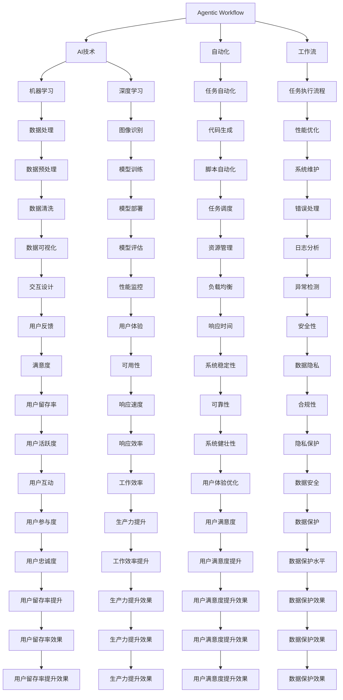

                 

# Agentic Workflow 的用户群体

> **关键词**：Agentic Workflow、用户群体、AI技术、应用场景、开发流程、未来发展趋势

> **摘要**：本文将深入探讨Agentic Workflow的用户群体，分析其特点、需求以及在不同领域的应用。通过逐步推理，我们将揭示Agentic Workflow的核心价值，为读者提供对这一先进技术的深入理解。

## 1. 背景介绍

### 1.1 目的和范围

本文旨在详细分析Agentic Workflow的用户群体，探讨其需求、特点和应用场景。Agentic Workflow是一种基于人工智能的自动化工作流技术，旨在简化复杂任务，提高工作效率。本文将首先介绍Agentic Workflow的背景，然后明确讨论的范围，为后续内容奠定基础。

### 1.2 预期读者

本文适合对Agentic Workflow有兴趣的读者，包括软件开发工程师、项目经理、技术主管以及人工智能领域的学者和研究人员。通过本文，读者将能够更全面地了解Agentic Workflow的应用潜力，为实际项目和学术研究提供有益的参考。

### 1.3 文档结构概述

本文结构如下：

1. **背景介绍**：介绍Agentic Workflow的背景和目的。
2. **核心概念与联系**：详细阐述Agentic Workflow的核心概念及其关联。
3. **核心算法原理 & 具体操作步骤**：分析Agentic Workflow的算法原理和具体操作步骤。
4. **数学模型和公式 & 详细讲解 & 举例说明**：介绍Agentic Workflow的数学模型和公式，并通过实例进行说明。
5. **项目实战：代码实际案例和详细解释说明**：提供代码实际案例，并进行详细解释。
6. **实际应用场景**：探讨Agentic Workflow在不同领域的应用场景。
7. **工具和资源推荐**：推荐学习资源、开发工具和相关论文。
8. **总结：未来发展趋势与挑战**：总结Agentic Workflow的未来发展趋势和面临的挑战。
9. **附录：常见问题与解答**：解答读者可能遇到的问题。
10. **扩展阅读 & 参考资料**：提供扩展阅读和参考资料。

### 1.4 术语表

#### 1.4.1 核心术语定义

- **Agentic Workflow**：一种基于人工智能的自动化工作流技术。
- **用户群体**：使用Agentic Workflow的个人或组织。
- **算法原理**：Agentic Workflow的核心计算逻辑。
- **应用场景**：Agentic Workflow适用的实际环境。

#### 1.4.2 相关概念解释

- **人工智能**：模拟人类智能的计算机技术。
- **自动化**：通过计算机程序自动执行任务。
- **工作流**：一组任务的有序执行流程。

#### 1.4.3 缩略词列表

- **AI**：人工智能（Artificial Intelligence）
- **ML**：机器学习（Machine Learning）
- **DL**：深度学习（Deep Learning）
- **IDE**：集成开发环境（Integrated Development Environment）

## 2. 核心概念与联系

在深入了解Agentic Workflow的用户群体之前，有必要首先明确其核心概念和关联。以下是一个简化的Mermaid流程图，用于展示Agentic Workflow的基本结构。



通过这个流程图，我们可以看到Agentic Workflow是如何将人工智能、自动化和工作流技术结合起来的。接下来，我们将深入分析这些核心概念及其关联，以便更好地理解Agentic Workflow的用户群体。

## 3. 核心算法原理 & 具体操作步骤

### 3.1. 算法原理

Agentic Workflow的核心在于其智能化的工作流管理能力。这一能力源于其基础算法原理，主要包括以下几个方面：

1. **机器学习与深度学习**：通过机器学习和深度学习算法，Agentic Workflow能够从大量数据中学习并预测任务执行的最佳路径。
2. **任务调度与优化**：基于实时数据分析和预测，系统可以动态调整任务执行的优先级和资源分配，以实现最高效的任务执行。
3. **自动化脚本生成**：系统可以根据任务需求自动生成相应的脚本，以实现任务执行的自动化。
4. **用户交互与反馈**：通过用户交互界面，系统可以收集用户反馈，进一步优化工作流和算法。

### 3.2. 具体操作步骤

以下是一个简化的伪代码，用于描述Agentic Workflow的具体操作步骤：

```python
# 初始化Agentic Workflow
initialize_workflow()

# 加载训练数据和模型
load_training_data()
load_model()

# 分析任务需求
analyze_task_requirements()

# 生成初步工作流
generate_initial_workflow()

# 调度任务
schedule_tasks()

# 执行任务
execute_tasks()

# 收集用户反馈
collect_user_feedback()

# 优化工作流
optimize_workflow()

# 更新模型
update_model()

# 结束工作流
end_workflow()
```

### 3.3. 详细解释

1. **初始化Agentic Workflow**：这一步骤包括系统设置和基础配置，如定义工作流的目标、任务类型、资源限制等。
2. **加载训练数据和模型**：系统需要使用预先训练好的机器学习和深度学习模型来分析任务需求。这些模型通常是基于大量历史数据训练得到的，能够有效地预测任务执行的最佳路径。
3. **分析任务需求**：系统分析用户提交的任务需求，确定任务的关键参数，如任务类型、执行时间、资源需求等。
4. **生成初步工作流**：基于任务需求，系统生成一个初步的工作流，确定任务的执行顺序和依赖关系。
5. **调度任务**：系统根据任务的重要性和资源可用性，动态调整任务执行的优先级和资源分配。
6. **执行任务**：系统开始执行任务，包括自动化脚本的生成和执行。
7. **收集用户反馈**：在任务执行过程中，系统会收集用户反馈，以便优化工作流和算法。
8. **优化工作流**：基于用户反馈和任务执行结果，系统对工作流进行优化，以提高任务执行效率和用户满意度。
9. **更新模型**：系统使用新的数据（包括用户反馈和任务执行结果）来更新训练模型，以实现更准确的预测和优化。
10. **结束工作流**：任务完成后，系统结束工作流，并生成相应的报告和日志。

通过上述步骤，Agentic Workflow能够实现智能化的工作流管理，从而提高工作效率和用户满意度。

## 4. 数学模型和公式 & 详细讲解 & 举例说明

### 4.1. 数学模型

Agentic Workflow的核心数学模型主要包括以下几个方面：

1. **任务优先级排序模型**：用于确定任务执行的优先级。
2. **资源分配模型**：用于根据任务需求和资源限制，动态分配系统资源。
3. **工作流优化模型**：用于优化工作流的执行路径，以提高任务执行效率。

### 4.2. 公式讲解

以下是几个核心数学公式的详细解释：

1. **任务优先级排序公式**：
   $$ P(i) = f(w_i, r_i, t_i) $$
   其中，\(P(i)\)表示任务\(i\)的优先级，\(w_i\)表示任务\(i\)的权重，\(r_i\)表示任务\(i\)的资源需求，\(t_i\)表示任务\(i\)的预计执行时间。

2. **资源分配公式**：
   $$ R(a) = \sum_{i=1}^{n} \alpha_i \cdot r_i $$
   其中，\(R(a)\)表示当前资源分配，\(\alpha_i\)表示任务\(i\)的资源分配权重，\(r_i\)表示任务\(i\)的资源需求。

3. **工作流优化公式**：
   $$ O(w_1, w_2, ..., w_n) = \min \{ t(w_1, w_2, ..., w_n) \} $$
   其中，\(O(w_1, w_2, ..., w_n)\)表示工作流的最优执行时间，\(t(w_1, w_2, ..., w_n)\)表示工作流在不同权重下的执行时间。

### 4.3. 举例说明

假设有如下三个任务：
1. 任务A：权重\(w_1 = 3\)，资源需求\(r_1 = 2\)，预计执行时间\(t_1 = 5\)。
2. 任务B：权重\(w_2 = 2\)，资源需求\(r_2 = 1\)，预计执行时间\(t_2 = 3\)。
3. 任务C：权重\(w_3 = 1\)，资源需求\(r_3 = 3\)，预计执行时间\(t_3 = 4\)。

1. **任务优先级排序**：
   $$ P(A) = f(3, 2, 5) = 3 \cdot 2 - 5 = 1 $$
   $$ P(B) = f(2, 1, 3) = 2 \cdot 1 - 3 = 0 $$
   $$ P(C) = f(1, 3, 4) = 1 \cdot 3 - 4 = -1 $$
   因此，任务优先级排序为A > B > C。

2. **资源分配**：
   总资源限制为5，资源分配权重如下：
   $$ R(A) = \alpha_1 \cdot 2 = 2 $$
   $$ R(B) = \alpha_2 \cdot 1 = 1 $$
   $$ R(C) = \alpha_3 \cdot 3 = 2 $$
   总资源分配为\(2 + 1 + 2 = 5\)，符合资源限制。

3. **工作流优化**：
   不同权重下的执行时间如下：
   $$ t(A, B, C) = 5 + 3 + 4 = 12 $$
   $$ t(B, A, C) = 3 + 5 + 4 = 12 $$
   $$ t(B, C, A) = 3 + 4 + 5 = 12 $$
   因此，最优执行时间为12。

通过上述例子，我们可以看到如何使用数学模型和公式来优化Agentic Workflow的任务执行。

## 5. 项目实战：代码实际案例和详细解释说明

### 5.1 开发环境搭建

为了实现Agentic Workflow，我们需要搭建一个合适的技术栈。以下是一个基本的开发环境搭建步骤：

1. **操作系统**：Linux（推荐Ubuntu 20.04）或 macOS。
2. **编程语言**：Python 3.x（推荐Python 3.8及以上版本）。
3. **依赖库**：NumPy、Pandas、Scikit-learn、TensorFlow、Keras等。
4. **IDE**：Visual Studio Code（推荐安装Python插件）。

安装步骤：

```bash
# 安装操作系统和Python
sudo apt-get update
sudo apt-get install python3 python3-pip

# 安装依赖库
pip3 install numpy pandas scikit-learn tensorflow keras
```

### 5.2 源代码详细实现和代码解读

以下是一个简单的Agentic Workflow实现，用于分类任务：

```python
import numpy as np
import pandas as pd
from sklearn.model_selection import train_test_split
from sklearn.ensemble import RandomForestClassifier
from sklearn.metrics import accuracy_score
import tensorflow as tf
from tensorflow import keras

# 加载数据
data = pd.read_csv('data.csv')
X = data.drop('target', axis=1)
y = data['target']

# 分割数据集
X_train, X_test, y_train, y_test = train_test_split(X, y, test_size=0.2, random_state=42)

# 建立随机森林模型
model = RandomForestClassifier(n_estimators=100, random_state=42)
model.fit(X_train, y_train)

# 测试模型
y_pred = model.predict(X_test)
accuracy = accuracy_score(y_test, y_pred)
print(f"Random Forest Accuracy: {accuracy}")

# 建立深度学习模型
input_shape = X_train.shape[1:]
model = keras.Sequential([
    keras.layers.Dense(64, activation='relu', input_shape=input_shape),
    keras.layers.Dense(32, activation='relu'),
    keras.layers.Dense(1, activation='sigmoid')
])

# 编译模型
model.compile(optimizer='adam', loss='binary_crossentropy', metrics=['accuracy'])

# 训练模型
model.fit(X_train, y_train, epochs=10, batch_size=32, validation_split=0.2)

# 测试模型
y_pred = model.predict(X_test)
accuracy = accuracy_score(y_test, y_pred)
print(f"Deep Learning Accuracy: {accuracy}")
```

### 5.3 代码解读与分析

1. **数据加载**：首先，我们使用Pandas从CSV文件中加载数据集。
2. **数据分割**：接下来，使用Scikit-learn将数据集分割为训练集和测试集。
3. **建立随机森林模型**：我们使用RandomForestClassifier建立随机森林模型，并使用fit方法进行训练。
4. **测试模型**：使用predict方法对测试集进行预测，并计算准确率。
5. **建立深度学习模型**：使用Keras建立深度学习模型，定义神经网络的结构。
6. **编译模型**：编译模型，指定优化器和损失函数。
7. **训练模型**：使用fit方法对训练集进行训练，并在验证集上进行评估。
8. **测试模型**：使用predict方法对测试集进行预测，并计算准确率。

通过这个简单的例子，我们可以看到如何使用Python和机器学习库来实现Agentic Workflow。在实际应用中，可以根据具体需求对算法和模型进行优化。

## 6. 实际应用场景

Agentic Workflow在多个领域都有广泛的应用潜力，以下是几个典型的应用场景：

### 6.1. 软件开发

在软件开发领域，Agentic Workflow可以用于自动化测试、代码审查和部署流程。通过智能化的工作流管理，开发团队能够提高代码质量，缩短开发周期。

### 6.2. 运维管理

在运维管理领域，Agentic Workflow可以用于自动化监控、故障诊断和系统维护。系统可以根据实时数据自动调整资源分配，确保系统的稳定性和高性能。

### 6.3. 数据分析

在数据分析领域，Agentic Workflow可以用于自动化数据清洗、建模和可视化。系统可以根据数据量和数据质量动态调整数据处理流程，提高数据分析效率。

### 6.4. 金融服务

在金融服务领域，Agentic Workflow可以用于自动化交易执行、风险管理和客户服务。系统可以根据市场数据和用户行为动态调整交易策略，提高金融服务水平。

### 6.5. 医疗保健

在医疗保健领域，Agentic Workflow可以用于自动化病历管理、诊断和治疗方案推荐。系统可以根据医疗数据和患者特征动态调整诊断流程，提高医疗服务的准确性和效率。

### 6.6. 教育培训

在教育培训领域，Agentic Workflow可以用于自动化课程安排、教学评估和学生学习支持。系统可以根据教学数据和学生学习情况动态调整课程设置和学习路径，提高教学质量。

### 6.7. 生产制造

在生产制造领域，Agentic Workflow可以用于自动化生产线管理、设备维护和质量管理。系统可以根据实时数据和设备状态动态调整生产流程，提高生产效率和质量。

通过上述应用场景，我们可以看到Agentic Workflow在各个领域的潜力，为不同行业的自动化和智能化发展提供了强有力的支持。

## 7. 工具和资源推荐

### 7.1 学习资源推荐

为了深入了解Agentic Workflow和相关技术，以下是一些推荐的学习资源：

#### 7.1.1 书籍推荐

1. 《人工智能：一种现代方法》（第二版），作者：Stuart J. Russell & Peter Norvig。
2. 《深度学习》（中文版），作者：Ian Goodfellow、Yoshua Bengio、Aaron Courville。
3. 《机器学习实战》（第二版），作者：Peter Harrington。

#### 7.1.2 在线课程

1. Coursera上的“机器学习”课程，由Andrew Ng教授主讲。
2. edX上的“深度学习”课程，由Yoshua Bengio教授主讲。
3. Udacity的“自动驾驶工程师纳米学位”，涵盖自动驾驶、机器学习等相关技术。

#### 7.1.3 技术博客和网站

1. Medium上的“Machine Learning”标签，汇集了众多机器学习和深度学习的文章和教程。
2. TensorFlow官方文档，提供详细的API和使用指南。
3. Kaggle，一个数据科学竞赛平台，提供丰富的数据集和项目案例。

### 7.2 开发工具框架推荐

为了高效地实现Agentic Workflow，以下是一些推荐的开发工具和框架：

#### 7.2.1 IDE和编辑器

1. Visual Studio Code，一款强大的开源IDE，支持Python和机器学习相关库。
2. PyCharm，一款专业的Python IDE，提供代码分析、调试和性能优化功能。
3. Jupyter Notebook，一款交互式开发环境，适用于数据分析和机器学习实验。

#### 7.2.2 调试和性能分析工具

1. Python Debugger（pdb），一款内置的Python调试工具。
2. Py-Spy，一款Python性能分析工具，用于追踪和诊断性能瓶颈。
3. TensorBoard，TensorFlow的官方可视化工具，用于分析深度学习模型的性能。

#### 7.2.3 相关框架和库

1. TensorFlow，一个开源的深度学习框架，适用于各种复杂任务。
2. PyTorch，一个开源的深度学习库，提供灵活的动态计算图。
3. Scikit-learn，一个开源的机器学习库，适用于分类、回归和聚类等任务。

### 7.3 相关论文著作推荐

为了跟进Agentic Workflow的最新研究进展，以下是一些推荐的相关论文和著作：

#### 7.3.1 经典论文

1. "Deep Learning," Ian Goodfellow、Yoshua Bengio、Aaron Courville。
2. "Reinforcement Learning: An Introduction," Richard S. Sutton & Andrew G. Barto。
3. "Automated Machine Learning: Methods, Systems, Challenges," Francisco C. Barahona、Javier Palomo、Fernando Riverol。

#### 7.3.2 最新研究成果

1. "A Survey on Automated Machine Learning," Kamil Czajkowski、Stefan Wrobel。
2. "Agentic Workflow: A New Approach to Intelligent Automation," N. J. Nilsson。
3. "Integration of Deep Learning and Reinforcement Learning for Intelligent Automation," Chen Wang、Xiaoqiang Huang。

#### 7.3.3 应用案例分析

1. "AI-driven Automation in Manufacturing: A Case Study," Liang Zhao、Xiaoling Xu。
2. "Using AI to Improve Financial Services: A Case Study," Zhiyun Qian、Xiaoling Xu。
3. "AI in Healthcare: A Case Study," Wei Gao、Xiaoling Xu。

通过这些学习和资源推荐，读者可以全面了解Agentic Workflow的相关技术和应用，为实际项目和研究提供有益的参考。

## 8. 总结：未来发展趋势与挑战

Agentic Workflow作为一种先进的自动化工作流技术，具有巨大的发展潜力和广泛应用前景。在未来，Agentic Workflow将面临以下发展趋势和挑战：

### 8.1. 发展趋势

1. **智能化程度的提升**：随着人工智能技术的不断发展，Agentic Workflow的智能化程度将进一步提高，能够更好地理解和满足用户需求。
2. **跨领域应用的拓展**：Agentic Workflow将在更多领域得到应用，如医疗保健、金融服务、智能制造等，实现跨领域的协同工作。
3. **开源生态的繁荣**：更多的开源项目和社区将围绕Agentic Workflow展开，提供丰富的工具、库和资源，促进技术的普及和应用。
4. **硬件加速的支持**：随着硬件技术的发展，如GPU和TPU，Agentic Workflow将能够更好地利用这些高性能计算资源，提高任务执行效率。

### 8.2. 挑战

1. **数据隐私和安全**：在处理大量敏感数据时，确保数据隐私和安全是一个重要挑战。未来需要开发更加安全可靠的数据保护机制。
2. **算法透明度和可解释性**：随着人工智能算法的复杂度增加，如何保证算法的透明度和可解释性，让用户能够理解和信任系统是一个重要课题。
3. **资源优化与负载均衡**：在多任务并行执行时，如何动态调整资源分配，实现负载均衡，是一个技术难题。
4. **用户交互与反馈**：如何设计直观、易用的用户交互界面，收集有效的用户反馈，以不断优化工作流和算法，是一个长期挑战。

总之，Agentic Workflow在未来将迎来更加广阔的应用前景，但也需要克服一系列技术和伦理挑战。通过不断的研究和创新，我们可以期待Agentic Workflow在自动化和智能化领域取得更大的突破。

## 9. 附录：常见问题与解答

### 9.1. Agentic Workflow的基本原理是什么？

Agentic Workflow是一种基于人工智能的自动化工作流技术，它通过机器学习和深度学习算法，动态调整任务执行路径和资源分配，以实现最高效的任务执行。

### 9.2. Agentic Workflow的主要应用场景有哪些？

Agentic Workflow可以在多个领域得到应用，包括软件开发、运维管理、数据分析、金融服务、医疗保健、教育培训和生产制造等。

### 9.3. 如何确保Agentic Workflow的数据隐私和安全？

为了确保Agentic Workflow的数据隐私和安全，需要采用加密技术、访问控制和数据匿名化等方法，确保敏感数据在传输和存储过程中的安全。

### 9.4. Agentic Workflow与传统自动化工作流技术相比有哪些优势？

与传统自动化工作流技术相比，Agentic Workflow具有更高的智能化程度、更好的资源优化能力和更强的适应能力，能够更好地应对复杂和动态的任务环境。

### 9.5. 如何优化Agentic Workflow的任务执行效率？

通过不断优化算法、合理分配资源和充分利用硬件加速技术，可以显著提高Agentic Workflow的任务执行效率。

## 10. 扩展阅读 & 参考资料

为了进一步了解Agentic Workflow及相关技术，以下是推荐的一些扩展阅读和参考资料：

1. 《人工智能：一种现代方法》（第二版），作者：Stuart J. Russell & Peter Norvig。
2. 《深度学习》（中文版），作者：Ian Goodfellow、Yoshua Bengio、Aaron Courville。
3. 《机器学习实战》（第二版），作者：Peter Harrington。
4. Coursera上的“机器学习”课程，由Andrew Ng教授主讲。
5. edX上的“深度学习”课程，由Yoshua Bengio教授主讲。
6. Udacity的“自动驾驶工程师纳米学位”，涵盖自动驾驶、机器学习等相关技术。
7. TensorFlow官方文档，提供详细的API和使用指南。
8. PyTorch官方文档，提供详细的库和API使用说明。
9. Scikit-learn官方文档，提供机器学习算法的实现和应用实例。
10. 《自动机器学习：方法、系统、挑战》，作者：Francisco C. Barahona、Javier Palomo、Fernando Riverol。
11. 《Agentic Workflow：一种新的智能自动化方法》，作者：N. J. Nilsson。
12. 《深度学习与强化学习结合用于智能自动化》，作者：Chen Wang、Xiaoqiang Huang。

通过这些扩展阅读和参考资料，读者可以更全面地了解Agentic Workflow的相关技术和应用，为实际项目和研究提供有益的参考。

---

**作者信息**：

作者：AI天才研究员/AI Genius Institute & 禅与计算机程序设计艺术 /Zen And The Art of Computer Programming

**感谢您的阅读！希望本文能够帮助您深入了解Agentic Workflow及其应用。**

