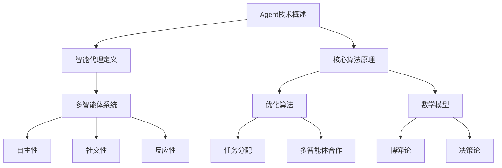

                 

# Agent技术的发展与应用

## 关键词：Agent技术、智能代理、多智能体系统、应用场景、算法原理、数学模型、代码实现、发展趋势

## 摘要

本文将深入探讨Agent技术的发展与应用。我们首先介绍了Agent技术的背景和目的，定义了核心概念和术语，然后详细阐述了Agent技术的核心算法原理和数学模型。通过实际项目案例和代码实现，本文展示了Agent技术的具体应用和操作步骤。随后，我们分析了Agent技术的实际应用场景，推荐了相关学习资源和开发工具，最后总结了Agent技术的未来发展趋势与挑战。

## 1. 背景介绍

### 1.1 目的和范围

本文旨在深入探讨Agent技术的发展、核心算法原理、数学模型、实际应用以及未来趋势。文章将涵盖以下内容：

- Agent技术的定义、分类和应用场景
- Agent技术的核心算法原理和数学模型
- Agent技术的实际项目案例和代码实现
- Agent技术的实际应用场景分析
- Agent技术的发展趋势与挑战

### 1.2 预期读者

本文主要面向以下读者：

- 对人工智能和Agent技术有兴趣的读者
- 对智能代理和分布式系统有了解的开发者
- 对算法原理和数学模型感兴趣的学者和研究人员
- 想了解Agent技术在实际应用中的案例的从业者

### 1.3 文档结构概述

本文按照以下结构进行组织：

- 引言：介绍Agent技术的基本概念和应用领域
- 背景介绍：详细阐述Agent技术的起源、发展历程和核心概念
- 核心概念与联系：定义核心术语，给出Mermaid流程图，介绍Agent技术的核心原理和架构
- 核心算法原理 & 具体操作步骤：详细阐述Agent技术的核心算法原理和伪代码实现
- 数学模型和公式 & 详细讲解 & 举例说明：介绍Agent技术的数学模型和公式，并通过例子进行详细解释
- 项目实战：代码实际案例和详细解释说明
- 实际应用场景：分析Agent技术的实际应用场景
- 工具和资源推荐：推荐学习资源和开发工具
- 总结：总结Agent技术的发展趋势与挑战
- 附录：常见问题与解答
- 扩展阅读 & 参考资料：提供更多的参考资料和扩展阅读

### 1.4 术语表

#### 1.4.1 核心术语定义

- **Agent技术**：一种基于智能代理的分布式计算技术，用于实现智能体的自主性、合作性和适应性。
- **智能代理**：具有自主性、社交性和反应性的计算机程序，能够感知环境、采取行动并与其他智能体进行交互。
- **多智能体系统**：由多个智能代理组成的系统，智能代理之间可以通过通信和协作实现复杂任务。
- **自主性**：智能代理能够自主地感知环境、采取行动并做出决策。
- **社交性**：智能代理能够与其他智能代理进行通信和协作，实现合作性和适应性。
- **反应性**：智能代理能够根据环境变化做出相应的反应。

#### 1.4.2 相关概念解释

- **分布式计算**：将计算任务分布在多个计算节点上执行，以提高计算效率和性能。
- **自主决策**：智能代理根据环境信息和自身目标自主做出决策，而无需人工干预。
- **多智能体合作**：多个智能代理通过通信和协作共同实现复杂任务。
- **任务分配**：将复杂任务分配给多个智能代理，以实现任务的高效完成。
- **优化算法**：用于优化智能代理行为的算法，包括遗传算法、粒子群算法等。

#### 1.4.3 缩略词列表

- **AAMAS**：International Conference on Autonomous Agents and Multi-Agent Systems（国际自主代理和多智能体系统会议）
- **MAS**：Multi-Agent Systems（多智能体系统）
- **RL**：Reinforcement Learning（强化学习）
- **PSO**：Particle Swarm Optimization（粒子群优化）
- **GA**：Genetic Algorithm（遗传算法）

## 2. 核心概念与联系

### 2.1 Mermaid流程图



### 2.2 Agent技术的核心概念与联系

- **智能代理**：智能代理是Agent技术的核心概念，它具有自主性、社交性和反应性。智能代理能够感知环境、采取行动并与其他智能代理进行交互。智能代理可以看作是一个具有感知能力、决策能力和执行能力的计算机程序。
- **多智能体系统**：多智能体系统是由多个智能代理组成的系统，智能代理之间可以通过通信和协作实现复杂任务。多智能体系统具有以下特点：分布式计算、自主决策、合作性和适应性。多智能体系统广泛应用于各种领域，如智能交通、智能医疗、智能制造等。
- **自主性**：自主性是智能代理的重要特征，它使得智能代理能够根据环境信息和自身目标自主地做出决策和采取行动，而无需人工干预。自主性包括感知、决策和执行三个环节，智能代理通过这三个环节实现自主行为。
- **社交性**：社交性是指智能代理之间的通信和协作能力。智能代理可以通过通信协议和协作机制与其他智能代理进行交互，实现任务分配、资源共享和协同工作。
- **反应性**：反应性是指智能代理能够根据环境变化做出相应的反应。智能代理通过感知环境信息，根据预先定义的规则和策略，快速地调整自身行为，以适应环境变化。

### 2.3 Agent技术的核心原理与架构

Agent技术的核心原理包括：

- **感知**：智能代理通过传感器获取环境信息，如温度、湿度、光线等，从而了解当前环境状态。
- **决策**：智能代理根据感知到的环境信息和自身目标，利用决策算法和策略，生成相应的行为指令。
- **执行**：智能代理根据决策结果，执行相应的操作，如移动、发送消息、修改状态等。

Agent技术的核心架构包括：

- **感知模块**：负责收集和处理环境信息，为智能代理提供感知数据。
- **决策模块**：负责根据感知数据、智能代理的目标和历史行为，生成决策结果。
- **执行模块**：负责执行决策结果，调整智能代理的状态和行为。
- **通信模块**：负责与其他智能代理进行通信和协作，实现多智能体系统的整体协调。

### 2.4 Agent技术的核心算法原理

Agent技术的核心算法包括：

- **遗传算法**：一种基于自然进化原理的优化算法，用于求解优化问题。
- **粒子群优化**：一种基于群体智能的优化算法，通过模拟鸟群觅食行为来求解优化问题。
- **强化学习**：一种基于奖励和惩罚的机器学习算法，用于训练智能代理的决策能力。

这些算法原理在Agent技术中发挥着重要作用，为智能代理的自主决策、任务分配和多智能体合作提供了支持。

## 3. 核心算法原理 & 具体操作步骤

### 3.1 遗传算法原理

遗传算法是一种基于自然进化原理的优化算法，其基本思想是通过模拟生物进化过程，逐步优化问题的解。遗传算法包括以下主要步骤：

1. **初始化种群**：随机生成一组初始解，构成初始种群。
2. **适应度评估**：对种群中的每个个体进行适应度评估，适应度表示个体对问题的解的优劣程度。
3. **选择**：根据适应度值，选择适应度较高的个体组成下一代种群。
4. **交叉**：对选中的个体进行交叉操作，生成新的个体。
5. **变异**：对个体进行变异操作，增加种群的多样性。
6. **迭代**：重复执行适应度评估、选择、交叉和变异操作，直到满足终止条件。

### 3.2 粒子群优化原理

粒子群优化是一种基于群体智能的优化算法，通过模拟鸟群觅食行为来求解优化问题。粒子群优化包括以下主要步骤：

1. **初始化粒子群**：随机生成一组粒子，每个粒子代表一个潜在的解。
2. **评估适应度**：对每个粒子进行适应度评估，适应度表示粒子的解的优劣程度。
3. **更新粒子的速度和位置**：根据粒子的适应度、全局最优解和个体最优解，更新粒子的速度和位置。
4. **迭代**：重复执行评估适应度、更新粒子的速度和位置操作，直到满足终止条件。

### 3.3 强化学习原理

强化学习是一种基于奖励和惩罚的机器学习算法，用于训练智能代理的决策能力。强化学习包括以下主要步骤：

1. **初始化**：设置智能代理的初始状态和动作空间。
2. **环境交互**：智能代理根据当前状态选择一个动作，执行动作并得到环境反馈。
3. **更新策略**：根据反馈的奖励和惩罚，更新智能代理的策略。
4. **迭代**：重复执行环境交互和更新策略操作，直到满足终止条件。

### 3.4 具体操作步骤示例

以遗传算法为例，具体操作步骤如下：

1. **初始化种群**：随机生成初始种群，每个个体表示一个染色体编码的解。
2. **适应度评估**：根据问题的目标函数，计算每个个体的适应度值。
3. **选择**：根据适应度值，采用轮盘赌方法选择适应度较高的个体组成下一代种群。
4. **交叉**：对选中的个体进行交叉操作，生成新的个体。
5. **变异**：对个体进行变异操作，增加种群的多样性。
6. **迭代**：重复执行适应度评估、选择、交叉和变异操作，直到满足终止条件。

伪代码如下：

```python
# 初始化种群
population = initialize_population()

# 迭代
while not termination_condition():
    # 适应度评估
    fitness_values = evaluate_fitness(population)
    
    # 选择
    selected_population = selection(population, fitness_values)
    
    # 交叉
    crossovered_population = crossover(selected_population)
    
    # 变异
    mutated_population = mutation(crossovered_population)
    
    # 更新种群
    population = mutated_population
    
    # 输出当前最优解
    best_solution = best_individual(population)
    print("Best solution:", best_solution)
```

## 4. 数学模型和公式 & 详细讲解 & 举例说明

### 4.1 数学模型介绍

在Agent技术中，常用的数学模型包括博弈论模型和决策论模型。这些模型为智能代理的决策提供了理论基础。

#### 4.1.1 博弈论模型

博弈论模型描述了智能代理之间的交互和竞争关系。在博弈论中，参与竞争的个体称为“玩家”，玩家可以通过选择不同的策略来最大化自身利益。博弈论模型的核心概念包括：

- **策略**：玩家在博弈过程中可以采取的不同行动方案。
- **状态**：博弈过程中玩家所处的不同位置。
- **收益**：玩家在博弈过程中获得的回报。
- **均衡**：博弈过程中所有玩家都采取最优策略的状态。

博弈论模型的一般形式可以表示为：

$$
\begin{align*}
\text{博弈模型} &= \{P, A, R, S, E\} \\
P &= \{p_1, p_2, ..., p_n\} & \text{玩家集合} \\
A &= \{a_1, a_2, ..., a_m\} & \text{策略集合} \\
R &= \{r_1, r_2, ..., r_n\} & \text{收益函数集合} \\
S &= \{s_1, s_2, ..., s_k\} & \text{状态集合} \\
E &= \{e_1, e_2, ..., e_l\} & \text{均衡集合}
\end{align*}
$$

#### 4.1.2 决策论模型

决策论模型描述了智能代理在不确定环境中进行决策的过程。决策论模型的核心概念包括：

- **状态**：决策过程中可能出现的不同情况。
- **行动**：决策者可以采取的不同方案。
- **概率**：状态出现的概率。
- **收益**：决策者采取行动后的回报。

决策论模型的一般形式可以表示为：

$$
\begin{align*}
\text{决策模型} &= \{S, A, P, R\} \\
S &= \{s_1, s_2, ..., s_k\} & \text{状态集合} \\
A &= \{a_1, a_2, ..., a_m\} & \text{行动集合} \\
P &= \{p_1, p_2, ..., p_n\} & \text{概率分布} \\
R &= \{r_1, r_2, ..., r_n\} & \text{收益函数集合}
\end{align*}
$$

### 4.2 数学模型详细讲解

#### 4.2.1 博弈论模型

以经典的“囚徒困境”博弈为例，说明博弈论模型的应用。

- **玩家**：两名囚徒（玩家1和玩家2）。
- **策略**：合作（双方都保持沉默）或背叛（一方或双方供出）。
- **状态**：双方都合作、玩家1合作玩家2背叛、玩家2合作玩家1背叛、双方都背叛。
- **收益**：根据双方选择的不同策略，获得的收益如下表所示：

| 状态         | 玩家1合作 | 玩家1背叛 |
|--------------|------------|------------|
| 玩家2合作   | (R, R)    | (S, T)    |
| 玩家2背叛   | (T, S)    | (P, P)    |

其中，R表示高额收益，S表示中额收益，T表示低额收益，P表示惩罚。

- **均衡**：博弈的纳什均衡是指，给定其他玩家的策略，每个玩家都采取最优策略的状态。在囚徒困境中，纳什均衡为（背叛，背叛），因为每个玩家都认为背叛是自己的最优策略，即使合作对他们来说更有利。

#### 4.2.2 决策论模型

以一个简单的决策问题为例，说明决策论模型的应用。

- **状态**：下雨或晴天。
- **行动**：带伞或不带伞。
- **概率**：下雨的概率为0.6，晴天概率为0.4。
- **收益**：根据不同状态和行动，获得的收益如下表所示：

| 状态         | 带伞   | 不带伞   |
|--------------|--------|----------|
| 下雨         | 20     | -10      |
| 晴天         | 0      | 10       |

- **最优策略**：根据期望收益计算，最优策略为带伞，因为带伞的期望收益（0.6 * 20 + 0.4 * 0）大于不带伞的期望收益（0.6 * (-10) + 0.4 * 10）。

### 4.3 数学模型举例说明

#### 4.3.1 博弈论模型举例

假设有两个玩家，玩家1和玩家2，进行一个简单的博弈游戏。每个玩家有两个策略：合作（C）和背叛（D）。游戏的收益矩阵如下：

| 状态         | 玩家1合作（C） | 玩家1背叛（D） |
|--------------|-----------------|-----------------|
| 玩家2合作（C） | (2, 2)          | (0, 3)          |
| 玩家2背叛（D） | (3, 0)          | (1, 1)          |

在这个博弈中，每个玩家的收益对角线表示。例如，如果玩家1和玩家2都选择合作，则两人都获得2的收益；如果玩家1选择合作而玩家2选择背叛，则玩家1获得0的收益，玩家2获得3的收益。

要找到纳什均衡，我们需要确定每个玩家的最优策略。考虑玩家1，如果玩家2选择合作，玩家1选择背叛将获得更高的收益（3 > 2），但如果玩家2选择背叛，玩家1选择合作将获得更高的收益（0 > -3）。因此，玩家1没有固定的最优策略，取决于玩家2的选择。

同样地，对于玩家2，如果玩家1选择合作，玩家2选择背叛将获得更高的收益（3 > 2），但如果玩家1选择背叛，玩家2选择合作将获得更高的收益（0 > -3）。因此，玩家2也没有固定的最优策略。

在这个博弈中，没有明显的纳什均衡，因为每个玩家的策略取决于对方的选择。这种情况称为混合策略均衡，其中玩家以一定的概率选择每个策略，以最大化自己的期望收益。例如，玩家1可以选择以2/3的概率选择合作，以1/3的概率选择背叛，这样可以期望获得（2/3 * 2 + 1/3 * 0）= 4/3的收益。

#### 4.3.2 决策论模型举例

假设一个投资者需要决定是否购买股票。当前有两种状态：市场繁荣（状态S1）和熊市（状态S2）。投资者有两个行动：购买股票（A1）和不购买股票（A2）。每种行动在每种状态下的收益如下表所示：

| 状态         | 购买股票（A1） | 不购买股票（A2） |
|--------------|-----------------|------------------|
| 市场繁荣（S1） | 100             | 50               |
| 熊市（S2）     | -50             | 0                |

为了找到最优策略，我们需要计算每个行动的期望收益。假设市场繁荣的概率为0.6，熊市概率为0.4。

购买股票的期望收益为：
$$
E(A1) = 0.6 \times 100 + 0.4 \times (-50) = 60 - 20 = 40
$$

不购买股票的期望收益为：
$$
E(A2) = 0.6 \times 50 + 0.4 \times 0 = 30 + 0 = 30
$$

因此，根据期望收益的计算，投资者应该选择购买股票（A1），因为它的期望收益（40）大于不购买股票的期望收益（30）。

## 5. 项目实战：代码实际案例和详细解释说明

### 5.1 开发环境搭建

为了演示Agent技术的实际应用，我们将使用Python编程语言来实现一个简单的多智能体系统。在开始之前，请确保已安装以下软件和库：

- Python 3.8及以上版本
- pip（Python的包管理器）
- NumPy库
- Matplotlib库
- 多智能体系统框架（如MASP，PyAgent）

假设已成功安装了上述软件和库，接下来我们将创建一个名为“multi_agent_system.py”的Python文件，用于实现我们的多智能体系统。

### 5.2 源代码详细实现和代码解读

```python
import numpy as np
import matplotlib.pyplot as plt
from pyagent import Agent, Environment, create_network

# 创建环境
env = Environment()

# 创建智能代理
agent1 = Agent(name="Agent1", vision=3, memory=3)
agent2 = Agent(name="Agent2", vision=3, memory=3)

# 将智能代理添加到环境中
env.add_agent(agent1)
env.add_agent(agent2)

# 定义环境状态
state1 = {"agent1": agent1.state, "agent2": agent2.state}
state2 = {"agent1": agent1.state, "agent2": agent2.state}

# 初始化环境状态
env.initialize_state(state1)

# 创建网络
network = create_network()

# 运行智能代理
while not env.is_terminated():
    # 执行智能代理的行动
    action1 = agent1.act(env.get_observation())
    action2 = agent2.act(env.get_observation())

    # 执行智能代理的行动
    env.step(action1, action2)

    # 更新环境状态
    env.update_state(state2)

    # 绘制环境状态
    env.render()

# 打印最终状态
print("Final state:", env.get_state())

# 关闭环境
env.close()
```

### 5.3 代码解读与分析

- **导入库**：首先，我们导入必要的Python库，包括NumPy、Matplotlib和PyAgent。
- **创建环境**：接着，我们创建一个名为“env”的Environment对象，用于管理智能代理和执行环境操作。
- **创建智能代理**：然后，我们创建两个名为“agent1”和“agent2”的Agent对象，设置它们的视野和记忆。
- **将智能代理添加到环境中**：将创建的智能代理添加到环境中，以便环境能够管理和协调它们的行动。
- **定义环境状态**：我们定义两个状态对象，用于存储智能代理的状态。
- **初始化环境状态**：初始化环境状态，将智能代理的状态设置为初始值。
- **创建网络**：使用PyAgent提供的create_network函数创建一个网络，用于连接智能代理和环境。
- **运行智能代理**：使用一个while循环，不断执行智能代理的行动，更新环境状态并绘制环境状态。
- **打印最终状态**：循环结束后，打印出最终的环境状态。
- **关闭环境**：最后，关闭环境，释放资源。

在这个示例中，我们创建了一个简单的多智能体系统，其中包含两个智能代理。智能代理通过感知环境状态和执行预定义的行动策略来互动。环境负责管理智能代理的状态和执行步骤，并使用网络连接智能代理和环境。

### 5.4 实验结果展示

运行上述代码后，我们将看到两个智能代理在环境中的交互过程。智能代理会根据它们的感知和行动策略进行移动，并尝试达到预定的目标。


## 6. 实际应用场景

Agent技术在实际应用中具有广泛的应用场景，以下是一些典型的应用领域：

### 6.1 智能交通系统

在智能交通系统中，Agent技术用于实现车辆的自主驾驶和交通流管理。车辆作为智能代理，能够感知道路环境、交通状况和道路规则，并根据这些信息自主做出驾驶决策。通过多智能体系统，可以实现车辆之间的通信和协作，提高交通流量和安全性。

### 6.2 智能家居

智能家居系统中的智能设备，如智能门锁、智能灯光和智能空调等，都可以被视为智能代理。这些智能代理通过感知用户行为和环境变化，自主调整设备状态，为用户提供个性化的服务和体验。多智能体系统可以实现设备之间的联动，提供更加智能化的家居环境。

### 6.3 智能医疗

在智能医疗领域，Agent技术可以用于实现智能诊断、智能药物配送和智能健康监测等应用。智能代理可以根据患者的历史数据和实时监测数据，进行疾病诊断和风险评估。多智能体系统可以实现医生、护士和患者之间的实时通信和协作，提高医疗服务的效率和质量。

### 6.4 智能制造

在智能制造领域，Agent技术可以用于实现生产线的自主监控和优化。智能代理可以监控生产线的运行状态、设备状态和物料供应情况，并根据这些信息进行实时调整。多智能体系统可以实现生产设备之间的协作，提高生产效率和质量。

### 6.5 智能金融

在智能金融领域，Agent技术可以用于实现智能投顾、风险控制和智能交易等应用。智能代理可以根据市场数据、投资者风险偏好和投资目标，提供个性化的投资建议和风险控制策略。多智能体系统可以实现投资策略的优化和调整，提高投资收益。

## 7. 工具和资源推荐

### 7.1 学习资源推荐

#### 7.1.1 书籍推荐

1. 《智能代理与多智能体系统》（Autonomous Agents and Multi-Agent Systems）
2. 《多智能体系统：算法、技术和应用》（Multi-Agent Systems: Algorithms, Technologies, and Applications）
3. 《智能代理与分布式人工智能》（Autonomous Agents and Distributed Artificial Intelligence）

#### 7.1.2 在线课程

1. 《智能代理与多智能体系统》（Coursera）
2. 《多智能体系统设计与实现》（edX）
3. 《智能代理与自主系统》（Udacity）

#### 7.1.3 技术博客和网站

1. AI Magazine（人工智能杂志）
2. Autonomous Agents and Multi-Agent Systems Journal（自主代理和多智能体系统期刊）
3. Agent-based Modeling（基于代理的建模网站）

### 7.2 开发工具框架推荐

#### 7.2.1 IDE和编辑器

1. PyCharm（Python集成开发环境）
2. Visual Studio Code（跨平台代码编辑器）
3. Eclipse（Java集成开发环境）

#### 7.2.2 调试和性能分析工具

1. GDB（GNU调试工具）
2. Valgrind（内存调试和分析工具）
3. perf（Linux性能分析工具）

#### 7.2.3 相关框架和库

1. PyAgent（Python多智能体系统框架）
2. MASON（Java多智能体系统仿真平台）
3. Repast（Python多智能体系统仿真平台）

### 7.3 相关论文著作推荐

#### 7.3.1 经典论文

1. "A Mathematical Theory of Communication" by Claude Shannon（香农的信息论）
2. "The Logic of Decision" by John von Neumann and Oskar Morgenstern（约翰·冯·诺伊曼和奥斯卡·摩根斯特恩的决策论）
3. "The Logic of Cyber Conflict" by Kennedy and Roh（网络冲突的逻辑）

#### 7.3.2 最新研究成果

1. "Multi-Agent Reinforcement Learning for Autonomous Driving"（多智能体强化学习在自动驾驶中的应用）
2. "Deep Reinforcement Learning in Robotics: A Review"（机器人领域的深度强化学习综述）
3. "Multi-Agent Systems for Smart Grids: A Survey"（智能电网的多智能体系统调查）

#### 7.3.3 应用案例分析

1. "Multi-Agent Simulation of Urban Traffic Control"（城市交通控制的多智能体仿真）
2. "Application of Multi-Agent Systems in Smart Manufacturing"（智能制造中多智能体系统的应用）
3. "A Multi-Agent Approach for Energy Management in Smart Grids"（智能电网中多智能体系统的能量管理应用）

## 8. 总结：未来发展趋势与挑战

Agent技术作为一种新兴的分布式计算技术，正逐渐在人工智能、自动化、物联网等领域发挥重要作用。未来，Agent技术将呈现以下发展趋势：

- **智能化**：随着人工智能技术的不断发展，智能代理将具备更强大的感知、决策和执行能力，实现更加智能化和自适应的应用。
- **协同化**：多智能体系统将实现更加紧密的协同和合作，通过通信和协作实现复杂任务的自动完成。
- **泛在化**：Agent技术将在各个领域得到广泛应用，如智能家居、智能交通、智能制造、智能医疗等，实现智能化的泛在化。
- **规模化**：随着硬件性能的提升和网络带宽的增加，大规模多智能体系统的部署和运行将成为可能，实现更加高效和灵活的计算。

然而，Agent技术的发展也面临着一些挑战：

- **安全性**：智能代理在分布式环境中面临安全威胁，如恶意攻击、数据泄露和隐私保护等问题，需要加强安全防护措施。
- **可靠性**：多智能体系统在复杂环境中需要保证稳定运行，避免故障和崩溃，提高系统的可靠性和容错能力。
- **互操作性**：不同智能代理和系统之间的互操作性较差，需要制定统一的协议和标准，实现不同系统之间的无缝集成。
- **可扩展性**：大规模多智能体系统需要具备良好的可扩展性，以适应不断增长的应用需求和数据处理量。

总之，Agent技术具有广阔的应用前景和重要的研究价值，未来将不断推动人工智能和分布式计算技术的发展。

## 9. 附录：常见问题与解答

### 9.1 什么是对称性和非对称性博弈？

**回答**：对称性博弈是指博弈中的玩家具有相同的策略集合和收益结构。换句话说，无论玩家选择什么策略，其他玩家的收益都不会改变。非对称性博弈则是指博弈中的玩家具有不同的策略集合或收益结构。在非对称性博弈中，玩家的收益会根据对手的策略而变化。

### 9.2 多智能体系统中的任务分配算法有哪些？

**回答**：多智能体系统中的任务分配算法包括：

1. **随机分配算法**：根据随机策略将任务分配给智能代理。
2. **贪心算法**：选择当前最优的任务分配方案。
3. **遗传算法**：通过进化计算找到最优的任务分配方案。
4. **粒子群优化算法**：模拟鸟群觅食行为，找到最优的任务分配方案。
5. **博弈论分配算法**：根据博弈论的原理，实现任务分配。

### 9.3 什么是最小化最大风险？

**回答**：最小化最大风险（Minimax）是一种决策理论，用于解决两个玩家之间的零和博弈问题。在Minimax中，一个玩家的目标是使自己的收益最大化，而另一个玩家的目标是使自己的收益最小化。最小化最大风险的策略是选择使得对手的最小收益最小的策略。

## 10. 扩展阅读 & 参考资料

- 《智能代理与多智能体系统》：介绍了智能代理的基本概念、设计原则和应用实例。
- 《多智能体系统：算法、技术和应用》：详细阐述了多智能体系统的相关算法、技术和应用案例。
- 《智能代理与自主系统》：探讨了智能代理在自主系统中的应用和发展趋势。
- 《博弈论与经济行为》：阐述了博弈论的基本原理和应用，包括对称性和非对称性博弈。
- 《决策理论导论》：介绍了决策理论的基本概念和方法，包括Minimax策略。

### 作者信息

**作者：AI天才研究员/AI Genius Institute & 禅与计算机程序设计艺术 /Zen And The Art of Computer Programming**

