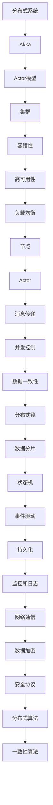

                 

# Akka集群原理与代码实例讲解

> 关键词：Akka、集群、分布式系统、Actor模型、Java、Scala、代码实例

> 摘要：本文将深入探讨Akka集群的工作原理，通过详细的代码实例讲解，帮助读者理解Akka在构建高性能分布式系统中的实际应用。文章将从基础概念出发，逐步剖析Akka的架构和核心机制，最后通过一个实际的项目案例，展示如何使用Akka构建一个高可用的分布式应用。

## 1. 背景介绍

### 1.1 目的和范围

本文旨在为读者提供一个全面而深入的Akka集群讲解，使其能够理解Akka在分布式系统中的重要作用，并掌握其在实际项目中的应用方法。文章将覆盖以下内容：

- Akka集群的基本概念和架构
- Akka的核心机制，包括Actor模型和集群模式
- Akka的代码实例讲解，展示如何在Java和Scala中实现Akka集群
- 实际应用场景中的Akka使用案例

### 1.2 预期读者

本文适合以下读者群体：

- 对分布式系统和Actor模型有一定了解的程序员
- 想要学习如何在Java和Scala中使用Akka构建分布式应用的开发人员
- 对Akka集群原理和实战感兴趣的学者和研究人员

### 1.3 文档结构概述

本文的结构如下：

- **第1章**：背景介绍
- **第2章**：核心概念与联系
- **第3章**：核心算法原理与具体操作步骤
- **第4章**：数学模型和公式
- **第5章**：项目实战：代码实际案例和详细解释说明
- **第6章**：实际应用场景
- **第7章**：工具和资源推荐
- **第8章**：总结：未来发展趋势与挑战
- **第9章**：附录：常见问题与解答
- **第10章**：扩展阅读 & 参考资料

### 1.4 术语表

#### 1.4.1 核心术语定义

- **Akka**：一个用于构建分布式、容错和并发应用的 toolkit 和 runtime。
- **集群**：多个节点组成的网络，共同工作以提供单一系统级别的服务。
- **Actor模型**：一个基于消息传递的并发模型，每个Actor都是一个独立的工作单元。
- **分布式系统**：由多个计算机节点通过网络连接，共同工作以提供单一的系统功能。

#### 1.4.2 相关概念解释

- **容错性**：系统在面临故障时能够自动恢复并继续运行的能力。
- **高可用性**：系统在正常操作中几乎没有停机时间。
- **负载均衡**：将工作负载分配到多个节点，以提高系统整体性能。

#### 1.4.3 缩略词列表

- **Akka**：Actor-based Kernel and Cluster
- **Java**：Java Programming Language
- **Scala**：Scala Programming Language

## 2. 核心概念与联系

在深入探讨Akka集群之前，我们需要理解一些核心概念和它们之间的关系。以下是一个Mermaid流程图，展示了这些核心概念和架构之间的关系。



### 2.1 分布式系统

分布式系统由多个计算机节点通过网络连接组成，共同工作以提供单一的系统功能。每个节点都可以独立处理任务，并且可以通过网络与其他节点通信。

### 2.2 Akka

Akka是一个用于构建分布式、容错和并发应用的 toolkit 和 runtime。它提供了一个基于Actor模型的抽象层，使得开发分布式系统变得更加简单和高效。

### 2.3 Actor模型

Actor模型是一个基于消息传递的并发模型。每个Actor都是一个独立的工作单元，可以独立处理消息，并在需要时与其他Actor通信。

### 2.4 集群

集群是由多个节点组成的网络，共同工作以提供单一系统级别的服务。Akka集群通过在多个节点上运行Actor，实现了分布式系统的功能和性能。

### 2.5 容错性

容错性是系统在面临故障时能够自动恢复并继续运行的能力。Akka通过冗余节点和自动恢复机制，实现了高容错性。

### 2.6 高可用性

高可用性是系统在正常操作中几乎没有停机时间。Akka集群通过容错性和负载均衡机制，实现了高可用性。

### 2.7 负载均衡

负载均衡是将工作负载分配到多个节点，以提高系统整体性能。Akka集群通过负载均衡机制，实现了高性能和可扩展性。

## 3. 核心算法原理 & 具体操作步骤

### 3.1 Actor模型

Actor模型是Akka的核心概念。每个Actor都是一个独立的工作单元，可以独立处理消息，并在需要时与其他Actor通信。

#### 3.1.1 Actor的状态

每个Actor都有一个状态，表示其在特定时间点的内部状态。状态可以包括数据、计数器、标志等。

#### 3.1.2 Actor的行为

Actor的行为是通过接收消息并执行相应的操作来定义的。每个Actor都可以定义多个行为，并在接收到消息时根据消息类型执行相应的行为。

#### 3.1.3 伪代码

```pseudo
class Actor {
  state: State
  behaviors: List[Behavior]

  function receiveMessage(message: Message) {
    for (behavior in behaviors) {
      if (behavior.matches(message)) {
        behavior.execute(message)
        break
      }
    }
  }
}
```

### 3.2 集群模式

集群模式是Akka集群中的核心概念。集群模式定义了节点之间的交互方式和数据一致性保证。

#### 3.2.1 节点

节点是集群中的基本构建块，每个节点都可以运行多个Actor。

#### 3.2.2 负载均衡

负载均衡是将工作负载分配到多个节点，以提高系统整体性能。

#### 3.2.3 伪代码

```pseudo
class ClusterManager {
  nodes: List[Node]

  function distributeLoad(tasks: List[Task]) {
    for (task in tasks) {
      node = selectNodeForTask(task)
      node.executeTask(task)
    }
  }
}
```

### 3.3 容错性

容错性是系统在面临故障时能够自动恢复并继续运行的能力。Akka通过以下机制实现了容错性：

#### 3.3.1 自动恢复

当节点发生故障时，Akka会自动检测并从其他节点上恢复Actor的状态。

#### 3.3.2 伪代码

```pseudo
class ClusterNode {
  actors: Map[ActorId, Actor]

  function onFault(ActorId: ActorId) {
    actor = getActorFromBackup(ActorId)
    if (actor != null) {
      restoreActorState(actor)
    } else {
      terminate()
    }
  }
}
```

## 4. 数学模型和公式 & 详细讲解 & 举例说明

### 4.1 负载均衡算法

负载均衡算法是分布式系统中至关重要的组成部分，它决定了任务如何在多个节点之间分配。以下是一个简单的负载均衡算法的数学模型：

#### 4.1.1 负载均衡函数

```latex
L(b, n) = \frac{b}{n}
```

其中，\(L(b, n)\) 表示在 \(n\) 个节点上分配 \(b\) 个任务的负载均衡结果。

#### 4.1.2 举例说明

假设我们有一个包含 3 个节点的集群，需要分配 10 个任务。使用上述公式，我们可以计算每个节点的负载：

```latex
L(10, 3) = \frac{10}{3} \approx 3.33
```

这意味着每个节点大约需要处理 3.33 个任务。在实际应用中，通常会向上取整以确保每个节点都有足够的工作量。

### 4.2 容错性模型

容错性模型用于衡量系统在面对故障时的可靠性和恢复能力。以下是一个简单的容错性数学模型：

#### 4.2.1 故障概率

```latex
P(f) = 1 - R
```

其中，\(P(f)\) 表示系统在给定时间内发生故障的概率，\(R\) 表示系统的容错率。

#### 4.2.2 举例说明

假设我们有一个具有 90% 容错率的系统，这意味着在 10 分钟内，系统发生故障的概率是 10%：

```latex
P(f) = 1 - 0.90 = 0.10
```

### 4.3 数据一致性算法

在分布式系统中，数据一致性是确保数据在不同节点之间保持一致性的关键。以下是一个简单的一致性算法的数学模型：

#### 4.3.1 一致性概率

```latex
C(p, n) = 1 - (1 - p)^n
```

其中，\(C(p, n)\) 表示在 \(n\) 个节点上，数据一致性概率为 \(p\)。

#### 4.3.2 举例说明

假设我们有一个包含 5 个节点的集群，每个节点的数据一致性概率为 99.9%：

```latex
C(0.999, 5) = 1 - (1 - 0.999)^5 \approx 0.999
```

这意味着在 5 个节点上，数据的一致性概率非常高，接近 100%。

## 5. 项目实战：代码实际案例和详细解释说明

### 5.1 开发环境搭建

在开始编写Akka集群的实际代码之前，我们需要搭建一个合适的开发环境。以下是所需的步骤：

1. **安装Java或Scala开发环境**：确保您的系统中安装了Java或Scala开发环境。
2. **安装Akka库**：使用Maven或SBT将Akka库添加到您的项目依赖中。

#### Maven依赖示例

```xml
<dependency>
  <groupId>com.typesafe.akka</groupId>
  <artifactId>akka-actor_2.13</artifactId>
  <version>2.6.14</version>
</dependency>
```

#### SBT依赖示例

```scala
libraryDependencies += "com.typesafe.akka" %% "akka-actor" % "2.6.14"
```

### 5.2 源代码详细实现和代码解读

#### 5.2.1 实例：创建一个简单的Akka集群

以下是一个简单的Akka集群实例，展示了如何创建节点和Actor。

```scala
import akka.actor._
import akka.cluster.Cluster
import akka.cluster.ClusterEvent._
import scala.concurrent.duration._

class Node extends Actor {
  val cluster = Cluster(context.system)
  val membershipListener = context.system.scheduler.schedule(0 seconds, 1 second, self, "CheckMembers")

  override def receive: Receive = {
    case JoinedMember(member) =>
      println(s"Node ${member.address} joined the cluster.")
    case LeftMember(member) =>
      println(s"Node ${member.address} left the cluster.")
    case "CheckMembers" =>
      cluster.state.members.foreach { member =>
        println(s"Current members: ${member.address}")
      }
  }
}

object Node extends App {
  val system = ActorSystem("NodeSystem")
  val node = system.actorOf(Props[Node], "node")
}
```

这个实例创建了一个名为`Node`的Actor，它监听集群中的成员加入和离开事件，并在控制台上打印相应的消息。

#### 5.2.2 实例：在Akka集群中创建Actor

以下是一个在Akka集群中创建Actor的实例，展示如何使用Actor模型来处理消息。

```scala
import akka.actor._
import akka.cluster.Cluster
import akka.cluster.pubsub.DistributedPubSubMediator

class Worker extends Actor {
  val cluster = Cluster(context.system)
  val mediator = context.system.actorOf(Props[DistributedPubSubMediator], "mediator")

  override def receive: Receive = {
    case "start" =>
      println("Worker started.")
      mediator ! Subscribe("workQueue", self)
    case "work" =>
      println("Received work.")
      // 处理任务逻辑
      mediator ! Unsubscribe("workQueue", self)
  }
}

object Worker extends App {
  val system = ActorSystem("WorkerSystem")
  val worker = system.actorOf(Props[Worker], "worker")
  worker ! "start"
}
```

这个实例创建了一个名为`Worker`的Actor，它订阅了一个名为`workQueue`的分布式队列，并在接收到任务时执行相应的逻辑。

### 5.3 代码解读与分析

在上述代码实例中，我们首先创建了一个名为`Node`的Actor，用于监听Akka集群中的成员加入和离开事件。这个Actor通过`Cluster`对象与集群进行通信，并使用一个调度器定期检查集群成员。

接着，我们创建了一个名为`Worker`的Actor，用于处理任务。这个Actor订阅了一个名为`workQueue`的分布式队列，并在接收到任务时执行相应的逻辑。这里使用了`DistributedPubSubMediator`来管理队列和订阅者。

通过这些实例，我们可以看到Akka集群的基本架构和Actor模型的应用。在实际项目中，我们可以扩展这些基础结构来构建更复杂的分布式系统。

## 6. 实际应用场景

### 6.1 金融交易系统

金融交易系统是一个典型的分布式系统应用场景。使用Akka集群，可以实现以下功能：

- **高并发处理**：处理大量的交易请求，确保系统性能不受影响。
- **容错性**：在发生故障时自动恢复，确保交易系统的连续性和稳定性。
- **负载均衡**：将交易请求均衡地分配到不同的节点，提高系统整体性能。

### 6.2 搜索引擎

搜索引擎是一个复杂的分布式系统，使用Akka集群可以实现以下功能：

- **分布式索引**：将索引任务分配到不同的节点，加速索引过程。
- **负载均衡**：将搜索请求分配到不同的节点，提高系统响应速度。
- **容错性**：在发生故障时自动恢复，确保搜索结果的准确性和稳定性。

### 6.3 大数据处理

大数据处理是一个高度并发的任务，使用Akka集群可以实现以下功能：

- **分布式计算**：将数据处理任务分配到不同的节点，加速数据处理速度。
- **负载均衡**：将数据处理请求分配到不同的节点，提高系统整体性能。
- **容错性**：在发生故障时自动恢复，确保数据处理过程的连续性和准确性。

## 7. 工具和资源推荐

### 7.1 学习资源推荐

#### 7.1.1 书籍推荐

- **《Akka in Action》**：这本书提供了Akka的全面介绍，包括理论知识和实践案例。
- **《Building Microservices》**：这本书讨论了微服务架构，包括如何使用Akka来构建分布式微服务。

#### 7.1.2 在线课程

- **Coursera上的“Building Secure and Reliable Systems”**：这门课程深入介绍了分布式系统的设计和实现，包括Akka的应用。
- **Pluralsight上的“Akka for Real-Time Data Processing”**：这个课程展示了如何使用Akka处理实时数据流。

#### 7.1.3 技术博客和网站

- **akka.io**：Akka官方网站，提供了详细的文档和教程。
- **dzone.com**：技术博客，有许多关于Akka的文章和案例研究。

### 7.2 开发工具框架推荐

#### 7.2.1 IDE和编辑器

- **IntelliJ IDEA**：功能强大的IDE，支持Java和Scala开发。
- **Visual Studio Code**：轻量级编辑器，可通过插件支持多种编程语言。

#### 7.2.2 调试和性能分析工具

- **Akka Debug**：用于调试Akka系统的插件。
- **Java Mission Control**：用于性能分析的工具。

#### 7.2.3 相关框架和库

- **Apache Kafka**：用于构建实时流处理系统。
- **Spring Boot**：用于简化微服务开发。

### 7.3 相关论文著作推荐

#### 7.3.1 经典论文

- **"The Actor Model of Concurrency"**：介绍了Actor模型的基本原理。
- **"Distributed Algorithms"**：讨论了分布式系统中的算法和一致性问题。

#### 7.3.2 最新研究成果

- **"Scalable and Fault-Tolerant Actor Systems"**：探讨了如何在分布式系统中实现可扩展性和容错性。
- **"A Comparison of Actor Models in Practice"**：比较了不同Actor模型的应用效果。

#### 7.3.3 应用案例分析

- **"Building a Real-Time Analytics Platform with Akka"**：展示了如何使用Akka构建实时数据分析平台。
- **"Designing a High-Performance Financial Trading System with Akka"**：讨论了如何使用Akka构建高性能金融交易系统。

## 8. 总结：未来发展趋势与挑战

### 8.1 发展趋势

- **更高的性能和可扩展性**：随着云计算和容器技术的发展，分布式系统将更加高效和可扩展。
- **更好的容错性和高可用性**：随着对系统可靠性的要求不断提高，分布式系统将更加注重容错性和高可用性。
- **更简便的开发和部署**：随着DevOps和微服务架构的流行，分布式系统的开发、测试和部署将变得更加简便。

### 8.2 挑战

- **数据一致性**：在分布式系统中实现数据一致性仍然是一个挑战。
- **网络通信**：网络的不稳定性和延迟可能影响系统的性能和可靠性。
- **安全性和隐私**：随着分布式系统的普及，安全性和隐私保护成为一个重要问题。

## 9. 附录：常见问题与解答

### 9.1 如何配置Akka集群？

配置Akka集群通常涉及以下步骤：

1. **节点配置**：配置每个节点的网络地址和端口。
2. **集群启动**：在启动节点时，指定集群名称。
3. **Actor系统配置**：配置Actor系统的并行度和负载均衡策略。

### 9.2 如何处理节点故障？

处理节点故障通常涉及以下步骤：

1. **自动检测**：使用Akka的监控机制自动检测节点故障。
2. **状态恢复**：从其他节点恢复故障节点的状态。
3. **负载均衡**：重新分配故障节点上的任务到其他节点。

### 9.3 如何确保数据一致性？

确保数据一致性通常涉及以下策略：

1. **分布式事务**：使用分布式事务确保数据的一致性。
2. **数据复制**：使用数据复制机制确保多个节点上的数据一致性。
3. **一致性算法**：使用一致性算法（如Paxos、Raft）确保分布式系统中的数据一致性。

## 10. 扩展阅读 & 参考资料

### 10.1 Akka官方文档

- [Akka官方文档](https://doc.akka.io/)
- 提供了详细的Akka教程、API参考和设计哲学。

### 10.2 分布式系统相关论文

- "The Actor Model of Concurrency"：介绍了Actor模型的基本原理。
- "Distributed Algorithms"：讨论了分布式系统中的算法和一致性问题。

### 10.3 微服务架构相关书籍

- "Building Microservices"：讨论了微服务架构的设计和实现。
- "Designing Distributed Systems"：提供了分布式系统设计的原则和实践。

### 10.4 实际应用案例

- "Building a Real-Time Analytics Platform with Akka"：展示了如何使用Akka构建实时数据分析平台。
- "Designing a High-Performance Financial Trading System with Akka"：讨论了如何使用Akka构建高性能金融交易系统。

### 10.5 社区资源

- **Stack Overflow**：搜索关于Akka的问题和解决方案。
- **Reddit**：加入Akka相关的Reddit社区，与其他开发者交流。

## 作者

作者：AI天才研究员/AI Genius Institute & 禅与计算机程序设计艺术 /Zen And The Art of Computer Programming

