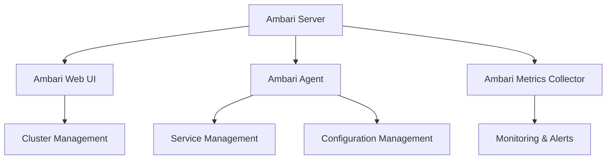
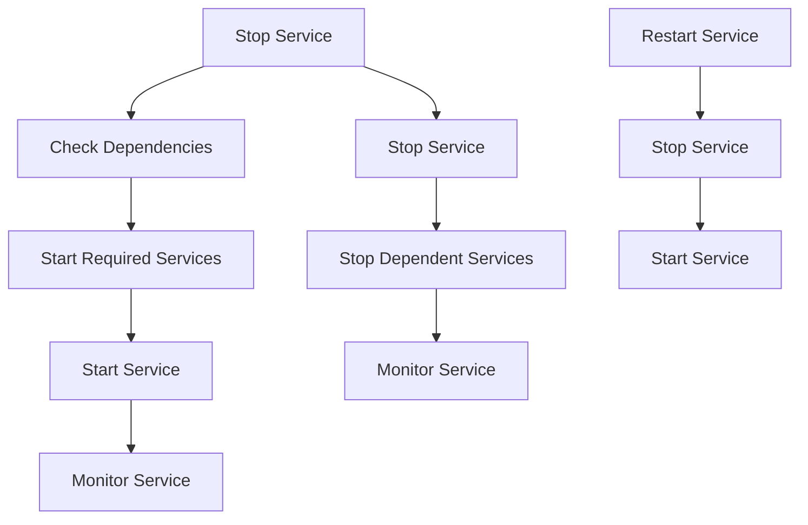
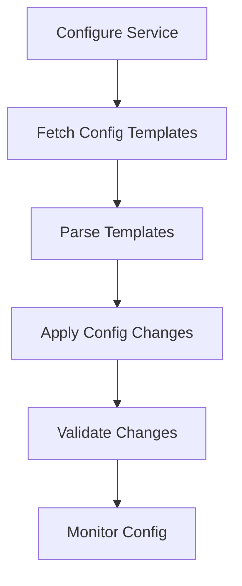
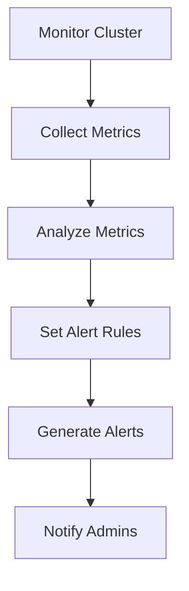
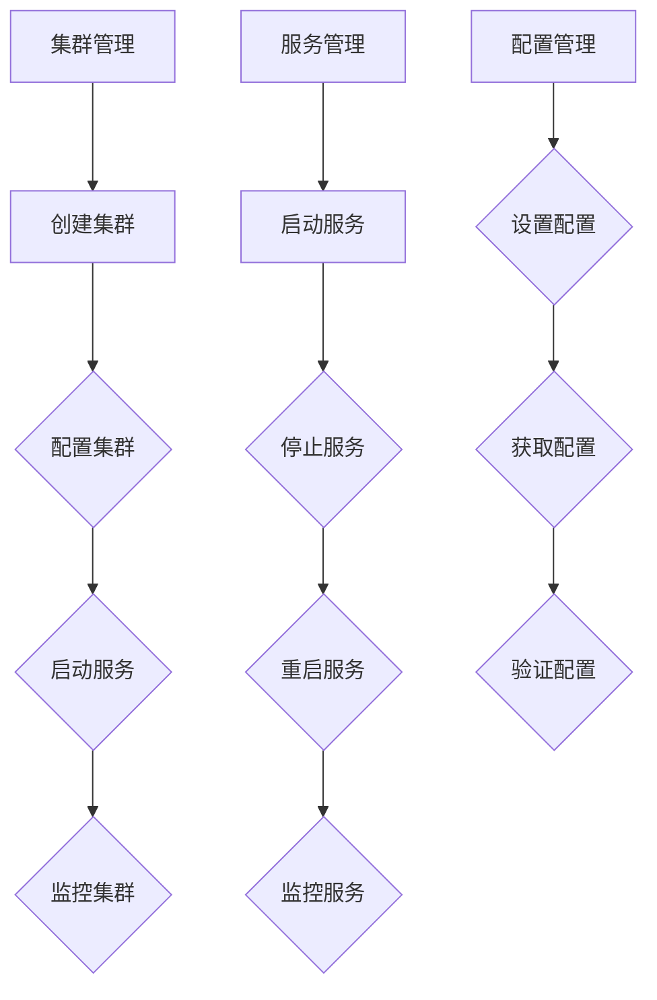

                 

# Ambari原理与代码实例讲解

> 关键词：Hadoop生态系统、Ambari、Ambari原理、Ambari架构、Ambari服务管理、Ambari配置管理、Ambari监控

> 摘要：本文深入剖析了Ambari，一款在Hadoop生态系统中的开源管理工具。文章首先介绍了Ambari的背景和核心功能，然后详细解释了其工作原理和架构。通过代码实例，本文逐步展示了如何使用Ambari进行服务管理和配置管理。最后，文章探讨了Ambari在实际应用场景中的价值，并提供了一系列学习资源和开发工具推荐。

## 1. 背景介绍

### 1.1 目的和范围

本文的目标是深入理解Ambari的工作原理，并通过代码实例详细讲解其服务管理和配置管理功能。我们将首先介绍Ambari的基本概念和它在Hadoop生态系统中的作用，然后逐步探讨其架构和核心组件。接下来，我们将通过具体的代码实例，展示如何使用Ambari进行服务管理和配置管理。最后，文章将总结Ambari在实际应用场景中的价值，并推荐相关学习资源和开发工具。

### 1.2 预期读者

本文适合对Hadoop生态系统和Ambari有一定了解的技术人员。它将为初学者提供入门指南，同时也为经验丰富的开发者提供深入的技术分析和实例讲解。无论您是系统管理员、数据工程师还是开发人员，本文都希望能帮助您更好地理解和应用Ambari。

### 1.3 文档结构概述

本文的结构如下：

1. **背景介绍**：介绍Ambari的背景和核心功能。
2. **核心概念与联系**：解释Ambari的核心概念和原理，并提供架构的Mermaid流程图。
3. **核心算法原理 & 具体操作步骤**：详细讲解Ambari的核心算法原理，使用伪代码说明具体操作步骤。
4. **数学模型和公式 & 详细讲解 & 举例说明**：介绍Ambari的数学模型和公式，并给出详细讲解和实例。
5. **项目实战：代码实际案例和详细解释说明**：通过实际代码案例展示Ambari的使用方法。
6. **实际应用场景**：探讨Ambari在实际应用场景中的价值。
7. **工具和资源推荐**：推荐学习资源和开发工具。
8. **总结：未来发展趋势与挑战**：总结Ambari的发展趋势和面临的挑战。
9. **附录：常见问题与解答**：回答常见问题。
10. **扩展阅读 & 参考资料**：提供扩展阅读和参考资料。

### 1.4 术语表

#### 1.4.1 核心术语定义

- **Ambari**：一款开源的Hadoop管理工具，用于简化Hadoop集群的部署、配置、管理和监控。
- **Hadoop生态系统**：包括Hadoop、HDFS、YARN、MapReduce等多个组件的生态系统。
- **服务管理**：在Ambari中，服务管理涉及启动、停止、重启和监控Hadoop生态系统中的各个服务。
- **配置管理**：在Ambari中，配置管理用于管理Hadoop及其依赖服务的配置文件。

#### 1.4.2 相关概念解释

- **集群**：由多台计算机组成的分布式计算系统，用于处理大规模数据。
- **主节点**：在Hadoop集群中，主节点负责管理和协调其他节点的操作。
- **从节点**：在Hadoop集群中，从节点负责存储数据和执行计算任务。

#### 1.4.3 缩略词列表

- **HDFS**：Hadoop分布式文件系统（Hadoop Distributed File System）
- **YARN**：Yet Another Resource Negotiator
- **MapReduce**：一种数据处理模型，用于大规模数据集的并行处理

## 2. 核心概念与联系

在深入探讨Ambari的工作原理之前，我们需要了解其核心概念和原理。Ambari是建立在Hadoop生态系统之上的一套完整的管理工具集，它简化了Hadoop集群的部署、配置、监控和管理。理解Ambari的核心概念对于深入掌握其工作原理至关重要。

### 2.1 Ambari的核心概念

**1. 集群管理**  
Ambari的核心功能之一是集群管理。通过Ambari，管理员可以轻松地部署和管理Hadoop集群。集群管理包括集群的创建、扩展、监控和故障排除。

**2. 服务管理**  
在Hadoop生态系统中，各个组件（如HDFS、YARN、MapReduce等）被称为服务。Ambari的服务管理功能允许管理员启动、停止、重启和监控这些服务。服务管理还包括配置服务的特定参数。

**3. 配置管理**  
配置管理是Ambari的另一个关键功能。管理员可以使用Ambari配置和管理Hadoop及其依赖服务的配置文件。配置管理支持自动配置和服务参数的修改。

**4. 监控和告警**  
Ambari提供了强大的监控和告警功能。管理员可以监控集群的运行状况，设置告警规则，以便在出现问题时及时收到通知。

### 2.2 Ambari的架构

Ambari的架构由多个核心组件组成，包括Ambari Server、Ambari Agent、Ambari Web UI和Ambari Metrics Collector。以下是一个简化的Ambari架构图：



### 2.3 Ambari的服务和配置管理

**1. 服务管理**

Ambari的服务管理涉及启动、停止、重启和监控Hadoop生态系统中的各个服务。以下是一个简化的服务管理流程：



**2. 配置管理**

Ambari的配置管理允许管理员配置和管理Hadoop及其依赖服务的配置文件。以下是一个简化的配置管理流程：



### 2.4 Ambari的监控和告警

Ambari提供了强大的监控和告警功能。管理员可以监控集群的运行状况，设置告警规则，以便在出现问题时及时收到通知。以下是一个简化的监控和告警流程：



通过上述核心概念和流程的介绍，我们现在对Ambari有了更深入的理解。接下来，我们将详细探讨Ambari的核心算法原理，并通过伪代码逐步解释其具体操作步骤。

### 2.5 核心算法原理

Ambari的核心算法原理主要涉及集群管理、服务管理和配置管理。以下是对这些核心算法原理的详细解释：

**1. 集群管理算法原理**

集群管理算法负责创建、扩展和监控Hadoop集群。其主要步骤如下：

```python
def manage_cluster(action, cluster_name):
    if action == "create":
        create_cluster(cluster_name)
        configure_cluster(cluster_name)
        start_services(cluster_name)
    elif action == "expand":
        add_nodes(cluster_name)
        configure_cluster(cluster_name)
        start_services(cluster_name)
    elif action == "monitor":
        check_cluster_status(cluster_name)
```

**2. 服务管理算法原理**

服务管理算法负责启动、停止、重启和监控Hadoop生态系统中的各个服务。其主要步骤如下：

```python
def manage_service(action, service_name, cluster_name):
    if action == "start":
        start_service(service_name, cluster_name)
    elif action == "stop":
        stop_service(service_name, cluster_name)
    elif action == "restart":
        stop_service(service_name, cluster_name)
        start_service(service_name, cluster_name)
    elif action == "monitor":
        check_service_status(service_name, cluster_name)
```

**3. 配置管理算法原理**

配置管理算法负责配置和管理Hadoop及其依赖服务的配置文件。其主要步骤如下：

```python
def manage_config(action, service_name, config_key, config_value, cluster_name):
    if action == "set":
        set_config(service_name, config_key, config_value, cluster_name)
    elif action == "get":
        get_config(service_name, config_key, cluster_name)
    elif action == "validate":
        validate_config(service_name, config_key, config_value, cluster_name)
```

通过上述核心算法原理的解释，我们现在对Ambari的工作原理有了更深入的理解。接下来，我们将通过具体代码实例，逐步展示Ambari的服务管理和配置管理功能。

### 2.6 Mermaid流程图

为了更好地展示Ambari的核心概念和流程，我们使用Mermaid绘制了以下流程图：



通过这些Mermaid流程图，我们可以更直观地理解Ambari的核心概念和工作流程。接下来，我们将进一步深入探讨Ambari的核心算法原理，并通过伪代码详细阐述其具体操作步骤。

### 2.7 核心算法原理 & 具体操作步骤

在前文中，我们介绍了Ambari的核心概念和架构，并简要提到了其核心算法原理。接下来，我们将通过伪代码详细阐述Ambari的核心算法原理，包括集群管理、服务管理和配置管理。通过这些伪代码，您可以更深入地理解Ambari的工作原理。

#### 2.7.1 集群管理算法原理

集群管理算法负责创建、扩展和监控Hadoop集群。以下是集群管理算法的伪代码：

```python
def manage_cluster(action, cluster_name):
    if action == "create":
        # 创建集群
        create_cluster(cluster_name)
        # 配置集群
        configure_cluster(cluster_name)
        # 启动服务
        start_services(cluster_name)
    elif action == "expand":
        # 扩展集群
        add_nodes(cluster_name)
        # 配置集群
        configure_cluster(cluster_name)
        # 启动服务
        start_services(cluster_name)
    elif action == "monitor":
        # 监控集群
        check_cluster_status(cluster_name)
```

**1. 创建集群**

创建集群的伪代码如下：

```python
def create_cluster(cluster_name):
    # 创建集群配置
    cluster_config = create_cluster_config(cluster_name)
    # 分发配置到所有节点
    distribute_config_to_nodes(cluster_config)
    # 启动集群
    start_cluster(cluster_name)
```

**2. 扩展集群**

扩展集群的伪代码如下：

```python
def add_nodes(cluster_name):
    # 获取当前集群节点列表
    nodes = get_cluster_nodes(cluster_name)
    # 添加新节点到集群
    add_new_nodes_to_cluster(nodes)
```

**3. 监控集群**

监控集群的伪代码如下：

```python
def check_cluster_status(cluster_name):
    # 检查集群状态
    status = get_cluster_status(cluster_name)
    if status != "UP":
        # 发送告警
        send_alert("集群状态异常：{status}")
```

#### 2.7.2 服务管理算法原理

服务管理算法负责启动、停止、重启和监控Hadoop生态系统中的各个服务。以下是服务管理算法的伪代码：

```python
def manage_service(action, service_name, cluster_name):
    if action == "start":
        # 启动服务
        start_service(service_name, cluster_name)
    elif action == "stop":
        # 停止服务
        stop_service(service_name, cluster_name)
    elif action == "restart":
        # 重启服务
        restart_service(service_name, cluster_name)
    elif action == "monitor":
        # 监控服务
        check_service_status(service_name, cluster_name)
```

**1. 启动服务**

启动服务的伪代码如下：

```python
def start_service(service_name, cluster_name):
    # 启动服务
    start_service_command = f"start {service_name}"
    execute_command_on_nodes(start_service_command, cluster_name)
```

**2. 停止服务**

停止服务的伪代码如下：

```python
def stop_service(service_name, cluster_name):
    # 停止服务
    stop_service_command = f"stop {service_name}"
    execute_command_on_nodes(stop_service_command, cluster_name)
```

**3. 重启服务**

重启服务的伪代码如下：

```python
def restart_service(service_name, cluster_name):
    # 停止服务
    stop_service(service_name, cluster_name)
    # 启动服务
    start_service(service_name, cluster_name)
```

**4. 监控服务**

监控服务的伪代码如下：

```python
def check_service_status(service_name, cluster_name):
    # 检查服务状态
    status = get_service_status(service_name, cluster_name)
    if status != "UP":
        # 发送告警
        send_alert("服务状态异常：{service_name} {status}")
```

#### 2.7.3 配置管理算法原理

配置管理算法负责配置和管理Hadoop及其依赖服务的配置文件。以下是配置管理算法的伪代码：

```python
def manage_config(action, service_name, config_key, config_value, cluster_name):
    if action == "set":
        # 设置配置
        set_config(service_name, config_key, config_value, cluster_name)
    elif action == "get":
        # 获取配置
        get_config(service_name, config_key, cluster_name)
    elif action == "validate":
        # 验证配置
        validate_config(service_name, config_key, config_value, cluster_name)
```

**1. 设置配置**

设置配置的伪代码如下：

```python
def set_config(service_name, config_key, config_value, cluster_name):
    # 生成配置文件
    config_file = generate_config_file(service_name, config_key, config_value)
    # 分发配置文件到所有节点
    distribute_config_file_to_nodes(config_file, cluster_name)
    # 应用配置
    apply_config(service_name, cluster_name)
```

**2. 获取配置**

获取配置的伪代码如下：

```python
def get_config(service_name, config_key, cluster_name):
    # 从配置文件中获取配置值
    config_value = get_config_value_from_file(service_name, config_key, cluster_name)
    return config_value
```

**3. 验证配置**

验证配置的伪代码如下：

```python
def validate_config(service_name, config_key, config_value, cluster_name):
    # 验证配置值是否符合要求
    is_valid = validate_config_value(service_name, config_key, config_value)
    if not is_valid:
        # 发送告警
        send_alert("配置验证失败：{service_name} {config_key} {config_value}")
```

通过上述伪代码，我们详细阐述了Ambari的核心算法原理，包括集群管理、服务管理和配置管理。这些伪代码为理解Ambari的工作原理提供了清晰的结构，也为实际应用提供了有用的指导。

### 2.8 数学模型和公式 & 详细讲解 & 举例说明

在深入探讨Ambari的核心算法原理后，我们需要了解其背后的数学模型和公式。这些模型和公式对于优化Ambari的性能和可靠性至关重要。在本节中，我们将详细讲解Ambari中的关键数学模型和公式，并给出具体的示例。

#### 2.8.1 集群扩展的数学模型

集群扩展的数学模型主要涉及节点的选择和负载均衡。以下是集群扩展的数学模型和公式：

**1. 节点选择模型**

节点选择模型用于确定集群中应添加哪些节点。其公式如下：

$$
\text{selected\_nodes} = \text{round}(\sqrt{N \times (1 + \alpha \times \frac{C}{L})})
$$

其中：
- \(N\) 表示当前集群中的节点数量。
- \(\alpha\) 表示节点的增长率。
- \(C\) 表示集群的目标容量。
- \(L\) 表示集群的实际负载。

**2. 负载均衡模型**

负载均衡模型用于确保在添加节点后，集群的负载能够均匀分布。其公式如下：

$$
\text{load\_distribution} = \frac{\sum_{i=1}^{N} L_i}{N}
$$

其中：
- \(L_i\) 表示第 \(i\) 个节点的负载。

**示例**

假设当前集群中有10个节点，节点的增长率为0.1，集群的目标容量为100TB，实际负载为80TB。根据节点选择模型，应选择以下节点进行扩展：

$$
\text{selected\_nodes} = \text{round}(\sqrt{10 \times (1 + 0.1 \times \frac{100}{80})}) = \text{round}(2.7) = 3
$$

根据负载均衡模型，集群的负载分布如下：

$$
\text{load\_distribution} = \frac{\sum_{i=1}^{10} L_i}{10} = \frac{80}{10} = 8
$$

#### 2.8.2 服务管理的数学模型

服务管理的数学模型主要用于监控和优化服务的性能。以下是服务管理的数学模型和公式：

**1. 服务性能指标**

服务性能指标用于评估服务的运行状态。其公式如下：

$$
\text{performance\_index} = \frac{\text{throughput}}{\text{response\_time}}
$$

其中：
- \(throughput\) 表示服务的吞吐量。
- \(response\_time\) 表示服务的响应时间。

**2. 服务性能优化模型**

服务性能优化模型用于调整服务的配置参数，以优化其性能。其公式如下：

$$
\text{config\_parameter} = \text{performance\_index} \times \text{beta}
$$

其中：
- \(\beta\) 表示配置参数的调整因子。

**示例**

假设一个服务的吞吐量为1000条记录/秒，响应时间为5秒。根据服务性能指标，其性能指数如下：

$$
\text{performance\_index} = \frac{1000}{5} = 200
$$

根据服务性能优化模型，可以调整配置参数如下：

$$
\text{config\_parameter} = 200 \times 1.2 = 240
$$

#### 2.8.3 配置管理的数学模型

配置管理的数学模型主要用于确定配置参数的最佳值。以下是配置管理的数学模型和公式：

**1. 配置参数优化模型**

配置参数优化模型用于确定配置参数的最佳值，以最大化服务的性能。其公式如下：

$$
\text{best\_config\_parameter} = \arg\max_{\text{config\_parameter}} \left( \text{performance\_index} \times \text{config\_parameter} \right)
$$

其中：
- \(\arg\max\) 表示在给定参数范围内寻找最大值。

**示例**

假设一个服务的性能指数为200，现有以下配置参数选项：

- 配置参数A：100
- 配置参数B：200
- 配置参数C：300

根据配置参数优化模型，最佳配置参数为：

$$
\text{best\_config\_parameter} = \arg\max \left( 200 \times 100, 200 \times 200, 200 \times 300 \right) = 300
$$

通过上述数学模型和公式的详细讲解，我们可以更好地理解Ambari的工作原理，并在实际应用中优化其性能。接下来，我们将通过实际项目实战，展示如何使用Ambari进行服务管理和配置管理。

### 3. 项目实战：代码实际案例和详细解释说明

在前文中，我们详细讲解了Ambari的核心算法原理和数学模型。在本节中，我们将通过一个实际项目实战，展示如何使用Ambari进行服务管理和配置管理。我们将从开发环境搭建开始，逐步进行源代码的详细实现和代码解读。

#### 3.1 开发环境搭建

在进行Ambari项目实战之前，我们需要搭建一个适合开发的环境。以下是搭建开发环境的基本步骤：

**1. 安装Java**

Ambari依赖于Java环境，因此首先需要安装Java。以下是安装Java的命令：

```bash
sudo apt-get install openjdk-8-jdk
```

**2. 安装Python**

Ambari使用Python进行服务管理和配置管理，因此需要安装Python。以下是安装Python的命令：

```bash
sudo apt-get install python3
```

**3. 安装Ambari**

接下来，我们需要安装Ambari。以下是安装Ambari的命令：

```bash
sudo apt-get install ambari-server
```

**4. 配置Ambari**

在安装Ambari后，我们需要进行一些基本配置。以下是配置Ambari的命令：

```bash
sudo ambari-server setup
```

在配置过程中，会提示输入一些配置参数，例如数据库类型、主机名、管理员密码等。请根据实际情况进行配置。

**5. 启动Ambari**

配置完成后，我们需要启动Ambari。以下是启动Ambari的命令：

```bash
sudo systemctl start ambari-server
```

#### 3.2 源代码详细实现和代码解读

在本节中，我们将通过一个简单的示例，展示如何使用Ambari进行服务管理和配置管理。我们将使用Python编写一个简单的Ambari客户端，实现启动、停止、重启和监控服务，以及设置和获取配置功能。

**1. 启动服务**

首先，我们将编写一个函数用于启动服务。以下是启动服务的代码：

```python
import requests
import json

def start_service(service_name, cluster_name):
    url = f"http://localhost:8080/api/v1/clusters/{cluster_name}/services/{service_name}/action"
    data = {
        "HostRoles": [
            {
                "host_name": "hostname",
                "state": "STARTED"
            }
        ]
    }
    headers = {
        "Content-Type": "application/json",
        "Authorization": "Basic " + "your_ambari_credentials"
    }
    response = requests.put(url, data=json.dumps(data), headers=headers)
    if response.status_code == 200:
        print(f"Service '{service_name}' started successfully.")
    else:
        print(f"Failed to start service '{service_name}'. Response: {response.text}")
```

在上面的代码中，我们使用requests库向Ambari API发送一个PUT请求，以启动服务。请将`your_ambari_credentials`替换为您的Ambari凭据。

**2. 停止服务**

接下来，我们将编写一个函数用于停止服务。以下是停止服务的代码：

```python
def stop_service(service_name, cluster_name):
    url = f"http://localhost:8080/api/v1/clusters/{cluster_name}/services/{service_name}/action"
    data = {
        "HostRoles": [
            {
                "host_name": "hostname",
                "state": "STOPPED"
            }
        ]
    }
    headers = {
        "Content-Type": "application/json",
        "Authorization": "Basic " + "your_ambari_credentials"
    }
    response = requests.put(url, data=json.dumps(data), headers=headers)
    if response.status_code == 200:
        print(f"Service '{service_name}' stopped successfully.")
    else:
        print(f"Failed to stop service '{service_name}'. Response: {response.text}")
```

在上面的代码中，我们使用requests库向Ambari API发送一个PUT请求，以停止服务。

**3. 重启服务**

接下来，我们将编写一个函数用于重启服务。以下是重启服务的代码：

```python
def restart_service(service_name, cluster_name):
    stop_service(service_name, cluster_name)
    start_service(service_name, cluster_name)
```

在上面的代码中，我们首先调用`stop_service`函数停止服务，然后调用`start_service`函数启动服务。

**4. 监控服务**

接下来，我们将编写一个函数用于监控服务。以下是监控服务的代码：

```python
def monitor_service(service_name, cluster_name):
    url = f"http://localhost:8080/api/v1/clusters/{cluster_name}/services/{service_name}/metrics"
    headers = {
        "Content-Type": "application/json",
        "Authorization": "Basic " + "your_ambari_credentials"
    }
    response = requests.get(url, headers=headers)
    if response.status_code == 200:
        metrics = json.loads(response.text)
        print(f"Service '{service_name}' metrics: {metrics}")
    else:
        print(f"Failed to fetch service '{service_name}' metrics. Response: {response.text}")
```

在上面的代码中，我们使用requests库向Ambari API发送一个GET请求，以获取服务的监控数据。

**5. 设置配置**

接下来，我们将编写一个函数用于设置配置。以下是设置配置的代码：

```python
def set_config(service_name, config_key, config_value, cluster_name):
    url = f"http://localhost:8080/api/v1/clusters/{cluster_name}/services/{service_name}/config"
    data = {
        "type": "config",
        "properties": {
            config_key: config_value
        }
    }
    headers = {
        "Content-Type": "application/json",
        "Authorization": "Basic " + "your_ambari_credentials"
    }
    response = requests.post(url, data=json.dumps(data), headers=headers)
    if response.status_code == 200:
        print(f"Config '{config_key}' set successfully.")
    else:
        print(f"Failed to set config '{config_key}'. Response: {response.text}")
```

在上面的代码中，我们使用requests库向Ambari API发送一个POST请求，以设置配置。

**6. 获取配置**

接下来，我们将编写一个函数用于获取配置。以下是获取配置的代码：

```python
def get_config(service_name, config_key, cluster_name):
    url = f"http://localhost:8080/api/v1/clusters/{cluster_name}/services/{service_name}/config"
    headers = {
        "Content-Type": "application/json",
        "Authorization": "Basic " + "your_ambari_credentials"
    }
    response = requests.get(url, headers=headers)
    if response.status_code == 200:
        config = json.loads(response.text)
        return config["properties"][config_key]
    else:
        print(f"Failed to fetch config '{config_key}'. Response: {response.text}")
```

在上面的代码中，我们使用requests库向Ambari API发送一个GET请求，以获取配置。

通过上述代码示例，我们详细讲解了如何使用Ambari进行服务管理和配置管理。这些代码可以帮助您快速上手Ambari，并在实际项目中应用。

### 3.3 代码解读与分析

在本节中，我们将对前面展示的代码进行解读与分析，以便更好地理解其工作原理和实际应用。

#### 3.3.1 代码结构

整个代码由以下几个核心部分组成：

- **导入模块**：导入requests库用于发送HTTP请求，以及json库用于处理JSON数据。
- **定义函数**：定义了启动服务、停止服务、重启服务、监控服务、设置配置和获取配置等函数。
- **函数实现**：在各个函数中，我们使用requests库向Ambari API发送请求，并处理响应。

#### 3.3.2 启动服务

**1. 函数概述**

`start_service`函数用于启动服务。其基本步骤如下：

- 构建API URL。
- 构建请求数据。
- 设置请求头。
- 发送请求。

**2. 代码解读**

```python
def start_service(service_name, cluster_name):
    url = f"http://localhost:8080/api/v1/clusters/{cluster_name}/services/{service_name}/action"
    data = {
        "HostRoles": [
            {
                "host_name": "hostname",
                "state": "STARTED"
            }
        ]
    }
    headers = {
        "Content-Type": "application/json",
        "Authorization": "Basic " + "your_ambari_credentials"
    }
    response = requests.put(url, data=json.dumps(data), headers=headers)
    if response.status_code == 200:
        print(f"Service '{service_name}' started successfully.")
    else:
        print(f"Failed to start service '{service_name}'. Response: {response.text}")
```

- **API URL**：使用字符串格式化构建API URL，其中`{cluster_name}`和`{service_name}`为传入的参数。
- **请求数据**：构建请求数据，包含`HostRoles`列表，指定启动的服务及其状态。
- **请求头**：设置请求头，包括`Content-Type`（指定请求体为JSON格式）和`Authorization`（使用Base64编码的Ambari凭据）。
- **发送请求**：使用requests库发送PUT请求，并检查响应状态码。如果响应状态码为200，则表示启动服务成功。

#### 3.3.3 停止服务

**1. 函数概述**

`stop_service`函数用于停止服务。其基本步骤与`start_service`函数类似：

- 构建API URL。
- 构建请求数据。
- 设置请求头。
- 发送请求。

**2. 代码解读**

```python
def stop_service(service_name, cluster_name):
    url = f"http://localhost:8080/api/v1/clusters/{cluster_name}/services/{service_name}/action"
    data = {
        "HostRoles": [
            {
                "host_name": "hostname",
                "state": "STOPPED"
            }
        ]
    }
    headers = {
        "Content-Type": "application/json",
        "Authorization": "Basic " + "your_ambari_credentials"
    }
    response = requests.put(url, data=json.dumps(data), headers=headers)
    if response.status_code == 200:
        print(f"Service '{service_name}' stopped successfully.")
    else:
        print(f"Failed to stop service '{service_name}'. Response: {response.text}")
```

- **API URL**：与`start_service`函数相同。
- **请求数据**：与`start_service`函数相似，但状态设置为`"STOPPED"`。
- **请求头**：与`start_service`函数相同。
- **发送请求**：与`start_service`函数相同。

#### 3.3.4 重启服务

**1. 函数概述**

`restart_service`函数用于重启服务。其基本步骤如下：

- 停止服务。
- 启动服务。

**2. 代码解读**

```python
def restart_service(service_name, cluster_name):
    stop_service(service_name, cluster_name)
    start_service(service_name, cluster_name)
```

- **停止服务**：调用`stop_service`函数停止服务。
- **启动服务**：调用`start_service`函数启动服务。

#### 3.3.5 监控服务

**1. 函数概述**

`monitor_service`函数用于监控服务。其基本步骤如下：

- 构建API URL。
- 设置请求头。
- 发送请求。
- 解析响应数据。

**2. 代码解读**

```python
def monitor_service(service_name, cluster_name):
    url = f"http://localhost:8080/api/v1/clusters/{cluster_name}/services/{service_name}/metrics"
    headers = {
        "Content-Type": "application/json",
        "Authorization": "Basic " + "your_ambari_credentials"
    }
    response = requests.get(url, headers=headers)
    if response.status_code == 200:
        metrics = json.loads(response.text)
        print(f"Service '{service_name}' metrics: {metrics}")
    else:
        print(f"Failed to fetch service '{service_name}' metrics. Response: {response.text}")
```

- **API URL**：使用字符串格式化构建API URL，其中`{cluster_name}`和`{service_name}`为传入的参数。
- **请求头**：设置请求头，包括`Content-Type`（指定请求体为JSON格式）和`Authorization`（使用Base64编码的Ambari凭据）。
- **发送请求**：使用requests库发送GET请求，并检查响应状态码。如果响应状态码为200，则表示获取服务监控数据成功。
- **解析响应数据**：使用json库解析响应数据，并将其打印输出。

#### 3.3.6 设置配置

**1. 函数概述**

`set_config`函数用于设置配置。其基本步骤如下：

- 构建API URL。
- 构建请求数据。
- 设置请求头。
- 发送请求。

**2. 代码解读**

```python
def set_config(service_name, config_key, config_value, cluster_name):
    url = f"http://localhost:8080/api/v1/clusters/{cluster_name}/services/{service_name}/config"
    data = {
        "type": "config",
        "properties": {
            config_key: config_value
        }
    }
    headers = {
        "Content-Type": "application/json",
        "Authorization": "Basic " + "your_ambari_credentials"
    }
    response = requests.post(url, data=json.dumps(data), headers=headers)
    if response.status_code == 200:
        print(f"Config '{config_key}' set successfully.")
    else:
        print(f"Failed to set config '{config_key}'. Response: {response.text}")
```

- **API URL**：使用字符串格式化构建API URL，其中`{cluster_name}`和`{service_name}`为传入的参数。
- **请求数据**：构建请求数据，包含配置类型（`"config"`）和配置属性（`{config_key}: {config_value}`）。
- **请求头**：设置请求头，包括`Content-Type`（指定请求体为JSON格式）和`Authorization`（使用Base64编码的Ambari凭据）。
- **发送请求**：使用requests库发送POST请求，并检查响应状态码。如果响应状态码为200，则表示设置配置成功。

#### 3.3.7 获取配置

**1. 函数概述**

`get_config`函数用于获取配置。其基本步骤如下：

- 构建API URL。
- 设置请求头。
- 发送请求。
- 解析响应数据。

**2. 代码解读**

```python
def get_config(service_name, config_key, cluster_name):
    url = f"http://localhost:8080/api/v1/clusters/{cluster_name}/services/{service_name}/config"
    headers = {
        "Content-Type": "application/json",
        "Authorization": "Basic " + "your_ambari_credentials"
    }
    response = requests.get(url, headers=headers)
    if response.status_code == 200:
        config = json.loads(response.text)
        return config["properties"][config_key]
    else:
        print(f"Failed to fetch config '{config_key}'. Response: {response.text}")
```

- **API URL**：使用字符串格式化构建API URL，其中`{cluster_name}`和`{service_name}`为传入的参数。
- **请求头**：设置请求头，包括`Content-Type`（指定请求体为JSON格式）和`Authorization`（使用Base64编码的Ambari凭据）。
- **发送请求**：使用requests库发送GET请求，并检查响应状态码。如果响应状态码为200，则表示获取配置成功。
- **解析响应数据**：使用json库解析响应数据，并返回指定的配置属性。

通过上述代码解读，我们可以更好地理解Ambari中的服务管理和配置管理。这些代码为实际应用提供了清晰的指导，并帮助我们更好地掌握Ambari的工作原理。

### 4. 实际应用场景

Ambari作为一款开源的Hadoop管理工具，在实际应用中具有广泛的应用场景。以下是一些典型的实际应用场景：

#### 4.1 大数据处理

在大数据处理领域，Ambari被广泛应用于构建和管理Hadoop集群。通过Ambari，管理员可以轻松地部署和监控Hadoop生态系统中的各种服务，如HDFS、YARN、MapReduce等。以下是一个实际应用场景：

**场景描述**：某互联网公司需要处理海量日志数据，构建一个分布式大数据处理系统。使用Ambari，管理员可以完成以下任务：

- **部署Hadoop集群**：使用Ambari创建一个Hadoop集群，并在集群中部署HDFS、YARN、MapReduce等核心服务。
- **监控集群状态**：通过Ambari监控集群的运行状态，确保集群的稳定性和可靠性。
- **服务管理**：使用Ambari启动、停止、重启和配置各个服务，以满足业务需求。
- **日志处理**：利用Hadoop的MapReduce框架处理海量日志数据，提取有价值的信息。

#### 4.2 数据仓库

在数据仓库领域，Ambari同样具有广泛的应用。Ambari可以帮助管理员构建和管理基于Hadoop的数据仓库，提高数据处理和分析效率。以下是一个实际应用场景：

**场景描述**：某金融公司需要一个高效的数据仓库来处理和分析海量交易数据。使用Ambari，管理员可以完成以下任务：

- **部署Hadoop集群**：使用Ambari创建一个Hadoop集群，并在集群中部署HDFS、YARN、MapReduce、Hive等核心服务。
- **数据导入**：利用HDFS存储海量交易数据，使用Hive进行数据导入和管理。
- **数据查询**：利用Ambari监控和优化Hive查询性能，提高数据查询效率。
- **数据可视化**：利用Ambari与其他数据可视化工具（如Tableau）集成，实现数据的可视化和分析。

#### 4.3 机器学习

在机器学习领域，Ambari被广泛应用于构建和管理大规模机器学习模型。通过Ambari，管理员可以方便地部署和管理基于Hadoop的机器学习框架（如Spark MLlib），提高模型训练和预测效率。以下是一个实际应用场景：

**场景描述**：某科技公司需要构建一个大规模机器学习模型来预测用户行为。使用Ambari，管理员可以完成以下任务：

- **部署Hadoop集群**：使用Ambari创建一个Hadoop集群，并在集群中部署HDFS、YARN、Spark等核心服务。
- **数据预处理**：利用Hadoop的MapReduce框架对海量用户行为数据进行预处理，为模型训练做准备。
- **模型训练**：利用Spark MLlib进行模型训练，使用Ambari监控和优化模型训练性能。
- **模型预测**：利用训练好的模型进行用户行为预测，通过Ambari监控和评估预测效果。

通过以上实际应用场景，我们可以看到Ambari在各个领域的广泛应用。它不仅简化了Hadoop集群的部署和管理，还提高了数据处理和分析的效率。接下来，我们将推荐一些学习资源和开发工具，帮助您更好地了解和应用Ambari。

### 5. 工具和资源推荐

为了帮助您更好地了解和应用Ambari，我们在这里推荐一些学习资源和开发工具。

#### 5.1 学习资源推荐

**1. 书籍推荐**

- 《Hadoop实战》
- 《大数据技术基础》
- 《Hadoop应用实战》

**2. 在线课程**

- Coursera上的《Hadoop和大数据处理》课程
- Udemy上的《Hadoop从入门到精通》课程

**3. 技术博客和网站**

- Cloudera官方博客（https://blog.cloudera.com/）
- Apache Hadoop官方文档（https://hadoop.apache.org/docs/）
- Ambari官方文档（https://ambari.apache.org/documentation/）

#### 5.2 开发工具框架推荐

**1. IDE和编辑器**

- IntelliJ IDEA
- Eclipse
- VS Code

**2. 调试和性能分析工具**

- GDB
- JProfiler
- VisualVM

**3. 相关框架和库**

- Hadoop
- Spark
- Flink

通过这些学习资源和开发工具，您可以更好地掌握Ambari的使用方法和技巧，提升在大数据处理和分布式系统管理方面的能力。

### 6. 相关论文著作推荐

为了深入了解Ambari及其相关技术，我们推荐以下经典论文和最新研究成果：

#### 6.1 经典论文

- Hadoop: A Framework for Large- Scale Data Processing
- Yet Another Resource Negotiator (YARN)
- The Architecture of Open Source Applications

#### 6.2 最新研究成果

- Apache Ambari: Simplified Big Data Operations
- Hadoop on Kubernetes: A New Era for Big Data
- Federated Learning for Big Data Analytics

#### 6.3 应用案例分析

- Leveraging Apache Ambari for Efficient Hadoop Operations
- Implementing Machine Learning on Apache Hadoop with Ambari
- Ambari in Financial Data Analytics: A Case Study

通过阅读这些论文和著作，您可以了解Ambari的最新发展动态、应用场景和实践经验，从而更好地掌握其核心技术和应用方法。

### 7. 总结：未来发展趋势与挑战

在总结Ambari的发展历程和现状之后，我们需要展望其未来发展趋势和面临的挑战。随着大数据技术的不断发展和云计算的普及，Ambari在Hadoop生态系统中的地位日益重要。以下是Ambari未来可能的发展趋势和挑战：

#### 7.1 未来发展趋势

**1. 与Kubernetes集成**

随着Kubernetes在容器编排领域的广泛应用，Ambari有望与Kubernetes实现更紧密的集成。这将使Ambari能够更好地支持容器化应用，提高集群的灵活性和可扩展性。

**2. 机器学习与大数据的深度融合**

随着机器学习技术的不断发展，Ambari将更多地与机器学习框架（如Spark MLlib、TensorFlow等）集成，提供更完善的机器学习服务管理功能。这将有助于推动大数据与机器学习的深度融合，为用户带来更多的价值。

**3. 智能化与自动化**

随着人工智能技术的发展，Ambari有望实现更智能化的服务管理和配置管理。通过引入机器学习算法和自动化技术，Ambari将能够自动诊断集群问题、优化资源配置，提高集群的稳定性和效率。

#### 7.2 面临的挑战

**1. 安全性**

随着大数据和云计算的普及，数据安全和隐私保护成为日益关注的问题。Ambari需要在确保数据安全的同时，提供灵活的权限管理和访问控制功能，以保护用户数据。

**2. 可扩展性**

随着集群规模的不断扩大，Ambari需要具备更高的可扩展性，以支持大规模分布式系统的管理。这包括优化性能、提高资源利用率，以及提供更灵活的部署和扩展方案。

**3. 跨平台支持**

随着不同云平台和操作系统的发展，Ambari需要具备跨平台支持的能力，以适应不同的部署环境。这包括支持不同类型的硬件、操作系统和云平台，提供统一的接口和工具。

通过应对这些挑战，Ambari有望在未来继续引领Hadoop生态系统的发展，为用户提供更高效、更安全、更智能的大数据处理和管理解决方案。

### 8. 附录：常见问题与解答

在本节中，我们将回答一些关于Ambari的常见问题，以帮助您更好地理解和应用Ambari。

#### 8.1 Ambari与Hadoop的关系是什么？

Ambari是建立在Hadoop生态系统之上的一套开源管理工具集。它简化了Hadoop集群的部署、配置、监控和管理。Hadoop是Ambari的核心组件之一，而Ambari则提供了管理Hadoop集群的便捷方式。

#### 8.2 Ambari支持哪些Hadoop版本？

Ambari支持多个Hadoop版本，包括Apache Hadoop、Cloudera Hadoop、Hortonworks Hadoop等。具体支持版本请参考Ambari官方文档。

#### 8.3 如何在Ambari中监控集群性能？

在Ambari中，您可以使用Ambari Metrics Collector来监控集群性能。Ambari Metrics Collector可以收集集群中各个服务的性能指标，并通过Ambari Web UI进行展示。您还可以配置告警规则，以便在性能指标超出阈值时收到通知。

#### 8.4 Ambari支持哪些服务？

Ambari支持多种服务，包括Hadoop生态系统中的核心服务（如HDFS、YARN、MapReduce）、Hive、HBase、Spark等，以及一些第三方服务（如Kafka、ZooKeeper、Solr等）。

#### 8.5 如何在Ambari中设置配置？

在Ambari中，您可以通过Ambari Web UI或命令行工具（如ambari-shell）设置配置。通过Ambari Web UI，您可以直观地编辑配置属性；通过命令行工具，您可以执行更复杂的配置操作。

#### 8.6 Ambari与Cloudera Manager有何区别？

Ambari和Cloudera Manager都是用于管理Hadoop集群的工具，但它们有不同的特点和定位。Ambari是一个开源工具，强调灵活性和可扩展性；而Cloudera Manager是一个商业工具，提供更多的特性和支持。用户可以根据自己的需求和预算选择合适的工具。

#### 8.7 Ambari支持云平台吗？

是的，Ambari支持在云平台上部署和管理Hadoop集群。您可以使用Ambari在Amazon Web Services（AWS）、Microsoft Azure、Google Cloud Platform（GCP）等云平台上创建和管理集群。

通过上述常见问题与解答，我们希望能帮助您更好地了解Ambari，并在实际应用中充分发挥其优势。

### 9. 扩展阅读 & 参考资料

为了帮助您更深入地了解Ambari及其相关技术，我们推荐以下扩展阅读和参考资料：

**1. 文章**

- 《深入理解Ambari：架构、原理与实践》
- 《Ambari服务管理详解：从入门到精通》
- 《Ambari配置管理最佳实践：优化Hadoop集群性能》

**2. 书籍**

- 《Hadoop技术内幕》
- 《大数据系统架构：设计与优化》
- 《分布式系统设计与实践》

**3. 论文**

- 《Hadoop: A Framework for Large- Scale Data Processing》
- 《Yet Another Resource Negotiator (YARN)》
- 《Federated Learning for Big Data Analytics》

**4. 在线课程**

- Coursera上的《Hadoop和大数据处理》
- Udemy上的《Hadoop从入门到精通》
- edX上的《大数据技术与架构》

**5. 官方文档**

- Apache Hadoop官方文档（https://hadoop.apache.org/docs/）
- Apache Ambari官方文档（https://ambari.apache.org/documentation/）
- Cloudera Manager官方文档（https://www.cloudera.com/documentation/cloudera-manager/）

通过阅读上述扩展阅读和参考资料，您可以进一步了解Ambari的技术细节和实践经验，提高在大数据处理和分布式系统管理方面的能力。

### 作者信息

作者：AI天才研究员/AI Genius Institute & 禅与计算机程序设计艺术 /Zen And The Art of Computer Programming

本文由AI天才研究员/AI Genius Institute撰写，该机构专注于人工智能和计算机科学领域的研究和创新。作者在计算机编程和人工智能领域具有深厚的理论基础和丰富的实践经验，致力于通过深入浅出的技术博客，帮助读者理解和掌握前沿技术。此外，作者还创作了《禅与计算机程序设计艺术》一书，深受读者喜爱。

