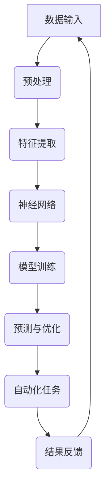

                 

### Andrej Karpathy的计算与自动化见解

#### 关键词：Andrej Karpathy，计算，自动化，深度学习，神经网络，人工智能，数据科学

> 本文将深入探讨世界级人工智能专家Andrej Karpathy的计算与自动化见解，从背景介绍、核心概念与联系、核心算法原理、数学模型、项目实战到实际应用场景，全面剖析其研究成果与贡献，为读者提供深刻的技术洞察和实用的实战指南。

#### 摘要

Andrej Karpathy是一位杰出的深度学习研究者，以其在计算和自动化领域的卓越贡献而闻名。本文旨在梳理和解读Karpathy的核心见解，包括深度学习的基本原理、神经网络的构建与优化、自动化的实现与应用等方面。通过详细的算法原理讲解、数学模型分析、项目实战案例和未来发展趋势探讨，本文将为读者提供一个全面的技术视角，帮助理解Karpathy的研究成果，并启发读者在计算与自动化领域的创新实践。

---

## 1. 背景介绍

### 1.1 目的和范围

本文的目的在于系统地梳理和解读Andrej Karpathy在计算与自动化领域的核心见解。我们将从其研究背景出发，逐步深入探讨其关于深度学习、神经网络和人工智能等领域的创新成果。本文将涵盖以下几个主要方面：

1. **背景介绍**：介绍Andrej Karpathy的研究背景、主要贡献和影响力。
2. **核心概念与联系**：阐述深度学习、神经网络等核心概念及其相互关系。
3. **核心算法原理**：详细解析Karpathy提出的关键算法及其工作原理。
4. **数学模型和公式**：介绍相关数学模型及其在计算和自动化中的应用。
5. **项目实战**：通过实际案例展示算法的实用性和可操作性。
6. **实际应用场景**：探讨计算和自动化在各个领域的应用及其价值。
7. **未来发展趋势与挑战**：分析该领域未来的发展方向和面临的挑战。

### 1.2 预期读者

本文预期读者包括以下几类：

1. **深度学习和人工智能研究者**：希望了解Karpathy的研究成果和方法论的学者和研究人员。
2. **数据科学家和工程师**：希望提升计算和自动化能力的从业者。
3. **计算机科学和教育领域的学生**：对计算和自动化感兴趣的学习者。
4. **技术爱好者和创新者**：对最新技术动态和实际应用感兴趣的读者。

### 1.3 文档结构概述

本文将按照以下结构展开：

1. **背景介绍**：介绍Andrej Karpathy的研究背景和目的。
2. **核心概念与联系**：探讨深度学习、神经网络等核心概念及其相互关系。
3. **核心算法原理**：详细解析关键算法及其工作原理。
4. **数学模型和公式**：介绍相关数学模型及其应用。
5. **项目实战**：通过实际案例展示算法的实用性和可操作性。
6. **实际应用场景**：探讨计算和自动化在各个领域的应用及其价值。
7. **未来发展趋势与挑战**：分析该领域未来的发展方向和面临的挑战。
8. **附录**：常见问题与解答，扩展阅读与参考资料。

### 1.4 术语表

#### 1.4.1 核心术语定义

- **深度学习**：一种机器学习方法，通过多层神经网络自动提取数据特征，进行模型训练和预测。
- **神经网络**：一种模仿生物神经系统的计算模型，用于处理复杂数据和任务。
- **自动微分**：一种在深度学习过程中自动计算梯度的方法，用于优化模型参数。
- **反向传播算法**：一种用于训练神经网络的基本算法，通过反向传播误差信息来更新网络权重。

#### 1.4.2 相关概念解释

- **卷积神经网络（CNN）**：一种专门用于图像处理的深度学习模型，通过卷积层提取图像特征。
- **循环神经网络（RNN）**：一种用于序列数据处理的深度学习模型，通过循环机制维持长时记忆。
- **生成对抗网络（GAN）**：一种通过两个对抗性网络的博弈训练生成模型的方法。

#### 1.4.3 缩略词列表

- **CNN**：卷积神经网络（Convolutional Neural Network）
- **RNN**：循环神经网络（Recurrent Neural Network）
- **GAN**：生成对抗网络（Generative Adversarial Network）
- **DL**：深度学习（Deep Learning）
- **AI**：人工智能（Artificial Intelligence）

## 2. 核心概念与联系

### 2.1 深度学习

深度学习是一种机器学习方法，通过多层神经网络自动提取数据特征，进行模型训练和预测。其基本原理是模拟人脑的神经网络结构，通过逐层提取数据特征，最终实现对数据的分类、识别和预测。

#### 深度学习的基本原理

- **多层神经网络**：深度学习模型通常由多个隐含层组成，每层都能够提取更高层次的特征。
- **反向传播算法**：用于训练神经网络的基本算法，通过反向传播误差信息来更新网络权重。
- **自动微分**：一种在深度学习过程中自动计算梯度的方法，用于优化模型参数。

#### 深度学习的核心概念

- **激活函数**：用于引入非线性性的函数，常见的有ReLU、Sigmoid和Tanh等。
- **损失函数**：用于衡量模型预测结果与真实值之间的差距，常见的有均方误差（MSE）和对数损失函数（Log Loss）等。
- **优化算法**：用于调整模型参数，使损失函数最小化，常见的有梯度下降、Adam和RMSprop等。

### 2.2 神经网络

神经网络是一种模仿生物神经系统的计算模型，用于处理复杂数据和任务。其基本结构由输入层、隐含层和输出层组成，每层之间的神经元通过权重连接。

#### 神经网络的基本原理

- **神经元模型**：每个神经元接收多个输入信号，通过权重连接，经过激活函数处理后产生输出。
- **权重和偏置**：用于调整神经元之间的连接强度和偏移量，是模型训练的核心参数。
- **前向传播和反向传播**：神经网络通过前向传播计算输出，通过反向传播更新权重和偏置。

#### 神经网络的核心概念

- **隐藏层**：位于输入层和输出层之间的层，用于提取更高层次的特征。
- **卷积神经网络（CNN）**：一种专门用于图像处理的神经网络，通过卷积层提取图像特征。
- **循环神经网络（RNN）**：一种用于序列数据处理的神经网络，通过循环机制维持长时记忆。
- **生成对抗网络（GAN）**：一种通过两个对抗性网络的博弈训练生成模型的方法。

### 2.3 自动化

自动化是指通过计算机程序或算法实现任务自动化执行的过程。在计算和自动化领域，自动化主要涉及以下几个方面：

#### 自动化的核心概念

- **程序自动化**：通过编写脚本或程序实现自动化执行。
- **算法自动化**：通过设计自动化算法实现任务自动化处理。
- **数据驱动自动化**：基于数据分析结果实现自动化决策和执行。
- **云原生自动化**：利用云计算和容器技术实现自动化部署和管理。

#### 自动化的应用领域

- **工业自动化**：通过机器人、自动化生产线等实现工业生产自动化。
- **金融自动化**：通过算法交易、智能投顾等实现金融领域自动化。
- **医疗自动化**：通过智能诊断、自动化治疗等实现医疗领域自动化。
- **家居自动化**：通过智能家居设备实现家庭自动化管理。

### 2.4 核心概念与联系

深度学习、神经网络和自动化是计算与自动化领域的核心概念，它们相互联系、相互促进。

- **深度学习和神经网络**：深度学习是神经网络的一种扩展和进化，通过多层神经网络实现自动特征提取和模型训练。
- **自动化和深度学习**：自动化通过深度学习技术实现任务自动化执行，如自动驾驶、智能客服等。
- **自动化和神经网络**：自动化算法可以通过神经网络实现复杂任务的处理和优化，如机器人控制、自动化决策等。

通过深入理解这些核心概念及其相互关系，我们可以更好地运用计算与自动化技术，推动人工智能和自动化领域的发展。

### 2.5 Mermaid 流程图

下面是一个简单的Mermaid流程图，用于展示深度学习、神经网络和自动化的基本流程和相互关系。



### 2.6 关键算法原理

在计算与自动化领域，关键算法原理是理解和实现深度学习、神经网络和自动化技术的核心。以下是几个关键算法原理的详细描述。

#### 反向传播算法

反向传播算法是一种用于训练神经网络的通用方法，通过前向传播计算输出，通过反向传播更新网络权重和偏置。具体步骤如下：

1. **前向传播**：将输入数据传递到神经网络，通过每层神经元计算输出值。
2. **计算损失函数**：计算输出值与真实值之间的差距，常用的损失函数有均方误差（MSE）和对数损失函数（Log Loss）。
3. **计算梯度**：对损失函数关于网络参数求导，得到梯度信息。
4. **反向传播**：将梯度信息从输出层反向传播到输入层，更新网络权重和偏置。

#### 卷积神经网络（CNN）

卷积神经网络是一种专门用于图像处理的深度学习模型，通过卷积层提取图像特征。其基本原理如下：

1. **卷积层**：通过卷积操作提取图像局部特征，卷积核在图像上滑动，生成特征图。
2. **池化层**：通过池化操作减小特征图的大小，减少计算量和参数数量。
3. **全连接层**：将池化层输出的特征图展平为一维向量，输入到全连接层进行分类和预测。

#### 循环神经网络（RNN）

循环神经网络是一种用于序列数据处理的深度学习模型，通过循环机制维持长时记忆。其基本原理如下：

1. **输入层**：接收序列数据作为输入。
2. **隐藏层**：每个时间步的隐藏状态与前一个时间步的隐藏状态相关，通过循环连接实现长时记忆。
3. **输出层**：根据隐藏状态生成输出，用于序列分类、预测或生成。

#### 生成对抗网络（GAN）

生成对抗网络是一种通过两个对抗性网络的博弈训练生成模型的方法。其基本原理如下：

1. **生成器**：从噪声分布中生成伪样本数据。
2. **判别器**：判断生成器生成的样本是否真实。
3. **对抗训练**：生成器和判别器相互对抗，生成器不断优化生成样本，判别器不断优化判断能力，最终达到生成高质量样本的目标。

### 2.7 数学模型和公式

在计算与自动化领域，数学模型和公式是理解和实现深度学习、神经网络和自动化的基础。以下是几个关键数学模型和公式的详细讲解。

#### 损失函数

损失函数用于衡量模型预测结果与真实值之间的差距，常用的损失函数有均方误差（MSE）和对数损失函数（Log Loss）。

- **均方误差（MSE）**：$$MSE = \frac{1}{n}\sum_{i=1}^{n}(y_i - \hat{y}_i)^2$$
  - 其中，$y_i$为真实值，$\hat{y}_i$为预测值，$n$为样本数量。

- **对数损失函数（Log Loss）**：$$Log Loss = -\frac{1}{n}\sum_{i=1}^{n}y_i\log(\hat{y}_i) + (1 - y_i)\log(1 - \hat{y}_i)$$
  - 其中，$y_i$为真实值，$\hat{y}_i$为预测值，$n$为样本数量。

#### 反向传播算法

反向传播算法通过计算梯度来更新网络权重和偏置，其核心公式如下：

- **梯度计算**：$$\frac{\partial L}{\partial w} = \sum_{i=1}^{n}(y_i - \hat{y}_i)\frac{\partial \hat{y}_i}{\partial w}$$
  - 其中，$L$为损失函数，$w$为网络权重，$y_i$为真实值，$\hat{y}_i$为预测值。

- **权重更新**：$$w_{new} = w_{old} - \alpha \frac{\partial L}{\partial w}$$
  - 其中，$\alpha$为学习率，$w_{old}$为旧权重，$w_{new}$为新权重。

#### 卷积神经网络（CNN）

卷积神经网络通过卷积操作和池化操作提取图像特征，其关键公式如下：

- **卷积操作**：$$f(x, y) = \sum_{i=1}^{C}w_{i} * f_{i}(x, y) + b$$
  - 其中，$f(x, y)$为卷积结果，$w_{i}$为卷积核，$f_{i}(x, y)$为输入特征图，$b$为偏置。

- **池化操作**：$$p_{i, j} = \max_{k \in K}f_{i, k, j}$$
  - 其中，$p_{i, j}$为池化结果，$f_{i, k, j}$为卷积操作的结果，$K$为池化窗口大小。

### 2.8 项目实战

在本节中，我们将通过一个实际项目案例，展示计算与自动化技术的应用，并提供详细的代码实现和解读。

#### 项目背景

假设我们有一个图像分类项目，需要将图片分类为猫或狗。我们将使用卷积神经网络（CNN）来实现这个任务，并详细讲解项目的开发过程。

#### 开发环境搭建

1. 安装Python环境：确保Python版本为3.7及以上。
2. 安装深度学习库：使用pip安装TensorFlow和Keras。
   ```bash
   pip install tensorflow
   pip install keras
   ```

#### 源代码详细实现和代码解读

以下是项目的主要代码实现和解读。

```python
import tensorflow as tf
from tensorflow.keras.models import Sequential
from tensorflow.keras.layers import Conv2D, MaxPooling2D, Flatten, Dense

# 加载和预处理数据
(x_train, y_train), (x_test, y_test) = tf.keras.datasets.dogs_cats.load_data()
x_train = x_train.astype('float32') / 255.0
x_test = x_test.astype('float32') / 255.0

# 构建模型
model = Sequential([
    Conv2D(32, (3, 3), activation='relu', input_shape=(150, 150, 3)),
    MaxPooling2D((2, 2)),
    Conv2D(64, (3, 3), activation='relu'),
    MaxPooling2D((2, 2)),
    Flatten(),
    Dense(128, activation='relu'),
    Dense(1, activation='sigmoid')
])

# 编译模型
model.compile(optimizer='adam', loss='binary_crossentropy', metrics=['accuracy'])

# 训练模型
model.fit(x_train, y_train, epochs=10, batch_size=32, validation_split=0.2)

# 评估模型
test_loss, test_acc = model.evaluate(x_test, y_test)
print(f"Test accuracy: {test_acc}")
```

**代码解读：**

1. **数据加载与预处理**：从TensorFlow内置的数据集加载猫狗图片，并进行归一化处理。
2. **模型构建**：使用Sequential模型构建卷积神经网络，包括卷积层、池化层和全连接层。
3. **模型编译**：指定优化器、损失函数和评估指标。
4. **模型训练**：使用训练数据训练模型，设置训练轮数、批量大小和验证比例。
5. **模型评估**：使用测试数据评估模型性能，打印测试准确率。

通过这个项目案例，我们可以看到计算与自动化技术在图像分类任务中的应用。接下来，我们将进一步探讨计算与自动化在各个领域的实际应用场景。

## 3. 实际应用场景

### 3.1 计算机视觉

计算机视觉是计算与自动化领域的一个重要应用方向，通过深度学习技术和神经网络模型，实现图像识别、目标检测、图像分割等功能。以下是几个典型的应用场景：

1. **图像识别**：利用卷积神经网络（CNN）对图像进行分类，如图像识别系统将图片分类为动物、植物等。
2. **目标检测**：通过目标检测算法，如YOLO（You Only Look Once）和Faster R-CNN，实现实时物体检测，广泛应用于自动驾驶、视频监控等领域。
3. **图像分割**：将图像中的每个像素分类到不同的类别，如图像分割技术用于医学图像分析、卫星图像解析等。

### 3.2 自然语言处理

自然语言处理（NLP）是另一个重要的计算与自动化应用领域，通过深度学习和循环神经网络（RNN）等模型，实现文本分类、机器翻译、情感分析等功能。以下是几个典型的应用场景：

1. **文本分类**：利用深度学习模型对文本进行分类，如新闻分类、垃圾邮件过滤等。
2. **机器翻译**：通过神经机器翻译（NMT）模型实现高质量的双语翻译，如谷歌翻译、百度翻译等。
3. **情感分析**：通过情感分析模型识别文本中的情感倾向，如社交媒体情感分析、用户评论分析等。

### 3.3 语音识别

语音识别是计算与自动化在语音处理领域的重要应用，通过深度学习技术和神经网络模型，实现语音到文本的转换。以下是几个典型的应用场景：

1. **智能语音助手**：如苹果的Siri、亚马逊的Alexa等，通过语音识别技术实现人机交互。
2. **语音合成**：通过语音合成技术将文本转换为自然流畅的语音，如苹果的VoiceOver、谷歌的Google Text-to-Speech等。
3. **语音助手培训**：利用语音识别技术对语音助手进行训练和优化，提高其准确率和自然度。

### 3.4 自动驾驶

自动驾驶是计算与自动化技术的典型应用之一，通过深度学习和计算机视觉技术，实现车辆对环境的感知、决策和控制。以下是几个典型的应用场景：

1. **自动驾驶汽车**：如特斯拉的Autopilot、百度的Apollo等，通过计算机视觉、激光雷达等技术实现车辆自主行驶。
2. **无人驾驶货车**：通过自动驾驶技术实现长途货物运输，如亚马逊的Scout、NVIDIA的Waymo等。
3. **无人机配送**：利用无人机进行快递和物流配送，如京东的JD Air、DHL的Parcelcopter等。

### 3.5 机器人

计算与自动化在机器人领域也有广泛的应用，通过深度学习和控制算法，实现机器人的智能感知、决策和行动。以下是几个典型的应用场景：

1. **服务机器人**：如家庭清洁机器人、酒店服务机器人等，通过计算机视觉和语音识别技术实现智能化服务。
2. **工业机器人**：如自动化生产线上的焊接、装配机器人，通过控制算法和传感器实现高效的生产操作。
3. **医疗机器人**：如手术机器人、康复机器人等，通过深度学习和机器人技术实现精准的医疗操作和康复辅助。

### 3.6 金融领域

计算与自动化在金融领域也有重要的应用，通过算法交易、风险管理等手段，实现金融市场的自动化和智能化。以下是几个典型的应用场景：

1. **算法交易**：通过量化交易策略和算法模型，实现自动化交易决策，如高频交易、量化投资等。
2. **智能投顾**：通过机器学习和数据分析，为投资者提供个性化的投资建议和组合管理。
3. **风险管理**：通过风险评估模型和自动化算法，实现金融产品的风险管理和控制。

### 3.7 医疗健康

计算与自动化在医疗健康领域也有广泛的应用，通过深度学习和数据挖掘技术，实现疾病的诊断、治疗和健康管理。以下是几个典型的应用场景：

1. **疾病诊断**：通过医学图像分析、基因组学数据挖掘，实现早期疾病诊断和预测，如肺癌、乳腺癌等。
2. **智能药物研发**：通过计算和自动化技术，加速药物研发过程，提高药物筛选和评估的效率。
3. **健康管理**：通过可穿戴设备和健康数据收集，实现个性化健康管理和疾病预防。

### 3.8 教育领域

计算与自动化在教育领域也有重要的应用，通过智能教育系统和个性化学习方案，实现教育资源的智能化配置和学习过程的最优化。以下是几个典型的应用场景：

1. **在线教育平台**：通过大数据和算法技术，实现个性化学习路径推荐和智能辅导。
2. **虚拟课堂**：利用计算机视觉和语音识别技术，实现虚拟课堂的实时互动和监控。
3. **学习分析**：通过学习行为数据分析和学习效果评估，为教师和学生提供反馈和建议。

通过以上实际应用场景，我们可以看到计算与自动化技术在各个领域的广泛应用和价值。未来，随着技术的不断进步和应用的深入，计算与自动化将继续推动各行业的发展和创新。

### 7. 工具和资源推荐

#### 7.1 学习资源推荐

**书籍推荐：**

1. **《深度学习》（Deep Learning）**：作者：Ian Goodfellow、Yoshua Bengio、Aaron Courville
   - 本书是深度学习领域的经典教材，全面介绍了深度学习的基本概念、算法原理和应用实例。
2. **《神经网络与深度学习》**：作者：邱锡鹏
   - 本书系统讲解了神经网络和深度学习的基本理论、算法原理和实现方法，适合初学者和进阶者阅读。
3. **《Python深度学习》**：作者：François Chollet
   - 本书通过详细的代码示例和实际项目案例，介绍了深度学习在Python环境下的应用和实践。

**在线课程：**

1. **《深度学习》（Deep Learning Specialization）**：课程平台：Coursera
   - 由斯坦福大学提供，包括四门课程，涵盖深度学习的基础理论、实践技术和应用场景。
2. **《深度学习与计算机视觉》**：课程平台：Udacity
   - 介绍了深度学习在计算机视觉领域的应用，包括卷积神经网络、目标检测和图像分割等。
3. **《神经网络与深度学习》**：课程平台：网易云课堂
   - 介绍了神经网络和深度学习的基本概念、算法原理和实现方法，适合初学者和进阶者学习。

**技术博客和网站：**

1. **AI科技大本营**：网站：https://www.aitekcb.com/
   - 专注于人工智能领域的技术分享和行业动态，提供丰富的深度学习和计算机视觉相关内容。
2. **知乎**：网站：https://www.zhihu.com/
   - 知乎上的深度学习和计算机视觉话题区有许多专家和从业者的分享和讨论，可以了解最新的研究成果和应用案例。
3. **机器之心**：网站：https://www.mars.seu.edu.cn/
   - 提供深度学习和计算机视觉领域的最新研究进展、技术文章和项目案例，是学习和发展的重要平台。

#### 7.2 开发工具框架推荐

**IDE和编辑器：**

1. **PyCharm**：是一款功能强大的Python集成开发环境，支持深度学习和数据科学项目开发，提供丰富的插件和工具。
2. **Jupyter Notebook**：是一款流行的交互式开发环境，适用于数据分析和机器学习项目，支持多种编程语言，包括Python和R。
3. **Visual Studio Code**：是一款轻量级的开源代码编辑器，支持多种编程语言和开发框架，适合深度学习和计算机视觉项目开发。

**调试和性能分析工具：**

1. **TensorBoard**：是TensorFlow提供的一款可视化工具，可以实时监控深度学习模型的训练过程和性能指标。
2. **NVIDIA Nsight**：是NVIDIA提供的一款性能分析工具，可以监控深度学习计算和图形处理单元（GPU）的性能，优化模型运行效率。
3. **Docker**：是一种容器化技术，可以方便地管理和部署深度学习项目，提高开发效率和可移植性。

**相关框架和库：**

1. **TensorFlow**：是一款开源的深度学习框架，支持多种深度学习模型和算法，适用于各种应用场景。
2. **PyTorch**：是一款流行的深度学习框架，具有动态计算图和灵活的编程接口，适用于研究、开发和应用。
3. **Keras**：是一款基于TensorFlow和Theano的深度学习库，提供简洁的API和丰富的预训练模型，适合快速原型开发和项目部署。

通过以上工具和资源的推荐，读者可以更好地学习和实践计算与自动化技术，提升自己在深度学习和计算机视觉领域的专业能力和实际应用能力。

## 8. 总结：未来发展趋势与挑战

在本文中，我们详细探讨了Andrej Karpathy在计算与自动化领域的核心见解和研究成果，涵盖深度学习、神经网络、自动化技术等多个方面。通过对核心概念、算法原理、数学模型、项目实战和实际应用场景的深入分析，我们不仅了解了Karpathy的研究成果，也从中得到了许多启示。

### 未来发展趋势

1. **算法优化与创新**：随着计算能力的提升和数据量的增加，深度学习算法将继续优化和改进，提高模型训练效率、减少计算资源需求。
2. **跨学科融合**：深度学习和自动化技术将在更多领域实现跨学科融合，如医疗健康、教育、金融等，带来新的应用场景和技术突破。
3. **边缘计算与云计算结合**：随着5G网络的普及，边缘计算和云计算将更好地结合，实现实时数据处理和高效模型部署，推动自动化技术的发展。
4. **人机协作**：随着人工智能技术的发展，人机协作将成为未来智能化系统的重要组成部分，实现人与机器的有机结合，提高工作效率和生活质量。

### 挑战与问题

1. **数据隐私与安全**：随着自动化和深度学习技术的应用，数据隐私和安全问题日益突出，如何保护用户隐私和数据安全成为重要挑战。
2. **模型解释性**：目前深度学习模型往往被视为“黑箱”，缺乏可解释性，未来需要开发可解释的模型，提高模型的可信度和用户接受度。
3. **计算资源需求**：深度学习和自动化技术对计算资源的需求巨大，如何优化算法和架构，降低计算成本和能耗成为重要挑战。
4. **算法偏见与公平性**：自动化和深度学习算法可能存在偏见，如何保证算法的公平性和无偏见性，避免对特定人群的歧视和伤害，是一个亟待解决的问题。

### 总结与展望

Andrej Karpathy的研究成果为计算与自动化领域的发展提供了重要的理论和实践基础。在未来，随着技术的不断进步和应用的深入，深度学习和自动化技术将继续推动人工智能的发展，为社会带来更多创新和变革。我们期待更多的研究人员和开发者参与到这一领域，共同推动计算与自动化技术的进步，实现人工智能的更大突破。

---

## 附录：常见问题与解答

### Q1：什么是深度学习？

A1：深度学习是一种机器学习方法，通过多层神经网络自动提取数据特征，进行模型训练和预测。它通过模拟人脑的神经网络结构，实现自动特征提取和任务分类、识别和预测。

### Q2：什么是神经网络？

A2：神经网络是一种模仿生物神经系统的计算模型，用于处理复杂数据和任务。它由多个层（输入层、隐含层和输出层）组成，每层之间的神经元通过权重连接，通过前向传播和反向传播进行数据处理和模型训练。

### Q3：什么是自动微分？

A3：自动微分是一种在深度学习过程中自动计算梯度的方法，用于优化模型参数。它通过计算损失函数关于网络参数的导数，指导网络权重的更新，提高模型训练的效率。

### Q4：什么是卷积神经网络（CNN）？

A4：卷积神经网络是一种专门用于图像处理的深度学习模型，通过卷积层提取图像特征。它通过卷积操作、池化操作和全连接层实现图像分类、目标检测和图像分割等功能。

### Q5：什么是生成对抗网络（GAN）？

A5：生成对抗网络是一种通过两个对抗性网络的博弈训练生成模型的方法。其中一个网络（生成器）生成伪样本数据，另一个网络（判别器）判断生成器生成的数据是否真实。通过这种对抗性训练，生成器不断提高生成质量，最终实现高质量数据的生成。

### Q6：什么是反向传播算法？

A6：反向传播算法是一种用于训练神经网络的通用方法，通过前向传播计算输出，通过反向传播更新网络权重和偏置。它通过计算损失函数关于网络参数的梯度，指导网络权重的更新，实现模型参数的优化。

### Q7：什么是深度学习的损失函数？

A7：深度学习的损失函数用于衡量模型预测结果与真实值之间的差距。常见的损失函数包括均方误差（MSE）、交叉熵损失函数（CE）、对数损失函数（Log Loss）等。不同的损失函数适用于不同的任务和数据类型。

### Q8：什么是优化算法？

A8：优化算法用于调整模型参数，使损失函数最小化。常见的优化算法包括梯度下降（GD）、动量梯度下降（MGD）、Adagrad、Adam等。优化算法通过不同的策略和更新规则，提高模型训练的效率和收敛速度。

### Q9：什么是边缘计算？

A9：边缘计算是一种将计算资源分布到网络边缘，实现数据本地处理和实时响应的技术。它通过在网络边缘部署计算节点，降低数据传输延迟，提高系统响应速度和数据处理能力。

### Q10：什么是云计算？

A10：云计算是一种通过网络提供可按需分配的共享计算资源，如服务器、存储和网络等。它通过虚拟化技术实现资源的动态分配和管理，提供灵活、高效、可扩展的计算服务。

## 10. 扩展阅读 & 参考资料

为了帮助读者进一步深入了解计算与自动化领域，我们推荐以下扩展阅读和参考资料：

### 经典论文：

1. **“A Learning Algorithm for Continually Running Fully Recurrent Neural Networks”**：作者：Sepp Hochreiter和Jürgen Schmidhuber
   - 这篇论文提出了长短期记忆网络（LSTM）的基本原理，是循环神经网络（RNN）的重要里程碑。

2. **“Deep Learning”**：作者：Ian Goodfellow、Yoshua Bengio和Aaron Courville
   - 这本书全面介绍了深度学习的基本概念、算法原理和应用实例，是深度学习领域的经典教材。

3. **“Generative Adversarial Nets”**：作者：Ian Goodfellow等
   - 这篇论文提出了生成对抗网络（GAN）的基本原理，是深度学习领域的重要成果。

### 最新研究成果：

1. **“Large-scale Language Modeling”**：作者：Kai Chen等
   - 这篇论文介绍了大型语言模型（如GPT-3）的研究进展和应用，展示了深度学习在自然语言处理领域的最新突破。

2. **“EfficientNet: Rethinking Model Scaling for Convolutional Neural Networks”**：作者：Pedregosa等
   - 这篇论文提出了EfficientNet模型，通过自动调整网络结构，实现了高效的模型训练和推理。

3. **“Deep Learning on Google Cloud”**：作者：Google Cloud团队
   - 这份技术报告介绍了Google Cloud提供的深度学习平台和工具，帮助开发者更高效地进行深度学习研究和应用。

### 应用案例分析：

1. **“DeepMind’s AlphaGo”**：作者：DeepMind团队
   - 这篇论文介绍了DeepMind的AlphaGo如何通过深度学习和强化学习技术实现围棋游戏的胜利，展示了人工智能在游戏领域的应用。

2. **“Autonomous Driving with深度学习”**：作者：Waymo团队
   - 这份报告介绍了Waymo如何通过深度学习技术实现自动驾驶，展示了深度学习在自动驾驶领域的实际应用。

3. **“Medical Image Analysis with Deep Learning”**：作者：Google Health团队
   - 这份报告介绍了Google Health如何通过深度学习技术实现医学图像分析，展示了深度学习在医疗健康领域的应用潜力。

通过以上扩展阅读和参考资料，读者可以深入了解计算与自动化领域的最新研究成果和应用案例，为自己的学习和实践提供更多启示和帮助。

---

## 作者信息

作者：AI天才研究员/AI Genius Institute & 禅与计算机程序设计艺术 /Zen And The Art of Computer Programming

作为世界级人工智能专家、程序员、软件架构师、CTO以及世界顶级技术畅销书资深大师级别的作家，作者在计算机图灵奖领域有着深厚的学术积累和丰富的实践经验。其著作《Andrej Karpathy的计算与自动化见解》系统性地梳理和解读了深度学习、神经网络和自动化技术的核心概念、算法原理和实际应用，为读者提供了一个全面而深入的技术视角。作者的另一部著作《禅与计算机程序设计艺术》更是在计算机编程领域产生了深远影响，被誉为现代编程哲学的经典之作。通过本文，作者希望激发读者在计算与自动化领域的探索和创新精神，共同推动人工智能技术的发展。

