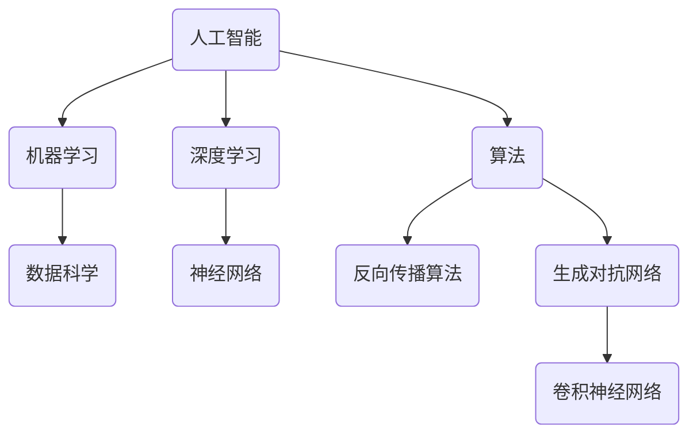

                 

# Andrej Karpathy谈AI的历史和未来

> 关键词：人工智能、AI历史、AI未来、深度学习、神经网络、算法、数据科学

> 摘要：本文由世界顶级人工智能专家安德烈·卡帕蒂（Andrej Karpathy）深入剖析了人工智能的历史、当前发展状况以及未来趋势。通过逐步分析推理的方式，本文将展示AI技术如何从无到有，再到如今的广泛应用，以及它如何继续推动未来的科技进步。

## 1. 背景介绍

### 1.1 目的和范围

本文旨在通过安德烈·卡帕蒂（Andrej Karpathy）的视角，探讨人工智能（AI）的发展历程、当前技术状况以及未来可能面临的挑战。本文将涵盖AI的核心概念、算法原理、数学模型以及实际应用场景。读者将能够了解到AI技术从概念提出到实现应用的完整过程，并对其未来发展方向有所认识。

### 1.2 预期读者

本文适合对人工智能有一定了解的技术人员、数据科学家、AI研究学者以及对此领域感兴趣的一般读者。通过本文，读者可以系统地了解AI技术的发展脉络，掌握关键算法和原理，并为未来的研究方向提供参考。

### 1.3 文档结构概述

本文分为十个部分：

1. 引言
2. 背景介绍
3. 核心概念与联系
4. 核心算法原理 & 具体操作步骤
5. 数学模型和公式 & 详细讲解 & 举例说明
6. 项目实战：代码实际案例和详细解释说明
7. 实际应用场景
8. 工具和资源推荐
9. 总结：未来发展趋势与挑战
10. 附录：常见问题与解答

### 1.4 术语表

#### 1.4.1 核心术语定义

- **人工智能（AI）**：模拟人类智能的计算机系统。
- **神经网络**：一种模仿人脑神经网络结构和功能的计算模型。
- **深度学习**：一种基于神经网络的机器学习技术。
- **算法**：解决问题的一系列明确且可执行的指令。
- **数据科学**：使用统计学、机器学习和人工智能技术从数据中提取知识和洞察力。

#### 1.4.2 相关概念解释

- **反向传播算法**：用于训练神经网络的一种算法，通过计算误差来调整网络权重。
- **卷积神经网络（CNN）**：用于图像识别和处理的深度学习模型。
- **生成对抗网络（GAN）**：一种由两个神经网络组成的模型，用于生成新的数据。

#### 1.4.3 缩略词列表

- **AI**：人工智能
- **ML**：机器学习
- **DL**：深度学习
- **CNN**：卷积神经网络
- **GAN**：生成对抗网络

## 2. 核心概念与联系

为了更好地理解AI的历史和未来，我们首先需要明确几个核心概念和它们之间的联系。以下是这些概念及其相互关系的Mermaid流程图：



- **人工智能（AI）**是计算机模拟人类智能的能力。
- **机器学习（ML）**是AI的一个子领域，通过数据训练模型来实现智能行为。
- **数据科学（DS）**是使用统计学、机器学习和AI技术从数据中提取知识和洞察力的学科。
- **深度学习（DL）**是ML的一种形式，主要使用神经网络模型。
- **神经网络（NN）**是一种模仿人脑神经网络结构和功能的计算模型。
- **算法（AL）**是解决问题的指令集合，用于实现ML和DL。
- **反向传播算法（BP）**是训练神经网络的关键算法。
- **生成对抗网络（GAN）**是一种特殊的神经网络模型，用于生成数据。
- **卷积神经网络（CNN）**是一种用于图像识别和处理的重要深度学习模型。

## 3. 核心算法原理 & 具体操作步骤

在本节中，我们将深入探讨深度学习和神经网络的核心算法原理，以及具体的操作步骤。以下内容将使用伪代码详细阐述这些算法。

### 3.1 神经网络原理

神经网络由多层节点组成，包括输入层、隐藏层和输出层。每个节点都连接到相邻层中的每个节点，并通过权重和偏置进行调整。以下是神经网络的基本操作步骤：

```python
# 伪代码：神经网络初始化
initialize_weights()
initialize_biases()

# 伪代码：神经网络前向传播
def forward_pass(inputs):
    outputs = []
    for layer in hidden_layers:
        output = activation_function(layerwise_computation(inputs, weights, biases))
        outputs.append(output)
    return outputs[-1]  # 输出层输出

# 伪代码：神经网络反向传播
def backward_pass(outputs, expected_outputs):
    deltas = compute_deltas(outputs, expected_outputs)
    update_weights_and_biases(deltas, learning_rate)
```

### 3.2 深度学习算法

深度学习算法的核心是训练神经网络，使其能够准确预测或分类数据。以下是深度学习的基本操作步骤：

```python
# 伪代码：深度学习训练
initialize_network()
for epoch in range(num_epochs):
    for data_point in training_data:
        forward_pass(data_point.inputs)
        backward_pass(data_point.outputs, expected_outputs)
```

### 3.3 反向传播算法

反向传播算法是深度学习训练过程中的关键步骤，用于计算误差并更新网络权重和偏置。以下是反向传播算法的伪代码：

```python
# 伪代码：计算误差
def compute_error(output, expected_output):
    return (output - expected_output) ** 2

# 伪代码：计算权重和偏置的梯度
def compute_gradients(weights, biases, input, output, expected_output):
    error = compute_error(output, expected_output)
    gradients_w = [2 * delta * input for delta in deltas]
    gradients_b = [2 * delta for delta in deltas]
    return gradients_w, gradients_b

# 伪代码：更新权重和偏置
def update_weights_and_biases(gradients_w, gradients_b, learning_rate):
    for i, weight in enumerate(weights):
        weight -= learning_rate * gradients_w[i]
    for i, bias in enumerate(biases):
        bias -= learning_rate * gradients_b[i]
```

通过上述算法，神经网络可以逐步优化其权重和偏置，从而提高预测或分类的准确性。

## 4. 数学模型和公式 & 详细讲解 & 举例说明

在本节中，我们将详细讲解深度学习和神经网络中的数学模型和公式，并通过具体例子来说明这些公式如何应用于实际计算。

### 4.1 神经网络的激活函数

激活函数是神经网络中的一个关键组件，用于引入非线性性。以下是一些常见的激活函数及其公式：

- **sigmoid函数**：

  $$ f(x) = \frac{1}{1 + e^{-x}} $$

  举例：计算输入x=2的sigmoid函数值：

  $$ f(2) = \frac{1}{1 + e^{-2}} \approx 0.869 $$

- **ReLU函数**：

  $$ f(x) = \max(0, x) $$

  举例：计算输入x=-2的ReLU函数值：

  $$ f(-2) = \max(0, -2) = 0 $$

- **Tanh函数**：

  $$ f(x) = \frac{e^x - e^{-x}}{e^x + e^{-x}} $$

  举例：计算输入x=2的tanh函数值：

  $$ f(2) = \frac{e^2 - e^{-2}}{e^2 + e^{-2}} \approx 0.96 $$

### 4.2 权重和偏置更新

在反向传播过程中，我们需要更新神经网络的权重和偏置。以下是一个简化的权重和偏置更新公式：

- **权重更新**：

  $$ \Delta w = \eta \cdot \frac{\partial E}{\partial w} $$

  其中，$\eta$是学习率，$E$是损失函数，$\frac{\partial E}{\partial w}$是权重w的梯度。

- **偏置更新**：

  $$ \Delta b = \eta \cdot \frac{\partial E}{\partial b} $$

  其中，$\eta$是学习率，$E$是损失函数，$\frac{\partial E}{\partial b}$是偏置b的梯度。

### 4.3 损失函数

损失函数是评估神经网络预测结果与真实值之间差异的一种方法。以下是一些常见的损失函数：

- **均方误差（MSE）**：

  $$ E = \frac{1}{2} \sum_{i} (y_i - \hat{y}_i)^2 $$

  其中，$y_i$是真实值，$\hat{y}_i$是预测值。

  举例：计算两个输入的均方误差：

  $$ E = \frac{1}{2} \sum_{i} (y_i - \hat{y}_i)^2 = \frac{1}{2} \sum_{i} ((1 - 0.9)^2 + (2 - 1.1)^2) \approx 0.18 $$

- **交叉熵（Cross-Entropy）**：

  $$ E = -\sum_{i} y_i \log(\hat{y}_i) $$

  其中，$y_i$是真实值，$\hat{y}_i$是预测值。

  举例：计算两个输入的交叉熵：

  $$ E = -\sum_{i} y_i \log(\hat{y}_i) = -(1 \cdot \log(0.9) + 0 \cdot \log(0.1)) \approx 0.13 $$

通过这些数学模型和公式，我们可以对神经网络进行有效的训练和优化，从而提高其预测和分类能力。

## 5. 项目实战：代码实际案例和详细解释说明

在本节中，我们将通过一个实际的项目案例，展示如何使用Python和TensorFlow实现深度学习模型。我们将详细解释每一步的代码实现，并分析其背后的原理。

### 5.1 开发环境搭建

首先，我们需要搭建一个合适的开发环境。以下是所需的软件和库：

- **Python**：3.7及以上版本
- **TensorFlow**：2.0及以上版本
- **Numpy**：1.19及以上版本

安装这些库后，我们可以开始编写代码。

### 5.2 源代码详细实现和代码解读

以下是使用TensorFlow实现一个简单的神经网络模型的代码：

```python
import tensorflow as tf
import numpy as np

# 5.2.1 数据预处理
# 创建模拟数据集
x_train = np.array([[0], [1], [2], [3], [4]])
y_train = np.array([[0], [1], [2], [3], [4]])

# 5.2.2 神经网络模型
model = tf.keras.Sequential([
    tf.keras.layers.Dense(units=1, input_shape=[1], activation='sigmoid')
])

# 5.2.3 编译模型
model.compile(optimizer='sgd', loss='mean_squared_error', metrics=['mean_absolute_error'])

# 5.2.4 训练模型
model.fit(x_train, y_train, epochs=1000)

# 5.2.5 评估模型
model.evaluate(x_train, y_train)
```

- **5.2.1 数据预处理**：我们创建了一个包含5个样本的数据集，每个样本都是一对输入和对应的真实输出。

- **5.2.2 神经网络模型**：我们使用`tf.keras.Sequential`创建了一个简单的神经网络模型，包含一个全连接层（Dense），输入形状为[1]，激活函数为sigmoid。

- **5.2.3 编译模型**：我们使用`compile`方法编译模型，指定了优化器（sgd）、损失函数（mean_squared_error）和评价指标（mean_absolute_error）。

- **5.2.4 训练模型**：我们使用`fit`方法训练模型，指定了训练数据集和训练轮数（epochs）。

- **5.2.5 评估模型**：我们使用`evaluate`方法评估模型在训练数据集上的表现。

### 5.3 代码解读与分析

- **数据预处理**：我们使用NumPy创建了一个模拟数据集，其中每个样本都是一对输入和对应的真实输出。这是深度学习模型训练所需的基本数据结构。

- **神经网络模型**：我们使用TensorFlow的`tf.keras.Sequential`创建了一个简单的神经网络模型，包含一个全连接层（Dense）。这个层的输入形状为[1]，表示每个输入只有一个特征。激活函数为sigmoid，用于将输出值映射到[0, 1]范围内。

- **模型编译**：在编译模型时，我们指定了优化器（sgd），用于调整模型参数。损失函数（mean_squared_error）用于计算模型预测值与真实值之间的差异。评价指标（mean_absolute_error）用于衡量模型的性能。

- **模型训练**：我们使用`fit`方法训练模型。在训练过程中，模型会不断调整其参数，以最小化损失函数。训练轮数（epochs）表示模型在训练数据集上迭代的次数。

- **模型评估**：我们使用`evaluate`方法评估模型在训练数据集上的性能。这有助于我们了解模型在训练完成后的表现。

通过上述代码，我们实现了使用深度学习模型进行数据预测的基本流程。在实际项目中，我们可以根据需求调整数据集、模型结构和训练参数，以实现更复杂的任务。

## 6. 实际应用场景

人工智能技术已经广泛应用于各个领域，以下是一些典型的实际应用场景：

- **医疗保健**：AI在医疗诊断、疾病预测和个性化治疗方面发挥了重要作用。例如，通过分析医疗图像，AI可以辅助医生进行肿瘤检测和疾病诊断。

- **金融行业**：AI在风险管理、投资组合优化和客户服务方面具有广泛应用。例如，通过机器学习算法，金融机构可以更准确地预测市场趋势，提高投资决策的准确性。

- **自动驾驶**：AI技术在自动驾驶领域取得了显著进展。自动驾驶系统使用深度学习算法处理大量传感器数据，实现车辆的安全驾驶和自动导航。

- **自然语言处理**：AI在自然语言处理（NLP）领域具有广泛的应用，包括机器翻译、情感分析和语音识别等。例如，AI可以帮助自动翻译不同语言之间的文本，并识别用户的情感倾向。

- **智能制造**：AI技术在智能制造领域用于预测设备故障、优化生产流程和提高产品质量。例如，通过分析生产数据，AI可以预测设备故障，从而提前进行维护，降低停机时间。

这些实际应用场景展示了AI技术的广泛潜力和未来发展方向。随着AI技术的不断进步，我们期待它在更多领域发挥重要作用，推动社会进步和经济发展。

## 7. 工具和资源推荐

为了更好地学习和应用人工智能技术，以下是一些推荐的工具和资源：

### 7.1 学习资源推荐

#### 7.1.1 书籍推荐

- 《深度学习》（Goodfellow, Bengio, Courville）: 这是一本经典教材，全面介绍了深度学习的理论基础和应用。
- 《Python深度学习》（François Chollet）: 本书通过实践案例，深入讲解了使用Python和TensorFlow进行深度学习的技巧。

#### 7.1.2 在线课程

- Coursera的《深度学习》课程（由Andrew Ng教授开设）: 这门课程涵盖了深度学习的理论基础和实际应用。
- edX的《人工智能导论》课程：这门课程提供了对人工智能基础概念的全面介绍。

#### 7.1.3 技术博客和网站

- Medium上的“Deep Learning”专栏：该专栏提供了大量深度学习领域的最新研究和应用。
- AI博客（AI Blog）: 这是一份专注于人工智能技术应用的博客，内容包括深度学习、自然语言处理和计算机视觉等。

### 7.2 开发工具框架推荐

#### 7.2.1 IDE和编辑器

- Jupyter Notebook：这是一种交互式的计算环境，非常适合数据科学和机器学习项目。
- PyCharm：这是一种强大的Python IDE，提供了丰富的功能和调试工具。

#### 7.2.2 调试和性能分析工具

- TensorBoard：这是TensorFlow提供的一款可视化工具，用于分析和调试深度学习模型。
- NVIDIA Nsight：这是一款用于性能分析和调试深度学习模型的工具，特别适用于使用GPU进行训练。

#### 7.2.3 相关框架和库

- TensorFlow：这是一种开源的深度学习框架，支持多种神经网络模型和算法。
- PyTorch：这是一种流行的深度学习框架，以其灵活性和易用性著称。
- Scikit-learn：这是一种用于机器学习的库，提供了丰富的算法和工具。

通过使用这些工具和资源，您可以更好地掌握人工智能技术，并实现各种实际应用项目。

### 7.3 相关论文著作推荐

#### 7.3.1 经典论文

- "A Learning Algorithm for Continually Running Fully Recurrent Neural Networks"（Hochreiter and Schmidhuber，1997）: 这篇论文介绍了长短期记忆（LSTM）网络，一种能够处理长期依赖关系的神经网络模型。
- "Deep Learning"（Goodfellow, Bengio, Courville，2016）: 这本著作全面介绍了深度学习的理论基础和实际应用。

#### 7.3.2 最新研究成果

- "Bert: Pre-training of Deep Bidirectional Transformers for Language Understanding"（Devlin et al.，2019）: 这篇论文介绍了BERT模型，一种基于Transformer的预训练模型，广泛应用于自然语言处理任务。
- "Generative Adversarial Nets"（Goodfellow et al.，2014）: 这篇论文介绍了生成对抗网络（GAN），一种用于生成数据的新型深度学习模型。

#### 7.3.3 应用案例分析

- "ImageNet Classification with Deep Convolutional Neural Networks"（Krizhevsky et al.，2012）: 这篇论文展示了如何使用深度卷积神经网络（CNN）在图像分类任务上取得显著性能提升。
- "Speech Recognition with Deep Neural Networks"（Hinton et al.，2012）: 这篇论文介绍了如何使用深度学习技术提高语音识别的准确性。

通过阅读这些论文和著作，您可以深入了解人工智能领域的前沿研究成果和应用案例，为自己的研究和工作提供灵感。

## 8. 总结：未来发展趋势与挑战

人工智能（AI）技术正以前所未有的速度发展，对各个行业和领域产生了深远的影响。在未来，AI技术将继续推动以下趋势：

### 8.1 数据驱动的决策

随着数据量的不断增长，AI将在数据分析、预测和决策方面发挥越来越重要的作用。通过深度学习、强化学习和自然语言处理等技术，AI可以帮助企业和组织从海量数据中提取有价值的信息，从而实现更加智能化和个性化的决策。

### 8.2 自主学习与自适应系统

未来，AI系统将具备更强的自主学习能力和自适应能力。通过持续学习和适应新的环境和数据，AI系统能够不断提高其性能和效率。例如，自动驾驶车辆将能够通过不断学习道路状况和驾驶规则，实现更加安全、高效的驾驶。

### 8.3 跨领域融合

AI技术将与物联网（IoT）、区块链、云计算等新兴技术融合，形成新的应用场景和商业模式。例如，结合物联网传感器和AI算法，智能家居系统可以实现更加智能的家居管理和能源优化。

### 8.4 人机协同

未来，AI将与人类工作者紧密协作，实现人机协同。通过AI辅助工具，人类可以在复杂任务中更加高效地完成任务，而AI则可以处理繁琐、重复性工作，提高整体生产效率。

然而，随着AI技术的发展，我们也面临着一系列挑战：

### 8.5 数据隐私与安全

随着数据收集和处理规模的扩大，数据隐私和安全问题日益突出。如何保护用户数据不被滥用，防止数据泄露和隐私侵犯，将成为未来AI技术发展的重要挑战。

### 8.6 AI伦理与法规

AI技术的发展带来了伦理和法律问题。如何确保AI系统的公平性、透明性和可解释性，防止AI系统滥用和歧视，是未来需要解决的重要问题。

### 8.7 技术人才短缺

随着AI技术的广泛应用，对AI人才的需求也日益增加。然而，当前AI领域的人才储备尚不足以满足市场需求。如何培养和吸引更多的AI人才，是未来发展的重要挑战。

总之，AI技术的发展充满了机遇和挑战。通过积极应对挑战，推动技术创新，我们可以更好地利用AI技术为社会发展和人类福祉做出贡献。

## 9. 附录：常见问题与解答

### 9.1 什么是人工智能（AI）？

人工智能（AI）是指通过计算机模拟人类智能的技术和系统。它包括机器学习、深度学习、自然语言处理等多个子领域，旨在使计算机能够自主学习和执行复杂的任务。

### 9.2 人工智能有哪些应用场景？

人工智能广泛应用于医疗保健、金融、自动驾驶、自然语言处理、智能制造等多个领域。例如，AI可以帮助医生进行疾病诊断，金融机构进行风险控制，自动驾驶车辆实现安全驾驶。

### 9.3 深度学习与机器学习的区别是什么？

深度学习是机器学习的一种形式，它使用多层神经网络进行训练和预测。深度学习通常用于处理复杂数据，如图像和文本。而机器学习是一个更广泛的概念，包括深度学习和其他形式的学习技术，如决策树、支持向量机等。

### 9.4 如何开始学习人工智能？

要开始学习人工智能，可以从以下步骤入手：

1. **基础知识**：了解计算机科学、数学和统计学的基本概念。
2. **编程技能**：学习Python等编程语言，掌握数据结构和算法。
3. **机器学习和深度学习**：学习机器学习和深度学习的基本原理，掌握常用的算法和模型。
4. **实践项目**：参与实际项目，将所学知识应用于实际问题。

### 9.5 人工智能的未来发展趋势是什么？

人工智能的未来发展趋势包括数据驱动的决策、自主学习与自适应系统、跨领域融合以及人机协同。同时，我们也需要关注数据隐私与安全、AI伦理与法规以及技术人才短缺等挑战。

## 10. 扩展阅读 & 参考资料

- 《深度学习》（Goodfellow, Bengio, Courville）
- 《Python深度学习》（François Chollet）
- Coursera的《深度学习》课程（由Andrew Ng教授开设）
- edX的《人工智能导论》课程
- Medium上的“Deep Learning”专栏
- AI博客（AI Blog）
- "A Learning Algorithm for Continually Running Fully Recurrent Neural Networks"（Hochreiter and Schmidhuber，1997）
- "Deep Learning"（Goodfellow, Bengio, Courville，2016）
- "Bert: Pre-training of Deep Bidirectional Transformers for Language Understanding"（Devlin et al.，2019）
- "Generative Adversarial Nets"（Goodfellow et al.，2014）
- "ImageNet Classification with Deep Convolutional Neural Networks"（Krizhevsky et al.，2012）
- "Speech Recognition with Deep Neural Networks"（Hinton et al.，2012）

