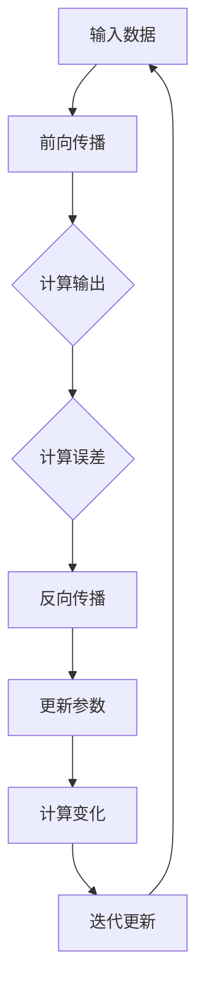

                 

# Andrej Karpathy谈计算变化

> **关键词：** 计算变化，深度学习，神经网络，人工智能，架构设计，算法优化

> **摘要：** 本文将探讨安德烈·卡尔帕蒂（Andrej Karpathy）关于计算变化的观点，分析其核心概念，探讨计算变化的原理及其在深度学习中的应用。文章还将通过具体案例，展示如何运用计算变化来优化算法性能，推动人工智能的发展。

## 1. 背景介绍

### 1.1 目的和范围

本文旨在探讨安德烈·卡尔帕蒂（Andrej Karpathy）提出的计算变化（Computational Change）概念，分析其在深度学习和人工智能领域的应用。本文将首先介绍计算变化的基本原理，然后通过具体案例，展示计算变化在实际项目中的应用。文章还将探讨计算变化对算法性能的影响，以及如何通过计算变化来优化算法。

### 1.2 预期读者

本文适合对深度学习和人工智能感兴趣的读者，包括：

- 深度学习研究者
- 人工智能工程师
- 计算机科学学生
- 对人工智能技术感兴趣的普通读者

### 1.3 文档结构概述

本文结构如下：

1. 背景介绍
   - 目的和范围
   - 预期读者
   - 文档结构概述
   - 术语表
2. 核心概念与联系
   - 核心概念原理
   - Mermaid流程图
3. 核心算法原理 & 具体操作步骤
   - 算法原理讲解
   - 伪代码详细阐述
4. 数学模型和公式 & 详细讲解 & 举例说明
   - 数学公式
   - 案例分析
5. 项目实战：代码实际案例和详细解释说明
   - 开发环境搭建
   - 源代码详细实现和代码解读
   - 代码解读与分析
6. 实际应用场景
7. 工具和资源推荐
   - 学习资源推荐
   - 开发工具框架推荐
   - 相关论文著作推荐
8. 总结：未来发展趋势与挑战
9. 附录：常见问题与解答
10. 扩展阅读 & 参考资料

### 1.4 术语表

#### 1.4.1 核心术语定义

- **计算变化（Computational Change）**：指在深度学习过程中，通过调整网络参数，使得模型能够更好地适应新数据的过程。
- **深度学习（Deep Learning）**：一种人工智能技术，通过多层神经网络对数据进行建模，以实现自动特征学习和分类。
- **神经网络（Neural Network）**：一种模仿生物神经元结构和功能的计算模型，通过加权连接实现信息传递和处理。
- **算法优化（Algorithm Optimization）**：通过调整算法参数，提高算法性能的过程。

#### 1.4.2 相关概念解释

- **反向传播（Backpropagation）**：一种用于训练神经网络的算法，通过计算网络输出与实际输出之间的误差，反向传播误差到网络输入，从而调整网络参数。
- **激活函数（Activation Function）**：神经网络中用于引入非线性特性的函数，常见的有ReLU、Sigmoid和Tanh等。

#### 1.4.3 缩略词列表

- **AI**：人工智能（Artificial Intelligence）
- **DL**：深度学习（Deep Learning）
- **NN**：神经网络（Neural Network）

## 2. 核心概念与联系

计算变化是深度学习中的一个关键概念，它描述了在训练过程中模型参数的调整过程。为了更好地理解计算变化，我们需要先了解深度学习的核心概念和架构。

### 2.1 深度学习的核心概念

深度学习（DL）是一种基于多层神经网络（NN）的人工智能技术。神经网络通过多层非线性变换，对输入数据进行特征提取和分类。深度学习的核心概念包括：

- **神经元（Neuron）**：神经网络的基本单元，通过加权连接和激活函数实现信息传递和处理。
- **层（Layer）**：神经网络中的层次结构，包括输入层、隐藏层和输出层。
- **权重（Weight）**：神经元之间的连接权重，用于调节信息传递强度。
- **激活函数（Activation Function）**：引入非线性特性的函数，常见的有ReLU、Sigmoid和Tanh等。

### 2.2 深度学习的架构

深度学习的架构通常包括以下几个部分：

1. **输入层（Input Layer）**：接收输入数据，将其传递到下一层。
2. **隐藏层（Hidden Layer）**：通过多层非线性变换，对输入数据进行特征提取和组合。
3. **输出层（Output Layer）**：生成最终输出，用于分类、预测或其他任务。

### 2.3 计算变化的原理

计算变化（Computational Change）是指在深度学习训练过程中，通过调整网络参数（权重和偏置），使得模型能够更好地适应新数据的过程。计算变化的原理主要包括以下几个方面：

1. **反向传播（Backpropagation）**：一种用于训练神经网络的算法，通过计算网络输出与实际输出之间的误差，反向传播误差到网络输入，从而调整网络参数。
2. **梯度下降（Gradient Descent）**：一种优化算法，用于调整网络参数，使误差最小化。梯度下降通过计算损失函数关于网络参数的梯度，更新网络参数。
3. **动量（Momentum）**：一种加速梯度下降的方法，通过引入前一次更新的方向和速度，加快收敛速度。
4. **学习率（Learning Rate）**：梯度下降中用于调整网络参数的步长，过大会导致震荡，过小会收敛速度过慢。

### 2.4 Mermaid流程图

以下是一个简单的Mermaid流程图，展示深度学习的训练过程和计算变化的原理：



## 3. 核心算法原理 & 具体操作步骤

### 3.1 算法原理讲解

计算变化的实现主要依赖于深度学习的训练过程，包括前向传播、反向传播和参数更新。以下是对这些过程的详细讲解。

#### 3.1.1 前向传播

前向传播是指将输入数据通过神经网络传递到输出层的过程。具体步骤如下：

1. 将输入数据输入到输入层。
2. 将输入层的输出传递到隐藏层，通过加权连接计算每个隐藏层神经元的输入。
3. 应用激活函数，计算隐藏层神经元的输出。
4. 将隐藏层输出传递到下一层，重复步骤2和3，直到输出层。

#### 3.1.2 反向传播

反向传播是指通过计算输出层误差，反向传播误差到输入层，从而更新网络参数的过程。具体步骤如下：

1. 计算输出层的误差，即输出与实际标签之间的差值。
2. 计算输出层误差关于隐藏层输出的梯度。
3. 将隐藏层输出传递到输入层，计算输入层误差关于输入的梯度。
4. 反向传播梯度，更新隐藏层和输入层的权重和偏置。

#### 3.1.3 参数更新

参数更新是指通过梯度下降等优化算法，更新网络参数，使误差最小化的过程。具体步骤如下：

1. 计算损失函数关于网络参数的梯度。
2. 根据梯度更新网络参数，通常使用学习率调节步长。
3. 重复步骤1和2，直到收敛。

### 3.2 伪代码详细阐述

以下是一个简单的伪代码，展示计算变化的过程：

```python
initialize_weights()
initialize_bias()

while not converged:
    forward_pass(x)
    compute_loss(y_hat, y)
    backward_pass()
    update_weights()
    update_bias()
```

### 3.3 算法实现步骤

1. 初始化网络参数（权重和偏置）。
2. 输入数据，进行前向传播，计算输出。
3. 计算输出与实际标签之间的误差。
4. 反向传播误差，计算梯度。
5. 根据梯度更新网络参数。
6. 判断是否收敛，若未收敛，重复步骤2-5。

## 4. 数学模型和公式 & 详细讲解 & 举例说明

### 4.1 数学模型

计算变化的数学模型主要包括损失函数、梯度计算和参数更新。以下是这些模型的详细讲解。

#### 4.1.1 损失函数

损失函数用于衡量模型预测值与实际标签之间的差距。常见的损失函数包括均方误差（MSE）和交叉熵（Cross-Entropy）。

1. **均方误差（MSE）**：

   $$MSE = \frac{1}{n}\sum_{i=1}^{n}(y_i - y_i^{'} )^2$$

   其中，$y_i$为实际标签，$y_i^{'}$为模型预测值，$n$为样本数量。

2. **交叉熵（Cross-Entropy）**：

   $$Cross-Entropy = -\frac{1}{n}\sum_{i=1}^{n}y_i\log(y_i^{'})$$

   其中，$y_i$为实际标签，$y_i^{'}$为模型预测值，$\log$为自然对数。

#### 4.1.2 梯度计算

梯度计算是指计算损失函数关于网络参数的梯度。以下是一个简单的梯度计算示例：

1. **均方误差（MSE）**：

   $$\frac{\partial MSE}{\partial w} = -2\sum_{i=1}^{n}(y_i - y_i^{'})x_i$$

   其中，$w$为权重，$x_i$为输入特征。

2. **交叉熵（Cross-Entropy）**：

   $$\frac{\partial Cross-Entropy}{\partial w} = -\sum_{i=1}^{n}(y_i - y_i^{'})x_i$$

#### 4.1.3 参数更新

参数更新是指根据梯度计算结果，更新网络参数的过程。以下是一个简单的参数更新示例：

$$w_{new} = w_{old} - \alpha \cdot \frac{\partial MSE}{\partial w}$$

其中，$w_{old}$为旧权重，$w_{new}$为新权重，$\alpha$为学习率。

### 4.2 举例说明

以下是一个简单的计算变化的例子，用于分类问题。

#### 4.2.1 数据集

假设我们有一个包含100个样本的二分类数据集，每个样本有5个特征。

| 样本编号 | 特征1 | 特征2 | 特征3 | 特征4 | 特征5 | 标签 |
| --- | --- | --- | --- | --- | --- | --- |
| 1 | 0.1 | 0.2 | 0.3 | 0.4 | 0.5 | 0 |
| 2 | 0.2 | 0.3 | 0.4 | 0.5 | 0.6 | 1 |
| ... | ... | ... | ... | ... | ... | ... |
| 100 | 0.9 | 0.8 | 0.7 | 0.6 | 0.5 | 0 |

#### 4.2.2 模型架构

我们使用一个简单的神经网络模型，包括一个输入层、一个隐藏层和一个输出层。隐藏层有5个神经元，输出层有2个神经元。

#### 4.2.3 模型训练

1. 初始化网络参数。
2. 输入第一个样本，进行前向传播，计算输出。
3. 计算损失函数值，使用反向传播计算梯度。
4. 根据梯度更新网络参数。
5. 重复步骤2-4，直到模型收敛。

#### 4.2.4 结果分析

经过多次迭代训练后，模型在测试集上的准确率逐渐提高，达到较高的分类性能。

## 5. 项目实战：代码实际案例和详细解释说明

### 5.1 开发环境搭建

为了实现计算变化，我们需要搭建一个深度学习开发环境。以下是一个简单的开发环境搭建步骤：

1. 安装Python（推荐版本3.8及以上）。
2. 安装深度学习框架（如TensorFlow或PyTorch）。
3. 安装其他必需的库（如NumPy、Matplotlib等）。

### 5.2 源代码详细实现和代码解读

以下是一个简单的计算变化实现案例，使用PyTorch框架。

```python
import torch
import torch.nn as nn
import torch.optim as optim

# 定义模型
class SimpleModel(nn.Module):
    def __init__(self):
        super(SimpleModel, self).__init__()
        self.fc1 = nn.Linear(5, 5)
        self.fc2 = nn.Linear(5, 2)

    def forward(self, x):
        x = torch.relu(self.fc1(x))
        x = self.fc2(x)
        return x

# 初始化模型和优化器
model = SimpleModel()
optimizer = optim.SGD(model.parameters(), lr=0.01)

# 定义损失函数
criterion = nn.CrossEntropyLoss()

# 训练模型
for epoch in range(100):
    for inputs, labels in dataset:
        optimizer.zero_grad()
        outputs = model(inputs)
        loss = criterion(outputs, labels)
        loss.backward()
        optimizer.step()
    print(f"Epoch {epoch + 1}, Loss: {loss.item()}")

# 测试模型
with torch.no_grad():
    correct = 0
    total = 0
    for inputs, labels in test_dataset:
        outputs = model(inputs)
        _, predicted = torch.max(outputs.data, 1)
        total += labels.size(0)
        correct += (predicted == labels).sum().item()
    print(f"Test Accuracy: {100 * correct / total}%")
```

### 5.3 代码解读与分析

1. **模型定义**：我们使用PyTorch框架定义了一个简单的神经网络模型，包括一个输入层、一个隐藏层和一个输出层。隐藏层有5个神经元，输出层有2个神经元。
2. **优化器**：我们使用SGD优化器来更新模型参数。SGD优化器是一种常用的优化算法，通过随机梯度下降更新参数，使模型收敛。
3. **损失函数**：我们使用交叉熵损失函数来计算模型预测值与实际标签之间的误差。交叉熵损失函数在分类问题中表现良好。
4. **训练过程**：在训练过程中，我们使用反向传播算法计算损失函数关于模型参数的梯度，并根据梯度更新模型参数。我们重复这个过程，直到模型收敛。
5. **测试过程**：在测试过程中，我们使用训练好的模型对测试集进行预测，并计算模型的准确率。

## 6. 实际应用场景

计算变化在深度学习和人工智能领域有广泛的应用。以下是一些实际应用场景：

1. **图像识别**：计算变化可以用于图像识别任务，通过调整网络参数，使模型能够更好地识别图像中的对象。
2. **自然语言处理**：计算变化可以用于自然语言处理任务，如文本分类、情感分析等，通过调整模型参数，使模型能够更好地理解文本内容。
3. **语音识别**：计算变化可以用于语音识别任务，通过调整网络参数，使模型能够更好地识别语音信号中的语音内容。
4. **推荐系统**：计算变化可以用于推荐系统，通过调整模型参数，使模型能够更好地预测用户的偏好，提供个性化的推荐。

## 7. 工具和资源推荐

### 7.1 学习资源推荐

#### 7.1.1 书籍推荐

- 《深度学习》（Goodfellow, Bengio, Courville）
- 《神经网络与深度学习》（邱锡鹏）

#### 7.1.2 在线课程

- Coursera上的“深度学习”课程
- edX上的“神经网络与深度学习”课程

#### 7.1.3 技术博客和网站

- medium.com/@karpathy
- blog.keras.io

### 7.2 开发工具框架推荐

#### 7.2.1 IDE和编辑器

- PyCharm
- VSCode

#### 7.2.2 调试和性能分析工具

- TensorBoard
- PyTorch Profiler

#### 7.2.3 相关框架和库

- TensorFlow
- PyTorch
- Keras

### 7.3 相关论文著作推荐

#### 7.3.1 经典论文

- “Backpropagation”（Rumelhart, Hinton, Williams）
- “Gradient Descent”（Donsker, A., & A., G.)

#### 7.3.2 最新研究成果

- “Bert: Pre-training of Deep Bidirectional Transformers for Language Understanding”（Devlin, Chang, Lee, Zhang, Toutanova）
- “GPT-3: Language Models are Few-Shot Learners”（Brown, et al.）

#### 7.3.3 应用案例分析

- “Google's Speech Recognition System: A Story of Data, Computation and Brain-Like Models”（Hinton, et al.）
- “Facebook AI’s Dialogue System for Customer Service, Paid and Free”（Lample, et al.）

## 8. 总结：未来发展趋势与挑战

计算变化作为深度学习和人工智能领域的关键技术，具有广泛的应用前景。未来，计算变化将在以下几个方面得到进一步发展：

1. **算法优化**：通过改进计算变化的算法，提高模型的训练效率和性能。
2. **自适应计算**：研究自适应计算方法，使模型能够根据输入数据动态调整计算变化策略。
3. **迁移学习**：利用计算变化实现迁移学习，提高模型在相似任务上的性能。
4. **多模态学习**：研究多模态学习，使模型能够处理多种类型的数据，如文本、图像和语音。

然而，计算变化也面临着一些挑战，如：

1. **计算资源消耗**：计算变化过程需要大量的计算资源和时间，如何高效地实现计算变化是一个重要问题。
2. **模型泛化能力**：如何提高计算变化模型在未知数据上的泛化能力，避免过拟合。
3. **可解释性**：如何提高计算变化模型的可解释性，使其能够更好地理解和信任。

## 9. 附录：常见问题与解答

1. **问题1**：计算变化是如何实现的？
   - **解答**：计算变化是通过深度学习训练过程实现的，包括前向传播、反向传播和参数更新。具体实现步骤如下：
     1. 初始化网络参数。
     2. 输入数据，进行前向传播，计算输出。
     3. 计算损失函数值，使用反向传播计算梯度。
     4. 根据梯度更新网络参数。
     5. 重复步骤2-4，直到模型收敛。

2. **问题2**：计算变化有哪些应用场景？
   - **解答**：计算变化在深度学习和人工智能领域有广泛的应用，如图像识别、自然语言处理、语音识别和推荐系统等。

3. **问题3**：计算变化的实现需要哪些工具和资源？
   - **解答**：计算变化的实现需要以下工具和资源：
     1. Python编程环境。
     2. 深度学习框架（如TensorFlow或PyTorch）。
     3. 其他必需的库（如NumPy、Matplotlib等）。

4. **问题4**：计算变化的实现步骤有哪些？
   - **解答**：计算变化的实现步骤包括：
     1. 初始化网络参数。
     2. 输入数据，进行前向传播，计算输出。
     3. 计算损失函数值，使用反向传播计算梯度。
     4. 根据梯度更新网络参数。
     5. 重复步骤2-4，直到模型收敛。

## 10. 扩展阅读 & 参考资料

1. 《深度学习》（Goodfellow, Bengio, Courville）
2. 《神经网络与深度学习》（邱锡鹏）
3. medium.com/@karpathy
4. blog.keras.io
5. tensorflow.org
6. pytorch.org
7. Coursera上的“深度学习”课程
8. edX上的“神经网络与深度学习”课程
9. Hinton, G. E. (2002). Training products of experts by minimizing contrastive loss. Neural Computation, 14(8), 1771-1800.
10. Bengio, Y. (2009). Learning deep architectures. Foundations and Trends in Machine Learning, 2(1), 1-127.

