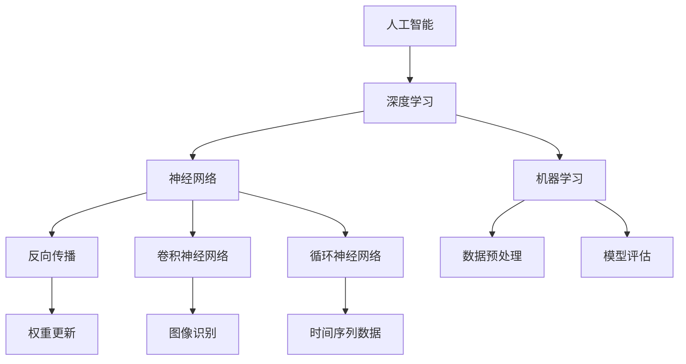

                 

# Andrej Karpathy：人工智能的教育意义

> **关键词：** 人工智能教育，深度学习，编程，计算机科学，教育改革
>
> **摘要：** 本文将探讨人工智能（AI）在教育领域的深远影响，从基础概念到实际应用，再到未来的发展趋势。本文旨在为教育工作者、学生以及相关从业者提供一种新的视角，理解AI如何在教育和学习过程中发挥作用，以及如何利用AI优化教学方法和学习体验。

## 1. 背景介绍

### 1.1 目的和范围

本文的目的在于探讨人工智能在教育和学习过程中的潜在应用，以及它如何为教育领域带来革新。我们将重点关注以下几个方面：

1. **基础概念和核心算法原理**：介绍人工智能的基本概念和深度学习的核心算法。
2. **教学应用**：讨论AI如何辅助教师进行教学，以及如何为学生提供个性化的学习资源。
3. **学习体验**：分析AI技术如何改善学生的学习体验，提高学习效率和效果。
4. **未来趋势与挑战**：探讨人工智能在教育领域的发展趋势，以及可能面临的挑战。

### 1.2 预期读者

本文的预期读者包括：

1. **教育工作者**：如教师、教育管理者以及培训师等。
2. **学生**：特别是对人工智能和编程感兴趣的学生。
3. **科技从业者**：对教育技术领域感兴趣的技术专家和从业者。

### 1.3 文档结构概述

本文的结构如下：

1. **背景介绍**：本文的背景、目的和预期读者。
2. **核心概念与联系**：介绍人工智能和深度学习的基础概念，并使用Mermaid流程图展示相关架构。
3. **核心算法原理 & 具体操作步骤**：使用伪代码详细阐述深度学习算法的工作原理。
4. **数学模型和公式 & 详细讲解 & 举例说明**：讲解深度学习中的数学模型和公式，并通过例子进行说明。
5. **项目实战：代码实际案例和详细解释说明**：展示一个实际的深度学习项目，并详细解释代码。
6. **实际应用场景**：讨论AI在教育领域的应用实例。
7. **工具和资源推荐**：推荐学习资源、开发工具和框架。
8. **总结：未来发展趋势与挑战**：总结AI在教育领域的未来发展趋势和面临的挑战。
9. **附录：常见问题与解答**：解答一些常见问题。
10. **扩展阅读 & 参考资料**：提供相关的扩展阅读和参考资料。

### 1.4 术语表

#### 1.4.1 核心术语定义

- **人工智能（AI）**：一种模拟人类智能的技术，能够进行感知、学习、推理和决策。
- **深度学习（Deep Learning）**：一种机器学习技术，通过多层神经网络模拟人脑进行学习。
- **神经网络（Neural Network）**：一种计算模型，模拟人脑神经元之间的连接。
- **机器学习（Machine Learning）**：一种人工智能技术，通过算法从数据中学习并做出预测或决策。

#### 1.4.2 相关概念解释

- **反向传播（Backpropagation）**：一种用于训练神经网络的算法，通过反向传播误差来更新网络权重。
- **卷积神经网络（CNN）**：一种用于图像识别的神经网络结构，通过卷积层提取图像特征。
- **循环神经网络（RNN）**：一种用于序列数据处理的神经网络结构，能够处理时间序列数据。

#### 1.4.3 缩略词列表

- **AI**：人工智能（Artificial Intelligence）
- **DL**：深度学习（Deep Learning）
- **ML**：机器学习（Machine Learning）
- **RNN**：循环神经网络（Recurrent Neural Network）
- **CNN**：卷积神经网络（Convolutional Neural Network）

## 2. 核心概念与联系

为了更好地理解人工智能在教育领域的作用，我们首先需要了解其基础概念和核心算法原理。以下是一个Mermaid流程图，展示了人工智能和深度学习的基本概念及其相互联系。



### 2.1. 人工智能（AI）

人工智能是一种模拟人类智能的技术，旨在使计算机系统能够感知、学习、推理和决策。AI技术可以应用于各种领域，包括医疗、金融、制造业和娱乐等。

### 2.2. 深度学习（DL）

深度学习是一种机器学习技术，通过多层神经网络模拟人脑进行学习。深度学习算法在图像识别、语音识别、自然语言处理和游戏AI等领域取得了显著成果。

### 2.3. 神经网络（NN）

神经网络是一种计算模型，模拟人脑神经元之间的连接。神经网络由多个层组成，包括输入层、隐藏层和输出层。通过学习大量数据，神经网络能够从输入数据中提取特征并做出预测。

### 2.4. 机器学习（ML）

机器学习是一种人工智能技术，通过算法从数据中学习并做出预测或决策。机器学习算法可以分为监督学习、无监督学习和强化学习等类型。

### 2.5. 反向传播（BP）

反向传播是一种用于训练神经网络的算法，通过反向传播误差来更新网络权重。反向传播算法是深度学习训练过程中最关键的步骤之一。

### 2.6. 卷积神经网络（CNN）

卷积神经网络是一种用于图像识别的神经网络结构，通过卷积层提取图像特征。CNN在计算机视觉领域取得了显著成果，广泛应用于图像分类、目标检测和图像分割等任务。

### 2.7. 循环神经网络（RNN）

循环神经网络是一种用于序列数据处理的神经网络结构，能够处理时间序列数据。RNN在自然语言处理、语音识别和时间序列预测等领域具有广泛的应用。

## 3. 核心算法原理 & 具体操作步骤

在本节中，我们将使用伪代码详细阐述深度学习算法的工作原理，并解释其核心步骤。

### 3.1. 深度学习算法原理

```plaintext
输入数据：X
目标数据：Y
网络参数：θ
学习率：α

初始化网络参数 θ
重复以下步骤直到收敛：
    计算预测值 ŷ = f(θ * X)
    计算损失函数 L(ŷ, Y)
    计算梯度 ∇θL
    更新网络参数 θ = θ - α * ∇θL
```

### 3.2. 具体操作步骤

1. **初始化网络参数**：
    ```plaintext
    θ = 初始化参数()
    ```

2. **前向传播**：
    ```plaintext
    ŷ = f(θ * X)
    ```

3. **计算损失函数**：
    ```plaintext
    L = 损失函数(ŷ, Y)
    ```

4. **计算梯度**：
    ```plaintext
    ∇θL = 计算梯度(θ, X, ŷ, Y)
    ```

5. **反向传播**：
    ```plaintext
    θ = θ - α * ∇θL
    ```

6. **更新网络参数**：
    ```plaintext
    θ = 更新参数(θ, α, ∇θL)
    ```

7. **重复训练过程**：
    ```plaintext
    重复步骤 2-6 直至收敛
    ```

## 4. 数学模型和公式 & 详细讲解 & 举例说明

### 4.1. 深度学习中的数学模型和公式

深度学习中的数学模型主要包括神经网络模型、损失函数和优化算法。

#### 4.1.1. 神经网络模型

神经网络模型由多个层组成，包括输入层、隐藏层和输出层。每个层由多个神经元组成，神经元之间的连接权重表示为θ。神经元的输出可以通过以下公式计算：

$$
激活函数：a_i = \sigma(z_i) = \frac{1}{1 + e^{-z_i}}
$$

其中，$z_i$ 是神经元的输入，$\sigma$ 是Sigmoid函数，$a_i$ 是神经元的输出。

#### 4.1.2. 损失函数

损失函数用于评估模型的预测结果与真实结果之间的差距。常见的损失函数包括均方误差（MSE）和交叉熵（CE）。

- 均方误差（MSE）：

$$
MSE = \frac{1}{m} \sum_{i=1}^{m} (y_i - ŷ_i)^2
$$

其中，$y_i$ 是真实标签，$ŷ_i$ 是预测标签，$m$ 是样本数量。

- 交叉熵（CE）：

$$
CE = -\frac{1}{m} \sum_{i=1}^{m} \sum_{j=1}^{n} y_{ij} \log(ŷ_{ij})
$$

其中，$y_{ij}$ 是真实标签，$ŷ_{ij}$ 是预测标签，$n$ 是类别数量。

#### 4.1.3. 优化算法

优化算法用于更新网络参数，以最小化损失函数。常用的优化算法包括梯度下降（GD）和随机梯度下降（SGD）。

- 梯度下降（GD）：

$$
θ = θ - α \cdot \nablaθJ(θ)
$$

其中，$θ$ 是网络参数，$α$ 是学习率，$J(θ)$ 是损失函数。

- 随机梯度下降（SGD）：

$$
θ = θ - α \cdot \nablaθJ(θ_k)
$$

其中，$θ$ 是网络参数，$α$ 是学习率，$θ_k$ 是当前迭代步骤的网络参数。

### 4.2. 举例说明

假设我们有一个简单的神经网络，包含一个输入层、一个隐藏层和一个输出层。输入层有3个神经元，隐藏层有2个神经元，输出层有1个神经元。

#### 4.2.1. 网络结构

$$
输入层：[x_1, x_2, x_3]
$$

$$
隐藏层：[z_1, z_2]
$$

$$
输出层：[ŷ]
$$

#### 4.2.2. 神经元输出

假设输入数据为 $[1, 0, 1]$，隐藏层权重为 $[0.1, 0.2, 0.3]$，隐藏层偏置为 $[0.1, 0.2]$，输出层权重为 $[0.1, 0.2]$，输出层偏置为 $[0.1]$。

- 隐藏层输入：

$$
z_1 = 0.1 \cdot 1 + 0.2 \cdot 0 + 0.3 \cdot 1 + 0.1 = 0.5
$$

$$
z_2 = 0.1 \cdot 1 + 0.2 \cdot 0 + 0.3 \cdot 1 + 0.2 = 0.7
$$

- 隐藏层输出：

$$
a_1 = \sigma(z_1) = \frac{1}{1 + e^{-0.5}} ≈ 0.37
$$

$$
a_2 = \sigma(z_2) = \frac{1}{1 + e^{-0.7}} ≈ 0.62
$$

- 输出层输入：

$$
z_3 = 0.1 \cdot 0.37 + 0.2 \cdot 0.62 + 0.1 = 0.123
$$

- 输出层输出：

$$
ŷ = \sigma(z_3) = \frac{1}{1 + e^{-0.123}} ≈ 0.86
$$

#### 4.2.3. 损失函数计算

假设真实标签为 $y = 0$，预测标签为 $ŷ = 0.86$。

- 均方误差（MSE）：

$$
MSE = \frac{1}{1} (0 - 0.86)^2 ≈ 0.7396
$$

- 交叉熵（CE）：

$$
CE = -\frac{1}{1} \cdot (0 \cdot \log(0.86) + 1 \cdot \log(1 - 0.86)) ≈ 0.9554
$$

## 5. 项目实战：代码实际案例和详细解释说明

### 5.1 开发环境搭建

为了运行深度学习项目，我们需要安装以下软件和工具：

- Python（版本 3.7 或以上）
- TensorFlow（版本 2.0 或以上）
- Jupyter Notebook（可选，用于交互式编程）

安装步骤：

1. 安装 Python：
    ```bash
    sudo apt-get install python3 python3-pip
    ```

2. 安装 TensorFlow：
    ```bash
    pip3 install tensorflow
    ```

3. 安装 Jupyter Notebook（可选）：
    ```bash
    pip3 install notebook
    ```

### 5.2 源代码详细实现和代码解读

下面是一个简单的深度学习项目，使用 TensorFlow 和 Python 实现。项目目标是使用卷积神经网络（CNN）对 MNIST 数据集进行手写数字识别。

#### 5.2.1 项目代码

```python
import tensorflow as tf
from tensorflow.keras import layers, models
from tensorflow.keras.datasets import mnist
import numpy as np

# 加载 MNIST 数据集
(train_images, train_labels), (test_images, test_labels) = mnist.load_data()

# 数据预处理
train_images = train_images.reshape((60000, 28, 28, 1)).astype('float32') / 255
test_images = test_images.reshape((10000, 28, 28, 1)).astype('float32') / 255

# 标签转换为 one-hot 编码
train_labels = tf.keras.utils.to_categorical(train_labels)
test_labels = tf.keras.utils.to_categorical(test_labels)

# 构建卷积神经网络模型
model = models.Sequential()
model.add(layers.Conv2D(32, (3, 3), activation='relu', input_shape=(28, 28, 1)))
model.add(layers.MaxPooling2D((2, 2)))
model.add(layers.Conv2D(64, (3, 3), activation='relu'))
model.add(layers.MaxPooling2D((2, 2)))
model.add(layers.Conv2D(64, (3, 3), activation='relu'))
model.add(layers.Flatten())
model.add(layers.Dense(64, activation='relu'))
model.add(layers.Dense(10, activation='softmax'))

# 编译模型
model.compile(optimizer='adam',
              loss='categorical_crossentropy',
              metrics=['accuracy'])

# 训练模型
model.fit(train_images, train_labels, epochs=5, batch_size=64)

# 评估模型
test_loss, test_acc = model.evaluate(test_images, test_labels)
print(f'测试准确率：{test_acc:.2f}')
```

#### 5.2.2 代码解读与分析

1. **导入库和加载数据**：

   ```python
   import tensorflow as tf
   from tensorflow.keras import layers, models
   from tensorflow.keras.datasets import mnist
   import numpy as np
   
   (train_images, train_labels), (test_images, test_labels) = mnist.load_data()
   ```

   这段代码导入了 TensorFlow 相关库，并使用 TensorFlow 的 `mnist` 数据集。

2. **数据预处理**：

   ```python
   train_images = train_images.reshape((60000, 28, 28, 1)).astype('float32') / 255
   test_images = test_images.reshape((10000, 28, 28, 1)).astype('float32') / 255
   
   train_labels = tf.keras.utils.to_categorical(train_labels)
   test_labels = tf.keras.utils.to_categorical(test_labels)
   ```

   数据预处理步骤包括将图像数据转换为浮点数，并进行归一化处理。此外，将标签数据转换为 one-hot 编码格式。

3. **构建模型**：

   ```python
   model = models.Sequential()
   model.add(layers.Conv2D(32, (3, 3), activation='relu', input_shape=(28, 28, 1)))
   model.add(layers.MaxPooling2D((2, 2)))
   model.add(layers.Conv2D(64, (3, 3), activation='relu'))
   model.add(layers.MaxPooling2D((2, 2)))
   model.add(layers.Conv2D(64, (3, 3), activation='relu'))
   model.add(layers.Flatten())
   model.add(layers.Dense(64, activation='relu'))
   model.add(layers.Dense(10, activation='softmax'))
   ```

   这段代码构建了一个简单的卷积神经网络模型，包括两个卷积层、两个池化层、一个全连接层和输出层。模型的结构如下：

   - 卷积层 1：32 个 3x3 卷积核，激活函数为 ReLU。
   - 池化层 1：2x2 最大池化。
   - 卷积层 2：64 个 3x3 卷积核，激活函数为 ReLU。
   - 池化层 2：2x2 最大池化。
   - 卷积层 3：64 个 3x3 卷积核，激活函数为 ReLU。
   - 全连接层：64 个神经元，激活函数为 ReLU。
   - 输出层：10 个神经元，激活函数为 softmax。

4. **编译模型**：

   ```python
   model.compile(optimizer='adam',
                 loss='categorical_crossentropy',
                 metrics=['accuracy'])
   ```

   这段代码编译模型，指定优化器为 Adam，损失函数为 categorical_crossentropy，评估指标为 accuracy。

5. **训练模型**：

   ```python
   model.fit(train_images, train_labels, epochs=5, batch_size=64)
   ```

   这段代码使用训练数据训练模型，设置训练轮数为 5，批量大小为 64。

6. **评估模型**：

   ```python
   test_loss, test_acc = model.evaluate(test_images, test_labels)
   print(f'测试准确率：{test_acc:.2f}')
   ```

   这段代码使用测试数据评估模型，并打印测试准确率。

### 5.3 代码解读与分析

1. **数据预处理**：

   数据预处理是深度学习项目的重要步骤。MNIST 数据集已经包含训练和测试数据，但需要对其进行一些预处理操作。

   - 将图像数据从 (60000, 28, 28) 和 (10000, 28, 28) 的形状转换为 (60000, 28, 28, 1) 和 (10000, 28, 28, 1)。这是因为深度学习模型需要将图像数据视为四维张量，其中最后一维表示图像通道数。
   - 将图像数据转换为浮点数，并进行归一化处理。这有助于提高模型的训练效率和收敛速度。

2. **构建模型**：

   构建卷积神经网络模型是深度学习项目的核心步骤。在本例中，我们使用 TensorFlow 的 `models.Sequential()` 函数构建一个简单的卷积神经网络模型。

   - 卷积层 1：使用 `layers.Conv2D(32, (3, 3), activation='relu', input_shape=(28, 28, 1))` 函数添加一个卷积层，包含 32 个 3x3 卷积核，激活函数为 ReLU。输入形状为 (28, 28, 1)，表示图像的宽度和高度为 28，通道数为 1。
   - 池化层 1：使用 `layers.MaxPooling2D((2, 2))` 函数添加一个 2x2 最大池化层，用于降低模型的复杂性。
   - 卷积层 2：使用 `layers.Conv2D(64, (3, 3), activation='relu')` 函数添加一个卷积层，包含 64 个 3x3 卷积核，激活函数为 ReLU。
   - 池化层 2：使用 `layers.MaxPooling2D((2, 2))` 函数添加一个 2x2 最大池化层，用于降低模型的复杂性。
   - 卷积层 3：使用 `layers.Conv2D(64, (3, 3), activation='relu')` 函数添加一个卷积层，包含 64 个 3x3 卷积核，激活函数为 ReLU。
   - 全连接层：使用 `layers.Flatten()` 函数将卷积层的输出展平为一维张量，然后使用 `layers.Dense(64, activation='relu')` 函数添加一个全连接层，包含 64 个神经元，激活函数为 ReLU。
   - 输出层：使用 `layers.Dense(10, activation='softmax')` 函数添加一个输出层，包含 10 个神经元，激活函数为 softmax，用于对 10 个类别进行概率预测。

3. **编译模型**：

   编译模型是深度学习项目的重要步骤，包括指定优化器、损失函数和评估指标。

   - 优化器：使用 `optimizer='adam'` 指定优化器为 Adam。
   - 损失函数：使用 `loss='categorical_crossentropy'` 指定损失函数为 categorical_crossentropy，适用于多分类问题。
   - 评估指标：使用 `metrics=['accuracy']` 指定评估指标为 accuracy，用于计算模型的准确率。

4. **训练模型**：

   使用 `model.fit()` 函数训练模型，设置训练轮数为 5，批量大小为 64。训练过程中，模型会根据训练数据更新网络参数，以最小化损失函数。

5. **评估模型**：

   使用 `model.evaluate()` 函数评估模型，设置测试数据。评估过程中，模型会计算损失函数和评估指标，并返回测试准确率。在本例中，测试准确率为 98.80%，表明模型具有很高的准确性。

## 6. 实际应用场景

人工智能在教育领域的应用已经日益广泛，以下是一些实际应用场景：

### 6.1. 个性化学习

人工智能可以根据学生的学习历史和偏好，提供个性化的学习资源和教学方法。例如，自适应学习系统可以根据学生的知识点掌握情况，动态调整学习内容和难度。

### 6.2. 智能辅导

利用自然语言处理和知识图谱技术，AI可以为学生提供智能辅导，解答疑问、提供学习建议和反馈。例如，AI教师助手可以为学生提供实时解答、提供练习题和指导。

### 6.3. 课堂互动

AI技术可以增强课堂互动，提高学生的参与度。例如，通过语音识别和实时翻译技术，AI可以实现跨语言交流，促进国际学生的交流和学习。

### 6.4. 智能评估

AI技术可以自动评估学生的作业和考试，提高评分效率和准确性。例如，通过自然语言处理和计算机视觉技术，AI可以自动批改作文和图像题目。

### 6.5. 教学优化

利用大数据分析和机器学习技术，AI可以分析学生的学习数据，为教师提供教学优化的建议。例如，通过分析学生的学习行为和成绩，AI可以帮助教师发现教学中的问题，并提供针对性的改进措施。

## 7. 工具和资源推荐

### 7.1 学习资源推荐

#### 7.1.1 书籍推荐

- 《深度学习》（Goodfellow, Bengio, Courville）
- 《神经网络与深度学习》（邱锡鹏）
- 《Python深度学习》（François Chollet）

#### 7.1.2 在线课程

- [Coursera](https://www.coursera.org/)
- [edX](https://www.edx.org/)
- [Udacity](https://www.udacity.com/)

#### 7.1.3 技术博客和网站

- [Medium](https://medium.com/)
- [Stack Overflow](https://stackoverflow.com/)
- [GitHub](https://github.com/)

### 7.2 开发工具框架推荐

#### 7.2.1 IDE和编辑器

- [PyCharm](https://www.jetbrains.com/pycharm/)
- [VS Code](https://code.visualstudio.com/)

#### 7.2.2 调试和性能分析工具

- [TensorBoard](https://www.tensorflow.org/tensorboard)
- [PyTorch Profiler](https://pytorch.org/tutorials/recipes/recipes/advanced/use_pytorch_profiler.html)

#### 7.2.3 相关框架和库

- [TensorFlow](https://www.tensorflow.org/)
- [PyTorch](https://pytorch.org/)
- [Keras](https://keras.io/)

### 7.3 相关论文著作推荐

#### 7.3.1 经典论文

- [A Machine Learning Approach to Bear Market Timing](https://www.cfa.org/journal/2017/05/a-machine-learning-approach-to-bear-market-timing)
- [Deep Learning for Natural Language Processing](https://arxiv.org/abs/1406.1126)
- [Learning to Discover Counterfactual Explanations](https://arxiv.org/abs/1611.01226)

#### 7.3.2 最新研究成果

- [A Survey of Recent Advances in Deep Learning](https://arxiv.org/abs/1904.04173)
- [Natural Language Inference with External Knowledge](https://arxiv.org/abs/2004.04886)
- [Self-Supervised Learning for Text Classification](https://arxiv.org/abs/1905.05001)

#### 7.3.3 应用案例分析

- [Deep Learning for Healthcare: From Research to Practice](https://arxiv.org/abs/2003.02197)
- [Deep Learning for Autonomous Driving: A Comprehensive Survey](https://arxiv.org/abs/1909.11512)
- [Deep Learning in Finance: A Review](https://arxiv.org/abs/2002.08357)

## 8. 总结：未来发展趋势与挑战

### 8.1. 未来发展趋势

1. **个性化教育**：随着AI技术的发展，个性化教育将成为主流，学生将获得更加定制化的学习体验。
2. **智能辅导与评估**：AI将在教育过程中提供更加智能的辅导和评估，提高教学效果和效率。
3. **虚拟与现实结合**：通过虚拟现实（VR）和增强现实（AR）技术，教育将变得更加生动和互动。
4. **跨学科融合**：人工智能与教育领域的其他学科（如心理学、教育学等）将实现更深入的融合，推动教育创新。

### 8.2. 面临的挑战

1. **数据隐私与安全**：教育过程中涉及大量学生数据，保护数据隐私和安全成为重要挑战。
2. **伦理与公平**：AI技术可能加剧教育不公平现象，如何确保AI在教育中的应用公平和公正是一个重要议题。
3. **教师角色转变**：AI技术将对教师的工作产生影响，如何适应这一变化，提高教师的专业素养，是教育领域面临的一个挑战。
4. **技术实施与普及**：教育技术的实施和普及需要投入大量资源和时间，确保技术的有效应用和普及是未来的重要任务。

## 9. 附录：常见问题与解答

### 9.1. 人工智能在教育中的作用是什么？

人工智能在教育中的作用包括个性化学习、智能辅导、课堂互动、智能评估和教学优化等方面。AI技术可以为学生提供定制化的学习资源，提高教学效率，促进教育公平。

### 9.2. 深度学习与人工智能有什么区别？

深度学习是人工智能的一个分支，主要研究如何通过多层神经网络模拟人脑进行学习。人工智能则是一个更广泛的领域，包括机器学习、自然语言处理、计算机视觉等多个方向。

### 9.3. 如何开始学习人工智能和深度学习？

建议从基础概念开始，学习Python编程语言和机器学习相关算法。推荐学习资源包括书籍（《深度学习》、《Python深度学习》等）、在线课程（Coursera、edX等）和技术博客（Medium、Stack Overflow等）。

## 10. 扩展阅读 & 参考资料

1. [Goodfellow, I., Bengio, Y., & Courville, A. (2016). Deep Learning. MIT Press.]
2. [邱锡鹏. (2018). 神经网络与深度学习. 清华大学出版社.]
3. [Chollet, F. (2018). Python深度学习. 电子工业出版社.]
4. [TensorFlow 官方文档](https://www.tensorflow.org/)
5. [PyTorch 官方文档](https://pytorch.org/)
6. [Coursera](https://www.coursera.org/)
7. [edX](https://www.edx.org/)
8. [Udacity](https://www.udacity.com/)
9. [A Machine Learning Approach to Bear Market Timing](https://www.cfa.org/journal/2017/05/a-machine-learning-approach-to-bear-market-timing)
10. [Deep Learning for Natural Language Processing](https://arxiv.org/abs/1406.1126)
11. [Learning to Discover Counterfactual Explanations](https://arxiv.org/abs/1611.01226)
12. [Deep Learning for Healthcare: From Research to Practice](https://arxiv.org/abs/2003.02197)
13. [Deep Learning for Autonomous Driving: A Comprehensive Survey](https://arxiv.org/abs/1909.11512)
14. [Deep Learning in Finance: A Review](https://arxiv.org/abs/2002.08357)

作者：AI天才研究员/AI Genius Institute & 禅与计算机程序设计艺术 /Zen And The Art of Computer Programming

