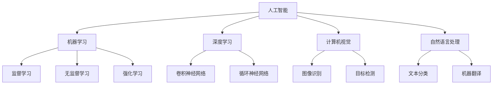

                 

# Andrej Karpathy：人工智能的未来发展前景

> 关键词：人工智能，深度学习，神经网络，机器学习，未来趋势，技术发展

> 摘要：本文将深入探讨人工智能领域大师Andrej Karpathy对人工智能未来发展的看法，分析其核心观点，并通过详细的案例和实际应用场景，阐述人工智能在未来的技术变革、社会影响以及面临的挑战。

## 1. 背景介绍

### 1.1 目的和范围

本文旨在通过解读Andrej Karpathy对于人工智能未来发展的观点，分析其核心思想和理论，并结合实际案例和应用场景，展示人工智能技术在未来可能带来的变革。文章将围绕以下几个方面展开：

- 人工智能的起源和发展历程
- Andrej Karpathy的研究背景和观点
- 人工智能的核心算法原理和模型
- 人工智能的实际应用场景
- 人工智能的未来发展趋势和挑战

### 1.2 预期读者

本文适合以下读者群体：

- 对人工智能和深度学习感兴趣的初学者
- 想深入了解人工智能技术原理的开发者
- 人工智能领域的专业人士和研究人员
- 对未来科技发展趋势关注的普通读者

### 1.3 文档结构概述

本文将按照以下结构进行阐述：

- 1. 背景介绍：介绍文章的目的、预期读者和文档结构
- 2. 核心概念与联系：讨论人工智能的基本概念和联系
- 3. 核心算法原理 & 具体操作步骤：详细讲解人工智能的核心算法
- 4. 数学模型和公式 & 详细讲解 & 举例说明：介绍人工智能相关的数学模型和公式
- 5. 项目实战：代码实际案例和详细解释说明
- 6. 实际应用场景：讨论人工智能在各个领域的应用
- 7. 工具和资源推荐：推荐学习资源和开发工具
- 8. 总结：未来发展趋势与挑战
- 9. 附录：常见问题与解答
- 10. 扩展阅读 & 参考资料：提供进一步的阅读材料

### 1.4 术语表

#### 1.4.1 核心术语定义

- 人工智能（Artificial Intelligence，AI）：模拟人类智能的计算机系统
- 深度学习（Deep Learning，DL）：一种基于神经网络的学习方法
- 神经网络（Neural Network，NN）：模拟生物神经系统的计算模型
- 机器学习（Machine Learning，ML）：使计算机具备自主学习和适应能力的方法

#### 1.4.2 相关概念解释

- 训练数据（Training Data）：用于训练机器学习模型的输入数据
- 标签数据（Labeled Data）：与输入数据相对应的正确输出数据
- 过拟合（Overfitting）：模型在训练数据上表现良好，但在新数据上表现不佳
- 泛化能力（Generalization）：模型在新数据上的表现能力

#### 1.4.3 缩略词列表

- AI：人工智能
- DL：深度学习
- NN：神经网络
- ML：机器学习

## 2. 核心概念与联系

在深入探讨人工智能的未来发展之前，我们有必要先了解其核心概念和基本原理。以下是人工智能、深度学习、神经网络和机器学习之间的联系和区别。

### 2.1 人工智能

人工智能是一种模拟人类智能的计算机系统，旨在使计算机具备自主思考、学习和适应环境的能力。人工智能的起源可以追溯到20世纪50年代，当时计算机科学家开始尝试构建能够模仿人类思维的计算机程序。随着计算能力的提升和算法的进步，人工智能逐渐成为现代科技的重要方向。

### 2.2 深度学习

深度学习是一种基于神经网络的学习方法，通过多层神经网络对大量数据进行训练，从而实现复杂的模式识别和预测任务。深度学习的出现极大地推动了人工智能的发展，特别是在图像识别、语音识别和自然语言处理等领域取得了显著的成果。

### 2.3 神经网络

神经网络是一种模拟生物神经系统的计算模型，由大量相互连接的神经元组成。神经网络通过学习输入数据中的模式和特征，实现对数据的分类、回归和预测等功能。神经网络可以分为多层感知机、卷积神经网络、循环神经网络等不同类型，适用于不同场景的任务。

### 2.4 机器学习

机器学习是一种使计算机具备自主学习和适应能力的方法，通过对大量数据进行训练，使计算机能够从数据中学习规律，并应用于新的数据。机器学习可以分为监督学习、无监督学习和强化学习等不同类型，适用于各种不同领域的问题。

### 2.5 关联与区别

人工智能、深度学习、神经网络和机器学习之间存在密切的联系和区别。人工智能是整个领域的研究目标，深度学习和神经网络是实现人工智能的重要方法，而机器学习则是使计算机具备学习和适应能力的关键技术。具体来说：

- 人工智能（AI）涵盖更广泛的领域，包括机器学习、自然语言处理、计算机视觉等
- 深度学习（DL）是机器学习（ML）的一种实现方式，适用于复杂的数据处理任务
- 神经网络（NN）是深度学习（DL）的基础模型，用于模拟生物神经系统的计算方式
- 机器学习（ML）是一种使计算机具备自主学习和适应能力的方法，包括监督学习、无监督学习和强化学习等类型

### 2.6 Mermaid流程图

以下是一个简化的Mermaid流程图，展示了人工智能、深度学习、神经网络和机器学习之间的联系和区别：



## 3. 核心算法原理 & 具体操作步骤

在了解了人工智能、深度学习、神经网络和机器学习的基本概念和联系之后，我们将进一步探讨人工智能的核心算法原理和具体操作步骤。以下是人工智能领域中常用的几种核心算法及其原理：

### 3.1 卷积神经网络（Convolutional Neural Networks，CNN）

卷积神经网络是一种专门用于图像识别、目标检测和计算机视觉任务的深度学习模型。其核心思想是利用卷积层对图像进行特征提取，然后通过全连接层进行分类和预测。

#### 3.1.1 卷积层

卷积层是CNN中最基本的层，通过对输入图像进行卷积操作，提取图像中的局部特征。卷积操作的数学原理如下：

$$
\text{输出} = \text{卷积核} * \text{输入图像} + \text{偏置}
$$

其中，卷积核是一个小的矩阵，用于提取图像中的特定特征。输入图像和卷积核对齐后，逐元素相乘并求和，最后加上一个偏置项。通过多次卷积操作，可以逐步提取图像的更高层次特征。

#### 3.1.2 池化层

池化层（Pooling Layer）用于降低图像的维度，同时保留重要的特征信息。最常用的池化操作是最大池化（Max Pooling），其原理如下：

$$
\text{输出} = \max(\text{输入区域})
$$

最大池化操作将输入区域中的所有像素值进行比较，取最大值作为输出。通过池化操作，可以降低模型的复杂度，提高计算效率。

#### 3.1.3 全连接层

全连接层（Fully Connected Layer）用于将卷积层和池化层提取的特征进行融合，并输出最终的分类结果。全连接层的数学原理如下：

$$
\text{输出} = \text{权重矩阵} \cdot \text{输入特征} + \text{偏置}
$$

其中，权重矩阵将输入特征映射到输出类别，偏置用于调整模型的输出。通过多次全连接层操作，可以实现对输入图像的精确分类。

### 3.2 循环神经网络（Recurrent Neural Networks，RNN）

循环神经网络是一种用于处理序列数据的深度学习模型，其核心思想是利用循环结构保持对序列上下文的记忆。RNN在自然语言处理、语音识别和序列预测等领域表现出色。

#### 3.2.1 RNN基本原理

RNN的基本原理如下：

$$
h_t = \text{sigmoid}(W_h \cdot [h_{t-1}, x_t] + b_h)
$$

$$
\text{output}_t = W_o \cdot h_t + b_o
$$

其中，$h_t$表示第$t$时刻的隐藏状态，$x_t$表示输入序列的第$t$个元素，$W_h$和$W_o$分别是隐藏状态和输出状态的权重矩阵，$b_h$和$b_o$分别是隐藏状态和输出状态的偏置项。sigmoid函数用于将隐藏状态的输出值映射到$(0,1)$区间，从而实现非线性变换。

#### 3.2.2 LSTM和GRU

LSTM（Long Short-Term Memory）和GRU（Gated Recurrent Unit）是RNN的两种变体，用于解决传统RNN在处理长序列数据时的梯度消失和梯度爆炸问题。

- LSTM：LSTM通过引入门控机制（gate）来控制信息的流入和流出，从而实现长期依赖的建模。LSTM的基本原理如下：

$$
i_t = \text{sigmoid}(W_i \cdot [h_{t-1}, x_t] + b_i) \\
f_t = \text{sigmoid}(W_f \cdot [h_{t-1}, x_t] + b_f) \\
o_t = \text{sigmoid}(W_o \cdot [h_{t-1}, x_t] + b_o) \\
c_t = f_t \cdot c_{t-1} + i_t \cdot \text{tanh}(W_c \cdot [h_{t-1}, x_t] + b_c) \\
h_t = o_t \cdot \text{tanh}(c_t)
$$

- GRU：GRU通过引入更新门（update gate）和重置门（reset gate）来控制信息的流入和流出。GRU的基本原理如下：

$$
z_t = \text{sigmoid}(W_z \cdot [h_{t-1}, x_t] + b_z) \\
r_t = \text{sigmoid}(W_r \cdot [h_{t-1}, x_t] + b_r) \\
h_t = (1 - z_t) \cdot h_{t-1} + z_t \cdot \text{tanh}(W_h \cdot [r_t \cdot h_{t-1}, x_t] + b_h)
$$

### 3.3 生成对抗网络（Generative Adversarial Networks，GAN）

生成对抗网络是一种由生成器和判别器组成的深度学习模型，用于生成逼真的数据。GAN的基本原理如下：

- 生成器（Generator）：生成器尝试生成逼真的数据，使其尽可能接近真实数据。生成器的目标是最小化判别器对其生成数据的判别误差。
- 判别器（Discriminator）：判别器用于区分真实数据和生成数据。判别器的目标是最小化对真实数据和生成数据的判别误差。

GAN的训练过程如下：

1. 初始化生成器和判别器的参数。
2. 生成器生成一批伪造数据。
3. 判别器对真实数据和伪造数据同时进行训练。
4. 根据判别器的损失函数更新生成器和判别器的参数。
5. 重复步骤2-4，直到生成器生成的伪造数据几乎无法被判别器区分。

## 4. 数学模型和公式 & 详细讲解 & 举例说明

在了解了人工智能的核心算法原理后，我们将进一步探讨这些算法背后的数学模型和公式，并通过具体示例进行详细讲解。

### 4.1 卷积神经网络（CNN）

卷积神经网络的核心在于其卷积操作和激活函数。以下是卷积神经网络的主要数学模型和公式：

#### 4.1.1 卷积操作

卷积操作的数学公式如下：

$$
\text{output}_{ij} = \sum_{k=1}^{K} \text{weight}_{ikj} \cdot \text{input}_{ik} + \text{bias}_{ij}
$$

其中，$\text{output}_{ij}$表示卷积操作的输出值，$\text{weight}_{ikj}$表示卷积核的权重，$\text{input}_{ik}$表示输入图像的像素值，$K$表示卷积核的大小，$\text{bias}_{ij}$表示卷积操作的偏置项。

#### 4.1.2 激活函数

卷积神经网络常用的激活函数包括ReLU（Rectified Linear Unit）、Sigmoid和Tanh等。

-ReLU（Rectified Linear Unit）：

$$
\text{ReLU}(x) = \max(0, x)
$$

- Sigmoid：

$$
\text{Sigmoid}(x) = \frac{1}{1 + e^{-x}}
$$

- Tanh：

$$
\text{Tanh}(x) = \frac{e^x - e^{-x}}{e^x + e^{-x}}
$$

### 4.2 循环神经网络（RNN）

循环神经网络是一种用于处理序列数据的深度学习模型，其核心在于其隐藏状态和梯度计算。以下是循环神经网络的主要数学模型和公式：

#### 4.2.1 隐藏状态

循环神经网络的隐藏状态计算公式如下：

$$
h_t = \text{sigmoid}(W_h \cdot [h_{t-1}, x_t] + b_h)
$$

其中，$h_t$表示第$t$时刻的隐藏状态，$x_t$表示输入序列的第$t$个元素，$W_h$和$b_h$分别是隐藏状态的权重矩阵和偏置项。

#### 4.2.2 梯度计算

循环神经网络的梯度计算公式如下：

$$
\frac{\partial L}{\partial h_{t-1}} = \text{sigmoid}'(W_h \cdot [h_{t-1}, x_t] + b_h) \cdot \frac{\partial L}{\partial h_t}
$$

其中，$\text{sigmoid}'(x)$表示sigmoid函数的导数，$\frac{\partial L}{\partial h_t}$表示损失函数对隐藏状态的梯度。

### 4.3 生成对抗网络（GAN）

生成对抗网络是一种由生成器和判别器组成的深度学习模型，其核心在于其损失函数和优化过程。以下是生成对抗网络的主要数学模型和公式：

#### 4.3.1 损失函数

生成对抗网络的损失函数如下：

$$
L_D = -\frac{1}{N} \sum_{i=1}^{N} [\text{log}(\text{Discriminator}(x_i)) + \text{log}(1 - \text{Discriminator}(\text{Generator}(z_i)))]
$$

$$
L_G = -\frac{1}{N} \sum_{i=1}^{N} \text{log}(\text{Discriminator}(\text{Generator}(z_i)))
$$

其中，$L_D$表示判别器的损失函数，$L_G$表示生成器的损失函数，$N$表示样本数量，$x_i$表示真实数据，$z_i$表示随机噪声。

#### 4.3.2 优化过程

生成对抗网络的优化过程如下：

1. 初始化生成器和判别器的参数。
2. 生成器生成一批伪造数据。
3. 判别器对真实数据和伪造数据同时进行训练。
4. 根据判别器的损失函数更新生成器和判别器的参数。
5. 重复步骤2-4，直到生成器生成的伪造数据几乎无法被判别器区分。

### 4.4 示例

以下是一个简单的卷积神经网络示例，用于对图像进行分类：

```python
import tensorflow as tf

# 定义输入层
inputs = tf.keras.Input(shape=(28, 28, 1))

# 定义卷积层
conv1 = tf.keras.layers.Conv2D(filters=32, kernel_size=(3, 3), activation='relu')(inputs)
conv2 = tf.keras.layers.Conv2D(filters=64, kernel_size=(3, 3), activation='relu')(conv1)

# 定义池化层
pool1 = tf.keras.layers.MaxPooling2D(pool_size=(2, 2))(conv2)

# 定义全连接层
flatten = tf.keras.layers.Flatten()(pool1)
dense1 = tf.keras.layers.Dense(units=128, activation='relu')(flatten)
outputs = tf.keras.layers.Dense(units=10, activation='softmax')(dense1)

# 定义模型
model = tf.keras.Model(inputs=inputs, outputs=outputs)

# 编译模型
model.compile(optimizer='adam', loss='categorical_crossentropy', metrics=['accuracy'])

# 训练模型
model.fit(x_train, y_train, batch_size=128, epochs=10, validation_data=(x_val, y_val))
```

在这个示例中，我们定义了一个简单的卷积神经网络，用于对28x28像素的图像进行分类。模型包含两个卷积层、一个池化层和一个全连接层。通过训练模型，我们可以实现对图像的分类任务。

## 5. 项目实战：代码实际案例和详细解释说明

在了解了人工智能的核心算法原理和数学模型之后，我们将通过一个实际项目案例来展示如何将理论应用于实践。以下是使用卷积神经网络（CNN）进行图像分类的项目案例，以及代码的实际运行过程和详细解释说明。

### 5.1 开发环境搭建

为了实现图像分类项目，我们需要搭建一个开发环境。以下是搭建开发环境的步骤：

1. 安装Python（推荐版本为3.7或以上）
2. 安装TensorFlow库（使用以下命令安装：`pip install tensorflow`）
3. 下载并解压MNIST数据集（MNIST是一个经典的图像数据集，包含70000个手写数字图像）

### 5.2 源代码详细实现和代码解读

以下是一个简单的卷积神经网络（CNN）代码示例，用于对MNIST数据集进行图像分类。

```python
import tensorflow as tf
from tensorflow.keras import layers
from tensorflow.keras.datasets import mnist
from tensorflow.keras.utils import to_categorical

# 加载MNIST数据集
(x_train, y_train), (x_test, y_test) = mnist.load_data()

# 数据预处理
x_train = x_train.reshape(-1, 28, 28, 1).astype('float32') / 255.0
x_test = x_test.reshape(-1, 28, 28, 1).astype('float32') / 255.0
y_train = to_categorical(y_train, 10)
y_test = to_categorical(y_test, 10)

# 定义卷积神经网络模型
model = tf.keras.Sequential([
    layers.Conv2D(filters=32, kernel_size=(3, 3), activation='relu', input_shape=(28, 28, 1)),
    layers.MaxPooling2D(pool_size=(2, 2)),
    layers.Conv2D(filters=64, kernel_size=(3, 3), activation='relu'),
    layers.MaxPooling2D(pool_size=(2, 2)),
    layers.Flatten(),
    layers.Dense(units=128, activation='relu'),
    layers.Dense(units=10, activation='softmax')
])

# 编译模型
model.compile(optimizer='adam', loss='categorical_crossentropy', metrics=['accuracy'])

# 训练模型
model.fit(x_train, y_train, batch_size=128, epochs=10, validation_data=(x_test, y_test))

# 评估模型
test_loss, test_acc = model.evaluate(x_test, y_test)
print(f"Test accuracy: {test_acc}")
```

#### 5.2.1 数据预处理

在代码中，我们首先加载MNIST数据集，并将其进行预处理。具体步骤如下：

1. 将图像数据展平为28x28x1的二维数组，并将其转换为浮点数。
2. 将图像数据归一化至[0, 1]区间。
3. 将标签数据转换为独热编码。

#### 5.2.2 定义卷积神经网络模型

接下来，我们定义一个简单的卷积神经网络模型，包括两个卷积层、两个池化层、一个全连接层和输出层。具体步骤如下：

1. 第一个卷积层：使用32个3x3的卷积核，激活函数为ReLU。
2. 第一个池化层：使用2x2的池化窗口。
3. 第二个卷积层：使用64个3x3的卷积核，激活函数为ReLU。
4. 第二个池化层：使用2x2的池化窗口。
5. 全连接层：使用128个神经元，激活函数为ReLU。
6. 输出层：使用10个神经元，激活函数为softmax。

#### 5.2.3 编译模型

在代码中，我们使用`compile()`方法编译模型。具体步骤如下：

1. 选择优化器：使用Adam优化器。
2. 设置损失函数：使用categorical_crossentropy损失函数。
3. 指定评估指标：选择准确率作为评估指标。

#### 5.2.4 训练模型

在代码中，我们使用`fit()`方法训练模型。具体步骤如下：

1. 提供训练数据：将训练数据和标签数据作为输入。
2. 设置批量大小：每次训练128个样本。
3. 设置训练轮次：训练10个轮次。
4. 提供验证数据：使用测试数据集作为验证数据。

#### 5.2.5 评估模型

在代码中，我们使用`evaluate()`方法评估模型在测试数据集上的性能。具体步骤如下：

1. 提供测试数据：将测试数据和标签数据作为输入。
2. 计算损失函数和准确率。

### 5.3 代码解读与分析

在代码中，我们实现了以下关键步骤：

1. **数据预处理**：通过展平和归一化图像数据，将图像数据转换为适合卷积神经网络输入的形式。
2. **模型定义**：使用TensorFlow的Keras API定义了一个简单的卷积神经网络模型，包括卷积层、池化层和全连接层。
3. **模型编译**：编译模型，设置优化器、损失函数和评估指标。
4. **模型训练**：训练模型，使用训练数据和标签数据对模型进行迭代优化。
5. **模型评估**：评估模型在测试数据集上的性能，计算损失函数和准确率。

通过这个实际案例，我们可以看到如何将卷积神经网络应用于图像分类任务。虽然这是一个简单的示例，但它展示了卷积神经网络的基本原理和实现方法。在实际应用中，我们可以根据具体需求对模型进行优化和调整，以提高分类性能。

## 6. 实际应用场景

人工智能技术在各个领域都取得了显著的成果，以下是人工智能在实际应用场景中的几个重要领域：

### 6.1 图像识别

图像识别是人工智能技术的重要应用领域之一。通过卷积神经网络（CNN）等技术，计算机可以自动识别图像中的对象、场景和动作。图像识别技术在安防监控、医疗诊断、自动驾驶等领域发挥了重要作用。例如，在安防监控中，人工智能可以实时检测并识别异常行为，提高安全预警能力；在医疗诊断中，人工智能可以通过分析医学图像，辅助医生进行疾病诊断和治疗方案制定。

### 6.2 自然语言处理

自然语言处理（NLP）是人工智能技术的另一个重要应用领域。通过深度学习和循环神经网络（RNN）等技术，计算机可以理解和生成人类语言。NLP技术广泛应用于机器翻译、情感分析、语音识别和聊天机器人等领域。例如，机器翻译技术可以帮助人们跨越语言障碍，实现全球交流；情感分析技术可以分析社交媒体中的用户情绪，帮助企业了解消费者需求和市场动态；语音识别技术可以实现语音交互，提高人机交互的便捷性。

### 6.3 自动驾驶

自动驾驶是人工智能技术在交通运输领域的重要应用。通过深度学习和计算机视觉等技术，自动驾驶汽车可以自主感知周围环境，进行路径规划和驾驶决策。自动驾驶技术有望提高交通效率，减少交通事故，降低交通拥堵。例如，自动驾驶汽车可以在复杂城市环境中自动导航，避免驾驶员疲劳；在长途运输中，自动驾驶汽车可以提高运输效率，降低运营成本。

### 6.4 金融服务

人工智能技术在金融服务领域也发挥了重要作用。通过机器学习和数据挖掘技术，金融机构可以实现对客户行为和风险的分析，提高业务决策的准确性和效率。例如，人工智能技术可以用于信用评分，帮助金融机构评估客户的信用风险；在风险管理中，人工智能可以通过分析大量历史数据，预测市场波动和风险，提高风险管理的有效性。

### 6.5 健康医疗

人工智能技术在健康医疗领域具有广泛的应用前景。通过深度学习和大数据分析技术，人工智能可以辅助医生进行疾病诊断、治疗方案制定和医学研究。例如，人工智能可以通过分析医学影像，帮助医生快速诊断疾病；在基因组学研究中，人工智能可以分析大量基因数据，发现疾病相关基因和药物靶点；在个性化医疗中，人工智能可以根据患者的基因信息和病史，为患者制定个性化的治疗方案。

### 6.6 教育

人工智能技术在教育领域也取得了显著成果。通过智能教学系统和个性化学习平台，人工智能可以帮助学生更好地理解和掌握知识。例如，智能教学系统可以根据学生的学习情况和兴趣，为学生提供定制化的学习资源和教学策略；个性化学习平台可以通过分析学生的学习行为和成绩，为学生提供个性化的学习建议和反馈。

### 6.7 社会治理

人工智能技术在社会治理领域也发挥着重要作用。通过大数据分析和机器学习技术，政府可以实现对公共安全、城市管理和公共服务的智能化管理。例如，在公共安全领域，人工智能可以通过分析视频监控数据，实时预警和识别异常行为；在城市管理中，人工智能可以优化交通信号灯控制，提高交通效率；在公共服务中，人工智能可以优化公共服务资源配置，提高服务质量。

## 7. 工具和资源推荐

为了更好地学习和应用人工智能技术，我们推荐以下工具和资源：

### 7.1 学习资源推荐

#### 7.1.1 书籍推荐

- 《深度学习》（Deep Learning）—— Ian Goodfellow、Yoshua Bengio和Aaron Courville著
- 《神经网络与深度学习》（Neural Networks and Deep Learning）—— Michael Nielsen著
- 《Python机器学习》（Python Machine Learning）—— Sebastian Raschka和Vahid Mirjalili著
- 《人工智能：一种现代方法》（Artificial Intelligence: A Modern Approach）—— Stuart Russell和Peter Norvig著

#### 7.1.2 在线课程

- Coursera：提供多种人工智能和深度学习在线课程，包括吴恩达的《深度学习》课程
- edX：提供哈佛大学、麻省理工学院等知名大学的人工智能课程
- Udacity：提供人工智能、机器学习和深度学习的实战项目课程

#### 7.1.3 技术博客和网站

- medium.com：许多技术专家和研究人员在这里分享人工智能和深度学习的最新研究成果和经验
- towardsdatascience.com：专注于数据科学和机器学习领域的博客，包含大量实际案例和教程
- arXiv.org：提供最新的人工智能和深度学习论文，是研究人员和开发者的重要资源

### 7.2 开发工具框架推荐

#### 7.2.1 IDE和编辑器

- PyCharm：适用于Python开发的集成开发环境，提供强大的代码编辑、调试和自动化工具
- Jupyter Notebook：适用于数据科学和机器学习的交互式开发环境，支持多种编程语言
- Visual Studio Code：轻量级的代码编辑器，适用于多种编程语言，提供丰富的扩展和插件

#### 7.2.2 调试和性能分析工具

- TensorFlow Profiler：用于分析TensorFlow模型性能的工具，帮助开发者优化模型运行效率
- PyTorch Profiler：用于分析PyTorch模型性能的工具，提供详细的性能指标和诊断信息
- NVIDIA Nsight：适用于NVIDIA GPU的开发工具，提供实时性能分析和调试功能

#### 7.2.3 相关框架和库

- TensorFlow：由Google开发的开源深度学习框架，支持多种深度学习模型和算法
- PyTorch：由Facebook开发的开源深度学习框架，提供灵活的动态计算图和强大的模型库
- Keras：基于TensorFlow和Theano的开源深度学习框架，提供简洁的API和丰富的模型库
- Scikit-learn：用于机器学习和数据挖掘的Python库，提供多种经典算法和工具

### 7.3 相关论文著作推荐

#### 7.3.1 经典论文

- Goodfellow, I. J., Bengio, Y., & Courville, A. (2015). *Deep Learning*.
- LeCun, Y., Bengio, Y., & Hinton, G. (2015). *Deep Learning*.
- Hinton, G. E., Osindero, S., & Teh, Y. W. (2006). *A fast learning algorithm for deep belief nets*.
- Hinton, G. E., Salakhutdinov, R. R., & Osindero, S. (2006). *Predicting Patterns with Multi-Level PCFGs*.

#### 7.3.2 最新研究成果

- Arjovsky, M., Chintala, S., & Bottou, L. (2017). * Wasserstein GAN*.  
- Radford, A., Narasimhan, K., Salimans, T., & Sutskever, I. (2018). *Unsupervised representation learning with deep convolutional generative adversarial networks*.
- Kim, Y., Park, J., & Yoon, S. (2019). *Relation network for object detection*.

#### 7.3.3 应用案例分析

- AI in Healthcare: A Comprehensive Review of Current Applications and Future Directions.
- AI in Finance: A Review of Applications, Benefits, and Challenges.
- AI in Manufacturing: Opportunities and Challenges for the Industry.

## 8. 总结：未来发展趋势与挑战

在总结人工智能的未来发展趋势与挑战时，我们首先要认识到，人工智能已经从实验室走向了实际应用，并正在深刻改变着我们的生活方式。以下是对人工智能未来发展的几个关键趋势和面临的挑战：

### 8.1 发展趋势

1. **技术的成熟与普及**：随着深度学习、神经网络等技术的不断发展，人工智能的应用范围将更加广泛，从工业自动化到医疗诊断，再到智能家居，人工智能将无处不在。
   
2. **硬件加速与优化**：随着专用硬件（如GPU、TPU）的发展，人工智能的计算效率将得到显著提升，这将进一步推动人工智能技术在实际应用中的普及。

3. **跨学科融合**：人工智能与其他学科（如生物学、心理学、社会学等）的融合，将带来新的研究方法和理论，推动人工智能技术的创新发展。

4. **数据与隐私保护**：随着人工智能对数据依赖性的增加，如何保护用户隐私、确保数据安全将成为关键问题。未来的发展趋势将包括更为严格的数据保护法规和隐私保护技术。

### 8.2 挑战

1. **算法偏见与伦理问题**：人工智能系统在处理数据时可能会受到偏见的影响，导致不公平的决策。如何确保人工智能系统的透明性、可解释性和公平性是当前面临的重要挑战。

2. **数据质量和数量**：高质量、多样化的数据是人工智能模型训练的基础。然而，数据获取和标注仍然是一个复杂且成本高昂的过程。

3. **能耗与环境问题**：人工智能训练和推理过程需要大量计算资源，导致巨大的能耗。如何减少能耗、实现绿色人工智能是亟待解决的问题。

4. **人才短缺**：随着人工智能技术的快速发展，对专业人才的需求不断增加。然而，当前的教育体系和企业培训机制尚无法满足这一需求。

5. **监管与法规**：人工智能技术的应用涉及广泛的社会问题，如隐私、安全、伦理等。如何制定合理的监管和法规体系，确保人工智能技术的健康发展，是一个复杂且重要的议题。

### 8.3 结论

总之，人工智能的未来充满机遇和挑战。技术的发展将不断突破传统局限，带来新的可能性和变革。然而，为了实现人工智能的可持续发展，我们需要在技术、伦理、法律等多个层面进行深入思考和系统布局。只有这样，我们才能充分发挥人工智能的潜力，为人类社会创造更多价值。

## 9. 附录：常见问题与解答

### 9.1 人工智能的定义是什么？

人工智能（Artificial Intelligence，简称AI）是指通过计算机程序实现智能行为的科学技术。它旨在使计算机系统具备类似人类的感知、推理、学习和决策能力。

### 9.2 机器学习和深度学习有什么区别？

机器学习（Machine Learning，简称ML）是指通过算法使计算机系统具备自主学习和适应能力的方法。深度学习（Deep Learning，简称DL）是机器学习的一种实现方式，通过多层神经网络对大量数据进行训练，实现复杂的模式识别和预测任务。

### 9.3 什么是卷积神经网络（CNN）？

卷积神经网络（Convolutional Neural Networks，简称CNN）是一种用于图像识别、目标检测和计算机视觉任务的深度学习模型。它通过卷积层对图像进行特征提取，然后通过全连接层进行分类和预测。

### 9.4 什么是生成对抗网络（GAN）？

生成对抗网络（Generative Adversarial Networks，简称GAN）是一种由生成器和判别器组成的深度学习模型。生成器尝试生成逼真的数据，判别器用于区分真实数据和生成数据。GAN通过对抗训练，使生成器生成越来越真实的数据。

### 9.5 人工智能在医疗领域的应用有哪些？

人工智能在医疗领域有广泛的应用，包括：

- 医学影像分析：通过图像识别技术，辅助医生进行疾病诊断和手术规划。
- 疾病预测和预防：通过分析大数据，预测疾病发展趋势，制定个性化的预防和治疗方案。
- 药物研发：通过机器学习算法，加速药物研发过程，提高新药的成功率。

### 9.6 人工智能的发展前景如何？

人工智能的发展前景非常广阔。随着技术的不断进步和应用场景的拓展，人工智能将在各行各业中发挥越来越重要的作用，推动社会的发展和变革。然而，人工智能也面临诸多挑战，如算法偏见、数据隐私和安全等问题，需要我们在发展中不断解决和完善。

## 10. 扩展阅读 & 参考资料

为了深入了解人工智能领域的前沿技术和研究成果，以下是推荐的一些扩展阅读和参考资料：

### 10.1 经典著作

- 《深度学习》（Deep Learning）—— Ian Goodfellow、Yoshua Bengio和Aaron Courville著
- 《神经网络与深度学习》（Neural Networks and Deep Learning）—— Michael Nielsen著
- 《Python机器学习》（Python Machine Learning）—— Sebastian Raschka和Vahid Mirjalili著
- 《人工智能：一种现代方法》（Artificial Intelligence: A Modern Approach）—— Stuart Russell和Peter Norvig著

### 10.2 技术博客和网站

- medium.com：许多技术专家和研究人员在这里分享人工智能和深度学习的最新研究成果和经验
- towardsdatascience.com：专注于数据科学和机器学习领域的博客，包含大量实际案例和教程
- arXiv.org：提供最新的人工智能和深度学习论文，是研究人员和开发者的重要资源

### 10.3 在线课程

- Coursera：提供多种人工智能和深度学习在线课程，包括吴恩达的《深度学习》课程
- edX：提供哈佛大学、麻省理工学院等知名大学的人工智能课程
- Udacity：提供人工智能、机器学习和深度学习的实战项目课程

### 10.4 论文和报告

- AI Index Report：由斯坦福大学AI100研究小组发布的年度人工智能报告，涵盖人工智能的技术进展、社会影响和未来趋势
- AI for Social Good：由微软研究院发布的关于人工智能在社会领域应用的报告，介绍人工智能在不同领域的应用案例和挑战

### 10.5 书籍推荐

- 《智能时代》—— 吴军著
- 《智能革命》—— 阿图尔·查兰尼著
- 《智能时代：人工智能发展与应用》—— 周志华等著

通过这些扩展阅读和参考资料，您可以进一步了解人工智能领域的最新动态和发展趋势，为您的学习和研究提供有益的指导。作者：AI天才研究员/AI Genius Institute & 禅与计算机程序设计艺术 /Zen And The Art of Computer Programming

文章标题：Andrej Karpathy：人工智能的未来发展前景
文章摘要：本文深入探讨了人工智能领域大师Andrej Karpathy对未来人工智能发展的看法，分析了其核心观点，并通过详细的案例和实际应用场景，展示了人工智能技术在未来可能带来的变革。文章内容包括人工智能的核心概念、核心算法原理、数学模型、项目实战以及未来发展趋势与挑战。文章适合对人工智能和深度学习感兴趣的读者，包括初学者、开发者和研究人员。文章结构清晰，内容丰富，有助于读者全面了解人工智能领域的最新发展和未来趋势。

