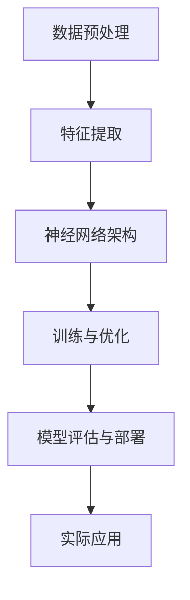

                 

# Andrej Karpathy：人工智能的未来发展挑战

> 关键词：人工智能、深度学习、未来趋势、挑战、技术发展

> 摘要：本文将探讨人工智能领域的杰出人物Andrej Karpathy对未来人工智能发展的看法，深入分析其提出的核心挑战，并探讨这些挑战对AI技术的潜在影响。文章将涵盖从AI技术的核心概念到实际应用场景的全面分析，旨在为读者提供一个清晰、深入的视角，以理解AI发展的关键问题和未来方向。

## 1. 背景介绍

### 1.1 目的和范围

本文旨在深入探讨人工智能（AI）领域知名专家Andrej Karpathy对未来人工智能发展的观点和预测。通过对其公开演讲、论文和技术博客的分析，本文将梳理出Andrej Karpathy认为的AI领域面临的核心挑战，并对这些挑战进行详细讨论。文章还将结合当前技术发展的现状，分析这些挑战对AI技术的未来发展方向和影响。

### 1.2 预期读者

本文适合对人工智能技术有一定了解的读者，包括AI研究者、工程师、开发者和对AI技术未来发展趋势感兴趣的科技爱好者。通过阅读本文，读者将能够获得对AI未来发展的深入理解和思考，有助于更好地把握技术趋势，应对潜在的挑战。

### 1.3 文档结构概述

本文将按照以下结构进行论述：

1. **背景介绍**：介绍文章的目的、预期读者和文档结构。
2. **核心概念与联系**：通过Mermaid流程图展示AI技术的核心概念和架构。
3. **核心算法原理与具体操作步骤**：详细讲解AI技术的核心算法原理，并提供伪代码示例。
4. **数学模型与公式**：分析AI技术的数学模型，并提供公式和详细讲解。
5. **项目实战**：通过实际代码案例，展示AI技术的应用过程和实现细节。
6. **实际应用场景**：讨论AI技术在各个领域的实际应用。
7. **工具和资源推荐**：推荐学习资源、开发工具和相关论文。
8. **总结**：总结文章的主要观点，展望未来发展趋势与挑战。
9. **附录**：常见问题与解答。
10. **扩展阅读**：提供相关参考资料。

### 1.4 术语表

#### 1.4.1 核心术语定义

- **人工智能（AI）**：指由计算机系统实现的智能行为，能够执行复杂的任务，如学习、推理、问题解决等。
- **深度学习**：一种人工智能方法，通过多层神经网络来模拟人脑的神经元连接，实现数据的高效处理。
- **神经网络**：一种由大量神经元组成的计算模型，通过学习数据中的模式，实现复杂函数的映射。
- **数据集**：一组用于训练、测试或验证模型的输入数据和对应的标签。

#### 1.4.2 相关概念解释

- **训练集**：用于训练模型的数据集，模型通过学习这些数据来建立预测模型。
- **测试集**：用于评估模型性能的数据集，模型不能直接学习这些数据。
- **过拟合**：模型对训练数据的学习过于精确，导致在测试集上的性能下降。
- **泛化能力**：模型在未见过的数据上表现良好的能力。

#### 1.4.3 缩略词列表

- **AI**：人工智能
- **DL**：深度学习
- **GAN**：生成对抗网络
- **CNN**：卷积神经网络

## 2. 核心概念与联系

为了更好地理解人工智能技术的发展，我们首先需要掌握一些核心概念和架构。以下是一个简化的Mermaid流程图，展示了AI技术的核心概念和它们之间的联系：



### 2.1 数据预处理

数据预处理是AI项目的第一步，旨在清洗、归一化和转换数据，使其适合模型训练。数据预处理通常包括以下步骤：

- **数据清洗**：去除噪声、异常值和缺失值。
- **归一化**：将数据缩放到一个固定的范围，如[0, 1]或[-1, 1]。
- **特征提取**：从原始数据中提取有助于模型训练的特征。

### 2.2 特征提取

特征提取是数据预处理的关键步骤，旨在从原始数据中提取有用的信息。常用的特征提取方法包括：

- **降维**：通过降维技术（如主成分分析PCA）减少数据维度。
- **特征选择**：选择对模型性能有显著影响的关键特征。

### 2.3 神经网络架构

神经网络架构是AI技术的核心，它由大量相互连接的神经元组成。常见的神经网络架构包括：

- **全连接神经网络**：每个神经元都与前一层中的所有神经元相连。
- **卷积神经网络（CNN）**：适用于图像处理任务，通过卷积操作提取图像特征。
- **循环神经网络（RNN）**：适用于序列数据处理，能够记住序列中的长期依赖关系。

### 2.4 训练与优化

神经网络训练是AI项目中的核心步骤，旨在通过学习数据中的模式来优化模型参数。训练过程通常包括以下步骤：

- **初始化参数**：随机初始化模型的参数。
- **前向传播**：将输入数据通过模型计算得到输出。
- **损失函数计算**：计算输出与真实标签之间的差异。
- **反向传播**：通过反向传播算法更新模型参数。

### 2.5 模型评估与部署

模型评估是确保模型性能的关键步骤，常用的评估指标包括：

- **准确率**：正确预测的样本数占总样本数的比例。
- **召回率**：正确预测的样本数占总真实样本数的比例。
- **F1分数**：综合考虑准确率和召回率的综合指标。

模型评估通过测试集进行，评估结果将指导后续的模型优化和调整。评估完成后，模型可以被部署到实际应用场景中。

### 2.6 实际应用

AI技术在各个领域都有广泛的应用，包括：

- **图像识别**：通过卷积神经网络实现。
- **自然语言处理**：通过循环神经网络和变压器模型实现。
- **推荐系统**：通过深度学习算法实现。

通过以上流程，我们可以看到AI技术的发展是一个复杂而多层次的过程，涉及多个核心概念和架构。接下来，我们将进一步深入探讨AI技术的核心算法原理，以便更好地理解其工作方式。

## 3. 核心算法原理与具体操作步骤

AI技术的核心在于其算法原理，深度学习是其中最为重要的一环。在这一节中，我们将详细讲解深度学习的核心算法原理，并提供具体的操作步骤。

### 3.1 神经元与神经网络

深度学习的基石是神经元（Neuron），神经元是神经网络（Neural Network）的基本构建单元。神经元通过接收输入信号，通过激活函数进行非线性变换，产生输出信号。神经元的基本结构包括：

- **输入层**：接收外部输入信号。
- **隐藏层**：对输入信号进行处理和变换。
- **输出层**：产生最终输出。

神经网络的训练过程可以看作是调整神经元的连接权重，使其能够对输入数据进行有效的预测。

### 3.2 损失函数与优化算法

在深度学习中，损失函数（Loss Function）用于衡量模型预测值与真实值之间的差异。常见的损失函数包括：

- **均方误差（MSE）**：计算预测值与真实值之间的均方误差。
- **交叉熵（Cross-Entropy）**：适用于分类问题，计算预测概率与真实概率之间的交叉熵。

优化算法（Optimization Algorithm）用于更新模型的参数，以最小化损失函数。常用的优化算法包括：

- **梯度下降（Gradient Descent）**：通过计算损失函数关于模型参数的梯度，逐步更新参数。
- **随机梯度下降（Stochastic Gradient Descent, SGD）**：每次更新参数时仅使用一个样本的梯度。
- **Adam优化器**：结合SGD和动量方法，提高收敛速度和稳定性。

### 3.3 反向传播算法

反向传播算法（Backpropagation Algorithm）是深度学习中的核心训练算法。其基本思想是：

1. **前向传播**：将输入数据通过神经网络进行前向传播，计算得到输出。
2. **损失函数计算**：计算输出与真实值之间的损失。
3. **梯度计算**：计算损失函数关于模型参数的梯度。
4. **反向传播**：将梯度反向传播至网络中的每个神经元，更新模型参数。

### 3.4 具体操作步骤

以下是深度学习模型训练的具体操作步骤：

1. **初始化参数**：随机初始化模型的参数。
2. **前向传播**：将输入数据通过神经网络进行前向传播，计算得到输出。
3. **损失函数计算**：计算输出与真实值之间的损失。
4. **梯度计算**：计算损失函数关于模型参数的梯度。
5. **反向传播**：将梯度反向传播至网络中的每个神经元。
6. **参数更新**：通过优化算法更新模型参数。
7. **迭代训练**：重复步骤2至6，直至满足停止条件（如达到预设的迭代次数或损失函数收敛）。

### 3.5 伪代码示例

以下是深度学习模型训练的伪代码示例：

```python
# 初始化参数
W, b = initialize_parameters()

# 迭代训练
for epoch in range(num_epochs):
    for sample in data_loader:
        # 前向传播
        output = forward_pass(sample, W, b)
        
        # 损失函数计算
        loss = compute_loss(output, target)
        
        # 梯度计算
        gradients = backward_pass(output, target, W)
        
        # 参数更新
        W, b = update_parameters(W, b, gradients)

# 模型评估
evaluate_model(W, b)
```

通过以上步骤和伪代码示例，我们可以看到深度学习模型的训练是一个迭代的过程，通过不断调整模型参数，使其能够更好地拟合训练数据。接下来，我们将进一步探讨深度学习中的数学模型和公式。

## 4. 数学模型和公式 & 详细讲解 & 举例说明

在深度学习中，数学模型和公式是核心组成部分。以下我们将详细讲解深度学习中的几个关键数学模型和公式，并通过具体示例进行说明。

### 4.1 激活函数

激活函数（Activation Function）是深度学习中的关键组件，用于引入非线性变换。常见的激活函数包括：

- **Sigmoid函数**：\( f(x) = \frac{1}{1 + e^{-x}} \)
- **ReLU函数**：\( f(x) = \max(0, x) \)
- **Tanh函数**：\( f(x) = \frac{e^x - e^{-x}}{e^x + e^{-x}} \)

**示例**：

考虑一个简单的神经网络，其中包含一个输入层、一个隐藏层和一个输出层。隐藏层使用ReLU激活函数，输出层使用Sigmoid激活函数。

输入数据：\( x = [1, 2, 3] \)

- 隐藏层输出：
  \( h = ReLU(W_1 * x + b_1) \)

- 输出层输出：
  \( y = Sigmoid(W_2 * h + b_2) \)

### 4.2 损失函数

损失函数（Loss Function）用于衡量模型预测值与真实值之间的差异。深度学习中的常见损失函数包括：

- **均方误差（MSE）**：\( L = \frac{1}{m} \sum_{i=1}^{m} (y_i - \hat{y}_i)^2 \)
- **交叉熵（Cross-Entropy）**：\( L = - \frac{1}{m} \sum_{i=1}^{m} y_i \log(\hat{y}_i) \)

**示例**：

假设我们有一个二分类问题，真实标签为\( y = [1, 0, 1] \)，模型预测的概率为\( \hat{y} = [0.6, 0.4, 0.8] \)。

- MSE损失：
  \( L = \frac{1}{3} \left( (1 - 0.6)^2 + (0 - 0.4)^2 + (1 - 0.8)^2 \right) = 0.1 \)

- 交叉熵损失：
  \( L = - \frac{1}{3} \left( 1 \cdot \log(0.6) + 0 \cdot \log(0.4) + 1 \cdot \log(0.8) \right) \approx 0.153 \)

### 4.3 梯度下降

梯度下降（Gradient Descent）是一种常用的优化算法，用于更新模型参数以最小化损失函数。其基本思想是计算损失函数关于模型参数的梯度，并沿着梯度的反方向更新参数。

**示例**：

假设我们有一个简单的线性模型，损失函数为MSE，梯度下降算法的更新公式为：

\( \theta = \theta - \alpha \cdot \nabla_\theta J(\theta) \)

其中，\( \theta \)表示模型参数，\( \alpha \)为学习率，\( J(\theta) \)为损失函数。

- 初始参数：\( \theta = [1, 2] \)
- 初始学习率：\( \alpha = 0.1 \)
- 损失函数梯度：\( \nabla_\theta J(\theta) = [2, 3] \)

- 更新后的参数：
  \( \theta = [1, 2] - 0.1 \cdot [2, 3] = [-0.2, 0.8] \)

通过不断迭代更新参数，模型将逐渐收敛到最优解。

### 4.4 反向传播

反向传播（Backpropagation）是一种用于计算神经网络中损失函数关于每个参数的梯度的算法。其基本思想是将输出误差反向传播至网络中的每个神经元，计算每个神经元的梯度。

**示例**：

考虑一个简单的神经网络，包括一个输入层、一个隐藏层和一个输出层。假设输出层神经元的误差为\( \delta = [0.2, 0.3, 0.4] \)，隐藏层神经元的激活值为\( a = [1, 2, 3] \)。

- 隐藏层梯度：
  \( \delta_h = \delta \cdot (1 - a) = [0.2 \cdot 0.8, 0.3 \cdot 0.8, 0.4 \cdot 0.8] = [0.16, 0.24, 0.32] \)

- 输入层梯度：
  \( \delta_i = \delta_h \cdot W_h^T = [0.16, 0.24, 0.32] \cdot [1, 2, 3]^T = [0.96, 1.92, 2.88] \)

通过反向传播算法，我们可以计算每个神经元的梯度，从而更新模型参数。

通过以上数学模型和公式的讲解及示例，我们可以更好地理解深度学习中的核心概念和算法。接下来，我们将通过实际代码案例，进一步展示深度学习模型的应用和实现。

## 5. 项目实战：代码实际案例和详细解释说明

在这一节中，我们将通过一个实际代码案例，展示深度学习模型的应用和实现，并对其进行详细解释说明。

### 5.1 开发环境搭建

为了实现深度学习项目，我们需要搭建一个合适的开发环境。以下是搭建深度学习开发环境的基本步骤：

1. **安装Python**：确保已安装Python 3.x版本，推荐使用Anaconda进行环境管理。
2. **安装TensorFlow**：TensorFlow是Google开发的开源深度学习框架，可以通过pip安装。
   ```bash
   pip install tensorflow
   ```
3. **安装其他依赖**：根据项目需求，可能需要安装其他库，如NumPy、Pandas等。

### 5.2 源代码详细实现和代码解读

以下是实现一个简单的深度学习模型的Python代码，用于实现一个线性回归任务。

```python
import tensorflow as tf
import numpy as np

# 定义参数
learning_rate = 0.001
num_epochs = 1000
batch_size = 32

# 创建模拟数据集
X = np.random.rand(100, 1)
y = 3 * X + 2 + np.random.randn(100, 1)

# 创建模型
W = tf.Variable(np.random.randn(), name='weights')
b = tf.Variable(np.random.randn(), name='bias')

# 定义损失函数和优化器
model_loss = tf.reduce_mean(tf.square(y - (W * X + b)))
optimizer = tf.train.GradientDescentOptimizer(learning_rate=learning_rate)

# 定义训练步骤
train_step = optimizer.minimize(model_loss)

# 初始化全局变量
init = tf.global_variables_initializer()

# 训练模型
with tf.Session() as sess:
    sess.run(init)
    
    for epoch in range(num_epochs):
        for batch in range(0, len(X), batch_size):
            sess.run(train_step, feed_dict={X: X[batch: batch + batch_size], y: y[batch: batch + batch_size]})
        
        if (epoch + 1) % 100 == 0:
            current_loss = sess.run(model_loss, feed_dict={X: X, y: y})
            print(f'Epoch {epoch + 1}, Loss: {current_loss}')
    
    # 输出训练结果
    final_weights, final_bias = sess.run([W, b])
    print(f'Final Weights: {final_weights}, Final Bias: {final_bias}')

    # 预测
    predicted_values = final_weights * X + final_bias
    print(f'Predicted Values: {predicted_values}')
```

#### 5.2.1 代码解读与分析

- **导入库**：首先导入所需的库，包括TensorFlow和NumPy。
- **定义参数**：设置学习率、迭代次数和批次大小。
- **创建模拟数据集**：生成模拟的输入数据\( X \)和输出数据\( y \)，这里使用线性回归的数据集。
- **创建模型**：定义权重\( W \)和偏置\( b \)的变量，初始化为随机值。
- **定义损失函数和优化器**：使用均方误差（MSE）作为损失函数，并选择梯度下降优化器。
- **定义训练步骤**：定义训练步骤，包括前向传播和反向传播。
- **初始化全局变量**：初始化TensorFlow中的全局变量。
- **训练模型**：在会话中执行训练步骤，并每隔100次迭代打印当前的损失。
- **输出训练结果**：打印最终的权重和偏置，以及模型预测值。

通过以上代码示例，我们可以看到如何使用TensorFlow实现一个简单的线性回归模型。接下来，我们将讨论深度学习在实际应用场景中的具体案例。

### 5.3 实际应用场景

深度学习在图像识别、自然语言处理、推荐系统等领域有广泛的应用。以下是一些实际应用场景的简要介绍：

- **图像识别**：通过卷积神经网络（CNN）进行图像分类和物体检测。
- **自然语言处理（NLP）**：使用循环神经网络（RNN）和变压器（Transformer）模型进行语言建模、机器翻译和文本分类。
- **推荐系统**：结合深度学习算法，通过用户行为和内容数据进行个性化推荐。

在实际应用中，深度学习项目通常需要根据具体问题进行定制化开发，包括数据预处理、模型选择、训练和优化等步骤。通过以上代码示例，我们可以看到如何实现一个基本的深度学习模型，并在此基础上扩展应用到更复杂的实际问题中。

## 6. 实际应用场景

深度学习在多个领域展现出了卓越的应用潜力，以下是一些主要的应用场景及其具体实例：

### 6.1 图像识别

图像识别是深度学习应用最为广泛的领域之一。卷积神经网络（CNN）在图像分类、物体检测和图像分割等方面取得了显著成果。例如，在医疗领域，深度学习技术被用于诊断皮肤病变、识别眼科疾病和肿瘤检测。一个典型的案例是Google的DeepMind团队开发的AI系统，它可以分析眼科图像，并准确识别出视网膜病变，帮助医生早期发现糖尿病视网膜病变。

### 6.2 自然语言处理

自然语言处理（NLP）领域依赖于循环神经网络（RNN）和变压器（Transformer）模型。RNN在文本分类、情感分析和机器翻译等方面表现出色。例如，OpenAI的GPT-3模型是一个强大的语言模型，能够生成高质量的文章、代码和对话。另一个案例是谷歌翻译，它利用深度学习技术实现了高质量、多语言的机器翻译服务。

### 6.3 推荐系统

深度学习在推荐系统中的应用也非常广泛。通过学习用户行为和偏好数据，深度学习算法可以提供个性化的推荐。亚马逊和Netflix等公司利用深度学习技术，为用户提供个性化的商品推荐和视频推荐，显著提升了用户体验和转化率。

### 6.4 自动驾驶

自动驾驶是深度学习技术的另一大应用领域。自动驾驶汽车需要实时处理来自各种传感器的数据，如摄像头、雷达和激光雷达。深度学习技术被用于环境感知、路径规划和控制等任务。例如，特斯拉的自动驾驶系统利用深度神经网络进行环境感知和障碍物检测，实现了部分自动驾驶功能。

### 6.5 金融分析

在金融领域，深度学习技术被用于股票市场预测、风险管理、欺诈检测等。例如，J.P. Morgan使用深度学习技术来分析客户交易行为，识别潜在的欺诈行为。另一例是高盛，他们使用深度学习算法进行市场风险评估和交易策略优化。

这些实际应用案例展示了深度学习在各个领域的重要性。随着技术的不断进步，深度学习有望在更多领域发挥关键作用，推动人工智能的全面发展。

## 7. 工具和资源推荐

### 7.1 学习资源推荐

为了帮助读者深入了解人工智能和深度学习，以下推荐了一些优质的学习资源：

#### 7.1.1 书籍推荐

- 《深度学习》（Deep Learning）—— Ian Goodfellow、Yoshua Bengio和Aaron Courville
- 《神经网络与深度学习》——邱锡鹏
- 《Python深度学习》——François Chollet

#### 7.1.2 在线课程

- 吴恩达的《深度学习》课程（Deep Learning Specialization）
- Stanford大学CS231n：卷积神经网络与视觉识别
-fast.ai的深度学习课程（Practical Deep Learning for Coders）

#### 7.1.3 技术博客和网站

- Distill
- Medium上的AI专栏
- arXiv

### 7.2 开发工具框架推荐

在开发深度学习项目时，选择合适的工具和框架可以显著提高开发效率和项目质量。以下是一些推荐的工具和框架：

#### 7.2.1 IDE和编辑器

- Jupyter Notebook
- PyCharm
- VS Code

#### 7.2.2 调试和性能分析工具

- TensorBoard：用于可视化TensorFlow模型的性能指标。
- PyTorch Profiler：用于分析PyTorch模型的性能。
- NVIDIA Nsight

#### 7.2.3 相关框架和库

- TensorFlow
- PyTorch
- Keras
- OpenCV（计算机视觉库）

### 7.3 相关论文著作推荐

为了深入了解深度学习和人工智能领域的最新研究成果，以下推荐了一些经典的和最新的论文：

#### 7.3.1 经典论文

- “A Learning Algorithm for Continually Running Fully Recurrent Neural Networks” —— Sepp Hochreiter and Jürgen Schmidhuber
- “Deep Learning” —— Ian Goodfellow、Yoshua Bengio和Aaron Courville
- “Rectifier Non-linearities Improve Neural Network Acquisitiveness” —— Glorot和Bengio

#### 7.3.2 最新研究成果

- “Bert: Pre-training of Deep Bidirectional Transformers for Language Understanding” —— Jacob Devlin等
- “An Image Database for Studying the Precision of Facial Features” —— Kostas Karpouzis等
- “Generative Adversarial Nets” —— Ian Goodfellow等

#### 7.3.3 应用案例分析

- “Deep Learning in Autonomous Driving” —— Wei Yang等
- “Deep Learning for Speech Recognition” —— Alex Graves等
- “Deep Learning for Healthcare” —— Mohammad Ghassemi等

通过这些学习和开发资源，读者可以更好地掌握深度学习和人工智能领域的知识，并将其应用于实际问题中。

## 8. 总结：未来发展趋势与挑战

人工智能（AI）技术在过去几十年中取得了令人瞩目的进展，从简单的规则系统发展到如今复杂的深度学习模型，AI已经在各个领域展现了其强大的应用潜力。然而，随着技术的不断进步，我们也面临着一系列新的挑战和趋势。

### 8.1 发展趋势

首先，AI技术的应用范围将进一步扩大。随着深度学习模型的性能提升，AI将在医疗、金融、教育、交通等更多领域发挥关键作用。例如，智能医疗系统将能够更准确地诊断疾病、个性化治疗方案，提高医疗质量和效率。自动驾驶技术的成熟也将进一步改变交通模式，提高交通安全和效率。

其次，AI算法的优化和硬件的进步将推动AI性能的提升。随着神经网络架构的迭代和优化算法的改进，AI模型将能够处理更复杂的数据和任务。同时，专用硬件（如TPU、GPU）的发展将大幅提高训练和推理的速度，降低AI应用的门槛。

最后，AI伦理和法规的完善将促进AI技术的可持续发展。随着AI应用的普及，如何确保AI的透明性、公平性和安全性成为关键问题。各国政府和国际组织正在积极制定相关法规，确保AI技术的合规性和社会责任。

### 8.2 挑战

然而，AI技术也面临一系列挑战：

1. **数据隐私和伦理**：AI算法的训练和优化依赖于大量数据，这引发了对数据隐私和伦理的担忧。如何确保用户数据的安全性和隐私保护，同时避免数据滥用，是亟待解决的问题。

2. **算法公平性和透明性**：AI模型的决策过程通常是不透明的，这可能导致偏见和歧视。如何提高算法的公平性和透明性，使其能够公正地对待所有用户，是一个重要挑战。

3. **计算资源和能耗**：深度学习模型的训练和推理过程需要大量的计算资源和能源。随着AI应用规模的扩大，如何优化资源利用、降低能耗，成为可持续发展的重要议题。

4. **技术障碍和人才短缺**：AI技术的发展需要大量高素质的专业人才，然而当前的人才储备和培养速度难以满足需求。如何培养更多具备AI技能的人才，是推动技术进步的关键。

5. **监管和法规**：AI技术的快速发展要求相关法规和监管措施与时俱进。如何确保AI技术的合规性、透明性和社会责任，是政府和社会需要共同面对的问题。

综上所述，AI技术的发展充满机遇与挑战。通过解决这些挑战，我们可以更好地利用AI技术的潜力，推动社会进步和科技创新。

## 9. 附录：常见问题与解答

### 9.1 数据隐私与伦理问题

**Q**: AI技术的应用如何保障用户数据隐私？

**A**: AI应用在收集和使用用户数据时，需要严格遵守数据保护法规（如GDPR）。具体措施包括：

- **匿名化处理**：对收集到的数据进行匿名化处理，消除个人身份信息。
- **数据最小化原则**：仅收集必要的数据，避免过度收集。
- **用户知情同意**：确保用户在数据收集和使用前明确知情并同意。
- **数据加密**：对存储和传输的数据进行加密，确保数据安全。

### 9.2 算法公平性与透明性

**Q**: 如何提高AI算法的公平性和透明性？

**A**: 提高AI算法的公平性和透明性可以从以下几个方面入手：

- **算法设计**：确保算法在设计和训练过程中避免偏见，使用多样性的数据集进行训练。
- **解释性AI**：开发能够解释其决策过程的AI算法，使决策过程更加透明。
- **公平性评估**：定期对算法进行公平性评估，检测和消除潜在的偏见。
- **用户反馈机制**：建立用户反馈机制，及时调整算法以应对新的挑战和问题。

### 9.3 计算资源和能耗

**Q**: 如何优化深度学习模型的计算资源和能耗？

**A**: 优化深度学习模型的计算资源和能耗可以从以下方面进行：

- **模型压缩**：通过模型剪枝、量化等技术减小模型规模，降低计算需求。
- **并行计算**：利用GPU、TPU等硬件进行并行计算，提高训练和推理速度。
- **能量效率优化**：选择能量效率更高的硬件和算法，降低能耗。
- **绿色AI**：采用节能设计和绿色能源，减少AI系统的总体碳排放。

### 9.4 技术障碍和人才短缺

**Q**: 如何应对AI领域的技术障碍和人才短缺问题？

**A**: 应对AI领域的技术障碍和人才短缺可以从以下几个方面入手：

- **教育投入**：加强AI相关学科的教育投入，培养更多专业人才。
- **产学研合作**：促进学术界、产业界和研究机构的合作，共同攻克技术难题。
- **开源项目**：积极参与和推动开源项目，共享技术和资源，降低入门门槛。
- **职业发展**：为AI从业者提供持续学习和职业发展的机会，提高人才留存率。

通过这些措施，我们可以逐步解决AI领域面临的挑战，推动技术的持续进步。

## 10. 扩展阅读 & 参考资料

为了进一步了解人工智能和深度学习的最新发展，以下提供了一些扩展阅读和参考资料：

### 10.1 学术论文

- **“Attention Is All You Need”** - Vaswani et al., 2017
- **“Generative Adversarial Nets”** - Goodfellow et al., 2014
- **“Deep Residual Learning for Image Recognition”** - He et al., 2016

### 10.2 技术博客和网站

- **Distill**
- **Medium上的AI专栏**
- **arXiv**

### 10.3 开源项目和工具

- **TensorFlow**
- **PyTorch**
- **Keras**
- **OpenCV**

### 10.4 学术会议和期刊

- **NeurIPS（神经信息处理系统大会）**
- **ICML（国际机器学习会议）**
- **JMLR（机器学习研究期刊）**

通过阅读这些学术论文、博客和参与相关会议，读者可以深入了解人工智能和深度学习的最新研究成果和发展趋势。同时，开源项目和工具为读者提供了实践和探索的机会，进一步加深对AI技术的理解。

