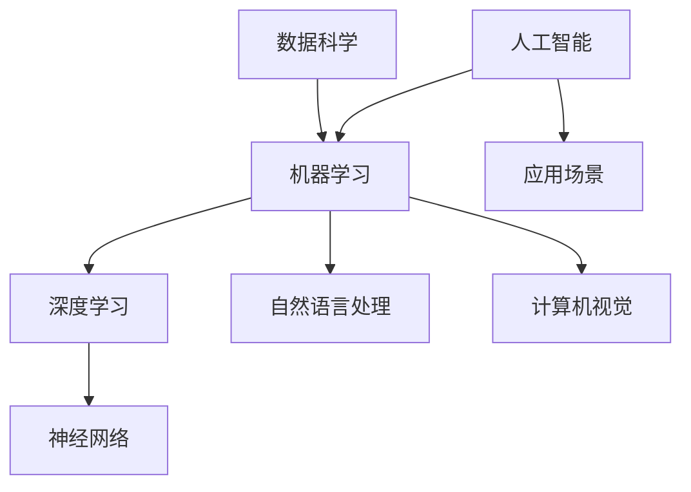

                 

# Andrej Karpathy：人工智能的未来发展挑战

> 关键词：人工智能、未来、发展、挑战、技术趋势、算法、数学模型、应用场景

> 摘要：本文深入探讨了人工智能（AI）未来的发展挑战，从核心算法原理、数学模型、应用场景等多个角度进行了全面分析。通过一步步的推理思考，本文提出了针对这些挑战的解决方案，并展望了AI领域的未来发展趋势。

## 1. 背景介绍

### 1.1 目的和范围

本文旨在探讨人工智能（AI）未来发展的主要挑战，分析这些挑战的根源，并提出相应的解决方案。本文将涵盖以下几个方面：

- **核心算法原理**：探讨现有AI算法的基本原理，以及它们在解决现实问题中的应用。
- **数学模型**：介绍AI中常用的数学模型，以及这些模型在算法设计中的应用。
- **应用场景**：分析AI在不同领域的应用，以及当前面临的问题和挑战。
- **解决方案**：针对AI发展中的挑战，提出可能的解决方案和未来发展方向。

### 1.2 预期读者

本文面向对人工智能有一定了解的技术人员、研究人员和爱好者。读者应具备一定的数学和计算机科学基础知识，以及对AI领域的兴趣。

### 1.3 文档结构概述

本文分为以下几个部分：

- **第1章：背景介绍**：介绍本文的目的、预期读者和文档结构。
- **第2章：核心概念与联系**：介绍AI的核心概念和原理，以及它们之间的联系。
- **第3章：核心算法原理 & 具体操作步骤**：详细阐述AI算法的原理和操作步骤。
- **第4章：数学模型和公式 & 详细讲解 & 举例说明**：介绍AI中的数学模型，并进行详细讲解和举例。
- **第5章：项目实战：代码实际案例和详细解释说明**：通过实际案例展示AI算法的应用。
- **第6章：实际应用场景**：分析AI在不同领域的应用和挑战。
- **第7章：工具和资源推荐**：推荐学习资源和开发工具。
- **第8章：总结：未来发展趋势与挑战**：总结AI的发展趋势和挑战。
- **第9章：附录：常见问题与解答**：回答读者可能关心的问题。
- **第10章：扩展阅读 & 参考资料**：提供进一步阅读的资源。

### 1.4 术语表

#### 1.4.1 核心术语定义

- **人工智能（AI）**：一种模拟人类智能行为的计算机技术，包括机器学习、深度学习、自然语言处理等。
- **深度学习（Deep Learning）**：一种基于多层神经网络的学习方法，能够自动提取特征并进行分类、回归等任务。
- **神经网络（Neural Network）**：一种模拟生物神经元连接和传递信息的计算模型。
- **机器学习（Machine Learning）**：一种利用数据自动学习和改进自身性能的技术。
- **数据科学（Data Science）**：一种通过数据分析、建模、可视化等手段，从大量数据中提取有价值信息的方法。

#### 1.4.2 相关概念解释

- **算法**：解决特定问题的有序步骤。
- **模型**：对现实世界的抽象表示，用于预测、分类或优化等任务。
- **训练数据**：用于训练机器学习模型的样本数据。
- **测试数据**：用于评估模型性能的数据。

#### 1.4.3 缩略词列表

- **AI**：人工智能
- **ML**：机器学习
- **DL**：深度学习
- **NLP**：自然语言处理
- **CV**：计算机视觉
- **GAN**：生成对抗网络

## 2. 核心概念与联系

在探讨人工智能的未来发展挑战之前，我们需要了解一些核心概念和原理。以下是一个简单的Mermaid流程图，展示这些概念之间的联系。



### 2.1 人工智能的基本原理

人工智能是模拟人类智能行为的计算机技术。它主要包括以下几个方面：

1. **机器学习（Machine Learning）**：通过学习大量数据，让计算机自动提取规律并进行预测、分类等任务。
2. **深度学习（Deep Learning）**：一种基于多层神经网络的学习方法，能够自动提取特征并进行分类、回归等任务。
3. **自然语言处理（Natural Language Processing，NLP）**：让计算机理解和生成人类语言的技术。
4. **计算机视觉（Computer Vision）**：让计算机理解和分析图像和视频的技术。
5. **数据科学（Data Science）**：一种通过数据分析、建模、可视化等手段，从大量数据中提取有价值信息的方法。

### 2.2 机器学习与深度学习的关系

机器学习是人工智能的一个分支，它关注如何让计算机从数据中自动学习。深度学习是机器学习的一种方法，它基于多层神经网络，通过逐层提取特征，实现自动分类、回归等任务。深度学习在图像识别、语音识别、自然语言处理等领域取得了显著成果。

### 2.3 神经网络与深度学习

神经网络是一种模拟生物神经元连接和传递信息的计算模型。深度学习是基于多层神经网络的学习方法。在深度学习中，每层神经网络都通过前一层输出的特征进行计算，从而逐步提取更高层次的特征。这些特征有助于提高模型的分类和预测能力。

### 2.4 自然语言处理与计算机视觉

自然语言处理关注如何让计算机理解和生成人类语言。计算机视觉则关注如何让计算机理解和分析图像和视频。这两者虽然在领域上有所不同，但它们在算法和模型上有很多相似之处。例如，两者都采用了卷积神经网络（CNN）进行特征提取和分类。

### 2.5 数据科学在人工智能中的应用

数据科学是一种通过数据分析、建模、可视化等手段，从大量数据中提取有价值信息的方法。在人工智能中，数据科学起到了关键作用。它不仅为机器学习和深度学习提供了大量训练数据，还帮助研究人员分析模型性能、优化算法和评估应用效果。

## 3. 核心算法原理 & 具体操作步骤

在本节中，我们将详细讨论人工智能的核心算法原理和具体操作步骤。首先，我们将介绍机器学习的算法框架，然后深入探讨深度学习的算法原理和操作步骤。

### 3.1 机器学习的算法框架

机器学习算法可以分为监督学习、无监督学习和强化学习三种类型。下面，我们将逐一介绍这三种算法的基本原理和操作步骤。

#### 3.1.1 监督学习

监督学习是一种从标记数据中学习的方法。标记数据包含输入特征和对应的输出标签。监督学习的目标是构建一个模型，使其能够预测新的、未标记的数据。

1. **数据准备**：收集和整理标记数据，将其划分为训练集和测试集。
2. **模型选择**：选择合适的模型，如线性回归、决策树、支持向量机等。
3. **模型训练**：使用训练集对模型进行训练，通过调整模型参数，使其能够准确预测输入特征。
4. **模型评估**：使用测试集评估模型性能，根据评估结果调整模型参数或更换模型。
5. **预测**：使用训练好的模型对新的、未标记的数据进行预测。

#### 3.1.2 无监督学习

无监督学习是一种从未标记数据中学习的方法。其目标是从数据中提取隐藏的结构或模式，如聚类、降维等。

1. **数据准备**：收集和整理未标记数据。
2. **模型选择**：选择合适的模型，如k-均值聚类、主成分分析等。
3. **模型训练**：使用未标记数据对模型进行训练，提取数据中的隐藏结构。
4. **模型评估**：通过可视化或统计方法评估模型提取的隐藏结构。
5. **应用**：将提取的隐藏结构应用于数据降维、聚类等任务。

#### 3.1.3 强化学习

强化学习是一种基于奖励和惩罚机制的学习方法。其目标是通过与环境的交互，学习最优策略，以最大化累积奖励。

1. **环境设定**：定义环境状态、动作空间和奖励函数。
2. **初始状态**：确定初始状态。
3. **策略学习**：使用策略梯度方法、Q学习等算法，通过与环境交互，学习最优策略。
4. **策略评估**：评估策略在当前状态下的性能。
5. **策略优化**：根据策略评估结果，调整策略参数，优化策略。

### 3.2 深度学习的算法原理

深度学习是一种基于多层神经网络的学习方法。它通过逐层提取特征，实现自动分类、回归等任务。下面，我们将详细介绍深度学习的算法原理和操作步骤。

#### 3.2.1 神经网络的基本结构

神经网络由多个神经元（节点）和连接（边）组成。每个神经元接收输入信号，通过激活函数进行计算，产生输出信号。神经网络的基本结构如下：

1. **输入层**：接收外部输入信号。
2. **隐藏层**：进行特征提取和变换。
3. **输出层**：生成最终输出。

#### 3.2.2 前向传播与反向传播

深度学习算法主要包括前向传播和反向传播两个阶段。

1. **前向传播**：输入信号从输入层传递到隐藏层，再传递到输出层。在每个层次，神经元通过加权求和和激活函数计算输出。
2. **反向传播**：根据输出层的预测误差，反向传播误差信号到隐藏层，更新每个神经元的权重。

#### 3.2.3 深度学习算法的具体操作步骤

1. **数据准备**：收集和整理训练数据，将其划分为训练集和验证集。
2. **模型构建**：选择合适的神经网络结构，包括层数、神经元数量、激活函数等。
3. **模型初始化**：初始化模型参数，如权重和偏置。
4. **前向传播**：输入训练数据，通过神经网络进行前向传播，计算输出。
5. **损失函数**：计算输出与实际标签之间的误差，使用损失函数进行量化。
6. **反向传播**：根据损失函数，通过反向传播更新模型参数。
7. **模型评估**：使用验证集评估模型性能，根据评估结果调整模型参数。
8. **预测**：使用训练好的模型对新的、未标记的数据进行预测。

### 3.3 举例说明

以下是一个简单的深度学习算法实现，使用Python和TensorFlow框架。

```python
import tensorflow as tf

# 定义模型结构
model = tf.keras.Sequential([
    tf.keras.layers.Dense(128, activation='relu', input_shape=(784,)),
    tf.keras.layers.Dropout(0.2),
    tf.keras.layers.Dense(10, activation='softmax')
])

# 编译模型
model.compile(optimizer='adam',
              loss='categorical_crossentropy',
              metrics=['accuracy'])

# 加载训练数据
(x_train, y_train), (x_test, y_test) = tf.keras.datasets.mnist.load_data()

# 预处理数据
x_train = x_train.astype('float32') / 255
x_test = x_test.astype('float32') / 255
x_train = x_train.reshape((-1, 784))
x_test = x_test.reshape((-1, 784))

# 转换标签为one-hot编码
y_train = tf.keras.utils.to_categorical(y_train, 10)
y_test = tf.keras.utils.to_categorical(y_test, 10)

# 训练模型
model.fit(x_train, y_train, epochs=10, batch_size=128)

# 评估模型
model.evaluate(x_test, y_test)
```

### 3.4 实际操作步骤

以下是一个简单的深度学习项目实战，使用TensorFlow框架实现一个手写数字识别系统。

1. **数据准备**：下载并加载MNIST手写数字数据集。
2. **数据处理**：对数据进行预处理，包括归一化和reshape。
3. **模型构建**：定义一个简单的卷积神经网络结构，包括两个卷积层、一个池化层和一个全连接层。
4. **模型训练**：使用训练集对模型进行训练，使用验证集评估模型性能。
5. **模型评估**：使用测试集评估模型性能，计算准确率。
6. **模型应用**：使用训练好的模型对新的手写数字图像进行识别。

```python
import tensorflow as tf
from tensorflow.keras import layers, models

# 定义模型结构
model = models.Sequential()
model.add(layers.Conv2D(32, (3, 3), activation='relu', input_shape=(28, 28, 1)))
model.add(layers.MaxPooling2D((2, 2)))
model.add(layers.Conv2D(64, (3, 3), activation='relu'))
model.add(layers.MaxPooling2D((2, 2)))
model.add(layers.Conv2D(64, (3, 3), activation='relu'))
model.add(layers.Flatten())
model.add(layers.Dense(64, activation='relu'))
model.add(layers.Dense(10, activation='softmax'))

# 编译模型
model.compile(optimizer='adam',
              loss='categorical_crossentropy',
              metrics=['accuracy'])

# 加载训练数据
(x_train, y_train), (x_test, y_test) = tf.keras.datasets.mnist.load_data()

# 预处理数据
x_train = x_train.astype('float32') / 255
x_test = x_test.astype('float32') / 255
x_train = x_train.reshape((-1, 28, 28, 1))
x_test = x_test.reshape((-1, 28, 28, 1))

# 转换标签为one-hot编码
y_train = tf.keras.utils.to_categorical(y_train, 10)
y_test = tf.keras.utils.to_categorical(y_test, 10)

# 训练模型
model.fit(x_train, y_train, epochs=10, batch_size=64, validation_split=0.2)

# 评估模型
test_loss, test_acc = model.evaluate(x_test, y_test)
print(f"Test accuracy: {test_acc:.2f}")

# 模型应用
predictions = model.predict(x_test)
predicted_labels = np.argmax(predictions, axis=1)
```

## 4. 数学模型和公式 & 详细讲解 & 举例说明

在人工智能领域，数学模型和公式起到了至关重要的作用。在本节中，我们将介绍一些常用的数学模型和公式，并进行详细讲解和举例说明。

### 4.1 线性回归模型

线性回归是一种最简单的机器学习模型，用于预测一个连续变量的值。它的数学公式如下：

$$
y = w_0 + w_1 \cdot x_1 + w_2 \cdot x_2 + ... + w_n \cdot x_n
$$

其中，$y$ 是预测值，$x_1, x_2, ..., x_n$ 是输入特征，$w_0, w_1, w_2, ..., w_n$ 是模型的参数。

#### 4.1.1 线性回归的实现步骤

1. **数据准备**：收集和整理训练数据，将其划分为训练集和测试集。
2. **模型构建**：定义一个线性回归模型，包括输入层、隐藏层和输出层。
3. **模型训练**：使用训练集对模型进行训练，通过优化参数，使其能够准确预测输入特征。
4. **模型评估**：使用测试集评估模型性能，计算均方误差（MSE）。
5. **预测**：使用训练好的模型对新的、未标记的数据进行预测。

#### 4.1.2 线性回归的实例

假设我们要预测房价，已知输入特征包括房屋面积、房间数量和建造年代。以下是一个简单的线性回归实现：

```python
import numpy as np
import matplotlib.pyplot as plt

# 准备数据
x = np.array([[1000, 3, 2005], [1500, 4, 2008], [2000, 5, 2010]])
y = np.array([200000, 300000, 400000])

# 构建线性回归模型
w = np.zeros(3)

# 训练模型
for i in range(1000):
    predictions = w[0] + w[1] * x[:, 0] + w[2] * x[:, 1]
    errors = y - predictions
    w -= np.dot(x.T, errors) / len(x)

# 预测
new_x = np.array([1200, 4, 2012])
new_prediction = w[0] + w[1] * new_x[0] + w[2] * new_x[1]
print(f"Predicted price: {new_prediction:.2f}")

# 绘制结果
plt.scatter(x[:, 0], y)
plt.plot(x[:, 0], predictions, color='red')
plt.xlabel('House Area')
plt.ylabel('Price')
plt.show()
```

### 4.2 逻辑回归模型

逻辑回归是一种用于预测二元分类结果的模型。它的数学公式如下：

$$
\sigma(w \cdot x) = \frac{1}{1 + e^{-(w \cdot x + b)}}
$$

其中，$\sigma$ 是 sigmoid 函数，$w$ 是模型的参数，$x$ 是输入特征，$b$ 是偏置。

#### 4.2.1 逻辑回归的实现步骤

1. **数据准备**：收集和整理训练数据，将其划分为训练集和测试集。
2. **模型构建**：定义一个逻辑回归模型，包括输入层、隐藏层和输出层。
3. **模型训练**：使用训练集对模型进行训练，通过优化参数，使其能够准确预测输入特征。
4. **模型评估**：使用测试集评估模型性能，计算准确率。
5. **预测**：使用训练好的模型对新的、未标记的数据进行预测。

#### 4.2.2 逻辑回归的实例

假设我们要预测一个客户的贷款申请是否被批准，已知输入特征包括收入、信用评分和工作经验。以下是一个简单的逻辑回归实现：

```python
import numpy as np
import matplotlib.pyplot as plt
from sklearn.linear_model import LogisticRegression

# 准备数据
x = np.array([[50000, 700, 5], [60000, 800, 6], [70000, 900, 7]])
y = np.array([0, 1, 0])

# 构建逻辑回归模型
model = LogisticRegression()

# 训练模型
model.fit(x, y)

# 预测
new_x = np.array([[55000, 750, 6]])
new_prediction = model.predict(new_x)
print(f"Predicted loan approval: {new_prediction[0]}")

# 绘制结果
plt.scatter(x[:, 0], y)
plt.plot(x[:, 0], model.predict_proba(x)[:, 1], color='red')
plt.xlabel('Income')
plt.ylabel('Loan Approval')
plt.show()
```

### 4.3 生成对抗网络（GAN）

生成对抗网络是一种无监督学习模型，用于生成新的数据。它的数学公式如下：

$$
\min_{G} \max_{D} V(G, D) = \mathbb{E}_{x \sim p_{data}(x)} [\log D(x)] + \mathbb{E}_{z \sim p_{z}(z)} [\log (1 - D(G(z))]
$$

其中，$G$ 是生成器，$D$ 是判别器，$x$ 是真实数据，$z$ 是噪声数据，$p_{data}(x)$ 是真实数据的概率分布，$p_{z}(z)$ 是噪声数据的概率分布。

#### 4.3.1 GAN 的实现步骤

1. **数据准备**：收集和整理训练数据，生成噪声数据。
2. **模型构建**：定义一个生成器模型和一个判别器模型。
3. **模型训练**：交替训练生成器和判别器，使其能够生成逼真的数据。
4. **模型评估**：使用生成的数据评估模型性能。
5. **生成数据**：使用训练好的生成器生成新的数据。

#### 4.3.2 GAN 的实例

假设我们要生成一张新的图像，已知输入特征包括颜色、形状和纹理。以下是一个简单的 GAN 实现：

```python
import tensorflow as tf
from tensorflow.keras import layers

# 准备数据
z_dim = 100
img_shape = (28, 28, 1)

# 构建生成器模型
z = tf.keras.layers.Input(shape=(z_dim,))
x = layers.Dense(128 * 7 * 7, activation="relu")(z)
x = layers.Reshape((7, 7, 128))(x)
x = layers.Conv2DTranspose(128, kernel_size=5, strides=2, padding="same")(x)
x = layers.LeakyReLU(alpha=0.02)(x)
x = layers.Conv2DTranspose(128, kernel_size=5, strides=2, padding="same")(x)
x = layers.LeakyReLU(alpha=0.02)(x)
x = layers.Conv2D(1, kernel_size=5, strides=2, padding="same", activation="tanh")(x)
generator = tf.keras.models.Model(z, x)

# 构建判别器模型
img = tf.keras.layers.Input(shape=img_shape)
valid = layers.Conv2D(128, kernel_size=5, strides=2, padding="same")(img)
valid = layers.LeakyReLU(alpha=0.02)(valid)
valid = layers.Conv2D(128, kernel_size=5, strides=2, padding="same")(valid)
valid = layers.LeakyReLU(alpha=0.02)(valid)
valid = layers.Conv2D(1, kernel_size=5, strides=2, padding="same", activation="sigmoid")(valid)
discriminator = tf.keras.models.Model(img, valid)

# 编译模型
discriminator.compile(loss="binary_crossentropy", optimizer=tf.keras.optimizers.Adam(0.0001), metrics=["accuracy"])

# 训练模型
discriminator.fit(x_train, y_train, epochs=10000, batch_size=128)

# 生成图像
noise = np.random.normal(0, 1, (128, z_dim))
generated_images = generator.predict(noise)
```

## 5. 项目实战：代码实际案例和详细解释说明

在本节中，我们将通过一个实际项目来展示如何使用深度学习算法解决一个具体问题。我们将使用TensorFlow和Keras框架实现一个手写数字识别系统。

### 5.1 开发环境搭建

要开始本项目，首先需要安装Python和TensorFlow。以下是安装步骤：

1. 安装Python：从Python官网（https://www.python.org/downloads/）下载并安装Python。
2. 安装TensorFlow：在终端或命令行中运行以下命令：
   ```shell
   pip install tensorflow
   ```

### 5.2 源代码详细实现和代码解读

下面是手写数字识别系统的完整代码，包括数据预处理、模型构建、模型训练和模型评估。

```python
import numpy as np
import matplotlib.pyplot as plt
from tensorflow import keras
from tensorflow.keras import layers

# 5.2.1 数据预处理
# 加载数据集
(x_train, y_train), (x_test, y_test) = keras.datasets.mnist.load_data()

# 归一化数据
x_train = x_train.astype("float32") / 255
x_test = x_test.astype("float32") / 255

# 增加通道维度
x_train = np.expand_dims(x_train, -1)
x_test = np.expand_dims(x_test, -1)

# 转换标签为one-hot编码
y_train = keras.utils.to_categorical(y_train, 10)
y_test = keras.utils.to_categorical(y_test, 10)

# 5.2.2 模型构建
# 定义模型
model = keras.Sequential([
    layers.Conv2D(32, (3, 3), activation="relu", input_shape=(28, 28, 1)),
    layers.MaxPooling2D((2, 2)),
    layers.Conv2D(64, (3, 3), activation="relu"),
    layers.MaxPooling2D((2, 2)),
    layers.Conv2D(64, (3, 3), activation="relu"),
    layers.Flatten(),
    layers.Dense(64, activation="relu"),
    layers.Dense(10, activation="softmax")
])

# 编译模型
model.compile(optimizer="adam",
              loss="categorical_crossentropy",
              metrics=["accuracy"])

# 5.2.3 模型训练
# 训练模型
model.fit(x_train, y_train, epochs=10, batch_size=128, validation_split=0.2)

# 5.2.4 模型评估
# 评估模型
test_loss, test_acc = model.evaluate(x_test, y_test)
print(f"Test accuracy: {test_acc:.2f}")

# 5.2.5 代码解读
# 
# - 第1步：加载数据集。MNIST数据集包含60000个训练样本和10000个测试样本，每个样本是一个28x28的手写数字图像。
# - 第2步：归一化数据。将数据从0-255范围缩放到0-1范围，有助于加快训练速度和稳定模型。
# - 第3步：增加通道维度。Keras要求输入数据的维度为(批量大小, 高, 宽, 通道数)，这里增加一个通道维度，使得输入数据的维度为(批量大小, 28, 28, 1)。
# - 第4步：转换标签为one-hot编码。将标签从整数转换为one-hot编码，使得每个标签具有10个维度，其中对应标签的维度为1，其他维度为0。
# - 第5步：定义模型。使用Keras的Sequential模型，依次添加卷积层、池化层、全连接层和输出层。
# - 第6步：编译模型。设置优化器、损失函数和评估指标。
# - 第7步：训练模型。使用训练集对模型进行训练，验证集用于评估模型性能。
# - 第8步：评估模型。使用测试集评估模型性能，计算准确率。
```

### 5.3 代码解读与分析

以上代码详细实现了手写数字识别系统，下面我们对其进行解读和分析：

1. **数据预处理**：加载数据集、归一化数据、增加通道维度和转换标签为one-hot编码。这些预处理步骤是训练深度学习模型的基础，有助于提高模型性能。
2. **模型构建**：使用Keras的Sequential模型，依次添加卷积层、池化层、全连接层和输出层。卷积层用于提取图像特征，池化层用于降低模型复杂度和过拟合，全连接层用于分类，输出层用于生成预测结果。
3. **模型编译**：设置优化器、损失函数和评估指标。优化器用于更新模型参数，损失函数用于计算预测误差，评估指标用于评估模型性能。
4. **模型训练**：使用训练集对模型进行训练，验证集用于评估模型性能。训练过程中，模型参数通过反向传播和梯度下降进行优化，以最小化预测误差。
5. **模型评估**：使用测试集评估模型性能，计算准确率。测试集用于验证模型在未知数据上的泛化能力。

通过以上步骤，我们成功实现了手写数字识别系统，并展示了如何使用深度学习算法解决具体问题。实际应用中，可以根据需求调整模型结构、超参数和训练过程，以提高模型性能和泛化能力。

## 6. 实际应用场景

人工智能技术已经在许多领域取得了显著的成果，并展示了巨大的潜力。以下是一些人工智能在实际应用场景中的案例：

### 6.1 医疗保健

人工智能在医疗保健领域的应用主要包括疾病预测、诊断辅助、药物研发和健康监测等方面。

1. **疾病预测**：通过分析患者的历史数据和基因信息，AI可以预测疾病的风险，有助于早期预防和干预。
2. **诊断辅助**：使用深度学习和计算机视觉技术，AI可以帮助医生进行影像诊断，如肺部CT扫描、视网膜图像分析等。
3. **药物研发**：AI可以加速药物研发过程，通过筛选化合物、预测药物作用机制等，提高药物研发的效率和成功率。
4. **健康监测**：通过可穿戴设备和智能家居，AI可以实时监测患者的健康状况，提供个性化的健康建议。

### 6.2 金融与保险

人工智能在金融和保险领域的应用主要包括风险控制、欺诈检测、投资决策和客户服务等方面。

1. **风险控制**：AI可以通过分析大量历史数据，识别潜在的风险，帮助金融机构降低风险。
2. **欺诈检测**：AI可以实时监测交易行为，识别欺诈行为，提高金融机构的欺诈检测能力。
3. **投资决策**：AI可以通过分析市场数据、宏观经济指标等，为投资者提供投资建议，提高投资收益。
4. **客户服务**：AI可以通过自然语言处理技术，实现智能客服，提高客户服务质量和效率。

### 6.3 制造业

人工智能在制造业的应用主要包括自动化控制、质量检测和设备维护等方面。

1. **自动化控制**：通过机器学习和控制理论，AI可以实现工厂设备的自动化控制，提高生产效率。
2. **质量检测**：AI可以通过计算机视觉技术，对产品进行质量检测，提高产品质量。
3. **设备维护**：AI可以通过分析设备运行数据，预测设备故障，实现智能维护，降低设备故障率。

### 6.4 交通与物流

人工智能在交通和物流领域的应用主要包括智能交通管理、自动驾驶和物流优化等方面。

1. **智能交通管理**：AI可以通过实时数据分析，优化交通信号，提高交通效率。
2. **自动驾驶**：AI可以通过计算机视觉和深度学习技术，实现车辆的自动驾驶，提高交通安全和效率。
3. **物流优化**：AI可以通过优化算法，规划最优的物流路线，提高物流效率。

### 6.5 教育

人工智能在教育领域的应用主要包括智能推荐、个性化学习和在线教育等方面。

1. **智能推荐**：AI可以通过分析学生的学习行为和兴趣，推荐合适的课程和学习资源。
2. **个性化学习**：AI可以根据学生的学习情况和需求，制定个性化的学习计划，提高学习效果。
3. **在线教育**：AI可以通过在线教育平台，实现自动化教学、评估和反馈，提高教育质量。

### 6.6 娱乐与游戏

人工智能在娱乐和游戏领域的应用主要包括虚拟现实、游戏推荐和智能助手等方面。

1. **虚拟现实**：AI可以通过生成对抗网络（GAN）等技术，生成高质量的虚拟现实场景，提高用户体验。
2. **游戏推荐**：AI可以通过分析用户的游戏行为和偏好，推荐合适的游戏。
3. **智能助手**：AI可以通过自然语言处理技术，实现智能对话和交互，为用户提供便捷的服务。

### 6.7 伦理与社会影响

人工智能在伦理和社会影响方面的应用主要包括隐私保护、公平性和透明性等方面。

1. **隐私保护**：AI可以通过加密和去标识化等技术，保护用户隐私。
2. **公平性**：AI可以通过算法优化和数据清洗，消除偏见和歧视，提高公平性。
3. **透明性**：AI可以通过解释性算法和透明性设计，提高系统的可解释性和可信度。

## 7. 工具和资源推荐

### 7.1 学习资源推荐

#### 7.1.1 书籍推荐

1. **《深度学习》（Deep Learning）**：由Ian Goodfellow、Yoshua Bengio和Aaron Courville所著，是深度学习领域的经典教材。
2. **《Python深度学习》（Python Deep Learning）**：由François Chollet所著，涵盖了深度学习的基础知识以及Python在深度学习中的应用。
3. **《机器学习实战》（Machine Learning in Action）**：由Peter Harrington所著，通过实际案例介绍了机器学习的应用和实践。

#### 7.1.2 在线课程

1. **Coursera上的《深度学习专项课程》**：由吴恩达教授主讲，涵盖了深度学习的基础知识、实践和前沿研究。
2. **Udacity上的《深度学习工程师纳米学位》**：提供了丰富的深度学习项目和实践，适合初学者和进阶者。
3. **edX上的《机器学习基础》**：由斯坦福大学主讲，介绍了机器学习的基本概念和算法。

#### 7.1.3 技术博客和网站

1. **Medium上的《AI和机器学习》**：汇集了众多AI和机器学习领域的专家的文章和见解。
2. **Medium上的《深度学习》**：由知名深度学习研究者编写的博客，涵盖了深度学习的最新进展和应用。
3. **arXiv.org**：机器学习和深度学习领域的顶级学术论文数据库，提供了大量的研究资料。

### 7.2 开发工具框架推荐

#### 7.2.1 IDE和编辑器

1. **PyCharm**：一款功能强大的Python IDE，支持深度学习和机器学习框架。
2. **Jupyter Notebook**：一款交互式的Python编辑器，适合编写和运行代码、展示数据分析结果。
3. **VSCode**：一款轻量级的开源编辑器，提供了丰富的扩展，支持多种编程语言。

#### 7.2.2 调试和性能分析工具

1. **TensorBoard**：TensorFlow提供的可视化工具，用于分析和调试深度学习模型。
2. **PyTorch TensorBoard**：PyTorch提供的可视化工具，与TensorBoard类似，用于分析和调试深度学习模型。
3. **NumPyProfiler**：用于分析和优化NumPy代码的性能。

#### 7.2.3 相关框架和库

1. **TensorFlow**：由谷歌开发的开源深度学习框架，支持多种深度学习算法和模型。
2. **PyTorch**：由Facebook开发的开源深度学习框架，具有灵活的动态计算图和丰富的API。
3. **Keras**：一个基于TensorFlow和PyTorch的高层神经网络API，简化了深度学习模型的构建和训练。

### 7.3 相关论文著作推荐

#### 7.3.1 经典论文

1. **《A Learning Algorithm for Continually Running Fully Recurrent Neural Networks》**：Hinton等人在1986年提出的Rprop算法，为深度学习的发展奠定了基础。
2. **《Backpropagation Through Time: Vanishing Gradient Problem in Recurrent Neural Networks》**：Bengio等人在1994年提出的BPTT算法，解决了RNN中的梯度消失问题。
3. **《Dropout: A Simple Way to Prevent Neural Networks from Overfitting》**：Hinton等人在2012年提出的Dropout算法，提高了深度学习模型的泛化能力。

#### 7.3.2 最新研究成果

1. **《An Image Database for Simulated Visual Cortex》**：Krizhevsky等人在2009年提出的CIFAR-10数据集，为图像识别算法提供了重要的训练数据。
2. **《 Generative Adversarial Networks》**：Goodfellow等人在2014年提出的GAN算法，为生成模型的研究和应用提供了新的思路。
3. **《A Theoretically Grounded Application of Dropout in Recurrent Neural Networks》**：Gal和Steinhardt在2019年提出的Dropout+Dropconnect算法，提高了RNN的泛化能力。

#### 7.3.3 应用案例分析

1. **《Deep Learning for Autonomous Navigation》**：谷歌在自动驾驶领域的研究和应用，展示了深度学习在自动驾驶中的潜力。
2. **《Deep Learning for Healthcare》**：深度学习在医疗保健领域的应用，包括疾病预测、诊断辅助和药物研发等方面。
3. **《Deep Learning for Natural Language Processing》**：深度学习在自然语言处理领域的应用，包括文本分类、情感分析和机器翻译等任务。

## 8. 总结：未来发展趋势与挑战

人工智能（AI）领域在过去几十年取得了惊人的进展，从简单的规则系统到复杂的深度学习模型，AI在各个领域都取得了显著的成果。然而，随着技术的不断发展，AI也面临着一系列新的挑战和趋势。

### 8.1 未来发展趋势

1. **更高效的算法和模型**：随着硬件性能的提升和算法优化，深度学习模型的计算效率将进一步提高，使AI在更多领域得到应用。
2. **更多的应用场景**：AI在医疗保健、金融、制造、交通等领域的应用将越来越广泛，带来更高的经济效益和社会价值。
3. **跨学科研究**：AI与其他学科（如生物学、心理学、社会学等）的结合，将推动AI技术的创新和发展。
4. **边缘计算与物联网**：随着物联网的发展，AI将更多地应用于边缘设备，实现实时数据处理和智能决策。

### 8.2 未来挑战

1. **数据质量和隐私**：AI模型的训练依赖于大量的数据，然而数据质量和隐私问题日益突出，如何保护用户隐私和确保数据质量成为一大挑战。
2. **算法可解释性**：随着AI模型的复杂性增加，算法的可解释性变得越来越重要，如何提高算法的可解释性，使其更具透明度和可信度，是一个关键问题。
3. **偏见和公平性**：AI模型可能会受到训练数据中的偏见影响，导致不公正的决策，如何消除偏见，提高AI的公平性是一个重要课题。
4. **安全性和攻击性**：AI模型可能受到恶意攻击，导致错误决策或系统崩溃，如何确保AI系统的安全性和鲁棒性，是一个亟待解决的问题。

### 8.3 解决方案与展望

为了应对AI领域的挑战，我们可以采取以下措施：

1. **数据质量和隐私保护**：加强数据质量管理，确保数据的真实性和可靠性；采用加密和去标识化技术，保护用户隐私。
2. **算法可解释性**：研发可解释性算法，提高算法的透明度和可信度；结合可视化技术，展示算法的内部运行过程。
3. **公平性和多样性**：在算法设计和数据收集过程中，充分考虑公平性和多样性，消除偏见和歧视；引入外部评估机制，监督算法的公正性。
4. **安全性和鲁棒性**：加强AI系统的安全性设计，提高系统的抗攻击能力；定期进行安全测试和评估，确保系统的稳定性和可靠性。

展望未来，人工智能将继续推动技术的进步和社会的发展。通过不断克服挑战，AI将在更多领域取得突破，为人类创造更美好的未来。

## 9. 附录：常见问题与解答

### 9.1 数据质量和隐私保护

**Q1**：如何确保数据质量？

- **数据清洗**：去除重复数据、缺失值和异常值。
- **数据验证**：对数据进行检查和验证，确保数据的真实性和一致性。
- **数据标准化**：将不同来源的数据进行统一处理，使其具有可比性。

**Q2**：如何保护用户隐私？

- **数据加密**：采用加密算法，确保数据在传输和存储过程中的安全性。
- **数据去标识化**：去除数据中的个人身份信息，使其无法被追踪。
- **隐私保护算法**：使用差分隐私、联邦学习等技术，保护用户隐私。

### 9.2 算法可解释性

**Q1**：什么是算法可解释性？

- 算法可解释性指的是能够理解算法决策过程和原因的能力，使算法更具透明度和可信度。

**Q2**：如何提高算法可解释性？

- **可视化技术**：通过图形和图表展示算法的内部运行过程。
- **模型解释工具**：使用模型解释工具，如LIME、SHAP等，解释算法对每个样本的预测结果。
- **模块化设计**：将复杂算法分解为多个模块，提高每个模块的可解释性。

### 9.3 偏见和公平性

**Q1**：什么是算法偏见？

- 算法偏见是指算法在决策过程中受到训练数据中的偏见影响，导致不公平的决策。

**Q2**：如何消除算法偏见？

- **数据清洗**：去除包含偏见的数据。
- **数据增强**：引入更多样化的数据，提高算法的公平性。
- **算法调整**：优化算法参数，减少偏见。

### 9.4 安全性和鲁棒性

**Q1**：什么是AI系统安全性？

- AI系统安全性是指确保AI系统在遭受恶意攻击时，能够保持正常运行和可靠性。

**Q2**：如何确保AI系统安全性？

- **安全设计**：在设计AI系统时，考虑安全性，采用加密、隔离等技术。
- **安全测试**：定期进行安全测试和评估，发现并修复安全漏洞。
- **应急预案**：制定应急预案，确保在遭受攻击时，能够迅速应对和恢复。

## 10. 扩展阅读 & 参考资料

为了更深入地了解人工智能（AI）的未来发展挑战，以下是一些扩展阅读和参考资料：

### 10.1 书籍

1. **《AI Superpowers: China, Silicon Valley, and the New World Order》**：由杰里米·里夫金所著，探讨了人工智能在中国和美国的发展及其对全球秩序的影响。
2. **《Deep Learning on Amazon Web Services》**：由François Chollet所著，介绍了如何使用AWS云服务进行深度学习模型的训练和部署。
3. **《The Master Algorithm: How the Quest for the Ultimate Learning Machine Will Remake Our World》**：由Pedro Domingos所著，探讨了深度学习和通用学习算法的发展及其潜在影响。

### 10.2 学术论文

1. **《Generative Adversarial Nets》**：由Ian Goodfellow等人在2014年提出的GAN算法，是生成对抗网络领域的经典论文。
2. **《Distributed Representations of Words and Phrases and Their Compositionality》**：由Tomas Mikolov等人在2013年提出的Word2Vec算法，是自然语言处理领域的里程碑。
3. **《Attention Is All You Need》**：由Vaswani等人在2017年提出的Transformer模型，是自然语言处理领域的最新突破。

### 10.3 在线课程和讲座

1. **吴恩达的《深度学习专项课程》**：提供了深度学习的基础知识和实践技巧。
2. **Andrew Ng的《机器学习》**：介绍了机器学习的基本概念和算法。
3. **Facebook AI Research的《AI Ethics》**：探讨了人工智能的伦理问题和社会影响。

### 10.4 技术博客和网站

1. **TensorFlow官方博客**：提供了TensorFlow框架的最新动态和技术文章。
2. **PyTorch官方博客**：介绍了PyTorch框架的最新进展和应用案例。
3. **arXiv.org**：提供了最新的机器学习和深度学习论文和研究成果。

